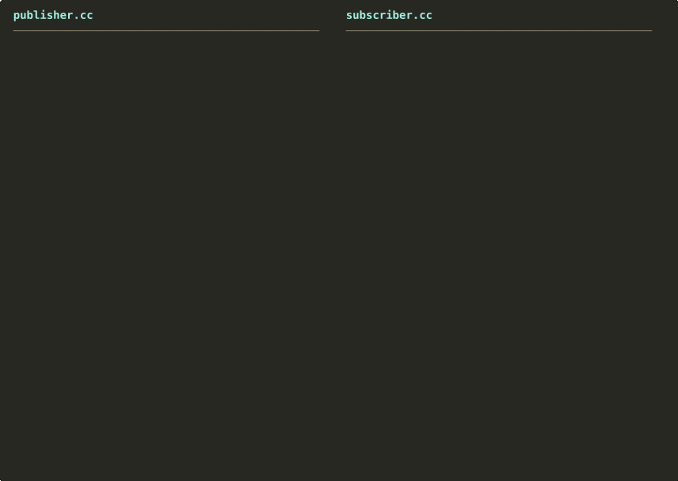
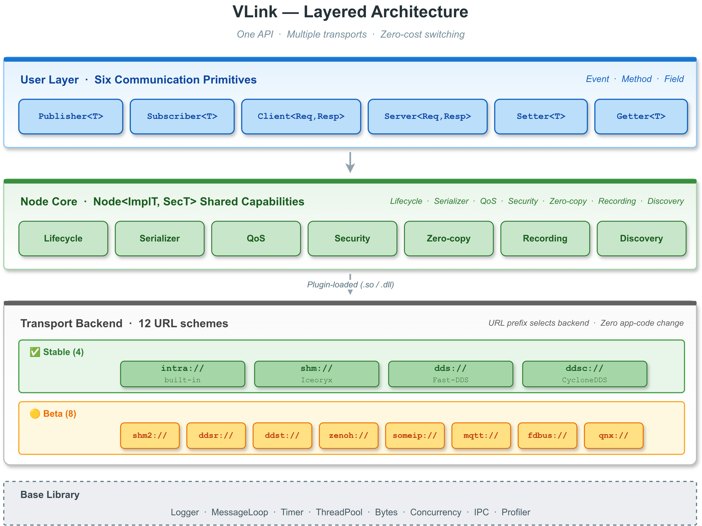
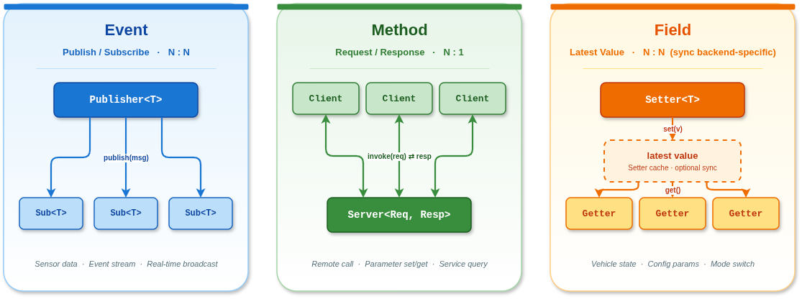

# VLink


**一套极简的 API，12 种传输，切换零代价**

**[官方网站: https://vlink.work](https://vlink.work)**

**[Github: https://github.com/thun-res/vlink](https://github.com/thun-res/vlink)**

   

[English](README.en_us.md) | 中文

VLink 是面向**自动驾驶与具身智能**的轻量级 C++ 通信中间件，定位为 ROS 2 的轻量化替代方案。

极简的 API，3-5 行即可完成通信，传输后端零成本切换，编译期自动推导序列化。支持 **12 种传输后端**、**14 种序列化格式**、**3 种通信模型**、**9 个 CLI 工具**，以及可选的 Foxglove / Rerun 可视化桥接。

---

## 📚 文档

### Part I — 入门

| 文档                                          | 内容                              |
| --------------------------------------------- | --------------------------------- |
| [技术白皮书](doc/00-whitepaper.md)            | 背景、定位、整体架构与深度技术论文 |
| [构建指南](doc/01-build.md)                   | CMake / Conan / 集成 / 跨平台     |
| [示例代码](doc/22-examples.md)                | 各场景完整可运行示例（最快上手路径） |

### Part II — 核心通信模型

| 文档                                          | 内容                              |
| --------------------------------------------- | --------------------------------- |
| [Event 模型](doc/03-event-model.md)           | Publisher / Subscriber（发布订阅） |
| [Method 模型](doc/04-method-model.md)         | Client / Server（请求响应）       |
| [Field 模型](doc/05-field-model.md)           | Setter / Getter（状态同步）       |
| [序列化](doc/06-serialization.md)             | 14 种序列化类型与自动推断         |

### Part III — 传输与常用能力

| 文档                                          | 内容                              |
| --------------------------------------------- | --------------------------------- |
| [传输后端](doc/07-transport.md)               | 12 种后端详解与 URL 格式          |
| [QoS](doc/08-qos.md)                          | 服务质量配置与策略                |
| [零拷贝](doc/10-zerocopy.md)                  | CameraFrame / PointCloud / OccupancyGrid / Tensor / ObjectArray / AudioFrame / RawData（大数据量必备） |
| [基础库](doc/11-base-library.md)              | Logger / MessageLoop / Timer / ThreadPool / 并发 / IPC / Profiler |
| [录制与回放](doc/12-bag-recording.md)         | Bag / MCAP 文件格式与 API         |
| [CLI 工具](doc/13-cli-tools.md)               | 9 个命令行工具完整参考            |
| [环境变量](doc/21-environment-vars.md)        | `VLINK_*` 配置变量参考            |

### Part IV — 工具与可视化

| 文档                                          | 内容                              |
| --------------------------------------------- | --------------------------------- |
| [Viewer](doc/14-viewer.md)                    | Qt 桌面工具：Viewer / Player / Analyzer |
| [WebViz](doc/15-webviz.md)                    | vlink-foxglove / vlink-rerun 可视化桥接 |
| [Proxy](doc/16-proxy.md)                      | ProxyServer / ProxyAPI            |
| [服务发现](doc/17-discovery.md)               | UDP 组播发现与拓扑                |

### Part V — 进阶主题

| 文档                                          | 内容                              |
| --------------------------------------------- | --------------------------------- |
| [节点基类](doc/02-node-lifecycle.md)          | Node 基类模板底层共享接口与生命周期（init/deinit/interrupt） |
| [安全加密](doc/09-security.md)                | AES-128-GCM AEAD、RSA 混合握手与自定义加密回调 |

### Part VI — 扩展与贡献

| 文档                                          | 内容                              |
| --------------------------------------------- | --------------------------------- |
| [C API](doc/18-c-api.md)                      | C 封装与多语言 FFI（六原语数据面） |
| [扩展开发](doc/19-extensions.md)              | 插件系统与自定义传输              |
| [测试与覆盖率](doc/20-testing.md)             | doctest 框架与 gcov/lcov          |
| [PR 规范](doc/92-pr-conventions.md)           | 分支、提交、代码风格与 CI 门槛    |

### 速查与参考

| 文档                                          | 内容                              |
| --------------------------------------------- | --------------------------------- |
| [速查卡](doc/90-cheatsheet.md)                | 单页 API / URL / QoS / CLI / 环境变量速查 |
| [故障排查](doc/91-troubleshooting.md)         | 按症状索引的问题处理手册          |
| [CHANGELOG](CHANGELOG.md)                     | 版本更新记录                      |

---

## 🚀 30 秒上手



```cpp
Publisher<Imu> pub("dds://sensor/imu");              // 跨机器 DDS
Publisher<Imu> pub("shm://sensor/imu");              // 同机共享内存
Publisher<Imu> pub("intra://sensor/imu");            // 进程内

Publisher<Imu> pub("dds://sensor/lidar?qos=sensor"); // QoS profile
Publisher<Imu> pub("shm://sensor/image?depth=10");   // 历史深度
```

URL 语法见 [传输后端](doc/07-transport.md)。

---

## 🏛️ 软件架构



---

## 🚌 传输后端

| Scheme | 底层 | 范围 | 零拷贝 | 状态 |
| --- | --- | --- | :---: | :---: |
| `intra://` | 无锁队列 | 进程内 | ✅ | ✅ 稳定 |
| `shm://` | Iceoryx | 同机跨进程 | ✅ | ✅ 稳定 |
| `dds://` | Fast-DDS | 跨机 | — | ✅ 稳定 |
| `ddsc://` | CycloneDDS | 跨机 | — | ✅ 稳定 |
| `shm2://` | Iceoryx2 | 同机 | ✅ | 🟡 Beta |
| `ddsr://` | RTI Connext | 跨机 | — | 🟡 Beta |
| `ddst://` | TravoDDS（国产 DDS 实现） | 跨机 | — | 🟡 Beta |
| `zenoh://` | Zenoh | 跨机/云边 | — | 🟡 Beta |
| `someip://` | vsomeip | 车载以太网 | — | 🟡 Beta |
| `mqtt://` | Paho MQTT | 云端 | — | 🟡 Beta |
| `fdbus://` | FDBus | 同机 | — | 🟡 Beta |
| `qnx://` | QNX IPC | 同机（QNX） | — | 🟡 Beta |

---

## 📡 通信模型



**Event — 发布/订阅**

```cpp
Publisher<Imu> publisher("dds://sensor/imu");
publisher.publish(msg);

Subscriber<Imu> subscriber("dds://sensor/imu");
subscriber.listen([](const Imu& msg) { process(msg); });
```

**Method — 请求/响应**

```cpp
Server<Req, Resp> server("dds://calc/add");
server.listen([](const Req& req, Resp& resp) {
  resp.set_sum(req.left() + req.right());
});

Client<Req, Resp> client("dds://calc/add");
if (auto r = client.invoke(req, 3s)) { use(*r); }   // 同步 → std::optional<Resp>
client.invoke(req, [](const Resp& r) { use(r); });  // 异步回调
auto future = client.async_invoke(req);             // future
Client<Req> fire("dds://event/notify");             // RespT 默认为 EmptyType
fire.send(req);                                     // 仅发送（fire-and-forget，仅 RespT = EmptyType 时可用）
```

**Field — 状态同步**

```cpp
Setter<Status> setter("shm://vehicle/status");
setter.set(status);   // 新 Getter 连接时自动收到最新值

Getter<Status> getter("shm://vehicle/status");
getter.listen([](auto& s) { use(s); });
getter.set_change_reporting(true);  // 仅变化时触发
```

---

## 🔧 快速开始（构建）

```bash
cmake -B build -DCMAKE_BUILD_TYPE=Release
cmake --build build -j
ctest --test-dir build --output-on-failure
sudo cmake --install build
```

CMake 集成：

```cmake
# 导入指定模块
find_package(vlink REQUIRED COMPONENTS shm dds)
target_link_libraries(my_app PRIVATE vlink::vlink vlink::shm vlink::dds)

# 导入全部模块
find_package(vlink REQUIRED COMPONENTS all)
target_link_libraries(my_app PRIVATE vlink::all)

# 导入生成 proto 目标
vlink_generate_cpp(TARGET example_gen PROTO example1.proto example2.proto)
target_link_libraries(my_app PRIVATE example_gen)
```

完整内容参见 [CMake 目标列表](doc/01-build.md#152-cmake-目标列表) 以及 [构建指南](doc/01-build.md)。

---

## 💻 平台支持

| 平台 | 架构 | 编译器 | 状态 |
| --- | --- | --- | :---: |
| Linux | x86_64 / aarch64 | GCC 9+ / Clang 10+ | ✅ 稳定 |
| Windows 10+ | x86_64 | MSVC 2019+ / MinGW | ✅ 稳定 |
| macOS 10.15+ | x86_64 / arm64 | AppleClang 12+ | 🟡 Beta |
| Android | aarch64 / x86_64 | NDK Clang r25+ | ✅ 稳定 |
| QNX 7.x/8.x | aarch64 / x86_64 | QCC (QNX SDP) | ✅ 稳定 |

---

## 📁 项目结构

```
vlink/
├── include/vlink/      公共头文件（6 大通信原语 + 基础库 + 扩展 + 零拷贝）
├── src/                核心库实现
├── modules/            12 种传输后端实现
├── cli/                9 个命令行工具
├── proxy/              vlink-proxy 可执行文件 + ProxyServer / ProxyAPI 库
├── viewer/             Qt 桌面可视化工具（默认 OFF，需 ENABLE_VIEWER=ON）
├── webviz/             vlink-foxglove / vlink-rerun 桥接可执行文件（默认 OFF）
├── c_api/              C API（供 Python / Rust 等 FFI 调用，仅数据面）
├── python_api/         nanobind Python 绑定（默认 OFF，需 ENABLE_PYTHON_API=ON）
├── examples/           使用示例（默认 OFF，14 个分类）
├── test/               doctest 主测试套件（vlink-test）
├── doc/                详细文档
├── tools/              构建/打包/版本管理等辅助脚本
├── cmake/              CMake 工具链与 Find 模块
├── thirdparty/         第三方依赖与补丁
├── packup/             发布打包
├── CMakeLists.txt      顶层 CMake 入口
├── conanfile.py        Conan recipe
└── Android.bp          Android.bp（Soong 构建规则）
```

---

## 🤝 欢迎参与贡献

vlink 目前由 Thun Lu 个人维护。这是一个长期承诺的项目，但响应时间和路线图速度受单人精力限制。我们欢迎 PR、issue 与文档改进。

提交前请通读 [PR 规范](doc/92-pr-conventions.md)。

---

## 📜 许可证

[Apache License 2.0](LICENSE) — 可自由用于商业项目。

Copyright (C) 2026 Thun Lu. All rights reserved.
