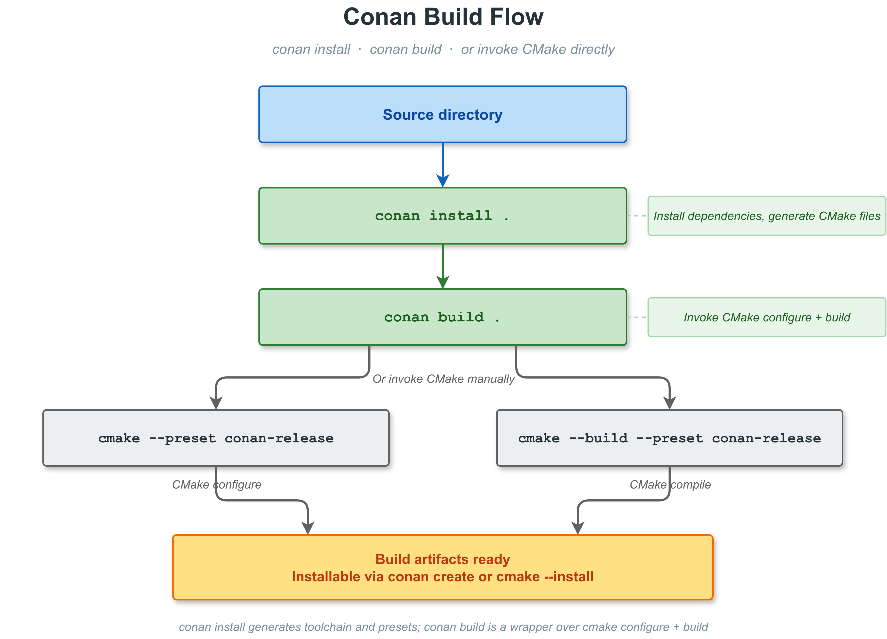
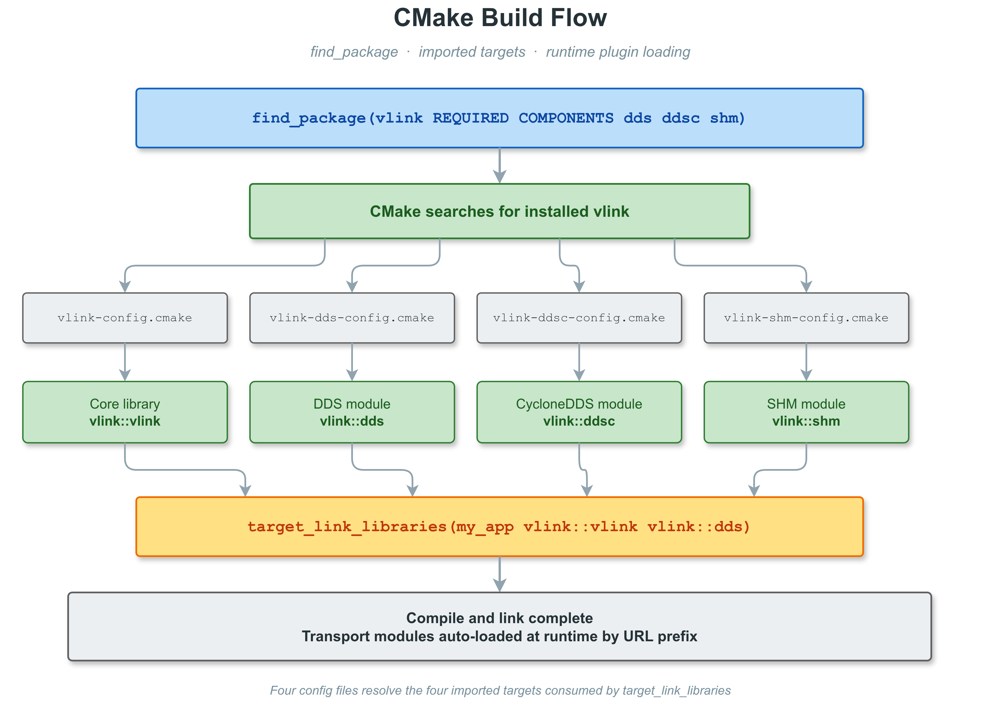
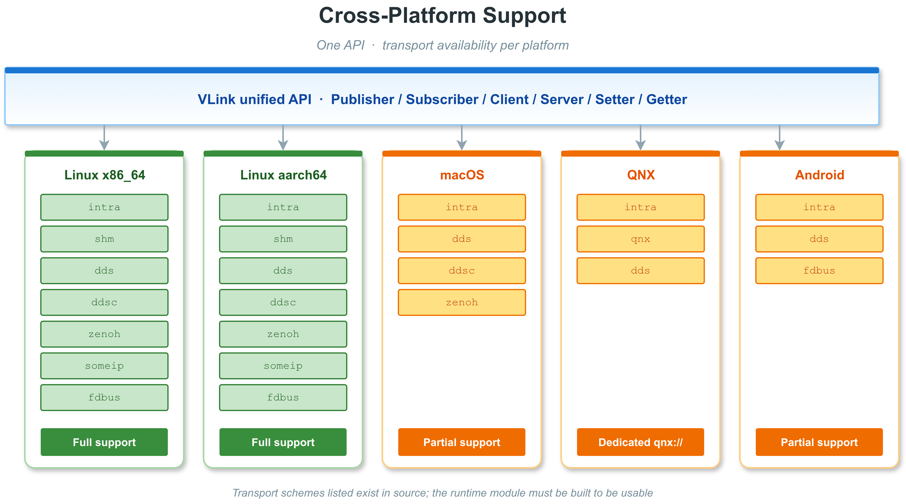

# 1. 构建指南

> 版本：2.0.0 | 构建系统：CMake 3.15+ | 可选包管理：Conan 2.x

---

## 目录

- [1.1 环境依赖](#11-环境依赖)
- [1.2 获取源码](#12-获取源码)
- [1.3 CMake 构建](#13-cmake-构建)
- [1.4 Conan 构建](#14-conan-构建)
- [1.5 CMake 集成](#15-cmake-集成)
- [1.6 Protobuf / FlatBuffers / IDL 集成](#16-protobuf--flatbuffers--idl-集成)
- [1.7 交叉编译与跨平台](#17-交叉编译与跨平台)
- [1.8 安装路径结构](#18-安装路径结构)
- [1.9 常见问题排查](#19-常见问题排查)

---

## 1.1 环境依赖

### 1.1.1 必选依赖

| 依赖         | 最低版本                    | 用途              | 安装命令（Ubuntu）           |
| ------------ | --------------------------- | ----------------- | ---------------------------- |
| CMake        | 3.15（上限 3.31）           | 构建系统          | `sudo apt install cmake`     |
| C++ 编译器   | GCC 9 / Clang 10 / MSVC 2019 | C++17 支持       | `sudo apt install g++`       |
| pthreads     | 系统自带                    | 线程支持（POSIX） | 系统已内置                   |

> CMakeLists.txt 声明 `cmake_minimum_required(VERSION 3.15...3.31)`。GCC 7/8 缺少完整 `std::filesystem`，需额外链接 `-lstdc++fs`；GCC 9+ 无需特殊处理。

### 1.1.2 可选依赖（按功能）

| 依赖库        | 功能                            | 对应 CMake 选项              | 安装命令（Ubuntu 22.04）                                    |
| ------------- | ------------------------------- | ---------------------------- | ----------------------------------------------------------- |
| OpenSSL       | 消息加密（AES）                 | `ENABLE_SECURITY=ON`         | `sudo apt install libssl-dev`                               |
| SQLite3       | 数据库录包/回放                 | `ENABLE_SQLITE=ON`           | `sudo apt install libsqlite3-dev`                           |
| zstd          | 数据压缩                        | `ENABLE_ZSTD=ON`             | `sudo apt install libzstd-dev`                              |
| Protobuf      | `vlink-eproto` / `vlink-dump` / `vlink-proxy` | `ENABLE_CLI_EPROTO` / `ENABLE_CLI_DUMP` / `ENABLE_PROXY` | `sudo apt install libprotobuf-dev protobuf-compiler` |
| FlatBuffers   | `vlink-efbs`                    | `ENABLE_CLI_EFBS=ON`         | `sudo apt install libflatbuffers-dev flatbuffers-compiler`  |
| Fast-DDS      | DDS 传输后端 (`dds://`)         | 模块依赖                     | 见 [FastDDS 官方文档](https://fast-dds.docs.eprosima.com/)  |
| CycloneDDS    | DDS 传输后端 (`ddsc://`)        | 模块依赖                     | 见 [CycloneDDS 官方文档](https://github.com/eclipse-cyclonedds/cyclonedds) 或源码编译 |
| Iceoryx       | 共享内存传输 (`shm://`)         | 模块依赖                     | 见 [Iceoryx 官方文档](https://iceoryx.io/)                  |
| Iceoryx2      | 共享内存传输 (`shm2://`)        | 模块依赖                     | 见 [Iceoryx2 官方文档](https://iceoryx2.io/)                |
| vsomeip       | SOME/IP 传输 (`someip://`)      | 模块依赖                     | 源码编译安装                                                |
| zenoh-c       | Zenoh 传输 (`zenoh://`)         | 模块依赖                     | 见 [Zenoh 官方文档](https://zenoh.io/)                      |
| Paho MQTT C   | MQTT 传输 (`mqtt://`)           | 模块依赖                     | 见 [Eclipse Paho](https://github.com/eclipse/paho.mqtt.c)  |
| spdlog        | 日志后端（默认）                | `SELECT_LOG_BACKEND=spdlog`  | 内嵌 thirdparty，无需额外安装                               |
| quill         | 高性能日志后端                  | `SELECT_LOG_BACKEND=quill`   | 内嵌 thirdparty，无需额外安装                               |
| DLT           | GENIVI 车载日志                 | `SELECT_LOG_BACKEND=dlt`     | `sudo apt install libdlt-dev`                               |

### 1.1.3 各平台编译器要求

| 平台      | 推荐编译器              | C++ 标准 | 备注                               |
| --------- | ----------------------- | -------- | ---------------------------------- |
| Linux     | GCC 9+ / Clang 10+      | C++17    | GCC 7/8 需要 `-lstdc++fs`          |
| macOS     | Apple Clang 12+         | C++17    | 需要 macOS 10.15+                  |
| Windows   | MSVC 2019+ / Clang-cl   | C++17    | 需要 Windows SDK 10                |
| QNX 7.x   | QNX Compiler (GCC 8.3)  | C++17    | 需要 QNX SDP 7.1                   |
| QNX 8.x   | QNX Compiler (GCC 12.2) | C++17    | 推荐 QNX SDP 8.0                   |
| Android   | NDK r25+                | C++17    | API Level 21+，推荐 API 30+        |

---

## 1.2 获取源码

```bash
# 克隆主仓库（包含所有子模块）
git clone https://github.com/thun-res/vlink.git
cd vlink

# 如需特定版本
git checkout v2.0.0
```

查看版本号：

```bash
cat version.txt
# 输出: 2.0.0
```

---

## 1.3 CMake 构建

### 1.3.1 最简编译（仅核心库 + intra 模块）

```bash
mkdir build && cd build

cmake .. \
    -DCMAKE_BUILD_TYPE=Release \
    -DENABLE_SECURITY=OFF \
    -DENABLE_SQLITE=OFF \
    -DENABLE_ZSTD=OFF \
    -DENABLE_CLI_INFO=OFF \
    -DENABLE_CLI_BAG=OFF \
    -DENABLE_CLI_EPROTO=OFF \
    -DENABLE_CLI_EFBS=OFF \
    -DENABLE_CLI_LIST=OFF \
    -DENABLE_CLI_MONITOR=OFF \
    -DENABLE_CLI_DUMP=OFF \
    -DENABLE_CLI_CHECK=OFF \
    -DENABLE_CLI_BENCH=OFF \
    -DENABLE_PROXY=OFF \
    -DENABLE_TEST=OFF

cmake --build . -j$(nproc)
```

### 1.3.2 标准编译（推荐，全功能）

```bash
mkdir build && cd build

cmake .. \
    -DCMAKE_BUILD_TYPE=Release \
    -DCMAKE_INSTALL_PREFIX=/usr/local

cmake --build . -j$(nproc)

# 运行测试
ctest --output-on-failure

# 安装
sudo cmake --install .
```

### 1.3.3 使用 Ninja 加速编译

```bash
cmake .. -G Ninja \
    -DCMAKE_BUILD_TYPE=Release

ninja -j$(nproc)
```

### 1.3.4 编译输出目录

编译完成后，产物位于 `<build_dir>/output/`：

```
output/
├── vlink-setup.sh        # 环境配置脚本（Linux/macOS）
├── bin/                  # 可执行文件（CLI 工具、示例）
│   ├── vlink-info
│   ├── vlink-bag
│   ├── vlink-list
│   ├── vlink-monitor
│   ├── vlink-dump
│   ├── vlink-check
│   ├── vlink-eproto
│   ├── vlink-efbs
│   └── vlink-bench
├── lib/                  # 库文件
│   ├── libvlink.so.2.0   # 核心库
│   ├── libvlink-dds.so   # DDS 模块
│   ├── libvlink-ddsc.so  # CycloneDDS 模块
│   ├── libvlink-shm.so   # Iceoryx 模块
│   ├── libvlink-intra.so # intra 模块
│   └── ...
└── etc/
    └── vlink/
        └── vlink-options.txt # 编译配置摘要
```

### 1.3.5 CMake 构建选项详解

运行以下命令查看所有选项及其当前值：

```bash
cmake -B build -S . -LH
```

#### 1.3.5.1 基础选项

| 选项名                 | 默认值   | 类型   | 说明                                                           |
| ---------------------- | -------- | ------ | -------------------------------------------------------------- |
| `BUILD_SHARED_LIBS`    | `ON`     | BOOL   | 构建动态库（`.so`/`.dll`）；`OFF` 时构建静态库（`.a`/`.lib`）  |
| `CMAKE_BUILD_TYPE`     | `Release`| STRING | 构建类型：`Release`/`Debug`/`RelWithDebInfo`/`MinSizeRel`      |
| `ENABLE_CXX_STD_20`    | 自动检测 | BOOL   | 启用 C++20 特性；若编译器支持则自动开启                        |
| `ENABLE_CCACHE_BUILD`  | `OFF`    | BOOL   | 启用 ccache 编译缓存加速（需要系统安装 ccache）                |
| `ENABLE_CPM_BUILD`     | `OFF`    | BOOL   | 启用 CPM（CMake Package Manager）自动下载依赖                  |
| `ENABLE_CPM_WHOLE_BUILD` | `OFF`  | BOOL   | 启用 CPM 全量构建（包含传输模块依赖，覆盖 `ENABLE_CPM_BUILD`） |
| `ENABLE_DOC`           | `OFF`    | BOOL   | 构建 Doxygen 文档                                              |
| `INSTALL_CONFIG_DIR`   | `${CMAKE_INSTALL_SYSCONFDIR}/${PROJECT_NAME}` | STRING | 配置文件安装目录（相对于安装前缀），默认 `etc/vlink` |

#### 1.3.5.2 功能特性选项

| 选项名              | 默认值 | 依赖库                     | 说明                                                        |
| ------------------- | ------ | -------------------------- | ----------------------------------------------------------- |
| `ENABLE_C_API`      | `ON`   | 无                         | 编译纯 C API 封装层（`c_api/`），覆盖六个通信原语的数据面接口 |
| `ENABLE_PYTHON_API` | `OFF`  | Python + nanobind           | 编译 Python 绑定（`python_api/`，基于 nanobind）            |
| `ENABLE_SECURITY`   | `ON`   | OpenSSL                    | 启用消息加密（AES via OpenSSL Crypto）；找不到时自动关闭    |
| `ENABLE_SQLITE`     | `ON`   | SQLite3                    | 启用 SQLite 数据库支持（录包、数据存储）；找不到时自动关闭  |
| `ENABLE_ZSTD`       | `ON`   | zstd                       | 启用 Zstandard 压缩（bag 文件压缩等）；找不到时自动关闭     |
| `ENABLE_PROXY`      | `ON`   | Protobuf + DDS             | 编译代理层（协议桥接）；需要 Protobuf 且至少一种 DDS 后端   |
| `ENABLE_VIEWER`     | `OFF`  | Qt + `ENABLE_PROXY`        | 编译可视化查看器；需要 Qt 和代理层                          |
| `ENABLE_WEBVIZ`     | `OFF`  | `ENABLE_PROXY`             | 编译 WebViz 桥接（Foxglove / Rerun）；依赖代理层            |
| `ENABLE_COMPLETIONS`| `ON`   | 无                         | 安装 bash / zsh 补全脚本                                    |

#### 1.3.5.3 CLI 工具选项

| 选项名               | 默认值 | 额外依赖   | 说明                                                         |
| -------------------- | ------ | ---------- | ------------------------------------------------------------ |
| `ENABLE_CLI_INFO`    | `ON`   | 无         | `vlink-info`：显示 VLink 运行时信息                          |
| `ENABLE_CLI_BAG`     | `ON`   | 无         | `vlink-bag`：录包/回放工具（SQLite / MCAP 格式）              |
| `ENABLE_CLI_EPROTO`  | `ON`   | Protobuf   | `vlink-eproto`：Protobuf 消息编解码工具；找不到 Protobuf 时自动关闭 |
| `ENABLE_CLI_EFBS`    | `ON`   | FlatBuffers | `vlink-efbs`：FlatBuffers 消息编解码工具；找不到 FlatBuffers 时自动关闭 |
| `ENABLE_CLI_LIST`    | `ON`   | 无         | `vlink-list`：列出当前活跃的话题/服务                        |
| `ENABLE_CLI_MONITOR` | `ON`   | 无         | `vlink-monitor`：实时监控话题流量                            |
| `ENABLE_CLI_DUMP`    | `ON`   | Protobuf   | `vlink-dump`：消息内容转储工具；找不到 Protobuf 时自动关闭   |
| `ENABLE_CLI_CHECK`   | `ON`   | 无         | `vlink-check`：系统环境检查工具                              |
| `ENABLE_CLI_BENCH`   | `ON`   | 无         | `vlink-bench`：性能基准测试工具                              |

#### 1.3.5.4 测试选项

| 选项名                 | 默认值  | 说明                                                          |
| ---------------------- | ------- | ------------------------------------------------------------- |
| `ENABLE_TEST`          | `OFF`   | 编译单元测试（doctest 框架）；`ON` 时自动启用 `enable_testing()` |
| `ENABLE_TEST_WARN`     | `OFF`   | 在测试构建中开启额外编译警告（用于代码质量检查）              |
| `ENABLE_TEST_SANITIZE` | `OFF`   | 启用地址检测（ASan）；仅 Linux/macOS + GCC/Clang 有效         |
| `ENABLE_TEST_COVERAGE` | `OFF`   | 启用代码覆盖率统计（gcov/lcov）；需要 GCC 编译                |

#### 1.3.5.5 示例选项

| 选项名                  | 默认值                                       | 说明                                                      |
| ----------------------- | -------------------------------------------- | --------------------------------------------------------- |
| `ENABLE_EXAMPLES`       | `CMAKE_EXPORT_COMPILE_COMMANDS` 或 `CMAKE_CXX_CLANG_TIDY` 开启时自动 `ON`，其余 `OFF` | 编译 `examples/` 下的示例程序                  |
| `ENABLE_WHOLE_EXAMPLES` | `OFF`                                        | `ENABLE_EXAMPLES=ON` 时仅构建 `examples/samples/`；再置此项为 `ON` 才会构建全部 14 个示例分类 |

#### 1.3.5.6 日志后端选项

```cmake
set(SELECT_LOG_BACKEND "spdlog" CACHE STRING "Log backend [spdlog|quill|dlt|native]")
```

| 值        | 依赖库           | 说明                                               |
| --------- | ---------------- | -------------------------------------------------- |
| `spdlog`  | 内嵌（无需安装） | 默认。功能完整的结构化日志，Linux/macOS/Windows    |
| `quill`   | 内嵌（无需安装） | 极低延迟异步日志，适合性能敏感场景                 |
| `dlt`     | libdlt（GENIVI） | 车载 GENIVI DLT 日志，集成 AUTOSAR 诊断            |
| `native`  | 无               | Android logcat / QNX slog2 平台原生日志，默认用于 Android/QNX |

### 1.3.6 各种构建配置示例

#### 1.3.6.1 Debug 调试构建

```bash
cmake -B build-debug \
    -DCMAKE_BUILD_TYPE=Debug \
    -DENABLE_TEST=ON \
    -DENABLE_TEST_WARN=ON

cmake --build build-debug -j$(nproc)
cd build-debug && ctest -V
```

> 提示：若未安装 vsomeip 守护进程，SOME/IP 相关测试会挂起。可通过 doctest 的 `-tce` 参数排除：
> ```bash
> ./build-debug/output/bin/vlink-test -tce="someip-*"
> ```

#### 1.3.6.2 Release 发布构建（最小化）

适合嵌入式或资源受限场景，关闭所有非必要功能：

```bash
cmake -B build-release-min \
    -DCMAKE_BUILD_TYPE=Release \
    -DBUILD_SHARED_LIBS=OFF \
    -DENABLE_SECURITY=OFF \
    -DENABLE_SQLITE=OFF \
    -DENABLE_ZSTD=OFF \
    -DENABLE_C_API=OFF \
    -DENABLE_CLI_INFO=OFF \
    -DENABLE_CLI_BAG=OFF \
    -DENABLE_CLI_EPROTO=OFF \
    -DENABLE_CLI_EFBS=OFF \
    -DENABLE_CLI_LIST=OFF \
    -DENABLE_CLI_MONITOR=OFF \
    -DENABLE_CLI_DUMP=OFF \
    -DENABLE_CLI_CHECK=OFF \
    -DENABLE_CLI_BENCH=OFF \
    -DENABLE_PROXY=OFF \
    -DENABLE_TEST=OFF \
    -DSELECT_LOG_BACKEND=native

cmake --build build-release-min -j$(nproc)
```

#### 1.3.6.3 带调试信息的 Release（RelWithDebInfo）

用于生产环境但保留符号，便于事后分析崩溃：

```bash
cmake -B build-reldbg \
    -DCMAKE_BUILD_TYPE=RelWithDebInfo \
    -DCMAKE_INSTALL_PREFIX=/opt/vlink

cmake --build build-reldbg -j$(nproc)
sudo cmake --install build-reldbg
```

#### 1.3.6.4 内存检测构建（ASan）

```bash
cmake -B build-sanitize \
    -DCMAKE_BUILD_TYPE=Debug \
    -DENABLE_TEST=ON \
    -DENABLE_TEST_SANITIZE=ON

cmake --build build-sanitize -j$(nproc)

# 运行测试时需设置 LD_LIBRARY_PATH，否则 ASan 可能无法正确加载动态库
cd build-sanitize
LD_LIBRARY_PATH=$(pwd)/output/lib:$LD_LIBRARY_PATH ctest --output-on-failure
```

> 注意：如需跳过已知的第三方库误报，可创建 ASan 抑制文件并通过环境变量指定：
> ```bash
> export LSAN_OPTIONS=suppressions=/path/to/your_asan_suppressions.txt
> ```

#### 1.3.6.5 代码覆盖率构建

```bash
cmake -B build-coverage \
    -DCMAKE_BUILD_TYPE=Debug \
    -DENABLE_TEST=ON \
    -DENABLE_TEST_COVERAGE=ON

cmake --build build-coverage -j$(nproc)
cd build-coverage

# 运行测试
ctest --output-on-failure

# 生成覆盖率报告（需要 lcov + genhtml）
lcov --capture --directory . --output-file coverage.info
lcov --remove coverage.info '*/thirdparty/*' '*/test/*' --output-file coverage.info
genhtml coverage.info --output-directory coverage-report
```

#### 1.3.6.6 仅构建静态库

```bash
cmake -B build-static \
    -DCMAKE_BUILD_TYPE=Release \
    -DBUILD_SHARED_LIBS=OFF

cmake --build build-static -j$(nproc)
```

#### 1.3.6.7 启用 C++20 特性

```bash
cmake -B build-cxx20 \
    -DCMAKE_BUILD_TYPE=Release \
    -DENABLE_CXX_STD_20=ON

cmake --build build-cxx20 -j$(nproc)
```

#### 1.3.6.8 使用 quill 高性能日志后端

```bash
cmake -B build-quill \
    -DCMAKE_BUILD_TYPE=Release \
    -DSELECT_LOG_BACKEND=quill

cmake --build build-quill -j$(nproc)
```

#### 1.3.6.9 构建 Doxygen 文档

```bash
# 安装 Doxygen
sudo apt install doxygen graphviz

cmake -B build-doc \
    -DENABLE_DOC=ON \
    -DENABLE_TEST=OFF

cmake --build build-doc --target doxygen
# 文档输出位于 build-doc/doc/html/
```

### 1.3.7 ccache 加速编译

ccache 可以缓存编译结果，在增量编译或 CI 场景中显著缩短编译时间。

```bash
# 安装 ccache
sudo apt install ccache

# 启用 ccache
cmake -B build \
    -DCMAKE_BUILD_TYPE=Release \
    -DENABLE_CCACHE_BUILD=ON

cmake --build build -j$(nproc)
```

验证 ccache 生效：

```bash
ccache -s  # 查看缓存命中统计
```

### 1.3.8 CPM 依赖管理

VLink 支持通过 [CPM.cmake](https://github.com/cpm-cmake/CPM.cmake) 自动下载和构建依赖，
适合无法通过系统包管理器安装依赖的场景（如离线环境下提前镜像）。

#### 1.3.8.1 CPM 基础构建

启用后 CMake 会自动下载 OpenSSL、SQLite3、Protobuf 等依赖：

```bash
cmake -B build-cpm \
    -DCMAKE_BUILD_TYPE=Release \
    -DENABLE_CPM_BUILD=ON

cmake --build build-cpm -j$(nproc)
```

#### 1.3.8.2 CPM 全量构建

`ENABLE_CPM_WHOLE_BUILD=ON` 会同时下载并构建传输模块依赖（Fast-DDS、CycloneDDS、Iceoryx 等）：

```bash
cmake -B build-cpm-whole \
    -DCMAKE_BUILD_TYPE=Release \
    -DENABLE_CPM_WHOLE_BUILD=ON

cmake --build build-cpm-whole -j$(nproc)
```

> 注意：`ENABLE_CPM_WHOLE_BUILD=ON` 会隐含启用 CPM 构建（CMake 中通过 `OR` 逻辑判断，无需同时设置 `ENABLE_CPM_BUILD`）。
> 首次编译时会下载大量源码，建议在网络状况良好的环境下使用，或预先配置 CPM 的本地缓存目录：
>
> ```bash
> export CPM_SOURCE_CACHE=~/.cpm-cache
> ```

---

## 1.4 Conan 构建

[Conan](https://conan.io/) 是一个专为 C/C++ 设计的跨平台包管理器，可自动下载、构建、缓存第三方库，通过 Profile 机制实现可复现构建。VLink 提供了完整的 `conanfile.py` 支持 Conan 2.x。

### 1.4.1 安装与配置 Conan

```bash
# 通过 pip 安装（推荐）
pip install conan

# 验证安装
conan --version
# 输出类似：Conan version 2.x.x

# 初始化配置和默认 profile
conan profile detect --force

# 查看默认 profile
conan profile show
```

> 注意：VLink 的 `conanfile.py` 基于 Conan 2.x API。如果系统中安装的是 Conan 1.x，需要升级：`pip install --upgrade conan`

配置远程仓库：

```bash
conan remote list
# 默认使用 ConanCenter: https://center.conan.io

# 如需使用企业私有仓库
conan remote add my-nexus https://nexus.example.com/repository/conan-hosted
```

### 1.4.2 基本使用流程



**第一步：安装依赖**

```bash
cd /path/to/vlink

conan install . \
    --output-folder=conan \
    --build=missing \
    --settings=build_type=Release
```

执行后 `conan/` 目录主要包含：

- `conan_toolchain.cmake`：CMake 工具链文件
- `*-config.cmake` / `*Config.cmake`：各依赖的 CMake find 文件（由 `CMakeDeps` generator 生成）
- 顶层 `CMakePresets.json`：由 Conan 追加的 `conan-release` / `conan-debug` 预设

**第二步：配置与编译**

```bash
# 方式 A：使用 conan build（推荐）
conan build . --output-folder=conan

# 方式 B：手动调用 CMake
cmake --preset conan-release
cmake --build conan -j$(nproc)

# 方式 C：完整一命令
conan install . --build=missing -s build_type=Release && conan build .
```

**第三步：安装（可选）**

```bash
cd conan
cmake --install . --prefix /usr/local
```

### 1.4.3 Conan 选项与 CMake 选项对照表

Conan 选项名使用小写下划线命名，与 CMake 选项一一对应：

| Conan 选项 (`-o "vlink/*:..."`) | CMake 选项 (`-D...`)   | 默认值（Conan / CMake）  |
| ------------------------------- | ---------------------- | ------------------------ |
| `shared`                        | `BUILD_SHARED_LIBS`    | `False` / `ON`           |
| `fPIC`                          | —（Conan 专有）        | `True` / —               |
| `enable_cxx_std_20`             | `ENABLE_CXX_STD_20`   | `False` / 自动检测       |
| `enable_c_api`                  | `ENABLE_C_API`         | `True` / `ON`            |
| `enable_python_api`             | `ENABLE_PYTHON_API`    | `False` / `OFF`          |
| `enable_security`               | `ENABLE_SECURITY`      | `True` / `ON`            |
| `enable_sqlite`                 | `ENABLE_SQLITE`        | `True` / `ON`            |
| `enable_zstd`                   | `ENABLE_ZSTD`          | `True` / `ON`            |
| `enable_proxy`                  | `ENABLE_PROXY`         | `True` / `ON`            |
| `enable_viewer`                 | `ENABLE_VIEWER`        | `False` / `OFF`          |
| `enable_viewer_ffmpeg`          | —（Conan 专有）        | `False` / —              |
| `enable_viewer_osg`             | —（Conan 专有）        | `False` / —              |
| `enable_webviz`                 | `ENABLE_WEBVIZ`        | `False` / `OFF`          |
| `enable_webviz_foxglove`        | `ENABLE_WEBVIZ_FOXGLOVE` | `False` / `ON`         |
| `enable_webviz_rerun`           | `ENABLE_WEBVIZ_RERUN`  | `False` / `OFF`          |
| `enable_cli_info`               | `ENABLE_CLI_INFO`      | `True` / `ON`            |
| `enable_cli_bag`                | `ENABLE_CLI_BAG`       | `True` / `ON`            |
| `enable_cli_eproto`             | `ENABLE_CLI_EPROTO`    | `True` / `ON`            |
| `enable_cli_efbs`               | `ENABLE_CLI_EFBS`      | `True` / `ON`            |
| `enable_cli_list`               | `ENABLE_CLI_LIST`      | `True` / `ON`            |
| `enable_cli_monitor`            | `ENABLE_CLI_MONITOR`   | `True` / `ON`            |
| `enable_cli_dump`               | `ENABLE_CLI_DUMP`      | `True` / `ON`            |
| `enable_cli_check`              | `ENABLE_CLI_CHECK`     | `True` / `ON`            |
| —（Conan 未暴露）               | `ENABLE_CLI_BENCH`     | — / `ON`                 |
| `enable_completions`            | `ENABLE_COMPLETIONS`   | `False` / `ON`           |
| `install_config_dir`            | `INSTALL_CONFIG_DIR`   | `etc/vlink` / `etc/vlink`|
| `enable_cpm_build`              | `ENABLE_CPM_BUILD`     | `False` / `OFF`          |
| `enable_cpm_whole_build`        | `ENABLE_CPM_WHOLE_BUILD` | `False` / `OFF`        |
| `enable_doc`                    | `ENABLE_DOC`           | `False` / `OFF`          |
| `enable_examples`               | `ENABLE_EXAMPLES`      | `False` / `OFF`          |
| `enable_test`                   | `ENABLE_TEST`          | `False` / `OFF`          |
| `enable_test_warn`              | `ENABLE_TEST_WARN`     | `False` / `OFF`          |
| `enable_test_sanitize`          | `ENABLE_TEST_SANITIZE` | `False` / `OFF`          |
| `enable_test_coverage`          | `ENABLE_TEST_COVERAGE` | `False` / `OFF`          |
| `select_log_backend`            | `SELECT_LOG_BACKEND`   | `spdlog` / `spdlog`     |

#### 1.4.3.1 自动触发逻辑

`conanfile.py` 中的 `set_options()` 方法实现以下自动推导：

- `enable_cpm_whole_build=True` 会自动开启 `enable_cpm_build`
- 检测到 `QT_DIR` 环境变量则自动开启 `enable_viewer` 和 `enable_viewer_ffmpeg`
- 检测到 `OSG_DIR` 环境变量则自动开启 `enable_viewer_osg`

### 1.4.4 Conan 依赖关系

当 `enable_cpm_build=False` 且 `enable_cpm_whole_build=False` 时（默认），
Conan 会按 `conanfile.py` 的 `requirements()` 自动解析以下依赖：

```
sqlite3/3.51.3
openssl/3.0.20
protobuf/3.21.12
zstd/1.5.7
fast-dds/2.11.2
cyclonedds/0.10.5
iceoryx/2.0.6

# 条件依赖
flatbuffers/25.9.23    (当 enable_cli_efbs=True 时)
ffmpeg/8.1.1           (当 enable_viewer=True 且 enable_viewer_ffmpeg=True 时)
```

当 `enable_cpm_build=True` 时，仅通过 Conan 安装核心依赖（sqlite3、openssl、protobuf），
传输后端依赖由 CPM 在 CMake 阶段自动下载编译。

### 1.4.5 Conan 构建配置示例

#### 1.4.5.1 最小化构建

```bash
conan install . \
    --build=missing \
    -s build_type=Release \
    -o "vlink/*:shared=True" \
    -o "vlink/*:enable_security=False" \
    -o "vlink/*:enable_sqlite=False" \
    -o "vlink/*:enable_zstd=False" \
    -o "vlink/*:enable_c_api=False" \
    -o "vlink/*:enable_cli_info=False" \
    -o "vlink/*:enable_cli_bag=False" \
    -o "vlink/*:enable_cli_eproto=False" \
    -o "vlink/*:enable_cli_efbs=False" \
    -o "vlink/*:enable_cli_list=False" \
    -o "vlink/*:enable_cli_monitor=False" \
    -o "vlink/*:enable_cli_dump=False" \
    -o "vlink/*:enable_cli_check=False" \
    -o "vlink/*:enable_proxy=False" \
    -o "vlink/*:enable_test=False"

conan build .
```

#### 1.4.5.2 Debug 调试构建（含测试和内存检测）

```bash
conan install . \
    --build=missing \
    -s build_type=Debug \
    -o "vlink/*:enable_test=True" \
    -o "vlink/*:enable_test_warn=True" \
    -o "vlink/*:enable_test_sanitize=True"

conan build .
```

#### 1.4.5.3 CPM 全量构建（不依赖系统预装的传输库）

适合 CI 环境或全新系统：

```bash
conan install . \
    --build=missing \
    -s build_type=Release \
    -o "vlink/*:enable_cpm_whole_build=True"

conan build .
```

### 1.4.6 在应用项目中通过 Conan 消费 VLink

#### 1.4.6.1 方式一：conanfile.txt（简单项目）

```ini
[requires]
vlink/2.0.0

[generators]
CMakeDeps
CMakeToolchain

[options]
vlink/*:shared=True
vlink/*:enable_security=True
```

```bash
conan install . --build=missing -s build_type=Release
cmake --preset conan-release
cmake --build build
```

#### 1.4.6.2 方式二：conanfile.py（复杂项目）

```python
from conan import ConanFile
from conan.tools.cmake import CMake, cmake_layout, CMakeToolchain

class MyAppConan(ConanFile):
    name = "my_app"
    settings = "os", "compiler", "build_type", "arch"
    generators = "CMakeDeps"

    def requirements(self):
        self.requires("vlink/2.0.0")

    def layout(self):
        cmake_layout(self)

    def generate(self):
        tc = CMakeToolchain(self)
        tc.generate()

    def build(self):
        cmake = CMake(self)
        cmake.configure()
        cmake.build()
```

#### 1.4.6.3 使用本地路径依赖（开发调试）

```bash
# 在 VLink 源码目录执行
cd /path/to/vlink
conan editable add . vlink/2.0.0

# 在应用项目中正常使用 vlink/2.0.0，会自动使用本地源码
cd /path/to/my_app
conan install . --build=missing

# 退出 editable 模式
cd /path/to/vlink
conan editable remove vlink/2.0.0
```

### 1.4.7 Package Recipe 常用命令

```bash
# 导出到本地 Conan 缓存（不构建）
conan export . --version 2.0.0

# 本地构建并放入缓存
conan create . --version 2.0.0 --build=missing -s build_type=Release

# 上传到私有仓库
conan upload "vlink/2.0.0" --remote my-nexus

# 生成 / 使用 lockfile
conan lock create . --build=missing -s build_type=Release
conan install . --lockfile=conan.lock --build=missing
```

---

## 1.5 CMake 集成

### 1.5.1 find_package 使用方式



VLink 通过标准 CMake `find_package` 机制发现。安装后，配置文件位于：

```
<prefix>/lib/cmake/vlink/vlink-config.cmake
```

#### 1.5.1.1 基本用法（只需要核心库）

```cmake
find_package(vlink REQUIRED)

target_link_libraries(my_app PRIVATE vlink::vlink)
```

#### 1.5.1.2 加载所有可用传输模块

```cmake
find_package(vlink REQUIRED COMPONENTS all)

target_link_libraries(my_app PRIVATE vlink::all)
```

#### 1.5.1.3 按需加载指定传输模块

```cmake
find_package(vlink REQUIRED COMPONENTS dds shm intra)

target_link_libraries(my_app PRIVATE vlink::vlink vlink::dds vlink::shm vlink::intra)
```

#### 1.5.1.4 可选发现（不强制要求）

```cmake
find_package(vlink QUIET COMPONENTS all)
if(NOT TARGET vlink::vlink)
  message(STATUS "VLink not found, skipping.")
  return()
endif()
```

`find_package` 成功后，VLink 的 cmake/functions 目录下的辅助函数（包括
`vlink_generate_cpp()`）会被自动 include，无需手动引入。

#### 1.5.1.5 非标准安装路径的 find_package

```bash
# 方式一：设置 CMAKE_PREFIX_PATH
cmake -B build -DCMAKE_PREFIX_PATH=/opt/vlink

# 方式二：设置 vlink_DIR
cmake -B build -Dvlink_DIR=/opt/vlink/lib/cmake/vlink

# 方式三：设置环境变量
export CMAKE_PREFIX_PATH=/opt/vlink:$CMAKE_PREFIX_PATH
```

#### 1.5.1.6 设置动态库运行路径

```bash
# 方式一：使用构建目录中的环境配置脚本
source <build_dir>/output/vlink-setup.sh

# 方式二：手动设置
export LD_LIBRARY_PATH=/usr/local/lib:$LD_LIBRARY_PATH

# 方式三：通过 ldconfig
echo "/usr/local/lib" | sudo tee /etc/ld.so.conf.d/vlink.conf
sudo ldconfig
```

### 1.5.2 CMake 目标列表

| 目标名              | 类型      | 含义                                   | 适用场景                           |
| ------------------- | --------- | -------------------------------------- | ---------------------------------- |
| `vlink::vlink`      | SHARED/STATIC | 核心库（不含传输模块）             | 所有场景，必须链接                 |
| `vlink::all`        | INTERFACE | 核心库 + 所有已找到的传输模块          | 需要支持多传输的应用               |
| `vlink::intra`      | SHARED    | 进程内传输（intra://）                 | 同进程内通信，无需序列化           |
| `vlink::shm`        | SHARED    | Iceoryx 共享内存（shm://）             | 同机零拷贝高性能场景               |
| `vlink::shm2`       | SHARED    | Iceoryx2 共享内存（shm2://）           | 同机零拷贝，Beta 版                |
| `vlink::dds`        | SHARED    | Fast-DDS RTPS（dds://）                | 跨机器 DDS 通信                    |
| `vlink::ddsc`       | SHARED    | CycloneDDS（ddsc://）                  | 跨机器 CycloneDDS 通信             |
| `vlink::ddsr`       | SHARED    | RTI DDS（ddsr://）                     | 企业级 RTI DDS 通信，Beta          |
| `vlink::ddst`       | SHARED    | TravoDDS（ddst://）                    | 国产 DDS 实现，Beta                |
| `vlink::zenoh`      | SHARED    | Zenoh（zenoh://）                      | 云边协同、跨机/云场景，Beta        |
| `vlink::someip`     | SHARED    | SOME/IP vsomeip（someip://）           | 车载以太网 SOA 通信，Beta          |
| `vlink::fdbus`      | SHARED    | FDBus IPC（fdbus://）                  | 同机 Android/Linux IPC，Beta       |
| `vlink::mqtt`       | SHARED    | MQTT（mqtt://）                        | IoT/云端消息桥接，Beta             |
| `vlink::qnx`        | SHARED    | QNX IPC（qnx://）                      | QNX 实时操作系统同机通信，Beta     |
| `vlink::c_api`      | SHARED    | 纯 C API 封装                          | C 语言调用或跨语言 FFI             |
| `vlink::proxy_api`  | SHARED    | 代理监控 API 库                        | 运行时拓扑查看、录包回放           |
| `vlink::proxy_server` | SHARED  | 代理服务实现库                         | 独立部署的监控代理的核心逻辑；`vlink-proxy` 可执行文件链接它 |

> 说明：`vlink::all` 是 INTERFACE 目标，其 `INTERFACE_LINK_LIBRARIES` 属性被设置为
> `vlink::vlink;${VLINK_LIBRARIES}`（`VLINK_LIBRARIES` 包含所有已成功找到的传输模块目标）。
> 实际链接哪些模块取决于系统上安装了哪些依赖库。

### 1.5.3 vlink_generate_cpp() 函数详解

`vlink_generate_cpp()` 是 VLink 提供的代码生成辅助函数，封装了 `protoc`、`flatc`
和 `fastddsgen` 三种代码生成工具，统一了调用接口。

#### 1.5.3.1 函数签名

```cmake
vlink_generate_cpp(
  [TARGET <target_name>]   # 可选：将生成的文件打包为一个 CMake 目标
  [PROTO | DDS | FBS | FLAT]  # 必选：代码生成类型（三选一）
  <input_file> ...         # 必选：一个或多个输入文件（.proto / .idl / .fbs）
  [IN_DIR <directory>]     # 可选：输入文件的公共根目录，用于保持目录结构
  [OUT_DIR <directory>]    # 可选：输出目录，默认为 CMAKE_CURRENT_BINARY_DIR
  [FLAGS <flags>]          # 可选：透传给底层代码生成工具的额外参数
)
```

#### 1.5.3.2 参数详解

| 参数         | 类型         | 说明                                                                          |
| ------------ | ------------ | ----------------------------------------------------------------------------- |
| `TARGET`     | 可选，字符串 | 若指定，将生成文件打包为 CMake OBJECT/INTERFACE 库目标，方便多目标共享        |
| `PROTO`      | 选项开关     | 使用 protoc 生成 .pb.h / .pb.cc                                               |
| `DDS`        | 选项开关     | 使用 fastddsgen 生成 .hpp/.cxx（FastDDS 5.x 及以上）或 .h/.cxx（旧版）       |
| `FBS` / `FLAT` | 选项开关   | 使用 flatc 生成 .fbs.hpp（header-only，启用 --gen-object-api --gen-name-strings） |
| `IN_DIR`     | 可选，路径   | 输入文件的公共根目录。指定后可在 OUT_DIR 内保持与输入文件相同的目录层级       |
| `OUT_DIR`    | 可选，路径   | 生成文件的输出目录，默认为 `CMAKE_CURRENT_BINARY_DIR`                         |
| `FLAGS`      | 可选，字符串 | 追加到底层命令的额外标志，如 `--include-imports`、`-I extra_dir` 等           |

#### 1.5.3.3 输出变量

函数调用后，在 PARENT_SCOPE 中设置以下变量：

| 变量名          | 内容                                                                          |
| --------------- | ----------------------------------------------------------------------------- |
| `VLINK_GEN_HDRS` | 所有生成的头文件路径列表（.pb.h、.hpp、.fbs.hpp 等）                        |
| `VLINK_GEN_SRCS` | 所有生成的源文件路径列表（.pb.cc、.cxx 等；FlatBuffers 为 header-only，此变量为空） |

#### 1.5.3.4 TARGET 参数行为

当指定 `TARGET` 时，函数会自动创建一个 CMake 库目标：

- **PROTO / DDS**：创建 `OBJECT` 库，`PUBLIC` include 生成目录，自动链接 protobuf / fastdds 依赖
- **FBS / FLAT**：创建 `INTERFACE` 库（header-only），`INTERFACE` include 生成目录，自动链接 flatbuffers 依赖

生成文件自动标记 `SKIP_LINTING ON`，不参与 clang-tidy 检查。

#### 1.5.3.5 编译器可执行文件查找顺序

| 类型       | 查找顺序（按优先级）                                                                                    |
| ---------- | ------------------------------------------------------------------------------------------------------- |
| protoc     | 环境变量 `VLINK_PROTOC_PROGRAM` > `Protobuf_PROTOC_EXECUTABLE`（含 `protobuf::protoc` 提取） > CMake 缓存变量 `PROTOC_PROGRAM` |
| fastddsgen | 环境变量 `VLINK_DDSGEN_PROGRAM` > `FASTDDS_GEN_EXECUTABLE` > `DDSGEN_PROGRAM`                            |
| flatc      | 环境变量 `VLINK_FLATC_PROGRAM` > `Flatbuffers_FLATC_EXECUTABLE`（含 `flatbuffers::flatc` 提取） > `FLATC_PROGRAM` |

### 1.5.4 完整 CMakeLists.txt 模板

```cmake
cmake_minimum_required(VERSION 3.15)
project(my_vlink_app LANGUAGES CXX)

set(CMAKE_CXX_STANDARD 17)
set(CMAKE_CXX_STANDARD_REQUIRED ON)

include(GNUInstallDirs)

# -----------------------------------------------------------------
# 1. 查找 VLink（COMPONENTS all 会尝试加载所有已安装的传输模块）
# -----------------------------------------------------------------
find_package(vlink REQUIRED COMPONENTS all)

# 如果只需要 DDS 和 intra 传输：
# find_package(vlink REQUIRED COMPONENTS dds intra)

# -----------------------------------------------------------------
# 2. （可选）查找序列化库
# -----------------------------------------------------------------
find_package(Protobuf CONFIG QUIET)
find_package(Flatbuffers CONFIG QUIET)

# -----------------------------------------------------------------
# 3. 代码生成（Protobuf 示例）
# -----------------------------------------------------------------
if(Protobuf_FOUND)
  file(GLOB PROTO_FILES CONFIGURE_DEPENDS ${CMAKE_CURRENT_SOURCE_DIR}/proto/*.proto)
  vlink_generate_cpp(
    TARGET  my_proto_gen          # 生成的目标名
    PROTO                         # 使用 protoc
    ${PROTO_FILES}                # 输入的 .proto 文件
    OUT_DIR "${CMAKE_BINARY_DIR}/generated"  # 输出目录
  )
endif()

# -----------------------------------------------------------------
# 4. 代码生成（FlatBuffers 示例）
# -----------------------------------------------------------------
if(TARGET flatbuffers::flatbuffers OR TARGET flatbuffers::flatbuffers_shared)
  file(GLOB FBS_FILES CONFIGURE_DEPENDS ${CMAKE_CURRENT_SOURCE_DIR}/fbs/*.fbs)
  vlink_generate_cpp(
    TARGET  my_fbs_gen
    FBS                           # 使用 flatc
    ${FBS_FILES}
    OUT_DIR "${CMAKE_BINARY_DIR}/generated"
  )
endif()

# -----------------------------------------------------------------
# 5. 应用可执行文件
# -----------------------------------------------------------------
add_executable(my_vlink_app
  src/main.cc
  src/publisher_node.cc
  src/subscriber_node.cc
)

target_link_libraries(my_vlink_app
  PRIVATE
    vlink::all        # 核心库 + 所有已找到的传输模块
)

# 链接代码生成目标（按需）
if(TARGET my_proto_gen)
  target_link_libraries(my_vlink_app PRIVATE my_proto_gen)
endif()
if(TARGET my_fbs_gen)
  target_link_libraries(my_vlink_app PRIVATE my_fbs_gen)
endif()

# -----------------------------------------------------------------
# 6. 安装规则
# -----------------------------------------------------------------
install(TARGETS my_vlink_app
  RUNTIME DESTINATION ${CMAKE_INSTALL_BINDIR}
)
```

### 1.5.5 指定代码生成工具路径

当 VLink 作为外部依赖已安装时，构建选项已在安装阶段固定。但可以通过 CMake 缓存变量指定代码生成工具路径：

```cmake
set(PROTOC_PROGRAM        "/opt/protobuf/bin/protoc")
set(FASTDDS_GEN_EXECUTABLE "/opt/fastdds/bin/fastddsgen")
set(FLATC_PROGRAM         "/opt/flatbuffers/bin/flatc")
```

### 1.5.6 pkg-config 说明

VLink 不提供 `.pc` 文件，统一通过 CMake config 包机制集成。若项目不使用 CMake，
推荐通过 `vlink::c_api` 的 C 接口封装调用。

---

## 1.6 Protobuf / FlatBuffers / IDL 集成

### 1.6.1 与 Protobuf 集成

Protobuf 是 VLink 最常用的序列化格式。

#### 1.6.1.1 编写 .proto 文件

```protobuf
// proto/sensor.proto
syntax = "proto3";
package sensor;

message SensorData {
  int64  timestamp  = 1;
  double value      = 2;
  string unit       = 3;
}

message SensorRequest {
  string sensor_id = 1;
}

message SensorResponse {
  SensorData data = 1;
  bool       ok   = 2;
}
```

#### 1.6.1.2 CMakeLists.txt 生成代码

```cmake
find_package(Protobuf REQUIRED)

# 方式一：使用 TARGET（推荐，可被多个目标共享）
vlink_generate_cpp(
  TARGET sensor_proto_gen
  PROTO
  ${CMAKE_CURRENT_SOURCE_DIR}/proto/sensor.proto
  OUT_DIR "${CMAKE_BINARY_DIR}/generated/proto"
)

# 方式二：使用全局变量 VLINK_GEN_HDRS / VLINK_GEN_SRCS
vlink_generate_cpp(
  PROTO
  ${CMAKE_CURRENT_SOURCE_DIR}/proto/sensor.proto
  OUT_DIR "${CMAKE_BINARY_DIR}/generated/proto"
)
add_executable(my_app src/main.cc ${VLINK_GEN_HDRS} ${VLINK_GEN_SRCS})
target_include_directories(my_app PRIVATE "${CMAKE_BINARY_DIR}/generated/proto")
target_link_libraries(my_app PRIVATE vlink::all protobuf::libprotobuf)
```

#### 1.6.1.3 C++ 中使用

```cpp
#include <vlink/vlink.h>
#include "sensor.pb.h"   // 由 protoc 生成

// 发布者
vlink::Publisher<sensor::SensorData> pub("dds://sensor/data");

sensor::SensorData msg;
msg.set_timestamp(12345);
msg.set_value(3.14);
msg.set_unit("m/s");
pub.publish(msg);

// 订阅者
vlink::Subscriber<sensor::SensorData> sub("dds://sensor/data");
sub.listen([](const sensor::SensorData& msg) {
    std::cout << msg.value() << " " << msg.unit() << std::endl;
});
```

### 1.6.2 与 FlatBuffers 集成

FlatBuffers 适合零拷贝高性能场景，生成 header-only 代码。

#### 1.6.2.1 编写 .fbs 文件

```fbs
// fbs/lidar.fbs
namespace lidar;

table PointCloud {
  timestamp : int64;
  points    : [float];
  width     : uint32;
  height    : uint32;
}

root_type PointCloud;
```

#### 1.6.2.2 CMakeLists.txt 生成代码

```cmake
find_package(Flatbuffers REQUIRED)

vlink_generate_cpp(
  TARGET lidar_fbs_gen
  FBS
  ${CMAKE_CURRENT_SOURCE_DIR}/fbs/lidar.fbs
  OUT_DIR "${CMAKE_BINARY_DIR}/generated/fbs"
)

add_executable(lidar_node src/lidar.cc)
target_link_libraries(lidar_node PRIVATE vlink::all lidar_fbs_gen)
```

#### 1.6.2.3 C++ 中使用

FlatBuffers 生成 `lidar.fbs.hpp`（header-only），包含 `PointCloudT`（NativeTable）
和 `PointCloud`（Table，零拷贝访问）。VLink 支持两种用法：

```cpp
#include "lidar.fbs.hpp"

// 使用 NativeTable（kFlatTableType）
vlink::Publisher<lidar::PointCloudT> pub("shm://lidar/cloud");
lidar::PointCloudT cloud;
cloud.timestamp = now();
cloud.points = {1.0f, 2.0f, 3.0f};
pub.publish(cloud);

// 使用 FlatBufferBuilder（kFlatBuilderType），直接发送构建好的 buffer
flatbuffers::FlatBufferBuilder fbb;
// ... 填充 fbb ...
pub.publish_fbb(&fbb);
```

### 1.6.3 与 FastDDS IDL 集成

FastDDS 的 IDL 文件用于 CDR 序列化，适合直接与 DDS 生态系统互通。

#### 1.6.3.1 编写 .idl 文件

```idl
// idl/vehicle.idl
struct VehicleStatus {
  long   speed;
  double heading;
  string status_msg;
};
```

#### 1.6.3.2 CMakeLists.txt 生成代码

```cmake
# 需要 FastDDS 已安装（fastdds 或 fastrtps + fastcdr）
vlink_generate_cpp(
  TARGET vehicle_dds_gen
  DDS
  ${CMAKE_CURRENT_SOURCE_DIR}/idl/vehicle.idl
  OUT_DIR "${CMAKE_BINARY_DIR}/generated/dds"
  FLAGS "-no-typeobjectsupport"   # 可选：透传给 fastddsgen 的额外参数
)

add_executable(vehicle_node src/vehicle.cc)
target_link_libraries(vehicle_node PRIVATE vlink::all vlink::dds vehicle_dds_gen)
```

#### 1.6.3.3 FastDDS 版本差异

| FastDDS 版本 | 生成文件                                                    |
| ------------ | ------------------------------------------------------------ |
| 5.x 及以上   | `.hpp`, `PubSubTypes.hpp`, `CdrAux.hpp`, `CdrAux.ipp`, `TypeObjectSupport.hpp` + 对应 `.cxx` |
| 4.x 及以下   | `.h`, `PubSubTypes.h` + 对应 `.cxx`                         |

---

## 1.7 交叉编译与跨平台



### 1.7.1 支持的平台

| 平台            | 架构                    | 编译器              | 状态   |
| --------------- | ----------------------- | ------------------- | ------ |
| Linux (本机)    | x86_64, aarch64         | GCC 9+, Clang 10+   | 稳定   |
| Android         | aarch64 (arm64-v8a)     | NDK Clang (r25+)    | 支持   |
| Android         | x86_64                  | NDK Clang (r25+)    | 支持   |
| QNX 8.0         | aarch64                 | QCC (qcc/q++)       | 支持   |
| QNX 8.0         | x86_64                  | QCC (qcc/q++)       | 支持   |
| macOS           | arm64 (Apple Silicon)   | AppleClang / Clang  | 支持   |
| macOS           | x86_64                  | AppleClang / Clang  | 支持   |
| Yocto Linux     | aarch64, armv7hf        | SDK 内置 GCC        | 支持   |
| Buildroot       | aarch64, armv7hf        | buildroot-toolchain | 支持   |
| Windows         | x86_64                  | MSVC 2019+, MinGW   | Beta   |

### 1.7.2 预置工具链文件

VLink 在 `tools/` 目录下提供了预置的 CMake 工具链文件：

```
tools/
  linux/
    linux.toolchain.aarch64.cmake    # ARM64 Linux 交叉编译
    linux.toolchain.x86_64.cmake     # x86_64 Linux 本机/交叉
    linux.toolchain.common.cmake     # Linux 公共配置
  android/
    android.toolchain.aarch64.cmake  # Android arm64-v8a
    android.toolchain.x86_64.cmake   # Android x86_64
    android.toolchain.common.cmake   # Android 公共配置
  qnx/
    qnx.toolchain.aarch64.cmake      # QNX aarch64le
    qnx.toolchain.x86_64.cmake       # QNX x86_64
    qnx.toolchain.common.cmake       # QNX 公共配置
  darwin/
    darwin.toolchain.aarch64.cmake   # macOS arm64
    darwin.toolchain.x86_64.cmake    # macOS x86_64
    darwin.toolchain.common.cmake    # macOS 公共配置
```

### 1.7.3 环境变量约定

各工具链文件通过环境变量定制行为，无需修改 CMakeLists.txt：

| 变量名                  | 适用平台  | 说明                                          |
| ----------------------- | --------- | --------------------------------------------- |
| `CROSS_COMPILE_PREFIX`  | Linux     | 交叉工具链前缀，如 `aarch64-linux-gnu-`       |
| `CC` / `CXX`            | Linux     | 显式指定编译器路径（优先级低于前缀）           |
| `LINUX_INSTALL_PREFIX`  | Linux     | 目标 sysroot 安装前缀（含依赖库）             |
| `SYSROOT`               | Linux     | Yocto SDK sysroot 路径（自动转为 INSTALL_PREFIX）|
| `ANDROID_NDK`           | Android   | **必须设置**，NDK 根目录路径                  |
| `ANDROID_INSTALL_PREFIX`| Android   | 目标端依赖库前缀                              |
| `QNX_HOST`              | QNX       | **必须设置**，QNX SDP host 工具目录           |
| `QNX_TARGET`            | QNX       | **必须设置**，QNX SDP target 库目录           |
| `QNX_INSTALL_PREFIX`    | QNX       | 自定义安装前缀（默认 `$QNX_TARGET/aarch64le/usr/local`）|
| `CFLAGS` / `CXXFLAGS`   | 全平台    | 追加编译标志                                  |
| `OE_CMAKE_TOOLCHAIN_FILE` | 全平台  | Yocto SDK 工具链文件路径（优先包含）          |
| `VLINK_HOST_PLATFORM`   | Linux/macOS | 运行时主机平台标识，用于调整 find_* 模式    |

### 1.7.4 ARM Linux (aarch64-linux-gnu)

#### 1.7.4.1 CMake 方式

```bash
# 安装交叉工具链
sudo apt-get install gcc-aarch64-linux-gnu g++-aarch64-linux-gnu

# 设置交叉编译前缀
export CROSS_COMPILE_PREFIX=aarch64-linux-gnu-

# （可选）设置目标 sysroot
export LINUX_INSTALL_PREFIX=/opt/arm64-sysroot/usr

cmake \
  -DCMAKE_TOOLCHAIN_FILE=/work/vlink/tools/linux/linux.toolchain.aarch64.cmake \
  -DCMAKE_BUILD_TYPE=Release \
  -B build_arm64 \
  -S /work/vlink

cmake --build build_arm64 -j$(nproc)
```

#### 1.7.4.2 Conan 方式

创建 Profile `~/.conan2/profiles/linux-aarch64`：

```ini
[settings]
os=Linux
arch=armv8
compiler=gcc
compiler.version=11
compiler.libcxx=libstdc++11
compiler.cppstd=17
build_type=Release

[buildenv]
CC=aarch64-linux-gnu-gcc
CXX=aarch64-linux-gnu-g++
```

```bash
conan install /work/vlink \
  --profile:build=default \
  --profile:host=linux-aarch64 \
  --output-folder=build_arm64 \
  --build=missing

cmake \
  -DCMAKE_TOOLCHAIN_FILE=/work/vlink/tools/linux/linux.toolchain.aarch64.cmake \
  -DCMAKE_PREFIX_PATH=build_arm64 \
  -B build_arm64 \
  -S /work/vlink

cmake --build build_arm64 -j$(nproc)
```

### 1.7.5 Android NDK 编译

#### 1.7.5.1 CMake 方式

```bash
export ANDROID_NDK=/opt/android-ndk-r25c

# 可选：目标板上依赖库的安装前缀
export ANDROID_INSTALL_PREFIX=/opt/android-arm64-sysroot

cmake \
  -DCMAKE_TOOLCHAIN_FILE=/work/vlink/tools/android/android.toolchain.aarch64.cmake \
  -DCMAKE_BUILD_TYPE=Release \
  -DENABLE_SECURITY=OFF \
  -DSELECT_LOG_BACKEND=native \
  -DENABLE_TEST=OFF \
  -B build_android_arm64 \
  -S /work/vlink

cmake --build build_android_arm64 -j$(nproc)
```

编译 x86_64（模拟器）：

```bash
cmake \
  -DCMAKE_TOOLCHAIN_FILE=/work/vlink/tools/android/android.toolchain.x86_64.cmake \
  -DCMAKE_BUILD_TYPE=Debug \
  -B build_android_x64 \
  -S /work/vlink
```

#### 1.7.5.2 Conan 方式

创建 Profile `~/.conan2/profiles/android-arm64`：

```ini
[settings]
os=Android
os.api_level=30
arch=armv8
compiler=clang
compiler.version=14
compiler.libcxx=c++_shared
compiler.cppstd=17
build_type=Release

[conf]
tools.android:ndk_path=/opt/android-ndk-r25c
```

```bash
conan install . \
    --build=missing \
    --profile:host android-arm64 \
    --profile:build default \
    -o "vlink/*:enable_test=False" \
    -o "vlink/*:select_log_backend=native"

conan build .
```

#### 1.7.5.3 Android 特有注意事项

- **STL 类型**：必须使用 `c++_shared`，不能使用 `c++_static`（会导致 ODR 违规）
- **API Level**：最低 API 21（Android 5.0），推荐 API 30+
- **共享内存**：`shm://`（Iceoryx）不可用，因 Android 不支持 RouDi daemon；推荐 `dds://` 或 `intra://`
- **日志输出**：需通过 `LoggerPluginInterface` 对接 `__android_log_print`
- **路径权限**：日志文件路径需在应用沙箱内（`/data/data/<pkg>/files/`）

#### 1.7.5.4 Android 示例 CMakeLists.txt

```cmake
cmake_minimum_required(VERSION 3.15)
project(MyAndroidApp)

find_package(vlink REQUIRED)

add_library(my_jni_lib SHARED jni_bridge.cpp)
target_link_libraries(my_jni_lib
    vlink::vlink
    log  # Android NDK log 库
)
```

### 1.7.6 QNX Neutrino RTOS

#### 1.7.6.1 CMake 方式

```bash
source /opt/qnx800/qnxsdp-env.sh

# 可选：指定自定义安装前缀
export QNX_INSTALL_PREFIX=/opt/qnx800/target/qnx8/aarch64le/usr/local

cmake \
  -DCMAKE_TOOLCHAIN_FILE=/work/vlink/tools/qnx/qnx.toolchain.aarch64.cmake \
  -DCMAKE_BUILD_TYPE=Release \
  -DSELECT_LOG_BACKEND=native \
  -DENABLE_TEST=OFF \
  -B build_qnx_aarch64 \
  -S /work/vlink

cmake --build build_qnx_aarch64 -j$(nproc)
cmake --install build_qnx_aarch64
```

#### 1.7.6.2 Conan 方式

创建 Profile `~/.conan2/profiles/qnx-aarch64`：

```ini
[settings]
os=Neutrino
arch=armv8
compiler=gcc
compiler.version=12
compiler.libcxx=libstdc++11
build_type=Release

[buildenv]
CC=qcc
CXX=q++
```

```bash
conan install . \
    --build=missing \
    --profile:host qnx-aarch64 \
    --profile:build default \
    -o "vlink/*:enable_test=False" \
    -o "vlink/*:select_log_backend=native"

conan build .
```

#### 1.7.6.3 QNX 特有注意事项

- `qnx://` 传输**仅可在 QNX 目标系统**上运行，无法在 Linux 上使用
- QNX 上 `shm://`（Iceoryx）不可用；优先使用 `qnx://`
- 禁用 RPATH：`CMAKE_SKIP_RPATH TRUE`（工具链已设置），部署时需确保库路径正确
- QNX 8.0 要求 C++17，编译器为 `qcc`/`q++`，底层为 GCC 12.x
- `_QNX_SOURCE=1` 宏必须在整个编译单元中一致定义，否则结构体布局可能不同
- `qnx://` 传输使用 QNX 脉冲（Pulse）和消息传递（Send/Receive）机制

### 1.7.7 macOS (Apple Silicon / x86_64)

#### 1.7.7.1 本机编译

```bash
xcode-select --install

cmake \
  -DCMAKE_BUILD_TYPE=Release \
  -B build_macos \
  -S /work/vlink

cmake --build build_macos -j$(sysctl -n hw.ncpu)
```

#### 1.7.7.2 交叉编译（从 x86_64 Mac 编译 arm64）

```bash
export VLINK_HOST_PLATFORM=darwin-x86_64

cmake \
  -DCMAKE_TOOLCHAIN_FILE=/work/vlink/tools/darwin/darwin.toolchain.aarch64.cmake \
  -DCMAKE_BUILD_TYPE=Release \
  -B build_macos_arm64 \
  -S /work/vlink
```

#### 1.7.7.3 Universal Binary（Fat Binary）

```bash
cmake \
  -DCMAKE_OSX_ARCHITECTURES="arm64;x86_64" \
  -DCMAKE_BUILD_TYPE=Release \
  -B build_macos_universal \
  -S /work/vlink
```

#### 1.7.7.4 macOS 特有注意事项

- `shm://`（Iceoryx RouDi）在 macOS 上不可用
- `qnx://` 传输仅适用于 QNX
- 优先选择 `intra://`（进程内）、`dds://` 或 `ddsc://` 作为 macOS 传输后端
- macOS 上共享库后缀为 `.dylib`，插件加载时注意路径
- `CMAKE_OSX_DEPLOYMENT_TARGET` 建议设为 `11.0` 以上

### 1.7.8 嵌入式 Linux — Yocto

#### 1.7.8.1 使用 Yocto SDK 工具链

```bash
# 1. Source Yocto SDK 环境
source /opt/poky/4.0.3/environment-setup-aarch64-poky-linux

# 2. 验证
echo $CC          # aarch64-poky-linux-gcc ...
echo $SYSROOT     # /opt/poky/4.0.3/sysroots/aarch64-poky-linux
echo $OE_CMAKE_TOOLCHAIN_FILE  # /opt/poky/.../OEToolchainConfig.cmake

# 3. 编译 VLink（工具链文件会自动 include OE_CMAKE_TOOLCHAIN_FILE）
cmake \
  -DCMAKE_TOOLCHAIN_FILE=/work/vlink/tools/linux/linux.toolchain.aarch64.cmake \
  -DCMAKE_BUILD_TYPE=Release \
  -B build_yocto \
  -S /work/vlink

cmake --build build_yocto -j$(nproc)
```

#### 1.7.8.2 Yocto Recipe 集成

```bitbake
SUMMARY = "VLink middleware"
LICENSE = "Apache-2.0"
LIC_FILES_CHKSUM = "file://LICENSE;md5=..."

SRC_URI = "git://github.com/thun-res/vlink.git;protocol=https;branch=main"

inherit cmake

EXTRA_OECMAKE = "\
    -DCMAKE_BUILD_TYPE=Release \
    -DENABLE_C_API=OFF \
    -DENABLE_PROXY=OFF \
"

do_install:append() {
    install -d ${D}${libdir}
    install -d ${D}${includedir}
}
```

### 1.7.9 嵌入式 Linux — Buildroot

```bash
BUILDROOT_OUTPUT=/opt/buildroot/output

export CROSS_COMPILE_PREFIX=${BUILDROOT_OUTPUT}/host/bin/aarch64-linux-
export LINUX_INSTALL_PREFIX=${BUILDROOT_OUTPUT}/staging/usr

cmake \
  -DCMAKE_TOOLCHAIN_FILE=/work/vlink/tools/linux/linux.toolchain.aarch64.cmake \
  -DCMAKE_BUILD_TYPE=MinSizeRel \
  -DENABLE_PROXY=OFF \
  -DENABLE_SQLITE=OFF \
  -B build_buildroot \
  -S /work/vlink

cmake --build build_buildroot -j$(nproc)
```

### 1.7.10 各平台传输后端支持矩阵

| 传输后端     | Linux x86_64 | Linux aarch64 | Android | QNX  | macOS | 备注                                      |
| ------------ | :----------: | :-----------: | :-----: | :--: | :---: | ----------------------------------------- |
| `intra://`   | 是           | 是            | 是      | 是   | 是    | 纯进程内，无外部依赖，所有平台均支持       |
| `shm://`     | 是           | 是            | 否      | 否   | 否    | 依赖 Iceoryx RouDi，需系统支持 POSIX SHM  |
| `shm2://`    | 是           | 是            | 否      | 否   | 否    | 依赖 Iceoryx2，同上                       |
| `dds://`     | 是           | 是            | 是      | 是   | 是    | FastDDS，跨机器通信首选                    |
| `ddsc://`    | 是           | 是            | 是      | 是   | 是    | CycloneDDS，跨机器                        |
| `ddsr://`    | 是           | 是            | 否      | 否   | 否    | RTI DDS，需商业授权                       |
| `ddst://`    | 是           | 是            | 否      | 否   | 否    | TravoDDS（国产 DDS 实现）                |
| `zenoh://`   | 是           | 是            | 是      | 是   | 是    | Zenoh，云边场景                           |
| `someip://`  | 是           | 是            | 是      | 是   | 否    | SOME/IP，车载以太网                       |
| `fdbus://`   | 是           | 是            | 是      | 否   | 否    | FDBus，Android/Linux IPC                  |
| `qnx://`     | 否           | 否            | 否      | 是   | 否    | QNX 专用，需 `VLINK_SUPPORT_QNX`          |
| `mqtt://`    | 是           | 是            | 是      | 是   | 是    | MQTT (Paho C)，IoT/云端消息桥接          |

### 1.7.11 平台特定注意事项汇总

#### 1.7.11.1 Linux

- Iceoryx (`shm://`) 需 RouDi 守护进程在线。可通过 `vlink-proxy -c <iox.toml>` 启动内嵌 RouDi（由 `ShmConf::init_roudi` 驱动），或单独运行 `iox-roudi -c /etc/iceoryx.toml`。详见 [16-proxy.md](16-proxy.md) 与 [07-transport.md](07-transport.md)
- DDS 多播需要网络接口支持，防火墙需开放 UDP 7400/7401 端口
- 实时调度：`shm://` 和 `qnx://` 均支持实时线程优先级，需以 `root` 或 `CAP_SYS_NICE` 运行

---

## 1.8 安装路径结构

执行 `cmake --install` 后，VLink 的安装目录结构如下：

```
<prefix>/
├── include/
│   └── vlink/                          # 所有公共头文件
│       ├── vlink.h                     # 主 include
│       ├── publisher.h
│       ├── subscriber.h
│       ├── client.h
│       ├── server.h
│       ├── getter.h
│       ├── setter.h
│       ├── node.h
│       ├── serializer.h
│       ├── version.h
│       ├── base/                       # 基础工具库头文件
│       ├── extension/                  # 扩展功能头文件（QoS、安全、Bag 等）
│       ├── modules/                    # 传输模块配置头文件
│       ├── impl/                       # 内部实现头文件（不直接使用）
│       ├── internal/                   # 模板内联实现（不直接使用）
│       ├── external/                   # C API、代理 API 头文件
│       └── zerocopy/                   # 零拷贝数据类型头文件
│
├── lib/
│   ├── libvlink.so                     # 核心库
│   ├── libvlink-intra.so               # intra 传输模块
│   ├── libvlink-shm.so                 # shm 传输模块（可选）
│   ├── libvlink-shm2.so                # shm2 传输模块（可选）
│   ├── libvlink-dds.so                 # dds 传输模块（可选）
│   ├── libvlink-ddsc.so                # ddsc 传输模块（可选）
│   ├── libvlink-ddsr.so                # ddsr 传输模块（可选）
│   ├── libvlink-ddst.so                # ddst 传输模块（可选）
│   ├── libvlink-zenoh.so               # zenoh 传输模块（可选）
│   ├── libvlink-someip.so              # someip 传输模块（可选）
│   ├── libvlink-mqtt.so                # mqtt 传输模块（可选）
│   ├── libvlink-fdbus.so               # fdbus 传输模块（可选）
│   ├── libvlink-qnx.so                 # qnx 传输模块（仅 QNX 平台）
│   ├── libvlink-c_api.so               # C API 封装（ENABLE_C_API=ON 时）
│   ├── libvlink-proxy_api.so           # 代理客户端 API（ENABLE_PROXY=ON 时）
│   ├── libvlink-proxy_server.so        # 代理服务实现（ENABLE_PROXY=ON 时）
│   └── cmake/
│       ├── vlink/
│       │   ├── vlink-config.cmake          # 主 find_package 入口
│       │   ├── vlink-config-version.cmake  # 版本兼容性检查
│       │   ├── vlink-targets.cmake         # 导出目标定义
│       │   ├── vlink-targets-release.cmake # Release 配置下的目标属性
│       │   └── functions/
│       │       ├── common.cmake            # vlink_test_warn/sanitize/coverage/export
│       │       └── generator.cmake         # vlink_generate_cpp()
│       ├── vlink-intra/
│       │   ├── vlink-intra-config.cmake
│       │   └── vlink-intra-targets.cmake
│       ├── vlink-dds/
│       │   ├── vlink-dds-config.cmake
│       │   └── vlink-dds-targets.cmake
│       └── ...                         # 其他模块同上结构
│
└── bin/
    ├── vlink-info                      # CLI: 查看节点信息
    ├── vlink-list                      # CLI: 列出活跃节点
    ├── vlink-bag                       # CLI: 录包/回放
    ├── vlink-monitor                   # CLI: 实时监控
    ├── vlink-dump                      # CLI: 转储消息内容
    ├── vlink-check                     # CLI: 环境检查
    ├── vlink-eproto                    # CLI: Protobuf 编解码
    ├── vlink-efbs                      # CLI: FlatBuffers 编解码
    ├── vlink-bench                     # CLI: 性能基准测试
    └── vlink-proxy                     # 代理服务进程（ENABLE_PROXY=ON 时）
```

---

## 1.9 常见问题排查

### 1.9.1 找不到 OpenSSL，ENABLE_SECURITY 被自动关闭

**现象**：

```
CMake Warning: Can not find openssl, set ENABLE_SECURITY to OFF
```

**解决方案**：

```bash
# Ubuntu/Debian
sudo apt install libssl-dev

# CentOS/RHEL
sudo yum install openssl-devel

# 或者明确关闭
cmake .. -DENABLE_SECURITY=OFF
```

### 1.9.2 找不到 Protobuf，CLI 工具被自动关闭

**现象**：

```
CMake Warning: Can not find protobuf, set ENABLE_CLI_EPROTO/ENABLE_CLI_DUMP/ENABLE_PROXY to OFF
```

**解决方案**：

```bash
# Ubuntu 22.04
sudo apt install libprotobuf-dev protobuf-compiler

# 指定 Protobuf 路径
cmake .. -DProtobuf_ROOT=/path/to/protobuf

# 或者关闭相关功能
cmake .. -DENABLE_CLI_EPROTO=OFF -DENABLE_CLI_DUMP=OFF -DENABLE_PROXY=OFF
```

macOS 上 Homebrew 安装的 Protobuf 路径需显式指定：

```bash
cmake -DProtobuf_DIR=$(brew --prefix protobuf)/lib/cmake/protobuf ...
```

### 1.9.3 找不到 Fast-DDS 或 CycloneDDS，ENABLE_PROXY 被关闭

**现象**：

```
CMake Warning: Can not find fastdds or cyclonedds, set ENABLE_PROXY to OFF
```

**说明**：`ENABLE_PROXY=ON` 需要 Protobuf 且至少安装一种 DDS 后端（Fast-DDS 或 CycloneDDS）。

**解决方案**：从源码或 Conan 安装一种 DDS 后端；或 `-DENABLE_PROXY=OFF` 关闭代理。

### 1.9.4 GCC 8 及更早版本缺少 std::filesystem

**现象**：链接错误，找不到 `std::filesystem` 相关符号。

**说明**：VLink CMakeLists.txt 已自动处理，GCC < 9 时会链接 `-lstdc++fs`。
若仍遇到问题，请升级到 GCC 9+：

```bash
sudo apt install g++-9
cmake .. -DCMAKE_CXX_COMPILER=g++-9
```

### 1.9.5 VLINK_LIBRARIES 为空的警告

**现象**：

```
CMake Warning: VLINK_LIBRARIES is empty
```

**说明**：没有任何传输模块被成功构建（依赖缺失）。

**解决方案**：
1. 检查 Fast-DDS、CycloneDDS、Iceoryx 是否正确安装
2. 查看 `<build>/output/etc/vlink/vlink-options.txt` 中的 `Modules` 字段确认哪些模块被构建
3. 至少需要安装一个传输后端，或使用 `ENABLE_CPM_BUILD=ON` 自动下载

### 1.9.6 动态库运行时找不到

**现象**：运行时报错 `error while loading shared libraries: libvlink.so.2.0`

**解决方案**：

```bash
# 方式一：配置 ldconfig
echo "/usr/local/lib" | sudo tee /etc/ld.so.conf.d/vlink.conf && sudo ldconfig

# 方式二：临时设置 LD_LIBRARY_PATH
export LD_LIBRARY_PATH=/usr/local/lib:$LD_LIBRARY_PATH

# 方式三：使用构建目录中的环境配置脚本
source <build_dir>/output/vlink-setup.sh
```

### 1.9.7 Windows 下 MSVC 编译失败

**常见原因**：MSVC 编码问题（非 UTF-8 源文件）

**解决方案**：VLink CMakeLists.txt 已自动添加 `/utf-8` 编译选项（MSVC）。若仍有问题，确认使用 MSVC 2019 或更新版本，且已安装 Windows SDK 10。

### 1.9.8 Conan 相关

- `ConanException: Package '...' not found in remotes`：`conan remote list` 确认远程仓库，必要时 `conan install . --build=missing` 本地编译。
- `ERROR: Conflict in protobuf version: ...`：`conan graph info . --build=missing` 查看冲突，或 `--requires "protobuf/3.21.12"` 强制版本。
- `conan cache clean`（慎用）或 `conan remove "vlink/*" --confirm` 可清除缓存。

### 1.9.9 Conan cmake --preset 找不到 Preset

**现象**：

```
CMake Error: Could not find preset 'conan-release'
```

**解决方案**：确保先执行 `conan install` 生成 `CMakePresets.json`：

```bash
conan install . --build=missing -s build_type=Release

# 方式一：使用 preset
cmake --preset conan-release
cmake --build conan

# 方式二：手动指定工具链文件
cmake -B conan \
    -DCMAKE_TOOLCHAIN_FILE=conan/conan_toolchain.cmake \
    -DCMAKE_BUILD_TYPE=Release
cmake --build conan
```

### 1.9.10 交叉编译：找不到目标平台的库

**症状**：`Could not find package XXX` 或链接到了宿主机的 x86 库。

**解决**：确认 `LINUX_INSTALL_PREFIX` 或 `CMAKE_FIND_ROOT_PATH` 指向目标平台的 sysroot，并检查工具链文件中 `CMAKE_FIND_ROOT_PATH_MODE_*` 是否设置为 `ONLY`。

### 1.9.11 QNX 编译报错 `QNX_HOST not set`

`qnx.toolchain.common.cmake` 强制检查 `$QNX_HOST` 和 `$QNX_TARGET`，需先 source SDP 环境脚本：

```bash
source /opt/qnx800/qnxsdp-env.sh
```

### 1.9.12 Android STL 链接错误

确认所有共享库（包括 vlink 和第三方库）都使用相同的 STL 类型（`c++_shared`）。混用 `c++_static` 会导致符号重复定义或运行时崩溃。

### 1.9.13 Yocto 交叉编译时 CMake 找到了宿主工具

Source 了 Yocto SDK 环境后，`CC`/`CXX` 已设为交叉编译器。若 CMake 仍选择宿主机编译器，检查是否有缓存覆盖了设置：

```bash
rm -rf build_yocto/CMakeCache.txt
cmake ...  # 重新配置
```

### 1.9.14 查看完整编译配置

编译完成后，可在 `<build>/output/etc/vlink/vlink-options.txt` 中查看完整的编译选项摘要（路径由 `INSTALL_CONFIG_DIR` CMake 缓存变量决定，默认相对前缀为 `etc/vlink`）：

```
┌──────── VLink Options ─────────────────────────────────────────────
│ Project:          vlink
│ Version:          2.0.0
│ Modules:          vlink-intra vlink-dds vlink-ddsc ...
│ CMAKE_BUILD_TYPE: Release
│ BUILD_SHARED_LIBS: ON
│ ENABLE_SECURITY:  ON
│ ...
└────────────────────────────────────────────────────────────────────
```
