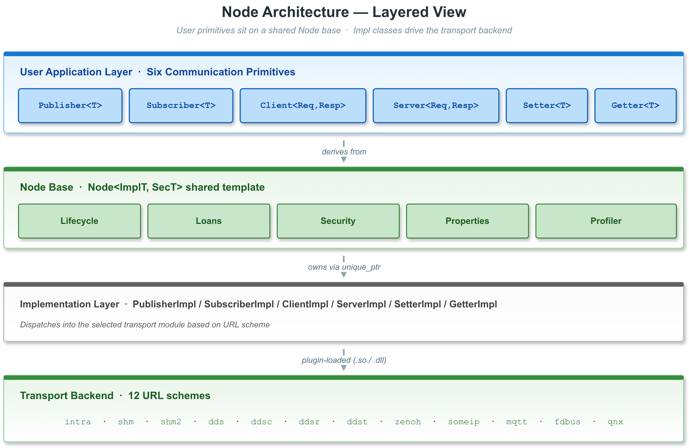
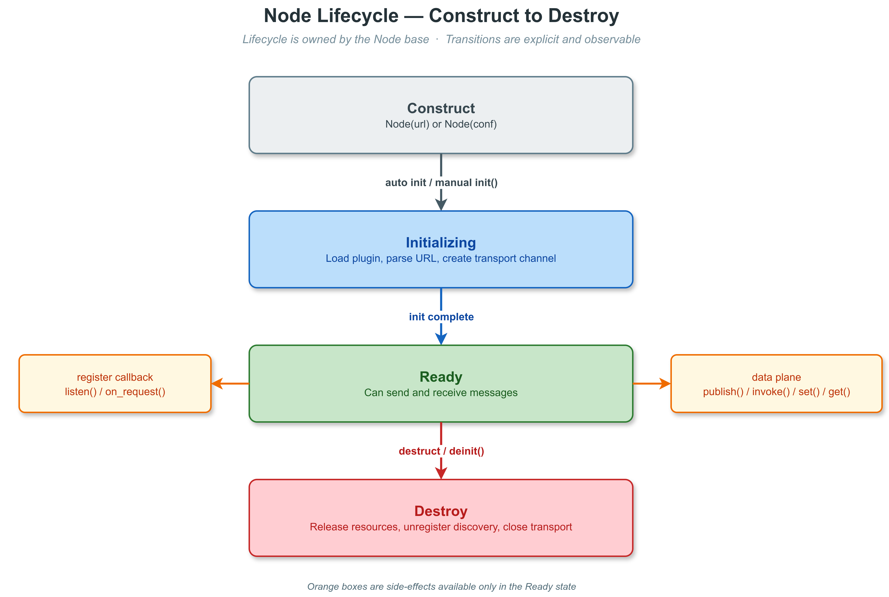

# 2. 节点基类与生命周期

> 本章介绍 VLink 所有通信原语共享的 `Node<ImplT, SecT>` 基类模板，包括模板参数化继承架构、生命周期管理、属性配置、零拷贝借贷、安全加密等通用能力。有关各通信原语的专属 API，请参阅 [Event 模型](03-event-model.md)、[Method 模型](04-method-model.md) 和 [Field 模型](05-field-model.md)。

## 1. 概述

`Node<ImplT, SecT>` 是 VLink 中所有通信端点共享的基类模板（源码：`include/vlink/node.h`），各通信原语通过 `Node<ImplT, SecT>` 间接持有 `std::unique_ptr<ImplT>` 形式的传输实现。VLink 的六种通信原语全部继承自它：

| 通信模型 | 发送端              | 接收端               |
| -------- | ------------------- | -------------------- |
| Event    | `Publisher<T>`      | `Subscriber<T>`      |
| Method   | `Client<Req,Resp>`  | `Server<Req,Resp>`   |
| Field    | `Setter<T>`         | `Getter<T>`          |

`Node` 统一管理传输层实现指针 (`impl_`)、驱动节点生命周期，并提供安全加密、零拷贝借贷、属性配置、消息循环绑定、CPU 性能分析等共享服务。

### 1.1 架构层次



## 2. 模板参数与角色

### 2.1 模板参数

```cpp
template <typename ImplT, SecurityType SecT>
class Node;
```

| 模板参数 | 含义                         | 约束                                                 |
| -------- | ---------------------------- | ---------------------------------------------------- |
| `ImplT`  | 传输后端实现类               | 必须继承 `NodeImpl`；构造时由 `static_assert` 校验   |
| `SecT`   | 编译期安全模式               | 由派生类（Publisher / Subscriber / ...）提供默认值 `kWithoutSecurity`，可显式为 `kWithSecurity` |

`Node` 构造函数中的静态断言：

```cpp
static_assert(std::is_base_of_v<NodeImpl, ImplT>, "ImplT must be derived from NodeImpl.");
```

### 2.2 ImplType 节点角色

`ImplType`（`include/vlink/impl/types.h`）是一个 `uint8_t` 的位掩码枚举，用于标识节点在通信中的角色：

| 枚举值             | 十进制 | 十六进制 | 说明           |
| ------------------ | ------ | -------- | -------------- |
| `kUnknownImplType` | 0      | 0x00     | 未确定         |
| `kPublisher`       | 1      | 0x01     | Event 发布者   |
| `kSubscriber`      | 2      | 0x02     | Event 订阅者   |
| `kSetter`          | 4      | 0x04     | Field 设置者   |
| `kGetter`          | 8      | 0x08     | Field 获取者   |
| `kServer`          | 16     | 0x10     | Method 服务端  |
| `kClient`          | 32     | 0x20     | Method 客户端  |

这些值可按位或组合，`Conf` 据此声明支持的节点角色。

### 2.3 TransportType 传输方案

`TransportType`（`enum class : uint8_t`）标识当前节点使用的传输后端：

| 枚举值     | 值 | URL 前缀    | 传输技术              |
| ---------- | -- | ----------- | --------------------- |
| `kUnknown` | 0  | (无)        | 未知/不支持           |
| `kIntra`   | 1  | `intra://`  | 进程内队列            |
| `kShm`     | 2  | `shm://`    | Iceoryx 共享内存      |
| `kShm2`    | 3  | `shm2://`   | Iceoryx2 共享内存     |
| `kZenoh`   | 4  | `zenoh://`  | Zenoh                 |
| `kDds`     | 5  | `dds://`    | Fast-DDS RTPS         |
| `kDdsc`    | 6  | `ddsc://`   | CycloneDDS            |
| `kDdsr`    | 7  | `ddsr://`   | RTI DDS               |
| `kDdst`    | 8  | `ddst://`   | TravoDDS              |
| `kSomeip`  | 9  | `someip://` | SOME/IP (vsomeip)     |
| `kMqtt`    | 10 | `mqtt://`   | MQTT (Paho C)         |
| `kFdbus`   | 11 | `fdbus://`  | FDBus IPC             |
| `kQnx`     | 12 | `qnx://`    | QNX IPC (仅 QNX)      |

> 源码中存在的 scheme 不代表当前构建一定启用对应模块（参见 Conan recipe 的组件导出清单）。

### 2.4 核心成员变量

| 成员                | 类型                          | 初值       | 说明                                     |
| ------------------- | ----------------------------- | ---------- | ---------------------------------------- |
| `has_inited_`       | `std::atomic_bool`            | `false`    | 初始化标志，CAS 保护                     |
| `impl_`             | `std::unique_ptr<ImplT>`      | 空         | 传输后端实现对象                         |
| `security_`         | `std::optional<Security>`     | 空         | 安全加解密对象（仅 `kWithSecurity` 节点在构造时由 `SecurityXxx` ctor 内部填充，且 `Security::Config` 验证通过；未传 cfg 或验证失败时保持空，加解密路径直接 drop 消息）|
| `quit_mtx_`         | `std::optional<std::mutex>`   | 空         | 安全退出互斥锁（`set_safety_quit(true)` 时创建） |
| `proto_arena_`      | `void*`                       | `nullptr`  | Protobuf Arena 指针（仅 proto 指针类型使用） |
| `is_support_loan_`  | `bool`                        | `false`    | 在 `init()` 中由 `impl_->is_support_loan()` 填写 |
| `is_manual_unloan_` | `bool`                        | `false`    | 是否启用手动归还模式                     |

## 3. 生命周期管理

### 3.1 生命周期状态图



### 3.2 构造阶段

节点的构造支持三种方式：

**方式一：URL 字符串构造（最常用）**

```cpp
Publisher<MyMsg> pub("dds://vehicle/speed");
```

内部实现流程：
1. 将 URL 字符串包装为 `Url` 对象
2. `Url` 解析 transport 前缀，选择对应的 `Conf` 工厂
3. `Conf::parse()` 验证配置有效性
4. `Conf::create_publisher()` 创建对应的 `PublisherImpl`
5. 设置 `impl_->transport_type`、`impl_->ser_type`、`impl_->schema_type`、`impl_->is_cdr_type`
6. 默认情况下（`InitType::kWithInit`）立即调用 `init()`；`SecT == kWithSecurity` 时由 `SecurityXxx` 派生类构造函数接收的 `Security::Config` 在 `init()` 之前完成安装

**方式二：Conf 配置对象构造**

```cpp
DdsConf conf("vehicle/speed", /*domain=*/0, /*depth=*/0, /*qos=*/"reliable");
Publisher<MyMsg> pub(conf);
```

编译期使用 `static_assert` 检查 `ConfT` 是否支持当前节点角色：

```cpp
static_assert(ConfT::get_allow_impl_type() & kImplType, "Conf does not support publisher mode.");
```

**方式三：延迟初始化构造**

```cpp
Publisher<MyMsg> pub("dds://topic", InitType::kWithoutInit);
// 在 init() 之前进行属性配置
pub.set_ser_type("my.custom.Type", SchemaType::kProtobuf);
pub.set_property("dds.ip", "192.168.1.100");
pub.init();  // 手动初始化
```

### 3.3 init() -- 初始化

```cpp
virtual bool init();
```

`init()` 使用原子 CAS (Compare-And-Swap) 操作保证只能被成功调用一次：

```cpp
bool expected = false;
if (!has_inited_.compare_exchange_strong(expected, true)) {
    return false;  // 已经初始化过，直接返回
}
```

初始化流程（见 `include/vlink/internal/node-inl.h`）：

1. **版本检查** -- `impl_->check_version(Version{VLINK_VERSION_MAJOR, VLINK_VERSION_MINOR, VLINK_VERSION_PATCH})` 比较编译期版本与运行时版本，不匹配时记录警告。
2. **传输初始化** -- `impl_->init()` 创建底层传输通道（如 DDS Entity、SHM Channel）。
3. **扩展初始化** -- `impl_->init_ext()` 注册到全局 `DiscoveryReporter`；若全局 Profiler 已启用且节点满足条件，会创建 `CpuProfiler`。
4. **查询借贷支持** -- 保存 `impl_->is_support_loan()` 到 `is_support_loan_` 标志。

> 重复调用 `init()` 无副作用，CAS 判失败后直接返回 `false`。

### 3.4 deinit() -- 反初始化

```cpp
virtual bool deinit();
```

`deinit()` 同样使用原子 CAS 保证只执行一次：

```cpp
bool expected = true;
if (!has_inited_.compare_exchange_strong(expected, false)) {
    return false;  // 未初始化或已经 deinit，直接返回
}
```

反初始化流程：

1. **中断** -- 调用 `interrupt()`，唤醒所有阻塞等待
2. **安全退出锁** -- 若启用了 `safety_quit` 模式，在 `quit_mtx_` 锁保护下执行后续步骤
3. **传输清理** -- 调用 `impl_->deinit()`，释放底层传输资源
4. **扩展清理** -- 调用 `impl_->deinit_ext()`，从 `DiscoveryReporter` 注销

### 3.5 析构自动 deinit

```cpp
template <typename ImplT, SecurityType SecT>
inline Node<ImplT, SecT>::~Node() {
    deinit();
}
```

析构函数自动调用 `deinit()`。因此在大多数场景下，用户不需要显式调用 `deinit()`，节点超出作用域时自动完成清理。仅在需要提前释放资源时才需要手动调用。

### 3.6 全局初始化

`NodeImpl` 构造函数会调用静态方法 `global_init()`（`src/impl/node_impl.cc`），确保进程级单例被初始化：

```cpp
static void NodeImpl::global_init() {
    Logger::get();                    // 日志系统
    Bytes::init_memory_pool();        // 触发 MemoryPool::global_instance(true)，读取 VLINK_MEMORY_LEVEL
    BagWriter::global_get();          // 全局录包器（由 VLINK_BAG_PATH 激活）
    DiscoveryReporter::global_get();  // 全局发现上报
}
```

方法内部的单例懒加载自带线程安全，多次调用仅首次有效果。

## 4. 延迟初始化

`InitType` 枚举控制节点是否在构造时立即初始化：

| 枚举值         | 值 | 说明                           |
| -------------- | -- | ------------------------------ |
| `kWithoutInit` | 0  | 延迟初始化，需手动调用 init()  |
| `kWithInit`    | 1  | 构造时立即初始化（默认）       |

延迟初始化的典型场景：

```cpp
// 场景一：需要在 init 前配置属性
Publisher<MyMsg> pub("dds://topic", InitType::kWithoutInit);
pub.set_property("dds.ip", "192.168.1.100");
pub.set_ser_type("my.proto.MyMsg", SchemaType::kProtobuf);
pub.set_discovery_enabled(false);
pub.init();

// 场景二：需要在 init 前配置安全
Security::Config sec_cfg;
sec_cfg.key = "my-secret";
SecurityPublisher<MyMsg> sec_pub("shm://secure_topic", sec_cfg, InitType::kWithoutInit);
sec_pub.init();

// 场景三：工厂方法也支持延迟初始化
auto pub_ptr = Publisher<MyMsg>::create_unique("dds://topic", InitType::kWithoutInit);
pub_ptr->set_property("dds.qos.reliability", "reliable");
pub_ptr->init();
```

> **重要**：消息级 `Security::Config` 只能通过 `SecurityXxx` 节点的**构造函数**传入；没有运行时的 `enable_security()` 入口。需要更换密钥/回调时请销毁并重新构造节点。`set_property()` 通常也需要在 `init()` 之前设置才能生效。

## 5. 属性配置与查询

### 5.0 基础查询方法

```cpp
TransportType get_transport_type() const;
const std::string& get_url() const;
```

- `get_transport_type()` 返回节点所绑定的传输后端枚举（如 `kDds`、`kShm`、`kIntra` 等）。
- `get_url()` 返回构造此节点时使用的 URL 字符串（如 `"dds://vehicle/speed"`）。通过 `ConfT` 构造的节点返回空字符串。

### 5.1 序列化类型 -- set_ser_type()

```cpp
void set_ser_type(const std::string& ser_type, SchemaType schema_type = SchemaType::kUnknown);
const std::string& get_ser_type() const;
SchemaType get_schema_type() const;
```

序列化类型通常由模板参数 `MsgT` 在编译期自动推导。但在某些场景下需要手动覆盖，例如动态类型或自定义类型名称。
当你已经明确知道 `ser_type` 与 `schema_type` 时，直接调用 `set_ser_type(ser_type, schema_type)`。如果只是修改同一 family 下的具体类型名，则可以省略第二个参数。

行为细节：
- 若在 `init()` **之前**调用：直接更新对应的 wire metadata 字段
- 若在 `init()` **之后**调用：自动执行 `deinit_ext()` -> 修改 wire metadata -> `init_ext()` 三步操作
- 如果第二个参数显式传入非 `kUnknown` family，会原子更新 `ser_type + schema_type`
- 如果第二个参数为 `SchemaType::kUnknown`（默认值），表示“不显式覆盖当前 family”
- `string/json/raw` 这类 raw 标识和 `vlink::zerocopy::*` 会按 `ser_type` 自动同步 family
- 如果当前 family 已经是 `kProtobuf` 或 `kFlatbuffers`，单独调用 `set_ser_type()` 修改同 family 下的具体类型名时会保留这个 family
- 如果当前 family 是 `kRaw` 或 `kZeroCopy`，但新的 `ser_type` 已无法再推断出对应 family，则会回退为 `kUnknown`
- `set_ser_type("")` 会同时清空 `ser_type` 与 `schema_type`
- 若已有非空类型且新类型不同：打印警告日志

```cpp
Publisher<Bytes> pub("dds://topic", InitType::kWithoutInit);
pub.set_ser_type("my.proto.MessageType", SchemaType::kProtobuf);
pub.set_ser_type("my.proto.MessageTypeV2");
pub.init();
```

### 5.2 安全配置 -- SecurityXxx 构造函数

`Security::Config` 只能通过 `SecurityPublisher` / `SecuritySubscriber` / `SecurityServer` / `SecurityClient` / `SecuritySetter` / `SecurityGetter` 的**构造函数**一次性传入，无运行时 setter：

```cpp
explicit SecurityPublisher(const std::string& url_str,
                           const Security::Config& sec_cfg = {},
                           InitType type = InitType::kWithInit);

// 另有 ConfT 重载和 create_unique / create_shared 工厂方法。
```

构造阶段的处理：

- `SecurityXxx` 总是先以 `InitType::kWithoutInit` 调用基类构造，再用 `sec_cfg` 构造候选 `Security`，验证 `is_configured()` 通过后才装入 `security_`，最后按 `type` 决定是否立刻 `init()`；
- 在非 `kWithSecurity` 实例上调用 `enable_security()` 会编译失败（`static_assert(SecT == SecurityType::kWithSecurity, "Must be security type.")`）；
- `intra://` 与 `dds://` CDR 类型运行时不支持安全加密，构造时会打印 warning 并把 `sec_cfg` 忽略，`security_` 保持空；
- 验证失败（非法 PEM / 弱 RSA / 缺 salt 等）会打印 warning 并把对应槽位置空；如果整个 cfg 都失效，`security_` 保持空，发送 / 接收路径会直接 drop 消息并打 log，不再触发未定义行为；
- `Security::Config` 是一个 aggregate struct，包含 `key` / `passphrase` / `pbkdf2_salt` / `public_key_pem` / `private_key_pem` / `signing_key_pem` / `verify_key_pem` / `encrypt_callback` / `decrypt_callback` 等字段；模式按字段自动选择（自定义回调 > RSA 非对称 > 对称）；
- 自定义回调必须**成对**安装；只设 `encrypt_callback` 或只设 `decrypt_callback` 会被忽略并打印 warning；
- 内置 AEAD / RSA 需以 `ENABLE_SECURITY=ON` 构建（依赖 OpenSSL）；未启用时只有自定义回调路径生效。

```cpp
// 方式一：对称 AES-128-GCM
Security::Config cfg;
cfg.key = "my-secret";
SecurityPublisher<MyMsg> pub("shm://topic", cfg);

// 方式二：自定义加解密回调
Security::Config cfg2;
cfg2.encrypt_callback = [](const Bytes& in, Bytes& out) -> bool {
    // 自定义加密逻辑
    return true;
};
cfg2.decrypt_callback = [](const Bytes& in, Bytes& out) -> bool {
    // 自定义解密逻辑
    return true;
};
SecurityPublisher<MyMsg> pub2("dds://topic", cfg2);
```

### 5.3 发现服务 -- set_discovery_enabled()

```cpp
void set_discovery_enabled(bool enable);
bool get_discovery_enabled() const;
```

控制节点是否向全局 `DiscoveryReporter` 注册自身。关闭发现可以降低 CPU 和网络开销。

行为细节：
- 若在 `init()` 之前调用：直接设置标志
- 若在 `init()` 之后调用：自动执行 `deinit_ext()` -> 修改标志 -> `init_ext()` 三步操作

### 5.4 录制路径 -- set_record_path()

```cpp
void set_record_path(const std::string& path);
```

为节点启用单独的消息录制。传入非空路径时通过 `BagWriter::filter_get()` 获取（或共享）录包器实例；传入空字符串则释放该 recorder。

> **注意**：`intra://` 与 `dds://` CDR 类型不支持录制 —— 调用 `set_record_path(path)` 会先触发 `VLOG_F`；即使绕过此检查，`try_record()` 内部也会直接跳过这两种传输。

### 5.5 SSL/TLS 配置 -- set_ssl_options()

```cpp
void set_ssl_options(const SslOptions& options);
```

为节点配置传输层 SSL/TLS 加密。该方法将 `SslOptions` 的字段合并到节点内部属性映射（`ssl.*` 属性键），传输后端在 `init()` 阶段读取这些属性以建立 TLS 连接。**必须在 `init()` 之前调用**。

`SslOptions` 结构体字段：

| 字段           | 属性键             | 说明                                        |
| -------------- | ------------------ | ------------------------------------------- |
| `verify_peer`  | `ssl.verify`       | 是否验证对端证书（默认 `true`）             |
| `ca_file`      | `ssl.ca`           | CA 证书文件路径（PEM 格式）                 |
| `cert_file`    | `ssl.cert`         | 客户端证书文件路径（PEM 格式）              |
| `key_file`     | `ssl.key`          | 客户端私钥文件路径（PEM 格式）              |
| `key_password` | `ssl.key_password`  | 私钥密码                                    |
| `server_name`  | `ssl.server_name`  | SNI 服务器名称覆盖                          |
| `ciphers`      | `ssl.ciphers`      | 密码套件字符串（OpenSSL 格式）              |

SSL 在 `ca_file` 或 `cert_file` 非空时被视为启用。支持的传输后端：

| 后端       | TLS 机制                                              |
| ---------- | ----------------------------------------------------- |
| `mqtt://`  | Paho C `MQTTClient_SSLOptions`                        |
| `dds://`   | Fast-DDS `TCPv4TransportDescriptor::tls_config`       |
| `ddsc://`  | CycloneDDS `ddsi_config` ssl 字段（需 `DDS_HAS_SSL`）|
| `zenoh://` | zenoh-c `transport/link/tls` 配置键                   |

也可通过 `set_property()` 逐项设置 `ssl.*` 属性，或通过环境变量 `VLINK_SSL_CA`、`VLINK_SSL_CERT`、`VLINK_SSL_KEY` 等设置默认值。

```cpp
Publisher<MyMsg> pub("mqtt://sensor/data", InitType::kWithoutInit);
SslOptions ssl;
ssl.ca_file   = "/etc/certs/ca.pem";
ssl.cert_file = "/etc/certs/client.pem";
ssl.key_file  = "/etc/certs/client-key.pem";
pub.set_ssl_options(ssl);
pub.init();
```

### 5.6 自定义属性 -- set_property() / get_property()

```cpp
void set_property(const std::string& prop, const std::string& value);
[[nodiscard]] std::string get_property(const std::string& prop) const;
```

提供键值对形式的扩展机制，用于传输后端特定的配置调优。属性存储在 `NodeImpl` 内部的 `PropertiesMap` 中，受 `std::shared_mutex` 保护，线程安全。

```cpp
Publisher<MyMsg> pub("dds://topic", InitType::kWithoutInit);
pub.set_property("dds.ip", "192.168.1.100");
pub.set_property("dds.port", "7400");
pub.init();

std::string ip = pub.get_property("dds.ip");  // "192.168.1.100"
```

### 5.7 Protobuf Arena 绑定 -- bind_proto_arena()

```cpp
void bind_proto_arena(void* proto_arena);
```

当 `MsgT` 是原始 Protobuf 指针类型（如 `MyProto*`）时，必须绑定 Arena。Arena 必须比节点生存期更长。未绑定时，收到第一条消息会触发致命错误。

```cpp
google::protobuf::Arena arena;
Subscriber<MyProto*> sub("dds://topic");
sub.bind_proto_arena(&arena);
sub.listen([](MyProto* msg) {
    // msg 由 arena 管理生命周期
});
```

## 6. MessageLoop 绑定

```cpp
bool attach(class MessageLoop* message_loop);
bool detach();
class MessageLoop* get_message_loop() const;
```

### 6.1 工作原理

默认情况下，节点的回调在传输线程上直接调用。通过 `attach()` 将节点绑定到 `MessageLoop` 后，回调被 `post_task()` 投递到 MessageLoop 线程执行，实现回调的线程切换。

这对于单线程应用代码特别有用，可以避免多线程同步问题。

### 6.2 使用示例

```cpp
MessageLoop loop;

Subscriber<MyMsg> sub("dds://vehicle/speed");
sub.attach(&loop);  // 回调将在 loop 线程执行
sub.listen([](const MyMsg& msg) {
    // 此回调在 MessageLoop 线程中执行，而非传输线程
});

loop.run();  // 启动消息循环
```

### 6.3 注意事项

| 操作    | 行为                                                               |
| ------- | ------------------------------------------------------------------ |
| attach  | 若已绑定其他 MessageLoop，返回 `false`                             |
| detach  | 若从不同线程调用，会等待 MessageLoop 空闲后再清除指针              |
| detach  | detach 后回调恢复在传输线程上执行                                  |
| 状态回调 | `call_status()` 也会通过绑定的 MessageLoop 分发                   |

## 7. 零拷贝借贷

```cpp
bool is_support_loan() const;
Bytes loan(int64_t size);
bool return_loan(const Bytes& bytes);
void set_manual_unloan(bool manual_unloan);
bool is_manual_unloan() const;
```

### 7.1 支持的传输后端

| 传输后端  | 是否支持 loan |
| --------- | ------------- |
| `shm://`  | 是            |
| `shm2://` | 是            |
| 其他      | 否            |

### 7.2 Publisher 端使用

```cpp
Publisher<Bytes> pub("shm://topic");

if (pub.is_support_loan()) {
    Bytes buf = pub.loan(sizeof(MyStruct));
    if (!buf.empty()) {
        new (buf.data()) MyStruct{42, 3.14};
        pub.publish(buf);   // 零拷贝发送，loan 自动归还
    }
}
```

> 注：loan 路径需要使用 `Publisher<Bytes>`——`loan()` 返回的 `Bytes` 作为消息直接发送；若用 `Publisher<MyStruct>` 则 `publish(buf)` 与模板签名 `publish(const MsgT&)` 不匹配，无法编译。


### 7.3 Subscriber 端手动归还

```cpp
Subscriber<Bytes> sub("shm://topic");
sub.set_manual_unloan(true);  // 启用手动归还模式

sub.listen([&sub](const Bytes& data) {
    // 处理数据...
    process(data);
    // 处理完成后手动归还
    sub.return_loan(data);
});
```

> **注意**：
> - `set_manual_unloan()` 基类默认实现仅打印警告日志，只有 `Subscriber` 和 `Getter` 覆盖了此方法
> - 未归还的 loan 会耗尽共享内存池
> - 启用安全模式 (`kWithSecurity`) 时不使用 loan，因为加密后数据大小与原始大小不同

## 8. 挂起与恢复

```cpp
bool suspend();
bool resume();
bool is_suspend() const;
```

`suspend()` 临时暂停节点的消息传递，`resume()` 恢复。具体行为取决于传输后端：

| 传输后端 | suspend 行为              |
| -------- | ------------------------- |
| 部分支持 | 缓存传入消息              |
| 部分支持 | 丢弃传入消息              |
| 不支持时 | 打印警告日志，返回 false  |

`NodeImpl` 的基类实现默认不支持 suspend，会打印 `"Not Support function [suspend]."` 并返回 `false`。需要具体的传输后端覆盖实现。

```cpp
Subscriber<MyMsg> sub("dds://topic");
sub.listen([](const MyMsg& msg) { /* ... */ });

sub.suspend();   // 暂停接收
// ... 期间消息被缓存或丢弃
sub.resume();    // 恢复接收
```

## 9. 中断机制

```cpp
virtual void interrupt();
```

`interrupt()` 用于唤醒任何阻塞在该节点上的等待操作。内部机制：

1. 设置 `NodeImpl` 的 `is_interrupted` 原子标志为 `true`
2. 子类（如 `Publisher`、`Client`、`Getter`）覆盖此方法，额外唤醒各自的条件变量

受影响的阻塞方法：
- `Publisher::wait_for_subscribers()`
- `Client::wait_for_connected()`
- `Getter::wait_for_value()`

被中断的方法会立即返回 `false`。

```cpp
Publisher<MyMsg> pub("dds://topic");

// 在另一个线程中
std::thread t([&pub]() {
    std::this_thread::sleep_for(std::chrono::seconds(1));
    pub.interrupt();  // 1秒后中断等待
});

bool ok = pub.wait_for_subscribers(Timeout::kInfinite);  // 被中断后返回 false
t.join();
```

> **注意**：`deinit()` 内部会自动调用 `interrupt()`，确保析构时不会死锁。

## 10. CPU 性能分析

```cpp
double get_cpu_usage() const;
```

返回节点在活跃的 publish/receive 操作中消耗的 CPU 时间占比。

### 10.1 启用条件

| 条件                       | 说明                                            |
| -------------------------- | ----------------------------------------------- |
| 编译期                     | 未定义 `VLINK_DISABLE_PROFILER` 宏              |
| 运行时                     | 设置环境变量 `VLINK_PROFILER_ENABLE`             |
| 节点级别                   | `init_ext()` 中检测到全局 profiler 启用时自动创建 |

### 10.2 返回值

| 返回值               | 含义                            |
| -------------------- | ------------------------------- |
| `[0.0, 100.0]`       | CPU 使用百分比                  |
| `-1.0`               | Profiler 未附加到此节点         |

```cpp
Publisher<MyMsg> pub("dds://topic");

// 确保已设置 VLINK_PROFILER_ENABLE 环境变量
double usage = pub.get_cpu_usage();
if (usage >= 0) {
    // 有效的 CPU 使用率
}
```

### 10.3 实现原理

`Publisher::publish()` 和 `Subscriber` 的内部接收路径中使用 `CpuProfilerGuard` RAII 对象，在操作前后自动记录 CPU 时间：

```cpp
// publisher-inl.h 中的使用方式
#ifndef VLINK_DISABLE_PROFILER
CpuProfilerGuard profiler_guard(this->impl_->profiler.get());
#endif
```

## 11. 状态查询与内省

```cpp
Status::BasePtr get_status(Status::Type type) const;
void register_status_handler(StatusCallback&& callback);
const AbstractNode* get_abstract_node() const;
```

### 11.0 抽象节点句柄

`get_abstract_node()` 返回底层传输图中的 `AbstractNode` 指针，可用于 `AbstractFactory` 查询同图中的对等节点，或传递给代理监控 API 进行运行时拓扑检查。若传输后端不暴露 `AbstractNode`，返回 `nullptr`。

### 11.1 支持的传输后端

状态查询和状态回调仅在 DDS 系列传输上有效：

| 传输后端  | 是否支持状态查询 |
| --------- | ---------------- |
| `dds://`  | 是               |
| `ddsc://` | 是               |
| `ddsr://` | 是               |
| `ddst://` | 是               |
| 其他      | 否 (返回 Unknown) |

在不支持的传输上调用会打印警告并返回 `Status::Unknown` 对象。

### 11.2 使用示例

```cpp
Publisher<MyMsg> pub("dds://topic");

pub.register_status_handler([](const Status::BasePtr& status) {
    // 处理 DDS 状态变化事件
    // 例如：deadline missed, liveliness changed 等
});

auto status = pub.get_status(Status::Type::kLivelinessChanged);
```

### 11.3 状态回调与 MessageLoop

若节点已 `attach()` 到 `MessageLoop`，状态回调会通过 `MessageLoop::post_task()` 分发到 loop 线程。否则直接在传输线程调用。

## 12. 工厂方法

每个通信端点类（Publisher、Subscriber 等）都提供静态工厂方法：

```cpp
static UniquePtr create_unique(const std::string& url_str, InitType type = InitType::kWithInit);
static SharedPtr create_shared(const std::string& url_str, InitType type = InitType::kWithInit);
```

### 12.1 使用示例

```cpp
// unique_ptr 管理
auto pub = Publisher<MyMsg>::create_unique("dds://topic");

// shared_ptr 管理
auto sub = Subscriber<MyMsg>::create_shared("dds://topic");

// 延迟初始化
auto client = Client<Req, Resp>::create_unique("zenoh://service", InitType::kWithoutInit);
client->set_property("timeout", "5000");
client->init();
```

### 12.2 对比直接构造

| 方式            | 内存位置 | 智能指针类型   | 适用场景                         |
| --------------- | -------- | -------------- | -------------------------------- |
| 栈上构造        | 栈       | 无             | 局部使用，生命周期明确           |
| `create_unique` | 堆       | `unique_ptr`   | 需要动态生命周期，独占所有权     |
| `create_shared` | 堆       | `shared_ptr`   | 需要共享所有权                   |

## 13. 安全模板

### 13.1 编译期约束

VLink 通过模板参数 `SecurityType SecT` 在编译期决定是否启用安全功能。使用 `static_assert` 保证安全 API 只能在安全模式的实例上调用。

```cpp
// 正确：Security::Config 通过 SecurityXxx 构造函数传入
Security::Config cfg;
cfg.key = "my-secret";
SecurityPublisher<MyMsg> pub("shm://topic", cfg);

// 错误：普通 Publisher 没有接收 Security::Config 的 ctor 重载
Publisher<MyMsg> pub2("shm://topic", cfg);  // compile error
```

### 13.2 便捷别名

VLink 为每种通信原语提供预定义的安全别名类型：

| 别名类型              | 等价于                                                        |
| --------------------- | ------------------------------------------------------------- |
| `SecurityPublisher`   | `Publisher<MsgT, SecurityType::kWithSecurity>`                 |
| `SecuritySubscriber`  | `Subscriber<MsgT, SecurityType::kWithSecurity>`               |
| `SecurityServer`      | `Server<ReqT, RespT, SecurityType::kWithSecurity>`            |
| `SecurityClient`      | `Client<ReqT, RespT, SecurityType::kWithSecurity>`            |
| `SecuritySetter`      | `Setter<ValueT, SecurityType::kWithSecurity>`                  |
| `SecurityGetter`      | `Getter<ValueT, SecurityType::kWithSecurity>`                  |

### 13.3 不支持安全的传输

以下传输后端不支持安全功能，`SecurityXxx` 构造时会**打印警告（`VLOG_W`）并忽略 `Security::Config`**：

- `intra://` -- 进程内通信无需加密
- `dds://` 且使用 CDR 序列化 -- CDR 数据由 DDS 直接管理，无法在 VLink 层加密

`security_` 保持空 `optional`；发送 / 接收路径会 drop 消息并打 log，不会 UB。

### 13.4 安全与零拷贝

启用安全模式后，`Publisher::publish()` 内部不会使用 loan 机制。因为加密后的数据大小与原始序列化数据大小不同，无法预先分配精确的 loan 缓冲区。

## 14. 安全退出模式

```cpp
bool get_safety_quit() const;
void set_safety_quit(bool safety_quit);
```

安全退出模式通过 `std::mutex` 保护回调执行和 `deinit()` 操作，防止回调执行过程中节点被销毁导致的 use-after-free 竞态。

### 14.1 工作原理

启用后：
- 每次回调调用都在 `quit_mtx_` 锁保护下执行（通过 `invoke_callback()`）
- `deinit()` 也在同一把锁的保护下执行 `impl_->deinit()` 和 `impl_->deinit_ext()`
- 这确保了回调不会与 deinit 并发执行

```cpp
auto sub = Subscriber<MyMsg>::create_shared("dds://topic");
sub->set_safety_quit(true);  // 启用安全退出

sub->listen([](const MyMsg& msg) {
    // 此回调受 quit_mtx_ 保护
    // 即使 sub 在另一个线程被销毁，也不会 crash
});
```

### 14.2 使用建议

| 场景                           | 是否启用    |
| ------------------------------ | ----------- |
| 节点生命周期短于回调作用域     | 建议启用    |
| 异步环境中节点可能被提前销毁   | 建议启用    |
| 高频消息的热路径               | 不建议启用 (有锁开销) |
| 节点生命周期与应用程序一致     | 不需要      |

## 15. 属性配置时机与线程模型

### 15.1 属性配置时机

| 属性方法                  | init 前 | init 后                     |
| ------------------------- | ------- | --------------------------- |
| `set_property()`          | 推荐    | 一般不再生效                |
| `set_ser_type()`          | 推荐    | 自动 `deinit_ext / init_ext` |
| `set_discovery_enabled()` | 推荐    | 自动 `deinit_ext / init_ext` |
| `SecurityXxx` 构造时传 cfg | 必须    | 不适用（无运行时入口）      |
| `set_record_path()`       | 可以    | 可以                        |
| `set_ssl_options()`       | 必须    | 不生效（需在 init 前）      |
| `bind_proto_arena()`      | 可以    | 在 `listen()` 前即可        |

### 15.2 回调线程模型

| 回调路径                | 默认线程      | attach 后线程    |
| ----------------------- | ------------- | ---------------- |
| `Subscriber::listen()`  | 传输线程      | MessageLoop 线程 |
| `Getter::listen()`      | 传输线程      | MessageLoop 线程 |
| `Server::listen()`      | 传输线程      | MessageLoop 线程 |
| `register_status_handler` | 传输线程    | MessageLoop 线程 |
| `Publisher::publish()`  | 调用者线程    | 调用者线程       |
| `Client::invoke()`      | 调用者线程    | 调用者线程       |

---

## 16. 相关文档

- [构建指南](01-build.md) -- CMake 编译选项与依赖配置
- [Event 模型（Publisher / Subscriber）](03-event-model.md) -- 事件发布订阅 API
- [Method 模型（Client / Server）](04-method-model.md) -- RPC 请求响应 API
- [Field 模型（Setter / Getter）](05-field-model.md) -- 字段状态同步 API
