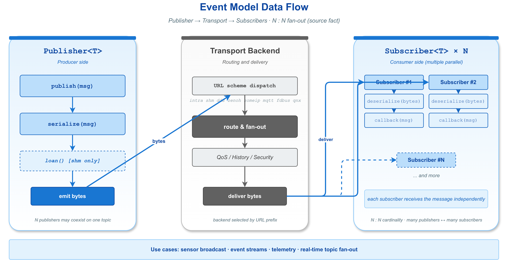
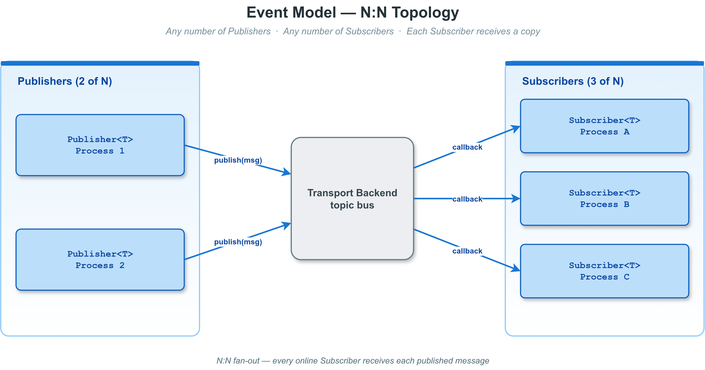

# 3. Event 模型（Publisher / Subscriber）

事件模型是 VLink 三种通信模型之一，适用于**多对多**的异步消息发布与订阅场景。
多个发布者（Publisher）可以向同一个命名主题发布消息，所有订阅了该主题的订阅者
（Subscriber）都会异步收到消息副本。本章介绍 Event 模型的专属 API；Node 基类的通用 API（init / deinit / attach / set_property 等）请参阅 [节点基类与生命周期](02-node-lifecycle.md)。

---

## 目录

1. [概念与架构](#概念与架构)
2. [主题命名规则与 URL 中的 transport](#主题命名规则与-url-中的-transport)
3. [消息类型支持](#消息类型支持)
4. [Publisher API](#publisher-api)
5. [Subscriber API](#subscriber-api)
6. [QoS 配置](#qos-配置)
7. [完整使用示例](#完整使用示例)
8. [多订阅者场景](#多订阅者场景)
9. [内存管理注意事项](#内存管理注意事项)
10. [性能调优建议](#性能调优建议)

---

## 概念与架构

### 事件模型数据流



### 多订阅者扇出模式



### 关键特性

- **多对多**：多个 Publisher 可向同一主题发布，任意数量的 Subscriber 均可接收。
- **无历史保留（默认）**：消息发出后 Publisher 不缓存；是否可被后续订阅者看见取决于 QoS Durability。
- **编译期类型安全**：`MsgT` 通过模板参数固定，`Serializer::get_type_of<MsgT>()` 编译期推导编解码器。
- **传输切换**：更换 URL 前缀即可切换后端，业务代码无需改动。
- **异步回调**：Subscriber 的 `listen()` 注册后由传输层驱动回调，不阻塞发布方。

### 与方法模型、字段模型的区别

| 维度         | 事件模型（Event）         | 方法模型（Method）         | 字段模型（Field）          |
| ------------ | ------------------------- | -------------------------- | -------------------------- |
| 通信方向     | 单向（Publisher -> Subscriber） | 双向（Client <-> Server）*  | 双向（Setter <-> Getter）  |
| 响应         | 无                        | 有（请求/响应）            | 有（最新值同步）           |
| 消费者数量   | 多对多                    | N:1（多Client对一Server）  | 多对多                     |
| 历史值保留   | 取决于 Durability QoS     | 不适用                     | 始终保留最新值             |
| 典型用途     | 传感器数据流、状态广播    | RPC 调用、服务请求         | 参数同步、配置下发         |

> *注：方法模型的 fire-and-forget 模式（`RespT` 为 `EmptyType` 时）为单向通信（Client -> Server），无响应。

---

## 主题命名规则与 URL 中的 transport

### URL 格式

```
<transport>://<topic_path>[?<query_params>]
```

### 支持的 Transport

**稳定后端（推荐用于生产环境）：**

| Transport       | 传输后端         | 通信范围       | 零拷贝 | 状态   |
| ------------ | ---------------- | -------------- | ------ | ------ |
| `intra://`   | 内置消息队列     | 进程内         | 是 ^1^ | **稳定** |
| `shm://`     | Iceoryx RouDi    | 同机跨进程     | 是 ^2^ | **稳定** |
| `dds://`     | Fast-DDS RTPS    | 跨机器         | 否     | **稳定** |
| `ddsc://`    | CycloneDDS       | 跨机器         | 否     | **稳定** |

> ^1^ `intra://` 的零拷贝通过 `shared_ptr<IntraData>` 子类实现（引用计数共享指针传递），无序列化开销。
> ^2^ `shm://` / `shm2://` 的零拷贝通过 `loan()` / `return_loan()` 接口实现（共享内存借贷缓冲区），详见 [节点基类与生命周期 -- 零拷贝借贷](02-node-lifecycle.md#7-零拷贝借贷)。

**Beta 后端（实验性，API 可能变化）：**

| Transport       | 传输后端         | 通信范围       | 零拷贝 | 状态   |
| ------------ | ---------------- | -------------- | ------ | ------ |
| `shm2://`    | Iceoryx2         | 同机跨进程     | 是     | Beta   |
| `ddsr://`    | RTI DDS          | 跨机器         | 否     | Beta   |
| `ddst://`    | TravoDDS（国产 DDS） | 跨机器       | 否     | Beta   |
| `zenoh://`   | Zenoh            | 跨机/云边      | 否     | Beta   |
| `someip://`  | vsomeip          | 车载以太网     | 否     | Beta   |
| `mqtt://`    | MQTT             | 跨机/物联网    | 否     | Beta   |
| `fdbus://`   | FDBus IPC        | 同机           | 否     | Beta   |
| `qnx://`     | QNX IPC          | 同机（QNX）    | 否     | Beta   |

### 主题路径规则

- 路径分隔符使用 `/`，例如 `dds://vehicle/chassis/speed`
- 同一传输后端下，Publisher 和 Subscriber 的 topic_path 必须完全一致才能匹配
- 跨传输后端不互通（`dds://my_topic` 与 `ddsc://my_topic` 是不同的通道）

### 查询参数（以 DDS 为例）

```
dds://vehicle/speed?domain=1&depth=10&qos=sensor
```

| 参数     | 说明                                             |
| -------- | ------------------------------------------------ |
| `domain` | DDS Domain ID，默认先读取 `VLINK_DDS_DOMAIN`，未设置时为 `0`，并可通过 `?domain=` 显式覆盖 |
| `depth`  | DDS 历史深度，覆盖 QoS 的 history.depth 设置    |
| `qos`    | 命名 QoS profile，需提前调用 `DdsConf::register_qos()` 注册 |

---

## 消息类型支持

VLink 通过 `Serializer::get_type_of<T>()` 在编译期自动推导序列化方式。共 14 种类型（含 `kUnknownType`）—— 详见 [序列化](06-serialization.md)。事件模型常用的类型：

| 类别             | 类型示例                                             | 序列化器 (值)          |
| ---------------- | ---------------------------------------------------- | ---------------------- |
| 原始字节         | `vlink::Bytes`                                       | `kBytesType` (1)       |
| 动态类型         | 含 `is_vlink_dynamic_data()` 成员的类                | `kDynamicType` (2)     |
| 自定义           | 实现 `operator>>(Bytes&)` / `operator<<(const Bytes&)` | `kCustomType` (3)    |
| CDR（DDS 专用）  | `MyCdrType`（含 `serialize`/`deserialize(Cdr&)`）    | `kCdrType` (4)         |
| Protobuf 消息    | 继承 `MessageLite`（有 `SerializeToArray`）          | `kProtoType` (5)       |
| Protobuf 指针    | `MyProto*`（Arena 管理）                             | `kProtoPtrType` (6)    |
| FlatBuffers 表   | `MyTableT`（NativeTable）                            | `kFlatTableType` (7)   |
| FlatBuffers 指针 | `const MyTable*`（Subscriber 侧零拷贝读）            | `kFlatPtrType` (8)     |
| FlatBuffers 构建 | 含 `fbb_` + `Finish()` 的结构                        | `kFlatBuilderType` (9) |
| 字符串           | `std::string`                                        | `kStringType` (10)     |
| C 字符串         | `const char*` / 字符串字面量                         | `kCharsType` (11)      |
| 流序列化         | 支持 `stringstream << / >>` 且非更高优先类型         | `kStreamType` (12)     |
| 标准布局（POD）  | `is_trivial && is_standard_layout` 的 struct         | `kStandardType` (13)   |
| POD 指针         | 指向 trivial + standard_layout 类型的指针            | `kStandardPtrType` (14)|

> 注：CDR 仅在 DDS 系列后端有效，且**不支持**消息层加密。`intra://` 下若 `MsgT` 的 `element_type` 继承 `IntraDataType`（由 `VLINK_INTRA_DATA_DECLARE` 生成），走 `shared_ptr` 零拷贝路径，不做序列化。

---

## Publisher API

### 类模板声明

```cpp
template <typename MsgT, SecurityType SecT = SecurityType::kWithoutSecurity>
class Publisher : public Node<PublisherImpl, SecT>;
```

`Publisher<MsgT, SecT>` 继承自 `Node<PublisherImpl, SecT>`，同时拥有 Node 基类
的所有通用 API 和 Publisher 专有的发布相关 API。

### 工厂方法

```cpp
// 创建 unique_ptr 包装的 Publisher（自动调用 init()）
[[nodiscard]] static UniquePtr create_unique(const std::string& url_str,
                                             InitType type = InitType::kWithInit);

// 创建 shared_ptr 包装的 Publisher（自动调用 init()）
[[nodiscard]] static SharedPtr create_shared(const std::string& url_str,
                                             InitType type = InitType::kWithInit);
```

### 构造函数

```cpp
// 从 URL 字符串构造（最常用）
explicit Publisher(const std::string& url_str,
                   InitType type = InitType::kWithInit);

// 从传输配置对象构造（细粒度控制）
template <typename ConfT>
explicit Publisher(const ConfT& conf,
                   InitType type = InitType::kWithInit);
```

`InitType::kWithInit`（默认）表示构造时立即调用 `init()`；
`InitType::kWithoutInit` 表示延迟初始化，可在 `init()` 前调用配置方法。

### 发布方法

```cpp
// 发布消息（核心方法）
// - force = false（默认）：无订阅者时不发送（节省序列化开销）
// - force = true：即使无订阅者也强制发送（录包、字段模式等场景）
// - 返回 true 表示传输层接受了消息
bool publish(const MsgT& msg, bool force = false);

// 发布已构建的 FlatBufferBuilder（FlatBuffers 专用）
// fbb 必须已调用 Finish()
bool publish_fbb(const void* fbb, bool force = false);
```

### 订阅者感知

```cpp
// 注册订阅者在线/离线通知回调
// - 若注册时已有订阅者在线，立即同步触发 callback(true)
// - callback 参数：true = 有订阅者在线；false = 最后一个订阅者离线
void detect_subscribers(ConnectCallback&& callback);

// 阻塞等待至少一个订阅者出现
// - 默认超时 Timeout::kDefaultInterval = 5000ms（5秒）
// - timeout = 0 视为无限等待（会打印警告）
// - 返回 true 表示订阅者已出现；false 表示超时或被 interrupt() 中断
bool wait_for_subscribers(std::chrono::milliseconds timeout = Timeout::kDefaultInterval);

// 非阻塞查询是否有订阅者在线
[[nodiscard]] bool has_subscribers() const;
```

### 角色切换

```cpp
// 将此 Publisher 的角色切换为 kSetter（字段写入者语义）
// 适用于某些传输后端不区分 Setter/Publisher 的场景
void mark_as_setter();
```

### 继承自 Node 的公共 API

Node 基类继承的公共 API（init / deinit / attach / interrupt / set_security_key 等）请参阅 [节点基类与生命周期](02-node-lifecycle.md)。

---

## Subscriber API

### 类模板声明

```cpp
template <typename MsgT, SecurityType SecT = SecurityType::kWithoutSecurity>
class Subscriber : public Node<SubscriberImpl, SecT>;
```

### 工厂方法

```cpp
[[nodiscard]] static UniquePtr create_unique(const std::string& url_str,
                                             InitType type = InitType::kWithInit);
[[nodiscard]] static SharedPtr create_shared(const std::string& url_str,
                                             InitType type = InitType::kWithInit);
```

### 构造函数

```cpp
explicit Subscriber(const std::string& url_str,
                    InitType type = InitType::kWithInit);

template <typename ConfT>
explicit Subscriber(const ConfT& conf,
                    InitType type = InitType::kWithInit);
```

### 订阅方法

```cpp
// 注册消息接收回调（核心方法）
// - 每次收到消息时调用 callback，已反序列化为 MsgT
// - 只能调用一次，重复调用是 fatal error
// - 回调在传输线程上执行，除非已 attach() 到 MessageLoop
// - 返回 true 表示注册成功
bool listen(MsgCallback&& callback);
// 其中：using MsgCallback = std::function<void(const MsgT&)>;
```

### 零拷贝相关

```cpp
// 启用手动归还 loan 模式（shm:// 零拷贝接收时使用）
// - 启用后，用户需要在消费完 buffer 后手动调用 return_loan()
// - 默认为自动模式（回调返回后自动归还）
void set_manual_unloan(bool manual_unloan) override;
```

### 延迟与丢样统计

```cpp
// 启用端到端延迟和丢样统计
// - 启用后，每条消息都会记录发布时间戳和接收时间戳，计算延迟
// - 统计功能有额外开销，仅在需要性能分析时启用
void set_latency_and_lost_enabled(bool enable);

[[nodiscard]] bool    is_latency_and_lost_enabled() const;

// 获取最近一次消息的端到端延迟（微秒）
// 仅在 set_latency_and_lost_enabled(true) 后有效
[[nodiscard]] int64_t get_latency() const;

// 获取累计丢样信息
// SampleLostInfo::total = 预期收到的总样本数
// SampleLostInfo::lost  = 丢失的样本数
[[nodiscard]] SampleLostInfo get_lost() const;
```

### 角色切换

```cpp
// 将此 Subscriber 的角色切换为 kGetter（字段读取者语义）
// 适用于某些传输后端不区分 Getter/Subscriber 的场景
void mark_as_getter();
```

### 继承自 Node 的公共 API

Node 基类继承的公共 API（init / deinit / attach / interrupt / set_security_key 等）请参阅 [节点基类与生命周期](02-node-lifecycle.md)。

---

## QoS 配置

QoS（Quality of Service，服务质量）控制消息的可靠性、历史深度、持久化策略等。

### 设置方式

QoS 通过 URL 查询参数或传输配置对象（Conf）设置，Node 上不存在 `set_qos()` 方法。

**方式一：通过 URL 查询参数**

```cpp
// 使用命名 QoS profile（需提前通过 DdsConf::register_qos() 注册）
vlink::Publisher<MyMsg> pub("dds://my_topic?qos=sensor&depth=20");
```

**方式二：通过 Qos 对象注册命名 Profile 后在 Conf 中引用**

```cpp
#include <vlink/modules/dds_conf.h>
#include <vlink/extension/qos.h>

// 1. 创建 Qos 对象并配置各策略
vlink::Qos my_qos;
my_qos.reliability.kind  = vlink::Qos::Reliability::kReliable;
my_qos.history.kind      = vlink::Qos::History::kKeepLast;
my_qos.history.depth     = 10;
my_qos.durability.kind   = vlink::Qos::Durability::kVolatile;
my_qos.publish_mode.kind = vlink::Qos::PublishMode::kASync;

// 2. 注册为命名 Profile（程序启动时，创建节点前调用）
vlink::DdsConf::register_qos("my_profile", my_qos);

// 3. 在 DdsConf 中通过名称引用
vlink::DdsConf conf("my_topic");
conf.qos = "my_profile";   // DdsConf::qos 是 std::string，引用已注册的 Profile 名称

vlink::Publisher<MyMsg> pub(conf);
```

**方式三：使用预定义 QoS Profile**

```cpp
#include <vlink/modules/dds_conf.h>
#include <vlink/extension/qos.h>
#include <vlink/extension/qos_profile.h>

// 先将预定义 Profile 注册到 DdsConf
vlink::DdsConf::register_qos("sensor", vlink::QosProfile::kSensor);

// 通过名称引用
vlink::DdsConf conf("sensor/data");
conf.qos = "sensor";   // 传感器数据：BestEffort + KeepLast(20) + ASync

vlink::Publisher<MyMsg> pub(conf);
```

### 常用预定义 Profile

以下摘自 `include/vlink/extension/qos_profile.h`，共 13 个 `QosProfile::k*`；下表只列常用 7 个：

| Profile                  | Reliability | History        | Durability     | PubMode | 适用场景           |
| ------------------------ | ----------- | -------------- | -------------- | ------- | ------------------ |
| `QosProfile::kEvent`     | Reliable    | KeepLast(10)   | Volatile       | Sync    | 离散控制事件       |
| `QosProfile::kSensor`    | BestEffort  | KeepLast(20)   | Volatile       | ASync   | 高频传感器数据     |
| `QosProfile::kField`     | Reliable    | KeepLast(1)    | TransientLocal | Sync    | 最新值状态同步     |
| `QosProfile::kParameter` | Reliable    | KeepLast(1000) | Volatile       | Sync    | 配置参数           |
| `QosProfile::kLight`     | Reliable    | KeepLast(1)    | Volatile       | ASync   | 轻量快速消息       |
| `QosProfile::kBest`      | Reliable    | KeepLast(200)  | Volatile       | Sync    | 高吞吐可靠传输     |
| `QosProfile::kLarge`     | Reliable    | KeepLast(500)  | Volatile       | Sync    | 大负载传输         |

> QoS 对 DDS 系列（`dds://`、`ddsc://`、`ddsr://`、`ddst://`）和 `zenoh://` 有较完整支持；其他后端忽略不支持的字段。

完整 13 个 Profile、Qos 字段含义、兼容规则见 [08-qos.md](08-qos.md)。

---

## 完整使用示例

### 示例一：基础 Protobuf 发布/订阅

```cpp
// sensor.proto -> sensor.pb.h（由 protoc 生成）
#include <vlink/vlink.h>
#include "sensor.pb.h"
#include <chrono>
#include <thread>

using namespace vlink;
using namespace std::chrono_literals;

// --- 订阅者进程 ---
void subscriber_main() {
    Subscriber<sensor::SensorData> sub("dds://sensor/temperature");

    sub.listen([](const sensor::SensorData& msg) {
        std::cout << "[Sub] ts=" << msg.timestamp()
                  << " value=" << msg.value()
                  << " unit=" << msg.unit() << std::endl;
    });

    // 阻塞，直到接收到 Ctrl+C
    std::this_thread::sleep_for(60s);
}

// --- 发布者进程 ---
void publisher_main() {
    Publisher<sensor::SensorData> pub("dds://sensor/temperature");

    // 等待至少一个订阅者上线（最多 5 秒）
    if (!pub.wait_for_subscribers(5s)) {
        std::cerr << "No subscribers found within timeout." << std::endl;
        return;
    }

    for (int i = 0; i < 100; ++i) {
        sensor::SensorData msg;
        msg.set_timestamp(i);
        msg.set_value(25.0 + i * 0.1);
        msg.set_unit("celsius");

        if (!pub.publish(msg)) {
            std::cerr << "publish failed at " << i << std::endl;
        }

        std::this_thread::sleep_for(100ms);
    }
}
```

### 示例二：使用 MessageLoop 绑定（单线程模型）

```cpp
#include <vlink/vlink.h>
#include <vlink/base/message_loop.h>
#include <vlink/base/timer.h>
#include <vlink/base/utils.h>
#include "sensor.pb.h"

using namespace vlink;

int main() {
    // MessageLoop：所有回调在此线程上顺序执行
    MessageLoop loop;
    Utils::register_terminate_signal([&loop](int) { loop.quit(); });

    // 订阅者：回调绑定到 loop 线程
    Subscriber<sensor::SensorData> sub("dds://sensor/temperature");
    sub.attach(&loop);
    sub.listen([](const sensor::SensorData& msg) {
        // 此回调在 loop.run() 所在线程上执行，线程安全
        std::cout << "[Sub] value=" << msg.value() << std::endl;
    });

    // 发布者：定时发布
    Publisher<sensor::SensorData> pub("dds://sensor/temperature");

    int counter = 0;
    Timer timer;
    timer.attach(&loop);
    timer.set_interval(200);                     // 每 200ms 触发一次
    timer.set_loop_count(Timer::kInfinite);
    timer.start([&pub, &counter]() {
        sensor::SensorData msg;
        msg.set_timestamp(++counter);
        msg.set_value(20.0 + counter % 10);
        msg.set_unit("celsius");
        pub.publish(msg);
    });

    loop.run();   // 阻塞运行，直到 quit() 被调用
    return 0;
}
```

### 示例三：POD 结构体发布（零序列化开销）

```cpp
#include <vlink/vlink.h>

using namespace vlink;

// 标准布局的 POD 结构体
struct ImuData {
    int64_t timestamp_us;
    float   accel_x, accel_y, accel_z;
    float   gyro_x, gyro_y, gyro_z;
};

// 发布
Publisher<ImuData> pub("shm://imu/data");  // shm 传输 + POD 类型 = 极低延迟
ImuData imu{};
imu.timestamp_us = 12345678;
imu.accel_x = 0.1f;
pub.publish(imu);

// 订阅
Subscriber<ImuData> sub("shm://imu/data");
sub.listen([](const ImuData& data) {
    printf("IMU: ax=%.3f ay=%.3f az=%.3f\n",
           data.accel_x, data.accel_y, data.accel_z);
});
```

### 示例四：零拷贝 shm:// loan 发布

```cpp
#include <vlink/vlink.h>

using namespace vlink;

struct BigStruct {
    uint8_t payload[65536];
    int64_t timestamp;
};

// 方式一：使用 Publisher<Bytes> 手动 loan（完全零拷贝）
Publisher<Bytes> pub("shm://big/data");

if (pub.is_support_loan()) {
    Bytes buf = pub.loan(sizeof(BigStruct));
    if (!buf.empty()) {
        auto* p = new (buf.data()) BigStruct{};
        p->timestamp = 999;
        // 填充 payload...
        pub.publish(buf);   // 传输层直接使用 loan buffer，无拷贝
    }
}

// 方式二：使用 Publisher<BigStruct>，框架内部自动执行 loan
Publisher<BigStruct> pub2("shm://big/data");
BigStruct msg{};
msg.timestamp = 999;
pub2.publish(msg);  // 若底层支持 loan，框架会自动 loan + memcpy，减少一次拷贝
```

### 示例五：Bytes 类型（原始字节发布）

```cpp
#include <vlink/vlink.h>

using namespace vlink;

Publisher<Bytes> pub("ddsc://raw/stream");
Subscriber<Bytes> sub("ddsc://raw/stream");

// 发布
Bytes data = Bytes::create(1024);
// 填充数据...
pub.publish(data);

// 订阅
sub.listen([](const Bytes& bytes) {
    printf("Received %zu bytes\n", bytes.size());
});
```

### 安全别名

VLink 为事件模型提供安全加密的便捷别名：

```cpp
// SecurityPublisher: 等价于 Publisher<MsgT, SecurityType::kWithSecurity>
template <typename MsgT>
class SecurityPublisher : public Publisher<MsgT, SecurityType::kWithSecurity>;

// SecuritySubscriber: 等价于 Subscriber<MsgT, SecurityType::kWithSecurity>
template <typename MsgT>
class SecuritySubscriber : public Subscriber<MsgT, SecurityType::kWithSecurity>;
```

### 示例六：安全加密发布订阅

```cpp
SecurityPublisher<MyMsg> pub("dds://secure/data");
pub.set_security_key("my-secret-key-256bit");

SecuritySubscriber<MyMsg> sub("dds://secure/data");
sub.set_security_key("my-secret-key-256bit");
sub.listen([](const MyMsg& msg) { /* 消息已自动解密 */ });
```

完整安全加密配置请参阅 [安全加密](09-security.md)。

---

## 多订阅者场景

多个 Subscriber 可以订阅同一主题，每个都会独立收到消息副本：

```cpp
#include <vlink/vlink.h>
#include "sensor.pb.h"

using namespace vlink;

// 多个订阅者订阅同一主题
Subscriber<sensor::SensorData> sub_logger("dds://sensor/speed");
Subscriber<sensor::SensorData> sub_controller("dds://sensor/speed");
Subscriber<sensor::SensorData> sub_recorder("dds://sensor/speed");

// 每个订阅者独立注册回调
sub_logger.listen([](const sensor::SensorData& msg) {
    // 记录日志
    printf("[Logger] speed=%.2f\n", msg.value());
});

sub_controller.listen([](const sensor::SensorData& msg) {
    // 控制逻辑
    if (msg.value() > 120.0) {
        printf("[Controller] Speed limit exceeded!\n");
    }
});

sub_recorder.listen([](const sensor::SensorData& msg) {
    // 录包一般使用 set_record_path()，这里仅做示意
    printf("[Recorder] recording...\n");
});

// 一个 Publisher 发布，所有三个 Subscriber 都会收到
Publisher<sensor::SensorData> pub("dds://sensor/speed");
sensor::SensorData msg;
msg.set_value(100.5);
pub.publish(msg);
```

### 多订阅者的 QoS 匹配注意事项

在 DDS 系列传输中，Publisher 和 Subscriber 的 QoS 策略必须兼容，否则连接不会
建立。常见的兼容规则：

| QoS 策略     | 兼容规则                                                          |
| ------------ | ----------------------------------------------------------------- |
| Reliability  | Publisher kReliable 兼容 Subscriber kBestEffort 或 kReliable      |
| Durability   | Publisher 的 kind >= Subscriber 的 kind（Persistent > Transient > TransientLocal > Volatile） |
| History      | 独立配置，无跨端约束                                              |

---

## 内存管理注意事项

### 1. 消息对象的生命周期

`publish(msg)` 在内部完成序列化后立即返回，调用后 `msg` 可以安全销毁或复用：

```cpp
// 安全：publish 返回后 msg 的生命周期不再被 VLink 依赖
sensor::SensorData msg;
msg.set_value(1.0);
pub.publish(msg);
msg.set_value(2.0);   // 安全，publish 已完成序列化
```

### 2. Loan Buffer 的生命周期

通过 `loan()` 获取的 buffer 由传输后端（共享内存）管理：

```cpp
Bytes buf = pub.loan(sizeof(MyStruct));

// 情况 1：正常发布 -> 传输层自动归还 loan
pub.publish(buf);  // loan 已归还，buf 不可再访问

// 情况 2：不发布时必须手动归还，否则共享内存资源泄漏
if (should_skip) {
    pub.return_loan(buf);   // 必须归还
}
```

### 3. 订阅者回调中的数据引用

回调参数 `const MsgT& msg` 的生命周期仅限于回调函数体内：

```cpp
sub.listen([](const sensor::SensorData& msg) {
    // 正确：在回调内使用
    double v = msg.value();

    // 错误：保存引用到回调外部（悬垂引用风险）
    // global_ptr = &msg;   // 不要这样做

    // 正确：如需保存，复制值
    auto copy = msg;   // 或 auto copy = std::make_shared<sensor::SensorData>(msg);
});
```

### 4. 手动 unloan 模式（shm:// 零拷贝接收）

手动归还模式下，必须拿到原始 loan 后归还。对于 `Bytes` 类型消息更直接：

```cpp
Subscriber<Bytes> sub("shm://my_topic");
sub.set_manual_unloan(true);

sub.listen([&sub](const Bytes& data) {
    process(data.data(), data.size());
    sub.return_loan(data);   // 消费完再归还，避免共享内存泄漏
});
```

> 其他消息类型（如 POD、Proto）使用手动模式时，需自行从回调参数还原 `Bytes` 句柄；多数情况下使用默认自动归还即可。

### 5. 安全退出（safe_quit）

当节点在多线程环境中可能在回调执行期间被销毁时，开启安全退出：

```cpp
Publisher<MyMsg> pub("dds://my_topic");
pub.set_safety_quit(true);   // 启用安全互斥锁

// 此后，deinit() 会等待所有正在进行的回调完成后再退出
// 代价是每次回调多一次 mutex lock/unlock，不建议在热路径上使用
```

---

## 性能调优建议

### 1. 选择合适的传输后端

| 场景                     | 推荐传输              | 理由                               | 状态     |
| ------------------------ | --------------------- | ---------------------------------- | -------- |
| 同进程内高频通信         | `intra://`            | 无序列化，无 IPC 开销              | **稳定** |
| 同机跨进程大负载（图像/点云） | `shm://`         | 零拷贝，极低延迟                   | **稳定** |
| 同机跨进程小负载         | `shm://`              | 低延迟 IPC                         | **稳定** |
| 跨机器标准通信           | `dds://` / `ddsc://`  | 标准 DDS，功能完整                 | **稳定** |
| 跨机器高吞吐             | `zenoh://`            | 现代协议，内置压缩                 | Beta     |
| 车载以太网 SOA           | `someip://`           | 符合 AUTOSAR 规范                  | Beta     |

### 2. QoS 策略优化

```cpp
// 高频传感器数据（每秒 > 100 次）：用 BestEffort + ASync
vlink::DdsConf::register_qos("sensor", vlink::QosProfile::kSensor);
vlink::Publisher<SensorData> pub("dds://lidar/points?qos=sensor");

// 重要控制指令（低频、必达）：用 Reliable + Sync
vlink::DdsConf::register_qos("event", vlink::QosProfile::kEvent);
vlink::Publisher<ControlCmd> pub2("dds://control/cmd?qos=event");
```

### 3. 序列化格式选择

| 格式         | 序列化速度 | 消息大小 | 适用场景                    |
| ------------ | ---------- | -------- | --------------------------- |
| POD struct   | 极快       | 固定     | 简单数值数据、IMU、控制指令  |
| FlatBuffers  | 快         | 较小     | 复合类型、需要零拷贝读取     |
| Protobuf     | 中         | 小       | 通用消息、跨语言、字段可扩展  |
| Bytes        | 极快       | 任意     | 自定义二进制协议、图像帧     |
| CDR          | 快         | 中       | 与 DDS 原生类型互通         |

### 4. MessageLoop 线程模型

```cpp
// 单线程：所有回调顺序执行，避免并发问题
MessageLoop loop;
sub1.attach(&loop);
sub2.attach(&loop);
pub_timer.attach(&loop);   // 定时器、订阅者在同一线程
loop.run();

// 多线程：不绑定 MessageLoop，回调在传输线程执行
// 需要用户自己保证线程安全
Subscriber<MyMsg> sub("dds://my_topic");
sub.listen([](const MyMsg& msg) {
    // 可能在任意线程上调用，需加锁保护共享状态
    std::lock_guard lock(global_mutex);
    // ...
});
```

### 5. 减少不必要的订阅者检测

```cpp
// 低效：每次 publish 前都查询
for (int i = 0; i < 1000; ++i) {
    if (pub.has_subscribers()) {   // 每次循环都有查询开销
        pub.publish(msg);
    }
}

// 高效：使用 detect_subscribers 事件驱动
bool has_sub = false;
pub.detect_subscribers([&has_sub](bool connected) {
    has_sub = connected;
});

for (int i = 0; i < 1000; ++i) {
    if (has_sub) {
        pub.publish(msg);           // 避免重复查询
    }
}
```

### 6. 延迟调试

```cpp
Subscriber<SensorData> sub("dds://sensor/data");
sub.set_latency_and_lost_enabled(true);  // 开启统计（有额外开销，仅调试用）

sub.listen([&sub](const SensorData& msg) {
    int64_t lat_us = sub.get_latency();
    SampleLostInfo lost = sub.get_lost();
    printf("latency=%ldus lost=%" PRIu64 "/%" PRIu64 "\n", lat_us, lost.lost, lost.total);
});
```

---

## 相关文档

- [节点基类与生命周期](02-node-lifecycle.md) -- Node 通用 API（init / deinit / attach / security 等）
- [Method 模型（Client / Server）](04-method-model.md) -- RPC 请求响应通信
- [Field 模型（Setter / Getter）](05-field-model.md) -- 字段状态同步通信
