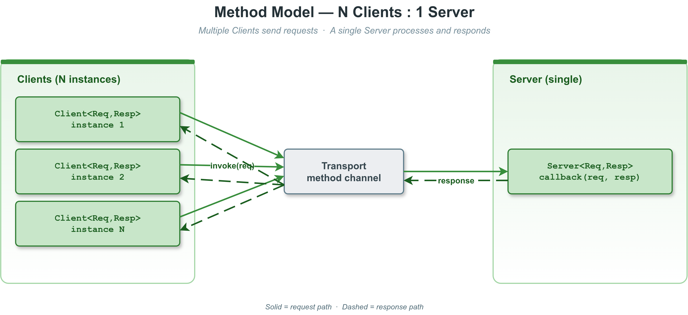
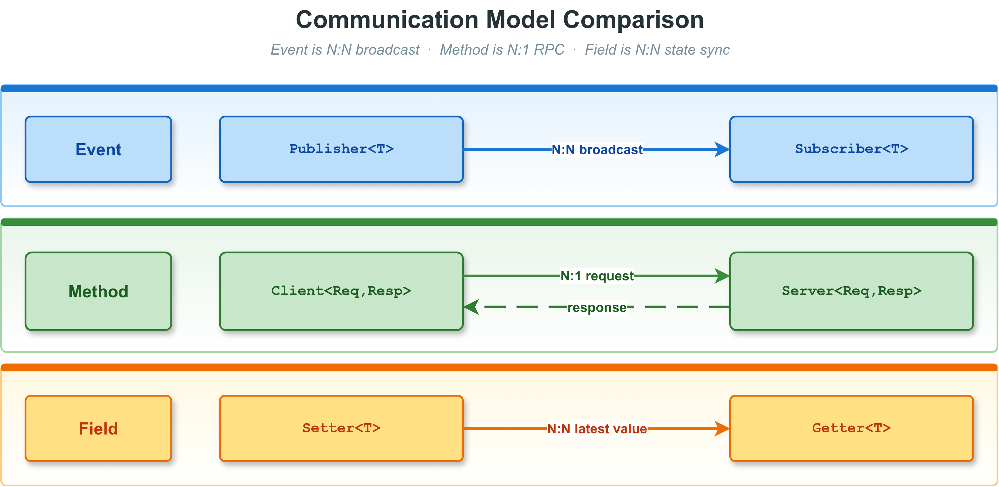

# 4. Method 模型（Client / Server）

方法模型是 VLink 三种通信模型之一，对应 RPC（远程过程调用）语义：Client 发送请求，
Server 处理后返回响应。方法模型支持**多个 Client 对一个 Server**（N:1）的请求-响应通信，同时也支持无需响应的 fire-and-forget 单向模式。
每次请求/响应是一对一配对关系，并支持超时控制。Node 基类的通用 API（init / deinit / attach / set_property 等）请参阅 [节点基类与生命周期](02-node-lifecycle.md)。

---

## 目录

1. [概念与架构](#概念与架构)
2. [Client API](#client-api)
3. [Server API](#server-api)
4. [五种调用模式详解](#五种调用模式详解)
5. [超时处理](#超时处理)
6. [错误处理](#错误处理)
7. [wait_for_connected 用法](#wait_for_connected-用法)
8. [完整使用示例](#完整使用示例)
9. [并发调用场景](#并发调用场景)
10. [模型选择](#模型选择)

---

## 概念与架构

### 方法模型数据流



### 关键特性

- **N:1**：多个 Client 可连接同一个 Server，每个请求对应一个响应
- **类型安全**：请求类型 `ReqT` 和响应类型 `RespT` 在编译时固定
- **多种调用模式**：同步阻塞、optional 返回、异步回调、future 异步
- **fire-and-forget**：`RespT` 省略时（默认为 `EmptyType`）只发不收
- **超时控制**：所有阻塞调用均支持超时，默认使用 `Timeout::kDefaultInterval`
- **连接感知**：Client 可感知 Server 的上线/下线状态

### 与其他模型的关系



---

## Client API

### 类模板声明

```cpp
template <typename ReqT,
          typename RespT = Traits::EmptyType,
          SecurityType SecT = SecurityType::kWithoutSecurity>
class Client : public Node<ClientImpl, SecT>;
```

当 `RespT` 为默认的 `Traits::EmptyType` 时，Client 仅发送请求，不等待响应，
即 fire-and-forget 模式，此时只有 `send()` 方法可用。

### 编译期常量与类型别名

```cpp
using UniquePtr       = std::unique_ptr<Client<ReqT, RespT, SecT>>;
using SharedPtr       = std::shared_ptr<Client<ReqT, RespT, SecT>>;
using ConnectCallback = NodeImpl::ConnectCallback;             // void(bool)
using RespCallback    = vlink::Function<void(const RespT&)>;

static constexpr ImplType           kImplType = kClient;
static constexpr bool               kHasResp  = !std::is_same_v<RespT, Traits::EmptyType>;
static constexpr Serializer::Type   kReqType  = Serializer::get_type_of<ReqT>();
static constexpr Serializer::Type   kRespType = Serializer::get_type_of<RespT>();
```

### 工厂方法

```cpp
[[nodiscard]] static UniquePtr create_unique(const std::string& url_str,
                                             InitType type = InitType::kWithInit);
[[nodiscard]] static SharedPtr create_shared(const std::string& url_str,
                                             InitType type = InitType::kWithInit);
```

### 构造函数

```cpp
// 从 URL 字符串构造
explicit Client(const std::string& url_str,
                InitType type = InitType::kWithInit);

// 从传输配置对象构造（细粒度控制）
template <typename ConfT, typename = std::enable_if_t<std::is_base_of_v<Conf, ConfT>>>
explicit Client(const ConfT& conf,
                InitType type = InitType::kWithInit);
```

### 连接感知

```cpp
// 注册 Server 连接/断开通知回调
// - 若 Server 已连接，立即同步触发 callback(true)
// - callback(true)：Server 可用；callback(false)：Server 断开
void detect_connected(ConnectCallback&& callback);

// 阻塞等待 Server 上线
// - timeout = 0 视为无限等待（会打印警告）
// - 返回 true：Server 已上线；false：超时或被 interrupt() 中断
bool wait_for_connected(std::chrono::milliseconds timeout = Timeout::kDefaultInterval);

// 非阻塞查询 Server 是否在线
[[nodiscard]] bool is_connected() const;
```

### 调用方法

```cpp
// --- 方式一：同步调用，输出参数形式 ---
// 仅当 kHasResp = true 时有效（static_assert 保护）
// 阻塞直到响应到来或超时
// 返回 true：成功收到响应；false：超时或错误
[[nodiscard]] bool invoke(const ReqT& req, RespT& resp,
                          std::chrono::milliseconds timeout = Timeout::kDefaultInterval);

// --- 方式二：同步调用，optional 返回形式 ---
// 仅当 kHasResp = true 时有效
// 返回 nullopt：超时或错误；返回 optional<RespT>：成功
[[nodiscard]] std::optional<RespT> invoke(const ReqT& req,
                                          std::chrono::milliseconds timeout = Timeout::kDefaultInterval);

// --- 方式三：异步调用，回调形式 ---
// 仅当 kHasResp = true 时有效
// 立即返回，响应到来时在传输线程（或 attach 的 MessageLoop）上调用 callback
// 返回 true：请求被传输层接受；false：发送失败
bool invoke(const ReqT& req, RespCallback&& callback);
// 其中：using RespCallback = vlink::Function<void(const RespT&)>;

// --- 方式四：异步调用，future 形式 ---
// 仅当 kHasResp = true 时有效（static_assert 保护）
// 立即返回 future，调用 future.get() 阻塞等待响应
// 失败（序列化错误、传输错误）时 future 中设置 RuntimeError 异常
[[nodiscard]] std::future<RespT> async_invoke(const ReqT& req);

// --- 方式五：fire-and-forget 发送 ---
// 仅当 RespT == EmptyType 时有效（static_assert 保护）
// 发送请求后立即返回，不等待任何响应
// 返回 true：传输层接受；false：发送失败
bool send(const ReqT& req);
```

### 继承自 Node 的公共 API

Node 基类继承的公共 API（init / deinit / attach / interrupt 等）请参阅 [节点基类与生命周期](02-node-lifecycle.md)。

---

## Server API

### 类模板声明

```cpp
template <typename ReqT,
          typename RespT = Traits::EmptyType,
          SecurityType SecT = SecurityType::kWithoutSecurity>
class Server : public Node<ServerImpl, SecT>;
```

### 回调类型定义

```cpp
// fire-and-forget 回调（RespT 必须为 EmptyType）
using ReqCallback         = vlink::Function<void(const ReqT&)>;

// 同步响应回调：在回调内填充 resp，框架自动发送
using ReqRespCallback     = vlink::Function<void(const ReqT&, RespT&)>;

// 异步响应回调：保存 req_id，稍后调用 reply(req_id, resp) 发送响应
using ReqAsyncRespCallback = vlink::Function<void(uint64_t req_id, const ReqT&)>;
```

### 工厂方法与构造函数

```cpp
[[nodiscard]] static UniquePtr create_unique(const std::string& url_str,
                                             InitType type = InitType::kWithInit);
[[nodiscard]] static SharedPtr create_shared(const std::string& url_str,
                                             InitType type = InitType::kWithInit);

explicit Server(const std::string& url_str,
                InitType type = InitType::kWithInit);

template <typename ConfT, typename = std::enable_if_t<std::is_base_of_v<Conf, ConfT>>>
explicit Server(const ConfT& conf,
                InitType type = InitType::kWithInit);
```

### 监听方法

```cpp
// --- 方式一：fire-and-forget ---
// 仅当 RespT == EmptyType 时有效
// 每次收到请求时调用 callback，不发送响应
bool listen(ReqCallback&& callback);

// --- 方式二：同步响应 ---
// 仅当 kHasResp = true 时有效
// 回调必须在返回前填充 resp
// 框架在回调返回后立即序列化并发送 resp
bool listen(ReqRespCallback&& callback);

// --- 方式三：异步响应 ---
// 仅当 kHasResp = true 时有效
// 回调中保存 req_id，稍后从任意线程调用 reply(req_id, resp)
// 适合耗时处理或需要异步 I/O 的场景
bool listen_for_reply(ReqAsyncRespCallback&& callback);
```

> 注意：`listen()` 和 `listen_for_reply()` 只能调用一次，重复调用是 fatal error。

### 异步响应发送

```cpp
// 向指定 req_id 的请求发送响应
// 必须在 listen_for_reply() 后调用（在 listen() 后调用会触发 fatal log）
// req_id 必须与 ReqAsyncRespCallback 中传入的值匹配
// 返回 true：传输层接受；false：发送失败
bool reply(uint64_t req_id, const RespT& resp);
```

### 安全别名

```cpp
// SecurityServer: 等价于 Server<ReqT, RespT, SecurityType::kWithSecurity>
template <typename ReqT, typename RespT = Traits::EmptyType>
class SecurityServer : public Server<ReqT, RespT, SecurityType::kWithSecurity>;

// SecurityClient: 等价于 Client<ReqT, RespT, SecurityType::kWithSecurity>
template <typename ReqT, typename RespT = Traits::EmptyType>
class SecurityClient : public Client<ReqT, RespT, SecurityType::kWithSecurity>;
```

---

## 五种调用模式详解

### 模式对比总览

| 模式                | 方法签名                                    | 是否阻塞 | 超时支持 | 适用场景                        |
| ------------------- | ------------------------------------------- | -------- | -------- | ------------------------------- |
| 同步（输出参数）    | `invoke(req, resp&, timeout) -> bool`       | 是       | 是       | 简单同步调用，结果明确          |
| 同步（optional）    | `invoke(req, timeout) -> optional<Resp>`    | 是       | 是       | 链式调用，无需声明临时变量      |
| 异步（回调）        | `invoke(req, RespCallback)`                 | 否       | 否       | 事件驱动架构，不阻塞主线程      |
| 异步（future）      | `async_invoke(req) -> future<Resp>`         | 否       | 可用 future.wait_for | 并发调用，统一等待多个结果 |
| 仅发送              | `send(req) -> bool`                         | 否       | 否       | fire-and-forget，无需响应       |

### 模式一：同步调用（输出参数）

```cpp
Client<Req, Resp> client("dds://my_service");
client.wait_for_connected();

Req req;
req.set_param(42);

Resp resp;
bool ok = client.invoke(req, resp, std::chrono::seconds(3));
if (ok) {
    std::cout << "result: " << resp.result() << std::endl;
} else {
    std::cerr << "invoke timeout or failed" << std::endl;
}
```

### 模式二：同步调用（optional 返回）

```cpp
if (auto r = client.invoke(req, std::chrono::seconds(3))) {
    std::cout << "result: " << r->result() << std::endl;
} else {
    std::cerr << "invoke timeout or failed" << std::endl;
}
```

### 模式三：异步调用（回调）

```cpp
// 立即返回，响应到来时回调
bool ok = client.invoke(req, [](const Resp& resp) {
    std::cout << "async result: " << resp.result() << std::endl;
});

if (!ok) {
    std::cerr << "failed to send request" << std::endl;
}
// 此处代码立即执行，不等待响应
```

### 模式四：异步调用（future）

```cpp
// 发起请求，立即返回 future
auto future = client.async_invoke(req);

// 可以在此期间做其他工作...
do_other_work();

// 等待响应（可指定超时）
if (future.wait_for(std::chrono::seconds(3)) == std::future_status::ready) {
    try {
        Resp resp = future.get();
        std::cout << "result: " << resp.result() << std::endl;
    } catch (const std::exception& e) {
        std::cerr << "error: " << e.what() << std::endl;
    }
} else {
    std::cerr << "future timeout" << std::endl;
}
```

### 模式五：仅发送（fire-and-forget）

当 `RespT` 为 `Traits::EmptyType`（默认值）时，Client 仅发送请求，不等待任何响应。
此模式通过 `send()` 方法调用。

```cpp
// Client 不指定 RespT，默认为 fire-and-forget 模式
Client<Req> client("dds://my_notification");
client.wait_for_connected();

Req req;
req.set_event_type(1);

bool ok = client.send(req);
if (!ok) {
    std::cerr << "failed to send request" << std::endl;
}
// 无需等待响应，send() 立即返回
```

> **注意**：当 Client 声明了 `RespT`（非 EmptyType）时，`send()` 方法不可用，
> 编译器会报错。反之，fire-and-forget 模式下 `invoke()` 和 `async_invoke()` 不可用。

---

## 超时处理

### 超时默认值

VLink 在 `include/vlink/impl/types.h` 中定义两个 `std::chrono::milliseconds` 常量（`struct Timeout`）：

- `Timeout::kDefaultInterval = 5'000ms`（5 秒）—— 所有阻塞方法的默认值。
- `Timeout::kInfinite = -1ms` —— 负值表示无限等待。

源码中 `timeout == 0` 会打印警告并按无限等待处理，应避免传 `0`。

### 超时单位

所有超时参数均为 `std::chrono::milliseconds`，推荐使用字面量：

```cpp
using namespace std::chrono_literals;

// 推荐写法
client.wait_for_connected(5s);             // 5 秒
client.invoke(req, resp, 500ms);           // 500 毫秒
client.invoke(req, resp, 3000ms);          // 3000 毫秒 = 3 秒

// 也可用 std::chrono::milliseconds
client.invoke(req, resp, std::chrono::milliseconds(1000));
```

### 超时处理最佳实践

```cpp
// 等待连接（服务启动可能较慢，给足超时）
if (!client.wait_for_connected(10s)) {
    VLOG_W("Server not available within 10s, aborting.");
    return -1;
}

// 调用（给出合理的业务超时）
Resp resp;
if (!client.invoke(req, resp, 3s)) {
    VLOG_W("Invoke timed out after 3s.");
    // 视业务决定是否重试
    return -1;
}
```

### 中断阻塞等待

可从其他线程调用 `interrupt()` 立即中断所有阻塞等待：

```cpp
Client<Req, Resp> client("dds://my_service");

// 另一个线程中
std::thread t([&client]() {
    std::this_thread::sleep_for(2s);
    client.interrupt();   // 中断 wait_for_connected 等阻塞调用
});

bool ok = client.wait_for_connected(30s);
// 2 秒后 interrupt() 被调用，wait_for_connected 立即返回 false
```

---

## 错误处理

### invoke() 返回 false 的原因

| 原因                   | 说明                                           |
| ---------------------- | ---------------------------------------------- |
| 请求序列化失败         | 消息数据无效或序列化器返回错误                 |
| 传输层发送失败         | 底层 IPC/DDS/SHM 写入失败                      |
| 响应超时               | Server 未在超时时间内返回响应                  |
| 响应反序列化失败       | Server 返回的字节流无法解析为 RespT            |
| 节点未初始化           | 在 init() 前调用（fatal log 会打印）           |
| Server 已断开          | Server 在请求发出后下线                        |

### async_invoke() 的异常处理

`async_invoke()` 失败时不返回 false，而是在 future 中设置异常：

```cpp
auto future = client.async_invoke(req);
try {
    Resp resp = future.get();   // 若内部出错，此处抛出 RuntimeError
    process(resp);
} catch (const vlink::Exception::RuntimeError& e) {
    std::cerr << "async_invoke failed: " << e.what() << std::endl;
} catch (const std::exception& e) {
    std::cerr << "unexpected error: " << e.what() << std::endl;
}
```

### 服务端错误处理

Server 的回调可以通过不填充 `resp`（或填充错误码）来表达处理失败：

```cpp
Server<Req, Resp> server("dds://my_service");
server.listen([](const Req& req, Resp& resp) {
    if (!req.is_valid()) {
        // 填充错误响应
        resp.set_error_code(-1);
        resp.set_error_msg("invalid request");
        return;
    }

    // 正常处理
    resp.set_result(compute(req));
    resp.set_error_code(0);
});
```

---

## wait_for_connected 用法

在发起调用前通常需要等待 Server 上线，有三种方式：

### 方式一：阻塞等待（最简单）

```cpp
Client<Req, Resp> client("dds://my_service");

// 阻塞直到 Server 上线，最多等 10 秒
if (!client.wait_for_connected(10s)) {
    std::cerr << "Server did not start within 10s." << std::endl;
    return -1;
}

// Server 已就绪，可以发起调用
client.invoke(req, resp);
```

### 方式二：非阻塞检查

```cpp
Client<Req, Resp> client("dds://my_service");

// 轮询检查（适合与其他任务并行时）
while (!client.is_connected()) {
    std::this_thread::sleep_for(100ms);
    if (should_exit) {
        return -1;
    }
}

client.invoke(req, resp);
```

### 方式三：事件回调（推荐用于服务发现）

```cpp
Client<Req, Resp> client("dds://my_service");

// 异步注册连接状态回调
client.detect_connected([&client](bool connected) {
    if (connected) {
        std::cout << "Server is online, can invoke now." << std::endl;

        // 注意：此回调可能在传输线程上执行
        // 若需要在特定线程执行，先 attach 到 MessageLoop
        Req req;
        Resp resp;
        client.invoke(req, resp);
    } else {
        std::cout << "Server went offline." << std::endl;
    }
});
```

### 配合 MessageLoop 的正确用法

```cpp
MessageLoop loop;
Client<Req, Resp> client("dds://my_service");

// 将异步回调绑定到 loop 线程，避免在传输线程上直接调用
client.attach(&loop);

client.detect_connected([&client](bool connected) {
    // 此回调在 loop.run() 线程上执行，线程安全
    if (connected) {
        // 可以安全地访问共享状态
        do_something_with_client(client);
    }
});

loop.run();
```

---

## 完整使用示例

### 示例一：helloworld（Protobuf 同步 RPC）

这是一个典型的加法服务，来自 VLink 自带的 helloworld 示例：

```cpp
// Server 端
#include <vlink/vlink.h>
#include <vlink/base/message_loop.h>
#include <vlink/base/utils.h>
#include "helloworld.pb.h"

using namespace vlink;

int main() {
    MessageLoop loop;
    Utils::register_terminate_signal([&loop](int) { loop.quit(); });

    // 注册同步处理回调：接收 Request，填充 Response
    Server<Helloworld::Request, Helloworld::Response> server("dds://helloworld/add");
    server.listen([](const Helloworld::Request& req, Helloworld::Response& resp) {
        int sum = req.left() + req.right();
        resp.set_sum(sum);
        printf("[Server] %d + %d = %d\n", req.left(), req.right(), sum);
    });

    loop.run();
    return 0;
}
```

```cpp
// Client 端
#include <vlink/vlink.h>
#include "helloworld.pb.h"

using namespace vlink;
using namespace std::chrono_literals;

int main() {
    Client<Helloworld::Request, Helloworld::Response> client("dds://helloworld/add");

    // 等待 Server 就绪（最多 5 秒）
    if (!client.wait_for_connected(5s)) {
        printf("[Client] Server not ready.\n");
        return -1;
    }

    Helloworld::Request req;
    req.set_left(10);
    req.set_right(32);

    Helloworld::Response resp;
    if (!client.invoke(req, resp, 3s)) {
        printf("[Client] Invoke failed (timeout).\n");
        return -1;
    }

    printf("[Client] 10 + 32 = %d\n", resp.sum());
    return 0;
}
```

### 示例二：异步服务器（listen_for_reply）

适合处理耗时任务（如文件读写、数据库查询）时将响应推迟到任务完成后发送：

```cpp
#include <vlink/vlink.h>
#include <thread>
#include <queue>
#include <mutex>
#include "task.pb.h"

using namespace vlink;

// 任务队列
struct PendingTask {
    uint64_t req_id;
    Task::Request request;
};
std::queue<PendingTask> task_queue;
std::mutex queue_mutex;
Server<Task::Request, Task::Response>* g_server = nullptr;

// 后台处理线程
void worker_thread() {
    while (true) {
        PendingTask task;
        {
            std::lock_guard lock(queue_mutex);
            if (task_queue.empty()) {
                std::this_thread::sleep_for(std::chrono::milliseconds(10));
                continue;
            }
            task = task_queue.front();
            task_queue.pop();
        }

        // 模拟耗时处理
        std::this_thread::sleep_for(std::chrono::milliseconds(100));

        Task::Response resp;
        resp.set_result("processed: " + task.request.data());
        resp.set_ok(true);

        // 从工作线程发送响应
        g_server->reply(task.req_id, resp);
        printf("[Worker] replied to req_id=%" PRIu64 "\n", task.req_id);
    }
}

int main() {
    Server<Task::Request, Task::Response> server("dds://task/process");
    g_server = &server;

    // 注册异步回调：只保存请求 ID，不在回调中处理业务逻辑
    server.listen_for_reply([](uint64_t req_id, const Task::Request& req) {
        std::lock_guard lock(queue_mutex);
        task_queue.push({req_id, req});
        printf("[Server] queued req_id=%lu\n", req_id);
    });

    // 启动工作线程
    std::thread worker(worker_thread);

    // 阻塞主线程
    std::this_thread::sleep_for(std::chrono::seconds(60));
    return 0;
}
```

### 示例三：fire-and-forget（无响应 RPC）

适合单向通知类场景，Client 不需要等待任何确认：

```cpp
// server
#include <vlink/vlink.h>
#include "notify.pb.h"

using namespace vlink;

// RespT 使用默认值 EmptyType，表示不需要响应
Server<Notify::Event> server("dds://event/notify");
server.listen([](const Notify::Event& evt) {
    printf("[Server] received event: type=%d msg=%s\n",
           evt.type(), evt.message().c_str());
});

// client
Client<Notify::Event> client("dds://event/notify");
client.wait_for_connected(5s);

Notify::Event evt;
evt.set_type(1);
evt.set_message("system started");
bool ok = client.send(evt);   // 只发不收
printf("[Client] send %s\n", ok ? "ok" : "failed");
```

### 示例四：并发 future 调用

```cpp
#include <vlink/vlink.h>
#include <vector>
#include <future>
#include "math.pb.h"

using namespace vlink;
using namespace std::chrono_literals;

int main() {
    Client<Math::Request, Math::Response> client("dds://math/compute");
    client.wait_for_connected(5s);

    // 同时发起 10 个并发请求
    std::vector<std::future<Math::Response>> futures;
    for (int i = 0; i < 10; ++i) {
        Math::Request req;
        req.set_value(i);
        futures.push_back(client.async_invoke(req));
    }

    // 收集所有结果
    for (int i = 0; i < 10; ++i) {
        try {
            if (futures[i].wait_for(3s) == std::future_status::ready) {
                Math::Response resp = futures[i].get();
                printf("[Client] result[%d] = %d\n", i, resp.result());
            } else {
                printf("[Client] request[%d] timed out\n", i);
            }
        } catch (const std::exception& e) {
            printf("[Client] request[%d] failed: %s\n", i, e.what());
        }
    }

    return 0;
}
```

### 示例五：安全 RPC

```cpp
Security::Config cfg;
cfg.key = "shared-secret";

SecurityServer<Auth::Request, Auth::Response> server("dds://auth/verify", cfg);
server.listen([](const Auth::Request& req, Auth::Response& resp) {
    resp.set_token("valid-token-" + req.username());
});

SecurityClient<Auth::Request, Auth::Response> client("dds://auth/verify", cfg);
```

完整安全加密配置请参阅 [安全加密](09-security.md)。

### 示例六：SOME/IP 服务（车载场景）（Beta）

> **注意**：`someip://` 为 Beta 后端，API 可能变化。生产环境推荐使用 `dds://` 或 `ddsc://`。

```cpp
#include <vlink/vlink.h>
#include <vlink/modules/someip_conf.h>

using namespace vlink;
using namespace std::chrono_literals;

// SOME/IP URL 格式：someip://<service>/<instance>?method=<method_id>
Server<Speed::Request, Speed::Response> server("someip://4660/1?method=1");
server.listen([](const Speed::Request& req, Speed::Response& resp) {
    resp.set_speed_kmh(120.5);
});

Client<Speed::Request, Speed::Response> client("someip://4660/1?method=1");
client.wait_for_connected(5s);

Speed::Request req;
if (auto r = client.invoke(req, 1s)) {
    printf("speed: %.1f km/h\n", r->speed_kmh());
}
```

---

## 并发调用场景

### Client 的线程安全性

同一个 `Client` 对象可以从多个线程并发调用，VLink 内部使用互斥锁保护 future 映射：

```cpp
Client<Req, Resp> client("dds://my_service");
client.wait_for_connected(5s);

// 多个线程同时调用同一 client 是安全的
auto thread_func = [&client](int id) {
    Req req;
    req.set_id(id);

    Resp resp;
    if (client.invoke(req, resp, 3s)) {
        printf("[Thread %d] result=%d\n", id, resp.result());
    }
};

std::thread t1(thread_func, 1);
std::thread t2(thread_func, 2);
std::thread t3(thread_func, 3);
t1.join();
t2.join();
t3.join();
```

### 高并发推荐使用 async_invoke

```cpp
// 不推荐：多线程各自阻塞在 invoke（线程资源浪费）
// 推荐：所有请求用 async_invoke 发出，集中等待
std::vector<std::future<Resp>> futures;
for (auto& req : batch_requests) {
    futures.push_back(client.async_invoke(req));
}

for (auto& f : futures) {
    Resp resp = f.get();   // 按顺序等待，或用 std::when_all 等模式
    process(resp);
}
```

### Server 的回调线程模型

Server 的回调默认在传输线程上执行。若有共享状态，需要加锁或绑定 MessageLoop：

```cpp
Server<Req, Resp> server("dds://my_service");

// 方式一：加锁保护共享状态
std::mutex state_mutex;
int shared_counter = 0;

server.listen([&](const Req& req, Resp& resp) {
    std::lock_guard lock(state_mutex);
    shared_counter++;
    resp.set_count(shared_counter);
});

// 方式二：绑定到 MessageLoop，所有回调在同一线程上执行
MessageLoop loop;
server.attach(&loop);
server.listen([&](const Req& req, Resp& resp) {
    // 在 loop 线程上执行，不需要加锁
    shared_counter++;
    resp.set_count(shared_counter);
});
loop.run();
```

---

## 模型选择

- 通知多个接收方、不需要确认 -> Event 模型
- 查询结果 / 触发操作并确认 -> Method 模型
- 最新值同步（类似属性/寄存器语义）-> Field 模型

三种模型的完整对比表请见 [Event 模型](03-event-model.md) 第 1 节。

---

## 相关文档

- [节点基类与生命周期](02-node-lifecycle.md) -- Node 通用 API（init / deinit / attach / security 等）
- [Event 模型（Publisher / Subscriber）](03-event-model.md) -- 事件发布订阅通信
- [Field 模型（Setter / Getter）](05-field-model.md) -- 字段状态同步通信
