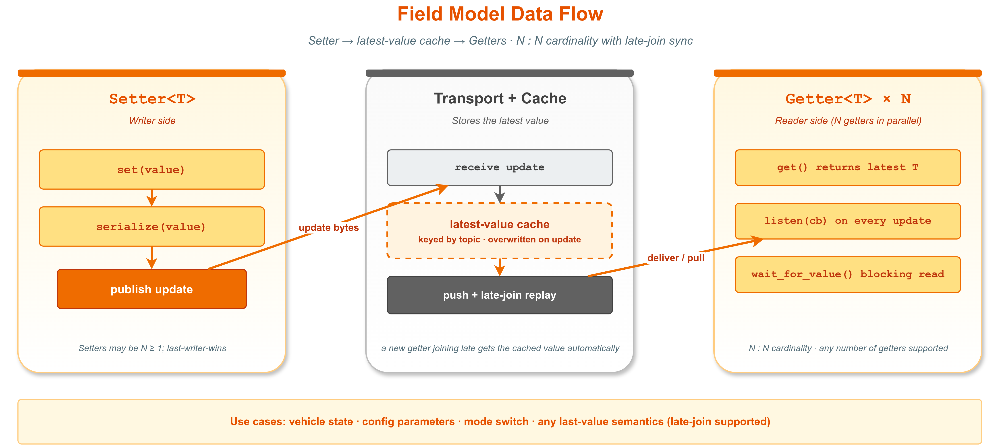
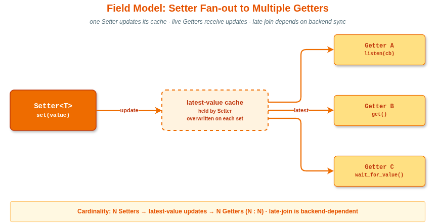

# 5. Field 模型（Setter / Getter）

字段模型是 VLink 三种通信模型之一，用于在节点之间**同步最新状态值**。Node 基类的通用 API（init / deinit / attach / set_property 等）请参阅 [节点基类与生命周期](02-node-lifecycle.md)。

## 目录

- [概念介绍](#概念介绍)
- [与 Event 模型的区别](#与-event-模型的区别)
- [适用场景](#适用场景)
- [Setter\<T\> 完整 API](#settert-完整-api)
- [Getter\<T\> 完整 API](#gettert-完整-api)
- [std::optional\<T\> 返回值说明](#stdoptionalt-返回值说明)
- [完整使用示例](#完整使用示例)
- [多 Getter 读取同一 Setter](#多-getter-读取同一-setter)
- [安全模式](#安全模式)
- [性能特性](#性能特性)

---

## 概念介绍

字段模型（Field Model）是 VLink 三大通信模型之一，用于在节点之间**同步最新状态值**。
与事件模型（Event Model）不同，字段模型不关心历史消息队列，只维护一个"当前最新值"。



**核心特性：**

- **最新值缓存**：Setter 每次调用 `set()` 都会将新值存入内部缓存，并广播给所有已连接的 Getter。
- **迟到 Getter 自动同步**：当一个 Getter 在 Setter 已经写值后才连接时，传输层会触发 `sync()` 回调，Setter 自动将缓存值重新发送给新连接的 Getter，使其立即获得当前状态。
- **轮询或监听两种读取方式**：Getter 支持 `get()`（主动轮询）和 `listen()`（被动回调）两种读取方式，也支持阻塞等待 `wait_for_value()`。
- **变化过滤**：Getter 支持 `set_change_reporting(true)`，当新值与上次相同时（原始字节比较），不触发回调，降低 CPU 占用。

---

## 与 Event 模型的区别

三种通信模型的对比请参阅 [Event 模型](03-event-model.md) 第 1 节。

字段模型与事件模型的核心区别在于：字段模型维护**最新值缓存**，迟到的 Getter 通过 sync 机制可立即获得当前值；而事件模型不保留历史消息，迟到的 Subscriber 会错过已发布的消息。

---

## 适用场景

字段模型非常适合以下场景：

**1. 配置参数同步**

```cpp
// 配置服务写入最新参数
Setter<int> max_speed_setter("shm://config/max_speed");
max_speed_setter.set(120);

// 各模块随时读取当前配置
Getter<int> max_speed_getter("shm://config/max_speed");
if (auto v = max_speed_getter.get()) {
    use_max_speed(*v);
}
```

**2. 传感器最新值**

```cpp
// 传感器驱动持续更新车速
Setter<float> speed_setter("dds://vehicle/speed");
speed_setter.set(current_speed_kph);

// 控制器读取最新车速（无需订阅历史值）
Getter<float> speed_getter("dds://vehicle/speed");
speed_getter.listen([](float v) {
    apply_speed_control(v);
});
```

**3. 系统状态同步**

```cpp
// 系统管理模块设置运行状态
Setter<bool> system_ready_setter("shm://system/ready");
system_ready_setter.set(true);

// 依赖模块等待系统就绪
Getter<bool> ready_getter("shm://system/ready");
if (ready_getter.wait_for_value()) {
    if (ready_getter.get().value_or(false)) {
        start_work();
    }
}
```

**4. HMI 显示最新数据**

```cpp
// 周期性更新仪表盘字段
Setter<DashboardData> dash_setter("dds://hmi/dashboard");
// ...每 100ms 写一次最新数据...

// HMI 进程读取最新仪表盘数据，仅关注变化
Getter<DashboardData> dash_getter("dds://hmi/dashboard");
dash_getter.set_change_reporting(true);
dash_getter.listen([](const DashboardData& d) {
    refresh_display(d);
});
```

---

## Setter\<T\> 完整 API

### 类声明

```cpp
template <typename ValueT, SecurityType SecT = SecurityType::kWithoutSecurity>
class Setter : public Node<SetterImpl, SecT>;
```

- `ValueT`：字段值类型，必须满足 `Serializer::is_supported()`。
- `SecT`：安全模式，默认无安全加密。

### 类型别名

| 别名         | 类型                                   | 说明               |
| ------------ | -------------------------------------- | ------------------ |
| `UniquePtr`  | `std::unique_ptr<Setter<ValueT, SecT>>` | unique_ptr 别名    |
| `SharedPtr`  | `std::shared_ptr<Setter<ValueT, SecT>>` | shared_ptr 别名    |

### 静态常量

| 常量           | 类型                  | 值         | 说明                              |
| -------------- | --------------------- | ---------- | --------------------------------- |
| `kImplType`    | `ImplType`            | `kSetter`  | 节点角色标识                      |
| `kValueType`   | `Serializer::Type`    | 编译期推断 | ValueT 对应的序列化类型枚举       |

### 工厂方法

```cpp
// 创建 unique_ptr 包装的 Setter
[[nodiscard]] static UniquePtr create_unique(
    const std::string& url_str,
    InitType type = InitType::kWithInit);

// 创建 shared_ptr 包装的 Setter
[[nodiscard]] static SharedPtr create_shared(
    const std::string& url_str,
    InitType type = InitType::kWithInit);
```

### 构造函数

```cpp
// 从 URL 字符串构造
explicit Setter(const std::string& url_str,
                InitType type = InitType::kWithInit);

// 从传输配置对象构造（ConfT 必须继承 Conf）
template <typename ConfT, typename = std::enable_if_t<std::is_base_of_v<Conf, ConfT>>>
explicit Setter(const ConfT& conf,
                InitType type = InitType::kWithInit);
```

`InitType::kWithInit`（默认）表示构造时立即调用 `init()` 完成初始化；若传入 `kWithoutInit`，需手动调用 `init()`。

### 核心方法

```cpp
// 写入新的字段值，广播给所有已连接的 Getter
void set(const ValueT& value);
```

`set()` 内部行为：

1. 加互斥锁，将 `value` 存入内部 `value_` 缓存。
2. 释放互斥锁。
3. 在锁外把值序列化为 `Bytes`（若启用安全，再对序列化结果加密）。
4. 通过传输层写入，通知所有已连接的 Getter。

当新 Getter 连接时，传输层触发 `sync()` 回调，Setter 重新发送缓存的 `value_`，确保新连接者立即获得当前值。

### 角色切换方法

```cpp
// 将此 Setter 角色切换为 kPublisher（事件发布者语义）
// 适用于某些传输后端不区分 Setter/Publisher 的场景
void mark_as_publisher();
```

---

## Getter\<T\> 完整 API

### 类声明

```cpp
template <typename ValueT, SecurityType SecT = SecurityType::kWithoutSecurity>
class Getter : public Node<GetterImpl, SecT>;
```

### 类型别名

| 别名           | 类型                                          | 说明                   |
| -------------- | --------------------------------------------- | ---------------------- |
| `UniquePtr`    | `std::unique_ptr<Getter<ValueT, SecT>>`        | unique_ptr 别名        |
| `SharedPtr`    | `std::shared_ptr<Getter<ValueT, SecT>>`        | shared_ptr 别名        |
| `MsgCallback`  | `vlink::Function<void(const ValueT&)>`         | 值变更回调函数类型     |

### 静态常量

| 常量           | 类型               | 值        | 说明                        |
| -------------- | ------------------ | --------- | --------------------------- |
| `kImplType`    | `ImplType`         | `kGetter` | 节点角色标识                |
| `kValueType`   | `Serializer::Type` | 编译期推断 | ValueT 对应的序列化类型枚举 |

### 工厂方法

```cpp
[[nodiscard]] static UniquePtr create_unique(
    const std::string& url_str,
    InitType type = InitType::kWithInit);

[[nodiscard]] static SharedPtr create_shared(
    const std::string& url_str,
    InitType type = InitType::kWithInit);
```

### 构造函数

```cpp
explicit Getter(const std::string& url_str,
                InitType type = InitType::kWithInit);

template <typename ConfT, typename = std::enable_if_t<std::is_base_of_v<Conf, ConfT>>>
explicit Getter(const ConfT& conf,
                InitType type = InitType::kWithInit);
```

### 读取方法

```cpp
// 主动轮询：返回最新缓存值；尚未收到任何值时返回 std::nullopt
// 内部持有 std::mutex，get() 对外返回的是 optional<ValueT> 的副本
[[nodiscard]] std::optional<ValueT> get() const;

// 阻塞等待：直到收到值或超时/中断
// 默认超时 Timeout::kDefaultInterval = 5'000ms（5 秒）
// timeout == 0 将打印警告并退化为无限等待
// 返回 true 表示有值可读；false 表示超时或被 interrupt() 中断
bool wait_for_value(
    std::chrono::milliseconds timeout = Timeout::kDefaultInterval);
```

### 监听方法

```cpp
// 注册值变更回调，每次 Setter 写入新值时触发
// 若启用了 change_reporting，重复值不触发回调
// 只能调用一次，多次调用为致命错误
bool listen(MsgCallback&& callback);
```

### 配置方法

```cpp
// 启用/禁用变化过滤：仅当新值原始字节与上次不同时才触发回调
void set_change_reporting(bool enable);

// 返回当前变化过滤状态
[[nodiscard]] bool get_change_reporting() const;
```

> change_reporting 的比较基于原始序列化字节，由 `last_cache_` 成员保存。线程安全由 `Getter` 内部的 `std::mutex mtx_` 保证。

```cpp
// 启用/禁用零拷贝手动 unloan 模式
void set_manual_unloan(bool manual_unloan) override;

// 启用/禁用端到端延迟和丢包统计
void set_latency_and_lost_enabled(bool enable);
```

### 统计/诊断方法

```cpp
// 返回是否已启用延迟和丢包统计
[[nodiscard]] bool is_latency_and_lost_enabled() const;

// 返回最近一次测量的端到端延迟（微秒），未启用时返回 0
[[nodiscard]] int64_t get_latency() const;

// 返回累计样本统计（total 预期数量，lost 丢失数量）
[[nodiscard]] SampleLostInfo get_lost() const;
```

### 继承自 Node 的公共 API

Node 基类继承的公共 API（init / deinit / attach / interrupt / set_security_key 等）请参阅 [节点基类与生命周期](02-node-lifecycle.md)。

### 角色切换方法

```cpp
// 将此 Getter 角色切换为 kSubscriber（事件订阅者语义）
void mark_as_subscriber();
```

---

## std::optional\<T\> 返回值说明

`Getter::get()` 返回 `std::optional<ValueT>`，而非直接返回 `ValueT`。这是因为 Getter 在初始化后、Setter 首次写入值之前处于"无值状态"。

```cpp
Getter<int> getter("shm://my_field");

// 情况 1：Setter 还没写过值
auto v = getter.get();
if (!v.has_value()) {
    // std::nullopt — 尚无值
}

// 情况 2：Setter 已写入值
auto v = getter.get();
if (v) {
    int current = *v;          // 解引用获取值
    int current2 = v.value(); // 或使用 value()
}

// 情况 3：带默认值的安全访问
int val = getter.get().value_or(0);

// 情况 4：配合 wait_for_value 确保有值
if (getter.wait_for_value(std::chrono::seconds(5))) {
    // wait_for_value 返回 true 时，get() 一定有值
    int val = *getter.get();
}
```

**注意事项：**

- `get()` 是线程安全的（内部持有互斥锁）。
- `get()` 每次调用都会深拷贝内部缓存值，对于大型消息类型（如 Protobuf），需考虑调用频率。
- 若只需在值变化时触发动作，优先使用 `listen()` 回调而非频繁轮询 `get()`。

---

## 完整使用示例

### 示例 1：基础 Setter / Getter（轮询方式）

```cpp
#include <vlink/vlink.h>
#include <thread>
#include <chrono>
#include <iostream>

using namespace vlink;
using namespace std::chrono_literals;

int main() {
    // 写端：设置车速字段
    Setter<float> setter("shm://vehicle/speed");
    setter.set(60.5f);

    // 读端：轮询读取
    Getter<float> getter("shm://vehicle/speed");

    // 等待传输层同步（shm 通常极快）
    std::this_thread::sleep_for(10ms);

    if (auto v = getter.get()) {
        std::cout << "当前车速: " << *v << " km/h" << std::endl;
    } else {
        std::cout << "暂无值" << std::endl;
    }

    return 0;
}
```

### 示例 2：listen 回调方式（变化监听）

```cpp
#include <vlink/vlink.h>
#include <thread>

using namespace vlink;
using namespace std::chrono_literals;

int main() {
    // 读端：注册回调
    Getter<int> getter("dds://config/max_retry");
    getter.set_change_reporting(true);  // 仅在值真正变化时触发回调

    getter.listen([](const int& v) {
        // 此回调在传输线程中执行，不要在此做耗时操作
        VLOG_I("max_retry 更新为:", v);
    });

    // 写端：周期性更新配置
    Setter<int> setter("dds://config/max_retry");

    std::thread writer([&setter]() {
        setter.set(3);
        std::this_thread::sleep_for(500ms);
        setter.set(3);   // 与上次相同，change_reporting 过滤，回调不触发
        std::this_thread::sleep_for(500ms);
        setter.set(5);   // 值变化，回调触发
    });

    writer.join();
    return 0;
}
```

### 示例 3：wait_for_value 阻塞等待

```cpp
#include <vlink/vlink.h>
#include <thread>
#include <iostream>

using namespace vlink;
using namespace std::chrono_literals;

int main() {
    Getter<std::string> getter("dds://system/config_version");

    // 在单独线程中等待值就绪
    std::thread reader([&getter]() {
        std::cout << "等待配置版本..." << std::endl;

        // 最多等待 10 秒
        if (getter.wait_for_value(10000ms)) {
            auto v = getter.get();
            std::cout << "配置版本: " << v.value_or("unknown") << std::endl;
        } else {
            std::cout << "等待超时" << std::endl;
        }
    });

    // 模拟延迟写入
    std::this_thread::sleep_for(2s);
    Setter<std::string> setter("dds://system/config_version");
    setter.set("v2.1.0");

    reader.join();
    return 0;
}
```

### 示例 4：Protobuf 类型的字段模型

```cpp
#include <vlink/vlink.h>
#include "vehicle_state.pb.h"  // 由 vlink_generate_cpp 生成

using namespace vlink;

int main() {
    // 车辆状态发布模块
    Setter<vehicle::State> state_setter("shm://vehicle/state");

    vehicle::State state;
    state.set_speed(80.0f);
    state.set_gear(3);
    state.set_engine_running(true);
    state_setter.set(state);

    // 控制模块读取车辆状态
    Getter<vehicle::State> state_getter("shm://vehicle/state");
    state_getter.listen([](const vehicle::State& s) {
        if (s.speed() > 100.0f) {
            trigger_speed_warning();
        }
    });

    // 直接轮询读取
    if (auto v = state_getter.get()) {
        std::cout << "Speed: " << v->speed() << std::endl;
    }

    return 0;
}
```

### 示例 5：使用配置对象（ShmConf）

```cpp
#include <vlink/vlink.h>
#include <vlink/modules/shm_conf.h>

using namespace vlink;

int main() {
    ShmConf::init_runtime("my_app");

    // 通过配置对象构造，指定 history=1（字段模式默认）
    ShmConf setter_conf("vehicle/gear", "", 0, 0, 1);
    Setter<int> setter(setter_conf);
    setter.set(2);

    ShmConf getter_conf("vehicle/gear", "", 0, 0, 1);
    Getter<int> getter(getter_conf);

    if (auto v = getter.get()) {
        std::cout << "Gear: " << *v << std::endl;
    }

    ShmConf::deinit_runtime();
    return 0;
}
```

### 示例 6：Bytes 类型的字段模型（含安全加密）

```cpp
#include <vlink/vlink.h>

using namespace vlink;

int main() {
    // SecuritySetter / SecurityGetter 启用自动加解密
    SecuritySetter<Bytes> setter("shm://example_raw/field");
    setter.set_security_key("my_secret_key");
    setter.set(Bytes{0xA, 0xB, 0xC});

    SecurityGetter<Bytes> getter("shm://example_raw/field");
    getter.set_security_key("my_secret_key");

    if (auto ret = getter.get()) {
        VLOG_I("Getter value:", ret.value());
    }

    return 0;
}
```

---

## 多 Getter 读取同一 Setter

字段模型天然支持 **N:N 拓扑**：同一 URL 可以有多个 Setter 和多个 Getter；最常见的形态是一个 Setter 对应多个 Getter。无论 Getter 何时连接，都能通过 sync 机制立即获得当前值：

```cpp
#include <vlink/vlink.h>
#include <thread>
#include <vector>

using namespace vlink;
using namespace std::chrono_literals;

int main() {
    // Setter 先写入值
    Setter<double> temp_setter("dds://sensor/temperature");
    temp_setter.set(25.6);

    // 3 个 Getter 在不同时刻连接，均能立即获得当前值
    auto start_getter = [](int id) {
        std::this_thread::sleep_for(std::chrono::milliseconds(id * 100));

        Getter<double> getter("dds://sensor/temperature");

        // 无需等待，sync 机制使新连接 Getter 立即收到缓存值
        if (getter.wait_for_value(1000ms)) {
            auto v = getter.get();
            VLOG_I("Getter", id, "收到温度:", v.value_or(-1.0));
        }
    };

    std::vector<std::thread> threads;
    for (int i = 1; i <= 3; ++i) {
        threads.emplace_back(start_getter, i);
    }

    for (auto& t : threads) {
        t.join();
    }

    return 0;
}
```

**关键点：**

- 每个 Getter 实例独立维护自己的内部值缓存和回调。
- 多 Getter 并发调用 `get()` 是线程安全的（各自有独立的互斥锁）。
- 若 Setter 在多 Getter 运行期间持续 `set()`，每个 Getter 的 `listen()` 回调均独立触发。
- 若启用 `set_change_reporting(true)`，每个 Getter 实例独立判断是否"变化"（基于各自的 `last_cache_`）。



---

## 安全模式

```cpp
// SecuritySetter: 等价于 Setter<ValueT, SecurityType::kWithSecurity>
template <typename ValueT>
class SecuritySetter : public Setter<ValueT, SecurityType::kWithSecurity>;

// SecurityGetter: 等价于 Getter<ValueT, SecurityType::kWithSecurity>
template <typename ValueT>
class SecurityGetter : public Getter<ValueT, SecurityType::kWithSecurity>;
```

```cpp
SecuritySetter<MyMsg> setter("dds://secure/field");
setter.set_security_key("my_32byte_aes_key");

SecurityGetter<MyMsg> getter("dds://secure/field");
getter.set_security_key("my_32byte_aes_key");
```

完整安全加密配置请参阅 [安全加密](09-security.md)。

---

## 性能特性

| 指标               | 说明                                                                     |
| ------------------ | ------------------------------------------------------------------------ |
| 延迟               | 取决于传输后端：`shm://` 微秒级，`dds://` 百微秒至毫秒级                 |
| `get()` 开销       | 一次互斥锁 + 值拷贝；大型消息频繁轮询时注意拷贝开销                      |
| `listen()` 开销    | 回调在传输线程执行，避免在回调中做耗时阻塞操作                           |
| `set_change_reporting` | 启用后增加每次到达时的字节级比较开销，但可大幅减少回调触发次数       |
| 迟到 Getter 同步   | sync 重发一次缓存值，开销等同于一次普通 `set()` 调用                     |
| 内存               | Getter 内部 `value_` 为 `std::optional<ValueT>`，生命期内始终持有最新值  |
| 线程安全           | `get()`、`set()`、`listen()` 均线程安全（内部互斥锁保护）                |

**性能建议：**

- 对于高频更新（> 1kHz）的字段，优先使用 `shm://` 或 `intra://` 后端（`intra://` 支持字段模型，且延迟最低，但仅限同进程内使用）。
- 若多模块只需在值变化时响应，使用 `listen()` + `set_change_reporting(true)` 比定时轮询 `get()` 效率更高。
- 对于 POD 类型（如 `int`、`float`、简单结构体），`set()`/`get()` 开销极低，几乎等同于内存拷贝。
- 若需要延迟监控，调用 `set_latency_and_lost_enabled(true)` 后通过 `get_latency()` 获取微秒级端到端延迟。

---

## 相关文档

- [节点基类与生命周期](02-node-lifecycle.md) -- Node 通用 API（init / deinit / attach / security 等）
- [Event 模型（Publisher / Subscriber）](03-event-model.md) -- 事件发布订阅通信
- [Method 模型（Client / Server）](04-method-model.md) -- RPC 请求响应通信
