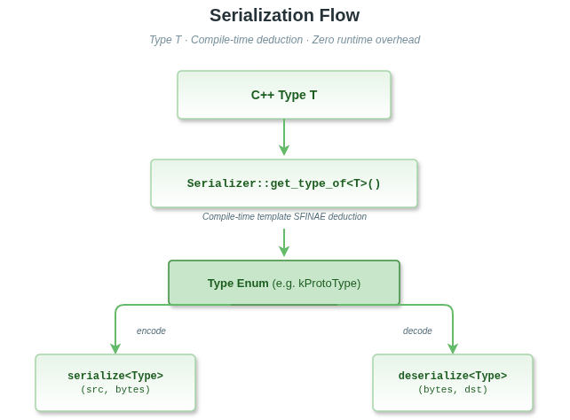
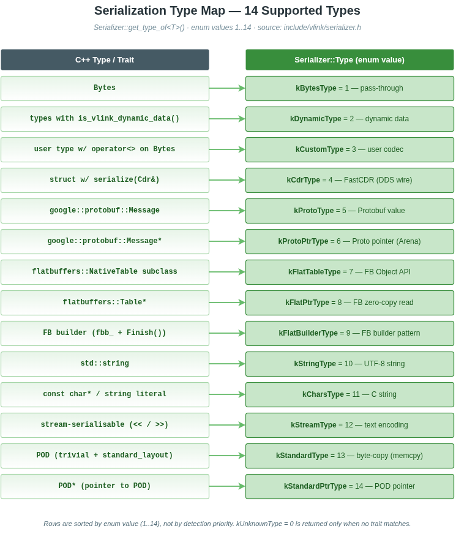

# 6. 序列化

## 目录

- [概述](#概述)
- [自动类型推断机制](#自动类型推断机制)
- [所有序列化类型总览](#所有序列化类型总览)
- [各类型详细说明](#各类型详细说明)
  - [kBytesType — 原始字节直传](#kbytestype--原始字节直传)
  - [kProtoType — Protobuf 值类型](#kprototype--protobuf-值类型)
  - [kProtoPtrType — Protobuf 指针类型](#kprotoptrtype--protobuf-指针类型)
  - [kFlatTableType — FlatBuffers NativeTable](#kflattabletype--flatbuffers-nativetable)
  - [kFlatPtrType — FlatBuffers 表指针（零拷贝读）](#kflatptrtype--flatbuffers-表指针零拷贝读)
  - [kFlatBuilderType — FlatBuffers Builder](#kflatbuildertype--flatbuffers-builder)
  - [kCdrType — FastDDS CDR 编码](#kcdrtype--fastdds-cdr-编码)
  - [kStandardType — POD 值类型](#kstandardtype--pod-值类型)
  - [kStandardPtrType — POD 指针类型（零拷贝）](#kstandardptrtype--pod-指针类型零拷贝)
  - [kStringType — std::string](#kstringtype--stdstring)
  - [kCharsType — C 字符串](#kcharstype--c-字符串)
  - [kStreamType — 流序列化类型](#kstreamtype--流序列化类型)
  - [kCustomType — 自定义序列化器](#kcustomtype--自定义序列化器)
  - [kDynamicType — 动态类型](#kdynamictype--动态类型)
- [自定义序列化器实现](#自定义序列化器实现)
- [Bytes 类详细介绍](#bytes-类详细介绍)
- [Protobuf 集成](#protobuf-集成)
- [FlatBuffers 集成](#flatbuffers-集成)
- [性能对比](#性能对比)
- [常见错误和避坑指南](#常见错误和避坑指南)

---

## 概述

VLink 序列化系统基于 **编译期类型推断**，通过 `constexpr if` 链在编译时确定每种消息类型应使用的编解码器。
应用层代码几乎不需要直接调用序列化 API，框架在 `publish()`、`listen()`、`invoke()`、`set()`、`get()` 等接口内部自动完成序列化和反序列化。



### 类型映射总览



**关键设计原则：**

- 所有类型检测和分派均在编译期完成，无虚函数、无运行时类型判断。
- 不支持的类型（`kUnknownType`）在构造 Publisher/Subscriber/Setter/Getter/Client/Server 时触发 `static_assert` 编译错误，第一时间暴露问题。
- 同一套 API（`publish()`、`set()` 等）对所有序列化类型透明，切换序列化方式只需更换消息类型，无需修改通信代码。

**相关文档：**

- 构建与编译配置请参阅 [构建指南](01-build.md)
- Event / Method / Field 通信模型请参阅 [Event 模型](03-event-model.md)
- Bytes 等基础组件请参阅 [基础库](11-base-library.md)
- 传输后端选择请参阅 [传输后端](07-transport.md)

---

## 自动类型推断机制

`Serializer::get_type_of<T>()` 通过以下优先级链依次检测：

```
T == Bytes                          -> kBytesType
T 有 is_vlink_dynamic_data()        -> kDynamicType
T 有 serialize(Cdr&)/deserialize(Cdr&) -> kCdrType
T 有 SerializeToArray()/ParseFromArray() -> kProtoType
T* 指向有上述方法的消息             -> kProtoPtrType
T 继承 flatbuffers::NativeTable     -> kFlatTableType
T* 指向 flatbuffers::Table          -> kFlatPtrType
T 有 fbb_ 成员 + Finish()           -> kFlatBuilderType
T 有 operator>>(Bytes&)/operator<<(const Bytes&) -> kCustomType
T == std::string                    -> kStringType
T 可由 std::string 构造（非 string）-> kCharsType
T 是 trivial + standard_layout      -> kStandardType
T* 指向 trivial + standard_layout   -> kStandardPtrType
T 支持 std::stringstream << 和 >>   -> kStreamType
否则                                -> kUnknownType（编译报错）
```

**示例：编译期类型查询**

```cpp
#include <vlink/serializer.h>

// 查询 int 的序列化类型（standard 类型优先级高于 stream）
constexpr auto t = vlink::Serializer::get_type_of<int>();
static_assert(t == vlink::Serializer::kStandardType, "int is standard-serialisable");

// 查询 std::string 的序列化类型
constexpr auto ts = vlink::Serializer::get_type_of<std::string>();
static_assert(ts == vlink::Serializer::kStringType, "");

// 编译期断言支持性检查
static_assert(vlink::Serializer::is_supported(t), "");
```

### Serializer 核心函数

| 函数                                       | 说明                                                                     |
| ------------------------------------------ | ------------------------------------------------------------------------ |
| `Serializer::get_type_of<T>()`             | 编译期返回 `T` 对应的 `Serializer::Type` 枚举值                          |
| `Serializer::is_supported(Type)`           | 判断该类型枚举是否受支持（仅 `kUnknownType` 返回 `false`）               |
| `Serializer::serialize(src, des)`          | 将 `src` 序列化到 `Bytes des`，返回 `bool`                               |
| `Serializer::deserialize(src, des)`        | 将 `Bytes src` 反序列化到 `des`，返回 `bool`                             |
| `Serializer::convert<SrcT, DesT>(src, des)` | 在两种类型之间转换（至少一端必须是 `Bytes`），返回 `bool`                |
| `Serializer::get_serialized_type<T>()`     | 返回 `T` 的序列化类型名称字符串（如 Protobuf fully-qualified name）       |
| `Serializer::get_serialized_size(src)`     | 返回 `src` 序列化后的字节大小；大小不可预知时返回 `0`                     |

---

## 所有序列化类型总览

| 类型常量            | 触发条件                                                    | 说明                           | 依赖库          |
| ------------------- | ----------------------------------------------------------- | ------------------------------ | --------------- |
| `kBytesType`        | `T == Bytes`                                                | 原始字节直传，零拷贝           | 无              |
| `kDynamicType`      | 有 `is_vlink_dynamic_data()` 成员                           | 动态类型，运行时字段定义       | 无              |
| `kCdrType`          | 有 `serialize(Cdr&)` 和 `deserialize(Cdr&)`                 | FastDDS CDR 编码，RTPS 标准    | eProsima FastCDR |
| `kProtoType`        | 有 `SerializeToArray()` 和 `ParseFromArray()`               | Protobuf 值类型                | protobuf        |
| `kProtoPtrType`     | 指向有上述方法的消息的指针                                  | Protobuf 指针（Arena 管理）    | protobuf        |
| `kFlatTableType`    | 继承 `flatbuffers::NativeTable`                             | FlatBuffers Object API         | flatbuffers     |
| `kFlatPtrType`      | 指向 `flatbuffers::Table` 子类的指针                        | FlatBuffers 零拷贝读           | flatbuffers     |
| `kFlatBuilderType`  | 有 `fbb_` 成员 + `Finish()`                                 | FlatBuffers Builder 模式       | flatbuffers     |
| `kCustomType`       | 有 `operator>>(Bytes&)` 和 `operator<<(const Bytes&)`       | 用户自定义编解码器             | 无              |
| `kStringType`       | `T == std::string`                                          | UTF-8 字符串                   | 无              |
| `kCharsType`        | 可由 `std::string` 构造（但不是 `std::string`）             | C 字符串字面量 / `char*`       | 无              |
| `kStreamType`       | 支持 `std::stringstream` 的 `<<` 和 `>>`（双向流）          | 流式文本编码                   | 无              |
| `kStandardType`     | `std::is_trivial_v && std::is_standard_layout_v`（非指针） | POD 结构体，直接内存拷贝       | 无              |
| `kStandardPtrType`  | 指向 trivial + standard_layout 类型的指针                   | POD 指针，零拷贝               | 无              |

> `Serializer::Type`（`include/vlink/serializer.h:123-139`）共 14 个有效枚举（不含 `kUnknownType = 0`）。`kCustomType` 的枚举值为 `3`，但在 `get_type_of<T>()` 的 `if constexpr` 链中优先级低于 CDR / Protobuf / FlatBuffers —— 枚举值顺序不等于检测顺序。

---

## 各类型详细说明

### kBytesType — 原始字节直传

**触发条件：** `T == vlink::Bytes`

`Bytes` 是 VLink 的原生字节容器。发布 `Bytes` 类型消息时，序列化层直接传递字节缓冲区，无任何额外编解码开销。这是最底层、最灵活的通信方式，适合自定义协议或透明代理场景。

```cpp
#include <vlink/vlink.h>

using namespace vlink;

// 发布原始字节
Publisher<Bytes> pub("shm://raw/channel");
auto buf = Bytes::create(256);
std::memcpy(buf.data(), payload, 256);
pub.publish(buf);

// 订阅原始字节
Subscriber<Bytes> sub("shm://raw/channel");
sub.listen([](const Bytes& msg) {
    // msg.data() — 指向字节数据
    // msg.size() — 字节数
    process_raw(msg.data(), msg.size());
});
```

---

### kProtoType — Protobuf 值类型

**触发条件：** `T` 具有 `SerializeToArray()` 和 `ParseFromArray()` 方法（通常继承自 `google::protobuf::MessageLite`）

Protobuf 是最常用的序列化方式，适合跨语言、跨平台的消息定义。VLink 使用 Protobuf 的二进制格式，通过 `SerializeToArray()` / `ParseFromArray()` 进行编解码。

```cpp
#include <vlink/vlink.h>
#include "my_message.pb.h"   // 由 protoc 或 vlink_generate_cpp 生成

using namespace vlink;

// 发布 Protobuf 消息（值传递）
Publisher<MyProtoMsg> pub("dds://my/topic");

MyProtoMsg msg;
msg.set_id(42);
msg.set_name("hello");
pub.publish(msg);

// 订阅
Subscriber<MyProtoMsg> sub("dds://my/topic");
sub.listen([](const MyProtoMsg& m) {
    std::cout << "id=" << m.id() << " name=" << m.name() << std::endl;
});
```

---

### kProtoPtrType — Protobuf 指针类型

**触发条件：** `T` 是指向 Protobuf 消息的原始指针（如 `MyProtoMsg*`）

适合 Arena 分配模式，避免频繁的 new/delete 开销。VLink 通过指针取值后再序列化。

```cpp
// Arena 模式
google::protobuf::Arena arena;
MyProtoMsg* msg = google::protobuf::Arena::CreateMessage<MyProtoMsg>(&arena);
msg->set_id(1);

Publisher<MyProtoMsg*> pub("dds://arena/topic");
pub.publish(msg);
// msg 的生命期由 Arena 管理，不需要手动 delete
```

---

### kFlatTableType — FlatBuffers NativeTable

**触发条件：** `T`（或 `shared_ptr<T>` 中的 T）继承 `flatbuffers::NativeTable`

FlatBuffers Object API 生成的 `*T` 类（Native Table）。序列化时调用 `Pack()` 将其打包到 `FlatBufferBuilder`，反序列化时调用 `UnPack()`。

```cpp
#include <vlink/vlink.h>
#include "my_message_generated.h"  // 由 flatc 生成，包含 MyMessageT（NativeTable）

using namespace vlink;

Publisher<MyMessageT> pub("shm://flat/topic");

MyMessageT msg;
msg.value = 42;
msg.name = "hello";
pub.publish(msg);

Subscriber<MyMessageT> sub("shm://flat/topic");
sub.listen([](const MyMessageT& m) {
    std::cout << m.value << " " << m.name << std::endl;
});
```

---

### kFlatPtrType — FlatBuffers 表指针（零拷贝读）

**触发条件：** `T` 是指向 `flatbuffers::Table` 子类的指针（如 `const MyMessage*`）

零拷贝读取 FlatBuffers 原始缓冲区，无需反序列化到中间对象，访问速度极快。指针直接指向接收缓冲区内的 FlatBuffers 表，生命期与底层 `Bytes` 一致。

```cpp
// 接收端使用 FlatBuffers 零拷贝指针
Subscriber<const MyMessage*> sub("shm://flat/topic");
sub.listen([](const MyMessage* m) {
    if (m) {
        std::cout << m->value() << std::endl;
        // 注意：m 的生命期仅在此回调内有效
    }
});

// 发送端仍可使用 FlatBuilderType 或 FlatTableType
Publisher<MyMessageT> pub("shm://flat/topic");
```

---

### kFlatBuilderType — FlatBuffers Builder

**触发条件：** `T` 有 `fbb_` 成员（`FlatBufferBuilder`）且有 `Finish()` 方法

VLink 检测到消息对象持有 `FlatBufferBuilder` 时，在序列化时直接调用 `Finish()` 并取出缓冲区。

```cpp
struct MyFlatMsg {
    flatbuffers::FlatBufferBuilder fbb_;

    void Build(int val) {
        auto offset = CreateMyMessage(fbb_, val);
        fbb_.Finish(offset);
    }
};

Publisher<MyFlatMsg> pub("dds://flat/builder");

MyFlatMsg msg;
msg.Build(99);
pub.publish(msg);
```

---

### kCdrType — FastDDS CDR 编码

**触发条件：** `T` 有 `serialize(eprosima::fastcdr::Cdr&)` 和 `deserialize(eprosima::fastcdr::Cdr&)` 方法，或类名包含 `VLINK_FASTDDS_IDL_PREFIX` 前缀

CDR（Common Data Representation）是 DDS 标准的二进制格式，由 FastCDR 库实现。通常用于从 IDL 文件自动生成的消息类型。CDR 类型在 `dds://` 传输中有特殊快速路径优化（指针直传，无额外字节拷贝）。

```cpp
// IDL 生成的类型（自动匹配 kCdrType）
#include "MyMessage.h"         // fastdds idl 生成
#include "MyMessagePubSubTypes.h"

// 必须先注册类型支持
vlink::DdsConf::register_topic<MyMessagePubSubType>("my_topic");

Publisher<MyMessage> pub("dds://my_topic");
MyMessage msg;
msg.value(42);
pub.publish(msg);
```

---

### kStandardType — POD 值类型

**触发条件：** `std::is_trivial_v<T> && std::is_standard_layout_v<T>`，且 T 不是指针

对于简单的 C 风格结构体（Plain Old Data），VLink 直接进行 `sizeof(T)` 字节的内存拷贝，无任何编解码开销，是**速度最快**的序列化方式（除零拷贝外）。

```cpp
struct SensorData {
    float temperature;
    float humidity;
    uint64_t timestamp_us;
    // 只包含基础类型，满足 trivial + standard_layout
};

static_assert(std::is_trivial_v<SensorData>);
static_assert(std::is_standard_layout_v<SensorData>);

Publisher<SensorData> pub("shm://sensor/imu");

SensorData data{25.6f, 60.2f, get_timestamp()};
pub.publish(data);

Subscriber<SensorData> sub("shm://sensor/imu");
sub.listen([](const SensorData& d) {
    process(d.temperature, d.humidity);
});
```

**注意：** POD 类型不包含任何版本信息，结构体字段顺序、大小必须在发布端和订阅端完全一致，否则数据解析错误。不适合跨机器/跨架构的不同字节序场景。

---

### kStandardPtrType — POD 指针类型（零拷贝）

**触发条件：** `T` 是指向 trivial + standard_layout 类型的指针

零拷贝 POD，指针被重解释后直接传递，无内存拷贝，适用于大型 POD 结构体（如相机帧、点云）的进程内或共享内存通信。

```cpp
struct LargeFrame {
    uint8_t pixels[1920 * 1080 * 3];
    uint64_t timestamp;
};

// 零拷贝发布（指针模式）
Publisher<LargeFrame*> pub("shm://camera/frame");
LargeFrame* frame = get_shm_buffer();
pub.publish(frame);

// 接收端
Subscriber<LargeFrame*> sub("shm://camera/frame");
sub.listen([](const LargeFrame* f) {
    if (f) {
        display_frame(f->pixels);
    }
});
```

---

### kStringType — std::string

**触发条件：** `T == std::string`

UTF-8 字符串，内容直接复制到 `Bytes` 缓冲区，反序列化时从缓冲区重建 `std::string`。

```cpp
Publisher<std::string> pub("dds://log/messages");
pub.publish("System started successfully");

Subscriber<std::string> sub("dds://log/messages");
sub.listen([](const std::string& msg) {
    std::cout << msg << std::endl;
});
```

---

### kCharsType — C 字符串

**触发条件：** 可由 `std::string` 构造（但不是 `std::string`），如 `const char*`

C 字符串字面量或 `char*` 类型。发布时转为 `std::string` 再序列化，接收端反序列化为 `std::string`。

```cpp
Publisher<const char*> pub("intra://log/raw");
pub.publish("hello from C string");

// 接收端通常用 std::string 接收
Subscriber<std::string> sub("intra://log/raw");
```

---

### kStreamType — 流序列化类型

**触发条件：** `T` 支持 `std::stringstream` 的 `operator<<` 和 `operator>>`（双向），不是指针类型，且 **既不满足 `kStandardType` 也不满足更高优先级类型** 的检测条件。

在类型推断链中（参见 `include/vlink/internal/serializer-inl.h` 中 `get_type_of<T>()` 的 `if constexpr` 链），`kStandardType` / `kStandardPtrType` 会在 `kStreamType` **之前**检测。因此：

- **trivial + standard_layout 的算术类型**（`int`、`double` 等）——即使也能通过 `stringstream << / >>`——仍然会被优先推断为 `kStandardType`，走 memcpy 二进制路径。
- 只有**非 trivial 或非 standard_layout**（例如带 `std::string` 成员、带虚函数、带非 POD 成员），但额外实现了 stringstream 双向流的类型，才会落入 `kStreamType`（文本编码）。

```cpp
// int、double 等 trivial + standard_layout 算术类型走 kStandardType（memcpy 二进制），
// 而不是 kStreamType —— 类型推断链中 Standard 先于 Stream。
static_assert(vlink::Serializer::get_type_of<int>() == vlink::Serializer::kStandardType);

// 纯 POD 结构体也走 kStandardType
struct MyPod {
    float x, y, z;
};
static_assert(vlink::Serializer::get_type_of<MyPod>() == vlink::Serializer::kStandardType);

// 含 std::string 等非 trivial 成员的类型 —— 即使也匹配其它某些条件 ——
// 在实现双向 stringstream 流后才会走 kStreamType（文本编码）
struct MyStreamMsg {
    std::string name;   // 使类型非 trivial，从而跳过 kStandardType 分支
    int x;
    friend std::ostream& operator<<(std::ostream& os, const MyStreamMsg& m) {
        return os << m.name << ' ' << m.x;
    }
    friend std::istream& operator>>(std::istream& is, MyStreamMsg& m) {
        return is >> m.name >> m.x;
    }
};
static_assert(vlink::Serializer::get_type_of<MyStreamMsg>() == vlink::Serializer::kStreamType);
```

---

### kCustomType — 自定义序列化器

**触发条件：** `T` 有 `operator>>(vlink::Bytes&)` 和 `operator<<(const vlink::Bytes&)` 方法

用户完全控制序列化逻辑，适合：
- 历史遗留的私有二进制协议
- 需要特殊压缩或加密处理的场景
- 不依赖任何第三方序列化库的场景

详见 [自定义序列化器实现](#自定义序列化器实现) 章节。

---

### kDynamicType — 动态类型

**触发条件：** `T` 有 `is_vlink_dynamic_data()` 成员函数

动态类型允许在运行时定义字段结构，无需在编译期固定消息格式。适合调试工具、监控系统、协议桥接等场景。通常通过 VLink 的 `DynamicData` 类使用。

```cpp
#include <vlink/extension/dynamic_data.h>

// DynamicData 满足 is_vlink_dynamic_data() 条件
Publisher<DynamicData> pub("dds://dynamic/topic");

DynamicData msg;
msg["speed"] = 80.0f;
msg["gear"] = 3;
pub.publish(msg);
```

---

## 自定义序列化器实现

实现自定义序列化器只需在类型上重载两个运算符：

```cpp
// operator>> : 序列化（对象 -> Bytes）
void operator>>(vlink::Bytes& out) const;

// operator<< : 反序列化（Bytes -> 对象）
void operator<<(const vlink::Bytes& in);
```

### 完整示例

```cpp
#include <vlink/vlink.h>
#include <cstring>

struct MyCustomProtocol {
    uint32_t magic{0xDEADBEEF};
    uint16_t cmd{0};
    std::vector<uint8_t> payload;

    // 序列化：将对象写入 Bytes
    void operator>>(vlink::Bytes& out) const {
        size_t total = sizeof(magic) + sizeof(cmd) + sizeof(uint32_t) + payload.size();
        out = vlink::Bytes::create(total);

        uint8_t* ptr = out.data();
        std::memcpy(ptr, &magic, sizeof(magic));  ptr += sizeof(magic);
        std::memcpy(ptr, &cmd,   sizeof(cmd));    ptr += sizeof(cmd);

        uint32_t payload_size = static_cast<uint32_t>(payload.size());
        std::memcpy(ptr, &payload_size, sizeof(payload_size));  ptr += sizeof(payload_size);
        std::memcpy(ptr, payload.data(), payload.size());
    }

    // 反序列化：从 Bytes 还原对象
    void operator<<(const vlink::Bytes& in) {
        const uint8_t* ptr = in.data();
        std::memcpy(&magic, ptr, sizeof(magic));  ptr += sizeof(magic);
        std::memcpy(&cmd,   ptr, sizeof(cmd));    ptr += sizeof(cmd);

        uint32_t payload_size = 0;
        std::memcpy(&payload_size, ptr, sizeof(payload_size));  ptr += sizeof(payload_size);
        payload.assign(ptr, ptr + payload_size);
    }
};

// 验证类型推断
static_assert(vlink::Serializer::get_type_of<MyCustomProtocol>() == vlink::Serializer::kCustomType);

// 正常使用
vlink::Publisher<MyCustomProtocol> pub("dds://custom/channel");
MyCustomProtocol msg;
msg.cmd = 0x01;
msg.payload = {0xAA, 0xBB, 0xCC};
pub.publish(msg);

vlink::Subscriber<MyCustomProtocol> sub("dds://custom/channel");
sub.listen([](const MyCustomProtocol& m) {
    // m 已由框架自动反序列化
    std::cout << "cmd=0x" << std::hex << m.cmd << std::endl;
});
```

### 注意事项

- `operator>>` 中必须确保 `out` 有足够大小，使用 `Bytes::create(size)` 分配。
- `operator<<` 不应假设 `in.size()` 固定，要做合法性检查。
- 两端的序列化/反序列化逻辑必须字节对齐，注意大小端问题。
- 若消息大小可变，在 `operator>>` 中动态计算所需字节数后再分配。

---

## Bytes 类详细介绍

`vlink::Bytes` 是 VLink 序列化系统的底层数据载体，所有序列化后的消息都以 `Bytes` 形式在传输层流动。

### 设计特点

- **固定对象大小**：对象自身始终为 128 字节（96 字节内联栈缓冲 + 元数据）。
- **小缓冲优化（SBO）**：不超过 96 字节的数据直接存储在对象内，零堆分配。
- **内存池支持**：堆分配走 `vlink::MemoryPool`（分级 free-list 池），按 size class 分发，减少堆分配开销。
- **五种所有权模式**：

| 工厂方法                        | 是否拥有内存 | 拷贝行为 | 典型用途                        |
| ------------------------------- | ------------ | -------- | ------------------------------- |
| `Bytes::create(size)`           | 是           | 深拷贝   | 普通分配                        |
| `Bytes::shallow_copy(ptr, size)` | 否           | 指针别名 | 零拷贝包装外部缓冲区            |
| `Bytes::deep_copy(ptr, size)`   | 是           | 深拷贝   | 安全拷贝外部缓冲区              |
| `Bytes::loan_internal(ptr, size)` | 否（借用） | 指针别名 | Iceoryx 零拷贝 Chunk            |
| `Bytes::shallow_copy_ptr(ptr)`  | 否           | 指针别名 | 携带不透明指针（size == 0）     |

### 核心 API

```cpp
// 分配
auto buf = vlink::Bytes::create(1024);       // 分配 1024 字节
auto buf2 = vlink::Bytes::create(64, 4);     // 分配 64 字节，预留 4 字节头部偏移

// 数据访问
uint8_t* p = buf.data();                     // 用户数据起始指针（跳过偏移区）
uint8_t* rp = buf.real_data();               // 原始缓冲区起始（含偏移区）
size_t sz = buf.size();                      // 用户数据字节数
size_t rsz = buf.real_size();               // 总字节数（含偏移区）
size_t cap = buf.capacity();               // 分配容量

// 所有权
bool owned = buf.is_owner();               // 是否拥有内存
bool loaned = buf.is_loaned();             // 是否为 Iceoryx 借用
bool empty = buf.empty();                  // data_ == nullptr && size_ == 0

// 内容操作
buf[0] = 0xFF;                             // 下标访问（无边界检查）
buf.resize(2048);                          // 扩容（必要时重新分配）
buf.shrink_to(512);                        // 缩小逻辑大小（不释放内存）
buf.clear();                               // 释放并归零

// 零拷贝包装外部缓冲
auto view = vlink::Bytes::shallow_copy(ext_ptr, ext_size);

// 深拷贝
auto copy = vlink::Bytes::deep_copy(ext_ptr, ext_size);

// 字符串互转
auto from_str = vlink::Bytes::from_string("hello");
std::string to_str = buf.to_string();
std::string_view sv = buf.to_string_view();  // 零拷贝视图

// 指针模式（携带不透明指针）
void* ptr = get_some_ptr();
auto bytes_ptr = vlink::Bytes::shallow_copy_ptr(ptr);
auto* recovered = bytes_ptr.to_ptr<MyStruct>();
```

### 内存池

```cpp
// 程序启动时调用一次：触发 vlink::MemoryPool::global_instance(true)，
// 从 VLINK_MEMORY_LEVEL（0..9，默认 3；0 = bypass，直通 ::operator new）读取分级配置。
vlink::Bytes::init_memory_pool();

// 周期性 trim：仅释放完全空闲的 chunk，含 live block 的 chunk 保留；
// 可与并发 Bytes API 调用安全交错。析构期全量释放仍随进程结束。
vlink::Bytes::release_memory_pool();
```

`Bytes` 的堆分配统一走 `vlink::MemoryPool`（参见 [11.4 节](11-base-library.md#114-内存池-memorypool)）。

### 工具方法

```cpp
// 压缩 / 解压（LZAV 算法）
auto compressed = vlink::Bytes::compress_data(buf.data(), buf.size());
if (vlink::Bytes::is_compress_data(compressed.data(), compressed.size())) {
    auto original = vlink::Bytes::uncompress_data(compressed.data(), compressed.size());
}

// Base64 编解码
std::string b64 = vlink::Bytes::encode_to_base64(buf);
auto decoded = vlink::Bytes::decode_from_base64(b64);

// CRC-32 校验（CRC-32/ISO-HDLC）
uint32_t crc32 = vlink::Bytes::get_crc_32(buf);

// CRC-64 校验（CRC-64/ECMA-182）
uint64_t crc64 = vlink::Bytes::get_crc_64(buf);

// 字节序反转
auto reversed = vlink::Bytes::reverse_order(buf);

// 十六进制字符串
std::string hex = vlink::Bytes::convert_to_hex_str(buf.data(), buf.size());

// 用户输入解析（支持 "0x1A2B" 格式）
bool ok = false;
auto parsed = vlink::Bytes::from_user_input("0x01020304", &ok);

// 字节序检测
bool le = vlink::Bytes::is_little_endian();
bool be = vlink::Bytes::is_big_endian();
```

### 偏移区（Offset）机制

`Bytes` 支持在数据前预留头部空间，传输层可在原地写入协议头，避免重新分配：

```cpp
// 预留 8 字节给传输层头部
auto buf = vlink::Bytes::create(payload_size, 8);

// 用户数据区
buf.data();       // 指向 real_data() + 8
buf.size();       // == payload_size

// 头部区
buf.real_data();  // 指向缓冲区起始
buf.offset();     // == 8
```

---

## Protobuf 集成

> Protobuf / FlatBuffers 的 CMake 集成配置请参阅 [构建指南](01-build.md) 第 1.6 节。

### 使用示例

```protobuf
// my_message.proto
syntax = "proto3";
package example;

message VehicleState {
    float speed = 1;
    int32 gear = 2;
    bool engine_on = 3;
    string vin = 4;
}
```

```cpp
#include <vlink/vlink.h>
#include "my_message.pb.h"

using namespace vlink;

// 发布
Publisher<example::VehicleState> pub("dds://vehicle/state");
example::VehicleState state;
state.set_speed(80.0f);
state.set_gear(3);
state.set_engine_on(true);
state.set_vin("LVHB1234567890000");
pub.publish(state);

// 订阅
Subscriber<example::VehicleState> sub("dds://vehicle/state");
sub.listen([](const example::VehicleState& s) {
    std::cout << "speed=" << s.speed() << " gear=" << s.gear() << std::endl;
});
```

### Protobuf Arena 加速（kProtoPtrType）

```cpp
// 使用 Arena 避免频繁 new/delete
google::protobuf::ArenaOptions options;
options.initial_block_size = 4096;
google::protobuf::Arena arena(options);

// 发布端
Publisher<example::VehicleState*> pub("dds://vehicle/state");

example::VehicleState* state = google::protobuf::Arena::CreateMessage<example::VehicleState>(&arena);
state->set_speed(80.0f);
pub.publish(state);
// arena 析构时自动释放 state，无需手动 delete
```

---

## FlatBuffers 集成

> Protobuf / FlatBuffers 的 CMake 集成配置请参阅 [构建指南](01-build.md) 第 1.6 节。

### Schema 示例

```flatbuffers
// my_message.fbs
namespace example;

table VehicleState {
    speed: float;
    gear: int;
    engine_on: bool;
    vin: string;
}

root_type VehicleState;
```

### 使用 Object API（kFlatTableType）

```cpp
#include <vlink/vlink.h>
#include "my_message_generated.h"   // flatc 生成，包含 VehicleStateT

using namespace vlink;

// 发布（Object API，方便修改字段）
Publisher<example::VehicleStateT> pub("shm://vehicle/state");

example::VehicleStateT state;
state.speed = 80.0f;
state.gear = 3;
state.engine_on = true;
state.vin = "LVHB1234567890000";
pub.publish(state);

// 订阅
Subscriber<example::VehicleStateT> sub("shm://vehicle/state");
sub.listen([](const example::VehicleStateT& s) {
    std::cout << "speed=" << s.speed << std::endl;
});
```

### 使用零拷贝指针（kFlatPtrType）

```cpp
// 发布端使用 Object API
Publisher<example::VehicleStateT> pub("shm://vehicle/state");

// 订阅端使用零拷贝指针（直接访问缓冲区，无反序列化开销）
Subscriber<const example::VehicleState*> sub("shm://vehicle/state");
sub.listen([](const example::VehicleState* s) {
    if (s) {
        std::cout << "speed=" << s->speed() << std::endl;
        // 注意：s 仅在此回调范围内有效
    }
});
```

---

## 性能对比

以下为各序列化方式在不同维度的对比（相对性能，具体数值依消息大小和硬件而定）：

| 序列化类型          | 编解码速度 | 消息大小效率 | 零拷贝 | 跨语言支持 | 版本兼容性 | 推荐场景                        |
| ------------------- | ---------- | ------------ | ------ | ---------- | ---------- | ------------------------------- |
| `kStandardType`     | 极快       | 极小         | 否     | 否         | 无         | 同架构同结构体 POD，高频数据    |
| `kStandardPtrType`  | 极快       | 极小         | 是     | 否         | 无         | 大型 POD，shm 零拷贝            |
| `kBytesType`        | 极快       | 取决于内容   | 是     | 是         | 无         | 透明代理，原始帧数据            |
| `kFlatPtrType`      | 极快       | 小           | 是     | 否         | 向前兼容   | 高性能只读 FlatBuffers          |
| `kFlatTableType`    | 快         | 小           | 否     | 是         | 向前兼容   | 高性能读写 FlatBuffers          |
| `kFlatBuilderType`  | 快         | 小           | 否     | 是         | 向前兼容   | 手动构建 FlatBuffers            |
| `kProtoType`        | 中等       | 中等（压缩） | 否     | 是（多语言）| 向前向后兼容 | 跨语言，含可选字段的消息      |
| `kProtoPtrType`     | 中等       | 中等         | 否     | 是         | 向前向后兼容 | Arena 模式，减少 new/delete    |
| `kCustomType`       | 取决于实现 | 取决于实现   | 否     | 否         | 手动维护   | 私有协议，遗留系统              |
| `kStringType`       | 快         | 取决于内容   | 否     | 是         | N/A        | 文本日志，命令字符串            |
| `kCdrType`          | 快         | 中等         | 否     | 是（DDS）  | IDL 版本   | DDS 标准互操作，IDL 定义消息   |

**总结建议：**

- 最高性能（进程内/同机）：`kStandardType`（POD）或 `kBytesType` + `shm://`
- 高性能 + 结构化：`kFlatTableType`（FlatBuffers）
- 跨语言/跨版本：`kProtoType`（Protobuf）
- DDS 标准互操作：`kCdrType`（CDR）
- 原始控制/特殊协议：`kCustomType`

---

## 常见错误和避坑指南

### 1. 编译错误：`<ValueT> is not a supported Serializer type`

**原因：** 消息类型不匹配任何已知序列化规则，`Serializer::get_type_of<T>()` 返回 `kUnknownType`。

```cpp
// 错误：包含 std::vector 的非 trivial 结构体不是 POD
struct BadMsg {
    int x;
    std::vector<int> data;  // vector 使 T 不满足 trivial
};
// static_assert 失败：is not a supported Serializer type
Publisher<BadMsg> pub("shm://bad");  // 编译错误
```

**解决方案：**

```cpp
// 方案 1：改为 Protobuf 消息
// 方案 2：实现 operator>>/operator<< 自定义序列化
struct GoodMsg {
    int x;
    std::vector<int> data;

    void operator>>(vlink::Bytes& out) const { /* 自定义序列化 */ }
    void operator<<(const vlink::Bytes& in)  { /* 自定义反序列化 */ }
};
```

### 2. POD 类型跨架构字节序问题

```cpp
// 危险：在大小端不同的机器间传输 POD
struct Timestamp {
    uint64_t nanoseconds;  // 小端机器发，大端机器收，结果错误
};

// 解决：使用 Protobuf（自动处理字节序）或在自定义序列化中进行字节序转换
```

### 3. FlatBuffers 零拷贝指针生命期

```cpp
// 危险：在回调外使用 FlatBuffers 指针
const example::VehicleState* captured = nullptr;

Subscriber<const example::VehicleState*> sub("shm://state");
sub.listen([&captured](const example::VehicleState* s) {
    captured = s;  // 危险！回调结束后指针失效
});

// 稍后访问 captured->speed()  // 未定义行为！

// 正确：在回调内拷贝所需数据
sub.listen([](const example::VehicleState* s) {
    float speed = s->speed();  // 立即提取值
    // 或使用 UnPack() 深拷贝
    auto obj = s->UnPack();   // obj 是 VehicleStateT，拥有独立生命期
});
```

### 4. Protobuf 序列化失败时的处理

```cpp
// publish() 在序列化失败时会打印警告并不发送，不会抛异常
// 若消息非常大，确认 Protobuf 序列化不超过限制（默认 64MB）
pub.publish(huge_proto_msg);  // 若失败只有日志，无异常
```

### 5. kCdrType 必须注册 TypeSupport

```cpp
// 错误：未注册 TypeSupport 就创建 dds:// 节点
Publisher<MyMessage> pub("dds://topic");  // 运行时报错

// 正确：先注册
vlink::DdsConf::register_topic<MyMessagePubSubType>("topic");
Publisher<MyMessage> pub("dds://topic");
```

### 6. 自定义序列化器中错误的 Bytes 操作

```cpp
void operator>>(vlink::Bytes& out) const {
    // 错误：直接 memcpy 到未分配的 out
    std::memcpy(out.data(), &x, sizeof(x));  // out.data() 可能为 nullptr！

    // 正确：先分配
    out = vlink::Bytes::create(sizeof(x));
    std::memcpy(out.data(), &x, sizeof(x));
}
```

### 7. Protobuf 和 FlatBuffers 类型在同一 Topic 混用

```cpp
// 错误：Publisher 用 Protobuf，Subscriber 用 FlatBuffers
Publisher<MyProtoMsg> pub("dds://topic");
Subscriber<MyFlatMsg> sub("dds://topic");  // 序列化类型不匹配，数据解析错误

// 同一 Topic 的发送端和接收端必须使用相同的序列化类型
```

---

**相关文档：**

- 零拷贝数据容器（`CameraFrame`、`PointCloud`、`RawData`）请参阅 [零拷贝与数据容器](10-zerocopy.md)
- 传输后端选择与 URL 格式请参阅 [传输后端与 URL](07-transport.md)
- Bytes 的压缩、Base64、CRC 等工具方法请参阅 [基础库](11-base-library.md)
- 安全加密（消息级 AES 加密）请参阅 [安全加密](09-security.md)
