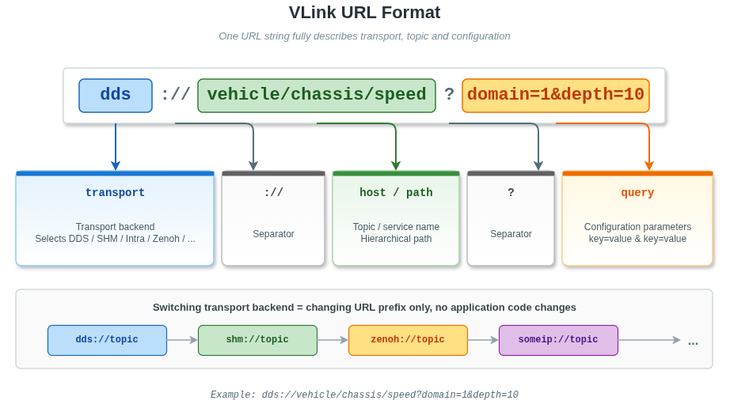
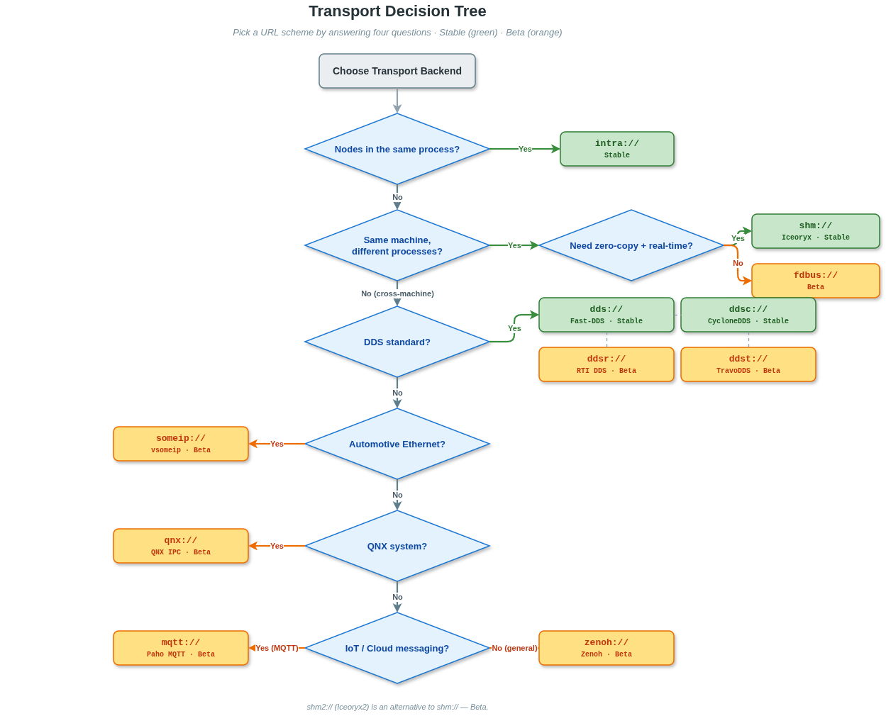

# 7. 传输后端与 URL

## 目录

- [7.1 URL 格式规范](#71-url-格式规范)
- [7.2 传输后端选择指南](#72-传输后端选择指南)
- [7.3 后端能力对比表](#73-后端能力对比表)
- [7.4 各后端详细说明](#74-各后端详细说明)
  - [7.4.1 intra:// — 进程内通信](#741-intra--进程内通信)
  - [7.4.2 shm:// — Iceoryx 共享内存](#742-shm--iceoryx-共享内存)
  - [7.4.3 shm2:// — Iceoryx2 共享内存](#743-shm2--iceoryx2-共享内存)
  - [7.4.4 dds:// — Fast-DDS RTPS](#744-dds--fast-dds-rtps)
  - [7.4.5 ddsc:// — CycloneDDS](#745-ddsc--cyclonedds)
  - [7.4.6 ddsr:// — RTI DDS](#746-ddsr--rti-dds)
  - [7.4.7 ddst:// — TravoDDS](#747-ddst--travodds)
  - [7.4.8 zenoh:// — Zenoh 协议](#748-zenoh--zenoh-协议)
  - [7.4.9 someip:// — SOME/IP 车载以太网](#749-someip--someip-车载以太网)
  - [7.4.10 mqtt:// — MQTT 物联网协议](#7410-mqtt--mqtt-物联网协议)
  - [7.4.11 fdbus:// — FDBus IPC](#7411-fdbus--fdbus-ipc)
  - [7.4.12 qnx:// — QNX 实时 IPC](#7412-qnx--qnx-实时-ipc)
- [7.5 后端混合使用与 Bridge](#75-后端混合使用与-bridge)
- [7.6 全局初始化与生命周期管理](#76-全局初始化与生命周期管理)
- [7.7 URL 重映射](#77-url-重映射)

---

## 7.1 URL 格式规范

VLink 的核心设计哲学是 **URL 即传输**：通过 URL 前缀选择传输后端，通过查询参数配置传输行为，业务代码无需感知底层协议细节。



```
<transport>://[<host>[:<port>]]/<path>[?<query>][#<fragment>]
|---------|  |-------------|  |----|  |------|  |--------|
  传输后端    主机与端口(可选) 路径    配置参数   传输提示
```

**各组成部分说明：**

| 部分           | 说明                                                         | 示例                             |
| -------------- | ------------------------------------------------------------ | -------------------------------- |
| `transport`       | 传输后端标识                                                 | `dds`、`shm`、`intra`、`zenoh`   |
| `host`         | 主机名或地址（可选，含可选端口号）                           | `127.0.0.1:30490`、`vehicle`     |
| `path`         | 主题路径                                                     | `/chassis/speed`                 |
| `query`        | 配置参数，`&` 分隔                                           | `domain=1&depth=10&qos=sensor`   |
| `fragment`     | 传输提示（部分后端使用）                                     | `#queue`、`#1M`                  |

**支持的 transport 列表：**

| Transport       | 底层技术          | 通信范围        |
| ------------ | ----------------- | --------------- |
| `intra://`   | 内置消息队列      | 进程内          |
| `shm://`     | Iceoryx RouDi     | 同机跨进程      |
| `shm2://`    | Iceoryx2          | 同机跨进程      |
| `dds://`     | Fast-DDS RTPS     | 跨机器          |
| `ddsc://`    | CycloneDDS        | 跨机器          |
| `ddsr://`    | RTI Connext DDS   | 跨机器          |
| `ddst://`    | TravoDDS（国产 DDS） | 跨机          |
| `zenoh://`   | Zenoh 协议        | 跨机/云边       |
| `someip://`  | SOME/IP           | 车载以太网      |
| `mqtt://`    | MQTT              | 跨机/物联网     |
| `fdbus://`   | FDBus IPC         | 同机            |
| `qnx://`     | QNX IPC           | 同机（QNX）     |

> **源码可识别 ≠ 默认构建启用**：大多数 scheme 都能被 `Url` 解析，但解析分支也受平台宏影响：`qnx://` 只在 QNX 构建中识别，Android 构建不启用 `shm://` / `shm2://` 的解析分支。对应模块是否参与当前构建还取决于 CMake 配置阶段依赖探测。各 module 的 `CMakeLists.txt` 提供 `SKIP_<NAME>` 选项和依赖 `find_package()`，依赖缺失时该模块被跳过。特别地：
> - `shm2`：检测到 `ANDROID` 即跳过。
> - `ddsr` / `ddst` / `qnx`：`SKIP_DDSR` / `SKIP_DDST` / `SKIP_QNX` 默认 `ON`，需要对应专有 SDK 或系统服务时再显式打开。
> - `intra` / `shm` / `shm2` / `dds` / `ddsc` / `zenoh` / `someip` / `mqtt` / `fdbus` 的 `SKIP_*` 默认 `OFF`，依赖缺失时跳过。
>
> **Conan 组件**：`conanfile.py` 当前只导出 `vlink`、`dds`、`ddsc`、`shm`、`intra`、`c_api`、`proxy_api`、`proxy_server`、`all`（`all = vlink+dds+ddsc+shm+intra`）。`shm2` / `zenoh` / `ddsr` / `ddst` / `someip` / `fdbus` / `mqtt` / `qnx` **不在 Conan 组件导出范围**，需自行构建。

**切换传输 = 只改前缀：**

```cpp
Publisher<Imu> pub("dds://sensor/imu");      // Fast-DDS 跨机器
Publisher<Imu> pub("shm://sensor/imu");      // Iceoryx 零拷贝
Publisher<Imu> pub("intra://sensor/imu");    // 进程内
Publisher<Imu> pub("zenoh://sensor/imu");    // Zenoh 云边
// 业务代码完全相同，只改 URL 前缀
```

---

## 7.2 传输后端选择指南

根据部署场景选择合适的传输后端。建议优先使用**稳定后端**（`intra`、`shm`、`dds`、`ddsc`）：



**快速决策表：**

| 场景                                | 推荐后端             | 状态     |
| ----------------------------------- | -------------------- | -------- |
| 同进程模块间通信（最低延迟）        | `intra://`           | **稳定** |
| 同机高性能零拷贝（如相机/点云）     | `shm://`             | **稳定** |
| 局域网跨机器（DDS 生态）            | `dds://` / `ddsc://` | **稳定** |
| 同机零拷贝（Iceoryx2 新方案）       | `shm2://`            | Beta     |
| 云边协同、跨 NAT、物联网            | `zenoh://`           | Beta     |
| 车载以太网 AUTOSAR 场景             | `someip://`          | Beta     |
| 物联网、轻量跨机器通信              | `mqtt://`            | Beta     |
| 同机标准 IPC（非零拷贝）            | `fdbus://`           | Beta     |
| QNX 实时操作系统                    | `qnx://`             | Beta     |
| 开发/测试阶段（切换零成本）         | 任意，URL 前缀替换   |          |

---

## 7.3 后端能力对比表

**稳定后端：**

| 后端       | 通信范围      | 零拷贝 | 依赖库          | 字段模型 | QoS 支持 | 消息级加密 | 状态     |
| ---------- | ------------- | ------ | --------------- | -------- | -------- | ---------- | -------- |
| `intra://` | 进程内        | 是     | 无              | 是       | 否       | **不支持** | **稳定** |
| `shm://`   | 同机跨进程    | 是     | iceoryx + RouDi | 是       | 部分     | 支持       | **稳定** |
| `dds://`   | 跨机器/局域网 | 否     | Fast-DDS        | 是       | 完整     | 非 CDR 类型支持 | **稳定** |
| `ddsc://`  | 跨机器/局域网 | 否     | CycloneDDS      | 是       | 完整     | 支持       | **稳定** |

**Beta 后端：**

| 后端        | 通信范围      | 零拷贝 | 依赖库             | 字段模型 | QoS 支持 | 消息级加密 | 状态 |
| ----------- | ------------- | ------ | ------------------ | -------- | -------- | ---------- | ---- |
| `shm2://`   | 同机跨进程    | 是     | iceoryx2-c         | 是       | 部分     | 支持       | Beta |
| `ddsr://`   | 跨机器/局域网 | 否     | RTI Connext DDS    | 是       | 完整     | 支持       | Beta |
| `ddst://`   | 跨机         | 否     | TravoDDS（国产 DDS） | 是       | 完整     | 支持       | Beta |
| `zenoh://`  | 跨机/云边     | 条件支持 | zenoh-c/zenoh-pico | 是       | 部分     | 支持       | Beta |
| `someip://` | 车载以太网    | 否     | vsomeip            | 是       | SOME/IP  | 支持       | Beta |
| `mqtt://`   | 跨机/物联网   | 否     | Paho MQTT C        | 是       | 部分     | 支持       | Beta |
| `fdbus://`  | 同机          | 否     | fdbus              | 是       | 否       | 支持       | Beta |
| `qnx://`    | 同机（QNX）   | 否     | QNX SDK            | 是       | 否       | 支持       | Beta |

> 零拷贝说明：`zenoh://` 只有在编译期启用 shared-memory/unstable API 且运行时启用 SHM 时才提供 loan。
>
> 消息级加密说明：`intra://` 不经过序列化管道，`dds://` 与 CDR 类型组合绕过 VLink Bytes 路径，这两种组合下 `SecurityXxx` 构造时会打 warning 并忽略 `Security::Config`；安全节点初始化时会因 `NodeImpl::security` 为空而 fatal，不会静默明文收发。详见 [09-security.md](09-security.md)。

**通信模型支持矩阵：**

| 后端        | Publisher | Subscriber | Server | Client | Setter | Getter |
| ----------- | --------- | ---------- | ------ | ------ | ------ | ------ |
| `intra://`  | YES       | YES        | YES    | YES    | YES    | YES    |
| `shm://`    | YES       | YES        | YES    | YES    | YES    | YES    |
| `shm2://`   | YES       | YES        | YES    | YES    | YES    | YES    |
| `dds://`    | YES       | YES        | YES    | YES    | YES    | YES    |
| `ddsc://`   | YES       | YES        | YES    | YES    | YES    | YES    |
| `ddsr://`   | YES       | YES        | YES    | YES    | YES    | YES    |
| `ddst://`   | YES       | YES        | YES    | YES    | YES    | YES    |
| `zenoh://`  | YES       | YES        | YES    | YES    | YES    | YES    |
| `someip://` | YES       | YES        | YES    | YES    | YES    | YES    |
| `mqtt://`   | YES       | YES        | YES    | YES    | YES    | YES    |
| `fdbus://`  | YES       | YES        | YES    | YES    | YES    | YES    |
| `qnx://`    | YES       | YES        | YES    | YES    | YES    | YES    |

---

## 7.4 各后端详细说明

### 7.4.1 intra:// — 进程内通信

**定位：** 同一 OS 进程内各模块间通信，极低延迟，无序列化，无内核调用。

**特点：**
- 消息对象直接通过回调函数传递，无序列化/反序列化开销。
- 支持队列模式（`queue`，默认）和直接模式（`direct`）。
- 支持全部六种节点类型（Publisher/Subscriber、Server/Client、Setter/Getter）。
- 无需任何外部依赖或守护进程。

**URL 格式：**
```
intra://<address>[?event=<name>&pipeline=<N>][#queue|#direct]
```

| IntraConf 参数 | 类型    | 必填 | URL 参数             | 说明                                                      |
| -------------- | ------- | :--: | -------------------- | --------------------------------------------------------- |
| `address`      | string  | Yes  | `<host>/<path>`      | 主题地址，不能为空                                        |
| `event`        | string  |  -   | `?event=`            | 可选次级事件过滤名称                                      |
| `pipeline`     | int32_t |  -   | `?pipeline=`         | 队列模式下的 pipeline 标识（不同 ID 对应不同的工作线程池）|
| `type`         | string  |  -   | `#queue` / `#direct` | 投递模式（默认 queue；`is_valid()` 仅接受这两个取值）     |

**URL 示例：**
```
intra://sensor/imu
intra://sensor/imu?event=notify
intra://sensor/imu#direct
```

**依赖安装：** 无外部依赖，VLink 内置实现。

**CMake 编译选项：** 编译时需启用 `VLINK_SUPPORT_INTRA`（通常默认开启）。

**使用示例：**

```cpp
#include <vlink/vlink.h>
#include <vlink/modules/intra_conf.h>

using namespace vlink;

// 方式 1：URL 字符串
Publisher<int> pub("intra://sensor/value");
Subscriber<int> sub("intra://sensor/value");
sub.listen([](const int& v) { std::cout << v << std::endl; });
pub.publish(42);

// 方式 2：直接模式（不经过队列，在 publish() 调用线程中直接执行回调）
Publisher<int> pub_direct("intra://sensor/value#direct");

// 方式 3：配置对象
// 参数：address, event, pipeline_id, type
IntraConf conf("sensor/value", "", 4, "queue");  // pipeline ID = 4
Publisher<int> pub_conf(conf);

// Server/Client 示例
Server<int, int> server("intra://math/double");
server.listen([](const int& req, int& resp) { resp = req * 2; });

Client<int, int> client("intra://math/double");
auto result = client.invoke(21);
// result.value() == 42
```

**注意事项：**
- `direct` 模式下回调在 `publish()` 的调用线程中执行，注意避免死锁。
- 字段模型（Setter/Getter）在进程内使用，数据通过 IntraFactory 的内部存储管理。
- 仅限同一进程使用，跨进程无效。

---

### 7.4.2 shm:// — Iceoryx 共享内存

**定位：** 同机不同进程间的零拷贝高性能 IPC，适合高频大数据量（相机帧、点云等）传输。

**特点：**
- 基于 iceoryx RouDi 守护进程管理共享内存池。
- 真正零拷贝：发布端将数据写入共享内存，订阅端直接读取，无内存拷贝。
- 支持全部六种节点类型（包括 Setter/Getter）。
- 地址和事件字符串不超过 80 字符（Iceoryx 限制）。

**URL 格式：**
```
shm://<address>[?event=<name>&domain=<N>&depth=<N>&history=<N>&wait=<0|1>]
```

| ShmConf 参数 | 类型    | 必填 | URL 参数     | 说明                                                |
| ------------ | ------- | :--: | ------------ | --------------------------------------------------- |
| `address`    | string  | Yes  | `<host>/<path>` | 服务/主题名称，最大 80 字符                      |
| `event`      | string  |  -   | `?event=`    | 可选次级事件名称，最大 80 字符                      |
| `domain`     | int32_t |  -   | `?domain=`   | Iceoryx 域 ID（默认 0）                             |
| `depth`      | int32_t |  -   | `?depth=`    | 历史缓冲深度（默认 0，即无缓冲）                   |
| `history`    | int32_t |  -   | `?history=`  | 历史计数（默认 0 用于 pub/sub，1 用于 setter/getter）|
| `wait`       | int32_t |  -   | `?wait=<ms>` | 阻塞等待超时（毫秒，>0 启用；仅 Publisher/Subscriber 有效，Client/Server/Setter/Getter 使用时 `parse_protocol()` 返回 false） |

**URL 示例：**
```
shm://sensor/lidar
shm://sensor/lidar?depth=10
shm://sensor/lidar?domain=1&depth=5&wait=100
```

**依赖**：Eclipse iceoryx（`iceoryx_posh::iceoryx_posh`），CMake 配置阶段探测；未安装时该模块被跳过。可通过 Conan、发行版包或源码构建安装。

**SHM 守护进程启动（三选一，推荐度从高到低）：**

```bash
# ✅ 方式 1（首选，推荐生产和开发）：vlink-proxy -c
# 内嵌 iox-roudi + 通过 -l 选择三档内存策略（默认 -l 2 = Middle，等价 proxy/etc/proxy_roudi.toml）：
#   -l 1 (Low)    6 档预分配 chunk（轻量端侧，等价 proxy_roudi_small.toml）
#   -l 2 (Middle) 7 档预分配 chunk（默认，等价 proxy_roudi.toml）
#   -l 3 (High)   8 档预分配 chunk（重载/点云，等价 proxy_roudi_large.toml）：
#                 1 KB × 10000 / 16 KB × 1000 / 128 KB × 500 / 1 MB × 200 /
#                 3 MB × 100  / 6 MB × 50   / 13 MB × 30   / 24 MB × 20
# 小 chunk 多、大 chunk 少，覆盖控制指令→小帧→大帧→点云全量程载荷；
# 同时带远程拓扑监控能力。
vlink-proxy -c                  # 使用内置默认配置（-l 2 Middle，等价 proxy/etc/proxy_roudi.toml）
vlink-proxy -c -l 3             # 切换到 High 档（点云/重载场景，等价 proxy_roudi_large.toml）
vlink-proxy -c /path/to/roudi.toml   # 自定义 iox-roudi 配置

# 方式 2：外部独立起 iox-roudi
# 仅在无法运行 vlink-proxy 时使用；建议直接复制 proxy/etc/proxy_roudi.toml（或 _large/_small）作为起点
iox-roudi -c /etc/iceoryx/roudi_config.toml

# 方式 3：在代码中启动嵌入式 RouDi（仅单进程适用）
vlink::ShmConf::init_roudi();
```

> `vlink-proxy` 不只是一个 "iox-roudi 启动器"：它本身是 VLink 的**监控代理守护进程**（详见 [16-proxy.md](16-proxy.md)），提供跨机器拓扑查看、远程数据桥接、DDS/SHM 两种后端直连等能力。`-c` 只是让它顺带把 iox-roudi 也起起来，一个进程覆盖"SHM 守护 + 远程监控"。

**使用示例：**

```cpp
#include <vlink/vlink.h>
#include <vlink/modules/shm_conf.h>

using namespace vlink;

int main() {
    // 注册进程到 RouDi（外部 RouDi 模式）
    ShmConf::init_runtime("my_process");

    // 发布（Publisher）
    Publisher<float> pub("shm://sensor/temperature");
    pub.wait_for_subscribers();  // 等待订阅者就绪（可选）
    pub.publish(25.6f);

    // 订阅（Subscriber）
    Subscriber<float> sub("shm://sensor/temperature");
    sub.listen([](const float& t) {
        std::cout << "Temperature: " << t << std::endl;
    });

    // 字段模型（Setter/Getter）
    Setter<int> setter("shm://config/mode");
    setter.set(1);

    Getter<int> getter("shm://config/mode");
    if (auto v = getter.get()) {
        std::cout << "Mode: " << *v << std::endl;
    }

    // 使用配置对象（精细控制）
    // 参数：address, event, domain, depth, history, wait
    ShmConf conf("camera/frame", "", 0, 4, 0, 0);  // depth=4
    Publisher<Bytes> cam_pub(conf);

    // 注销（进程退出前）
    ShmConf::deinit_runtime();
    return 0;
}
```

**注意事项：**
- **SHM 守护进程必须在所有使用 `shm://` 的业务进程启动前运行**（推荐 `vlink-proxy -c`）。
- 进程名称在同一 RouDi 域内必须唯一，长度不超过 80 字符。
- `wait>0` 阻塞等待模式仅对 Publisher/Subscriber 有效，用于 RPC 或字段节点会导致 `parse_protocol()` 返回 `false`。
- 地址字符串不能包含特殊字符，Iceoryx 对命名有严格限制。

---

### 7.4.3 shm2:// — Iceoryx2 共享内存

**定位：** Iceoryx2 是 Iceoryx 的下一代实现，**无需独立的 RouDi 守护进程**，API 更现代化。

**特点：**
- 无需外部守护进程，每个进程自治管理共享内存。
- 支持通过 URL 片段（`#size`）指定每消息的共享内存分配大小。
- 默认每消息 128 字节（`kDefaultMemSize`），最大 32MiB（`kMaxMemSize`）。
- 与 `shm://` 不兼容，两者不能互通。

**URL 格式：**
```
shm2://<address>[?event=<name>&domain=<N>&depth=<N>&history=<N>&wait=<0|1>][#<size>]
```

| Shm2Conf 参数 | 类型     | 必填 | URL 参数        | 说明                                 |
| ------------- | -------- | :--: | --------------- | ------------------------------------ |
| `address`     | string   | Yes  | `<host>/<path>` | 主题地址                             |
| `event`       | string   |  -   | `?event=`       | 事件名称                             |
| `domain`      | int32_t  |  -   | `?domain=`      | 域 ID                                |
| `depth`       | int32_t  |  -   | `?depth=`       | 历史队列深度                         |
| `history`     | int32_t  |  -   | `?history=`     | 历史缓存                             |
| `wait`        | int32_t  |  -   | `?wait=0/1`     | 等待就绪                             |
| `size`        | uint64_t |  -   | `#<size>`       | 缓冲区大小（默认 128B，最大 32MiB）  |

**size 单位**：`B`、`K`/`KB`、`M`/`MB`、`G`/`GB`（不区分大小写），范围 `(0, 32MiB]`。

**片段大小示例：**

| 示例              | 含义                          |
| ----------------- | ----------------------------- |
| `shm2://topic`    | 默认 128 字节                 |
| `shm2://topic#1K` | 1024 字节                     |
| `shm2://topic#1M` | 1 MiB                         |
| `shm2://topic#8M` | 8 MiB                         |
| `shm2://topic#1G` | 1 GiB（超出上限将报错）      |

**URL 示例：**
```
shm2://sensor/lidar
shm2://sensor/lidar?depth=10#1M
shm2://sensor/image?depth=5#512K
```

**依赖**：`iceoryx2-c`（Rust 实现，CMake 中通过 `find_package(iceoryx2-c CONFIG)` 探测）。Android 平台直接跳过（`modules/shm2/CMakeLists.txt` 检测到 `ANDROID` 即 return）。当前 **不在 Conan 组件导出** 中，需自行构建。

**使用示例：**

```cpp
#include <vlink/vlink.h>
#include <vlink/modules/shm2_conf.h>

using namespace vlink;

int main() {
    // 无需启动 RouDi，直接创建节点
    // 为点云数据分配 4MB 共享内存
    Publisher<Bytes> pub("shm2://lidar/pointcloud#4M");

    auto buf = Bytes::create(4 * 1024 * 1024);
    // ... 填充点云数据 ...
    pub.publish(buf);

    // 接收端
    Subscriber<Bytes> sub("shm2://lidar/pointcloud#4M");
    sub.listen([](const Bytes& data) {
        process_pointcloud(data.data(), data.size());
    });

    // 字段模型
    Setter<float> speed_setter("shm2://vehicle/speed");
    speed_setter.set(80.5f);

    Getter<float> speed_getter("shm2://vehicle/speed");
    if (auto v = speed_getter.get()) {
        std::cout << "Speed: " << *v << std::endl;
    }

    // 使用配置对象指定精确大小（字节）
    // 参数：address, event, domain, depth, history, wait, size
    Shm2Conf conf("camera/frame", "", 0, 0, 0, 0, 1920 * 1080 * 3);  // size=约 6MB
    Publisher<Bytes> cam_pub(conf);

    return 0;
}
```

**注意事项：**
- `shm2://` 与 `shm://` 不兼容，不同后端的节点无法互通。
- 消息大小必须在编译/配置时确定（URL 片段），运行时超出分配大小的消息会被截断或拒绝。
- 目前处于 Beta 状态，API 可能随 iceoryx2 版本变动。

---

### 7.4.4 dds:// — Fast-DDS RTPS

**定位：** 基于 eProsima Fast-DDS（Fast-RTPS）的跨机器 DDS 通信，VLink 最主要的跨网络后端。

**特点：**
- 支持完整 DDS QoS（可靠性、持久性、历史深度、截止期限等）。
- 支持命名 QoS Profile（通过 `register_qos()` 注册）。
- 支持 CDR 类型的 TypeSupport 注册（`register_topic()`）。
- 支持从 XML 文件加载 QoS Profile（`load_global_qos_file()`）。
- 支持 Topic 发现（`get_discovered_topics()`）。

**URL 格式：**
```
dds://<topic>[?domain=<N>&depth=<N>&qos=<name>]
dds://<topic>[?domain=<N>&part=<v>&topic=<v>&pub=<v>&sub=<v>&writer=<v>&reader=<v>]
```

| DdsConf 参数 | 类型          | 必填 | URL 参数                                         | 说明                                                         |
| ------------ | ------------- | :--: | ------------------------------------------------ | ------------------------------------------------------------ |
| `topic`      | string        | Yes  | `<host>/<path>`                                  | DDS Topic 名称                                               |
| `domain`     | int32_t       |  -   | `?domain=`                                       | DDS Domain ID（默认先读取 `VLINK_DDS_DOMAIN`，未设置时为 `0`；推荐通过 URL 或显式 `DdsConf` 指定） |
| `depth`      | int32_t       |  -   | `?depth=`                                        | DDS History 深度（默认 0，即传输层默认值）                   |
| `qos`        | string        |  -   | `?qos=`                                          | 通过 `register_qos()` 注册的命名 QoS Profile                |
| `qos_ext`    | PropertiesMap |  -   | `?part=`、`?topic=`、`?pub=`、`?sub=`、`?writer=`、`?reader=` | 扩展 QoS 配置（与 `?qos=` 互斥）                            |

> `qos` 和 `qos_ext` 互斥，不可同时使用。

**URL 示例：**
```
dds://vehicle/speed
dds://vehicle/speed?domain=1&depth=10
dds://vehicle/speed?qos=sensor
dds://vehicle/speed?domain=42&reader=my_reader_qos
```

**依赖**：eProsima Fast-DDS（CMake 中通过 `find_package(fastdds CONFIG)` 或 `find_package(fastrtps CONFIG)` 探测），可通过 Conan 或源码构建安装。

**使用示例：**

```cpp
#include <vlink/vlink.h>
#include <vlink/modules/dds_conf.h>
#include <vlink/extension/qos.h>

using namespace vlink;

int main() {
    // 注册 QoS Profile（程序启动时，创建节点前）
    Qos reliable_qos;
    reliable_qos.reliability.kind = Qos::Reliability::kReliable;
    reliable_qos.durability.kind  = Qos::Durability::kTransientLocal;
    DdsConf::register_qos("reliable", reliable_qos);

    // 使用命名 QoS
    Publisher<std::string> pub("dds://system/log?qos=reliable");
    pub.publish("System started");

    Subscriber<std::string> sub("dds://system/log?qos=reliable");
    sub.listen([](const std::string& msg) {
        std::cout << msg << std::endl;
    });

    // 指定 Domain ID
    Publisher<float> pub_d1("dds://sensor/speed?domain=1");

    // 注册 CDR 类型（IDL 生成的类型）
    // DdsConf::register_topic<MyMessagePubSubType>("my_topic");
    // DdsConf::register_topic<MyReqPubSubType, MyRespPubSubType>("my_rpc");

    // 从 URL 注册
    // DdsConf::register_url<MyMessagePubSubType>("dds://my_topic?domain=0");

    // 加载全局 QoS 文件
    // DdsConf::load_global_qos_file("/etc/vlink/dds_profile.xml");

    // 发现已有 Topic
    auto topics = DdsConf::get_discovered_topics(0);
    for (const auto& [name, type] : topics) {
        std::cout << "Topic: " << name << " Type: " << type << std::endl;
    }

    return 0;
}
```

**环境变量：**

```bash
# 设置默认 DDS Domain ID（所有 dds:// 节点使用，除非 URL 中显式指定 domain=）
export VLINK_DDS_DOMAIN=1
```

**注意事项：**
- `?qos=` 和 `?qos_ext=`（part/topic/pub/sub/writer/reader）互斥，同时设置导致验证失败。
- CDR 类型必须在创建节点前调用 `register_topic()` 注册 TypeSupport。
- 响应 Topic 自动使用 `<topic>___resp` 后缀，无需手动注册。
- 不同 Domain ID 的节点无法互相发现，确保同一应用内 Domain ID 一致。

---

### 7.4.5 ddsc:// — CycloneDDS

**定位：** Eclipse CycloneDDS，开源 DDS 实现，与 `dds://`（Fast-DDS）API 完全相同，适合偏好 Apache 协议或 CycloneDDS 生态的场景。

**URL 格式：**
```
ddsc://<topic>[?domain=<N>&depth=<N>&qos=<name>]
```

| DdscConf 参数 | 类型    | 必填 | URL 参数        | 说明             |
| ------------- | ------- | :--: | --------------- | ---------------- |
| `topic`       | string  | Yes  | `<host>/<path>` | Topic 名称       |
| `domain`      | int32_t |  -   | `?domain=`      | DDS 域 ID        |
| `depth`       | int32_t |  -   | `?depth=`       | 历史深度         |
| `qos`         | string  |  -   | `?qos=`         | QoS Profile 名称 |

**URL 示例：**
```
ddsc://vehicle/speed?domain=1&depth=10
ddsc://vehicle/speed?qos=sensor
```

**与 dds:// 的差异：**
- 不支持 `register_topic()` 和 `qos_ext` 扩展 QoS 映射。
- QoS 注册使用 `DdscConf::register_qos()`。
- 底层使用 CycloneDDS 而非 Fast-DDS，序列化行为一致（CDR）。

**依赖**：Eclipse CycloneDDS（`find_package(CycloneDDS CONFIG)`），可通过 Conan、发行版包或源码构建安装。

**使用示例：**

```cpp
#include <vlink/vlink.h>
#include <vlink/modules/ddsc_conf.h>

using namespace vlink;

int main() {
    // QoS 注册
    Qos qos;
    qos.reliability.kind = Qos::Reliability::kReliable;
    DdscConf::register_qos("reliable", qos);

    Publisher<float> pub("ddsc://sensor/speed?qos=reliable");
    pub.publish(60.0f);

    Subscriber<float> sub("ddsc://sensor/speed?qos=reliable");
    sub.listen([](const float& v) {
        std::cout << "Speed: " << v << std::endl;
    });

    return 0;
}
```

---

### 7.4.6 ddsr:// — RTI DDS

**定位：** RTI Connext DDS（商业 DDS 实现），适合需要 RTI 认证或 RTI 生态集成的场景。

**URL 格式：**
```
ddsr://<topic>[?domain=<N>&depth=<N>&qos=<name>]
```

| DdsrConf 参数 | 类型          | 必填 | URL 参数                                  | 说明             |
| ------------- | ------------- | :--: | ----------------------------------------- | ---------------- |
| `topic`       | string        | Yes  | `<host>/<path>`                           | Topic 名称       |
| `domain`      | int32_t       |  -   | `?domain=`                                | DDS 域 ID        |
| `depth`       | int32_t       |  -   | `?depth=`                                 | 历史深度         |
| `qos`         | string        |  -   | `?qos=`                                   | QoS Profile 名称 |
| `qos_ext`     | PropertiesMap |  -   | `?part=`、`?writer=`、`?reader=` 等       | 扩展 QoS         |

**URL 示例：**
```
ddsr://vehicle/speed?domain=1&qos=reliable
```

**注意事项：**
- 需要有效的 RTI 许可证文件（`rti_license.dat`）。
- 编译时需要链接 RTI DDS 库，CMake 需配置 `NDDSHOME` 环境变量。
- 当前处于 Beta 状态，建议生产环境充分测试。

---

### 7.4.7 ddst:// — TravoDDS

**定位：** TravoDDS 是国产开源 DDS 实现（项目仓库：<https://gitee.com/agiros/travodds>），作为 Fast-DDS / CycloneDDS / RTI Connext 之外的另一种 DDS 运行时选择。API 表面与 `DdsConf` 一致，底层替换为 TravoDDS 运行时。

**URL 格式：**
```
ddst://<topic>[?domain=<N>&depth=<N>&qos=<name>]
```

| DdstConf 参数 | 类型          | 必填 | URL 参数                              | 说明             |
| ------------- | ------------- | :--: | ------------------------------------- | ---------------- |
| `topic`       | string        | Yes  | `<host>/<path>`                       | Topic 名称       |
| `domain`      | int32_t       |  -   | `?domain=`                            | DDS 域 ID        |
| `depth`       | int32_t       |  -   | `?depth=`                             | 历史深度         |
| `qos`         | string        |  -   | `?qos=`                               | QoS Profile 名称 |
| `qos_ext`     | PropertiesMap |  -   | `?part=`、`?writer=`、`?reader=` 等   | 扩展 QoS         |

**URL 示例：**
```
ddst://perception/model/result?domain=1
```

**与其他 DDS 的差异：**
- 与 `DdsConf`（Fast-DDS）API 保持一致，通过切换 URL scheme 即可替换运行时。
- TravoDDS 是国产 DDS 实现（源码仓库 <https://gitee.com/agiros/travodds>），与 Fast-DDS / CycloneDDS 同样面向本地局域网/多播发现，不提供 NAT 穿透或云边桥接能力。
- 目前处于 Beta 状态，主要作为国产自主可控替代方案。

---

### 7.4.8 zenoh:// — Zenoh 协议

**定位：** Eclipse Zenoh，面向云-边-端统一数据管理的现代协议，支持发布/订阅、查询/回应，适合 IoT 和云边协同场景。

**特点：**
- 支持 P2P 和路由模式，内置 NAT 穿透。
- 支持 QoS Profile（通过 `ZenohConf::register_qos()` 注册）。
- URL 片段（`#fragment`）可携带 Zenoh 会话配置提示。
- 适合跨多个网络域（WiFi、5G、以太网）的通信。

**URL 格式：**
```
zenoh://<address>[?event=<name>&domain=<N>&qos=<name>&depth=<N>&shm=<0|1>&shm_size=<N>][#<fragment>]
```

| ZenohConf 参数        | 类型    | 必填 | URL 参数                          | 说明                                                                                            |
| --------------------- | ------- | :--: | --------------------------------- | ----------------------------------------------------------------------------------------------- |
| `address`             | string  | Yes  | `<host>/<path>`                   | Zenoh Key Expression（支持通配符，如 `vehicle/*`）                                              |
| `event`               | string  |  -   | `?event=`                         | 可选次级事件过滤                                                                                |
| `domain`              | int32_t |  -   | `?domain=`                        | Zenoh 会话/域标识符                                                                             |
| `qos`                 | string  |  -   | `?qos=`                           | 命名 QoS Profile                                                                                |
| `depth`               | int32_t |  -   | `?depth=`                         | Zenoh `transport/link/tx/queue/size/{data,real_time}` 的 session 级队列深度（0 = 取所选 QoS 的 history.depth） |
| `shm`                 | string  |  -   | `?shm=`                           | 启用 Zenoh 共享内存（`1`/`true`/`yes`/`on` 或 `0`/`false`/`no`/`off`，仅 zenoh-c 且编译期带 `Z_FEATURE_SHARED_MEMORY` + `Z_FEATURE_UNSTABLE_API` 时生效）|
| `shm_mode`            | string  |  -   | `?shm_mode=`                      | SHM 初始化模式：`init`（默认，立即建池）/ `lazy`（首次使用时建池）                              |
| `shm_size`            | string  |  -   | `?shm_size=`                      | SHM 传输池大小，支持 `B`/`K`/`M`/`G` 后缀（写入 `transport/shared_memory/transport_optimization/pool_size`） |
| `shm_threshold`       | string  |  -   | `?shm_threshold=`                 | Zenoh 自动 SHM 提升阈值（写入 `transport/shared_memory/transport_optimization/message_size_threshold`） |
| `shm_loan_threshold`  | string  |  -   | `?shm_loan_threshold=`            | VLink 用户 `loan()` API 的最小尺寸阈值，低于此值 `loan()` 回退到堆分配（默认 `8K`）             |
| `shm_blocking`        | string  |  -   | `?shm_blocking=`                  | `1`/`true` 时 `loan()` 在池满时阻塞等待 GC + defrag，否则非阻塞失败                             |
| `fragment`            | string  |  -   | `#<hint>`                         | 可选传输提示，例如 `tcp` / `udp` / `unix` / `shm`，或带地址的 `tcp/host:port` 等                |

> 这些参数同样可通过 `set_property("zenoh.<key>", value)` 在节点级覆盖；URL 参数与 `set_property` 经 `ZenohConf::append_properties()` 走同一条 factory 路径。

**URL 示例：**
```
zenoh://robot/joint/state
zenoh://robot/joint/state?domain=1&qos=realtime
zenoh://robot/joint/state?domain=1&qos=realtime&depth=10
zenoh://camera/raw?shm=1&shm_size=64M&shm_loan_threshold=4K
```

**依赖**：`zenohc`（C 绑定）或 `zenohpico`（嵌入式轻量版）。CMake 中通过 `find_package(zenohc CONFIG)` 或 `find_package(zenohpico CONFIG)` 探测。当前 **不在 Conan 组件导出** 中，需自行构建。

**使用示例：**

```cpp
#include <vlink/vlink.h>
#include <vlink/modules/zenoh_conf.h>
#include <vlink/extension/qos.h>

using namespace vlink;

int main() {
    // 注册 QoS Profile
    Qos qos;
    qos.reliability.kind = Qos::Reliability::kReliable;
    ZenohConf::register_qos("reliable", qos);

    // 云端订阅，车端发布
    Publisher<std::string> pub("zenoh://vehicle/123/telemetry?qos=reliable");
    pub.publish("{\"speed\": 80.5, \"fuel\": 45.2}");

    Subscriber<std::string> sub("zenoh://vehicle/123/telemetry?qos=reliable");
    sub.listen([](const std::string& data) {
        std::cout << "Telemetry: " << data << std::endl;
    });

    // 字段模型：同步最新状态
    Setter<float> setter("zenoh://vehicle/123/battery_level");
    setter.set(87.5f);

    Getter<float> getter("zenoh://vehicle/123/battery_level");
    if (auto v = getter.get()) {
        std::cout << "Battery: " << *v << "%" << std::endl;
    }

    // 使用配置对象
    ZenohConf conf("vehicle/123/speed", "", 0, "reliable", "udp/0.0.0.0:7447");
    Publisher<float> speed_pub(conf);

    return 0;
}
```

**注意事项：**
- Zenoh 路由器（`zenohd`）需要在网络中部署，或使用 P2P 模式（`VLINK_ZENOH_MODE=peer`）。
- Key Expression 支持通配符，但 VLink 中通常使用精确地址。
- 在 MCU/嵌入式场景使用 zenoh-pico 时，功能有所裁减。
- Zenoh factory 可读取 `VLINK_ZENOH_*` 环境变量（config/mode/listen/peer/compression/lowlatency/timestamps/qos/event_qos/field_qos/method_qos/multicast*/gossip/rx_buf/tx_queue_data/tx_queue_rt/max_msg/batch_enabled/batch_time_limit_ms/allowed_locality/shm/shm_mode/shm_size/shm_threshold/shm_blocking/shm_loan_threshold），详见 [21-environment-vars.md](21-environment-vars.md)。
- 仅在 `?shm=1`（或 `VLINK_ZENOH_SHM=1`）且编译期带 `Z_FEATURE_SHARED_MEMORY` + `Z_FEATURE_UNSTABLE_API` 时，节点的 `is_support_loan()` 才会返回 `true`、`loan()` 才走 Zenoh SHM；具体语义见 [10-zerocopy.md](10-zerocopy.md)。

---

### 7.4.9 someip:// — SOME/IP 车载以太网

**定位：** SOME/IP（Scalable service-Oriented MiddlewarE over IP）是 AUTOSAR 标准车载以太网通信协议，适合 ECU 间通信和 V2X 场景。

**特点：**
- 使用数字 ID 体系（Service ID、Instance ID、Method/Event ID），而非字符串 Topic。
- 通过 vsomeip 库实现，支持 SD（Service Discovery）协议。
- 字段模型（Setter/Getter）需要设置 `field=true`。
- 需要 vsomeip JSON 配置文件。

**URL 格式：**
```
# RPC（Server/Client）
someip://<service>/<instance>?method=<method_id>

# 事件（Publisher/Subscriber）
someip://<service>/<instance>?groups=<g1,g2,...>&event=<event_id>

# 字段（Setter/Getter）
someip://<service>/<instance>?groups=<g1,g2,...>&event=<event_id>&field=1
```

| SomeipConf 参数 | 类型             | 必填 | URL 参数                             | 说明                                |
| --------------- | ---------------- | :--: | ------------------------------------ | ----------------------------------- |
| `service`       | uint16_t         | Yes  | `<host>`（十进制或十六进制）         | SOME/IP Service ID（16 位，非零）   |
| `instance`      | uint16_t         | Yes  | `<path>`（十进制或十六进制）         | Service Instance ID（16 位，非零）  |
| `method`        | uint16_t         |  -   | `?method=`                           | Method ID（仅 Server/Client）       |
| `groups`        | set\<uint16_t\>  |  -   | `?groups=g1,g2,...`                  | Event Group ID 集合                 |
| `event`         | uint16_t         |  -   | `?event=`                            | Event ID                            |
| `field`         | bool             |  -   | `?field=1`                           | 是否为 Field 模式（Setter/Getter）  |

所有数字支持十进制和十六进制（`0x` 前缀）两种格式。

**URL 示例：**
```
someip://0x1234/0x5678?method=0x1                  # Method 调用
someip://0x1234/0x5678?groups=0x1,0x2&event=0x3    # Event 订阅
someip://0x1234/0x5678?groups=0x1&event=0x3&field=1 # Field 同步
```

**依赖**：COVESA vsomeip3（`find_package(vsomeip3 CONFIG)`）。当前 **不在 Conan 组件导出** 中，需自行构建。

**vsomeip 配置文件（最小示例）：**

```json
{
    "unicast": "127.0.0.1",
    "logging": {
        "level": "warning"
    },
    "applications": [
        {
            "name": "my_app",
            "id": "0x1234"
        }
    ],
    "services": [
        {
            "service": "0x1234",
            "instance": "0x5678",
            "unreliable": "30509"
        }
    ]
}
```

**使用示例：**

```cpp
#include <vlink/vlink.h>
#include <vlink/modules/someip_conf.h>

using namespace vlink;

int main() {
    // 加载 vsomeip 配置（创建节点前调用）
    SomeipConf::load_global_config_file("/etc/vsomeip/vsomeip.json");

    // RPC（Server/Client）
    // Service=0x1234, Instance=0x5678, Method=0x0001
    Server<int, int> server("someip://4660/22136?method=1");
    server.listen([](const int& req, int& resp) {
        resp = req * 2;
    });

    Client<int, int> client("someip://4660/22136?method=1");
    auto result = client.invoke(21);

    // 事件（Publisher/Subscriber）
    // Service=0x1234, Instance=0x5678, Group=0x0001, Event=0x0010
    Publisher<float> pub("someip://4660/22136?groups=1&event=16");
    pub.publish(80.5f);

    Subscriber<float> sub("someip://4660/22136?groups=1&event=16");
    sub.listen([](const float& v) {
        std::cout << "Speed: " << v << std::endl;
    });

    // 字段模型
    Setter<float> setter("someip://4660/22136?groups=1&event=16&field=1");
    setter.set(80.5f);

    Getter<float> getter("someip://4660/22136?groups=1&event=16&field=1");
    if (auto v = getter.get()) {
        std::cout << "Field: " << *v << std::endl;
    }

    // 使用配置对象（更清晰）
    SomeipConf rpc_conf(0x1234, 0x5678, 0x0001);          // RPC
    SomeipConf evt_conf(0x1234, 0x5678, {0x0001}, 0x0010); // 事件
    SomeipConf fld_conf(0x1234, 0x5678, {0x0001}, 0x0010, true); // 字段

    Server<int, int> server2(rpc_conf);
    Publisher<float> pub2(evt_conf);
    Setter<float> setter2(fld_conf);

    return 0;
}
```

**注意事项：**
- `service` 和 `instance` 均不能为 0，否则 `is_valid()` 返回 false。
- 事件/字段节点必须同时设置 `groups` 和 `event`，否则验证失败。
- 字段节点（Setter/Getter）必须设置 `field=true`。
- vsomeip 需要网络权限，可能需要 root 或 `CAP_NET_RAW`。
- `VSOMEIP_CONFIGURATION` 环境变量可指定 vsomeip 配置文件路径。

---

### 7.4.10 mqtt:// — MQTT 物联网协议

**定位：** MQTT（Message Queuing Telemetry Transport）是面向物联网的轻量级发布/订阅消息协议，适合带宽受限、网络不稳定的跨机器通信场景。

**特点：**
- 基于 TCP/TLS 的轻量级发布/订阅协议，协议开销极小。
- 需要外部 MQTT Broker（如 Mosquitto、EMQX）。
- 支持全部六种节点类型（Publisher/Subscriber、Server/Client、Setter/Getter）。
- 支持部分 QoS 配置。

**URL 格式：**
```
mqtt://<address>[?event=<name>&domain=<N>&qos=<0|1|2>][#<broker_uri>]
```

| MqttConf 参数 | 类型    | 必填 | URL 参数        | 默认值  | 说明                              |
| ------------- | ------- | :--: | --------------- | ------- | --------------------------------- |
| `address`     | string  | Yes  | `<host>/<path>` | —       | MQTT Topic 地址                   |
| `event`       | string  |  -   | `?event=`       | `""`    | 可选次级事件过滤                  |
| `domain`      | int32_t |  -   | `?domain=`      | `0`     | 域/命名空间标识                   |
| `qos`         | int32_t |  -   | `?qos=0/1/2`    | `1`     | MQTT QoS 级别（0/1/2）           |
| `fragment`    | string  |  -   | `#<uri>`        | `""`    | broker URI 覆盖（如 `tcp://ip:1883`）|

**URL 示例：**
```
mqtt://sensor/temperature
mqtt://vehicle/telemetry?event=speed&qos=2
mqtt://sensor/data#tcp://192.168.1.1:1883
```

**MQTT 环境变量**（读取自源码 `modules/mqtt/mqtt_factory.cc`）：

| 变量                 | 默认值                  | 说明                              |
| -------------------- | ----------------------- | --------------------------------- |
| `VLINK_MQTT_BROKER`  | `tcp://localhost:1883`  | MQTT Broker URI                   |
| `VLINK_MQTT_DOMAIN`  | `0`                     | 默认 domain                       |
| `VLINK_MQTT_QOS`     | `1`                     | 默认 QoS（0/1/2）                 |
| `VLINK_MQTT_KEEPALIVE`| `60`                   | 心跳保活间隔（秒）                |
| `VLINK_MQTT_CLIENT_ID`| `vlink_mqtt`           | 客户端 ID 前缀                    |

**依赖**：Eclipse Paho MQTT C 客户端（`eclipse-paho-mqtt-c::paho-mqtt3c` 或 `paho-mqtt3cs` 带 TLS）。当前 **不在 Conan 组件导出** 中，需自行构建。

**使用示例：**

```cpp
#include <vlink/vlink.h>
#include <vlink/modules/mqtt_conf.h>

using namespace vlink;

int main() {
    // 发布
    Publisher<std::string> pub("mqtt://sensor/data");
    pub.publish("{\"temp\": 25.6}");

    // 订阅
    Subscriber<std::string> sub("mqtt://sensor/data");
    sub.listen([](const std::string& msg) {
        std::cout << "Received: " << msg << std::endl;
    });

    return 0;
}
```

**注意事项：**
- 需要外部 MQTT Broker 运行，VLink 作为 MQTT 客户端连接到 Broker。
- 实时性相对 DDS 和 SHM 后端较低，适合对延迟不敏感的场景。
- 当前处于 Beta 状态。

---

### 7.4.11 fdbus:// — FDBus IPC

**定位：** FDBus 是面向 Android 和 Linux 的轻量级 IPC 框架，类似于 D-Bus 但更轻量，适合车载 Linux 系统的同机 IPC。

**特点：**
- 支持服务注册（`svc` 模式）和直接 P2P IPC（`ipc` 模式）。
- 通过 URL 片段（`#svc` 或 `#ipc`）选择模式，默认 `svc`。
- 支持全部六种节点类型。
- 比共享内存延迟略高，但比 DDS 低。

**URL 格式：**
```
fdbus://<address>[?event=<name>][#svc|#ipc]
```

| FdbusConf 参数 | 类型   | 必填 | URL 参数          | 说明                                     |
| -------------- | ------ | :--: | ----------------- | ---------------------------------------- |
| `address`      | string | Yes  | `<host>/<path>`   | FDBus 服务/主题地址                      |
| `event`        | string |  -   | `?event=`         | 可选次级事件名称                         |
| `transport`       | string |  -   | `#svc` / `#ipc`   | 连接模式（默认 svc）                     |

**连接模式：**
- `#svc`：通过服务注册中心发现（默认）
- `#ipc`：直接点对点连接

**URL 示例：**
```
fdbus://my_service
fdbus://my_service?event=notify
fdbus://my_service#ipc
```

**依赖**：FDBus（运行时库）。当前 **不在 Conan 组件导出** 中，需自行构建。

**使用示例：**

```cpp
#include <vlink/vlink.h>
#include <vlink/modules/fdbus_conf.h>

using namespace vlink;

int main() {
    // 服务模式（默认）
    Publisher<std::string> pub("fdbus://my_service");
    pub.publish("hello from fdbus");

    Subscriber<std::string> sub("fdbus://my_service");
    sub.listen([](const std::string& msg) {
        std::cout << msg << std::endl;
    });

    // IPC 模式
    Publisher<int> pub_ipc("fdbus://my_service#ipc");

    // 带次级事件
    Publisher<float> pub_ev("fdbus://my_service?event=speed");

    // 使用配置对象
    FdbusConf conf("my_service", "speed_event", "svc");
    Publisher<float> pub_conf(conf);

    // RPC
    Server<int, int> server("fdbus://calc/multiply");
    server.listen([](const int& req, int& resp) { resp = req * 3; });

    Client<int, int> client("fdbus://calc/multiply");
    auto result = client.invoke(7);

    return 0;
}
```

**注意事项：**
- `transport` 只支持 `"svc"` 和 `"ipc"` 两个值，其他值使 `is_valid()` 返回 false。
- `address` 不能为空，否则 `is_valid()` 返回 false。
- `FdbusConf::operator==` **不比较** `transport` 字段（源码 `fdbus_conf.h:140-142`），仅比较 `address` 和 `event`。
- FDBus 名称服务需要在系统中运行（`fdbus-nameserver`）才能使用 `svc` 模式。

---

### 7.4.12 qnx:// — QNX 实时 IPC

**定位：** 基于 QNX Neutrino RTOS 原生 IPC 原语的通信后端，提供确定性实时消息传递，适合功能安全（ASIL）场景。

**特点：**
- 使用 QNX 原生 IPC（Pulse/Message Passing），确定性延迟。
- **仅在 QNX 目标平台可用**，不可在 Linux 上使用。
- 支持全部六种节点类型。
- 无需第三方库，直接使用 QNX SDK。

**URL 格式：**
```
qnx://<address>[?event=<name>]
```

| QnxConf 参数 | 类型   | 必填 | URL 参数        | 说明              |
| ------------ | ------ | :--: | --------------- | ----------------- |
| `address`    | string | Yes  | `<host>/<path>` | QNX 通道/主题名称 |
| `event`      | string |  -   | `?event=`       | 可选次级事件过滤  |

**URL 示例：**
```
qnx://controller/joint_state
qnx://controller/joint_state?event=updated
```

**使用示例：**

```cpp
#include <vlink/vlink.h>
#include <vlink/modules/qnx_conf.h>

// 仅在 QNX 上编译，由 VLINK_SUPPORT_QNX 宏控制
using namespace vlink;

int main() {
    Publisher<float>  pub("qnx://sensor/imu");
    Subscriber<float> sub("qnx://sensor/imu");

    sub.listen([](const float& v) {
        // 确定性低延迟回调
    });

    pub.publish(9.8f);

    // 使用配置对象
    QnxConf conf("sensor/imu", "accelerometer");
    Publisher<float> pub2(conf);

    return 0;
}
```

**注意事项：**
- 该后端仅在 QNX Neutrino RTOS 上可用，在 Linux 编译时此头文件内容为空（`#ifdef VLINK_SUPPORT_QNX`）。
- `modules/qnx/CMakeLists.txt` 的 `SKIP_QNX` 选项**默认 `ON`**：即使在 QNX 工具链下也要显式 `-DSKIP_QNX=OFF` 才会编译该模块。类似地，`ddsr` / `ddst` 也因依赖专有 SDK 而默认跳过；`fdbus` 的 `SKIP_FDBUS` 默认是 `OFF`，但仍会在依赖缺失时跳过。
- `address` 不能为空，否则 `is_valid()` 返回 false。
- QNX IPC 通道需要适当的权限配置。

---

## 7.5 后端混合使用与 Bridge

VLink 支持在同一进程内同时使用多个传输后端，常见的混合场景：

### 7.5.1 场景 1：进程内加速 + 跨机通信

```cpp
// 同一进程内的高频数据流：intra:// 极低延迟
Publisher<SensorData> intra_pub("intra://sensor/raw");

// 同时通过 dds:// 发送到其他机器
Publisher<SensorData> dds_pub("dds://sensor/raw");

// 发布时同时写两个后端
SensorData data = read_sensor();
intra_pub.publish(data);
dds_pub.publish(data);
```

### 7.5.2 场景 2：协议桥接（Bridge）

```cpp
// 将 shm:// 的数据桥接到 dds://（跨机器传输）
Subscriber<Bytes> shm_sub("shm://camera/frame");
Publisher<Bytes>  dds_pub("dds://remote/camera/frame");

shm_sub.listen([&dds_pub](const Bytes& frame) {
    // 可选：压缩后再发送
    auto compressed = Bytes::compress_data(frame.data(), frame.size());
    dds_pub.publish(compressed);
});

// 也可桥接到 Beta 后端（如 zenoh:// 用于跨 NAT 云端传输）
// Publisher<Bytes> zenoh_pub("zenoh://cloud/camera/frame");
```

### 7.5.3 场景 3：字段模型跨后端同步

```cpp
// 本地用 shm:// 高频更新，同时用 dds:// 向远程同步当前状态
Getter<VehicleState> local_getter("shm://vehicle/state");
Setter<VehicleState> remote_setter("dds://vehicle/state");

local_getter.listen([&remote_setter](const VehicleState& state) {
    remote_setter.set(state);  // 将最新状态同步到远端
});
```

### 7.5.4 场景 4：开发测试阶段逐步切换

```cpp
// 环境变量控制后端，零代码改动
const char* transport = std::getenv("VLINK_TRANSPORT");
std::string url = std::string(transport ? transport : "intra") + "://vehicle/speed";

Publisher<float> pub(url);
pub.publish(80.5f);
```

---

## 7.6 全局初始化与生命周期管理

部分后端需要显式初始化和清理：

```cpp
#include <vlink/modules/shm_conf.h>
#include <vlink/base/bytes.h>

int main() {
    // 1. 可选：初始化 Bytes 共享内存池（触发 MemoryPool::global_instance(true)，
    //    根据 VLINK_MEMORY_LEVEL 选择分级配置）。无显式 deinit，调
    //    release_memory_pool() 只会触发 trim（释放空闲 chunk）。
    vlink::Bytes::init_memory_pool();

    // 2. shm:// 后端：注册进程到 RouDi
    vlink::ShmConf::init_runtime("my_process_name");

    // 3. someip:// 后端：加载 vsomeip 配置（创建节点前）
    vlink::SomeipConf::load_global_config_file("/etc/vsomeip/vsomeip.json");

    // 4. dds:// 后端：加载 QoS XML（可选）
    vlink::DdsConf::load_global_qos_file("/etc/vlink/dds_qos.xml");

    // 5. dds:// 后端：注册 QoS Profile
    vlink::Qos qos;
    qos.reliability.kind = vlink::Qos::Reliability::kReliable;
    vlink::DdsConf::register_qos("reliable", qos);

    // ... 创建并使用节点 ...

    // 清理：shm:// 后端注销进程
    vlink::ShmConf::deinit_runtime();

    // 可选：触发 MemoryPool 的 trim（仅释放完全空闲的 chunk，含 live block 的 chunk 保留）。
    // MemoryPool 自身随进程结束统一释放，无需也无法手动销毁。
    vlink::Bytes::release_memory_pool();

    return 0;
}
```

**各后端初始化要求汇总：**

| 后端        | 初始化调用                                                | 清理调用                    |
| ----------- | --------------------------------------------------------- | --------------------------- |
| `intra://`  | 无需                                                      | 无需                        |
| `shm://`    | `ShmConf::init_runtime()` 或 `ShmConf::init_roudi()`     | `ShmConf::deinit_runtime()` |
| `shm2://`   | 无需（自治管理）                                          | 无需                        |
| `dds://`    | 可选 `DdsConf::load_global_qos_file()`，`register_qos()` | 节点析构时自动清理          |
| `ddsc://`   | 可选 `DdscConf::register_qos()`                          | 节点析构时自动清理          |
| `zenoh://`  | 可选 `ZenohConf::register_qos()`                         | 节点析构时自动清理          |
| `someip://` | `SomeipConf::load_global_config_file()`（推荐）           | 节点析构时自动清理          |
| `mqtt://`   | 无需（需外部 MQTT Broker 运行）                           | 节点析构时自动清理          |
| `fdbus://`  | 无需（FDBus 名称服务在系统级运行）                        | 节点析构时自动清理          |
| `qnx://`    | 无需                                                      | 节点析构时自动清理          |

**传输后端选择性初始化：**

可通过 `Url::global_init()` 控制只加载所需的传输插件，减少启动时间和内存占用：

```cpp
// 只初始化 intra 和 dds
vlink::Url::global_init(vlink::Url::kEnableIntra | vlink::Url::kEnableDds);

// 初始化全部
vlink::Url::global_init(vlink::Url::kEnableAll);
```

---

## 7.7 URL 重映射

通过 `VLINK_URL_REMAP` 环境变量指定一个 **JSON 配置文件路径**，可在不修改代码的情况下替换传输后端。

**第一步：创建 JSON 重映射文件**

```json
// /etc/vlink/remap.json
{
    "dds://sensor/imu": "shm://sensor/imu",
    "dds://sensor/lidar": "shm://sensor/lidar",
    "intra://camera/front": "zenoh://camera/front"
}
```

JSON 格式为扁平的键值对对象：key 是源 URL（或其子串），value 是目标 URL。匹配算法为**子串匹配**——当输入 URL 包含某条规则的 key 时，该规则的 value 即为重映射结果。规则按声明顺序匹配，首个命中的规则生效。

**第二步：设置环境变量**

```bash
export VLINK_URL_REMAP="/etc/vlink/remap.json"
```

**效果：** 代码中使用 `dds://sensor/imu`，运行时 VLink 自动将其替换为 `shm://sensor/imu`，实现零代码修改切换传输。

**API 使用方式（可选）：**

除环境变量外，也可在代码中直接使用 `UrlRemap` 类：

```cpp
#include <vlink/extension/url_remap.h>

vlink::UrlRemap remap;
remap.load("/etc/vlink/remap.json");

std::string actual = remap.convert("dds://sensor/imu");
// actual == "shm://sensor/imu"

// 重新加载（热更新映射规则）
remap.reload("/etc/vlink/new_remap.json");
```

> **注意：** `VLINK_URL_REMAP` 的值是**文件路径**而非映射规则本身。VLink 在首次创建 `Url` 对象时自动加载该文件，并对所有后续 URL 进行子串匹配转换。转换结果会被缓存以避免重复匹配开销。

详见 [环境变量文档](21-environment-vars.md)。

---

**相关文档：**

- 序列化类型与传输后端的配合请参阅 [序列化](06-serialization.md)
- QoS 配置与各后端的支持范围请参阅 [QoS 配置指南](08-qos.md)
- 安全加密与传输后端的兼容性请参阅 [安全加密](09-security.md)
- 零拷贝数据容器与 shm/shm2 后端的配合请参阅 [零拷贝与数据容器](10-zerocopy.md)
- Node 生命周期与延迟初始化请参阅 [Node 生命周期](02-node-lifecycle.md)
