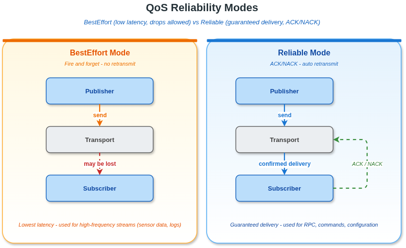

# 8. QoS 配置指南

## 目录

- [8.1 概念概述](#81-概念概述)
- [8.2 Qos 结构体字段详解](#82-qos-结构体字段详解)
- [8.3 可靠性策略](#83-可靠性策略)
- [8.4 历史策略](#84-历史策略)
- [8.5 持久化策略](#85-持久化策略)
- [8.6 发布模式](#86-发布模式)
- [8.7 活跃性策略](#87-活跃性策略)
- [8.8 接收顺序策略](#88-接收顺序策略)
- [8.9 所有权策略](#89-所有权策略)
- [8.10 Deadline 配置](#810-deadline-配置)
- [8.11 Lifespan 配置](#811-lifespan-配置)
- [8.12 延迟预算配置](#812-延迟预算配置)
- [8.13 资源限制配置](#813-资源限制配置)
- [8.14 VLink 扩展字段](#814-vlink-扩展字段)
- [8.15 预定义 QoS 配置](#815-预定义-qos-配置)
- [8.16 命名 Profile 注册机制](#816-命名-profile-注册机制)
- [8.17 各通信模型的 QoS 设置方式](#817-各通信模型的-qos-设置方式)
- [8.18 DDS 后端特定说明](#818-dds-后端特定说明)
- [8.19 完整代码示例](#819-完整代码示例)

---

## 8.1 概念概述

QoS（Quality of Service）是一组控制消息投递行为的策略参数。VLink 的 `Qos` 结构体以 DDS 标准 QoS 为蓝本，定义于 `include/vlink/extension/qos.h`。

配置 QoS 的方式：

1. **URL 查询参数**：URL 上加 `?qos=<name>` 引用已注册的命名 profile。
2. **Conf 构造**：构造 `DdsConf`/`DdscConf`/`DdsrConf`/`DdstConf`/`ZenohConf` 时填写 `qos` 字段。
3. **`register_qos(name, qos)`**：向上述 Conf 的静态表注册命名 profile，供 URL 引用。
4. **`load_global_qos_file(path)`**（仅 `DdsConf`/`DdstConf`）：加载 XML profile 文件。
5. **延迟初始化 + `set_property()`**：`InitType::kWithoutInit` 构造 → `set_property()` → `init()`。

### 8.1.1 可靠性模式对比



### 8.1.2 QoS 的维度（12 项子策略）

| 子策略              | 结构体                   | 关键字段                         |
| ------------------- | ------------------------ | -------------------------------- |
| Reliability         | `Qos::Reliability`       | `kind`, `block_time`, `heartbeat_time` |
| History             | `Qos::History`           | `kind`, `depth`                  |
| Durability          | `Qos::Durability`        | `kind`                           |
| PublishMode         | `Qos::PublishMode`       | `kind`                           |
| Liveliness          | `Qos::Liveliness`        | `kind`, `duration`               |
| DestinationOrder    | `Qos::DestinationOrder`  | `kind`                           |
| Ownership           | `Qos::Ownership`         | `kind`                           |
| Deadline            | `Qos::Deadline`          | `period`                         |
| Lifespan            | `Qos::Lifespan`          | `duration`                       |
| LatencyBudget       | `Qos::LatencyBudget`     | `duration`                       |
| ResourceLimits      | `Qos::ResourceLimits`    | `max_samples` / `max_instances` / `max_samples_per_instance` |
| Additions           | `Qos::Additions`         | `priority`, `is_express`         |

### 8.1.3 各后端对 Qos 字段的消费情况

`Qos` 结构体是面向 DDS 的抽象。非 DDS 后端对不认识的字段静默忽略。

| 后端                             | Qos 支持范围                                                                              |
| -------------------------------- | ------------------------------------------------------------------------------------------ |
| `dds://` / `ddsc://` / `ddsr://` / `ddst://` | 大部分 Qos 字段映射到原生 DDS QoS；`register_qos()`/`qos_ext` 可用，见各 `*Conf.h` |
| `zenoh://`                       | 支持 `ZenohConf::register_qos()`；具体字段映射由 Zenoh factory 解读（部分字段）           |
| `shm://` / `shm2://`             | `ShmConf`/`Shm2Conf` 无 `qos` 字段；行为主要由 `depth`、`history`、`wait` 等 Conf 字段决定 |
| `intra://`                       | `IntraConf` 无 `qos` 字段；由 `pipeline` 和 `type`（queue/direct）控制                    |
| `mqtt://`                        | `MqttConf` 用自己的 `qos` 字段（0/1/2，MQTT QoS 语义），与 DDS Qos 无关                    |
| `someip://`                      | 不使用 `Qos` 结构体，由 SOME/IP Service/Instance/Method ID 定义行为                        |
| `fdbus://` / `qnx://`            | 不使用 `Qos` 结构体                                                                        |

> 任何声称"Qos 所有字段在所有后端都生效"的描述都不符合源码行为。

---

## 8.2 Qos 结构体字段详解

头文件：`include/vlink/extension/qos.h`

```cpp
#include <vlink/extension/qos.h>
```

`Qos` 是一个 POD 聚合结构体，所有子策略均有合理的默认值。必须将 `valid` 字段设
为 `true`，QoS 才会被传输层实际应用（预定义 `QosProfile` 常量已自动设置此字段）。

| 字段名              | 类型                    | 默认值                          | 说明                             |
| ------------------- | ----------------------- | ------------------------------- | -------------------------------- |
| `name`              | `char[20]`              | `{0}`                                       | 配置名称，最多 19 字符 + NUL       |
| `valid`             | `bool`                  | `false`                                     | 必须为 true 才生效（QosProfile 已设） |
| `reliability`       | `Qos::Reliability`      | `kReliable`, block_time=100ms, heartbeat=3000ms | 投递可靠性                     |
| `history`           | `Qos::History`          | `kKeepLast`, depth=1                        | 历史保留                           |
| `durability`        | `Qos::Durability`       | `kVolatile`                                 | 样本持久化                         |
| `publish_mode`      | `Qos::PublishMode`      | `kSync`                                     | 发布模式                           |
| `liveliness`        | `Qos::Liveliness`       | `kAutomatic`, duration=-1                   | 活跃性检测                         |
| `destination_order` | `Qos::DestinationOrder` | `kReceptionTimestamp`                       | 接收端排序                         |
| `ownership`         | `Qos::Ownership`        | `kShared`                                   | 多写者所有权                       |
| `deadline`          | `Qos::Deadline`         | period=-1                                   | 发布周期上限（-1 = 无约束）        |
| `lifespan`          | `Qos::Lifespan`         | duration=-1                                 | 样本最长生存时间（-1 = 永久）      |
| `latency_budget`    | `Qos::LatencyBudget`    | duration=0                                  | 可接受延迟（0 = 尽量低）           |
| `resource_limits`   | `Qos::ResourceLimits`   | max_samples=6000, max_instances=10, max_samples_per_instance=500 | 队列容量 |
| `additions`         | `Qos::Additions`        | `priority=kPriorityNormal`, `is_express=false` | VLink 扩展                    |

---

## 8.3 可靠性策略

`Qos::Reliability` 控制消息投递是否有重传保证。

```cpp
struct Reliability final {
    enum Kind : uint8_t {
        kBestEffort = 0,  // 尽力而为，不重传
        kReliable   = 1,  // 可靠投递，重传直到 ACK 或超时
    };

    Kind    kind{kReliable};          // 默认：可靠
    int32_t block_time{100};          // 写入阻塞最大时间（ms）
    int32_t heartbeat_time{3000};     // 心跳间隔（ms）
};
```

### 8.3.1 kBestEffort（尽力而为）

- 消息发送后不等待确认，网络拥塞或接收端队列满时消息可能丢失。
- CPU 和网络开销最小，适合高频率传感器数据（激光雷达、IMU）。
- Publisher 和 Subscriber 必须都使用 BestEffort，否则 DDS 会拒绝连接。

### 8.3.2 kReliable（可靠投递）

- 底层协议负责重传，确保消息最终到达接收端。
- `block_time`：当发送缓冲区满时，写操作最多阻塞的毫秒数；超时后返回失败。
- `heartbeat_time`：Writer 向 Reader 发送心跳包的间隔，用于驱动重传逻辑。
- 适合控制命令、配置参数、RPC 请求/响应等不允许丢失的场景。

### 8.3.3 注意事项

- Publisher 与 Subscriber 的 Reliability 必须兼容（相同或 Reliable > BestEffort）。
- DDS 标准规定：Reader 请求 Reliable 但 Writer 提供 BestEffort 时，匹配失败。
- shm 后端在进程内通信时丢包概率极低，但仍建议关键路径使用 Reliable。

---

## 8.4 历史策略

`Qos::History` 控制系统为后加入的订阅者或应用程序保留多少历史样本。

```cpp
struct History final {
    enum Kind : uint8_t {
        kKeepLast = 0,  // 仅保留最近 depth 个样本
        kKeepAll  = 1,  // 保留全部未读样本（受 ResourceLimits 约束）
    };

    Kind    kind{kKeepLast};  // 默认：仅保留最新
    int32_t depth{1};         // 每实例保留样本数（仅 KeepLast 有效）
};
```

### 8.4.1 kKeepLast（保留最新）

- 每个实例最多保留 `depth` 个样本，超出后丢弃最旧的。
- 内存占用固定且可预测，适合大多数实时场景。
- `depth = 1` 时退化为只保留最新值（类似字段模型）。

### 8.4.2 kKeepAll（保留全部）

- 保留所有未被应用读取的样本，直到被读取或受 ResourceLimits 强制丢弃。
- 适合 RPC 场景（Method 模型），确保每个请求都被处理。
- 内存消耗不可预测，需配合 ResourceLimits 使用。

### 8.4.3 深度（depth）选择建议

| 场景             | 建议 depth | 理由                               |
| ---------------- | ---------- | ---------------------------------- |
| 传感器数据       | 10~50      | 允许短暂处理延迟时不丢帧           |
| 控制命令         | 1~10       | 通常只关心最新指令                 |
| RPC 请求         | KeepAll    | 每个请求必须被处理                 |
| 状态字段         | 1          | 只需要最新值                       |
| 大负载传输       | 200~500    | 为慢速网络提供充足缓冲             |

---

## 8.5 持久化策略

`Qos::Durability` 控制已发布的样本在 Publisher 端的缓存行为，影响后加入的
Subscriber 能否接收到之前发布的消息。

```cpp
struct Durability final {
    enum Kind : uint8_t {
        kVolatile       = 0,  // 无持久化，后加入者只收到新消息
        kTransientLocal = 1,  // Writer 缓存样本，后加入者可接收历史
        kTransient      = 2,  // 由外部持久化服务保存
        kPersistent     = 3,  // 写入稳定存储（磁盘）
    };

    Kind kind{kVolatile};  // 默认：无持久化
};
```

### 8.5.1 kVolatile（易失，默认）

- 样本发布后不额外缓存，后加入的 Subscriber 只能接收到订阅之后发布的消息。
- 内存开销最小，适合高频流式数据。

### 8.5.2 kTransientLocal（本地瞬态）

- DataWriter 在内存中缓存最近 History.depth 个样本。
- 新 Subscriber 连接时，Writer 自动向其推送缓存的历史消息。
- 对 DDS 类后端，Field 模型（Getter/Setter）在未显式指定 `qos` 时默认使用此模式，
  用于提高 Getter 启动时获取 Setter 已发布值的概率；用户显式指定 `qos` 时以配置为准，
  非 DDS 后端不强制使用该 Durability 语义。
- 适合服务发现、配置参数、静态地图等场景。

### 8.5.3 kTransient / kPersistent

- 需要外部 DDS 持久化服务支持，VLink 当前通常不使用这两种模式。
- 仅 DDS 后端支持，其他后端会忽略。

---

## 8.6 发布模式

`Qos::PublishMode` 控制 DataWriter 的发送操作是否在调用线程上同步完成。

```cpp
struct PublishMode final {
    enum Kind : uint8_t {
        kSync  = 0,  // 同步：写完成后返回
        kASync = 1,  // 异步：写入队列后立即返回，后台线程发送
    };

    Kind kind{kSync};  // 默认：同步
};
```

| 模式     | 延迟   | 吞吐量 | 适用场景                       |
| -------- | ------ | ------ | ------------------------------ |
| `kSync`  | 低     | 中     | 控制命令、RPC、字段更新        |
| `kASync` | 极低   | 高     | 高频传感器数据、大负载批量发送 |

---

## 8.7 活跃性策略

`Qos::Liveliness` 控制系统如何检测 DataWriter 是否仍然存活。

```cpp
struct Liveliness final {
    enum Kind : uint8_t {
        kAutomatic         = 0,  // 中间件自动声明活跃性
        kManualParticipant = 1,  // 应用在参与者层面手动声明
        kManualTopic       = 2,  // 应用在 DataWriter 层面手动声明
    };

    Kind    kind{kAutomatic};  // 默认：自动
    int32_t duration{-1};      // 租约时长（ms），-1 表示无限
};
```

- `kAutomatic`：只要 Publisher 进程存活，中间件自动维护活跃性声明。
- `duration`：Reader 期望 Writer 在此时间内至少声明一次活跃性；超时触发
  `LIVELINESS_CHANGED` 状态事件。`-1` 表示不设置租约。

---

## 8.8 接收顺序策略

`Qos::DestinationOrder` 控制 Reader 端对收到样本的排序方式。

```cpp
struct DestinationOrder final {
    enum Kind : uint8_t {
        kReceptionTimestamp = 0,  // 按接收时间排序（默认）
        kSourceTimestamp    = 1,  // 按发布时间排序
    };

    Kind kind{kReceptionTimestamp};
};
```

- `kReceptionTimestamp`：以 Reader 接收到消息的本地时间戳排序，不依赖时钟同步。
- `kSourceTimestamp`：以 Writer 发布时打的时间戳排序，需要各节点时钟同步，适合
  多源数据融合场景。

---

## 8.9 所有权策略

`Qos::Ownership` 控制多个 Writer 对同一数据实例的写权限。

```cpp
struct Ownership final {
    enum Kind : uint8_t {
        kShared    = 0,  // 共享：多个 Writer 均可写（默认）
        kExclusive = 1,  // 独占：仅强度最高的 Writer 可写
    };

    Kind kind{kShared};
};
```

- `kShared`：多个 Publisher 可以向同一 topic 发布，Reader 会收到全部数据。
- `kExclusive`：配合 OwnershipStrength 使用，强度最高的 Writer 独占该实例的写入权，
  常用于主备热切换场景。

---

## 8.10 Deadline 配置

`Qos::Deadline` 约束 Publisher 发布数据的最大时间间隔。

```cpp
struct Deadline final {
    int32_t period{-1};  // 最大发布间隔（ms），-1 表示无约束
};
```

- 当 Publisher 在 `period` 毫秒内未发布新数据时，触发 `DEADLINE_MISSED` 状态事件。
- Subscriber 端设置的 deadline 必须 >= Publisher 端的 deadline（DDS 匹配规则）。
- 适合安全关键场景（如心跳检测）：将 period 设为预期发布频率的 2~3 倍。

```cpp
// 示例：要求 Publisher 每 100ms 至少发布一次
vlink::Qos qos;
qos.valid      = true;
qos.deadline.period = 100;  // 100ms
```

---

## 8.11 Lifespan 配置

`Qos::Lifespan` 设置样本的最大存活时间，超时后样本被自动丢弃。

```cpp
struct Lifespan final {
    int32_t duration{-1};  // 样本最大年龄（ms），-1 表示永不过期
};
```

- 超过 `duration` 毫秒的样本在 Writer 缓存和 Reader 队列中均会被删除。
- 适合时效性强的数据（如实时位置信息），避免 Subscriber 处理过时数据。
- `-1` 表示样本永不过期（默认值）。

---

## 8.12 延迟预算配置

`Qos::LatencyBudget` 向中间件提示可接受的端到端延迟上限。

```cpp
struct LatencyBudget final {
    int32_t duration{0};  // 可接受延迟（ms），0 表示尽量低
};
```

- 这是一个优化提示而非强制约束：中间件可利用此信息进行批量发送或调度优化。
- `duration = 0`：请求最低可能延迟，中间件不允许为了聚合而延迟发送。
- 较大的值允许中间件将多条消息打包发送，可能提高吞吐量。

---

## 8.13 资源限制配置

`Qos::ResourceLimits` 限制内部 DataWriter / DataReader 队列的最大容量。

```cpp
struct ResourceLimits final {
    int32_t max_samples{6000};              // 所有实例的总样本数上限
    int32_t max_instances{10};              // 最大实例数
    int32_t max_samples_per_instance{500};  // 每实例最大样本数
};
```

| 字段                      | 说明                                          | 调整建议                     |
| ------------------------- | --------------------------------------------- | ---------------------------- |
| `max_samples`             | Writer/Reader 内部队列总容量                  | 高吞吐场景适当增大           |
| `max_instances`           | 支持的 key 实例数（DDS Keyed Topic）          | 单 topic 通常保持默认 10     |
| `max_samples_per_instance`| 单个实例的样本缓存上限                        | 不能超过 max_samples         |

**注意**：`max_samples_per_instance * max_instances` 不得超过 `max_samples`，否则
中间件可能拒绝初始化。

---

## 8.14 VLink 扩展字段

`Qos::Additions` 是 VLink 在标准 DDS QoS 之外的专有扩展。

```cpp
struct Additions final {
    enum Priority : uint8_t {
        kPriorityRealTime  = 1,  // 硬实时，最高优先级
        kPriorityHigh      = 2,  // 高优先级事件
        kPriorityNormal    = 4,  // 标准应用消息
        kPriorityLow       = 6,  // 低优先级后台任务
        kPriorityBackground= 7,  // 最低优先级
    };

    Priority priority{kPriorityNormal};  // 任务调度优先级
    bool     is_express{false};          // true 时绕过普通队列立即发送
};
```

- `priority`：当 MessageLoop 使用优先级队列时，决定回调的调度顺序。
- `is_express`：启用后消息会绕过普通调度队列直接投递，适合对延迟极敏感的传感器
  数据（如 kSensor profile 启用此选项）。

---

## 8.15 预定义 QoS 配置

头文件：`include/vlink/extension/qos_profile.h`

`QosProfile` 命名空间提供 **13 个预定义 profile**（`include/vlink/extension/qos_profile.h`），`valid` 字段全部预设为 `true`，可直接使用。

```cpp
#include <vlink/extension/qos_profile.h>
#include <vlink/modules/dds_conf.h>

// 方式 1：注册预定义 QoS profile，通过 URL 引用
vlink::DdsConf::register_qos("sensor", vlink::QosProfile::kSensor);
auto pub = vlink::Publisher<MyMsg>("dds://my_topic?qos=sensor");

// 方式 2：通过 DdsConf 构造时指定已注册的 QoS 名称
auto pub2 = vlink::Publisher<MyMsg>(vlink::DdsConf("my_topic", 0, 0, "sensor"));
```

### 8.15.1 预定义配置汇总

| 配置名       | 字符串名    | Reliability | History            | Durability      | PubMode | 优先级     | Express | 适用场景                   |
| ------------ | ----------- | ----------- | ------------------ | --------------- | ------- | ---------- | ------- | -------------------------- |
| `kEvent`     | `"event"`   | Reliable    | KeepLast(10)       | Volatile        | Sync    | RealTime   | 否      | 离散控制事件               |
| `kMethod`    | `"method"`  | Reliable    | KeepAll(1)         | Volatile        | Sync    | High       | 否      | RPC 请求/响应              |
| `kField`     | `"field"`   | Reliable    | KeepLast(1)        | TransientLocal  | Sync    | High       | 否      | 最新值状态同步             |
| `kSensor`    | `"sensor"`  | BestEffort  | KeepLast(20)       | Volatile        | ASync   | Normal     | **是**  | 高频传感器数据             |
| `kParameter` | `"parameter"`| Reliable   | KeepLast(1000)     | Volatile        | Sync    | Normal     | 否      | 配置参数                   |
| `kService`   | `"service"` | Reliable    | KeepLast(10)       | TransientLocal  | Sync    | Normal     | 否      | 服务发现与注册             |
| `kClock`     | `"clock"`   | BestEffort  | KeepLast(1)        | Volatile        | ASync   | Low        | 否      | 时间同步广播               |
| `kStatic`    | `"static"`  | Reliable    | KeepAll(1)         | TransientLocal  | Sync    | Normal     | 否      | 静态数据（地图、标定）     |
| `kLight`     | `"light"`   | Reliable    | KeepLast(1)        | Volatile        | ASync   | High       | 否      | 轻量高频消息               |
| `kPoor`      | `"poor"`    | BestEffort  | KeepLast(5)        | Volatile        | ASync   | Background | 否      | 低优先级尽力传输           |
| `kBetter`    | `"better"`  | BestEffort  | KeepLast(50)       | Volatile        | Sync    | RealTime   | 否      | 高吞吐尽力传输（同步发送，延迟可预测）|
| `kBest`      | `"best"`    | Reliable    | KeepLast(200)      | Volatile        | Sync    | RealTime   | 否      | 高吞吐可靠传输（同步发送，延迟可预测）|
| `kLarge`     | `"large"`   | Reliable(block=100ms, heartbeat=500ms) | KeepLast(500) | Volatile | Sync | Low | 否 | 大负载传输（点云/地图）    |

> `kLarge` 显式设置 `heartbeat_time=500` 以适应慢速传输，其余均使用默认 3000ms。

### 8.15.2 按名称查找配置

```cpp
auto& qos_map = vlink::QosProfile::get_available_qos_map();
auto it = qos_map.find("sensor");
if (it != qos_map.end()) {
    // 将找到的 QoS 注册到 DdsConf 中使用
    vlink::DdsConf::register_qos("sensor", it->second);
}
```

---

## 8.16 命名 Profile 注册机制

DDS 家族与 Zenoh 的 Conf 提供静态 `register_qos(name, qos)`：

- `DdsConf::register_qos()`
- `DdscConf::register_qos()`
- `DdsrConf::register_qos()`
- `DdstConf::register_qos()`
- `ZenohConf::register_qos()`

URL 上使用 `?qos=<name>` 后，Conf 会去各自的静态表里查找。保留键名不能作为 profile 名（`register_qos()` 检查后 fatal log 并拒绝）：

- DDS 家族（`DdsConf` / `DdscConf` / `DdsrConf` / `DdstConf`）：`part`、`topic`、`pub`、`sub`、`writer`、`reader`、`depth`
- `ZenohConf`：`part`、`topic`、`pub`、`sub`、`writer`、`reader`（不含 `depth`）

同名重复注册也会被拒绝。

`ShmConf`、`Shm2Conf`、`IntraConf`、`MqttConf`、`SomeipConf`、`FdbusConf`、`QnxConf` **没有** `register_qos()` 接口。

### 8.16.1 qos 与 qos_ext 的关系（DDS 家族）

`DdsConf` / `DdsrConf` / `DdstConf` 支持扩展 QoS map `qos_ext`，键为 `part` / `topic` / `pub` / `sub` / `writer` / `reader`。`qos` 和 `qos_ext` **互斥**：同时非空会让 `is_valid()` 返回 `false`。

### 8.16.2 全局 XML 文件

仅 `DdsConf` 和 `DdstConf` 提供 `load_global_qos_file(filepath)`（Fast-DDS 与 TravoDDS 的 XML profile 文件）。`DdscConf` / `DdsrConf` 不提供此接口；CycloneDDS 的配置通过 `VLINK_CYCLONEDDS_URI` 传入。

---

## 8.17 各通信模型的 QoS 设置方式

### 8.17.1 Event 模型（Publisher / Subscriber）

```cpp
#include <vlink/publisher.h>
#include <vlink/subscriber.h>
#include <vlink/modules/dds_conf.h>
#include <vlink/extension/qos_profile.h>

// 方式 1：注册预定义 QoS profile，通过 URL 引用
vlink::DdsConf::register_qos("sensor", vlink::QosProfile::kSensor);
vlink::Publisher<MyMsg> pub("dds://vehicle/speed?qos=sensor");

// 方式 2：自定义 QoS 并注册
vlink::Qos qos;
qos.valid                   = true;
qos.reliability.kind        = vlink::Qos::Reliability::kReliable;
qos.history.kind            = vlink::Qos::History::kKeepLast;
qos.history.depth           = 20;
qos.durability.kind         = vlink::Qos::Durability::kVolatile;
qos.publish_mode.kind       = vlink::Qos::PublishMode::kASync;
qos.additions.priority      = vlink::Qos::Additions::kPriorityHigh;

vlink::DdsConf::register_qos("custom_event", qos);
vlink::Subscriber<MyMsg> sub("dds://vehicle/speed?qos=custom_event");
sub.listen([](const MyMsg& msg) {
    // 处理消息
});

// 方式 3：通过 DdsConf 对象直接构造
vlink::Subscriber<MyMsg> sub2(vlink::DdsConf("vehicle/speed", 0, 20, "sensor"));
sub2.listen([](const MyMsg& msg) {
    // 处理消息
});

// 方式 4：延迟初始化 + set_property
vlink::Publisher<MyMsg> pub2("dds://vehicle/speed", vlink::InitType::kWithoutInit);
pub2.set_property("depth", "20");
pub2.set_property("qos", "sensor");
pub2.init();
```

### 8.17.2 Method 模型（Client / Server）

```cpp
#include <vlink/client.h>
#include <vlink/server.h>
#include <vlink/modules/dds_conf.h>
#include <vlink/extension/qos_profile.h>

// 注册 QoS profile
vlink::DdsConf::register_qos("method", vlink::QosProfile::kMethod);

// Server 端：通过 URL 引用已注册的 QoS
vlink::Server<Request, Response> server("dds://my_service?qos=method");
server.listen([](const Request& req, Response& resp) {
    resp.result = process(req);
});

// Client 端：同样通过 URL 引用
vlink::Client<Request, Response> client("dds://my_service?qos=method");
client.wait_for_connected();
auto resp = client.invoke(Request{...});
```

### 8.17.3 Field 模型（Setter / Getter）

DDS 类后端的 Field 模型在未显式指定 `qos` 时会使用 Field 默认 QoS；显式配置时推荐使用
`kField` 预定义配置（TransientLocal + KeepLast(1)），以便迟到 Getter 更容易获得 Setter 已发布的最新值。
非 DDS 后端不强制使用该持久化策略。

```cpp
#include <vlink/setter.h>
#include <vlink/getter.h>
#include <vlink/modules/dds_conf.h>
#include <vlink/extension/qos_profile.h>

// 注册 kField QoS profile
vlink::DdsConf::register_qos("field", vlink::QosProfile::kField);

// Setter 端：使用 kField 配置（TransientLocal + KeepLast(1)）
vlink::Setter<int> setter("dds://system/mode?qos=field");
setter.set(42);

// Getter 端：同样使用 kField 配置
vlink::Getter<int> getter("dds://system/mode?qos=field");

// 阻塞等待直到收到值
if (auto val = getter.get()) {
    std::cout << "mode: " << *val << std::endl;
}
```

---

## 8.18 DDS 后端特定说明

### 8.18.1 QoS 兼容性规则

DDS 标准规定 Publisher 和 Subscriber 的 QoS 必须兼容，否则匹配失败（无法通信）：

| Publisher QoS    | Subscriber 要求        | 是否兼容  |
| ---------------- | ---------------------- | --------- |
| Reliable         | Reliable               | 兼容      |
| Reliable         | BestEffort             | 兼容      |
| BestEffort       | BestEffort             | 兼容      |
| BestEffort       | Reliable               | **不兼容**|
| Volatile         | Volatile               | 兼容      |
| TransientLocal   | TransientLocal         | 兼容      |
| TransientLocal   | Volatile               | 兼容      |
| Volatile         | TransientLocal         | **不兼容**|

### 8.18.2 FastDDS / CycloneDDS 特有注意事项

- DDS 的 `ResourceLimits` 影响 DataWriter 和 DataReader 的内部内存预分配大小，
  在嵌入式环境中需根据实际物理内存调整。
- `heartbeat_time` 直接影响重传响应速度：值越小，丢包后恢复越快，但 CPU 开销增加。
- 使用 `kASync` 发布模式时，DDS 内部会启动异步发送线程；进程内节点数量多时
  注意线程总数。

### 8.18.3 多 DDS 域（Domain ID）

不同 Domain ID 的节点相互隔离，QoS 设置不影响跨域可见性。在 VLink 中通过
`DdsConf::domain` 字段或 URL 参数 `?domain=N` 配置。

---

## 8.19 完整代码示例

### 8.19.1 示例 1：自定义 QoS 的 Event 模型

```cpp
#include <vlink/publisher.h>
#include <vlink/subscriber.h>
#include <vlink/modules/dds_conf.h>
#include <vlink/extension/qos.h>

#include <iostream>
#include <thread>
#include <chrono>

struct SensorData {
    float x;
    float y;
    float z;
};

int main() {
    // 构造传感器专用 QoS
    vlink::Qos sensor_qos;
    sensor_qos.valid                     = true;
    sensor_qos.reliability.kind          = vlink::Qos::Reliability::kBestEffort;
    sensor_qos.history.kind              = vlink::Qos::History::kKeepLast;
    sensor_qos.history.depth             = 20;
    sensor_qos.durability.kind           = vlink::Qos::Durability::kVolatile;
    sensor_qos.publish_mode.kind         = vlink::Qos::PublishMode::kASync;
    sensor_qos.additions.priority        = vlink::Qos::Additions::kPriorityNormal;
    sensor_qos.additions.is_express      = true;
    sensor_qos.deadline.period           = 50;   // 每 50ms 必须发布一次

    // 注册自定义 QoS profile
    vlink::DdsConf::register_qos("my_sensor", sensor_qos);

    // Subscriber：通过 URL 引用已注册的 QoS
    vlink::Subscriber<SensorData> sub("dds://lidar/points?qos=my_sensor");
    sub.listen([](const SensorData& data) {
        std::cout << "x=" << data.x << " y=" << data.y << " z=" << data.z << std::endl;
    });

    // Publisher：通过 URL 引用已注册的 QoS
    vlink::Publisher<SensorData> pub("dds://lidar/points?qos=my_sensor");
    pub.wait_for_subscribers();

    for (int i = 0; i < 100; ++i) {
        SensorData d{static_cast<float>(i), static_cast<float>(i * 2), 0.0f};
        pub.publish(d);
        std::this_thread::sleep_for(std::chrono::milliseconds(10));
    }

    return 0;
}
```

### 8.19.2 示例 2：使用预定义配置的 Field 模型

```cpp
#include <vlink/setter.h>
#include <vlink/getter.h>
#include <vlink/modules/dds_conf.h>
#include <vlink/extension/qos_profile.h>

#include <iostream>
#include <thread>
#include <chrono>

int main() {
    // 注册 kField QoS profile（TransientLocal + KeepLast(1)）
    vlink::DdsConf::register_qos("field", vlink::QosProfile::kField);

    // Setter：写入系统模式
    vlink::Setter<int> setter("dds://system/drive_mode?qos=field");
    setter.set(2);   // 模式 2

    // 模拟延迟后启动的 Getter
    std::this_thread::sleep_for(std::chrono::milliseconds(200));

    // Getter：由于 kField 使用 TransientLocal，即使晚于 Setter 启动也能获取到值
    vlink::Getter<int> getter("dds://system/drive_mode?qos=field");

    if (auto val = getter.get()) {
        std::cout << "drive_mode = " << *val << std::endl;  // 输出：drive_mode = 2
    } else {
        std::cout << "no value yet" << std::endl;
    }

    return 0;
}
```

### 8.19.3 示例 3：按名称动态选择 QoS 配置

```cpp
#include <vlink/publisher.h>
#include <vlink/modules/dds_conf.h>
#include <vlink/extension/qos_profile.h>

#include <string>
#include <iostream>

// 根据 profile 名称注册对应的 QoS 到 DdsConf
bool register_qos_by_name(const std::string& profile_name) {
    auto& qos_map = vlink::QosProfile::get_available_qos_map();

    auto it = qos_map.find(profile_name);

    if (it != qos_map.end()) {
        vlink::DdsConf::register_qos(profile_name, it->second);
        std::cout << "Registered QoS profile: " << profile_name << std::endl;
        return true;
    } else {
        std::cerr << "Unknown QoS profile: " << profile_name << std::endl;
        return false;
    }
}

int main() {
    // 从配置文件或命令行参数中读取 profile 名称
    std::string profile_name = "event";

    if (register_qos_by_name(profile_name)) {
        // 通过 URL 引用已注册的 QoS profile
        vlink::Publisher<std::string> pub("dds://log/events?qos=" + profile_name);
        pub.wait_for_subscribers();
        pub.publish(std::string("system started"));
    }

    return 0;
}
```

**相关文档：**

- 传输后端的 QoS 支持范围请参阅 [传输后端与 URL](07-transport.md) 中各后端的 QoS 说明
- Event / Method / Field 模型请参阅 [Event 模型](03-event-model.md)、[Method 模型](04-method-model.md)、[Field 模型](05-field-model.md)
- QoS 扩展字段 `Additions::Priority` 与 `MessageLoop` 优先级的关系请参阅 [基础库](11-base-library.md) 中的 MessageLoop 章节

### 8.19.4 示例 4：大负载传输的 QoS 配置

```cpp
#include <vlink/publisher.h>
#include <vlink/subscriber.h>
#include <vlink/modules/dds_conf.h>
#include <vlink/extension/qos_profile.h>
#include <vlink/base/bytes.h>

int main() {
    // 注册 kLarge 配置：Reliable + KeepLast(500) + 延长心跳间隔
    vlink::DdsConf::register_qos("large", vlink::QosProfile::kLarge);

    // 通过 URL 引用已注册的 QoS
    vlink::Publisher<vlink::Bytes> pub("dds://map/point_cloud?qos=large");

    vlink::Subscriber<vlink::Bytes> sub("dds://map/point_cloud?qos=large");
    sub.listen([](const vlink::Bytes& data) {
        // 处理大型点云数据
    });

    pub.wait_for_subscribers();

    // 模拟发布 10MB 点云数据
    vlink::Bytes large_data = vlink::Bytes::create(10 * 1024 * 1024);
    pub.publish(large_data);

    return 0;
}
```
