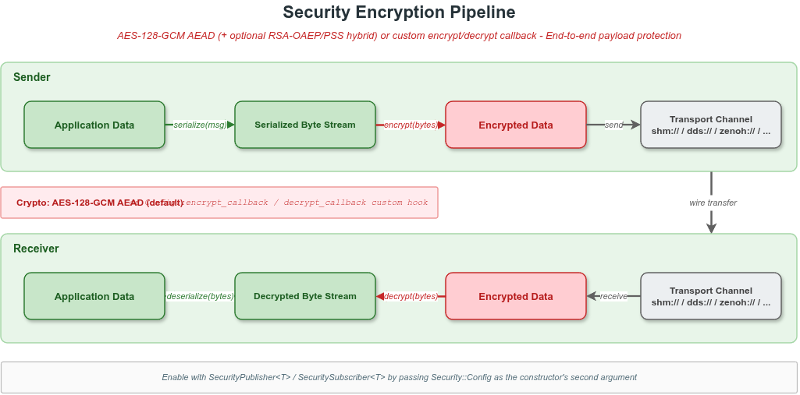

# 9. 安全加密

## 目录

- [9.1 概述](#91-概述)
- [9.2 编译要求](#92-编译要求)
- [9.3 SecurityType 与 Security 类别名](#93-securitytype-与-security-类别名)
- [9.4 Security 类与 Config 配置](#94-security-类与-config-配置)
- [9.5 对称模式（key / passphrase）](#95-对称模式key--passphrase)
- [9.6 非对称模式（RSA 混合握手）](#96-非对称模式rsa-混合握手)
- [9.7 自定义加密回调](#97-自定义加密回调)
- [9.8 算法与 Wire Format](#98-算法与-wire-format)
- [9.9 不支持安全加密的组合](#99-不支持安全加密的组合)
- [9.10 VLINK_SSL_* 环境变量（传输层 TLS）](#910-vlink_ssl_-环境变量传输层-tls)
- [9.11 完整使用示例](#911-完整使用示例)
- [9.12 性能与最佳实践](#912-性能与最佳实践)

---

## 9.1 概述

VLink 支持在**消息层面**对传输内容加密：加密发生在序列化之后、传输之前，解密发生在接收之后、反序列化之前，因此大多数传输后端对上层透明。

核心设计：

- **透明接入**：普通节点类型换成 `Security*` 别名，或把模板参数 `SecT` 设为 `SecurityType::kWithSecurity`，业务代码不变。
- **一次配置**：所有参数通过 `Security::Config` aggregate 一次性传入 `SecurityXxx` 的构造函数；没有单独的 setter，要更换配置请销毁并重新构造节点。
- **线程安全**：`Security::encrypt()` / `decrypt()` 内部互斥保护。
- **三种模式自动切换**：对称 AEAD / RSA 非对称混合握手 / 自定义回调。
- **按需开销**：`SecT == kWithoutSecurity`（默认）时没有任何加密代码路径。

支持的通信模型：

| 通信模型   | 发送端（加密）             | 接收端（解密）               |
| ---------- | -------------------------- | ---------------------------- |
| Event      | `SecurityPublisher<T>`     | `SecuritySubscriber<T>`      |
| Method     | `SecurityClient<Req,Resp>` | `SecurityServer<Req,Resp>`   |
| Field      | `SecuritySetter<T>`        | `SecurityGetter<T>`          |



---

## 9.2 编译要求

### 9.2.1 内置 AEAD / RSA 模式

顶层 CMake 选项 `ENABLE_SECURITY` 默认 `ON`，开启后会链接 OpenSSL 并在编译单元里定义宏 `VLINK_ENABLE_SECURITY`。

```cmake
cmake -DENABLE_SECURITY=ON ...
target_link_libraries(my_app PRIVATE vlink::vlink)
```

未定义 `VLINK_ENABLE_SECURITY` 时，对称与非对称路径不可用；`Security::encrypt()` / `decrypt()` 会打印 warning 并返回 `false`。

### 9.2.2 自定义回调模式

通过 `Config::encrypt_callback` / `decrypt_callback` 注入算法时不依赖 OpenSSL，`ENABLE_SECURITY` 可关；此时仍可以使用 `SecurityPublisher` 等类型，只要回调自身是自洽的。

---

## 9.3 SecurityType 与 Security 类别名

所有通信节点的模板签名都携带 `SecT` 参数：

```cpp
template <typename MsgT, SecurityType SecT = SecurityType::kWithoutSecurity>
class Publisher;

template <typename ReqT, typename RespT = Traits::EmptyType,
          SecurityType SecT = SecurityType::kWithoutSecurity>
class Client;

// Subscriber / Server / Setter / Getter 同理
```

`SecurityType` 枚举（`include/vlink/impl/types.h`）：

| 值  | 枚举                           | 含义                     |
| --- | ------------------------------ | ------------------------ |
| 0   | `SecurityType::kWithoutSecurity` | 不启用加密（默认）       |
| 1   | `SecurityType::kWithSecurity`    | 启用消息级加密/解密      |

两种写法等价：

```cpp
// 直接指定模板参数
vlink::Publisher<MyMsg, vlink::SecurityType::kWithSecurity> pub("shm://topic");

// 使用 Security* 别名（推荐，更简洁）
vlink::SecurityPublisher<MyMsg> pub("shm://topic");
```

别名定义于各自头文件：`publisher.h` / `subscriber.h` / `client.h` / `server.h` / `setter.h` / `getter.h`，对应 `SecurityPublisher` / `SecuritySubscriber` / `SecurityClient` / `SecurityServer` / `SecuritySetter` / `SecurityGetter`。

---

## 9.4 Security 类与 Config 配置

头文件：`include/vlink/extension/security.h`。

```cpp
class Security final {
 public:
  using Callback = Function<bool(const Bytes& in, Bytes& out)>;

  struct Config final {
    std::string key;                       // 原始对称种子；SHA-256 截断为 16 字节
    std::string passphrase;                // 低熵口令，通过 PBKDF2-HMAC-SHA256 派生
    Bytes pbkdf2_salt;                     // 每部署唯一 salt（>= 16 字节），双端共享
    uint32_t pbkdf2_iterations{200000U};   // PBKDF2 迭代次数
    std::string public_key_pem;            // 对端 RSA 公钥（PEM），用于发送方加密
    std::string private_key_pem;           // 本地 RSA 私钥（PEM），用于接收方解密
    std::string signing_key_pem;           // 本地 RSA 私钥（PEM），用于 RSA-PSS 签名
    std::string verify_key_pem;            // 对端 RSA 公钥（PEM），用于 RSA-PSS 验签
    Callback encrypt_callback;             // 自定义加密
    Callback decrypt_callback;             // 自定义解密
  };

  Security();
  explicit Security(const Config& cfg);
  ~Security();

  bool encrypt(const Bytes& in, Bytes& out);
  bool decrypt(const Bytes& in, Bytes& out);
};
```

`Security::Config` 通过 `SecurityXxx` 节点的**构造函数**一次性传入（不再有运行时 setter）：

```cpp
explicit SecurityPublisher(const std::string& url_str, const Security::Config& sec_cfg = {},
                           InitType type = InitType::kWithInit);

template <typename ConfT, typename = std::enable_if_t<std::is_base_of_v<Conf, ConfT>>>
explicit SecurityPublisher(const ConfT& conf, const Security::Config& sec_cfg = {},
                           InitType type = InitType::kWithInit);
```

`SecuritySubscriber` / `SecurityServer` / `SecurityClient` / `SecuritySetter` / `SecurityGetter` 的签名与之对应（method/field 类增加 `RespT` / `ValueT` 模板形参，含义不变）。

要点：

- 配置**一次性**：`Security::Config` 只在构造时传入。内部在 `init()` 之前用候选 `Security` 验证 `is_configured()`，通过才安装；否则 `security_` 保持为空，对应通道的 encrypt / decrypt 会返回 `false`。
- 模式选择**自动**：自定义回调 > RSA 非对称（存在 `public_key_pem` 或 `private_key_pem`）> 对称（`key` 或 `passphrase`）。
- 不再暴露 `enable_security()` / `security()` 给用户代码（前者已移到 `Node` 的 protected 入口，仅供 `SecurityXxx` 子类内部调用）。需要再次更换配置的场景，请销毁并重新构造节点。
- 验证失败（PEM 损坏、RSA 长度 < 2048、缺失 salt 等）会打印 warning 并把对应槽位置空；只要还有其他合法槽位即视为成功（`is_configured() == true`）。
- 自定义回调必须**成对**安装（`encrypt_callback` 与 `decrypt_callback` 同时设置）；仅设其中之一会被忽略并打印 warning。
- 不支持的传输（`intra://` 或 `dds://` CDR）会打印 warning 并忽略 `Security::Config`，节点继续按明文工作。

---

## 9.5 对称模式（key / passphrase）

对称模式覆盖最常见的"双端预共享"场景。两种密钥来源：

| 来源 | 派生方式 | 适用场景 |
| ---- | -------- | -------- |
| `Config::key` | SHA-256 截断为 16 字节 AES 密钥 | 已有高熵密钥（KMS / HSM 派生） |
| `Config::passphrase` | PBKDF2-HMAC-SHA256（默认 200 000 轮）+ `pbkdf2_salt` | 低熵人类口令；**必须**配 `pbkdf2_salt` |

调用约定：

- 双端 `Config` 必须**一致**（同一 `key`，或同一 `passphrase + salt + iterations`），否则解密失败、消息丢弃。
- `pbkdf2_salt` 长度建议 ≥ 16 字节，需通过安全渠道共享。
- 留空 `key` 与 `passphrase` 时不安装对称密钥。

示例：

```cpp
// 使用预共享 key
vlink::Security::Config cfg;
cfg.key = "my-secret";
vlink::SecurityPublisher<MyMsg> pub("shm://secure/topic", cfg);

vlink::SecuritySubscriber<MyMsg> sub("shm://secure/topic", cfg);
sub.listen([](const MyMsg& msg) { /* 已自动解密 */ });
```

```cpp
// 使用 passphrase + PBKDF2
vlink::Security::Config cfg;
cfg.passphrase = "correct horse battery staple";
cfg.pbkdf2_salt = shared_salt;       // 双端共享，>= 16 字节
cfg.pbkdf2_iterations = 200000;      // 可调，默认 200 000

vlink::SecurityPublisher<MyMsg> pub("shm://secure/topic", cfg);
vlink::SecuritySubscriber<MyMsg> sub("shm://secure/topic", cfg);
```

---

## 9.6 非对称模式（RSA 混合握手）

非对称模式让发送方无需预共享对称密钥；每条消息独立生成 16 字节 AES 会话密钥，用对端 RSA 公钥 OAEP 包装后随密文一起发送。可选 RSA-PSS 签名提供发送方身份认证。

所有 RSA PEM **必须 ≥ 2048 位**。

| 字段 | 角色 | 说明 |
| ---- | ---- | ---- |
| `public_key_pem` | 发送端持有对端公钥 | RSA-OAEP-SHA256 包装会话密钥 |
| `private_key_pem` | 接收端持有自身私钥 | RSA-OAEP-SHA256 解开会话密钥 |
| `signing_key_pem` | 发送端持有自身私钥 | RSA-PSS-SHA256 对 `wrap_len_le ‖ wrapped_key ‖ nonce ‖ ciphertext ‖ tag` 签名（可选） |
| `verify_key_pem` | 接收端持有对端公钥 | RSA-PSS-SHA256 验签；签名缺失或失败则拒绝消息 |

示例（带发送方认证）：

```cpp
vlink::Security::Config sender_cfg;
sender_cfg.public_key_pem = peer_pub_pem;     // 对端公钥
sender_cfg.signing_key_pem = own_priv_pem;    // 本地私钥用于签名

vlink::SecurityPublisher<MyMsg> pub("dds://secure/topic", sender_cfg);

vlink::Security::Config receiver_cfg;
receiver_cfg.private_key_pem = own_priv_pem;  // 本地私钥用于解密
receiver_cfg.verify_key_pem = peer_pub_pem;   // 对端公钥用于验签

vlink::SecuritySubscriber<MyMsg> sub("dds://secure/topic", receiver_cfg);
```

省略 `signing_key_pem` / `verify_key_pem` 时仍可正常加解密，只是不再校验发送方身份。

---

## 9.7 自定义加密回调

业务可同时安装 `Config::encrypt_callback` 与 `Config::decrypt_callback`，**完全绕过**内置 AEAD 与 RSA 路径，用于接入 SM4、ChaCha20、HSM、白盒密码等。

回调签名：

```cpp
using Security::Callback = Function<bool(const Bytes& in, Bytes& out)>;
```

- 发送端：`in` 为明文，写入 `out` 作为密文。
- 接收端：`in` 为密文，写入 `out` 作为明文。
- 返回 `false` 时消息被丢弃。
- 安装后 AEAD/RSA 路径不再被走，**不依赖** `VLINK_ENABLE_SECURITY`。
- 两个回调必须**同时**安装；只设一个时该槽生效另一槽返回 `false`。

示例：

```cpp
const uint8_t kXorKey = 0xAB;

auto xor_encrypt = [](const vlink::Bytes& in, vlink::Bytes& out) -> bool {
    out = vlink::Bytes::create(in.size());
    for (size_t i = 0; i < in.size(); ++i) {
        out[i] = in[i] ^ kXorKey;
    }
    return true;
};
auto xor_decrypt = xor_encrypt;  // XOR 自互反

vlink::Security::Config cfg;
cfg.encrypt_callback = xor_encrypt;
cfg.decrypt_callback = xor_decrypt;

vlink::SecurityPublisher<vlink::Bytes> pub("dds://secure/data", cfg);
vlink::SecuritySubscriber<vlink::Bytes> sub("dds://secure/data", cfg);
sub.listen([](const vlink::Bytes& msg) { /* 已解密 */ });
```

---

## 9.8 算法与 Wire Format

### 9.8.1 对称 AEAD

| 参数     | 值                                                   |
| -------- | ---------------------------------------------------- |
| 算法     | AES-128-GCM（OpenSSL EVP API）                       |
| 密钥     | SHA-256(`key`) 截断为 16 字节；或 PBKDF2(`passphrase`) |
| Nonce    | 12 字节，每条消息独立 `RAND_bytes()` 生成           |
| Tag      | 16 字节认证标签                                       |
| 线程安全 | 是（内部互斥保护）                                    |

Wire format：

```
[12 B random nonce] [N B ciphertext] [16 B GCM tag]
```

`N` 等于明文长度（AES-GCM 不带 padding）。

### 9.8.2 非对称 RSA 混合

每条消息：

1. `RAND_bytes()` 生成 16 字节 AES-128-GCM 会话密钥与 12 字节 nonce。
2. 用 `public_key_pem` 做 RSA-OAEP-SHA256 包装会话密钥。
3. AES-128-GCM 加密 payload 得到 ciphertext + tag。
4. 若设了 `signing_key_pem`，对 `wrap_len_le(2B) || wrapped_key || nonce || ciphertext || tag` 做 RSA-PSS-SHA256 签名。签名覆盖**包含** `wrap_len_le` 但**不包含** `sig_len_le`，避免签名长度自指涉。

Wire format（所有长度字段均小端）：

```
[2 B wrap_len_le] [2 B sig_len_le] [wrap_len B wrapped session key] [sig_len B RSA-PSS signature] [12 B nonce] [N B ciphertext] [16 B GCM tag]
```

`sig_len_le == 0` 表示未携带签名；接收端若设了 `verify_key_pem` 但消息缺少签名，会拒收。

### 9.8.3 行为细节

- **空输入**：`Bytes::empty()` 时 `encrypt()` / `decrypt()` 直接返回 `false` 并清空 `out`（AEAD 不能对零字节做认证，合法对称密文至少 29 字节 = 12B nonce + 16B tag + 1B 明文；RSA 混合信封还要再加 4B 头与 wrapped/signature 字段）。
- **认证失败**：tag 校验失败、wrapped key 解开失败、RSA-PSS 验签失败均使 `decrypt()` 返回 `false`，回调不会被触发。
- **未启用**：未定义 `VLINK_ENABLE_SECURITY` 且未安装自定义回调时，`encrypt()` / `decrypt()` 打印 `VLOG_W` 并返回 `false`。

---

## 9.9 不支持安全加密的组合

`include/vlink/internal/node-inl.h` 中 `SecurityXxx` 构造时调用的内部 `enable_security` helper 对以下传输组合会**打印 `VLOG_W` 警告并忽略 `Security::Config`**：

- `intra://`：进程内直接传对象，不进入序列化/加密管道。
- `dds://` 配合 CDR 类型（`is_cdr_type == true`）：CDR 直接交给 Fast-DDS 处理，不经过 VLink 的 Bytes 管道。

这些组合下 `security_` 保持空 `optional`，发送 / 接收路径的加解密分支直接 drop 消息并打 log，不会 UB。其他传输后端（shm/shm2/ddsc/ddsr/ddst/zenoh/mqtt/fdbus/someip/qnx 以及 `dds://` 的非 CDR 类型）均支持消息级加密。

如需在 CDR 链路上保护消息，请使用 DDS Security 插件（FastDDS 官方方案）或传输层 TLS。

---

## 9.10 VLINK_SSL_* 环境变量（传输层 TLS）

以下环境变量由 `src/impl/ssl_options.cc` 读取，用于为 MQTT / 代理等传输层端点提供 TLS 选项。**它们与 9.4–9.9 节的消息级加密无关**。

| 变量                | 作用                                     |
| ------------------- | ---------------------------------------- |
| `VLINK_SSL_VERIFY`  | 是否验证对端证书                         |
| `VLINK_SSL_CA`      | CA 证书文件路径                          |
| `VLINK_SSL_CERT`    | 客户端证书文件路径                       |
| `VLINK_SSL_KEY`     | 客户端私钥文件路径                       |
| `VLINK_SSL_KEY_PASS`| 私钥解密密码                             |
| `VLINK_SSL_SNI`     | TLS SNI 主机名                           |
| `VLINK_SSL_CIPHERS` | 允许的 TLS 密码套件列表                  |

`SslOptions` 的优先级：显式 API 设置 > URL 查询参数 (`ssl.ca` 等) > 环境变量 (`VLINK_SSL_*`)。

---

## 9.11 完整使用示例

### 9.11.1 示例 1：三种模型的对称加密通信

来自 `examples/samples/shm_raw/shm_raw.cc` 的参考示例：

```cpp
#include <vlink/vlink.h>
#include <thread>

using namespace vlink;
using namespace std::chrono_literals;

int main() {
    Security::Config cfg;
    cfg.key = "custom-key";

    // ----- Method 模型（Client/Server） -----
    SecurityServer<Bytes, Bytes> server("shm://example_raw/method", cfg);
    server.listen([](const Bytes& req, Bytes& resp) {
        if (req == Bytes{0x1, 0x2, 0x3}) {
            resp = Bytes::create(1024 * 1024);
            resp[0] = 0xA;
            resp[(1024 * 1024) - 1] = 0xB;
        }
    });

    SecurityClient<Bytes, Bytes> client("shm://example_raw/method", cfg);
    auto resp = client.invoke(Bytes{0x1, 0x2, 0x3});
    if (resp.has_value()) {
        VLOG_I("invoke size:", resp.value().size());
    }

    // ----- Event 模型（Publisher/Subscriber） -----
    SecuritySubscriber<Bytes> sub("shm://example_raw/event", cfg);
    sub.listen([](const Bytes& msg) { VLOG_I("received:", msg.to_string()); });

    SecurityPublisher<Bytes> pub("shm://example_raw/event", cfg);
    pub.wait_for_subscribers();
    pub.publish(Bytes::from_string("hello1"));
    pub.publish(Bytes::from_string("hello2"));
    pub.publish(Bytes::from_string("hello3"));

    // ----- Field 模型（Setter/Getter） -----
    SecuritySetter<Bytes> setter("shm://example_raw/field", cfg);
    setter.set(Bytes{0xA, 0xB, 0xC});

    SecurityGetter<Bytes> getter("shm://example_raw/field", cfg);
    std::this_thread::sleep_for(100ms);

    auto ret = getter.get();
    if (ret.has_value()) {
        VLOG_I("field value:", ret.value());
    }

    return 0;
}
```

### 9.11.2 示例 2：Protobuf 消息 + passphrase + PBKDF2

```cpp
#include <vlink/publisher.h>
#include <vlink/subscriber.h>
#include "my_message.pb.h"

int main() {
    vlink::Security::Config cfg;
    cfg.passphrase = "vehicle-status-secret";
    cfg.pbkdf2_salt = shared_salt;   // 16+ 字节，双端共享

    vlink::SecuritySubscriber<MyMessage> sub("dds://vehicle/status", cfg);
    sub.listen([](const MyMessage& msg) {
        std::cout << "speed: " << msg.speed() << std::endl;
    });

    vlink::SecurityPublisher<MyMessage> pub("dds://vehicle/status", cfg);
    pub.wait_for_subscribers();

    MyMessage msg;
    msg.set_speed(60.0f);
    msg.set_heading(180.0f);
    pub.publish(msg);

    return 0;
}
```

### 9.11.3 示例 3：自定义 SM4 加密（示意）

```cpp
#include <vlink/publisher.h>
#include <vlink/subscriber.h>
#include <vlink/base/bytes.h>

vlink::Security::Callback make_sm4_encrypt(const std::string& key) {
    return [key](const vlink::Bytes& in, vlink::Bytes& out) -> bool {
        // out = sm4_encrypt(in, key);
        out = in;  // 占位
        return true;
    };
}

vlink::Security::Callback make_sm4_decrypt(const std::string& key) {
    return [key](const vlink::Bytes& in, vlink::Bytes& out) -> bool {
        // out = sm4_decrypt(in, key);
        out = in;  // 占位
        return true;
    };
}

int main() {
    const std::string sm4_key = "sm4-16-byte-key!";

    vlink::Security::Config cfg;
    cfg.encrypt_callback = make_sm4_encrypt(sm4_key);
    cfg.decrypt_callback = make_sm4_decrypt(sm4_key);

    vlink::SecurityPublisher<vlink::Bytes> pub("dds://secure/channel", cfg);
    vlink::SecuritySubscriber<vlink::Bytes> sub("dds://secure/channel", cfg);
    sub.listen([](const vlink::Bytes& msg) { /* 已解密 */ });

    pub.wait_for_subscribers();
    pub.publish(vlink::Bytes::from_string("encrypted payload"));

    return 0;
}
```

### 9.11.4 示例 4：延迟初始化配合 RSA 混合握手

```cpp
#include <vlink/publisher.h>

int main() {
    vlink::Security::Config cfg;
    cfg.public_key_pem = peer_pub_pem;
    cfg.signing_key_pem = own_priv_pem;

    vlink::SecurityPublisher<std::string> pub(
        "dds://secure/log",
        cfg,
        vlink::InitType::kWithoutInit);

    pub.init();
    pub.wait_for_subscribers();
    pub.publish(std::string("secure log message"));

    return 0;
}
```

---

## 9.12 性能与最佳实践

### 9.12.1 开销来源

1. **AEAD**：AES-128-GCM 在 AES-NI / ARMv8 Crypto 扩展下吞吐量通常可达 GB/s 级。
2. **RSA**：RSA-OAEP 包装 + 可选 RSA-PSS 签名每条消息一次；2048 位 RSA 单次操作约 0.1–1 ms 量级，是非对称模式的主要瓶颈。
3. **PBKDF2**：仅在 `SecurityXxx` 构造时计算一次，默认 200 000 轮约几十毫秒；不在热路径。
4. **内存分配**：`encrypt()` / `decrypt()` 内部分配输出缓冲。

本仓库未提供官方性能基准，具体数值请在目标平台自行测量。

### 9.12.2 优化建议

- 启用 AES-NI / ARMv8 Crypto 扩展。
- 高频小消息可考虑聚合后再加密。
- 高频路径优先对称模式；非对称模式适用于"会话初始化"或低频高敏感链路。
- 接入 HSM / 安全芯片时使用 `encrypt_callback` / `decrypt_callback`。
- 对非敏感 topic 保持 `kWithoutSecurity`（默认即是，零额外开销）。

### 9.12.3 密钥管理

```
不要将密钥/PEM 硬编码在源代码中，推荐做法：
- 从环境变量读取
- 从加密配置文件读取（如 HSM 保护的密钥库）
- 使用密钥派生函数（KDF）从主密钥派生通信密钥
```

```cpp
// 从环境变量读取 passphrase 与 salt
const char* pass_env = std::getenv("VLINK_SECURITY_PASS");
if (!pass_env) {
    VLOG_E("Security passphrase not configured!");
    return -1;
}
vlink::Security::Config cfg;
cfg.passphrase = pass_env;
cfg.pbkdf2_salt = load_salt_from_secure_store();

vlink::SecurityPublisher<MyMsg> pub("dds://secure/topic", cfg);
```

### 9.12.4 双端配置一致

Publisher（或 Client/Setter）与 Subscriber（或 Server/Getter）必须使用**等价的 `Config`**：

- 对称：相同 `key` 或相同 `passphrase + salt + iterations`。
- 非对称：发送方 `public_key_pem` 对应接收方 `private_key_pem`；签名 / 验签同理。
- 自定义回调：双端使用相同算法与密钥。

配置不一致时，解密失败、消息被静默丢弃，日志会记录 GCM tag mismatch / RSA unwrap failure 等原因。

### 9.12.5 不要混用安全和非安全节点

同一 topic 上的安全节点无法与普通节点正常通信：

```cpp
vlink::Security::Config cfg;
cfg.key = "shared-secret";

// 错误示例：一端安全，另一端不安全
vlink::SecurityPublisher<Bytes> pub("dds://topic", cfg);  // 加密发送
vlink::Subscriber<Bytes> sub("dds://topic");               // 收到密文，无法解密

// 正确做法：双端均启用安全，cfg 一致
vlink::SecurityPublisher<Bytes> pub("dds://topic", cfg);
vlink::SecuritySubscriber<Bytes> sub("dds://topic", cfg);
```

> 提醒：构造 `SecurityXxx` 时不传 `Security::Config`（或传空 `Config{}`）等价于不安装 `Security` —— `publish()` / `listen()` 路径会 drop 消息并打 log，**不会**自动 fall back 到明文。

### 9.12.6 不替代传输层安全

消息级加密保护 payload 内容，不保护：

- 元数据（topic 名称、发现消息、消息长度）
- 传输层握手和发现协议
- 重放攻击（没有内置序号校验，GCM nonce 仅防止重用而不绑定顺序）

纵深防御：传输层 TLS（MQTT）、DDS Security 插件加上 VLink 消息级加密。

### 9.12.7 `intra://` 与 CDR 场景

`intra://` 和 `dds://`+CDR 组合**不生效**（见 9.9 节）。如需保护 CDR 链路，使用 DDS Security 插件或传输层 TLS。

### 9.12.8 安全测试建议

```cpp
// 验证加密/解密对称性
vlink::Security::Config cfg;
cfg.key = "test-key-16-byte";
vlink::Security sec(cfg);

vlink::Bytes plain = vlink::Bytes::from_string("hello world");
vlink::Bytes cipher;
vlink::Bytes recovered;

bool enc_ok = sec.encrypt(plain, cipher);
bool dec_ok = sec.decrypt(cipher, recovered);

assert(enc_ok && dec_ok);
assert(plain == recovered);
assert(plain != cipher);   // 加密后内容不同
```

---

**相关文档：**

- 传输后端安全兼容性详情请参阅 [传输后端与 URL](07-transport.md)
- 序列化层与安全管道的关系请参阅 [序列化](06-serialization.md)
- Node 生命周期与延迟初始化请参阅 [Node 生命周期](02-node-lifecycle.md)
- Bytes 类的详细 API 请参阅 [基础库](11-base-library.md)
