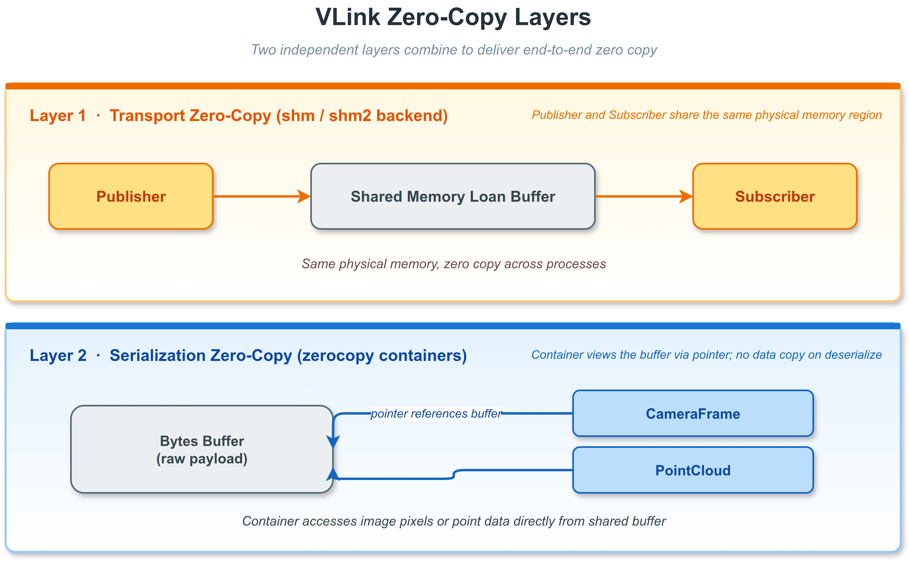
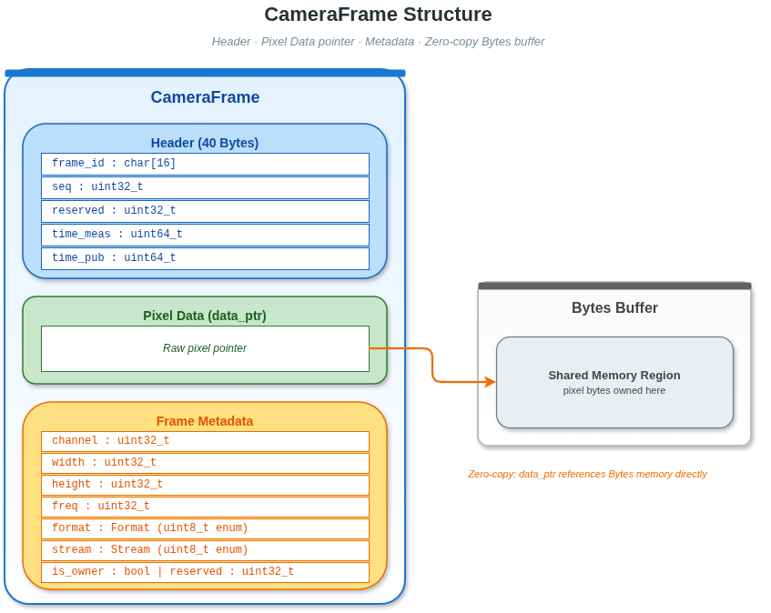
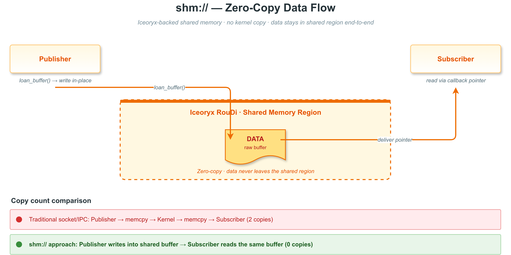

# 10. 零拷贝与数据容器

## 10.1 概述



VLink 的零拷贝能力分布在两个正交的层次：

1. **传输层零拷贝（loan）**：`shm://`（Iceoryx）和 `shm2://`（Iceoryx2）默认实现；
   `zenoh://` 在显式启用 SHM（`?shm=1` 或 `VLINK_ZENOH_SHM=1`）且编译期带
   `Z_FEATURE_SHARED_MEMORY` + `Z_FEATURE_UNSTABLE_API` 时也提供 loan 接口。
   Publisher 直接向共享内存池借出的缓冲区写数据，Subscriber 通过指针收到同一块内存。
   其他后端（`intra`、`dds`、`ddsc` 等）不支持 loan，`is_support_loan()` 返回 `false`。
2. **容器层零拷贝（zerocopy 结构体）**：`vlink::zerocopy` 命名空间下的 5 个结构体
   （`RawData`、`CameraFrame`、`PointCloud`、`ProxyData`、`Header`）支持"借用"语义——
   反序列化时内部指针直接指向 `Bytes` 缓冲区，不复制负载数据。

两个层次可独立或组合使用：同一个 `CameraFrame` 可以通过 `shm://` 做双层零拷贝，
也可以通过 `dds://` 做单层（仅容器反序列化借用）。

> 相关文档：
> - 序列化类型与零拷贝的关系：[06-serialization.md](06-serialization.md)（`kStandardPtrType`、`kFlatPtrType`）
> - shm/shm2 的传输配置：[07-transport.md](07-transport.md)
> - `Bytes` 的 API：[11-base-library.md](11-base-library.md)

### 10.1.1 适用场景

| 场景                    | 推荐方案                                    |
| ----------------------- | ------------------------------------------- |
| 进程间相机帧传输        | `CameraFrame` + `shm://` 后端               |
| 进程间激光雷达点云传输  | `PointCloud` + `shm://` 后端                |
| 网络传输相机帧          | `CameraFrame` + `dds://` / `ddsc://` 后端   |
| 自定义二进制数据        | `RawData` + 任意后端                        |
| 代理路由消息            | `ProxyData`（proxy 层内部使用）             |

---

## 10.2 Header 结构体

头文件：`include/vlink/zerocopy/header.h`

`Header` 是 40 字节 POD，嵌入在 `RawData`、`CameraFrame`、`PointCloud` 中作为
公有成员 `header`。`ProxyData` 不包含 `Header`（它有自己的控制字段）。
结构体声明为 `VLINK_EXPORT_AND_ALIGNED(8)`，64 位平台通过 `static_assert` 校验
`sizeof(Header) == 40`。

### 10.2.1 内存布局与字段

| 偏移 | 大小 | 字段       | 类型        | 说明                                               |
| ---- | ---- | ---------- | ----------- | -------------------------------------------------- |
|  0   | 16   | `frame_id` | `char[16]`  | 帧标识符字符串，默认 `"unknown"`                   |
| 16   |  4   | `seq`      | `uint32_t`  | 单调递增序列号，绕回 `UINT32_MAX`                  |
| 20   |  4   | `reserved` | `uint32_t`  | 保留，须置 0                                       |
| 24   |  8   | `time_meas`| `uint64_t`  | 采集时间戳（纳秒，自 epoch）                       |
| 32   |  8   | `time_pub` | `uint64_t`  | 发布时间戳（纳秒，自 epoch）                       |

### 10.2.2 双时间戳用途

- `time_pub - time_meas`：从传感器采集到发布出去的处理延迟。
- 订阅端接收时间 - `time_pub`：传输延迟。

```cpp
vlink::zerocopy::Header hdr;
hdr.seq = frame_counter++;
std::strncpy(hdr.frame_id, "cam_front", sizeof(hdr.frame_id) - 1);
hdr.time_meas = capture_timestamp_ns;                             // 相机曝光时刻
hdr.time_pub  = vlink::MessageLoop::get_current_nano_time();      // 当前发布时刻
```

---

## 10.3 RawData 类

头文件：`include/vlink/zerocopy/raw_data.h`

`RawData` 是最简单的零拷贝容器，封装非类型化字节缓冲区加一个 `Header` 和一个
16 位 `reserved_buf`。64 位平台 `sizeof(RawData) == 64`。

### 10.3.1 三种内存所有权模式

| 模式         | 创建方式                  | `is_owner()` | 析构时行为   |
| ------------ | ------------------------- | ------------ | ------------ |
| 拥有         | `create(size)`            | `true`       | 释放 `data_` |
| 借用外部指针 | `shallow_copy(ptr, size)` | `false`      | 不释放       |
| 反序列化借用 | `operator<<(bytes)`       | `false`      | 不释放       |

### 10.3.2 线缆格式

```
[ magic_begin (4) | RawData 结构体 (64) | payload (N) | magic_end (4) ]
```

魔数 `0x98B7F11A` / `0x98B7F11F`。`check_valid(bytes)` 用于接收端验证。

### 10.3.3 核心方法

| 方法                              | 说明                                              |
| --------------------------------- | ------------------------------------------------- |
| `create(size)`                    | 分配 size 字节的拥有缓冲区                        |
| `shallow_copy(ptr, size)`         | 借用外部指针，不复制                              |
| `shallow_copy(other)`             | 借用另一个 RawData 的缓冲区                       |
| `deep_copy(ptr, size)`            | 深拷贝：分配并复制数据                            |
| `deep_copy(other)`                | 深拷贝另一个 RawData                              |
| `move_copy(other)`                | 转移所有权，other 变为空                          |
| `fill_data(ptr, size)`            | `deep_copy(ptr, size)` 的别名                     |
| `operator>>(bytes)`               | 序列化为 Bytes（含魔数+结构体+payload）           |
| `operator<<(bytes)`               | 零拷贝反序列化（data 指针指向 bytes 内部）        |
| `check_valid(bytes)`              | 静态方法：验证 Bytes 是否为有效 RawData 格式      |
| `get_serialized_size()`           | 返回序列化后的总字节数                            |
| `is_valid()`                      | data 非空且 size > 0 时返回 true                  |
| `is_owner()`                      | 是否拥有当前缓冲区                                |
| `data()`                          | 返回 payload 的只读指针                           |
| `size()`                          | 返回 payload 字节数                               |
| `reserved_buf()`                  | 返回用户可用的 16 位预留字段引用                  |
| `clear()`                         | 释放拥有的缓冲区，归零所有字段                    |

### 10.3.4 使用示例

```cpp
#include <vlink/zerocopy/raw_data.h>
#include <vlink/base/bytes.h>

// 分配并填充
vlink::zerocopy::RawData rd;
rd.header.seq      = 1;
rd.header.time_pub = vlink::MessageLoop::get_current_nano_time();
rd.create(1024);
std::memcpy(const_cast<uint8_t*>(rd.data()), source_buffer, 1024);

// 序列化
vlink::Bytes wire;
rd >> wire;

// 零拷贝反序列化
vlink::zerocopy::RawData rd2;
if (rd2 << wire) {
    // rd2.data() 指向 wire 内部，无内存拷贝
    process(rd2.data(), rd2.size());
}

// 借用外部缓冲区
uint8_t extern_buf[512];
vlink::zerocopy::RawData rd3;
rd3.header.seq = 2;
rd3.shallow_copy(extern_buf, sizeof(extern_buf));
// rd3 不拥有 extern_buf，extern_buf 必须比 rd3 生命周期更长
```

---

## 10.4 CameraFrame 类



头文件：`include/vlink/zerocopy/camera_frame.h`

`CameraFrame` 为图像帧传输设计，携带分辨率、格式、通道号、采集频率等元数据，
以及像素数据缓冲区。64 位平台 `sizeof(CameraFrame) == 80`。所有权规则与 `RawData` 相同。

### 10.4.1 支持的像素格式

| 枚举值                | 数值 | 说明                                   |
| --------------------- | ---- | -------------------------------------- |
| `kFormatUnknown`      |  0   | 未知格式                               |
| `kFormatYuv420`       |  1   | 平面 YUV 4:2:0（I420）                 |
| `kFormatYuv422`       |  2   | 平面 YUV 4:2:2                         |
| `kFormatYuv444`       |  3   | 平面 YUV 4:4:4                         |
| `kFormatNv12`         |  4   | 半平面 YUV 4:2:0（Y + UV 交错）        |
| `kFormatNv21`         |  5   | 半平面 YUV 4:2:0（Y + VU 交错）        |
| `kFormatYuyv`         |  6   | 紧凑 YUYV 4:2:2                        |
| `kFormatYvyu`         |  7   | 紧凑 YVYU 4:2:2                        |
| `kFormatUyvy`         |  8   | 紧凑 UYVY 4:2:2                        |
| `kFormatVyuy`         |  9   | 紧凑 VYUY 4:2:2                        |
| `kFormatBgr888Packed` | 10   | 紧凑 24 位 BGR（3 字节/像素）          |
| `kFormatRgb888Packed` | 11   | 紧凑 24 位 RGB（3 字节/像素）          |
| `kFormatRgb888Planar` | 12   | 平面 24 位 RGB（独立 R、G、B 平面）    |
| `kFormatJpeg`         | 101  | JPEG 压缩                              |
| `kFormatH264`         | 102  | H.264 / AVC 压缩视频帧                 |
| `kFormatH265`         | 103  | H.265 / HEVC 压缩视频帧                |

### 10.4.2 视频流帧类型

| 枚举值          | 说明                     |
| --------------- | ------------------------ |
| `kStreamUnknown`| 未知帧类型               |
| `kStreamI`      | I 帧（关键帧，自包含）   |
| `kStreamP`      | P 帧（参考前帧的预测帧） |
| `kStreamB`      | B 帧（双向预测帧）       |

### 10.4.3 核心方法

| 方法/字段                    | 说明                                      |
| ---------------------------- | ----------------------------------------- |
| `header`                     | `Header` 结构体，包含序列号和时间戳       |
| `set_channel(ch)` / `channel()`    | 相机通道（传感器索引）              |
| `set_width(w)` / `width()`         | 图像宽度（像素）                    |
| `set_height(h)` / `height()`       | 图像高度（像素）                    |
| `set_freq(f)` / `freq()`           | 采集频率（Hz）                      |
| `set_format(f)` / `format()`       | 像素/编码格式                       |
| `set_stream(s)` / `stream()`       | 视频流帧类型（仅 H264/H265 有效）   |
| `create(size)`                     | 分配 size 字节的像素缓冲区          |
| `shallow_copy(ptr, size)`          | 借用外部像素指针                    |
| `deep_copy(ptr, size)`             | 深拷贝像素数据                      |
| `fill_data(ptr, size)`             | `deep_copy(ptr, size)` 的别名       |
| `shallow_copy(other)`              | 借用另一帧的缓冲区                  |
| `deep_copy(other)`                 | 深拷贝另一帧                        |
| `move_copy(other)`                 | 转移所有权                          |
| `operator>>(bytes)`                | 序列化为 Bytes                      |
| `operator<<(bytes)`                | 零拷贝反序列化                      |
| `check_valid(bytes)`               | 验证 Bytes 是否为有效 CameraFrame   |
| `get_serialized_size()`            | 返回序列化后总字节数                |
| `is_valid()`                       | data 非空且 size > 0                |
| `is_owner()`                       | 是否拥有像素缓冲区                  |
| `data()`                           | 只读像素数据指针                    |
| `size()`                           | 像素数据字节数                      |
| `clear()`                          | 释放缓冲区，归零所有字段            |

### 10.4.4 各格式像素大小计算

```cpp
// NV12：宽 * 高 * 3 / 2
size_t nv12_size = width * height * 3 / 2;

// RGB888 打包：宽 * 高 * 3
size_t rgb_size  = width * height * 3;

// JPEG/H264/H265：动态大小，由编码器决定
```

### 10.4.5 线缆格式（Wire Format）

```
[ magic_begin (4) | CameraFrame 结构体 (80) | 像素数据 (N) | magic_end (4) ]
```

---

## 10.5 PointCloud 类

头文件：`include/vlink/zerocopy/point_cloud.h`

`PointCloud` 带 schema 描述的点云容器。Schema 用两个 `uint64_t`
（`size_num`、`type_num`）以 nibble（4 位）方式紧凑编码每个字段的字节大小和类型，
再加一段逗号分隔的字段名（最长 160 字节，字段数 3~16）。
64 位平台 `sizeof(PointCloud) == 256`。

### 10.5.1 支持的字段类型

| 枚举值         | C++ 类型  | 字节数 |
| -------------- | --------- | ------ |
| `kUnknownType` | —         | —      |
| `kBoolType`    | `bool`    | 1      |
| `kInt8Type`    | `int8_t`  | 1      |
| `kUint8Type`   | `uint8_t` | 1      |
| `kInt16Type`   | `int16_t` | 2      |
| `kUint16Type`  | `uint16_t`| 2      |
| `kInt32Type`   | `int32_t` | 4      |
| `kUint32Type`  | `uint32_t`| 4      |
| `kInt64Type`   | `int64_t` | 8      |
| `kUint64Type`  | `uint64_t`| 8      |
| `kFloatType`   | `float`   | 4      |
| `kDoubleType`  | `double`  | 8      |

### 10.5.2 Schema 编码原理

```
size_num 的每个 nibble（4 位）编码一个字段的字节大小：
  0x04 = 4 字节（float/int32），0x08 = 8 字节（double/int64），等等

type_num 的每个 nibble 编码 Type 枚举值：
  0x0A = kFloatType(10)，0x0B = kDoubleType(11)，等等

名称字段存储逗号分隔字符串："x,y,z,intensity"
```

### 10.5.3 Key 和 KeyMap

```cpp
struct Key final {
    std::string name;            // 字段名，如 "x"、"intensity"
    uint8_t     type{kUnknownType};  // Type 枚举值
    uint8_t     size{0};             // 字段字节大小
};

using KeyMap  = std::unordered_map<std::string, uint16_t>;  // 名称 -> 字节偏移
using KeyList = std::vector<Key>;                           // 有序字段列表
```

### 10.5.4 辅助向量类型

```cpp
// 单精度 3D 向量（12 字节，4 字节对齐）
struct Vector3f final {
    float x{0};
    float y{0};
    float z{0};
};
// sizeof(Vector3f) == 12

// 双精度 3D 向量（24 字节，8 字节对齐）
struct Vector3d final {
    double x{0};
    double y{0};
    double z{0};
};
// sizeof(Vector3d) == 24
```

`PointCloud` 同时提供 `float` 和 `double` 版本的辅助方法（`create_v3f` / `create_v3d`、`push_value_v3f` / `push_value_v3d`、`get_value_v3f` / `get_value_v3d`），根据精度需求选择。

### 10.5.5 核心方法

| 方法                                        | 说明                                         |
| ------------------------------------------- | -------------------------------------------- |
| `header`                                    | Header 结构体                                |
| `create<T...>(size, names)`                 | 模板创建，自动推导 Schema（3~16 类型参数）   |
| `create_v3f<ExtraT...>(size, names)`        | 创建 XYZ float + 可选附加字段的点云          |
| `create_v3d<ExtraT...>(size, names)`        | 创建 XYZ double + 可选附加字段的点云         |
| `resize(size)`                              | 重置点数（清空数据，保留 Schema）            |
| `push_value_v3f(x, y, z, extras...)`        | 追加一个 v3f 格式的点                        |
| `push_value_v3d(x, y, z, extras...)`        | 追加一个 v3d 格式的点                        |
| `set_value(index, T... args)`               | 按顺序写入第 index 个点的所有字段（变参模板）|
| `get_value<T>(index, key_map, name)`        | 按字段名读取第 index 个点的某字段            |
| `get_value_v3f(index)`                      | 读取第 index 个点的 XYZ 坐标（返回 Vector3f）|
| `get_value_v3d(index)`                      | 读取第 index 个点的 XYZ 坐标（返回 Vector3d）|
| `get_key_map(key_list*=nullptr)`            | 返回 名称->字节偏移 的映射                   |
| `size()`                                    | 返回当前点数                                 |
| `pack_size()`                               | 返回单点字节大小                             |
| `get_internal_data()`                       | 只读点数据指针（`const uint8_t*`）           |
| `get_serialized_size()`                     | 序列化总字节数（magic + 结构体 + 数据 + magic）|
| `is_owner()`                                | 是否拥有数据缓冲区                           |
| `is_valid()`                                | 数据非空且 Schema 有效                       |
| `operator>>(bytes)`                         | 序列化为 Bytes                               |
| `operator<<(bytes)`                         | 零拷贝反序列化                               |
| `check_valid(bytes)`                        | 验证 Bytes 格式                              |
| `shallow_copy(other)` / `deep_copy(other)`  | 借用/深拷贝                                  |
| `move_copy(other)`                          | 转移所有权                                   |
| `clear()`                                   | 释放并归零                                   |

### 10.5.6 线缆格式（Wire Format）

```
[ magic_begin (4) | PointCloud 结构体 (256) | 点数据 (size * pack_size) | magic_end (4) ]
```

---

## 10.6 ProxyData 类

头文件：`include/vlink/zerocopy/proxy_data.h`

`ProxyData` 是 VLink 代理层内部使用的路由信封，将序列化的消息负载与路由上下文
（URL、序列化类型、`schema` family、源主机名）和控制字段（控制 ID、模式、时间戳、序列号）打包
为单次内存分配。在 64 位平台上结构体固定为 **80 字节**。

### 10.6.1 内部布局

```
[尾部缓冲区] = [ raw 数据 | url 字符串 | ser_type 字符串 | hostname 字符串 ]
```

每个区域的位置和长度以 `uint32_t` 字段存储在结构体内，反序列化后通过
`std::string_view` 零拷贝访问，不额外分配。

### 10.6.2 核心方法

| 方法                                           | 说明                              |
| ---------------------------------------------- | --------------------------------- |
| `create(raw, url, ser, schema=0, hostname={})` | 一次性打包 payload 与全部路由字段（`schema` 为 `uint32_t`，对应 `SchemaType` 数值；`hostname` 默认为空字符串） |
| `control_id()` / `set_control_id(id)`          | 代理控制标识符                    |
| `mode()` / `set_mode(mode)`                    | 代理操作模式                      |
| `timestamp()` / `set_timestamp(ts)`            | 消息时间戳（微秒）                |
| `seq()` / `set_seq(seq)`                       | 消息序列号                        |
| `schema()` / `set_schema(schema)`              | 粗粒度 schema family              |
| `raw()`                                        | 原始消息负载（浅拷贝 Bytes）      |
| `url()`                                        | topic URL（string_view）          |
| `ser()`                                        | 序列化类型（string_view）         |
| `hostname()`                                   | 源主机名（string_view）           |
| `operator>>(bytes)` / `operator<<(bytes)`      | 序列化/零拷贝反序列化             |
| `check_valid(bytes)`                           | 格式验证                          |
| `is_valid()`                                   | 内部区域一致性检查                |

> 注意：`ProxyData` 主要供 VLink 内部代理层使用，普通应用开发一般不需要直接操作此类。

---

## 10.7 与普通 Bytes 传输的区别

### 10.7.1 数据流对比

```
CameraFrame 传输（shm 后端 + loan）：
  像素数据 -> loan 缓冲区（共享内存）-> publish 指针 -> 订阅端回调直接访问
  -> 回调返回时自动 unloan

CameraFrame 传输（dds 后端）：
  像素数据 -> operator>> 序列化写入网络缓冲区 -> 网络 ->
  operator<< 借用 Bytes 内部指针 -> 用户回调
```

### 10.7.2 关键区别汇总

| 比较维度           | `Bytes` 传输                 | `CameraFrame` / `PointCloud`  |
| ------------------ | ---------------------------- | ----------------------------- |
| 元数据             | 无                           | 宽/高/格式/时间戳/序列号等    |
| 反序列化内存拷贝   | 有（`Bytes` 深拷贝）         | 无（借用指针）                |
| shm 零拷贝支持     | 是                           | 是                            |
| 格式验证           | 无                           | 魔数校验                      |
| 跨语言互操作       | 需协议约定                   | 内置 Schema（PointCloud）     |
| 适用场景           | 通用，小消息                 | 传感器大负载数据              |

---

## 10.8 shm/shm2 后端的 loan 机制



### 10.8.1 loan 的前置条件

`Node::is_support_loan()` 在 `shm://`（Iceoryx）和 `shm2://`（Iceoryx2）下无条件返回 `true`；
`zenoh://` 仅当 SHM 显式启用（`?shm=1` / `zenoh.shm=1` / `VLINK_ZENOH_SHM=1`）、
构建带 `Z_FEATURE_SHARED_MEMORY` + `Z_FEATURE_UNSTABLE_API`、且 SHM provider 已就绪时返回 `true`，
此时 `loan(size)` 在 `size >= zenoh.shm_loan_threshold`（默认 `8K`）时走 Zenoh SHM，
否则回退到普通堆 `Bytes::create(size)`（仍可正常 publish，只是不享受零拷贝）。
其他后端（`intra`、`dds`、`ddsc`、`ddsr`、`ddst`、`someip`、`fdbus`、`qnx`、`mqtt`）的
`is_support_loan()` 始终返回 `false`，此时 `loan()` 返回空 `Bytes`。

### 10.8.2 发布端使用 loan

```cpp
vlink::Publisher<vlink::Bytes> pub("shm://camera/raw");
pub.wait_for_subscribers();

if (pub.is_support_loan()) {
    vlink::Bytes buf = pub.loan(1920 * 1080 * 3 / 2);  // NV12
    if (!buf.empty()) {
        camera_driver_fill(buf.data(), buf.size());  // 直接写入共享内存
        pub.publish(buf);                             // 自动归还 loan
    }
}
```

若 `publish()` 未被调用，调用方必须显式 `pub.return_loan(buf)`，否则共享内存池会
耗尽。

### 10.8.3 手动 unloan（接收端）

默认情况下 `Subscriber` 回调返回后自动归还 loan。若要在回调外继续持有数据指针，
启用手动 unloan 模式：

```cpp
vlink::Subscriber<vlink::Bytes> sub("shm://camera/raw");
sub.set_manual_unloan(true);

sub.listen([&](const vlink::Bytes& msg) {
    // 在回调返回前必须手动归还，否则内存池会被占满
    process(msg);
    sub.return_loan(msg);
});
```

---

## 10.9 内存所有权与生命周期管理

### 10.9.1 所有权规则

所有 zerocopy 容器遵循统一所有权模型，通过 `is_owner()` 区分：

| 创建方式                 | `is_owner()`  | 析构时行为   |
| ------------------------ | ------------- | ------------ |
| `create(size)`           | `true`        | 释放 `data_` |
| `shallow_copy(ptr,size)` | `false`       | 不释放       |
| `shallow_copy(other)`    | `false`       | 不释放       |
| `deep_copy(...)`         | `true`        | 释放 `data_` |
| `move_copy(other)`       | 继承 other    | 取决于 other |
| `operator<<(bytes)`      | `false`       | 不释放       |

`shallow_copy(const T&)` 返回 `false` 仅当 `this == &target`（自拷贝）。
`shallow_copy(uint8_t*, size_t)` 返回 `false` 当 `data == nullptr`、
`size == 0` 或新指针与当前 `data_` 完全相同。

### 10.9.2 生命周期注意事项

**规则 1：借用模式下，源对象必须比容器生命周期更长**

```cpp
// 错误示例：bytes 先于 rd2 析构
{
    vlink::Bytes bytes;
    vlink::zerocopy::RawData rd;
    // ... 填充 rd ...
    rd >> bytes;

    vlink::zerocopy::RawData rd2;
    rd2 << bytes;     // rd2 借用 bytes 内部指针
    // bytes 在此析构 -> rd2.data() 成为悬空指针！
}

// 正确做法：确保 bytes 生命周期包含 rd2
vlink::Bytes bytes;
vlink::zerocopy::RawData rd2;
// ... bytes 赋值 ...
rd2 << bytes;
process(rd2);  // bytes 在此仍存活
```

**规则 2：移动后源对象不可使用**

```cpp
vlink::zerocopy::CameraFrame src;
src.create(1920 * 1080 * 3 / 2);

vlink::zerocopy::CameraFrame dst;
dst.move_copy(src);    // 所有权转移

// src 现在为空，不可访问 src.data()
assert(!src.is_valid());
assert(dst.is_valid());
```

**规则 3：浅拷贝（shallow_copy）会复制 Header**

`shallow_copy(other)` 只借用数据指针（不拷贝实际数据），**但会复制 Header 字段**（序列号、时间戳等元数据）。
数据指针指向源对象的缓冲区，因此源对象必须比浅拷贝对象存活更久。
若需要独立的数据缓冲区和 Header，使用 `deep_copy()` 后再修改。

**规则 4：回调内不要保存对 loan 缓冲区的引用**

```cpp
// 危险：在回调外保存指向共享内存的指针
const uint8_t* dangerous_ptr = nullptr;

sub.listen([&](const vlink::Bytes& msg) {
    dangerous_ptr = msg.data();  // 危险！回调返回后共享内存可能被回收
    return;
});

// dangerous_ptr 现在可能是悬空指针
```

---

## 10.10 完整使用示例

### 10.10.1 示例 1：相机帧传输（shm 后端零拷贝）

```cpp
#include <vlink/publisher.h>
#include <vlink/subscriber.h>
#include <vlink/zerocopy/camera_frame.h>
#include <vlink/extension/qos_profile.h>

#include <iostream>
#include <thread>
#include <chrono>
#include <cstring>

using namespace std::chrono_literals;

// 发布端（模拟相机驱动）
void camera_publisher_thread() {
    vlink::Publisher<vlink::zerocopy::CameraFrame> pub("shm://camera/front");
    pub.wait_for_subscribers();

    uint32_t seq = 0;
    const uint32_t W = 1920;
    const uint32_t H = 1080;
    const size_t frame_size = W * H * 3 / 2;  // NV12

    while (true) {
        vlink::zerocopy::CameraFrame frame;
        frame.header.seq       = seq++;
        frame.header.time_meas = vlink::MessageLoop::get_current_nano_time();  // 模拟采集时间戳
        frame.header.time_pub  = vlink::MessageLoop::get_current_nano_time();

        frame.set_channel(0);
        frame.set_width(W);
        frame.set_height(H);
        frame.set_freq(30);
        frame.set_format(vlink::zerocopy::CameraFrame::kFormatNv12);

        // 分配并填充像素数据
        frame.create(frame_size);
        // 模拟相机驱动填充数据
        std::memset(const_cast<uint8_t*>(frame.data()), seq % 256, frame_size);

        pub.publish(frame);

        std::this_thread::sleep_for(33ms);  // ~30 Hz
    }
}

// 订阅端（图像处理节点）
void camera_subscriber_thread() {
    vlink::Subscriber<vlink::zerocopy::CameraFrame> sub("shm://camera/front");

    sub.listen([](const vlink::zerocopy::CameraFrame& frame) {
        if (!frame.is_valid()) {
            return;
        }

        std::cout << "Frame seq=" << frame.header.seq
                  << " size=" << frame.width() << "x" << frame.height()
                  << " format=" << static_cast<int>(frame.format())
                  << " data_size=" << frame.size() << " bytes"
                  << std::endl;

        // 直接处理像素数据（shm 后端下为零拷贝）
        const uint8_t* y_plane  = frame.data();
        const uint8_t* uv_plane = frame.data() + frame.width() * frame.height();

        // 进行图像处理...
    });

    std::this_thread::sleep_for(5s);
}

int main() {
    std::thread pub_thread(camera_publisher_thread);
    std::thread sub_thread(camera_subscriber_thread);

    pub_thread.join();
    sub_thread.join();
    return 0;
}
```

### 10.10.2 示例 2：点云传输（float XYZ + intensity）

```cpp
#include <vlink/publisher.h>
#include <vlink/subscriber.h>
#include <vlink/zerocopy/point_cloud.h>
#include <vlink/extension/qos_profile.h>

#include <iostream>
#include <random>

// 发布端
void lidar_publisher() {
    vlink::Publisher<vlink::zerocopy::PointCloud> pub("shm://lidar/points");
    pub.wait_for_subscribers();

    std::mt19937 rng(42);
    std::uniform_real_distribution<float> dist(-50.0f, 50.0f);

    uint32_t seq = 0;

    while (true) {
        const int point_count = 100000;  // 10 万点

        vlink::zerocopy::PointCloud pc;
        pc.header.seq      = seq++;
        pc.header.time_pub = vlink::MessageLoop::get_current_nano_time();

        // 创建带 intensity 的 XYZ 点云 Schema
        pc.create_v3f<float>(point_count, {"intensity"});

        // 追加点（高效 push 模式）
        for (int i = 0; i < point_count; ++i) {
            float x = dist(rng);
            float y = dist(rng);
            float z = dist(rng) / 10.0f;         // 高度范围较小
            float intensity = (std::abs(z) + 1.0f);

            pc.push_value_v3f(x, y, z, intensity);
        }

        std::cout << "Publishing " << pc.size() << " points, "
                  << pc.size() * pc.pack_size() << " bytes" << std::endl;

        pub.publish(pc);

        std::this_thread::sleep_for(std::chrono::milliseconds(100));  // 10 Hz
    }
}

// 订阅端
void lidar_subscriber() {
    vlink::Subscriber<vlink::zerocopy::PointCloud> sub("shm://lidar/points");

    sub.listen([](const vlink::zerocopy::PointCloud& pc) {
        if (!pc.is_valid()) {
            return;
        }

        std::cout << "Received seq=" << pc.header.seq
                  << " points=" << pc.size()
                  << " pack_size=" << pc.pack_size() << " bytes/point"
                  << std::endl;

        // 获取字段偏移表（一次计算，重复使用）
        auto key_map = pc.get_key_map();

        // 遍历前 5 个点
        for (size_t i = 0; i < std::min<size_t>(5, pc.size()); ++i) {
            auto xyz = pc.get_value_v3f(i);
            float intensity = pc.get_value<float>(i, key_map, "intensity");

            std::cout << "  point[" << i << "]: "
                      << "x=" << xyz.x
                      << " y=" << xyz.y
                      << " z=" << xyz.z
                      << " intensity=" << intensity
                      << std::endl;
        }
    });

    std::this_thread::sleep_for(std::chrono::seconds(10));
}
```

### 10.10.3 示例 3：RawData 跨进程传输

```cpp
#include <vlink/publisher.h>
#include <vlink/subscriber.h>
#include <vlink/zerocopy/raw_data.h>

// 发布端：将自定义二进制协议数据发送给其他进程
int main_publisher() {
    vlink::Publisher<vlink::zerocopy::RawData> pub("shm://custom/protocol");
    pub.wait_for_subscribers();

    // 构造数据
    struct MyProtocol {
        uint32_t cmd;
        uint32_t flags;
        float    payload[256];
    };

    vlink::zerocopy::RawData rd;
    rd.header.seq = 1;
    rd.header.time_pub = vlink::MessageLoop::get_current_nano_time();
    rd.create(sizeof(MyProtocol));

    // 在缓冲区中构造协议包
    auto* proto = reinterpret_cast<MyProtocol*>(const_cast<uint8_t*>(rd.data()));
    proto->cmd   = 0x1001;
    proto->flags = 0x0001;
    proto->payload[0] = 3.14f;

    pub.publish(rd);
    return 0;
}

// 订阅端
int main_subscriber() {
    vlink::Subscriber<vlink::zerocopy::RawData> sub("shm://custom/protocol");

    sub.listen([](const vlink::zerocopy::RawData& rd) {
        if (!rd.is_valid()) {
            return;
        }

        struct MyProtocol {
            uint32_t cmd;
            uint32_t flags;
            float    payload[256];
        };

        if (rd.size() < sizeof(MyProtocol)) {
            return;
        }

        const auto* proto = reinterpret_cast<const MyProtocol*>(rd.data());
        std::cout << "cmd=0x" << std::hex << proto->cmd
                  << " payload[0]=" << proto->payload[0] << std::endl;
    });

    std::this_thread::sleep_for(std::chrono::seconds(5));
    return 0;
}
```

### 10.10.4 示例 4：序列化与反序列化（网络传输场景）

```cpp
#include <vlink/zerocopy/camera_frame.h>
#include <vlink/base/bytes.h>

// 网络传输场景：先序列化为 Bytes，通过 dds 发送，接收端零拷贝反序列化

int main() {
    // 创建帧
    vlink::zerocopy::CameraFrame tx_frame;
    tx_frame.set_width(640);
    tx_frame.set_height(480);
    tx_frame.set_format(vlink::zerocopy::CameraFrame::kFormatRgb888Packed);
    tx_frame.create(640 * 480 * 3);

    // 填充测试像素
    std::memset(const_cast<uint8_t*>(tx_frame.data()), 0xFF, tx_frame.size());

    // 序列化（将发送给远端）
    vlink::Bytes wire;
    tx_frame >> wire;
    std::cout << "Serialized size: " << wire.size() << " bytes" << std::endl;

    // 接收端：零拷贝反序列化
    if (vlink::zerocopy::CameraFrame::check_valid(wire)) {
        vlink::zerocopy::CameraFrame rx_frame;
        if (rx_frame << wire) {
            // rx_frame.data() 直接指向 wire 内部，无 memcpy
            std::cout << "Received: " << rx_frame.width() << "x" << rx_frame.height()
                      << " format=" << static_cast<int>(rx_frame.format())
                      << " is_owner=" << rx_frame.is_owner()  // 输出 false
                      << std::endl;

            // wire 必须在 rx_frame 使用期间保持有效
            process_frame(rx_frame);
        }
    }

    return 0;
}
```

### 10.10.5 示例 5：H.264 视频流传输

```cpp
#include <vlink/publisher.h>
#include <vlink/subscriber.h>
#include <vlink/zerocopy/camera_frame.h>

// H.264 编码帧发布
void h264_publisher(const uint8_t* nal_data, size_t nal_size, bool is_keyframe) {
    static vlink::Publisher<vlink::zerocopy::CameraFrame> pub("dds://video/h264");
    static bool initialized = false;

    if (!initialized) {
        pub.wait_for_subscribers();
        initialized = true;
    }

    vlink::zerocopy::CameraFrame frame;
    frame.header.time_pub = vlink::MessageLoop::get_current_nano_time();
    frame.set_width(1920);
    frame.set_height(1080);
    frame.set_format(vlink::zerocopy::CameraFrame::kFormatH264);
    frame.set_stream(is_keyframe
                     ? vlink::zerocopy::CameraFrame::kStreamI
                     : vlink::zerocopy::CameraFrame::kStreamP);

    // 借用编码器输出缓冲区（零拷贝）
    frame.shallow_copy(const_cast<uint8_t*>(nal_data), nal_size);

    pub.publish(frame);
}

// H.264 解码端
void setup_h264_subscriber() {
    static vlink::Subscriber<vlink::zerocopy::CameraFrame> sub("dds://video/h264");
    sub.listen([](const vlink::zerocopy::CameraFrame& frame) {
        if (frame.format() != vlink::zerocopy::CameraFrame::kFormatH264) {
            return;
        }

        bool is_keyframe = (frame.stream() == vlink::zerocopy::CameraFrame::kStreamI);
        decode_h264_nal(frame.data(), frame.size(), is_keyframe);
    });
}
```
