# 11. 基础库

VLink 的 `base` 基础库提供了一套轻量、高性能的底层工具集，供通信核心与上层应用共同使用。
除 Coroutine 组件依赖 C++20 协程支持外，其余组件以 C++17 为基线，无第三方强制依赖，可独立集成。

**相关文档：**

- Bytes 在序列化系统中的角色请参阅 [序列化](06-serialization.md) 中的 Bytes 章节
- MessageLoop 在通信回调中的使用请参阅 [Event 模型](03-event-model.md) 和 [Method 模型](04-method-model.md)
- QoS `Additions::Priority` 与 MessageLoop 优先级的关系请参阅 [QoS 配置指南](08-qos.md)
- CpuProfiler 与通信节点的集成请参阅 [Node 生命周期](02-node-lifecycle.md)

---

## 11.1 组件总览

| 组件              | 头文件                          | 功能简述                                       |
| ----------------- | ------------------------------- | ---------------------------------------------- |
| Logger            | `base/logger.h`                 | 全局单例日志器，四种输出风格，可插拔后端       |
| LoggerPlugin      | `base/logger_plugin_interface.h`| 自定义日志后端的纯虚接口，与 Plugin 系统配合   |
| Bytes             | `base/bytes.h`                  | 128 字节固定大小缓冲区，SBO + 五种所有权       |
| MemoryPool        | `base/memory_pool.h`            | 分级（金字塔）free-list 内存池，Bytes 默认分配器 |
| MemoryResource    | `base/memory_resource.h`        | `std::pmr::memory_resource` 适配器，桥接 `MemoryPool` |
| Function          | `base/functional.h`             | 类型擦除可调用包装器，可配置 SBO（默认 64 字节）+ `MemoryPool` 堆回退 |
| LargeFunction     | `base/functional.h`             | `Function<Sig, 256>` 别名，256 字节 SBO 用于重型闭包 |
| MoveFunction      | `base/functional.h`             | 移动专属类型擦除包装器，对应 C++23 `std::move_only_function` |
| LargeMoveFunction | `base/functional.h`             | `MoveFunction<Sig, 256>` 别名 |
| ConditionVariable | `base/condition_variable.h`     | POSIX `CLOCK_MONOTONIC` 条件变量，替代 std 实现 |
| MessageLoop       | `base/message_loop.h`           | 单线程事件循环，集成定时器与优先级队列         |
| Timer             | `base/timer.h`                  | 事件循环驱动的周期/单次定时器                  |
| WheelTimer        | `base/wheel_timer.h`            | 哈希时间轮，O(1) 插入/删除大量超时             |
| ElapsedTimer      | `base/elapsed_timer.h`          | 高精度计时，支持墙钟和 CPU 活跃时间            |
| DeadlineTimer     | `base/deadline_timer.h`         | 绝对截止时间的无锁超时检测                     |
| ThreadPool        | `base/thread_pool.h`            | 固定线程数的通用并行任务池                     |
| Process           | `base/process.h`                | 跨平台子进程管理，管道 I/O，异步回调           |
| MultiLoop         | `base/multi_loop.h`             | 多线程事件循环，继承 MessageLoop，并行执行      |
| MpmcQueue         | `base/mpmc_queue.h`             | 无锁有界 MPMC 环形队列                         |
| ObjectPool        | `base/object_pool.h`            | 线程安全的通用对象池，RAII 自动归还            |
| SpinLock          | `base/spin_lock.h`              | 自适应自旋锁及 RAII 守卫                       |
| Semaphore         | `base/semaphore.h`              | 进程内计数信号量，支持超时                     |
| SysSemaphore      | `base/sys_semaphore.h`          | 跨进程命名计数信号量                           |
| SysSharemem       | `base/sys_sharemem.h`           | 跨进程命名共享内存区域                         |
| Schedule          | `base/schedule.h`               | 带延迟、优先级、超时的任务调度包装器           |
| GraphTask         | `base/graph_task.h`             | 有向无环图任务调度，支持条件分支               |
| TaskHandle        | `base/task_handle.h`            | `post_task_handle` 返回的句柄，支持取消/等待/状态查询 |
| PostTaskOptions   | `base/task_handle.h`            | `post_task_handle` 的可选项（cancellation/overflow/drop policy） |
| CancellationSource / Token / Registration | `base/cancellation.h` | 协作取消三件套（写端/读端/RAII 订阅） |
| OperationCancelled | `base/exception.h`             | 协作取消的规范化异常类型                       |
| Coroutine         | `base/coroutine.h`              | C++20 stackless 协程封装（`Task<T>` / `co_spawn` / `schedule` / `await_*` / `when_all/any` / `sequence`） |
| CpuProfiler       | `base/cpu_profiler.h`           | CPU 利用率分析器                               |
| CpuProfilerGuard  | `base/cpu_profiler_guard.h`     | CpuProfiler 的 RAII 自动守护                   |
| FastStream        | `base/fast_stream.h`            | 高性能输出流（Logger 内部引擎）                |
| Format            | `base/format.h`                 | 轻量无堆分配的 `{}` 占位符格式化器             |
| Utils             | `base/utils.h`                  | 平台无关的进程、线程、信号工具函数             |
| Helpers           | `base/helpers.h`                | 字符串/数字/哈希/格式化、文本字段转义等无状态工具函数 |
| Plugin            | `base/plugin.h`                 | 类型安全的动态插件加载器，含版本校验与生命周期 |
| Exception         | `base/exception.h`              | VLink 异常类型（封装标准异常层级）             |
| Uint128           | `base/uint128.h`                | 可移植 128 位无符号整数及完整运算符           |
| CachedTimestamp   | `base/cached_timestamp.h`       | 低开销线程安全的格式化时间戳生成器（Logger 内用） |
| NameDetector      | `base/name_detector.h`          | 编译期类型名/枚举名检测工具                    |
| Traits            | `base/traits.h`                 | 内部模板元编程类型萃取                         |
| Macros            | `base/macros.h`                 | 跨平台导出/对齐/分支预测等宏定义               |

---

## 11.2 日志系统 Logger

### 11.2.1 概述

`vlink::Logger` 是一个全局单例日志器，通过 `Logger::init()` 初始化，通过宏在任意位置写入日志。
它同时支持控制台 Sink 和文件 Sink，每个 Sink 可独立配置最低日志级别。

### 11.2.2 日志级别

| 值 | 枚举     | 用途                                      |
| -- | -------- | ----------------------------------------- |
| 0  | `kTrace` | 详细跟踪，用于排查内部逻辑                |
| 1  | `kDebug` | 开发调试信息                              |
| 2  | `kInfo`  | 正常运行信息                              |
| 3  | `kWarn`  | 异常但可恢复的情况                        |
| 4  | `kError` | 可恢复错误                                |
| 5  | `kFatal` | 写日志后抛出 `Exception::RuntimeError`   |
| 6  | `kOff`   | 关闭对应 Sink                             |

当消息级别 >= `kDetailLevel`（默认 `kWarn`）时，宏自动在消息前追加 `{filename:line}` 定位信息。

### 11.2.3 四种输出风格

| 风格           | 宏前缀   | 示例                    | 说明                                |
| -------------- | -------- | ----------------------- | ----------------------------------- |
| 流式（VLOG）   | `VLOG_I` | `VLOG_I("x=", x)`       | 使用 `FastStream`，零堆分配         |
| 格式化（MLOG） | `MLOG_I` | `MLOG_I("x={}", x)`     | 使用 VLink `format::format_to_n`    |
| C 风格（CLOG） | `CLOG_I` | `CLOG_I("x=%d", x)`     | 使用 `std::snprintf`                |
| RAII 流（SLOG）| `SLOG_I` | `SLOG_I << "x=" << x`   | `WrapperStream` 析构时自动提交      |

每种风格对应六个级别的短宏（`_T`/`_D`/`_I`/`_W`/`_E`/`_F`）。每条消息最大 4096 字节（`kLocalBufferSize`），超出将被截断。

### 11.2.4 编译期过滤

```cpp
// 在包含头文件之前定义，低于该级别的调用在编译期零开销消除
#define VLINK_LOG_LEVEL 2       // 只保留 Info 及以上
#define VLINK_LOG_DETAIL_LEVEL 3 // Warn 以上才附加文件行号

// 禁用短宏别名（VLOG_I 等），只保留 VLINK_LOG_I 形式
#define VLINK_LOG_DISABLE_SHORT
```

### 11.2.5 自定义后端

```cpp
// 注册自定义控制台处理器
vlink::Logger::register_console_handler(
    [](vlink::Logger::Level level, std::string_view msg) {
        my_console_output(level, msg);
    });

// 注册自定义文件处理器
vlink::Logger::register_file_handler(
    [](vlink::Logger::Level level, std::string_view msg) {
        my_file_output(level, msg);
    });
```

### 11.2.6 回溯环形缓冲区

```cpp
// 启用回溯，保留最后 100 条消息
vlink::Logger::enable_backtrace(100);

// 崩溃前刷出所有保留消息
vlink::Logger::dump_backtrace();

// 关闭回溯
vlink::Logger::disable_backtrace();
```

### 11.2.7 完整使用示例

```cpp
#include <vlink/base/logger.h>

int main() {
    // 初始化：程序名 + 日志文件路径（可选）
    vlink::Logger::init("my_app", "/var/log/my_app.log");

    // 仅将 Info 以上输出到控制台
    vlink::Logger::set_console_level(vlink::Logger::kInfo);
    // 文件记录 Debug 以上
    vlink::Logger::set_file_level(vlink::Logger::kDebug);

    int node_id = 42;
    double temp = 78.5;

    // 流式风格
    VLOG_I("node started, id=", node_id);

    // 格式化风格
    MLOG_W("temperature is {} C, threshold exceeded", temp);

    // C 风格
    CLOG_E("errno=%d msg=%s", errno, strerror(errno));

    // RAII 流风格（可跨行）
    SLOG_D << "values: " << node_id << " temp=" << temp;

    // Fatal 会抛出异常
    try {
        VLOG_F("unrecoverable condition: ", "disk full");
    } catch (const std::exception& e) {
        // e.what() 包含日志消息
    }

    return 0;
}
```

---

## 11.3 字节缓冲区 Bytes

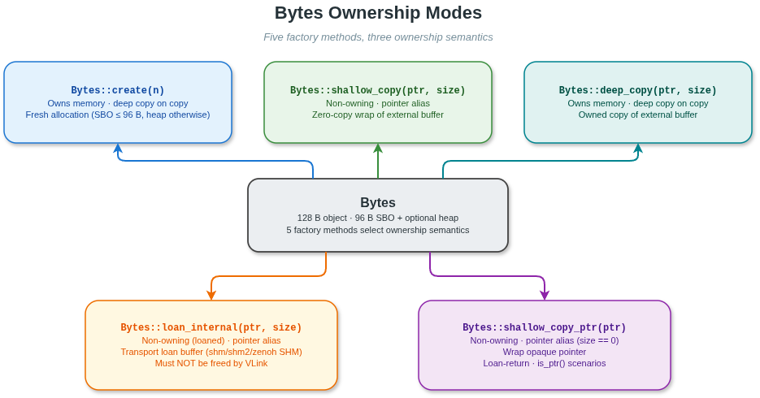

### 11.3.1 概述

`vlink::Bytes` 是 VLink 的核心数据载体，总大小固定为 **128 字节**。
96 字节以内的数据直接存储在对象内部（小缓冲优化 SBO），无需堆分配。
超出部分从内存池或系统堆分配。

### 11.3.2 所有权模型

| 创建方式                | 拥有内存 | 复制行为   | 典型用途                          |
| ----------------------- | -------- | ---------- | --------------------------------- |
| `Bytes::create(n)`      | 是       | 深拷贝     | 新建分配                          |
| `Bytes::shallow_copy()` | 否       | 指针别名   | 零拷贝包装外部缓冲区              |
| `Bytes::deep_copy()`    | 是       | 深拷贝     | 拥有外部数据的副本                |
| `Bytes::loan_internal()`| 否（借用）| 指针别名  | Iceoryx 零拷贝借用（shm 后端）   |
| `Bytes::shallow_copy_ptr()` | 否  | 指针别名   | 包装不透明指针（size == 0）       |

### 11.3.3 内存布局

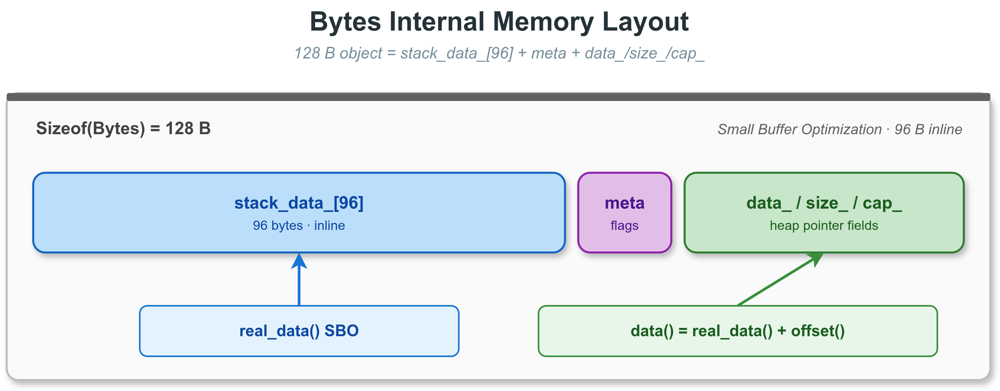

`offset` 字段为协议头预留前缀区域，`data()` = `real_data()` + `offset()`。

### 11.3.4 常用操作

```cpp
#include <vlink/base/bytes.h>

// 创建 64 字节缓冲区（<= 96，使用 SBO，无堆分配）
auto buf = vlink::Bytes::create(64);
std::memcpy(buf.data(), payload, 64);

// 创建带 8 字节前缀区的缓冲区（用于协议头）
auto buf2 = vlink::Bytes::create(100, /*offset=*/8);
// real_data() 指向原始起始，data() 偏移 8 字节

// 零拷贝包装外部只读缓冲区
auto view = vlink::Bytes::shallow_copy(ext_ptr, ext_size);
// view.is_owner() == false，不会释放 ext_ptr

// 深拷贝
auto owned = vlink::Bytes::deep_copy(ext_ptr, ext_size);
// owned.is_owner() == true

// 从 std::string 构造
auto str_buf = vlink::Bytes::from_string("hello world");

// 初始化列表构造
vlink::Bytes raw_bytes = {0x01, 0x02, 0x03, 0x04};

// 基本访问
uint8_t* p = buf.data();
size_t   n = buf.size();
bool is_owner = buf.is_owner();
bool is_empty = buf.empty();

// 迭代器（for 范围循环）
for (uint8_t byte : buf) {
    process(byte);
}

// 转换
std::string s = buf.to_string();
std::string_view sv = buf.to_string_view();
std::vector<uint8_t> v = buf.to_raw_data();

// 调整大小
buf.resize(128);    // 如需扩容则重新分配
buf.shrink_to(32);  // 仅缩减逻辑大小，不重新分配

// 清空（释放所有权内存）
buf.clear();
```

### 11.3.5 压缩支持（LZAV）

```cpp
// 压缩（使用 LZAV 算法）
auto compressed = vlink::Bytes::compress_data(raw.data(), raw.size());

// 检测是否已压缩（校验 4 字节头部魔数 + 4 字节尾部魔数）
if (vlink::Bytes::is_compress_data(compressed.data(), compressed.size())) {
    auto original = vlink::Bytes::uncompress_data(
        compressed.data(), compressed.size());
}

// 高压缩比模式（更慢）
auto hi_compressed = vlink::Bytes::compress_data(raw.data(), raw.size(),
                                                  /*high_ratio=*/true);
```

> `compress_data()` 对输入大小上限为 `kMaxCompressCacheSize`（1 MiB），
> 超出会返回空 `Bytes`。

### 11.3.6 工具函数

```cpp
// Base64 编解码
std::string b64 = vlink::Bytes::encode_to_base64(buf);
auto decoded = vlink::Bytes::decode_from_base64(b64);

// CRC-32 校验（CRC-32/ISO-HDLC，与 ZIP / gzip / PNG / Ethernet 一致）
uint32_t crc32 = vlink::Bytes::get_crc_32(buf);

// CRC-64 校验（CRC-64/ECMA-182）
uint64_t crc64 = vlink::Bytes::get_crc_64(buf);

// Hex 字符串
std::string hex = vlink::Bytes::convert_to_hex_str(buf.data(), buf.size());

// 字节序反转
auto reversed = vlink::Bytes::reverse_order(buf);

// 内存池（统一走 vlink::MemoryPool，详见 11.4）
vlink::Bytes::init_memory_pool();        // 应用启动时调用一次
vlink::Bytes::release_memory_pool();     // 周期性 trim：仅释放完全空闲的 chunk，
                                         // 含 live block 的 chunk 保留，
                                         // 可与并发 Bytes API 调用安全交错
```

---

## 11.4 内存池 MemoryPool

### 11.4.1 概述

`vlink::MemoryPool`（`base/memory_pool.h`）是一个分级（金字塔）的 free-list
内存池，所有路径自包含、无外部依赖。`Bytes` 通过它分配堆缓冲。

### 11.4.2 分级 Tier 模型

每个 tier 保存 `{max_size, blocks_per_chunk}`：

- `max_size`：该 tier 可服务的最大字节数（含上界）。allocate 请求按从小到大
  顺序匹配第一个 `max_size >= bytes` 的 tier。
- `blocks_per_chunk`：单个 upstream chunk 内最多容纳的 block 数。chunk 增长几何
  倍数（首块 1 个 block，逐次翻倍直到 `blocks_per_chunk` 上限）。

请求大于最大 tier 的 `max_size`（典型如 4K RGBA 帧）或 `alignment >
alignof(std::max_align_t)` 时走 oversized 直通路径，直接 `::operator new` /
`::operator delete`，不进入池，但仍会被独立计数。

### 11.4.3 默认 Tier 表与 VLINK_MEMORY_LEVEL

`MemoryPool::get_default_config()` 返回 19 阶金字塔配置（tier 大小为 `32B /
64B / 128B / 256B / 512B / 1KB / 2KB / 4KB / 8KB / 16KB / 32KB / 64KB / 128KB /
256KB / 512KB / 1MB / 4MB / 8MB / 16MB`，覆盖 Function/MoveFunction 及
Bytes 的常见尺寸），由环境变量 `VLINK_MEMORY_LEVEL`（`0`..`9`，默认 `3`）
从一张编译期常量表中按行索引。`1..9` 渐进激活大 tier 并增加尾部 block 数：`1` 把
`1MB / 4MB / 8MB / 16MB` 全部留为 sentinel；`2` 启用 `1MB`；
`4` 起激活 `4MB`（**L3 默认不激活 4MB**，让 4K 帧走 oversized 直通以节省常驻
内存）；`5` 起激活 `8MB`；`6` 起激活 `16MB`。每级内 `blocks_per_chunk`
从最小档 `32B` 起严格减半，倍增小档（`32B..256KB`，14 档）共享相等字节预算；
`32B` 头档的块数是 `64B` 档的 **两倍**，用于吸纳高密度微小分配；
尾部 `1MB..16MB` 各档激活时块数为 `1`（L4 的 4MB 起步为 `2`），
之后每升一级翻倍。

| Level | 风格      | 满载占用 (≈) | 适用场景                                                                              |
| ----- | --------- | ------------ | ------------------------------------------------------------------------------------- |
| `0`   | Bypass    | 0 MiB        | 完全不走池：每次 `allocate` 直接 `::operator new`、每次 `deallocate` 直接 `::operator delete`。oversized 计数照常增长，所有 tier 计数为 0 |
| `1`   | Tiny      | 4 MiB        | 端侧/嵌入式：仅小/中 tier 生效，`1MB / 4MB / 8MB / 16MB` 大 tier 全部 sentinel        |
| `2`   | Small     | 8.5 MiB      | 受限设备：启用 `1MB` tier，仍保留 `4MB / 8MB / 16MB` sentinel                          |
| `3`   | Balanced  | 16 MiB       | **默认**：仅到 `1MB` tier，`4MB+` 全部走 oversized 直通（4K 帧不常驻）                  |
| `4`   | Large     | 42 MiB       | 服务器/高吞吐：初步引入 `4MB` tier（2 个 block）                                        |
| `5`   | XLarge    | 92 MiB       | 大批量小消息：初步引入 `8MB` tier（1 个 block）                                         |
| `6`   | Massive   | 200 MiB      | 重 IO/视频流：初步引入 `16MB` tier（1 个 block）                                        |
| `7`   | Heavy     | 264 MiB      | 长时间高负载：尾部 block 进一步增加                                                    |
| `8`   | Saturate  | 528 MiB      | 接近饱和的多生产者场景：大 tier 块数全部翻倍                                            |
| `9`   | Peak      | 656 MiB      | 高吞吐峰值：尾部 block 进一步翻倍                                                       |

非数字、超出 `[0, 9]` 的取值会被钳到合法区间，并打印 warning。

设置 `VLINK_MEMORY_PREALLOC=1` 时，`get_default_config()` 返回的 `Config` 会
带上 `prealloc=true`，构造函数据此为每个 tier 一次性预分配满额
`blocks_per_chunk` 的 chunk（best-effort）；其它值或未设置保持懒加载。
该变量同样仅在首次构造全局池时读取。

### 11.4.4 主要 API

```cpp
namespace vlink {

class MemoryPool final {
 public:
  struct Tier final { size_t max_size{0}; size_t blocks_per_chunk{0}; };
  struct Config final { std::vector<Tier> tiers; bool prealloc{false}; };
  struct TierStats final { /* max_size, block_size, hit_count, ... */ };
  struct OversizedStats final { /* alloc_count, alloc_bytes, dealloc_count */ };

  // 进程级共享单例。
  //   use_env_level=true（默认）：按 VLINK_MEMORY_LEVEL / VLINK_MEMORY_PREALLOC 配置。
  //   use_env_level=false：使用 level-3 默认金字塔，不读环境变量、不预分配。
  // 仅首次调用决定配置；之后调用忽略 use_env_level，返回同一实例。
  // Bytes::init_memory_pool() 内部就是 MemoryPool::global_instance(true)。
  static MemoryPool& global_instance(bool use_env_level = true);

  // 当前 VLINK_MEMORY_LEVEL / VLINK_MEMORY_PREALLOC 对应的 Config。
  [[nodiscard]] static Config get_default_config();

  // 显式 Config（tiers + prealloc）：
  //   空 tiers = bypass 模式（每次直通 ::operator new / delete）。
  //   非空但格式非法（max_size==0 / 非严格递增 / max_size < sizeof(FreeNode) /
  //     tiers.size() > kMaxTierCount）= 回退到 level-3 默认金字塔，并打 error。
  //   blocks_per_chunk==0 是合法 sentinel（构造期跳过该档，不触发回退）；
  //     若所有档都是 sentinel，等价于 bypass 模式。
  //   prealloc=true 时构造期为每个 tier 预分配满额 blocks_per_chunk 的 chunk（best-effort）。
  //   构造不抛异常（vector 增长例外）。
  explicit MemoryPool(const Config& config);

  // 无参构造 = bypass（等价 MemoryPool(Config{})）。
  MemoryPool();

  // 按 level 从内置 10 行 tier 表（L0..L9，L0 是空哨兵 = bypass）取一行。
  // 越界值钳到 [0, 9]。L9 满载占用 ≈ 656 MiB。
  explicit MemoryPool(int level, bool prealloc = false);

  // 块默认对齐，等价于 alignof(std::max_align_t)，作为 allocate/deallocate
  // 的 alignment 参数默认值。
  static constexpr size_t kBlockAlignment = alignof(std::max_align_t);

  // 路由到首个 max_size >= bytes 的 tier；超出最大 tier、对齐过严
  // (alignment > kBlockAlignment)，或池是 bypass 模式时走直通路径。失败返回
  // nullptr，永不抛异常。
  [[nodiscard]] void* allocate(size_t bytes,
                               size_t alignment = kBlockAlignment) noexcept;

  // 必须传与 allocate 相同的 bytes/alignment，否则会路由到错误 tier 损坏
  // free-list。
  void deallocate(void* p, size_t bytes,
                  size_t alignment = kBlockAlignment) noexcept;

  // 统计快照
  [[nodiscard]] size_t get_tier_count() const noexcept;   // bypass 时为 0
  [[nodiscard]] std::vector<TierStats> get_stats() const noexcept;
  [[nodiscard]] OversizedStats get_oversized_stats() const noexcept;
  void reset_stats() noexcept;

  // 释放完全空闲的 chunk；保留任何还含 live block 的 chunk 以及它们的
  // free 节点。可与并发 allocate/deallocate 安全交错。
  void clear() noexcept;
  void trim()  noexcept;   // alias of clear()，语义更直观（"trim 掉空闲缓存"）
};

}  // namespace vlink
```

### 11.4.5 使用示例

```cpp
#include <vlink/base/memory_pool.h>

// 1) 用于 Bytes（推荐）：应用启动时调用一次
vlink::Bytes::init_memory_pool();   // 等价 MemoryPool::global_instance(true)

// 2) 直接使用全局池
auto& pool = vlink::MemoryPool::global_instance();
void* p = pool.allocate(512);       // 落到 1 KiB 以内的 tier
pool.deallocate(p, 512);            // bytes 必须严格匹配

// 3) 自定义 Config（tier 数组 + 可选预分配）
vlink::MemoryPool::Config cfg;
cfg.tiers = {
    {64U,    256U},
    {1024U,  64U},
    {64U * 1024U, 8U},
};
cfg.prealloc = true;                    // 构造期为每个 tier 预分配满额 blocks_per_chunk
vlink::MemoryPool local_pool(cfg);

// 3a) 按 level 直接构造（等价 get_default_config 的某一行）
vlink::MemoryPool level5_pool(5);

// 3b) Bypass 模式：无参构造 / level=0 都直通 ::operator new
vlink::MemoryPool bypass_pool;          // 或 vlink::MemoryPool bypass_pool(0);

// 4) 查看统计
for (const auto& s : pool.get_stats()) {
    MLOG_I("tier max={} block={} hits={}", s.max_size, s.block_size, s.hit_count);
}
auto over = pool.get_oversized_stats();
MLOG_I("oversized: count={} bytes={}", over.alloc_count, over.alloc_bytes);
```

### 11.4.6 线程安全与生命周期

- 所有 public 方法 `noexcept`，可从多线程并发调用。锁粒度是 per-tier，因此不
  同 size class 之间不互相竞争。
- `global_instance()` 是 Meyers' singleton，进程生命周期内持续存在；想要在运行
  期释放上游 chunk，对全局池调用 `clear()`（或 `Bytes::release_memory_pool()`）
  即可——它**仅**释放完全空闲的 chunk，含 live block 的 chunk 与对应 free 节
  点保留，可与并发 `allocate` / `deallocate` 安全交错。析构期的全量释放仍只能
  通过销毁本地 `MemoryPool` 实例完成（销毁前必须确保所有 block 已归还）。
- `deallocate` 必须传入与 `allocate` 相同的 `bytes`，否则会路由到错误 tier，
  破坏该 tier 的 free-list。

### 11.4.7 与 Bytes 的关系

```
Bytes::create() / bytes_malloc()
   |
   v
MemoryPool::global_instance().allocate(size)
   |
   +-- size <= 最大 tier 的 max_size --> 命中某 tier 的 free-list
   |
   +-- 否则                              --> ::operator new 直通路径
```

调用 `Bytes::init_memory_pool()` 只是**显式地**触发首次构造（带
`use_env_level=true` 让池读取 `VLINK_MEMORY_LEVEL`）。如果不显式调用，首次
`Bytes` 堆分配也会触发懒加载，但此时取的是 level-3 默认值，不再读环境变量。

---

## 11.5 PMR 适配器 MemoryResource

`vlink::MemoryResource`（`base/memory_resource.h`）是 `std::pmr::memory_resource`
的适配器，让任何 pmr-aware 容器（`std::pmr::vector`、`std::pmr::string`、
`std::pmr::polymorphic_allocator<T>` 等）通过 `vlink::MemoryPool` 完成底层字节
分配。该类不带 `final`，可被继承。

### 11.5.1 主要 API

```cpp
namespace vlink {

class MemoryResource : public std::pmr::memory_resource {
 public:
  // 嵌套 Deleter：MemoryResource::make_unique 返回的 unique_ptr 持有它。
  // 持一份 polymorphic_allocator 拷贝，sizeof(Deleter<T>) == sizeof(void*)。
  template <typename T>
  struct Deleter final {
    std::pmr::polymorphic_allocator<T> alloc;
    void operator()(T* p) const noexcept;
  };

  // 进程级共享 resource，包装 MemoryPool::global_instance()。
  // 该 resource 不持有底层池；与 Bytes 共享同一个全局池。
  // use_env_level 默认 true，仅首次调用生效。
  static MemoryResource& global_instance(bool use_env_level = true);

  // 拥有自己的私有池，按 Config 构造（tiers + prealloc）。
  // 空 tiers = bypass。语义同 MemoryPool 构造函数。
  explicit MemoryResource(const MemoryPool::Config& config);

  // 无参构造 = bypass。
  MemoryResource();

  // 拥有自己的私有池，按 level 构造。level=0 = bypass。
  // prealloc=true 时按 level 对应的 tier 表预填满每个 tier。
  explicit MemoryResource(int level, bool prealloc = false);

  ~MemoryResource() override;   // 私有池在此销毁；global_instance 是 no-op

  // 直接拿到底层池，可调用 get_stats / clear / trim 等。
  [[nodiscard]] MemoryPool& get_memory_pool() noexcept;

  // 等同于 get_memory_pool().trim()。
  // 仅释放完全空闲的 chunk，活跃分配不受影响；可与 allocate/deallocate 并发。
  void trim() noexcept;

  // 工厂：std::allocate_shared 走 global_instance()，对象与控制块同一次池分配。
  template <typename T, typename... Args>
  static std::shared_ptr<T> make_shared(Args&&... args);

  // 工厂：make_unique 走 global_instance()。注意返回的是
  // unique_ptr<T, Deleter<T>>，不能隐式转为普通 unique_ptr<T>。
  // 若 T 的构造函数抛异常，已分配的存储会被归还到池。
  template <typename T, typename... Args>
  static std::unique_ptr<T, Deleter<T>> make_unique(Args&&... args);
};

// 当 <memory_resource> 不可用时（旧 stdlib），整个 MemoryResource 类不可见，
// 只在 vlink::MemoryResource 命名空间下提供 make_shared / make_unique 退化版本，
// 直接转发到 std::make_shared / std::make_unique；此时 make_unique 返回
// 普通 unique_ptr<T>。

}  // namespace vlink
```

### 11.5.2 使用示例

```cpp
#include <memory_resource>

#include <vlink/base/memory_resource.h>

// 1) 进程级共享 resource：与 Bytes 共用同一个全局池。
std::pmr::vector<int> v(&vlink::MemoryResource::global_instance());
v.reserve(1024);                                    // 经全局 MemoryPool 分配

// 2) 私有 resource，level=3 默认金字塔。
vlink::MemoryResource res(3);
std::pmr::polymorphic_allocator<char> alloc(&res);
std::pmr::string s(alloc);

// 3) 私有 resource，自定义 Config。
vlink::MemoryPool::Config cfg;
cfg.tiers = {{64, 16}, {1024, 4}};
cfg.prealloc = true;
vlink::MemoryResource custom(cfg);
std::pmr::vector<double> w(&custom);

// 4) Bypass：无参构造拥有一个 bypass 私有池。
vlink::MemoryResource bypass;
std::pmr::vector<int> b(&bypass);       // 每次直通 ::operator new

// 5) 工厂入口：替代 std::make_shared / std::make_unique，对象与控制块同次
//    池分配。base/impl 内部热路径（coroutine、message_loop、task_handle、
//    client::async_invoke 的 promise 等）都已迁移到这里。
struct State { int x; };
auto sp = vlink::MemoryResource::make_shared<State>(/*x=*/42);
auto up = vlink::MemoryResource::make_unique<State>(/*x=*/7);
// up 类型是 std::unique_ptr<State, vlink::MemoryResource::Deleter<State>>，
// 不可隐式转为 std::unique_ptr<State>。
```

### 11.5.3 语义与生命周期

- `do_allocate` 在底层池返回 `nullptr` 时抛 `std::bad_alloc`（pmr 契约要求）；
  其余路径不抛异常。底层 `MemoryPool::allocate` 本身永不抛。
- `do_is_equal` 当且仅当两个 resource 指向**同一个底层 `MemoryPool` 对象**时
  返回 `true`。两个分别用相同 tier 数组构造的私有 resource 拥有各自的私有
  池，因此不相等。
- `global_instance()` 返回的 resource 仅是全局池的别名（不拥有），析构时不
  释放底层池；其他构造路径产生的 resource 在析构时同时销毁自己拥有的池。
- `MemoryResource` 不可拷贝、不可移动，与 `std::pmr::memory_resource` 契约
  一致。

---

## 11.6 类型擦除可调用包装器 Function

`vlink::Function<ReturnT(ArgsT...), SboSizeT = 64>`（`base/functional.h`）是
`std::function` 的高性能替代品，针对 VLink 热路径（消息回调、定时器、线程池任
务等）做了四处关键调优：

- **可配置 SBO**：`kSboSize = SboSizeT`，默认 64 字节（一行缓存），足以容纳
  常见的捕获集合（若干 `shared_ptr`、几个指针、若干小型 POD），命中后整个对
  象保留在 inline 缓冲区内，零堆分配。需要承载更重的闭包时通过第二个非类型
  模板参数选大档：`Function<Sig, 256>` 或别名 `LargeFunction<Sig>`，把 256
  字节以下的 functor 全部留在内联区。`SboSizeT` 必须 `>= sizeof(void*)`（堆
  路径要在存储里塞 `FunctorT*`），否则 `static_assert` 拒绝。
- **`MemoryPool` 堆回退**：当目标 `sizeof` 超过 `SboSizeT`、或 `alignof` 超过
  `alignof(std::max_align_t)`、或移动构造可能抛异常时，存储改为从
  `vlink::MemoryPool::global_instance()` 分配，并在析构时归还到同一池。**全程
  不调用全局 `operator new` / `operator delete`**，与 `Bytes` 共享分级 free-list
  的复用收益。
- **`std::function` 互转**：转换构造接受任何满足 `is_invocable_r` 的可调用对
  象，`std::function ⇄ vlink::Function` 双向都可隐式构造（无需显式 `cast`）。
- **类型隔离**：不同 `SboSizeT` 是不同类型——`Function<Sig, 64>` 与
  `Function<Sig, 256>` 的类型身份不同；但二者可以通过通用 callable 路径互相
  构造和赋值，赋值时会把源 wrapper 当作普通 callable 再包裹一层（多一层
  vtable 间接，少见时不必担心）。

### 11.6.1 平台开关

`functional.h` 顶部使用 `VLINK_ENABLE_BASE_FUNCTIONAL` 决定启用哪条实现路径：

- **所有平台默认启用**：`functional.h` 在该宏未定义时自行 `#define`（见
  `include/vlink/base/functional.h:130-132`），因此 Linux / macOS / Windows
  / QNX / Android 等所有目标都使用 VLink 自实现的 SBO + `MemoryPool` 回退路
  径。VLink 当前 CMake 构建系统**不**对该宏做平台条件赋值。
- **当前没有命令行 opt-out**：由于 `functional.h` 会在宏未定义时立即自定义
  `VLINK_ENABLE_BASE_FUNCTIONAL`，编译命令行 `-UVLINK_ENABLE_BASE_FUNCTIONAL`
  不能让该头文件退化到标准库别名路径。文件末尾保留的标准库 alias 分支不是
  当前公开的下游开关；若未来需要支持 opt-out，应先增加显式禁用宏或调整头文件
  的选择逻辑。

### 11.6.2 主要 API

```cpp
namespace vlink {

template <typename SignatureT, size_t SboSizeT = 64U>
class Function;                                     // 主模板未定义，仅特化

template <typename ReturnT, typename... ArgsT, size_t SboSizeT>
class Function<ReturnT(ArgsT...), SboSizeT> {
 public:
  static constexpr size_t kSboSize = SboSizeT;      // 与模板实参等价
  using result_type = ReturnT;

  Function() noexcept = default;                    // 空
  Function(std::nullptr_t) noexcept;                // 空
  Function(const Function&);                        // 复制目标的拷贝构造
  Function(Function&&) noexcept;                    // 偷取并清空对方

  template <typename FunctorT /* 可调用且可拷贝 */>
  Function(FunctorT&& f);                                  // 来自任意兼容可调用对象

  Function& operator=(const Function&);
  Function& operator=(Function&&) noexcept;
  Function& operator=(std::nullptr_t) noexcept;     // reset 为空

  template <typename FunctorT /* 可调用且可拷贝 */>
  Function& operator=(FunctorT&& f);                       // 直接从任意兼容可调用对象赋值

  ReturnT operator()(ArgsT...) const;                      // 空时抛 std::bad_function_call
  explicit operator bool() const noexcept;          // 是否持有目标

  void swap(Function& other) noexcept;

#if defined(__cpp_rtti)
  const std::type_info& target_type() const noexcept;
  template <typename FunctorT> FunctorT*       target() noexcept;
  template <typename FunctorT> const FunctorT* target() const noexcept;
#endif
};

template <typename SignatureT>
using LargeFunction = Function<SignatureT, 256U>;   // 256 字节 SBO 别名

}  // namespace vlink
```

### 11.6.3 性能与内存

| 路径   | 触发条件                                                  | 调用开销           |
| ------ | --------------------------------------------------------- | ------------------ |
| Inline | `sizeof(FunctorT) ≤ SboSizeT` 且 `alignof(FunctorT) ≤ max_align_t` 且移动 noexcept | 1 次间接调用       |
| Heap   | 不满足 inline 条件                                        | 1 次间接调用 + 1 次额外加载 |

- 调用开销恒定为通过 vtable 的 1 次间接 call；inline 路径无额外指针追逐，
  heap 路径在调用前多 1 次加载读取目标指针。
- vtable 是按 `FunctorT` 静态生成的链接期单例，4 个函数指针：`invoke / copy_construct /
  move_construct / destroy`。
- heap 路径在 `allocate` 时记录 `sizeof(FunctorT)` 与 `alignof(FunctorT)`，析构时按相同参数
  归还，确保命中正确的池 tier。
- 拷贝/移动具备强异常安全：抛异常时已分配内存归还、`*this` 维持上一个一致状
  态。

### 11.6.4 与 std::function 对齐的语义

- `ReturnT operator()(ArgsT...) const` 在空时抛 `std::bad_function_call`。
- 转换构造要求目标可拷贝构造（`std::function` 同样要求），`move-only` 仿函数
  在编译期被拒绝。
- 函数指针 / 成员指针目标若为 `nullptr`，得到一个空 `Function`，不分配、不安
  装 vtable。
- `ReturnT == void` 时静默丢弃目标返回值（与 `std::function` 一致）。

### 11.6.5 使用示例

```cpp
#include <vlink/base/functional.h>

vlink::Function<int(int, int)> add = [](int a, int b) { return a + b; };
int x = add(1, 2);                                  // 3

vlink::Function<void()> noop;                       // 空
if (noop) { noop(); }                               // 跳过，不抛

vlink::Function<void()> heavy = [big_capture]() {   // 大捕获 → 池回退
  // ...
};

// 256 字节 SBO（让 200 字节级别的闭包留在内联）：
vlink::Function<void(), 256> jumbo = [arr = std::array<int, 50>{}]() {
  // sizeof 约 200 字节，在默认 64B SBO 下走堆，在 256B SBO 下留 inline。
};

// 等价的便捷别名：
vlink::LargeFunction<void()> alias_jumbo = std::move(jumbo);

// std::function 双向互转：
std::function<void(int)> stdfn = [](int x) { /* ... */ };
vlink::Function<void(int)> wrapped = stdfn;          // 包装 std::function
std::function<void(int)> back     = wrapped;         // 解包到 std::function
```

### 11.6.6 在 VLink 中的使用位置

`vlink::Function` 在事件、方法、字段三种通信模型中作为公共回调载体，典型公共别名
包括 `Subscriber<T>::MsgCallback / Client<...>::RespCallback / Server<...>::ReqCallback /
ReqRespCallback / ReqAsyncRespCallback / Getter<T>::MsgCallback / WheelTimer::Callback /
Process::ErrorCallback / FinishedCallback / ReadyReadCallback / StateChangedCallback`
等。这些场景因为 lock-then-copy snapshot、`std::map` 返回-by-value、`const&` 遍
历或公共模板 ABI 等约束，承载方必须可拷贝，统一以 `Function` 表达。其余热路径
回调（定时器、线程池、Schedule、GraphTask、BagWriter / BagReader、Security、
ObjectPool 工厂/重置等）由 `vlink::MoveFunction` 承载（详见 §11.4.3）。两者共同
覆盖框架内部所有回调类型，避免热路径上对全局 `operator new` 的依赖。

---

## 11.7 移动专属可调用包装器 MoveFunction

`vlink::MoveFunction<ReturnT(ArgsT...), SboSizeT = 64>`（`base/functional.h`）是
C++23 `std::move_only_function` 的 VLink 等价物：与 `Function` 共享同一份可配
置 SBO + `MemoryPool` 堆回退基础设施，但放宽了对目标的拷贝可构造要求，**接受
move-only 可调用对象**（捕获了 `std::unique_ptr` 的 lambda、`std::packaged_task`
等），并且 `MoveFunction` 自身也是 move-only。需要更大 SBO 时同样使用
`MoveFunction<Sig, 256>` 或别名 `LargeMoveFunction<Sig>`。

适用场景：

- `std::packaged_task<ReturnT()>` 等本身 move-only 的目标，可直接以
  `[t = std::move(task)]() mutable { t(); }` 的形式塞入 `MoveFunction`，
  避免 `shared_ptr<packaged_task>` 桥接层带来的额外堆分配 + 原子 refcount。
- 捕获 `unique_ptr` / `promise` / 大块 move-only buffer 的 lambda。
- 设计上明确不需要拷贝、希望在编译期约束生命周期的回调。

### 11.7.1 主要 API

```cpp
namespace vlink {

template <typename SignatureT, size_t SboSizeT = 64U>
class MoveFunction;                                       // 主模板未定义，仅特化

template <typename ReturnT, typename... ArgsT, size_t SboSizeT>
class MoveFunction<ReturnT(ArgsT...), SboSizeT> {
 public:
  static constexpr size_t kSboSize = SboSizeT;            // 与模板实参等价
  using result_type = ReturnT;

  MoveFunction() noexcept = default;                    // 空
  MoveFunction(std::nullptr_t) noexcept;                // 空
  MoveFunction(const MoveFunction&) = delete;           // 禁拷贝
  MoveFunction& operator=(const MoveFunction&) = delete;
  MoveFunction(MoveFunction&&) noexcept;                // 偷取并清空对方
  MoveFunction& operator=(MoveFunction&&) noexcept;

  template <typename FunctorT /* 可调用且 move-constructible */>
  MoveFunction(FunctorT&& f);                                  // 来自任意兼容可调用对象

  MoveFunction& operator=(std::nullptr_t) noexcept;
  template <typename FunctorT> MoveFunction& operator=(FunctorT&& f);

  ReturnT operator()(ArgsT...);                                // 非 const！空时抛 std::bad_function_call
  explicit operator bool() const noexcept;
  void swap(MoveFunction& other) noexcept;

#if defined(__cpp_rtti)
  const std::type_info& target_type() const noexcept;
  template <typename FunctorT> FunctorT*       target() noexcept;
  template <typename FunctorT> const FunctorT* target() const noexcept;
#endif
};

template <typename SignatureT>
using LargeMoveFunction = MoveFunction<SignatureT, 256U>;  // 256 字节 SBO 别名

}  // namespace vlink
```

### 11.7.2 与 std::move_only_function 的差异

| 维度 | `std::move_only_function` (C++23) | `vlink::MoveFunction` |
| --- | --- | --- |
| 空对象调用 | 未定义行为 | 抛 `std::bad_function_call`（与 `vlink::Function` 一致，便于排错） |
| `target_type()` / `target<FunctorT>()` | 未提供 | 提供（受 `__cpp_rtti` 控制） |
| cv / ref / noexcept 限定签名 | 支持 | 仅特化 `ReturnT(ArgsT...)`；其他形式落入主模板 → 硬错误 |

### 11.7.3 隐式转换矩阵

| 来源 | 至 `vlink::MoveFunction<S>` | 备注 |
| --- | --- | --- |
| `vlink::Function<S>` 左值 | ✅ 复制 | `Function` 自身可拷贝 |
| `vlink::Function<S>` 右值 | ✅ 移动 | 推荐路径 |
| `std::function<S>` 左值 | ✅ 复制 | 同上 |
| `std::function<S>` 右值 | ✅ 移动 | |
| `std::move_only_function<S>` 右值 | ✅ 移动 | 仅在 `__cpp_lib_move_only_function` 可用时启用 |
| `std::move_only_function<S>` 左值 | ❌ | 源 move-only |
| `MoveFunction<OtherSig>` 右值 | ✅ 移动（再包一层）| 跨签名包裹会落到 heap，并增加一次间接调用，详见下注 |
| 任意 move-only 仿函数（左值） | ❌ | SFINAE 拒绝：`is_constructible_v<FunctorT, FunctorT&>` 为 false（等价于缺拷贝构造） |
| 任意 move-only 仿函数（右值） | ✅ 移动 | |
| 函数指针 / 成员指针 == nullptr | ✅ 得空 `MoveFunction` | 与 `Function` 一致 |
| 空源（任一 wrapper） | ✅ 得空 `MoveFunction` | 不分配、不安装 vtable |

| 至 | 来源 `MoveFunction<S>` | 备注 |
| --- | --- | --- |
| `std::move_only_function<S>` | ✅ 移动 | 通过标准库的转换构造，无需特殊钩子；但因 `sizeof(MoveFunction)` ≈ 72 字节（默认 64B SBO；`LargeMoveFunction` 则 ≈ 272 字节）超过 `std::move_only_function` 典型 SBO，落入其堆路径并多一次间接调用 |
| `vlink::Function<S>` | ❌ | `Function` 要求目标可拷贝，move-only 被 SFINAE 拒绝 |
| `std::function<S>` | ❌（编译错） | 标准要求目标可拷贝（Mandates） |

> **跨签名 / 跨包装的代价**：将一个非空的 `Function<A>` 或 `MoveFunction<A>`
> 包成 `MoveFunction<B>`，因为目标 wrapper 自身的 `sizeof` 通常已超过外层
> `MoveFunction<B>` 的 SBO（默认 64B SBO 时为 72 字节；放进 64B 内联区只能塞下 wrapper
> 本身的 8 字节 vtable 指针），落入 `MemoryPool` 堆路径，且每次调用经过
> **两层 vtable 间接调用**。能直接包装原始 callable 时优先直接包装；若必须跨
> 包装且需要避免堆，考虑 `LargeMoveFunction<B>`（256B SBO，可容纳 default
> `MoveFunction` wrapper）。

### 11.7.4 调用语义注意

- `operator()` 是 **非 const**，与 `std::move_only_function` 的默认签名一致；
  因此 `const MoveFunction<...>` 不能直接调用。如果需要 const 调用语义，请
  使用 `vlink::Function`。
- 移动后的 `MoveFunction` 处于空状态，再次调用会抛 `std::bad_function_call`。
- 重载集合中同时含 `f(Function<S>)` 与 `f(MoveFunction<S>)` 会对任何两侧都能
  匹配的可调用对象产生歧义（与 `std::function` ↔ `std::move_only_function`
  的情形相同），建议同一重载集合内只用一种类型。

### 11.7.5 典型用法

```cpp
#include <vlink/base/functional.h>

#include <future>
#include <memory>

// 1) 直接捕获 unique_ptr —— 替换原 shared_ptr 包装
auto big = std::make_unique<HeavyWork>(/* ... */);
vlink::MoveFunction<void()> task = [w = std::move(big)]() { w->run(); };

// 2) 包装 packaged_task，省去 shared_ptr 间接层
std::packaged_task<int()> pt([] { return 42; });
auto fut = pt.get_future();
vlink::MoveFunction<void()> cb = [t = std::move(pt)]() mutable { t(); };
cb();
int v = fut.get();    // 42

// 3) 从 vlink::Function 移入（适合一次性消费）
vlink::Function<int()> f = [] { return 7; };
vlink::MoveFunction<int()> mf = std::move(f);
```

### 11.7.6 在 VLink 中的使用位置

下表列出由 `MoveFunction` 承载的回调类型。其余回调因为 lock-then-copy
snapshot、map 返回-by-value、跨域 const-ref 遍历、模板下游可见性等约束需要可
拷贝语义，由 `Function` 承载。

| 域 | 回调类型 |
| --- | --- |
| `base/timer` | `Timer::Callback` |
| `base/logger` | `Logger::Callback` |
| `base/schedule` | `Schedule::Callback`, `RetCallback`, `CatchCallback` |
| `base/graph_task` | `GraphTask::Callback`, `ConditionCallback`, `StatusCallback`, `FindTaskCallback` |
| `base/utils` | `register_terminate_signal` / `register_crash_signal` / `start_detect_keyboard` 参数 |
| `base/message_loop` | `MessageLoop::Callback` |
| `base/thread_pool` | `ThreadPool::Callback` |
| `base/object_pool` | `ObjectPool<T>::FactoryCallback`, `ResetCallback` |
| `impl/ack_manager` | `AckManager::ProcessCallback`, `NotifyCallback` |
| `extension/security` | `Security::Callback` |
| `extension/bag_reader` | `OutputCallback`, `StatusCallback`, `ReadyCallback`, `FinishCallback` |
| `extension/bag_writer` | `SplitCallback`, `SchemaCallback` |
| `extension/bag_reader_processor`, `bag_reader_plugin_interface` | `OutputCallback` |
| `external/proxy_api` | `ConnectCallback`, `ErrorCallback`, `TimeCallback`, `InfoCallback`, `DataCallback` |

由此带来的设计取舍：

- `MessageLoop::invoke_task / invoke_task_with_priority` 与
  `ThreadPool::invoke_task` 直接以移动捕获包装 `std::packaged_task`，无需
  `std::shared_ptr<std::packaged_task>` 桥接，每次调用省一次 heap 分配 +
  一次原子 refcount。
- `Schedule::process_with_ret` 内部的 `run_with_timeout` 形参为非-const ref，
  外层 wrapper lambda 与 `Schedule::process` 中的适配 lambda 标 `mutable`。
- `GraphTask::process_and_traverse` 形参为 `FindTaskCallback&&`。

由 `Function` 承载的回调（出于真实 copy / 公共模板 / const-ref 遍历约束）：

- `WheelTimer::Callback`（`wheel_timer.cc` 重复 tick lvalue copy）。
- `Process::ErrorCallback / FinishedCallback / ReadyReadCallback / StateChangedCallback`
  （shared_lock 下 snapshot copy）。
- `dds_conf::find_type_support` 与 `type_support_map_`（`std::map` 返回-by-value）。
- `DiscoveryViewer::Callback`（lock-then-copy）。
- `NodeImpl::ConnectCallback / StatusCallback / ReqRespCallback / MsgCallback /
  IntraMsgCallback / SyncCallback`（`AbstractObject` 遍历用 `const&` + 各
  module factory 的 const-lambda 捕获 + setter_impl 转入 `ConnectCallback` 通道）。
- `Subscriber<T>::MsgCallback / Server<...>::ReqCallback / ReqRespCallback /
  ReqAsyncRespCallback / Client<...>::RespCallback / Getter<T>::MsgCallback`
  （`internal/*-inl.h` 的 const-lambda 捕获 + 公共模板 ABI 限制）。
- `AbstractFactory::Find*Callback`（const-ref 遍历约束）。

---

## 11.8 消息循环 MessageLoop

`vlink::MessageLoop` 是 VLink 中的核心任务调度器，也是定时器、Schedule 等机制的基础。
它实现了一个**单线程串行事件循环**：所有任务在同一个线程上顺序执行，
回调内部无需加锁即可安全访问共享状态。

### 11.8.1 核心概念

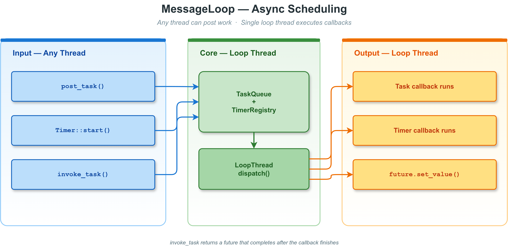

- **单线程串行**：所有投递到同一个 `MessageLoop` 的任务严格串行，不会并发。
- **线程安全投递**：`post_task()` 本身是线程安全的，可从任意线程调用。
- **集成定时器**：`Timer` attach 到 `MessageLoop` 后，定时回调与普通任务共用同一线程。
- **最大队列深度**：默认 10000（`kMaxTaskSize`）；队列满时由 `Strategy` 与 `TaskOverflowPolicy` 决定是重试、丢弃可丢任务、阻塞还是拒绝，只有拒绝路径会让 `post_task()` 返回 `false`。
- **最大定时器数**：默认 100（`kMaxTimerSize`），超出时 `Timer::attach()` 失败。

### 11.8.2 队列类型

| 类型（Type）     | 内部实现                                                       | 最大任务数 | 特点                        |
| ---------------- | -------------------------------------------------------------- | ---------- | --------------------------- |
| `kNormalType`    | mutex + `std::deque`（或 `std::pmr::deque`）                    | 10000      | 默认，FIFO 无优先级；可迭代支持 droppable 扫描 |
| `kLockfreeType`  | 无锁 `MpmcQueue`                                                | 10000      | 多生产者多消费者，竞争低     |
| `kPriorityType`  | 两个 `std::priority_queue`（按 drop 策略分桶），mutex 保护       | 10000      | 支持任务优先级，数值大先执行；`kProtected` 任务独立堆，不被 overflow drop |

### 11.8.3 入队策略（队列已满时）

`Strategy` 仅控制 `post_task` / `invoke_task` 在**有界队列已满**时的入队行为；空闲调度始终由条件变量驱动，与该枚举无关。

| 策略（Strategy）         | 队列已满时的行为                                            | 适用场景                   |
| ------------------------ | ----------------------------------------------------------- | -------------------------- |
| `kOptimizationStrategy`  | 以 1ms sleep 重试 10 次；仍满则丢弃最旧任务并入队新任务      | 默认，通用                 |
| `kPopStrategy`           | 立即丢弃最旧任务并入队新任务                                | 不能丢新任务的实时通路     |
| `kBlockStrategy`         | 以 1ms sleep 无限重试，直到有空闲槽位                       | 必须保留所有任务的低频通路 |

### 11.8.4 运行模式

#### 11.8.4.1 run() -- 阻塞运行

在**调用线程**上运行事件循环，阻塞直到 `quit()` 被调用。
适合主线程驱动的模型。

```cpp
vlink::MessageLoop loop;
loop.register_begin_handler([] { VLOG_I("loop started"); });
loop.register_end_handler([]   { VLOG_I("loop stopped"); });

// 在另一个线程中（或定时器中）调用 quit()
std::thread stopper([&] {
    std::this_thread::sleep_for(std::chrono::seconds(5));
    loop.quit();
});

loop.run(); // 阻塞 ~5 秒
stopper.join();
```

#### 11.8.4.2 async_run() -- 后台线程运行

立即在**新后台线程**上启动循环，调用线程不阻塞。
这是最常用的模式。

```cpp
vlink::MessageLoop loop;
loop.async_run(); // 立即返回，后台线程已启动

loop.post_task([] { do_work(); });

loop.quit();
loop.wait_for_quit(); // 等待后台线程退出
```

#### 11.8.4.3 spin() / spin_once() -- 手动驱动

将 `MessageLoop` 嵌入已有事件循环，手动驱动。

```cpp
vlink::MessageLoop loop;

// spin() 阻塞循环（不启动后台线程）
// loop.spin();

// spin_once() 处理一批任务后返回
while (app_running) {
    loop.spin_once(/*block=*/false); // 非阻塞
    do_other_work();
}
```

### 11.8.5 基本任务投递

#### 11.8.5.1 post_task()

```cpp
vlink::MessageLoop loop;
loop.async_run();

// 从任意线程安全投递
loop.post_task([] {
    // 在循环线程上执行
    VLOG_I("hello from loop thread");
});

// 携带上下文
std::string data = "sensor_data";
loop.post_task([data]() {
    process(data);
});
```

#### 11.8.5.2 post_task_with_priority()

仅对 `kPriorityType` 类型的循环有效，其他类型退化为 FIFO。

```cpp
vlink::MessageLoop ploop(vlink::MessageLoop::kPriorityType);
ploop.async_run();

// 高优先级任务优先执行
ploop.post_task_with_priority(
    [] { handle_critical_alert(); },
    vlink::MessageLoop::kHighestPriority);

ploop.post_task_with_priority(
    [] { handle_normal_msg(); },
    vlink::MessageLoop::kNormalPriority);

// 预定义优先级常量见下表
```

**MessageLoop 预定义优先级常量：**

| 常量                  | 值     | 说明                                       |
| --------------------- | ------ | ------------------------------------------ |
| `kNoPriority`         | 0      | 无优先级，按 FIFO 顺序执行                |
| `kLowestPriority`     | 1      | 最低优先级                                 |
| `kTimerPriority`      | 50     | 内部定时器默认使用                         |
| `kNormalPriority`     | 100    | 标准应用任务                               |
| `kHighestPriority`    | 65535  | 最高优先级，紧急/实时任务                  |

> 注意：优先级值越大越先执行。仅 `kPriorityType` 队列支持优先级调度，其他队列类型忽略优先级参数，退化为 FIFO 顺序。
> QoS 扩展字段 `Qos::Additions::Priority` 是独立于 MessageLoop 优先级的另一套枚举，详见 [08-qos.md](08-qos.md)。

#### 11.8.5.3 invoke_task() -- 带返回值

从**外部线程**投递任务并等待结果，通过 `std::future` 获取返回值。

```cpp
vlink::MessageLoop loop;
loop.async_run();

// 获取循环线程内的计算结果
auto future = loop.invoke_task([]() -> int {
    return expensive_compute();
});

// 阻塞等待（在外部线程上调用 .get() 是安全的）
int result = future.get();
VLOG_I("result=", result);
```

> **警告**：
> 绝对不要在循环**自身的线程**上调用 `future.get()`。
> 这会导致死锁：任务等待被执行，而线程在等待任务，互相阻塞。
> 使用 `is_in_same_thread()` 检测当前是否在循环线程内。

```cpp
// 安全调用示例
if (!loop.is_in_same_thread()) {
    auto fut = loop.invoke_task([]{ return get_state(); });
    auto state = fut.get(); // 安全
} else {
    // 已经在循环线程内，直接调用
    auto state = get_state();
}
```

### 11.8.6 与定时器集成

`Timer` 绑定到 `MessageLoop` 后，定时回调与普通任务共用**同一线程**。

```cpp
vlink::MessageLoop loop;
loop.async_run();

// 每 1000 ms 执行一次
vlink::Timer heartbeat(&loop, 1000, vlink::Timer::kInfinite, [&]() {
    VLOG_I("heartbeat tick");
    loop.post_task([] { send_heartbeat(); });
});
heartbeat.start();

// 延迟 500 ms 后执行一次
vlink::Timer::call_once(&loop, 500, [] {
    VLOG_I("delayed init");
});
```

延迟执行通过 `exec_task` 的 `Schedule::Config::delay_ms` 或 `Timer::call_once`
实现；周期执行直接用 `Timer`（见上文示例）。

### 11.8.7 exec_task -- 带调度配置的任务

`exec_task()` 是比 `post_task()` 更强大的投递接口，支持链式延续回调。

#### 11.8.7.1 void 回调

```cpp
loop.exec_task(
    vlink::Schedule::Config{
        /*delay_ms=*/100,
        /*priority=*/50,
        /*schedule_timeout_ms=*/500,  // 500ms 内未开始执行则触发
        /*execution_timeout_ms=*/200  // 执行超过 200ms 则触发
    },
    [] {
        long_running_op();
    })
    .on_schedule_timeout([] {
        VLOG_W("task was not scheduled in time");
    })
    .on_execution_timeout([] {
        VLOG_W("task execution took too long");
    })
    .on_catch([](std::exception& e) {
        VLOG_E("exception: ", e.what());
    });
```

#### 11.8.7.2 bool 回调（带结果链）

```cpp
loop.exec_task(
    vlink::Schedule::Config{},
    []() -> bool {
        return try_connect_to_server();
    })
    .on_then([]() -> bool {
        // 连接成功，开始认证
        return do_auth();
    })
    .on_then([]() -> bool {
        // 认证成功，订阅主题
        subscribe_all();
        return true;
    })
    .on_else([] {
        VLOG_W("connection or auth failed, will retry");
        schedule_retry();
    });
```

### 11.8.8 生命周期管理

```cpp
vlink::MessageLoop loop;
loop.async_run();

// 检查状态
bool running = loop.is_running();
bool quitting = loop.is_ready_to_quit();
bool busy = loop.is_busy();
size_t queued = loop.get_task_count();

// 等待队列清空（最多等 1000 ms）
loop.wait_for_idle(1000);

// 请求退出（等待当前任务完成）
loop.quit();

// 强制退出（丢弃剩余任务）
loop.quit(/*force=*/true);

// 等待后台线程完全退出
loop.wait_for_quit();
loop.wait_for_quit(/*ms=*/2000); // 最多等 2 秒
```

### 11.8.9 生命周期回调钩子

```cpp
loop.register_begin_handler([] {
    // 在循环线程启动、第一个任务执行前调用
    VLOG_I("loop thread started");
    vlink::Utils::set_thread_name("my-loop");
});

loop.register_end_handler([] {
    // 在循环线程退出前调用
    VLOG_I("loop thread stopping");
});

loop.register_idle_handler([] {
    // 每次任务队列变空时调用（频率可能很高）
    // 不要在此做重操作
});
```

也可以通过继承重载虚函数，实现更细粒度的监控：

```cpp
class MyLoop : public vlink::MessageLoop {
 protected:
    void on_begin() override {
        vlink::Utils::set_thread_name("my-loop");
    }

    void on_end() override {
        VLOG_I("loop ended");
    }

    void on_idle() override {
        // 队列空闲时的定期统计
    }

    // 每个任务执行前调用（start_time 为毫秒时间戳）
    void on_task_changed(Callback&& cb, uint32_t start_time) override {
        // 可用于任务追踪
    }

    // 任务执行时间超过 get_max_elapsed_time() 时触发
    void on_task_timeout(Callback&& cb, uint32_t elapsed_ms) override {
        VLOG_W("slow task: ", elapsed_ms, " ms");
    }
};
```

### 11.8.10 在通信回调中使用 MessageLoop

VLink 的通信回调（Subscriber、Server 等）在传输层的**内部线程**上触发。
将收到的消息 post 到自己的 `MessageLoop` 是串行化处理的标准模式：

```cpp
vlink::MessageLoop my_loop;
my_loop.async_run();

vlink::Subscriber<MyMsg> sub("dds://my/topic");
sub.listen([&](const MyMsg& msg) {
    // 此回调在 DDS 内部线程上触发
    // 拷贝数据后 post 到业务循环
    auto copy = msg;
    my_loop.post_task([copy = std::move(copy)]() {
        // 在 my_loop 线程上安全处理
        process_message(copy);
    });
});
```

### 11.8.11 多 MessageLoop 场景

每个模块可以拥有独立的 `MessageLoop`，实现关注点分离：

```cpp
vlink::MessageLoop sensor_loop;   // 传感器数据处理
vlink::MessageLoop control_loop;  // 控制逻辑
vlink::MessageLoop log_loop;      // 日志异步写入

sensor_loop.async_run();
control_loop.async_run();
log_loop.async_run();

// 传感器数据 -> 控制循环
sensor_loop.post_task([&] {
    SensorData data = read_sensor();
    control_loop.post_task([data]() {
        apply_control(data);
    });
});
```

不同循环间通过 `post_task()` 传递消息是线程安全的。

### 11.8.12 与 ThreadPool 配合

`MessageLoop` 串行、`ThreadPool` 并行，常见模式是把 CPU 密集型任务下发到
`ThreadPool`，结果通过 `post_task()` 回到 `MessageLoop` 进行串行更新：

```cpp
vlink::MessageLoop ui_loop;
vlink::ThreadPool  compute_pool(4);

ui_loop.async_run();

// 在 UI 循环触发异步计算
ui_loop.post_task([&] {
    compute_pool.post_task([&] {
        auto result = heavy_compute();  // 并行计算

        // 计算完成后回到 UI 循环
        ui_loop.post_task([result]() {
            update_ui(result);          // 串行更新
        });
    });
});
```

### 11.8.13 线程安全说明

| 操作                               | 是否线程安全 | 说明                              |
| ---------------------------------- | ------------ | --------------------------------- |
| `post_task()`                      | 是           | 可从任意线程并发调用              |
| `post_task_with_priority()`        | 是           | 同上                              |
| `invoke_task()`                    | 是，但有注意 | 不能在同一循环线程上 `.get()`     |
| `quit()`                           | 是           | 可从任意线程调用                  |
| `is_running()` / `is_busy()`       | 是           | 状态读取                          |
| `run()` / `async_run()`            | 否           | 只能从构造循环的线程调用一次      |
| 循环线程内访问共享状态             | 安全         | 串行，无数据竞争                  |
| 多个循环线程访问同一共享状态       | 不安全       | 需要额外同步（mutex/原子量）      |

### 11.8.14 注意事项与常见陷阱

#### 11.8.14.1 死锁

```cpp
// 错误：在循环线程内等待 future
loop.post_task([&] {
    auto fut = loop.invoke_task([] { return 1; });
    int v = fut.get(); // 死锁！循环线程在等自己
});

// 正确：仅从外部线程等待 future
if (!loop.is_in_same_thread()) {
    auto fut = loop.invoke_task([] { return 1; });
    int v = fut.get(); // 安全
}
```

#### 11.8.14.2 递归调用

`post_task()` 可以在循环线程内调用（从正在执行的任务中投递新任务），这是安全的：

```cpp
loop.post_task([&] {
    // 合法：投递下一个任务
    loop.post_task([&] {
        do_next_step();
    });
});
```

但不要在任务内调用 `wait_for_idle()`，这会导致阻塞自身。

#### 11.8.14.3 队列满

```cpp
bool ok = loop.post_task([] { ... });
if (!ok) {
    VLOG_W("queue full, task dropped");
    // 考虑限流或增大 max_task_count
}
```

通过继承重载 `get_max_task_count()` 调整队列上限：

```cpp
class MyLoop : public vlink::MessageLoop {
 public:
    size_t get_max_task_count() const override { return 50000; }
};
```

#### 11.8.14.4 长时间任务阻塞循环

`MessageLoop` 是单线程的。一个耗时很长的任务会阻塞所有其他任务（包括定时器）。
对于耗时操作，应使用 `ThreadPool` 异步执行，完成后 post 结果。

### 11.8.15 完整示例：定时任务 + 异步回调串行化

```cpp
#include <vlink/base/message_loop.h>
#include <vlink/base/timer.h>
#include <vlink/base/schedule.h>
#include <vlink/base/logger.h>

vlink::Logger::init("demo");
vlink::MessageLoop loop;

// 生命周期钩子
loop.register_begin_handler([] {
    vlink::Utils::set_thread_name("main-loop");
    VLOG_I("main-loop started");
});

loop.async_run();

// 周期性状态上报（每 2 秒）
vlink::Timer status_timer(&loop, 2000, vlink::Timer::kInfinite, [&] {
    VLOG_I("status: queued=", loop.get_task_count());
});
status_timer.start();

// 3 秒后执行一次性初始化
vlink::Timer::call_once(&loop, 3000, [] {
    VLOG_I("delayed init done");
});

// 带超时的异步任务
loop.exec_task(
    vlink::Schedule::Config{/*delay_ms=*/500, 0, 1000, 200},
    []() -> bool {
        return connect_to_remote();
    })
    .on_then([]() -> bool {
        subscribe_topics();
        return true;
    })
    .on_else([] { schedule_reconnect(); })
    .on_execution_timeout([] { VLOG_W("connect timed out"); });

// 10 秒后优雅退出
vlink::Timer::call_once(&loop, 10000, [&] {
    loop.quit();
});

loop.wait_for_quit();
VLOG_I("shutdown complete");
```

### 11.8.16 Tracked 任务投递（TaskHandle）

`post_task()` 是 fire-and-forget 投递：调用者拿不到任务的执行结果，也无法在任务排队后请求取消、
等待终止或观察拒绝原因。`post_task_handle()` / `post_task_with_priority_handle()` 是其 **tracked**
对应版本，返回 `TaskHandle` 共享句柄。

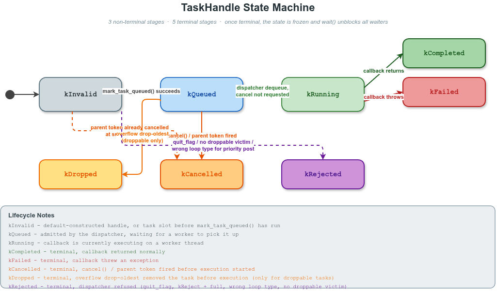

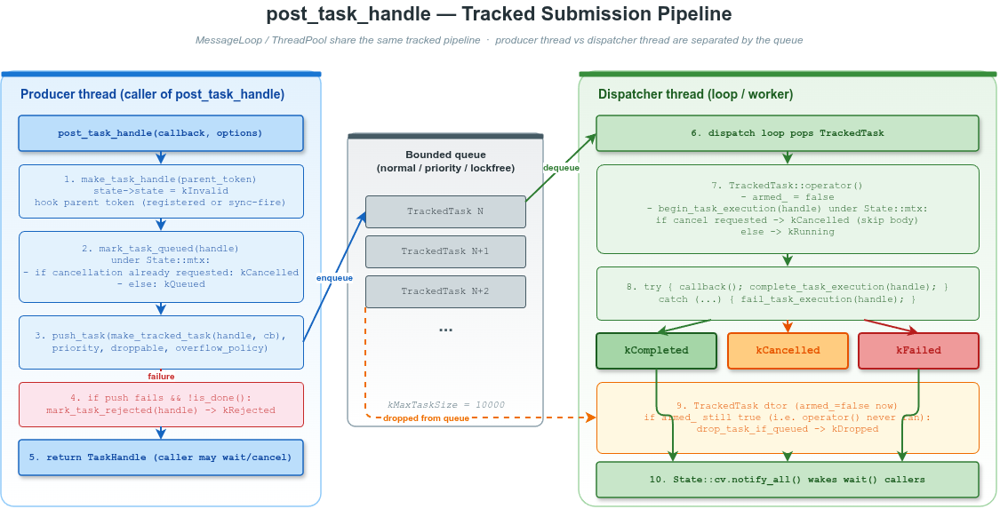

```cpp
#include <vlink/base/message_loop.h>
#include <vlink/base/task_handle.h>

vlink::MessageLoop loop;
loop.async_run();

// 1. 最简：等待任务完成
auto h = loop.post_task_handle([] { heavy(); });
h.wait();                                     // 阻塞直到任务进入终态
assert(h.state() == vlink::TaskExecutionState::kCompleted);

// 2. 带 PostTaskOptions 的完整调用
vlink::PostTaskOptions opts;
opts.overflow_policy = vlink::TaskOverflowPolicy::kReject;     // 队列满立即拒绝
opts.drop_policy     = vlink::TaskDropPolicy::kProtected;      // 不被 drop-oldest 选中
opts.cancellation_token = parent.token();                       // 父级 token
auto h2 = loop.post_task_handle([token = opts.cancellation_token] {
    while (!token.is_cancellation_requested()) {
        do_unit();
    }
}, opts);

// 3. 在运行中请求取消（仅翻转 cancellation_source，已排队任务会被跳过；
//    已开始的回调需自行轮询 token）
h2.cancel();

// 4. 限时等待
if (!h2.wait(/*timeout_ms=*/500)) {
    VLOG_W("task did not finish in 500ms, state=", static_cast<int>(h2.state()));
}
```

**`TaskExecutionState` 状态机：**

| 状态 | 终态？ | 进入条件 |
|------|--------|----------|
| `kInvalid`   | 否 | 默认构造或未关联任何已排队任务 |
| `kQueued`    | 否 | 被 dispatcher 接受，等待执行 |
| `kRunning`   | 否 | 回调正在执行 |
| `kCompleted` | 是 | 回调正常返回 |
| `kCancelled` | 是 | 在 `kQueued` 阶段被 `cancel()` / parent token 触发 |
| `kDropped`   | 是 | overflow drop-oldest 选中此任务，在执行前丢弃 |
| `kRejected`  | 是 | dispatcher 拒收（quit、无可丢任务、kReject 满） |
| `kFailed`    | 是 | 回调抛出异常 |

**`TaskOverflowPolicy`：** 单次 post 对队列满行为的覆盖。

| 取值 | 行为 |
|------|------|
| `kUseDispatcherStrategy` | 沿用 dispatcher 的 `Strategy` 配置（默认） |
| `kReject`                | 队列满立即拒绝，返回 `kRejected` 句柄 |
| `kBlock`                 | 持续 1ms sleep 重试直到入队（绕过 dispatcher 的 drop 行为） |

**`TaskDropPolicy`：** 任务被 dispatcher 选为 drop-oldest 牺牲品的资格。

| 取值 | 行为 |
|------|------|
| `kDroppable`  | 可被 drop-oldest 路径选中（默认） |
| `kProtected`  | 永不被 drop-oldest 选中；若队列全为 `kProtected` 则 post 失败返回 `false` |

> **lock-free 队列的限制**：`kLockfreeType` 队列**不跟踪**每任务的 drop policy，
> overflow drop 会无差别移除一个已排队任务。对该队列传 `kProtected` 会打印警告日志，
> 但**不能**真正阻止该任务被丢弃。要确保不被 overflow drop 选中，请使用 `kNormalType`
> 或 `kPriorityType` 队列。
>
> 句柄析构 **不会** 取消任务；dispatcher 自有强引用，会一直跑到终态。

**TaskHandle 锁顺序：** `MessageLoopAliveState::mtx` → `MessageLoop::Impl::mtx`
→ `TaskHandle::State::mtx` → （取消时再额外取 `CancellationSource::State::mtx`，
但只在释放 `TaskHandle::State::mtx` 之后）。所有 `wait()` / 终态通知的 cv 都在
`TaskHandle::State::mtx` 上等待，回调释放 mtx 后再触发。

### 11.8.17 get_alive_state -- 跨线程安全引用循环

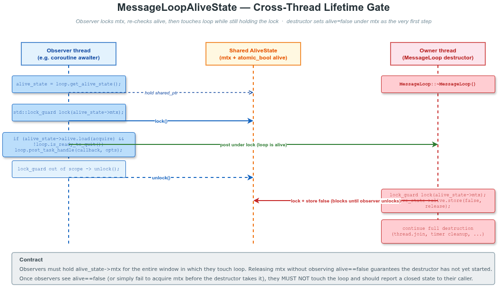

`get_alive_state()` 返回一个 `std::shared_ptr<detail::MessageLoopAliveState>`，
内含 `mutex mtx` 与 `atomic_bool alive`。析构函数会在第一步取 `mtx` 并将
`alive` 翻为 `false`。需要从其他线程异步 post 任务到本循环的桥接层（如协程恢复）
应：

```cpp
auto alive = loop.get_alive_state();   // 引用计数极轻
// 在另一个线程：
{
    std::lock_guard lock(alive->mtx);
    if (alive->alive.load(std::memory_order_acquire) && !loop.is_ready_to_quit()) {
        loop.post_task([] { /* 安全 */ });
    }
    // 出 mtx 后再调用 loop 可能 UAF
}
```

这是**内部 API**，协程 awaiter / 跨线程 bridge 才会用到；常规应用代码不必显式使用。

---

## 11.9 定时器

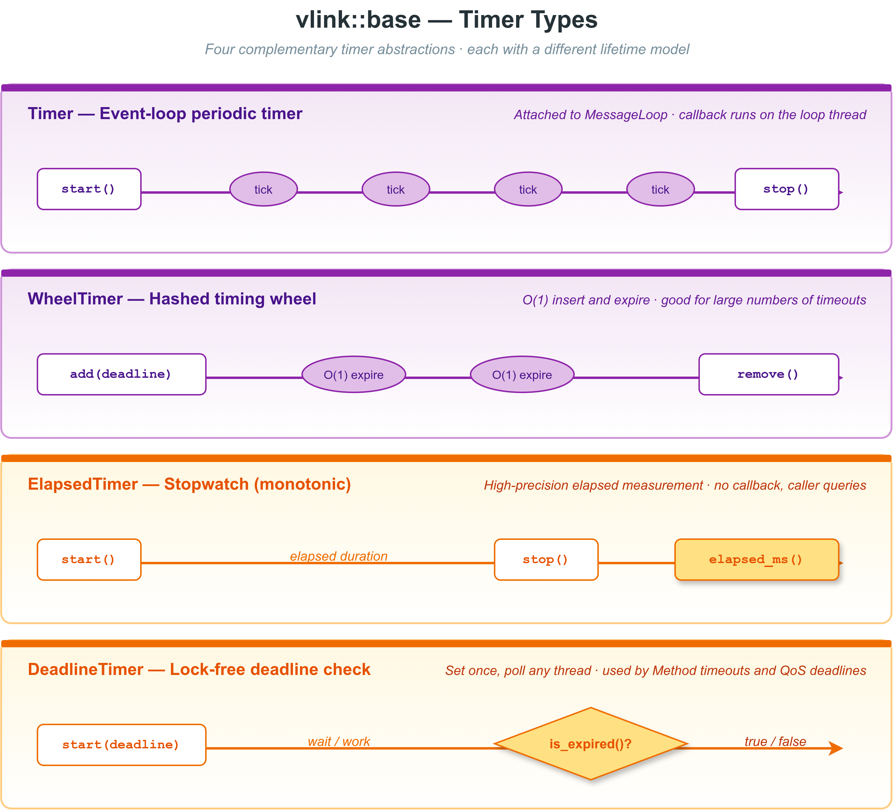

### 11.9.1 Timer -- 事件循环定时器

#### 11.9.1.1 概述

`vlink::Timer` 与 `MessageLoop` 集成，回调在循环线程上串行触发，无需额外同步。
当 `interval_ms` 传入 0 时，间隔会回退到内部的 `kMinInterval` 保护值。

#### 11.9.1.2 构造与使用

```cpp
#include <vlink/base/timer.h>
#include <vlink/base/message_loop.h>

vlink::MessageLoop loop;

// 每 500 ms 重复触发（kInfinite = 无限次）
vlink::Timer timer(&loop, 500, vlink::Timer::kInfinite, []() {
    VLOG_I("tick");
});
timer.start();

// 仅触发 3 次
vlink::Timer once_timer(&loop, 1000, 3, []() {
    VLOG_I("count down");
});
once_timer.start();

// 单次触发（fire-and-forget，无需管理 Timer 生命周期）
vlink::Timer::call_once(&loop, 200, []() {
    VLOG_I("delayed once");
});

loop.run(); // 阻塞直到 quit()
```

#### 11.9.1.3 严格模式

```cpp
timer.set_strict(true);
// 当循环线程繁忙、错过了某几个 tick 时，
// 严格模式会在下一次迭代立即补发错过的回调，维持调度精度。
```

#### 11.9.1.4 主要 API

```cpp
timer.start();                     // 启动定时器
timer.stop();                      // 停止定时器
timer.restart();                   // 重置计数并重新启动
timer.set_interval(100);           // 修改间隔（ms），下次 start/restart 生效
timer.set_loop_count(10);          // 修改触发次数
timer.set_callback([]{ ... });     // 替换回调
timer.set_priority(100);           // 设置优先级（仅 kPriorityType 循环有效）
timer.set_strict(true);            // 启用严格（追赶）模式
timer.is_active();                 // 是否正在运行
timer.get_invoke_count();          // 已触发次数
timer.get_remain_loop_count();     // 剩余次数（kInfinite 表示无限）
timer.get_priority();              // 获取当前优先级
timer.attach(&loop);               // 绑定到 MessageLoop
timer.detach();                    // 从 MessageLoop 解绑

// 静态方法：单次触发（fire-and-forget）
// 完整签名：
// static bool call_once(MessageLoop* loop, uint32_t interval_ms,
//                       Callback&& callback, uint16_t priority = 0);
vlink::Timer::call_once(&loop, 200, []{ ... });
vlink::Timer::call_once(&loop, 200, []{ ... }, /*priority=*/50);
```

### 11.9.2 WheelTimer -- 哈希时间轮定时器

#### 11.9.2.1 概述

`vlink::WheelTimer` 使用哈希时间轮算法管理**大量并发超时**（数十万级别），
插入、删除均为 O(1)，适合连接保活、会话超时等场景。

时间轮参数：
- `slots`：时间槽数量，决定最大无折叠精度范围（`slots * interval_ms`）
- `interval_ms`：每个槽的时间（毫秒），所有定时器分辨率

超过 `slots * interval_ms` 的超时通过轮次计数器处理，仍为 O(1)。

#### 11.9.2.2 使用示例

```cpp
#include <vlink/base/wheel_timer.h>

// 256 个槽，每槽 10 ms -> 最大精度范围 2.56 s（超出使用轮次）
vlink::WheelTimer wheel(256, 10);
wheel.start();

// 单次超时，1000 ms 后触发
auto key = wheel.add(1000, [](vlink::WheelTimer::Key k) {
    VLOG_I("timeout key=", k);
});

// 周期性重复，每 500 ms 触发一次
auto repeat_key = wheel.add(500, [](vlink::WheelTimer::Key k) {
    VLOG_I("heartbeat key=", k);
}, /*repeat_ms=*/500);

// 取消定时器
wheel.remove(key);

// 查询剩余时间（近似值，受槽边界影响）
uint32_t remaining = wheel.get_remaining_time(repeat_key);

// 暂停/恢复
wheel.pause();
wheel.resume();

// 限制追赶槽数（防止系统休眠后的回调风暴）
wheel.set_catchup_limit(10);

wheel.stop();
```

> **注意**：回调在 WheelTimer 内部工作线程上调用，需要线程安全操作。
> 通常将结果 post 到 `MessageLoop` 处理。

### 11.9.3 ElapsedTimer -- 高精度计时器

#### 11.9.3.1 概述

`vlink::ElapsedTimer` 测量从 `start()` 调用开始的经过时间，支持两种时钟源和三种精度。

| 时钟源（Method）   | 描述                                   |
| ------------------ | -------------------------------------- |
| `kCpuTimestamp`    | 单调墙钟（Linux `CLOCK_MONOTONIC_RAW`）|
| `kCpuActiveTime`   | 进程 CPU 活跃时间（user + kernel）     |

| 精度（Accuracy） | 单位   |
| ---------------- | ------ |
| `kMilli`         | 毫秒   |
| `kMicro`         | 微秒   |
| `kNano`          | 纳秒   |

#### 11.9.3.2 使用示例

```cpp
#include <vlink/base/elapsed_timer.h>

// 默认：墙钟 + 毫秒
vlink::ElapsedTimer t;
t.start();
do_work();
int64_t ms = t.get();  // 经过的毫秒数，未启动则返回 -1

// 微秒精度的 CPU 时间
vlink::ElapsedTimer cpu_t(vlink::ElapsedTimer::kCpuActiveTime,
                          vlink::ElapsedTimer::kMicro);
cpu_t.start();
heavy_compute();
int64_t cpu_us = cpu_t.get();

// restart() 原子地返回经过时间并重置起点
int64_t delta = t.restart();

// 停止
t.stop();           // get() 此后返回 -1
t.is_active();      // false

// 静态工具：获取当前时间戳（无需创建对象）
uint64_t now_ms = vlink::ElapsedTimer::get_cpu_timestamp();
uint64_t now_us = vlink::ElapsedTimer::get_cpu_timestamp(
                      vlink::ElapsedTimer::kMicro);
uint64_t sys_ns = vlink::ElapsedTimer::get_sys_timestamp(
                      vlink::ElapsedTimer::kNano);
```

#### 11.9.3.3 性能测量惯用法

```cpp
vlink::ElapsedTimer bench(vlink::ElapsedTimer::kMicro);
bench.start();

for (int i = 0; i < 10000; i++) {
    do_operation();
}

int64_t total_us = bench.get();
VLOG_I("avg latency = ", (total_us / 10000), " us");
```

### 11.9.4 DeadlineTimer -- 绝对截止时间定时器

#### 11.9.4.1 概述

`vlink::DeadlineTimer` 存储一个绝对到期时间戳（原子 64 位），用于**无锁超时检测**。
多线程并发读取 `has_expired()` 或 `remaining_time()` 无需加锁。

```cpp
#include <vlink/base/deadline_timer.h>

// 构造即设置 200 ms 截止时间
vlink::DeadlineTimer dt(200);

while (!dt.has_expired()) {
    process_events();
}

int64_t left = dt.remaining_time(); // 0 表示已过期或无效

// 重置为 500 ms 后到期
dt.set_deadline(500);

// 设置绝对时间戳
uint64_t abs = vlink::ElapsedTimer::get_cpu_timestamp();
dt.set_deadline_abs(abs + 1000);

// 清空截止时间：is_valid() 返回 false，has_expired() 也返回 false
dt.reset();
```

> `remaining_time()` 返回 0 同时可能意味着"无效"或"已过期"；
> 在做精确判断时应结合 `is_valid()` 使用。

---

## 11.10 线程池 ThreadPool

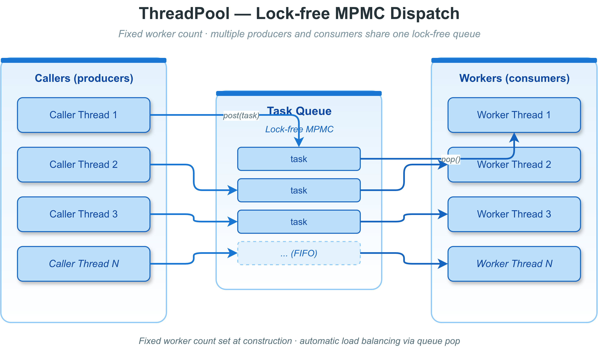

### 11.10.1 概述

`vlink::ThreadPool` 维护固定数量的工作线程，用于**并行执行**任务。
与 `MessageLoop` 的区别：无定时器支持，任务可并发执行，适合 CPU 密集型工作。

### 11.10.2 队列类型与入队策略

| 类型（Type）      | 内部队列                                       | 说明                  |
| ----------------- | ---------------------------------------------- | --------------------- |
| `kNormalType`     | mutex + `std::deque`（或 `std::pmr::deque`）    | 默认，通用；可迭代支持 droppable 扫描 |
| `kLockfreeType`   | 无锁 `MpmcQueue`                                | 低竞争延迟            |

`Strategy` 仅在队列已满时影响 `post_task` / `invoke_task` 的入队行为：

| 策略（Strategy）         | 队列已满时的行为                                       |
| ------------------------ | ------------------------------------------------------ |
| `kOptimizationStrategy`  | 以 1ms sleep 重试 10 次；仍满则丢弃最旧任务并入队新任务 |
| `kPopStrategy`           | 立即丢弃最旧任务并入队新任务                           |
| `kBlockStrategy`         | 以 1ms sleep 无限重试，直到有空闲槽位                  |

### 11.10.3 使用示例

```cpp
#include <vlink/base/thread_pool.h>

// 8 个工作线程
vlink::ThreadPool pool(8);
pool.set_name("compute-pool");
pool.set_strategy(vlink::ThreadPool::kBlockStrategy);

// 提交无返回值任务
pool.post_task([] {
    heavy_work();
});

// 提交有返回值任务，获取 future
auto fut = pool.invoke_task([]() -> int {
    return compute_answer();
});
int result = fut.get();  // 等待结果

// 查询队列深度
size_t pending = pool.get_task_count();

// 检测是否在工作线程内（防止死锁）
if (!pool.is_in_work_thread()) {
    auto inner_fut = pool.invoke_task([]{ return 42; });
    inner_fut.get(); // 安全：调用者在外部线程
}

// 关闭（等待当前任务完成）
pool.shutdown();
```

> **警告**：在线程池的工作线程内调用 `invoke_task(...).get()` 会死锁！
> 使用 `is_in_work_thread()` 检测，或改用 `post_task()`。

### 11.10.4 Tracked 任务投递（TaskHandle）

`ThreadPool::post_task_handle()` 与 `MessageLoop::post_task_handle()` 语义一致，
返回 `TaskHandle` 供取消、等待、状态查询。`PostTaskOptions` / `TaskOverflowPolicy` /
`TaskDropPolicy` / `TaskExecutionState` / `CancellationToken` 等类型均共用，
详见 [11.8.16 Tracked 任务投递](#11816-tracked-任务投递taskhandle)和 [11.17 协作取消](#1117-协作取消-cancellation)。

```cpp
#include <vlink/base/thread_pool.h>
#include <vlink/base/task_handle.h>

vlink::ThreadPool pool(4);

// 父级 token：一次取消整批 worker
vlink::CancellationSource batch;
vlink::PostTaskOptions opts;
opts.cancellation_token = batch.token();

std::vector<vlink::TaskHandle> handles;
for (int i = 0; i < 32; ++i) {
    handles.emplace_back(pool.post_task_handle(
        [token = opts.cancellation_token, i] {
            while (!token.is_cancellation_requested()) {
                do_chunk(i);
                if (chunk_done(i)) return;
            }
        }, opts));
}

// 外部条件触发后整体取消
if (timeout_or_user_abort) {
    batch.request_cancel();
}

// 等待所有任务进入终态
for (auto& h : handles) h.wait();
```

> **lock-free ThreadPool 的限制**：与 MessageLoop 一致 — `kLockfreeType` 队列**不跟踪**
> `kProtected` drop policy，仅打印警告日志，不能阻止 overflow drop。

### 11.10.5 shutdown 自我分离（self-detach）

`ThreadPool::shutdown()` 允许从其内部工作线程发起。该工作线程不能 join 自己，因此
`shutdown` 会自动对其调用 `std::thread::detach()`；其余工作线程仍正常 join。`Impl`
通过 `std::shared_ptr` 共享，即使整个 `ThreadPool` 对象析构后，已分离的工作线程仍可
看到合法 state 直至它自然返回。

```cpp
pool.post_task([&pool] {
    if (need_emergency_shutdown()) {
        pool.shutdown();   // 安全：调用方所在的 worker 会被 detach
    }
});
```

`shutdown` 只在**首次**调用时返回 `true` 并实际生效；之后的调用立即返回 `false`，不会
再等待 join。析构函数会再调一次 `shutdown`，但二次调用是 no-op，已 detach / 已 join
的 `std::thread` 对象在析构时都是 non-joinable，不会触发 `std::terminate`。

---

## 11.11 进程管理 Process

`vlink::Process` 是 VLink 基础库提供的跨平台子进程管理类，API 设计参考了 Qt 的 QProcess，
用于启动、监控、通信和终止子进程。它支持 stdout/stderr 的管道捕获、stdin 写入、
异步回调通知，以及同步执行辅助方法，可在 Linux、macOS、Windows 和 QNX 上使用。

### 11.11.1 概述

在自动驾驶和具身智能场景中，经常需要从主进程启动并管理外部程序（如传感器驱动、数据采集工具、
诊断程序等）。`Process` 封装了底层的 `fork/exec`（POSIX）和 `CreateProcess`（Windows）调用，
提供统一的 C++ 接口完成以下工作：

- 启动子进程并传递命令行参数
- 配置子进程的环境变量和工作目录
- 通过管道捕获子进程的标准输出和标准错误
- 向子进程的标准输入写入数据
- 注册异步回调，在数据可读、状态变化或进程退出时获得通知
- 优雅终止（SIGTERM）或强制杀死（SIGKILL）子进程
- 提供静态方法 `execute()` 和 `start_detached()` 用于简化的同步执行和分离启动

### 11.11.2 头文件

```cpp
#include <vlink/base/process.h>
```

### 11.11.3 生命周期状态

`Process` 内部维护一个三态状态机：

| 状态               | 数值 | 说明                                      |
| ------------------ | ---- | ----------------------------------------- |
| `kNotRunningState` | 0    | 未启动或已退出                            |
| `kStartingState`   | 1    | `start()` 已调用，正在等待 exec 完成      |
| `kRunningState`    | 2    | 子进程正在运行                            |

状态转换流程：

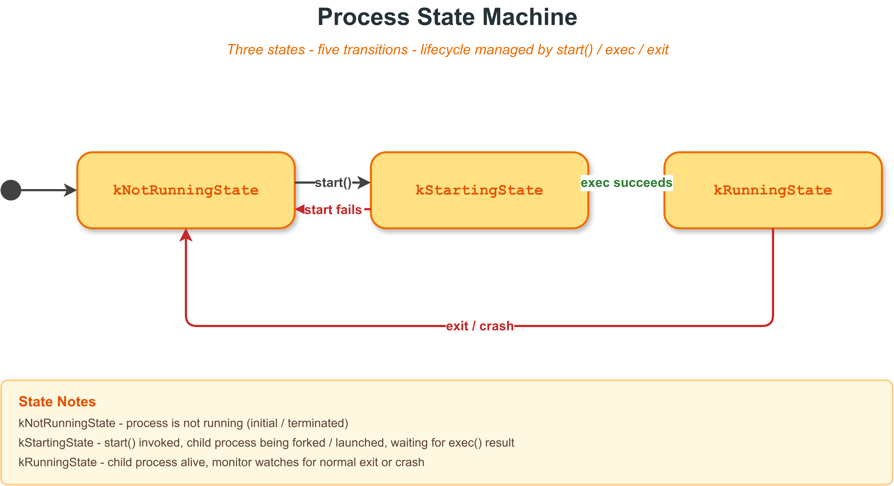

通过 `get_state()` 查询当前状态，通过 `is_running()` 快速判断是否正在运行。

### 11.11.4 退出状态

| 枚举                | 数值 | 说明                            |
| ------------------- | ---- | ------------------------------- |
| `kNormalExitStatus` | 0    | 子进程正常退出（exit() 或 main 返回） |
| `kCrashExitStatus`  | 1    | 子进程被信号杀死或崩溃          |

### 11.11.5 错误码

| 枚举                   | 数值 | 说明                                    |
| ---------------------- | ---- | --------------------------------------- |
| `kNoError`             | 0    | 无错误                                  |
| `kUnknownError`        | 1    | 未知错误                                |
| `kStartError`          | 2    | 启动失败（如可执行文件不存在）          |
| `kCrashedError`        | 3    | 子进程崩溃                              |
| `kTimedOutError`       | 4    | 等待操作超时                            |
| `kWriteError`          | 5    | 写入 stdin 失败                         |
| `kReadError`           | 6    | 读取 stdout/stderr 失败                 |
| `kBufferOverflowError` | 7    | 输出超出 `max_buffer_size` 限制         |

### 11.11.6 I/O 通道模式

`Process::Mode` 控制子进程的 stdout 和 stderr 如何路由。必须在 `start()` 之前通过
`set_process_mode()` 设置。

| 模式                   | 数值 | stdout              | stderr              | 适用场景                      |
| ---------------------- | ---- | ------------------- | ------------------- | ----------------------------- |
| `kSeparateMode`        | 0    | 缓冲到管道          | 缓冲到管道          | 需要分别读取 stdout/stderr    |
| `kMergedMode`          | 1    | 缓冲到管道          | 合并到 stdout 管道  | 不区分 stdout/stderr          |
| `kForwardedMode`       | 2    | 转发到父进程        | 转发到父进程        | 子进程输出直接显示在终端      |
| `kForwardedOutputMode` | 3    | 转发到父进程        | 缓冲到管道          | stdout 直接显示，stderr 捕获  |
| `kForwardedErrorMode`  | 4    | 缓冲到管道          | 转发到父进程        | stdout 捕获，stderr 直接显示  |

注意事项：

- 在 `kForwardedMode` 下，`read_all_output()` 和 `read_all_error()` 不会返回数据，
  因为输出被直接转发到了父进程的终端。
- 在 `kMergedMode` 下，所有子进程输出都通过 `read_all_output()` 读取，
  `read_all_error()` 不会有数据。
- 默认模式为 `kSeparateMode`。

```cpp
vlink::Process proc;
proc.set_process_mode(vlink::Process::kSeparateMode);
// 现在 stdout 和 stderr 分别缓冲到不同的管道中
```

### 11.11.7 核心 API

#### 11.11.7.1 构造与析构

```cpp
Process();   // 构造，不启动子进程
~Process();  // 析构，等待子进程退出（最多 5 秒），超时则强杀
```

析构函数的行为：

1. 如果子进程仍在运行，先发送 `terminate()`（SIGTERM）
2. 等待 `kDestructorWaitTimeoutMs`（5000 ms）
3. 如果仍未退出，发送 `kill()`（SIGKILL）
4. 再等待 1000 ms 后清理资源

`Process` 不可拷贝、不可移动。

#### 11.11.7.2 start()

```cpp
void start(const std::string& program, const std::vector<std::string>& arguments = {});
```

异步启动子进程。调用后进程状态从 `kNotRunningState` 转为 `kStartingState`，
成功后转为 `kRunningState`。如果已有进程在运行，则设置 `kStartError` 并返回。

```cpp
vlink::Process proc;
proc.set_process_mode(vlink::Process::kSeparateMode);
proc.start("/bin/echo", {"hello", "world"});
proc.wait_for_started(3000);
```

#### 11.11.7.3 start_command()

```cpp
void start_command(const std::string& command);
```

将一个完整的命令行字符串按空白字符拆分为程序名和参数列表，然后调用 `start()`。
支持双引号、单引号和转义字符。

```cpp
vlink::Process proc;
proc.start_command("/bin/echo hello world");
```

### 11.11.8 等待

```cpp
bool wait_for_started(int msecs = kDefaultWaitTimeoutMs);   // 默认 3000 ms
bool wait_for_finished(int msecs = kDefaultWaitTimeoutMs);  // 默认 3000 ms
bool wait_for_ready_read(int msecs = kDefaultWaitTimeoutMs); // 默认 3000 ms
```

- `wait_for_started()`：阻塞等待子进程进入 `kRunningState`。传入 `kInfinite`（-1）表示无限等待。
- `wait_for_finished()`：阻塞等待子进程退出。
- `wait_for_ready_read()`：阻塞等待管道中有新数据可读。

### 11.11.9 终止子进程

```cpp
void terminate();  // POSIX: SIGTERM, Windows: TerminateProcess()
void kill();       // POSIX: SIGKILL, Windows: TerminateProcess(9)
void close(bool force_kill_on_timeout = false);  // 先 terminate，超时后可选 kill
```

```cpp
vlink::Process proc;
proc.start("/bin/sleep", {"60"});
proc.wait_for_started(3000);
proc.close(true);  // 先 SIGTERM，超时后 SIGKILL
```

### 11.11.10 状态查询

```cpp
State get_state() const;             // 当前生命周期状态
Error get_error() const;             // 最近的错误码
int get_exit_code() const;           // 退出码（进程退出后有效）
ExitStatus get_exit_status() const;  // 退出方式（正常/崩溃）
bool is_running() const;             // 是否正在运行
int64_t get_process_id() const;      // 操作系统进程 ID（未运行时为 -1）
```

### 11.11.11 异步回调

所有回调均在内部监控线程中被调用，访问共享数据时需要注意线程安全。
回调必须在 `start()` 之前注册。

```cpp
// 子进程退出时触发
proc.register_finished_callback([](int code, vlink::Process::ExitStatus status) {
    if (status == vlink::Process::kNormalExitStatus) {
        MLOG_I("Process exited with code: {}", code);
    } else {
        VLOG_E("Process crashed!");
    }
});

// stdout 有新数据时触发
proc.register_ready_read_stdout_callback([&proc]() {
    std::string line;
    while (proc.can_read_line_stdout()) {
        proc.read_line_stdout(line);
        VLOG_I("stdout: ", line);
    }
});

// stderr 有新数据时触发
proc.register_ready_read_stderr_callback([&proc]() { ... });

// 进程状态变化时触发
proc.register_state_changed_callback([](vlink::Process::State state) {
    switch (state) {
        case vlink::Process::kStartingState:
            VLOG_I("Process starting...");
            break;
        case vlink::Process::kRunningState:
            VLOG_I("Process running");
            break;
        case vlink::Process::kNotRunningState:
            VLOG_I("Process stopped");
            break;
    }
});

// 发生错误时触发
proc.register_error_callback([](vlink::Process::Error err) { ... });
```

### 11.11.12 读写操作

#### 11.11.12.1 读取 stdout

| 方法                                             | 说明                                  |
| ------------------------------------------------ | ------------------------------------- |
| `bytes_available_stdout()`                        | 返回 stdout 缓冲区中可读字节数       |
| `can_read_line_stdout()`                          | 是否有完整的一行（以换行符结尾）      |
| `read_line_stdout(std::string& line)`             | 读取一行（含换行符），从缓冲区移除    |
| `read_stdout(std::vector<uint8_t>& buf, size_t)` | 读取指定字节数到字节数组              |
| `read_all_output(std::string& str)`               | 读取全部 stdout 数据到字符串          |
| `read_all_output(std::vector<uint8_t>& buf)`      | 读取全部 stdout 数据到字节数组        |

#### 11.11.12.2 读取 stderr

| 方法                                             | 说明                                  |
| ------------------------------------------------ | ------------------------------------- |
| `bytes_available_stderr()`                        | 返回 stderr 缓冲区中可读字节数       |
| `can_read_line_stderr()`                          | 是否有完整的一行                      |
| `read_line_stderr(std::string& line)`             | 读取一行                              |
| `read_stderr(std::vector<uint8_t>& buf, size_t)` | 读取指定字节数                        |
| `read_all_error(std::string& str)`                | 读取全部 stderr 数据到字符串          |
| `read_all_error(std::vector<uint8_t>& buf)`       | 读取全部 stderr 数据到字节数组        |

#### 11.11.12.3 读取全部输出（stdout + stderr 合并）

| 方法                                    | 说明                                |
| --------------------------------------- | ----------------------------------- |
| `read_all(std::string& str)`            | 读取 stdout + stderr 合并到字符串   |
| `read_all(std::vector<uint8_t>& buf)`   | 读取 stdout + stderr 合并到字节数组 |

#### 11.11.12.4 写入 stdin

```cpp
size_t write(const std::vector<uint8_t>& buffer, int timeout_ms = kDefaultWriteTimeoutMs);
size_t write(const std::string& str, int timeout_ms = kDefaultWriteTimeoutMs);
```

向子进程的标准输入写入数据。返回实际写入的字节数。默认超时 5000 ms。

```cpp
vlink::Process proc;
proc.set_process_mode(vlink::Process::kSeparateMode);
proc.start("/bin/cat");
proc.wait_for_started(3000);

proc.write("hello_stdin\n");
proc.close_write_channel();  // 子进程（cat）收到 EOF 后退出
proc.wait_for_finished(3000);

std::string output;
proc.read_all_output(output);
// output 包含 "hello_stdin\n"
```

### 11.11.13 同步辅助方法

#### 11.11.13.1 Process::execute()

```cpp
static int execute(const std::string& program,
                   const std::vector<std::string>& arguments = {},
                   int timeout_ms = kDefaultExecuteTimeoutMs);  // 默认 30000 ms
```

静态方法，同步执行一个外部程序并等待其完成。返回退出码，超时或启动失败返回 -1。

```cpp
int code = vlink::Process::execute("/bin/sh", {"-c", "exit 42"}, 5000);
// code == 42
```

#### 11.11.13.2 Process::start_detached()

```cpp
static bool start_detached(const std::string& program,
                           const std::vector<std::string>& arguments = {});
```

静态方法，启动一个完全分离的子进程。分离的进程与父进程无关，父进程退出不影响它。

POSIX 实现：双 `fork()` + `setsid()`，孙进程被 init 收养，stdin/stdout/stderr 重定向到 `/dev/null`。

```cpp
bool ok = vlink::Process::start_detached("/usr/bin/my_daemon", {"--config", "/etc/my.conf"});
```

### 11.11.14 缓冲区管理

```cpp
void set_max_buffer_size(size_t size);  // 默认 16 MB
size_t get_max_buffer_size() const;
```

当子进程输出超过此限制时，多余数据被丢弃，并设置 `kBufferOverflowError`。

### 11.11.15 环境变量与工作目录

```cpp
// 环境变量
proc.set_inherit_environment(true);  // 继承父进程环境变量（默认 false）
proc.set_environment({{"MY_VAR", "hello"}, {"DEBUG", "1"}});

// 工作目录
proc.set_working_directory("/tmp");
```

### 11.11.16 内部常量

| 常量                       | 值     | 说明                                  |
| -------------------------- | ------ | ------------------------------------- |
| `kInfinite`                | -1     | 无限等待标记                          |
| `kDefaultWaitTimeoutMs`    | 3000   | `wait_for_started/finished` 默认超时  |
| `kDefaultWriteTimeoutMs`   | 5000   | `write()` 默认超时                    |
| `kDefaultExecuteTimeoutMs` | 30000  | `execute()` 默认超时                  |
| `kDestructorWaitTimeoutMs` | 5000   | 析构函数等待子进程退出的超时          |
| 默认缓冲区大小（内部）     | 16 MB  | stdout/stderr 缓冲区上限              |
| 管道读取块大小（内部）      | 8192   | 每次从管道读取的最大字节数            |
| 监控线程轮询间隔（内部）    | 50 ms  | poll/waitpid 的超时时间               |

### 11.11.17 跨平台注意事项

- **Linux / macOS**：使用 `fork()` + `execvp()`/`execve()`，管道使用 `pipe()` + `dup2()`，非阻塞 `O_NONBLOCK`，`poll()` 检测数据就绪。
- **Windows**：使用 `CreateProcessW()` + `CreatePipe()`，重叠 I/O 读取管道，`WaitForSingleObject()` 等待退出。
- **QNX**：与 Linux 类似使用 POSIX API，`sysconf(_SC_OPEN_MAX)` 获取最大 fd 数。
- `Process` 不可拷贝、不可移动，同一对象同一时间只能管理一个子进程。

### 11.11.18 完整示例

#### 11.11.18.1 捕获子进程输出

```cpp
#include <vlink/base/process.h>
#include <iostream>
#include <string>

int main() {
    vlink::Process proc;
    proc.set_process_mode(vlink::Process::kSeparateMode);

    proc.start("/bin/echo", {"hello", "vlink"});
    proc.wait_for_finished(3000);

    std::string output;
    proc.read_all_output(output);
    std::cout << "Output: " << output << std::endl;
    // 输出: hello vlink

    return 0;
}
```

#### 11.11.18.2 异步监听子进程输出

```cpp
#include <vlink/base/process.h>
#include <iostream>
#include <string>

int main() {
    vlink::Process proc;
    proc.set_process_mode(vlink::Process::kSeparateMode);

    proc.register_ready_read_stdout_callback([&proc]() {
        std::string line;
        while (proc.can_read_line_stdout()) {
            proc.read_line_stdout(line);
            std::cout << "Received: " << line;
        }
    });

    proc.register_finished_callback([](int code, vlink::Process::ExitStatus status) {
        std::cout << "Process finished, exit code: " << code << std::endl;
    });

    proc.start("/bin/sh", {"-c", "echo line1; echo line2; echo line3"});
    proc.wait_for_finished(5000);

    return 0;
}
```

#### 11.11.18.3 与子进程交互（读写 stdin/stdout）

```cpp
#include <vlink/base/process.h>
#include <iostream>
#include <string>

int main() {
    vlink::Process proc;
    proc.set_process_mode(vlink::Process::kSeparateMode);

    proc.start("/bin/cat");
    proc.wait_for_started(3000);

    proc.write("hello from parent\n");
    proc.write("another line\n");
    proc.close_write_channel();

    proc.wait_for_finished(3000);

    std::string output;
    proc.read_all_output(output);
    std::cout << output;
    // 输出:
    // hello from parent
    // another line

    return 0;
}
```

---

## 11.12 并发原语

### 11.12.1 并发组件对比表

#### 11.12.1.1 任务调度组件对比

| 特性             | MessageLoop          | ThreadPool               | MultiLoop                        |
| ---------------- | -------------------- | ------------------------ | -------------------------------- |
| 执行模型         | 单线程串行           | 固定线程池并行           | 事件循环 + 线程池并行            |
| 任务顺序保证     | 严格 FIFO            | 无保证                   | 无保证                           |
| 定时器支持       | 支持                 | 不支持                   | 支持（继承自 MessageLoop）       |
| 生命周期管理     | run/quit/async_run   | 构造即启动/shutdown      | async_run/quit（继承）           |
| 队列类型         | Normal/Lockfree/Priority | Normal/Lockfree      | Normal/Lockfree/Priority         |
| API 兼容性       | 基类                 | 独立                     | 与 MessageLoop 完全兼容          |
| 适用场景         | 有序任务派发         | 纯计算并行               | 需要定时器又需要并行处理的场景   |

#### 11.12.1.2 同步原语对比

| 特性           | SpinLock              | std::mutex              | Semaphore                |
| -------------- | --------------------- | ----------------------- | ------------------------ |
| 等待方式       | 自旋（用户态）        | 内核态阻塞              | 条件变量阻塞             |
| 适用临界区长度 | 极短（几条指令）      | 任意                    | 不限                     |
| 上下文切换     | 无                    | 有                      | 有                       |
| 公平性         | 无保证                | 由 OS 调度              | FIFO                     |
| 递归支持       | 不支持（会死锁）      | 可用 recursive_mutex    | 不适用                   |
| CPU 占用       | 高（忙等待）          | 低（休眠）              | 低（休眠）               |

### 11.12.2 MultiLoop 多线程循环

`MultiLoop` 继承自 `MessageLoop`，保持了完全相同的 `post_task()` / `exec_task()` / `invoke_task()` API。核心区别在于 `on_task_changed()` 方法被重写：任务不再在事件循环线程上直接执行，而是被转发到内部的 `ThreadPool` 上并行执行。

架构示意：

```
                    post_task()
   调用方  --------->  MessageLoop 队列  --------->  on_task_changed()
                                                         |
                                                   ThreadPool (N 个工作线程)
                                                   /    |    |    \
                                               thread0  t1   t2  thread(N-1)
```

关键特性：

- N 个工作线程共享同一个任务队列
- 任务不保证执行顺序
- `is_in_same_thread()` 对任何工作线程返回 `true`
- `wait_for_idle()` 会等待 dispatcher 队列与已转发到 worker 的任务都空闲；worker 在完成前再次投递到 dispatcher 的任务也会被继续等待
- `on_begin()` 和 `on_end()` 在 dispatcher 线程上各调用一次，用于创建和销毁内部 `ThreadPool`
- 定时器回调在某个工作线程上触发（非确定性）
- `MultiLoop` 析构函数是默认实现；销毁前应先调用 `quit()` 和 `wait_for_quit()`，或只在循环已经自行退出后销毁对象

#### 11.12.2.1 构造参数

```cpp
// 默认 4 个工作线程，kNormalType 队列
vlink::MultiLoop loop;

// 指定线程数
vlink::MultiLoop loop(8);

// 指定线程数和队列类型
vlink::MultiLoop loop(4, MessageLoop::kLockfreeType);
```

#### 11.12.2.2 核心 API

```cpp
loop.async_run();

loop.post_task([] { do_work(); });

loop.post_task_with_priority([] { urgent_work(); }, MessageLoop::kHighestPriority);

auto fut = loop.invoke_task([]() -> int { return compute(); });
int result = fut.get();

loop.wait_for_idle(3000);

loop.quit();
loop.wait_for_quit(2000);
```

#### 11.12.2.3 完整示例

```cpp
#include <vlink/base/multi_loop.h>
#include <atomic>
#include <iostream>

int main() {
    vlink::MultiLoop loop(4);
    loop.async_run();

    std::atomic<int> counter{0};
    constexpr int kTasks = 100;

    for (int i = 0; i < kTasks; ++i) {
        loop.post_task([&counter]() {
            counter.fetch_add(1, std::memory_order_relaxed);
        });
    }

    loop.wait_for_idle(5000);
    std::cout << "Completed " << counter.load() << " tasks" << std::endl;

    loop.quit();
    loop.wait_for_quit(2000);
    return 0;
}
```

#### 11.12.2.4 适用场景

- 需要定时器功能同时又需要任务并行执行的场景
- 希望复用 MessageLoop API 但获得多线程吞吐量
- 传感器数据处理流水线，既有周期性采集又有并行计算需求

#### 11.12.2.5 注意事项

- 任务回调中的共享状态必须由调用方自行保护（SpinLock、mutex 等）
- 不要在任务回调中调用 `invoke_task()` 并同步等待结果，否则可能因线程池耗尽而死锁
- MultiLoop 的名称自动编号为 `MultiLoop_0`、`MultiLoop_1` 等，可通过 `set_name()` 覆盖

### 11.12.3 MpmcQueue 无锁队列

#### 11.12.3.1 算法原理

`MpmcQueue<T>` 是一个固定容量、无锁、缓存行对齐的 MPMC 环形缓冲区，基于 **turn-counting（轮次计数）** 算法实现。

核心思路：

- 环形缓冲区的每个槽位（Chunk）包含一个原子轮次计数器 `turn`
- 生产者通过原子递增 `head_` 来声明一个槽位，然后等待 `chunk.turn == turn(head) * 2`（槽位为空）后写入
- 消费者通过原子递增 `tail_` 来声明一个槽位，然后等待 `chunk.turn == turn(tail) * 2 + 1`（槽位有数据）后读取
- 写入完成后将 `turn` 设为 `turn(head) * 2 + 1`（标记为满）
- 读取完成后将 `turn` 设为 `turn(tail) * 2 + 2`（标记为空，下一轮可用）

等待策略：

- 前 32 次（`kFirstSpinTimes`）空转
- 超过 32 次后调用 `Utils::yield_cpu()`（x86 上是 PAUSE 指令，ARM 上是 YIELD 指令，RISC-V 上是 `.word 0x0100000f`；其余架构回退到 `std::this_thread::yield()`）

#### 11.12.3.2 字节对齐防伪共享

伪共享（False Sharing）是多核并发编程中的常见性能陷阱：当两个不同的原子变量恰好位于同一条缓存行（通常 64 字节）上时，一个核心的写操作会导致另一个核心的缓存行失效，即使它们访问的是不同的变量。

MpmcQueue 通过以下手段避免伪共享：

```
内存布局（64 字节对齐）:

  [  head_ (atomic, 64B 对齐)       |  padding...  ]   <-- 独占缓存行
  [  chunk_storage_, capacity_      |  cv_mtx_     ]
  [  tail_ (atomic, 64B 对齐)       |  padding...  ]   <-- 独占缓存行
  [  cv_not_empty_, cv_not_full_                   ]
  [  quit_flag_ (64B 对齐)          |  padding...  ]   <-- 独占缓存行
```

每个 Chunk 槽位也是 64 字节对齐的：

```
  Chunk[0]:  [ turn (atomic) | storage (T 的原始字节) | padding ]  64B 对齐
  Chunk[1]:  [ turn (atomic) | storage (T 的原始字节) | padding ]  64B 对齐
  ...
```

#### 11.12.3.3 API 概览

**阻塞式操作**

```cpp
vlink::MpmcQueue<int> q(1024);

q.push(42);         // 阻塞式入队（队列满时自旋等待）
q.emplace(42);      // 阻塞式原位构造入队

int val;
q.pop(val);          // 阻塞式出队（队列空时自旋等待）
```

**非阻塞式操作**

```cpp
bool ok = q.try_push(42);      // 队列满时立即返回 false
bool ok = q.try_emplace(42);
int val;
bool ok = q.try_pop(val);       // 队列空时立即返回 false
```

**条件变量通知模式**

当与 `kBlockStrategy` 消息循环配合使用时，需要启用条件变量通知：

```cpp
vlink::MpmcQueue<int> q(1024);

q.push<vlink::MpmcQueue<int>::kConditionBehavior>(42);

int val;
q.pop<vlink::MpmcQueue<int>::kConditionBehavior>(val);

q.wait_not_empty();
q.wait_not_empty(std::chrono::milliseconds(100));
q.wait_not_full();
```

**状态查询**

```cpp
size_t cap = q.capacity();       // 固定容量
size_t sz  = q.size();           // 近似大小（快速但可能略有偏差）
size_t sz2 = q.size(true);      // 更精确的大小（较慢，最多重试 50 次）
bool   e   = q.empty();          // 是否为空
bool   f   = q.is_full();        // 是否已满
```

**优雅退出**

```cpp
q.notify_to_quit();
// 此后 try_push/try_pop 返回 false
// 此后 emplace/push 静默丢弃数据
// 此后 pop 不修改输出参数直接返回
```

#### 11.12.3.4 Behavior 枚举

| 值                   | push 时行为                     | pop 时行为                    |
| -------------------- | ------------------------------- | ----------------------------- |
| `kNoBehavior`        | 无通知                          | 无通知                        |
| `kConditionBehavior` | 通知 `cv_not_empty_`            | 通知 `cv_not_full_`           |

#### 11.12.3.5 容量规划建议

- 容量必须 >= 1，传入 0 会抛出 `std::invalid_argument`
- 每个槽位占用至少 64 字节（一个缓存行），加上 `sizeof(T)` 并向上对齐到 64 的倍数
- 经验公式：容量 = 预期突发峰值的 2-4 倍

#### 11.12.3.6 完整示例：生产者-消费者

```cpp
#include <vlink/base/mpmc_queue.h>
#include <atomic>
#include <thread>
#include <vector>
#include <iostream>

int main() {
    vlink::MpmcQueue<int> q(256);
    std::atomic<int> sum{0};

    constexpr int kProducers = 4;
    constexpr int kConsumers = 4;
    constexpr int kItemsPerProducer = 1000;
    constexpr int kTotal = kProducers * kItemsPerProducer;

    std::atomic<int> consumed_count{0};

    std::vector<std::thread> consumers;
    for (int c = 0; c < kConsumers; ++c) {
        consumers.emplace_back([&]() {
            while (true) {
                int val = 0;
                if (consumed_count.load() >= kTotal) {
                    break;
                }
                if (q.try_pop(val)) {
                    sum.fetch_add(val, std::memory_order_relaxed);
                    consumed_count.fetch_add(1);
                } else {
                    std::this_thread::yield();
                }
            }
        });
    }

    std::vector<std::thread> producers;
    for (int p = 0; p < kProducers; ++p) {
        producers.emplace_back([&, p]() {
            int base = p * kItemsPerProducer;
            for (int i = 0; i < kItemsPerProducer; ++i) {
                q.push(base + i);
            }
        });
    }

    for (auto& t : producers) { t.join(); }

    while (consumed_count.load() < kTotal) {
        std::this_thread::sleep_for(std::chrono::milliseconds(1));
    }

    for (auto& t : consumers) { t.join(); }

    std::cout << "Total sum: " << sum.load() << std::endl;
    return 0;
}
```

### 11.12.4 ObjectPool 对象池

#### 11.12.4.1 概述

`ObjectPool<T>` 是一个线程安全的通用对象池，通过回收和重用对象来减少堆分配开销。它特别适用于需要频繁创建和销毁对象的热路径，例如消息缓冲区、序列化上下文等。

#### 11.12.4.2 三种获取方式

| 方法           | 返回类型                        | 自动归还 | 使用场景                     |
| -------------- | ------------------------------- | -------- | ---------------------------- |
| `get()`        | `unique_ptr<T, PoolDeleter>`    | 是       | 单一所有权，推荐默认使用     |
| `get_shared()` | `shared_ptr<T>`                 | 是       | 需要共享所有权               |
| `borrow()`     | `T*`（裸指针）                  | 否       | 需要手动控制归还时机         |

对于 `get()` 和 `get_shared()`，当智能指针析构时，对象自动归还到池中而非被删除。`borrow()` 返回裸指针，必须由调用方手动调用 `give_back()` 归还。

#### 11.12.4.3 Policy 枚举

| 策略             | 获取时重置 | 归还时重置 | 适用场景                   |
| ---------------- | ---------- | ---------- | -------------------------- |
| `kPolicyNone`    | 否         | 否         | 不可变或无状态对象         |
| `kPolicyRelease` | 否         | 是         | 归还前清理（默认策略）     |
| `kPolicyAcquire` | 是         | 否         | 使用前清理                 |
| `kPolicyBoth`    | 是         | 是         | 双侧清理                   |

#### 11.12.4.4 构造参数

```cpp
auto pool = std::make_shared<vlink::ObjectPool<Buffer>>(
    []{ return std::make_unique<Buffer>(4096); },   // factory_callback
    4,                                                // initial_size: 预填充 4 个对象
    16,                                               // max_size: 最多 16 个对象（0 表示无限）
    [](Buffer& b){ b.clear(); },                     // reset_callback
    vlink::ObjectPool<Buffer>::kPolicyRelease          // policy: 归还时重置
);
```

注意：ObjectPool 必须通过 `std::make_shared` 创建，因为 `PoolDeleter` 持有 `weak_ptr` 引向池本身。

#### 11.12.4.5 线程安全保证

所有公共方法通过内部互斥锁保护，可安全地从多个线程并发调用。但需要注意：

- 工厂回调在锁外执行，因此工厂回调本身必须是线程安全的
- 重置回调在锁外执行，同样需要线程安全
- 如果重置回调抛出异常，借出计数会正确递减，不会泄漏

#### 11.12.4.6 统计信息

```cpp
auto s = pool->stats();
// s.pool_size      -- 当前池中空闲对象数
// s.borrowed       -- 当前被借出的对象数
// s.total_created  -- 累计创建的对象总数
// s.max_size       -- 最大允许对象数（0 表示无限）
```

#### 11.12.4.7 完整示例

```cpp
#include <vlink/base/object_pool.h>
#include <iostream>
#include <thread>
#include <vector>

struct Buffer {
    std::vector<uint8_t> data;
    explicit Buffer(size_t sz) : data(sz) {}
    void clear() { std::fill(data.begin(), data.end(), 0); }
};

int main() {
    auto pool = std::make_shared<vlink::ObjectPool<Buffer>>(
        []{ return std::make_unique<Buffer>(4096); },
        4,    // 预填充 4 个
        16,   // 最多 16 个
        [](Buffer& b){ b.clear(); },
        vlink::ObjectPool<Buffer>::kPolicyRelease
    );

    // RAII 方式：get() 返回 unique_ptr，析构时自动归还
    {
        auto buf = pool->get();
        buf->data[0] = 0x42;
    }

    // 共享方式：get_shared() 返回 shared_ptr
    {
        auto buf = pool->get_shared();
        auto buf_copy = buf;  // 引用计数 +1
    }

    // 手动方式：borrow/give_back
    {
        Buffer* raw = pool->borrow();
        raw->data[0] = 0xFF;
        pool->give_back(raw);
    }

    auto s = pool->stats();
    std::cout << "Pool size: " << s.pool_size
              << ", Borrowed: " << s.borrowed
              << ", Total created: " << s.total_created << std::endl;

    return 0;
}
```

#### 11.12.4.8 异常契约

构造期：
- `initial_size > max_size > 0` 抛 `std::invalid_argument`
- 预填阶段 `FactoryCallback` 返回 `nullptr` 抛 `std::runtime_error`

获取期：
- `max_size > 0` 且所有对象都被借出时，`get()` / `get_shared()` / `borrow()` 抛 `std::runtime_error`（池耗尽）
- 同样三者在 `FactoryCallback` 返回 `nullptr` 时也抛 `std::runtime_error`

`ResetCallback` 抛出的异常会被吞掉，对象在归还路径上被丢弃而非回池；借出计数正确递减，不泄漏（见上方"线程安全保证"）。

#### 11.12.4.9 池耗尽处理建议

- 设置合理的 `max_size` 上限
- 使用 try-catch 捕获 `std::runtime_error` 并做降级处理
- 通过 `stats()` 监控池状态，在接近耗尽前发出告警

### 11.12.5 SpinLock 自旋锁

#### 11.12.5.1 适用场景

`SpinLock` 适用于极短的临界区（几条 CPU 指令），在这种场景下 `std::mutex` 的上下文切换开销远大于等待时间本身。

典型场景：

- 原子地修改几个关联变量
- 更新统计计数器
- 保护简短的指针交换

不适合的场景：

- 临界区包含 I/O 操作
- 临界区执行时间不确定
- 低优先级线程可能被高优先级线程抢占导致优先级反转

#### 11.12.5.2 自适应退避策略

SpinLock 使用指数退避策略来减少总线竞争：

```
第 1 轮: 自旋 1 次后 yield_cpu()
第 2 轮: 自旋 2 次后 yield_cpu()
第 3 轮: 自旋 4 次后 yield_cpu()
...
第 N 轮: 自旋 min(2^N, 1024) 次后 yield_cpu()

超过 50000 次总自旋: 记录错误日志并 sleep 10 微秒（安全阀机制）
```

`yield_cpu()` 在不同平台上映射为不同的指令：

| 平台     | 指令                            | 作用                           |
| -------- | ------------------------------- | ------------------------------ |
| x86/x64  | PAUSE (`_mm_pause`)             | 降低流水线功耗，避免内存序违规 |
| ARM      | YIELD                           | 给 SMT 兄弟核让出执行单元      |
| RISC-V   | `.word 0x0100000f`（pause hint）| 流水线提示，等价 PAUSE         |
| 其他     | `std::this_thread::yield()`     | 调度器让出                     |

#### 11.12.5.3 与 std::mutex 对比

| 指标         | SpinLock                     | std::mutex                    |
| ------------ | ---------------------------- | ----------------------------- |
| 锁获取延迟   | 极低（纳秒级，无竞争时）     | 中等（涉及系统调用）          |
| 竞争时开销   | CPU 自旋浪费                 | 线程挂起/唤醒                 |
| 适合持有时长 | 极短（纳秒到微秒）           | 任意                          |
| 内存开销     | 64 字节（缓存行对齐）        | 平台相关（通常 40-80 字节）   |
| 递归锁定     | 死锁                         | 可用 recursive_mutex          |
| 优先级反转   | 可能发生                     | 部分 OS 有优先级继承          |

#### 11.12.5.4 API

```cpp
vlink::SpinLock lock;

// 手动方式
lock.lock();       // 获取锁（自旋等待）
// 临界区...
lock.unlock();     // 释放锁

// 尝试获取（非阻塞）
if (lock.try_lock()) {
    // 获取成功
    lock.unlock();
}

// RAII 方式（推荐）
{
    vlink::SpinLockGuard guard(lock);
    // 临界区...
}  // 自动释放
```

SpinLock 满足 C++ Lockable 具名要求，也可以与 `std::lock_guard` 配合使用：

```cpp
vlink::SpinLock lock;
{
    std::lock_guard guard(lock);    // CTAD 推导出 std::lock_guard<vlink::SpinLock>
    // 临界区...
}
```

#### 11.12.5.5 完整示例

```cpp
#include <vlink/base/spin_lock.h>
#include <thread>
#include <vector>
#include <iostream>

int main() {
    vlink::SpinLock lock;
    int counter = 0;

    constexpr int kThreads = 8;
    constexpr int kOps = 10000;

    std::vector<std::thread> workers;
    for (int i = 0; i < kThreads; ++i) {
        workers.emplace_back([&]() {
            for (int j = 0; j < kOps; ++j) {
                vlink::SpinLockGuard guard(lock);
                ++counter;
            }
        });
    }

    for (auto& w : workers) {
        w.join();
    }

    std::cout << "Counter: " << counter << std::endl;
    // 输出: Counter: 80000
    return 0;
}
```

### 11.12.6 Semaphore 信号量

#### 11.12.6.1 概述

`Semaphore` 是一个进程内计数信号量，提供经典的 P/V（acquire/release）语义。内部基于 `std::mutex` 和条件变量实现，条件变量使用 `CLOCK_MONOTONIC` 以避免 Linux 上 NTP 时钟跳变导致的问题。

#### 11.12.6.2 API

```cpp
vlink::Semaphore sem(0);  // 初始计数为 0

// 获取 n 个许可（默认 1），可选超时
bool ok = sem.acquire(1);                     // 无限等待
bool ok = sem.acquire(1, 100);                // 最多等待 100 毫秒
bool ok = sem.acquire(1, Semaphore::kInfinite); // 无限等待（等同于默认）

// 释放 n 个许可（默认 1），唤醒等待者
sem.release(1);
sem.release(3);  // 一次释放 3 个许可

// 重置计数为 0
sem.reset();                   // 不中断等待者
sem.reset(true);              // 中断所有等待者（acquire 返回 false）

// 查询当前计数（仅用于调试）
size_t count = sem.get_count();
```

#### 11.12.6.3 生产者-消费者模式

```cpp
#include <vlink/base/semaphore.h>
#include <thread>
#include <queue>
#include <mutex>
#include <iostream>

int main() {
    vlink::Semaphore sem(0);
    std::queue<int> buffer;
    std::mutex mtx;

    std::thread producer([&]() {
        for (int i = 0; i < 10; ++i) {
            {
                std::lock_guard lock(mtx);
                buffer.push(i);
            }
            sem.release();
        }
    });

    std::thread consumer([&]() {
        for (int i = 0; i < 10; ++i) {
            sem.acquire();
            int val;
            {
                std::lock_guard lock(mtx);
                val = buffer.front();
                buffer.pop();
            }
            std::cout << "Consumed: " << val << std::endl;
        }
    });

    producer.join();
    consumer.join();
    return 0;
}
```

#### 11.12.6.4 资源池限流

```cpp
vlink::Semaphore pool_sem(4);  // 最多 4 个并发访问

void access_resource() {
    if (pool_sem.acquire(1, 5000)) {  // 等待最多 5 秒
        // 使用共享资源...
        pool_sem.release();
    } else {
        // 超时处理
    }
}
```

#### 11.12.6.5 优雅关闭

```cpp
vlink::Semaphore sem(0);

std::thread worker([&]() {
    while (sem.acquire(1)) {
        // 处理任务...
    }
    // acquire 返回 false 表示被中断，退出循环
});

sem.reset(true);  // 中断所有等待者
worker.join();
```

#### 11.12.6.6 注意事项

- `acquire()` 的超时使用毫秒为单位，`kInfinite`（-1）表示无限等待
- `get_count()` 返回的是快照值，在并发环境下仅供调试参考
- `release()` **不是 async-signal-safe**：内部会获取 `std::mutex`，不要在信号处理函数中直接调用
- 这是进程内信号量；如需跨进程同步，请使用 `SysSemaphore`
- `reset(true)` 是破坏性操作，仅在受控关闭时使用

### 11.12.7 ConditionVariable 单调时钟条件变量

#### 11.12.7.1 适用场景

`vlink::ConditionVariable` 是 `std::condition_variable` 的就地替换，规避某些
GCC / libc 实现下 `std::condition_variable` 内部使用 `CLOCK_REALTIME` 进行
`wait_for / wait_until` 而引发的两类问题：

- 系统时钟被 NTP 调整、用户改时区/时间，导致提前唤醒或永久等不到。
- `wait_for(steady_clock duration)` 仍可能被 realtime 跳变影响。

VLink 的实现通过 `pthread_condattr_setclock(&attr, CLOCK_MONOTONIC)` 显式锁定
单调时钟，所有 `wait_for / wait_until` 在墙钟跳变下行为稳定。在非 POSIX 平
台（Windows）该 bug 不适用，类型直接别名到 `std::` 版本。

#### 11.12.7.2 平台开关

`condition_variable.h` 顶部使用 `VLINK_ENABLE_BASE_CONDITION` 决定实现路径：

- 默认在 `__unix__ && !__CYGWIN__` 下启用 pthread 实现。
- 其他平台下 `vlink::ConditionVariable` / `vlink::ConditionVariableAny` 是
  `std::condition_variable` / `std::condition_variable_any` 的别名。

#### 11.12.7.3 主要 API

```cpp
namespace vlink {

class ConditionVariable final {
 public:
  using native_handle_type = pthread_cond_t*;

  ConditionVariable() noexcept;
  ~ConditionVariable() noexcept;

  void notify_one() noexcept;
  void notify_all() noexcept;

  void wait(std::unique_lock<std::mutex>& lock) noexcept;

  template <typename PredicateT>
  void wait(std::unique_lock<std::mutex>& lock, PredicateT p) noexcept;

  template <typename ClockT, typename DurationT>
  std::cv_status wait_until(std::unique_lock<std::mutex>& lock,
                            const std::chrono::time_point<ClockT, DurationT>& atime) noexcept;

  template <typename ClockT, typename DurationT, typename PredicateT>
  bool wait_until(std::unique_lock<std::mutex>& lock,
                  const std::chrono::time_point<ClockT, DurationT>& atime,
                  PredicateT p) noexcept;

  template <typename RepT, typename PeriodT>
  std::cv_status wait_for(std::unique_lock<std::mutex>& lock,
                          const std::chrono::duration<RepT, PeriodT>& rtime) noexcept;

  template <typename RepT, typename PeriodT, typename PredicateT>
  bool wait_for(std::unique_lock<std::mutex>& lock,
                const std::chrono::duration<RepT, PeriodT>& rtime,
                PredicateT p) noexcept;

  [[nodiscard]] native_handle_type native_handle() noexcept;
};

class ConditionVariableAny final {
  // 同上签名，但 wait / wait_for / wait_until 的 lock 形参为任意 BasicLockable。
};

// std-风格小写别名：
using condition_variable     = ConditionVariable;
using condition_variable_any = ConditionVariableAny;

}  // namespace vlink
```

#### 11.12.7.4 语义

- 所有 `wait_until` 在内部把目标时间点转换为 `steady_clock` 的等价时刻后再
  等，对调用瞬间之前已经过去的截止时间立即返回 `cv_status::timeout`，与标
  准库一致。
- 持续时间-向上取整（`ceil` / `ceil_impl`）保证 `wait_for(rtime)` 的实际等
  待不会短于 `rtime`，避免亚刻度截断带来的提前唤醒。
- `ConditionVariable` 不可拷贝、不可移动；`ConditionVariableAny` 通过内部
  `shared_ptr<SharedState>` 管理 `pthread_cond_t + std::mutex`。
- 析构时 `pthread_cond_destroy` 总是调用，对未被任何线程等待的实例同样安
  全。

#### 11.12.7.5 使用示例

```cpp
#include <mutex>
#include <vlink/base/condition_variable.h>

std::mutex mtx;
vlink::ConditionVariable cv;
bool ready = false;

// 消费者：
{
  std::unique_lock lock(mtx);
  cv.wait_for(lock, std::chrono::milliseconds(200), [&] { return ready; });
}

// 生产者：
{
  std::lock_guard lock(mtx);
  ready = true;
}
cv.notify_one();
```

`ConditionVariableAny` 在不能或不愿使用 `unique_lock` over `std::mutex` 时使用：

```cpp
vlink::SpinLock spin;                                      // SpinLock 也是 BasicLockable
vlink::ConditionVariableAny cv_any;
{
  std::lock_guard guard(spin);    // CTAD 推导出 std::lock_guard<vlink::SpinLock>
  // ... 检查条件 ...
}
cv_any.notify_all();
```

#### 11.12.7.6 在 VLink 中的使用位置

`Semaphore` / `MessageLoop` 唤醒等待 / `Schedule` 超时检测等内部模块都使用
`ConditionVariable` 而非 `std::condition_variable`，确保跨 NTP / 用户改表的
时序稳定性。

### 11.12.8 并发原语选型决策树

```
需要任务调度？
  |
  +-- 需要串行执行 ---------> MessageLoop
  |
  +-- 需要并行执行
       |
       +-- 需要定时器 -------> MultiLoop
       |
       +-- 纯并行计算 -------> ThreadPool

需要线程间数据传输？
  |
  +-- 固定容量 + 高吞吐 ----> MpmcQueue
  |
  +-- 需要背压控制 ----------> MpmcQueue + wait_not_full/wait_not_empty
  |
  +-- 对象重用 + 减少分配 ---> ObjectPool

需要互斥保护？
  |
  +-- 极短临界区（纳秒级）---> SpinLock
  |
  +-- 一般临界区 ------------> std::mutex
  |
  +-- 需要条件等待 ----------> vlink::ConditionVariable（CLOCK_MONOTONIC，避免 NTP 跳变）

需要线程间信号通知？
  |
  +-- 简单信号 --------------> Semaphore
  |
  +-- 需要计数限流 ----------> Semaphore（初始计数 = 并发上限）
```

### 11.12.9 避免伪共享

伪共享是并发性能的隐形杀手。VLink 的 MpmcQueue 和 SpinLock 已经通过 64 字节对齐避免了内部伪共享。在编写自己的并发数据结构时，请遵循以下原则：

1. 不同线程频繁访问的原子变量应当分别对齐到独立的缓存行

```cpp
// 错误：两个原子变量可能共享缓存行
struct Bad {
    std::atomic<int> counter_a;
    std::atomic<int> counter_b;
};

// 正确：每个原子变量独占缓存行
struct Good {
    alignas(64) std::atomic<int> counter_a;
    alignas(64) std::atomic<int> counter_b;
};
```

2. 数组中的元素如果被不同线程并发访问，每个元素应对齐到缓存行

3. 只读数据和读写数据分离：将不变的配置字段与频繁更新的状态字段放在不同的缓存行上

### 11.12.10 组合使用示例

以下示例展示如何组合使用 MultiLoop、MpmcQueue 和 ObjectPool 构建一个高性能的消息处理管道：

```cpp
#include <vlink/base/multi_loop.h>
#include <vlink/base/mpmc_queue.h>
#include <vlink/base/object_pool.h>
#include <iostream>
#include <memory>

struct Message {
    int id{0};
    std::string payload;
    void reset() { id = 0; payload.clear(); }
};

int main() {
    auto msg_pool = std::make_shared<vlink::ObjectPool<Message>>(
        []{ return std::make_unique<Message>(); },
        8,    // 预填充 8 个
        64,   // 最多 64 个
        [](Message& m){ m.reset(); },
        vlink::ObjectPool<Message>::kPolicyRelease
    );

    vlink::MultiLoop loop(4);
    loop.async_run();

    for (int i = 0; i < 100; ++i) {
        loop.post_task([&msg_pool, i]() {
            auto msg = msg_pool->get();
            msg->id = i;
            msg->payload = "data_" + std::to_string(i);
            // msg 离开作用域时自动归还到池中
        });
    }

    loop.wait_for_idle(5000);
    loop.quit();
    loop.wait_for_quit(2000);

    auto s = msg_pool->stats();
    std::cout << "Pool stats - idle: " << s.pool_size
              << ", total created: " << s.total_created << std::endl;

    return 0;
}
```

---

## 11.13 IPC 原语

VLink 在 `vlink::base` 层提供了两个跨进程 IPC 原语类：

| 类              | 头文件                               | 功能               |
| --------------- | ------------------------------------ | ------------------ |
| `SysSemaphore`  | `include/vlink/base/sys_semaphore.h` | 命名计数信号量     |
| `SysSharemem`   | `include/vlink/base/sys_sharemem.h`  | 命名共享内存区域   |

这两个类直接封装操作系统的 IPC 机制，为上层模块和用户代码提供最底层的进程间同步与数据共享能力。它们不依赖任何第三方库，仅使用 POSIX 或 Win32 原生 API。

### 11.13.1 SysSemaphore 系统信号量

#### 11.13.1.1 基本概念

`SysSemaphore` 是一个命名的、跨进程的计数信号量。多个进程通过相同的名称访问同一个内核信号量对象，实现 P/V 操作（即 acquire/release）。

核心特点：

- **命名语义**：通过操作系统命名空间标识，任何知道名称的进程都可以打开同一个信号量。
- **计数信号量**：内部维护一个非负整数计数器。`release()` 增加计数，`acquire()` 减少计数；当计数为 0 时 `acquire()` 阻塞调用者。
- **RAII 管理**：析构函数自动调用 `detach()` 关闭句柄。

#### 11.13.1.2 生命周期

```
构造 --> attach(name) --> acquire()/release() --> detach(force) --> 析构
```

1. **构造**：`SysSemaphore(count)` 创建对象，`count` 为初始计数（默认 0）。此时尚未关联任何 OS 信号量。
2. **attach(name)**：创建或打开一个命名信号量。如果该名称的信号量在系统中不存在，则以指定初始计数创建；如果已存在，则直接打开（忽略构造时的初始计数）。
3. **acquire(n, timeout_ms)**：P 操作，将计数减少 `n`。如果计数不足则阻塞，直到超时或其他线程/进程释放了足够的许可。
4. **release(n)**：V 操作，将计数增加 `n`，唤醒最多 `n` 个阻塞在 `acquire()` 上的等待者。
5. **detach(force)**：关闭句柄。若 `force=true` 则同时从 OS 命名空间中删除（`sem_unlink`）；若 `force=false` 则仅关闭本进程的句柄。
6. **析构**：自动调用 `detach(false)`（仅关闭句柄，不删除）。

#### 11.13.1.3 API 参考

```cpp
class SysSemaphore final {
public:
    static constexpr int kInfinite{-1};

    explicit SysSemaphore(size_t count = 0);
    ~SysSemaphore();

    bool attach(const std::string& name);
    bool detach(bool force = true);
    bool acquire(size_t n = 1, int timeout_ms = kInfinite);
    void release(size_t n = 1);

    bool   is_attached() const;
    size_t get_count()   const;
};
```

| 方法          | 返回值    | 说明                                                       |
| ------------- | --------- | ---------------------------------------------------------- |
| `attach`      | `bool`    | 成功返回 true；重复 attach 会返回 false 并打印错误日志     |
| `detach`      | `bool`    | 未 attach 时返回 false                                     |
| `acquire`     | `bool`    | 超时或错误返回 false；`timeout_ms=0` 为非阻塞尝试         |
| `release`     | `void`    | `n=0` 时不做任何操作                                       |
| `is_attached` | `bool`    | 查询当前是否已关联 OS 信号量                               |
| `get_count`   | `size_t`  | 获取当前计数快照（仅用于诊断，值可能随即改变）             |

#### 11.13.1.4 POSIX 命名规则

在 POSIX 系统（Linux、macOS）上，命名信号量的名称必须以 `/` 开头，例如 `/vlink_ready`、`/my_sem_01`。名称中不能包含额外的 `/`。名称长度受 `NAME_MAX` 限制（通常 255 字节）。

在 Windows 上，信号量名称可以是任意非空字符串。

#### 11.13.1.5 超时机制

| timeout_ms 值          | 行为                                    | 底层 API (POSIX)     |
| ---------------------- | --------------------------------------- | -------------------- |
| `kInfinite` (-1)       | 无限等待，直到获取到许可                | `sem_wait()`         |
| `0`                    | 非阻塞尝试，立即返回                   | `sem_timedwait(now)` |
| `> 0`                  | 最多等待指定毫秒数                      | `sem_timedwait()`    |

### 11.13.2 SysSharemem 系统共享内存

#### 11.13.2.1 基本概念

`SysSharemem` 封装了操作系统命名共享内存区域。一个进程通过 `create()` 创建并映射一块共享内存，其他进程通过相同名称调用 `attach()` 将该内存映射到自己的地址空间，从而实现零拷贝的数据共享。

核心特点：

- **命名语义**：与 `SysSemaphore` 类似，通过 OS 命名空间标识共享内存对象。
- **显式创建/附加分离**：`create()` 分配并映射新区域，`attach()` 仅映射已存在的区域。
- **访问模式控制**：支持只读 (`kReadOnly`) 和读写 (`kReadWrite`) 两种映射模式。
- **RAII 管理**：析构函数自动调用 `detach(false)` 取消映射（但不删除 OS 对象）。

#### 11.13.2.2 生命周期

```
创建者:  构造 --> create(name, size) --> data() 读写 --> detach(true) 删除
附加者:  构造 --> attach(name)       --> data() 读写 --> detach(false) 仅取消映射
```

#### 11.13.2.3 API 参考

```cpp
class SysSharemem final {
public:
    enum Mode : uint8_t {
        kReadOnly  = 0,   // PROT_READ
        kReadWrite = 1    // PROT_READ | PROT_WRITE
    };

    SysSharemem();
    ~SysSharemem();

    bool create(const std::string& name, size_t size, Mode mode = kReadWrite);
    bool attach(const std::string& name, Mode mode = kReadWrite);
    bool detach(bool force = true);

    bool        is_attached() const;
    void*       data();
    const void* data()        const;
    size_t      size()        const;
};
```

| 方法          | 返回值        | 说明                                                          |
| ------------- | ------------- | ------------------------------------------------------------- |
| `create`      | `bool`        | 同名已存在时返回 false（O_EXCL 语义）                        |
| `attach`      | `bool`        | 对象不存在时返回 false                                        |
| `detach`      | `bool`        | 未 attach 时返回 false                                        |
| `is_attached` | `bool`        | 数据指针、大小、句柄、名称均有效时返回 true                   |
| `data()`      | `void*`       | 未 attach 时返回 nullptr                                      |
| `data() const`| `const void*` | 只读访问，未 attach 时返回 nullptr                            |
| `size()`      | `size_t`      | 返回映射区域大小（字节），未 attach 时返回 0                  |

#### 11.13.2.4 访问模式

| Mode         | POSIX mmap 标志            | Windows 标志       | 说明               |
| ------------ | -------------------------- | ------------------ | ------------------ |
| `kReadOnly`  | `PROT_READ`                | `FILE_MAP_READ`    | 只读映射           |
| `kReadWrite` | `PROT_READ \| PROT_WRITE`  | `FILE_MAP_ALL_ACCESS` | 读写映射（默认） |

`kReadOnly` 模式下，通过 `data()` 返回的指针写入数据会触发段错误（SIGSEGV / Access Violation）。

### 11.13.3 跨进程同步模式

`SysSemaphore` 和 `SysSharemem` 配合使用是实现跨进程数据交换的经典模式：

```
创建者进程                              消费者进程
    |                                       |
    |-- SysSharemem::create("/data", 4096)  |
    |-- SysSemaphore(0).attach("/notify")   |
    |                                       |
    |-- 写入数据到 shm.data()               |-- SysSharemem::attach("/data")
    |-- sem.release()  ---- 信号 ---->      |-- SysSemaphore(0).attach("/notify")
    |                                       |-- sem.acquire()  // 收到信号
    |                                       |-- 读取 shm.data()
    |                                       |
```

### 11.13.4 与 VLink 传输后端的关系

| 层级                 | 组件                                         | 说明                                 |
| -------------------- | -------------------------------------------- | ------------------------------------ |
| 用户 API 层          | `Publisher` / `Subscriber` / `Client` 等     | 面向业务的发布/订阅/RPC 接口        |
| 传输后端层           | `shm://`(Iceoryx)、`dds://`(FastDDS) 等     | 封装具体传输协议，用户通过 URL 选择 |
| OS IPC 原语层        | `SysSemaphore`、`SysSharemem`                | 直接封装操作系统 API                 |

### 11.13.5 平台 API 映射表

#### 11.13.5.1 SysSemaphore 平台 API 映射

| 操作        | Linux (POSIX)             | macOS (GCD)                        | Windows (Win32)             |
| ----------- | ------------------------- | ---------------------------------- | --------------------------- |
| 创建/打开   | `sem_open()`              | `dispatch_semaphore_create()`      | `CreateSemaphore()`         |
| 关闭句柄    | `sem_close()`             | 释放 dispatch 对象                 | `CloseHandle()`             |
| 删除(unlink)| `sem_unlink()`            | 不支持（GCD 信号量无命名空间）     | 不支持（句柄关闭即释放）    |
| P 操作      | `sem_wait()`              | `dispatch_semaphore_wait()`        | `WaitForSingleObjectEx()`   |
| P 超时      | `sem_timedwait()`         | `dispatch_semaphore_wait(timeout)` | `WaitForSingleObjectEx(ms)` |
| V 操作      | `sem_post()`              | `dispatch_semaphore_signal()`      | `ReleaseSemaphore()`        |
| 获取计数    | `sem_getvalue()`          | 不支持                             | `ReleaseSemaphore(0, &cnt)` |
| 命名规则    | 必须以 `/` 开头           | 名称被忽略（非命名信号量）         | 任意非空字符串              |

注意事项：

- **macOS**：使用 GCD 的 `dispatch_semaphore`，不支持命名语义，无法真正跨进程使用。`get_count()` 也不可用。
- **Windows**：`detach(force)` 中的 `force` 参数被忽略，Win32 信号量在所有句柄关闭后自动销毁。
- **Linux**：命名信号量在 `/dev/shm/` 目录下以 `sem.` 前缀的文件形式存在。

#### 11.13.5.2 SysSharemem 平台 API 映射

| 操作         | Linux (POSIX)                   | Windows (Win32)                    | Android             |
| ------------ | ------------------------------- | ---------------------------------- | -------------------- |
| 创建         | `shm_open()` + `ftruncate()`   | `CreateFileMapping()`              | 不支持               |
| 打开         | `shm_open()`                   | `OpenFileMapping()`                | 不支持               |
| 映射         | `mmap(MAP_SHARED)`             | `MapViewOfFile()`                  | 不支持               |
| 取消映射     | `munmap()`                     | `UnmapViewOfFile()`                | 不支持               |
| 删除(unlink) | `shm_unlink()`                 | `CloseHandle()`                    | 不支持               |
| 获取大小     | `fstat()`                      | `VirtualQuery()`                   | 不支持               |
| 防止缩小     | `fcntl(F_ADD_SEALS)`           | 不适用                             | 不支持               |
| 命名规则     | 必须以 `/` 开头                | 任意非空字符串                     | 不支持               |
| 权限         | `0600` (owner rw) / `0400` (r) | 通过映射标志控制                   | 不支持               |

注意事项：

- **Android**：Bionic libc 不支持 `shm_open()`，`create()` 和 `attach()` 均返回 false。需使用 `ashmem` 或 `memfd_create` 替代。
- **QNX**：`detach()` 时通过 `fstat()` 的 `st_nlink` 判断附加计数，最后一个附加者 detach 时自动 unlink。

### 11.13.6 完整示例

#### 11.13.6.1 生产者进程

```cpp
#include <vlink/base/sys_semaphore.h>
#include <vlink/base/sys_sharemem.h>
#include <cstdio>
#include <cstring>

struct SharedMessage {
    uint32_t seq;
    uint32_t length;
    char     payload[256];
};

int main() {
    vlink::SysSharemem shm;
    if (!shm.create("/vlink_demo_shm", sizeof(SharedMessage))) {
        std::fprintf(stderr, "Failed to create shared memory\n");
        return 1;
    }

    vlink::SysSemaphore sem(0);
    if (!sem.attach("/vlink_demo_sem")) {
        std::fprintf(stderr, "Failed to create semaphore\n");
        shm.detach(true);
        return 1;
    }

    auto* msg = static_cast<SharedMessage*>(shm.data());
    msg->seq = 1;
    const char* text = "Hello from producer!";
    msg->length = static_cast<uint32_t>(std::strlen(text));
    std::memcpy(msg->payload, text, msg->length + 1);

    std::printf("Producer: wrote message seq=%u\n", msg->seq);
    sem.release();

    sem.detach(true);
    shm.detach(true);
    return 0;
}
```

#### 11.13.6.2 消费者进程

```cpp
#include <vlink/base/sys_semaphore.h>
#include <vlink/base/sys_sharemem.h>
#include <cstdio>

int main() {
    vlink::SysSharemem shm;
    if (!shm.attach("/vlink_demo_shm", vlink::SysSharemem::kReadOnly)) {
        std::fprintf(stderr, "Failed to attach shared memory\n");
        return 1;
    }

    vlink::SysSemaphore sem;
    if (!sem.attach("/vlink_demo_sem")) {
        std::fprintf(stderr, "Failed to attach semaphore\n");
        shm.detach(false);
        return 1;
    }

    std::printf("Consumer: waiting for data...\n");
    if (!sem.acquire(1, 5000)) {
        std::fprintf(stderr, "Consumer: timeout waiting for data\n");
        sem.detach(false);
        shm.detach(false);
        return 1;
    }

    const auto* msg = static_cast<const SharedMessage*>(shm.data());
    std::printf("Consumer: received message seq=%u, payload=\"%s\"\n",
                msg->seq, msg->payload);

    sem.detach(false);
    shm.detach(false);
    return 0;
}
```

### 11.13.7 IPC 原语注意事项

- **资源泄漏**：POSIX 命名信号量和共享内存在进程崩溃后不会自动从命名空间中删除。应在程序启动时检查并清理遗留对象。
- **析构行为**：两个类的析构函数均调用 `detach(false)`，仅关闭句柄不删除 OS 对象。如需删除，必须手动调用 `detach(true)`。
- **并发访问**：共享内存本身不提供同步保护，必须配合 `SysSemaphore` 或进程间互斥锁使用。
- **未初始化内存**：`SysSharemem::create()` 分配的区域不会自动清零，使用前应 `std::memset(shm.data(), 0, shm.size())`。
- **权限控制**：POSIX 下 `create()` 使用 `0600` 权限，不同用户需调整权限。
- **大小限制**：受 `/dev/shm` tmpfs 大小限制。大型数据传输建议使用 VLink 的 `shm://` 传输后端。
- **不可拷贝**：`SysSemaphore` 和 `SysSharemem` 均不可拷贝，需通过指针或引用传递。

---

## 11.14 任务调度

### 11.14.1 Schedule -- 任务调度包装器

#### 11.14.1.1 概述

`vlink::Schedule` 是一个非构造工具结构体，通过 `MessageLoop::exec_task()` 使用。
它将回调包装在 `Config` 配置中，支持**延迟、优先级、调度超时和执行超时**，
并返回一个 RAII 句柄用于链式注册延续回调。

#### 11.14.1.2 Config 字段

| 字段                    | 含义                                   |
| ----------------------- | -------------------------------------- |
| `delay_ms`              | 任务发布前的延迟（毫秒）               |
| `priority`              | 调度优先级（用于 `kPriorityType` 循环）|
| `schedule_timeout_ms`   | 任务未在此时间内启动则触发超时         |
| `execution_timeout_ms`  | 任务执行超过此时间则触发超时           |

#### 11.14.1.3 使用示例

```cpp
#include <vlink/base/message_loop.h>
#include <vlink/base/schedule.h>

vlink::MessageLoop loop;
loop.async_run();

// void 回调，100 ms 延迟，执行超时 500 ms
loop.exec_task(vlink::Schedule::Config{100, 0, 0, 500},
               [] { expensive_op(); })
    .on_execution_timeout([] { VLOG_W("task took too long!"); })
    .on_catch([](std::exception& e) { VLOG_E("exception: ", e.what()); });

// bool 返回值回调，支持链式 then/else
loop.exec_task(vlink::Schedule::Config{},
               []() -> bool { return try_connect(); })
    .on_then([]() -> bool {
        start_session();
        return true;
    })
    .on_then([]() -> bool {
        subscribe_topics();
        return true;
    })
    .on_else([] { retry_later(); })
    .on_schedule_timeout([] { VLOG_W("task not scheduled in time"); });
```

### 11.14.2 GraphTask -- 有向无环图任务调度

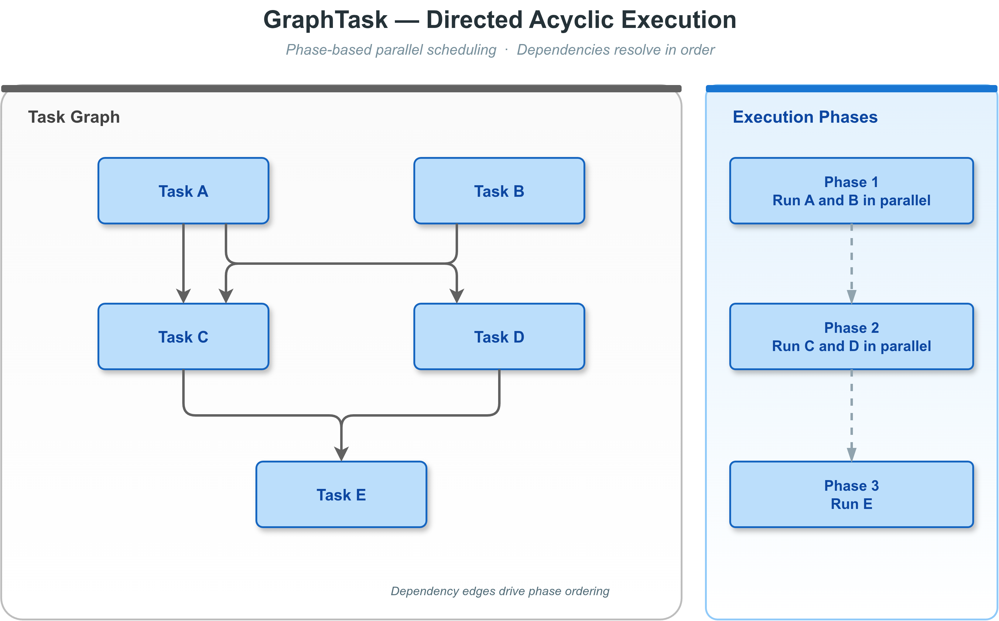

#### 11.14.2.1 概述

`vlink::GraphTask` 实现 DAG（有向无环图）任务调度。
每个任务节点通过 `precede()` / `succeed()` 声明依赖关系，
然后调用 `execute()` 提交到任意兼容引擎（`MessageLoop`、`MultiLoop`、`ThreadPool`）。

#### 11.14.2.2 任务类型

| 工厂方法               | 回调签名  | 用途                        |
| ---------------------- | --------- | --------------------------- |
| `create(callback)`     | `void()`  | 普通工作任务                |
| `create_condition(cb)` | `int()`   | 条件分支（返回值选择分支）  |

#### 11.14.2.3 依赖声明语法

`GraphTask` 重载了 `-- >` 和 `-- <` 运算符用于声明依赖关系：

| 表达式      | 等价调用             | 含义                            |
| ----------- | -------------------- | ------------------------------- |
| `A -- > B`  | `A->precede(B)`      | A 先执行（B 是 A 的后继）       |
| `A -- < B`  | `A->succeed(B)`      | B 先执行（B 是 A 的前驱）       |

也可以使用 `precede()` / `succeed()` 方法直接声明依赖。

> 注：API 含义以代码为准 — `X->precede(Y)` 等价 "X 先跑，Y 后跑"（Y 进入 X 的 succeed_task_list）；
> `X->succeed(Y)` 等价 "Y 先跑，X 后跑"（Y 进入 X 的 precede_task_list）。两者描述的是同一条边，
> 仅书写视角不同。`execute()` 必须从图的根（无前驱节点）发起。

**环路检测**：每次 `precede()` / `succeed()` 添加边前会先做可达性预检；
若新边会导致环路则拒绝本次修改并记录错误日志，已有拓扑不变。拓扑写入由全局
mutex 串行化，执行阶段读取可达子图快照。

#### 11.14.2.4 执行策略

| 策略              | 含义                                     |
| ----------------- | ---------------------------------------- |
| `kPolicyOnce`     | 每次 `execute()` 调用最多运行一次（默认）|
| `kPolicyMultiple` | 单次 `execute()` 可运行多次              |
| `kPolicyWaitAll`  | 等待所有前驱完成后才运行                 |

#### 11.14.2.5 使用示例

```cpp
#include <vlink/base/graph_task.h>
#include <vlink/base/message_loop.h>

vlink::MessageLoop engine;
engine.async_run();

// 创建节点
auto load  = vlink::GraphTask::create("load",  [] { load_data();  });
auto proc  = vlink::GraphTask::create("proc",  [] { process();    });
auto save  = vlink::GraphTask::create("save",  [] { save_data();  });
auto clean = vlink::GraphTask::create("clean", [] { cleanup();    });

// 声明依赖：load -> proc -> save
//                             -> clean
// A-- >B 表示 "A 必须在 B 之前完成"（A 进入 B 的 precede_task_list / B 进入 A 的 succeed_task_list）
load -- > proc -- > save;
proc -- > clean;

// 检测环
assert(!load->has_cycle());

// 监听状态变化（可注册多个；订阅 id 用于 unregister_status_callback）
uint32_t id = load->register_status_callback([](const std::string& name,
                                                 vlink::GraphTask::Status s) {
    VLOG_D("task ", name, " status=", (int)s);
});

// 注：每次状态变更时，GraphTask 会先在 status_callbacks_mtx 下对当前订阅集做一次 snapshot，
//     释放锁后再串行触发 snapshot 中的回调，因此回调内**可以**安全调用 register_status_callback /
//     unregister_status_callback / clear_status_callbacks（修改对**本次**触发不生效，仅影响下一次）。
//     回调抛出的异常会被捕获并记日志，不影响 snapshot 中其余订阅者继续触发。

// 从根节点（无前驱）提交执行，遍历整个可达子图
load->execute(&engine);

// 条件分支示例
auto check = vlink::GraphTask::create_condition("check",
    []() -> int {
        return is_valid() ? 0 : 1;
    }, /*condition_number=*/2);

auto branch_a = vlink::GraphTask::create("branch_a", [] { handle_valid(); });
auto branch_b = vlink::GraphTask::create("branch_b", [] { handle_invalid(); });

// check 是两个分支的前驱：check 执行后根据返回值选择分支
check -- > branch_a;   // 分支 0（check 返回 0 时执行 branch_a）
check -- > branch_b;   // 分支 1（check 返回 1 时执行 branch_b）

// 从根节点 check 提交执行
check->execute(&engine);

// DOT 可视化导出（从根节点导出整个子图）
std::string dot = load->export_to_dot();
```

---

## 11.15 性能分析

VLink 内置轻量级性能分析工具，用于量化节点和通信操作的 CPU 利用率，
同时提供高性能日志格式化流。

### 11.15.1 CpuProfiler CPU 分析器

`vlink::CpuProfiler` 通过 `begin()` / `end()` 配对调用，测量 CPU 活跃时间
占总墙钟时间（wall-clock time）的百分比。

#### 11.15.1.1 工作原理

内部维护两个 `ElapsedTimer`：

| 计时器                  | 时钟类型              | 用途                                 |
| ----------------------- | --------------------- | ------------------------------------ |
| `cpu_active_timer_`     | `kCpuActiveTime`      | 每次 begin/end 区间的 CPU 活跃时间   |
| `cpu_timestamp_timer_`  | `kCpuTimestamp`       | 从首次 begin 到当前的总墙钟时间      |

利用率计算公式：

```
utilisation (%) = (sum of active intervals / total elapsed time) * 100
```

#### 11.15.1.2 全局开关

CpuProfiler 的激活受环境变量 `VLINK_PROFILER_ENABLE` 控制。
该值在首次调用 `is_global_enabled()` 时读取并缓存，整个进程生命周期内不再变更。

```bash
# 启用性能分析
export VLINK_PROFILER_ENABLE=1

# 禁用（默认）
export VLINK_PROFILER_ENABLE=0
```

#### 11.15.1.3 API 说明

| 方法                           | 说明                                                            |
| ------------------------------ | --------------------------------------------------------------- |
| `CpuProfiler()`               | 构造，所有累加器初始化为零                                      |
| `begin()`                      | 标记活跃区间开始，重置活跃计时器；首次调用同时启动墙钟计时器    |
| `end()`                        | 标记活跃区间结束，累加本次活跃时间到 `total_active_`            |
| `get()`                        | 返回当前 CPU 利用率百分比 [0.0, 100.0]，不重置任何状态          |
| `restart()`                    | 返回当前利用率并重置所有累加器，之后 `get()` 返回 0.0           |
| `is_global_enabled()` (static) | 返回环境变量 `VLINK_PROFILER_ENABLE` 是否为 "1"                 |

注意事项：

- `begin()` 和 `end()` 内部通过 `SpinLock` 保护，可从任意线程调用
- 允许连续多次 `begin()` 而不调用 `end()`（每次 begin 重置活跃计时器基线）
- `end()` 在未调用 `begin()` 的情况下安全执行，负值会被忽略
- 实例不可拷贝、不可赋值

#### 11.15.1.4 基本用法

```cpp
#include <vlink/base/cpu_profiler.h>

vlink::CpuProfiler profiler;

for (auto& item : work_items) {
    profiler.begin();
    process(item);
    profiler.end();
}

double pct = profiler.get();  // 例如 42.5 表示 42.5%

double reset_pct = profiler.restart();
// 此后 profiler.get() == 0.0
```

### 11.15.2 CpuProfilerGuard RAII 守护

`vlink::CpuProfilerGuard` 是一个轻量 RAII 包装器：
构造时调用 `profiler->begin()`，析构时调用 `profiler->end()`，
保证即使发生异常也能正确关闭活跃区间。

| 方法                                                | 说明                                              |
| --------------------------------------------------- | ------------------------------------------------- |
| `CpuProfilerGuard(CpuProfiler* profiler)`           | 构造并调用 begin()；profiler 为 nullptr 时为空操作 |
| `~CpuProfilerGuard()`                               | 析构并调用 end()；profiler 为 nullptr 时为空操作   |

注意事项：

- 传入 `nullptr` 是安全的，构造和析构均为空操作
- 不可拷贝、不可移动，仅用作栈上局部变量
- 在热路径中建议先检查 `is_global_enabled()` 以跳过构造开销

```cpp
#include <vlink/base/cpu_profiler.h>
#include <vlink/base/cpu_profiler_guard.h>

vlink::CpuProfiler profiler;

void process_frame() {
    vlink::CpuProfilerGuard guard(&profiler);
    // ... 执行工作 ...
}  // 离开作用域时自动调用 profiler.end()

// 在热路径中结合全局开关使用
void hot_path_callback(const SensorData& data) {
    vlink::CpuProfilerGuard guard(
        vlink::CpuProfiler::is_global_enabled() ? &profiler : nullptr);
    process(data);
}
```

### 11.15.3 与 Node 的集成

VLink 的所有通信节点（Publisher、Subscriber、Client、Server、Getter、Setter）
内部持有一个可选的 `CpuProfiler` 实例。当全局性能分析开启时，每次 publish、
receive、request、respond 等操作都会自动通过 `CpuProfilerGuard` 记录 CPU 活跃时间。

通过 `Node::get_cpu_usage()` 可获取该节点从创建至今的 CPU 利用率百分比：

```cpp
vlink::Subscriber<SensorMsg> sub("dds://sensors/lidar");

// ... 运行一段时间后 ...

double cpu = sub.get_cpu_usage();
if (cpu >= 0) {
    VLOG_I("subscriber CPU usage: ", cpu, "%");
} else {
    VLOG_W("profiler not available (VLINK_PROFILER_ENABLE not set)");
}
```

| 返回值          | 含义                                                   |
| --------------- | ------------------------------------------------------ |
| `[0.0, 100.0]`  | 正常的 CPU 利用率百分比                               |
| `-1.0`          | 性能分析器未挂载（未启用 VLINK_PROFILER_ENABLE）        |

启用步骤：

```bash
# 1. 设置环境变量
export VLINK_PROFILER_ENABLE=1

# 2. 启动应用
./my_vlink_app
```

无需修改代码，通信节点会自动开始采集 CPU 利用率数据。

### 11.15.4 FastStream 高性能流

`vlink::FastStream` 是 VLink Logger 内部使用的高性能输出流，继承自 `std::ostream`，
支持所有标准流格式化操作符，同时提供零拷贝的缓冲区交付机制。

#### 11.15.4.1 设计要点

- 内部由一个 `StringBuf`（继承自 `std::streambuf`）驱动，数据存储在 `std::string` 中
- 默认初始容量 256 字节，自动增长，增长步幅上限为 8 KiB（`kMaxExpandSize`）
- `take_view()` 返回内部缓冲区的 `std::string_view`，实现零拷贝交付
- `write_raw()` 绕过 `std::ostream` 格式化，直接写入原始字节，适合预格式化字符串
- 非线程安全，Logger 内部采用 thread_local 实例

#### 11.15.4.2 API 说明

| 方法                                      | 说明                                                     |
| ----------------------------------------- | -------------------------------------------------------- |
| `FastStream()`                            | 构造，初始容量 256 字节                                  |
| `reset()`                                 | 清空缓冲区内容并重置流状态，不释放内存                   |
| `take_view()`                             | 返回缓冲区内容的 `string_view`，有效期至下次写入         |
| `append_to(std::string& target)`          | 将缓冲区内容追加到外部字符串，不重置缓冲区               |
| `size()`                                  | 返回当前缓冲区已写入字节数                               |
| `capacity()`                              | 返回当前缓冲区分配容量（字节）                           |
| `shrink_to_fit()`                         | 释放多余容量，最小保留 64 字节（`kMinCapacity`）         |
| `write_raw(const char* data, size_t len)` | 直接写入原始字节，绕过 ostream 格式化，返回 `*this`      |
| `operator<<`                              | 兼容所有 `std::ostream` 格式化操作符                     |

#### 11.15.4.3 缓冲区管理

| 常量               | 值     | 说明                           |
| ------------------- | ------ | ------------------------------ |
| `kDefaultCapacity`  | 256    | 构造时的初始缓冲区容量（字节） |
| `kMinCapacity`      | 64     | shrink_to_fit 后的最小容量     |
| `kMaxExpandSize`    | 8192   | 单次增长的上限步幅（8 KiB）    |

#### 11.15.4.4 用法示例

```cpp
#include <vlink/base/fast_stream.h>

vlink::FastStream stream;
stream << "sensor_id=" << 42 << " value=" << 3.14;

std::string_view view = stream.take_view();
// view == "sensor_id=42 value=3.14"
write_to_sink(view);  // 零拷贝交付

// 原始字节写入
stream.reset();
const char* header = "[INFO] ";
stream.write_raw(header, 7);
stream << "message content";

// 内存回收
stream.reset();
stream.shrink_to_fit();
```

### 11.15.5 完整代码示例

#### 11.15.5.1 手动性能分析

```cpp
#include <vlink/base/cpu_profiler.h>
#include <vlink/base/cpu_profiler_guard.h>
#include <vlink/base/logger.h>

int main() {
    vlink::Logger::init("profiler-demo");

    if (!vlink::CpuProfiler::is_global_enabled()) {
        VLOG_W("profiler is disabled, set VLINK_PROFILER_ENABLE=1 to enable");
    }

    vlink::CpuProfiler profiler;

    // 方式 1: 手动 begin/end
    profiler.begin();
    heavy_computation();
    profiler.end();

    VLOG_I("CPU usage after computation: ", profiler.get(), "%");

    // 方式 2: RAII guard
    {
        vlink::CpuProfilerGuard guard(&profiler);
        another_computation();
    }

    VLOG_I("CPU usage after both: ", profiler.get(), "%");

    double final_usage = profiler.restart();
    VLOG_I("final usage: ", final_usage, "%");
    VLOG_I("after restart: ", profiler.get(), "%");  // 0.0

    return 0;
}
```

---

## 11.16 工具类

### 11.16.1 Format -- 轻量格式化器

#### 11.16.1.1 概述

`vlink::format` 是一个轻量 `{}` 占位符格式化器，专为日志热路径设计。
所有格式化写入栈分配缓冲区或用户提供的输出迭代器，**不触及堆**。
模板分发逻辑在头文件中内联展开，整数/浮点/指针的实际数字写入由
`src/base/format.cc` 中的非模板符号 (`format_int_to` /
`format_long_long_to` / `format_double_to` 等) 完成。使用方需链接
`vlink::vlink` 以解析这些符号。

#### 11.16.1.2 支持的类型

| C++ 类型                           | 输出示例        |
| ---------------------------------- | --------------- |
| `int` / `short` / `signed char`    | `42`            |
| `unsigned` / `unsigned short` / ...| `42`            |
| `long` / `long long`               | `123456789`     |
| `bool`                             | `true` / `false`|
| `char`                             | `A`             |
| `float` / `double`                 | `3.14`          |
| `const char*` / `std::string` / `std::string_view` | `hello` |
| 任意指针 `T*`                      | `0x7ffe1234`    |
| 任意枚举                           | 底层整数值      |
| 其他自定义类型                     | 编译期 static_assert 报错 |

占位符语法：
- `{}` -- 按顺序消耗参数
- `{0}`, `{1}` -- 显式位置索引
- `{{` / `}}` -- 字面量花括号

#### 11.16.1.3 使用示例

```cpp
#include <vlink/base/format.h>

char buf[128];

// format_to_n：写入至多 n 个字符
auto result = vlink::format::format_to_n(
    buf, sizeof(buf) - 1, "x={} y={} name={}", 3, 4.5, "world");
buf[result.size] = '\0';
// buf == "x=3 y=4.5 name=world"

// 检查是否截断
if (result.truncated) {
    // 实际内容超过缓冲区大小
}

// 固定数组重载
char arr[64];
auto r2 = vlink::format::format_to(arr, "value={}", 42);

// 输出迭代器重载
std::string out;
vlink::format::format_to(std::back_inserter(out), "n={}", 99);
```

### 11.16.2 Utils -- 系统工具函数

#### 11.16.2.1 概述

`vlink::Utils` 命名空间提供跨平台的系统级工具函数，覆盖进程、线程、网络、信号等方面。
所有函数均为 `noexcept`，错误以空字符串、`false` 或哨兵值（如 `pid == -1`）表示。

#### 11.16.2.2 进程与应用信息

```cpp
#include <vlink/base/utils.h>

std::string path = vlink::Utils::get_app_path();  // 可执行文件完整路径
std::string dir  = vlink::Utils::get_app_dir();   // 所在目录
std::string name = vlink::Utils::get_app_name();  // 可执行文件名
std::string host = vlink::Utils::get_host_name(); // 主机名
int32_t pid      = vlink::Utils::get_pid();       // 进程 ID
std::string tmp  = vlink::Utils::get_tmp_dir();   // 临时目录
std::string mid  = vlink::Utils::get_machine_id();// 机器唯一 ID
```

#### 11.16.2.3 环境变量

```cpp
std::string val = vlink::Utils::get_env("MY_VAR", "default");
vlink::Utils::set_env("MY_VAR", "value");
vlink::Utils::unset_env("MY_VAR");
```

#### 11.16.2.4 线程管理

```cpp
// 设置当前线程名（Linux 最多 15 字符）
vlink::Utils::set_thread_name("worker");

// 设置调度策略和优先级（需要 CAP_SYS_NICE）
vlink::Utils::set_thread_priority(99, SCHED_FIFO);

// CPU 亲和性（bit mask：bit 0 = core 0）
vlink::Utils::set_thread_stick(0b0011); // 绑定到 core 0 和 core 1

// 获取原生线程 ID
uint64_t tid = vlink::Utils::get_native_thread_id();

// CPU 让步（最优机器指令：x86 PAUSE, ARM YIELD, RISC-V pause hint）
vlink::Utils::yield_cpu();
```

#### 11.16.2.5 信号处理

```cpp
// 注册终止信号处理器（SIGTERM + SIGINT）
vlink::Utils::register_terminate_signal(
    [](int sig) {
        VLOG_I("terminating, signal=", sig);
        app.shutdown();
    },
    /*is_async=*/false,
    /*pass_through=*/false);

// 注册崩溃信号处理器（SIGSEGV, SIGABRT 等）
vlink::Utils::register_crash_signal([](int sig) {
    vlink::Logger::dump_backtrace();
    vlink::Logger::flush();
});
```

#### 11.16.2.6 网络工具

```cpp
auto ipv4_list = vlink::Utils::get_all_ipv4_address(/*filter_available=*/true);
auto ipv6_list = vlink::Utils::get_all_ipv6_address();
std::string iface = vlink::Utils::get_interface_name_by_ipv4("192.168.1.100");
auto dds_addrs = vlink::Utils::get_dds_default_address();
```

#### 11.16.2.7 其他工具

```cpp
// 进程单例守护（防止重复启动）
if (!vlink::Utils::check_singleton()) {
    VLOG_F("another instance is already running");
}

// 等待设备节点出现
vlink::Utils::wait_for_device("/dev/video0", /*timeout_ms=*/5000);

// CPU 和内存使用率
double cpu  = vlink::Utils::get_cpu_usage();
double mem  = vlink::Utils::get_memory_usage();

// 释放系统内存（malloc_trim）
vlink::Utils::try_release_sys_memory();

// 时区偏差（秒）
int32_t tz = vlink::Utils::get_timezone_diff(); // UTC+8 -> 28800
```

---

## 11.17 协作取消 Cancellation

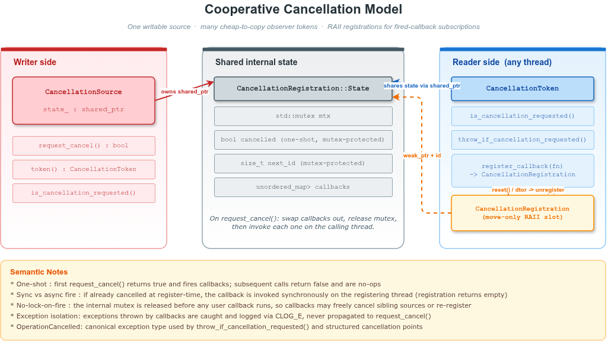

VLink 的协作取消基于 **生产者 / 观察者** 模式：写方持有 `CancellationSource` 并通过
`request_cancel()` 发出取消信号；工作任务持有从同一 source 获得的 `CancellationToken`
（轻量、可复制、可跨线程），通过轮询或注册回调来响应。

> 头文件：`<vlink/base/cancellation.h>`、`<vlink/base/exception.h>`（`OperationCancelled`）

### 11.17.1 类型概览

| 类型                       | 角色                                                   | 拷贝/移动语义                |
| -------------------------- | ------------------------------------------------------ | ---------------------------- |
| `CancellationSource`       | 可变端，发出取消请求                                   | 可拷贝、可移动（句柄语义：所有副本共享同一取消状态） |
| `CancellationToken`        | 只读观察者；可轮询、可注册回调                          | 可拷贝、可跨线程共享          |
| `CancellationRegistration` | RAII 槽，持有一个已注册回调                            | 只可移动                     |
| `OperationCancelled`       | 已观察到取消请求的异常类型（派生自 `std::exception`） | 终态语义，由调用方抛出      |

### 11.17.2 基本用法

```cpp
#include <vlink/base/cancellation.h>

vlink::CancellationSource source;
auto token = source.token();           // 轻量、可拷贝

// 注册一个一次性回调，在 source.request_cancel() 触发时执行
auto reg = token.register_callback([]() {
    VLOG_I("cancellation observed");
});

// 工作线程协作式取消
std::thread worker([token]() {
    while (!token.is_cancellation_requested()) {
        token.throw_if_cancellation_requested();   // 可选：等价 throw OperationCancelled
        do_unit_of_work();
    }
});

// 任意时刻请求取消（线程安全）
source.request_cancel();
worker.join();
```

### 11.17.3 语义要点

- **一次性触发**：`request_cancel()` 首次成功调用返回 `true` 并触发所有已注册回调；
  后续调用返回 `false` 且不会再触发。
- **同步触发**：若注册回调时 token 已被取消，回调在 `register_callback` 内部**同步**
  执行（在当前线程，由调用方持有时间），返回的 `CancellationRegistration` 为空。
- **异常吞噬**：回调抛出的异常会被 `try { callback(); } catch(...) {}` 捕获并通过
  `CLOG_E` 记录，**绝不**逃逸到 `request_cancel()` 或注册方。
- **锁顺序**：触发回调时**不持有**内部 mutex；回调可自由调用同一 token 的
  `register_callback` / `is_cancellation_requested`，亦可触发**兄弟** source 的
  `request_cancel`，不会自死锁。
- **生命周期**：所有类型通过 `shared_ptr<State>` 共享内部状态，`CancellationRegistration`
  析构或 `reset()` 在 callback 未触发时取消订阅，已触发则为 no-op。`CancellationRegistration`
  幂等且可重复 `reset()`。

### 11.17.4 与 TaskHandle 集成

`PostTaskOptions::cancellation_token` 是 `TaskHandle` 的父级 token：

- 投递时若 token 已 cancelled，句柄立即进入 `kCancelled`，任务不会入队。
- 任务排队期间 token 被取消 → dispatcher 出队时跳过该任务，句柄进入 `kCancelled`。
- 任务正在执行时 token 被取消 → 回调需自行轮询
  `task_handle.cancellation_token().is_cancellation_requested()` 才能感知。
- `TaskHandle::cancel()` 仅翻转**任务自身**的 `CancellationSource`，不影响父 token。
- 任意终态（`kCompleted` / `kCancelled` / `kDropped` / `kRejected` / `kFailed`）下，
  `release_parent_registration` 会卸下 parent token 的回调，避免 source 链路上的资源
  长期占用。

### 11.17.5 协作取消的常见用法模式

```cpp
// 1. fan-out 取消
vlink::CancellationSource group;
for (int i = 0; i < 8; ++i) {
    vlink::PostTaskOptions opts;
    opts.cancellation_token = group.token();
    pool.post_task_handle([t = opts.cancellation_token, i] {
        while (!t.is_cancellation_requested()) work(i);
    }, opts);
}
if (some_global_failure) group.request_cancel();   // 一次性砍掉整组

// 2. 父子链
vlink::CancellationSource parent;
auto child_token = parent.token();
auto child_reg = child_token.register_callback([child_source = std::ref(child)]() {
    child_source.get().request_cancel();   // 父 → 子级联
});
parent.request_cancel();   // 同时取消子链

// 3. 结构化退出
try {
    while (!token.is_cancellation_requested()) {
        token.throw_if_cancellation_requested();
        ...
    }
} catch (const vlink::OperationCancelled&) {
    cleanup();
}
```

### 11.17.6 OperationCancelled

`OperationCancelled` 是协作取消的**规范化异常类型**，`what()` 返回固定字符串
`"vlink operation cancelled"`。任何感知到取消请求且需要中断的代码都应抛出此类型；
顶层的 `co_spawn` / `GraphTask` 回调均按惯例捕获并仅记日志，不再上抛。

```cpp
class CancelAwareTask {
 public:
    void run(vlink::CancellationToken token) {
        while (true) {
            token.throw_if_cancellation_requested();  // 抛 OperationCancelled
            step();
        }
    }
};
```

> **不要**用 `OperationCancelled` 表示通用错误；它的语义专门是"协作取消已被观察"。
> 通用错误使用 `Exception::RuntimeError` 等普通类型。

---

## 11.18 协程 Coroutine

`vlink::Coroutine`（短别名 `vlink::Co`）基于 C++20 stackless 协程构建在 VLink 现有调度
原语之上，使所有挂起 / 恢复都绕回 `MessageLoop`，因此协程体的所有语句（除 `await_future`
的等待瞬间外）都在 loop 线程上运行，共享状态无需加锁。

> 头文件：`<vlink/base/coroutine.h>`
> 构建：需 `ENABLE_CXX_STD_20=ON` 且编译器具备 `__cpp_lib_coroutine`（GCC 10+ / Clang 14+ / MSVC 19.x+）。
> 帧分配走 `vlink::MemoryPool::global_instance()`，无需额外配置。
> 端到端教程见 [examples/base/message_loop_coroutine/README.md](../examples/base/message_loop_coroutine/README.md)。

### 11.18.1 三件套

```cpp
vlink::Co::Task<int> compute(vlink::MessageLoop& loop) {
    co_await vlink::Co::yield(loop);          // 协作让出
    co_await vlink::Co::delay_ms(loop, 100);  // 非阻塞睡眠
    co_return 42;
}
```

- `co_await awaiter` —— 唯一挂起点。
- `co_return value` —— 设置返回值并结束。
- `co_yield` —— 在 VLink 中通常通过 `vlink::Co::yield()` awaiter 表达。

### 11.18.2 Task<T>

由协程函数返回的句柄；可被 `co_await`、可 `valid()` 校验、`move` 转移，不可拷贝。

```cpp
vlink::Co::Task<void> top(vlink::MessageLoop& loop) {
    vlink::Co::Task<int> sub = compute(loop);
    int v = co_await std::move(sub);          // 嵌套 await
    VLOG_I("got ", v);
}
```

### 11.18.3 启动协程：co_spawn

```cpp
vlink::MessageLoop loop;
loop.async_run();

// fire-and-forget 提交（默认优先级）
vlink::Co::co_spawn(loop, top(loop));

// 带优先级（仅 kPriorityType 队列上生效；非优先级队列上 priority 被忽略，
//          投递仍走 post_task_handle 而不会失败）
vlink::Co::co_spawn_with_priority(loop, top(loop), vlink::MessageLoop::kHighestPriority);

// 也可附加完成回调（值任务必须用 Task<T>，回调签名为 void(T)；void 任务回调签名为 void()）：
auto handler = [](int v) { VLOG_I("done v=", v); };
vlink::Co::co_spawn(loop, compute(loop), handler);
```

`co_spawn` 接收一个 `Task<void>`（值返回版本用三参数重载并指定 `Task<T>`），注意**不要**把
临时表达式直接传入；如需在内部嵌套 `co_await`，先 `auto t = top(loop);` 持有再传入。
完成回调路径下，回调由 `DetachedTask` 顶层 catch 守护，若 `Task` 本身抛异常，回调**不会**被调用。

### 11.18.4 Awaiter 总览

| Awaiter                                | 作用                                                       | 失败语义 |
|----------------------------------------|------------------------------------------------------------|----------|
| `vlink::Co::schedule(loop, prio=0)`    | 切换到指定 `MessageLoop` 线程继续执行                       | post 失败重试耗尽 → `std::runtime_error("vlink::Coroutine::schedule: post_task to loop failed")` |
| `vlink::Co::yield(loop, prio=0)`       | 协作让出，相当于 `schedule` 同 loop                         | post 失败重试耗尽 → `std::runtime_error("vlink::Coroutine::yield: post_task to loop failed")` |
| `vlink::Co::delay_ms(loop, ms, prio=0)`| 非阻塞睡眠 ms 毫秒（基于 `FutureWaitLoop` 轮询）            | post 失败重试耗尽 → `std::runtime_error("vlink::Coroutine::delay_ms: post_task to loop failed")` |
| `vlink::Co::await_future(loop, fut)`   | 等待 `std::future<T>` 结果并切回 loop 线程                  | 正常路径：`future.get()` 抛出的任意异常透传；loop 关闭无法投递回 resume → `OperationCancelled` |
| `vlink::Co::await_graph(loop, graph)`  | 等待 `GraphTask` DAG 全部完成；`graph==nullptr` 时构造抛 `std::invalid_argument` | 投递失败 / loop 已死 → `OperationCancelled` |

### 11.18.5 编排：when_all / when_any / sequence

```cpp
vlink::Co::Task<void> orchestrate(vlink::MessageLoop& loop) {
    // 并发等所有完成（异常透传，多个异常仅保留首个）
    co_await vlink::Co::when_all(loop, make_tasks());

    // 并发等任意一个先完成；返回 winner 下标
    size_t winner = co_await vlink::Co::when_any(loop, make_tasks());

    // 串行执行
    co_await vlink::Co::sequence(loop, make_tasks());
}
```

### 11.18.6 Resume 错误语义

协程恢复使用 `kProtected` + `kReject` 选项 post 到 loop：

- **lock-free 类型 MessageLoop 的特殊性**：`kProtected` 在 lock-free 队列上不生效，
  但 `kReject` 仍然防止队列已满时入队。若 post 因队列瞬时满返回失败，恢复路径会通过
  `FutureWaitLoop` 在内部最多重试 `kMaxResumePostRetry`（=30000）次后才放弃。
- **彻底失败**：超时或 loop 已不再 alive：
  - `schedule` / `yield` / `delay_ms` 的 `await_resume` 会抛
    `runtime_error("vlink::Coroutine::xxx: post_task to loop failed")`。
  - `await_graph` 抛 `OperationCancelled`。
- **lifetime 安全**：所有 awaiter 使用 `MessageLoopAliveState` 在每次 post 前做一次
  alive-check，loop 析构时这些 await 路径会进入 fail 分支而非 UAF。

### 11.18.7 与 GraphTask 集成

```cpp
vlink::Co::Task<void> wait_dag(vlink::MessageLoop& loop) {
    auto root = vlink::GraphTask::create("root", []{ ... });
    auto leaf = vlink::GraphTask::create("leaf", []{ ... });
    *root -- > *leaf;
    root->execute(&loop);

    co_await vlink::Co::await_graph(loop, root);   // 等整张图完成
    VLOG_I("DAG done");
}
```

`await_graph` 在内部 `register_status_callback` 监听 root 的 `kStatusDone`，避免轮询；
若 graph 已经 `kStatusDone`，`await_ready` 直接返回 `true`，不会挂起。

### 11.18.8 与 std::future 桥接

```cpp
vlink::Co::Task<int> bridge(vlink::MessageLoop& loop, std::future<int> fut) {
    int v = co_await vlink::Co::await_future(loop, std::move(fut));
    co_return v;
}
```

`await_future` 通过 `FutureWaitLoop`（单独的后台轮询线程，约 1ms 节拍）等待 future ready，
ready 后用 `schedule` 切回 loop。**不会**在 loop 线程上 `.get()`，从而避免阻塞 dispatch。

### 11.18.9 错误处理

| 场景                                         | 行为                                                     |
|----------------------------------------------|----------------------------------------------------------|
| 协程内异常 throw                              | 沿 `co_await` 链路向外传，`co_spawn` 顶层 catch 并 log    |
| `Task<T>` 未完成即析构                         | 帧自动释放；如尚有 await 链路则正常 cancellation         |
| `MessageLoop` 析构时仍有挂起协程               | `MessageLoopAliveState` 让 awaiter 走 fail 分支并放弃     |
| `kMaxResumePostRetry`（30000）耗尽            | `schedule` / `yield` / `delay_ms` 抛 `std::runtime_error`；`await_graph` / `await_future` 抛 `OperationCancelled` |
| `co_await invalid_or_moved_Task<T>`           | 抛 `std::logic_error("Task::await_resume on invalid Task ...")` |
| `await_graph(loop, nullptr)`                  | 抛 `std::invalid_argument`                              |
| `when_any` 传入空 vector                      | 抛 `std::invalid_argument`                              |

完整运行示例：[examples/base/message_loop_coroutine/](../examples/base/message_loop_coroutine/README.md)。

---
