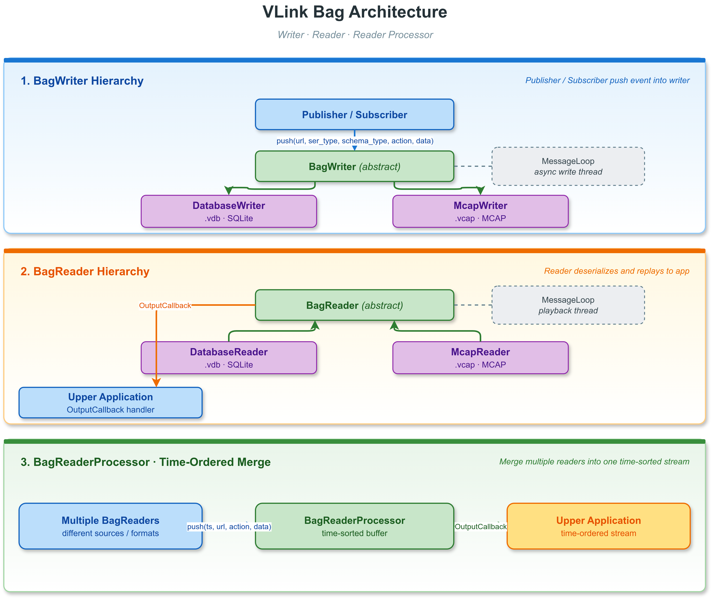
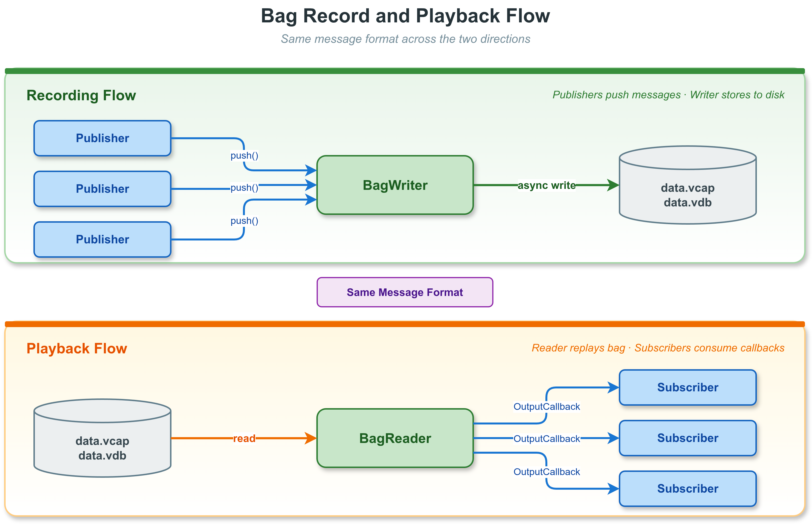
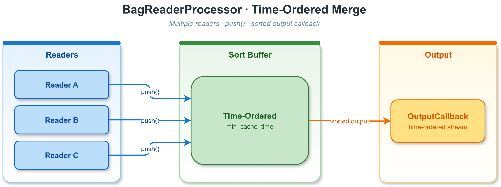

# 12. 录制与回放

VLink 提供完整的消息录制与回放功能，支持将通信消息持久化到文件，
并在离线状态下以任意速率重新播放。这一能力类似于 ROS 的 `rosbag`，
可用于调试、数据分析、仿真回灌等场景。

> **相关文档**：CLI 录制/回放工具 `vlink-bag` 的详细用法参见 [13-cli-tools.md](13-cli-tools.md#137-vlink-bag--数据录制与回放)；可视化回放器参见 [14-viewer.md](14-viewer.md#146-vlink-player--bag-文件回放播放器)；录制相关环境变量参见 [21-environment-vars.md](21-environment-vars.md#218-bag-录制环境变量)。

---

## 12.1 概念与架构



### 12.1.1 录制与回放完整流程



---

## 12.2 文件格式支持

| 格式 | 扩展名             | 后端实现                       | 压缩算法                |
| ---- | ------------------ | ------------------------------ | ----------------------- |
| VDB  | `.vdb` / `.vdbx`   | DatabaseWriter/Reader (SQLite) | LZAV（唯一实际算法）    |
| VCAP | `.vcap` / `.vcapx` | McapWriter/Reader              | Zstandard（唯一实际算法）|

`BagWriter::create()` 和 `BagReader::create()` 按文件扩展名自动选择实现：
`.vcap` / `.vcapx` 走 MCAP，其他扩展名一律走 SQLite。两种后端共用统一的 `BagWriter` /
`BagReader` 抽象接口和 `Config` 结构。

---

## 12.3 BagWriter — 录制接口

### 12.3.1 概述

`vlink::BagWriter` 继承自 `MessageLoop`，所有写入操作在内部循环线程上异步执行。
`push()` 方法线程安全、非阻塞，适合在通信回调中直接调用。

### 12.3.2 创建 Writer

```cpp
#include <vlink/extension/bag_writer.h>

// 自动选择格式（.vcap/.vcapx → MCAP，其余路径 → SQLite/DatabaseWriter）
auto writer = vlink::BagWriter::create("/data/recording.vdb");

// 带配置创建
vlink::BagWriter::Config config;
// SQLite 后端：kCompressAuto 或 kCompressLzav -> LZAV；其他值在此后端等同不压缩
// MCAP 后端：  kCompressAuto 或 kCompressZstd -> Zstd；其他值在此后端等同不压缩
config.compress       = vlink::BagWriter::kCompressAuto;
config.split_by_size  = 1024LL * 1024 * 1024;  // 每 1 GiB 分割
config.split_by_time  = 60LL * 1000;           // 每 60 秒分割（毫秒）
config.wal_mode       = true;                  // SQLite WAL 模式
config.tag_name       = "test_run_001";
config.max_task_depth = 50000;                 // 默认 20000

auto writer = vlink::BagWriter::create("/data/recording.vdb", config);

// 启动录制线程
writer->async_run();
```

### 12.3.3 录制消息

```cpp
// 录制一条消息（非阻塞，异步写入）
vlink::Bytes payload = serialize_my_msg(msg);
writer->push(
    "dds://sensors/lidar",   // URL
    "demo.proto.PointCloud", // 具体序列化类型名
    vlink::SchemaType::kProtobuf,  // 粗粒度 schema 家族
    vlink::ActionType::kPublish,
    payload
);

// 使用自定义时间戳（微秒）
int64_t ts = get_my_timestamp_us();
writer->push("dds://sensors/camera", "raw", vlink::SchemaType::kRaw, vlink::ActionType::kPublish,
             frame_data, &ts);

// 同步写入（绕过队列，阻塞直到写完）
writer->push("dds://debug", "raw", vlink::SchemaType::kRaw, vlink::ActionType::kPublish,
             debug_data, nullptr, /*immediate=*/true);
```

### 12.3.4 压缩类型

`CompressType` 枚举（`bag_writer.h`）：

| 枚举            | 值 |
| --------------- | -- |
| `kCompressNone` | 0  |
| `kCompressAuto` | 1  |
| `kCompressZstd` | 2  |
| `kCompressLz4`  | 3  |
| `kCompressLzav` | 4  |

**各后端的实际行为**（源码参见 `database_writer.cc:184`、`mcap_writer.cc:163`）：

| 后端                         | 启用压缩条件                         | 实际使用算法 | 其他枚举值 |
| ---------------------------- | ------------------------------------ | ------------ | ---------- |
| SQLite（`.vdb` / `.vdbx`）   | `kCompressAuto` 或 `kCompressLzav`    | **仅 LZAV**      | `kCompressZstd` / `kCompressLz4` / `kCompressNone` 一律不压缩 |
| MCAP（`.vcap` / `.vcapx`）   | `kCompressAuto` 或 `kCompressZstd`    | **仅 Zstandard** | `kCompressLz4` / `kCompressLzav` / `kCompressNone` 一律不压缩；若编译时未启用 `ENABLE_ZSTD` 也不压缩 |

**枚举名不代表后端实际支持**：文档里不要写"SQLite 支持 zstd/lz4"或"MCAP 支持 LZAV"。

**其他压缩相关参数**：
- `compress_start_size`（默认 128 字节）：小于此大小的 payload 不压缩。
- `compress_level`：SQLite 后端仅区分 `> 3`（LZAV 高压缩比模式）与 `<= 3`（普通模式）；
  MCAP 后端映射到 `mcap::CompressionLevel`（0=Default、1=Fastest、2=Fast、3=Default、4=Slow、5=Slowest）。
- `ignore_compress_urls`：集合中的 URL 永不压缩，即使启用了压缩。

### 12.3.5 文件分割

```cpp
// 按文件大小分割（每 1 GiB 新建一个文件）
config.split_by_size = 1024LL * 1024 * 1024;

// 按时间分割（每 5 分钟新建一个文件）
config.split_by_time = 5LL * 60 * 1000; // 毫秒（每 5 分钟）

// 文件名附加时间戳：recording_20260318_120000.vdb
config.split_name_by_time = true;

// 注册分割事件回调
writer->register_split_callback(
    [](int index, const std::string& filename) {
        VLOG_I("split #", index, " -> ", filename);
    },
    /*before=*/false // false = 新文件创建后触发
);
```

分割文件命名规则：
- 主文件：`recording.vdb`
- 分割 1：`recording_1.vdb`（或 `recording_1_20260318_120000.vdb`）
- 分割 2：`recording_2.vdb`

### 12.3.6 Schema 嵌入

```cpp
// 懒加载 schema：当新 ser_type 首次写入时按需提供 schema
writer->register_schema_callback(
    [](const std::string& ser_type, vlink::SchemaType schema_type) -> vlink::SchemaData {
        // 根据 (ser_type, schema_type) 返回对应的 schema descriptor
        return get_schema_for_type(ser_type, schema_type);
    });

// 已知 schema 字节时，推荐直接嵌入
vlink::SchemaData schema;
schema.name = "sensors.LidarPoint";
schema.encoding = "protobuf";
schema.schema_type = vlink::SchemaType::kProtobuf;
schema.data = proto_file_descriptor_bytes;
writer->push_schema(schema);
```

### 12.3.7 Config 参数完整说明

| 参数                    | 默认值       | 说明                               |
| ----------------------- | ------------ | ---------------------------------- |
| `tag_name`              | 空           | 录制标签，存储在文件头             |
| `compress`              | `kCompressNone` | 压缩算法                        |
| `wal_mode`              | `false`      | SQLite WAL 模式，提高崩溃恢复能力  |
| `enable_limit`          | `false`      | 启用行数/字节数上限                |
| `split_name_by_time`    | `false`      | 分割文件名附加时间戳               |
| `sync_mode`             | `false`      | 同步写盘（更安全但更慢）           |
| `optimize_on_exit`      | `false`      | 关闭时执行 VACUUM/优化             |
| `max_row_count`         | 50 亿        | 上限，仅当 `enable_limit=true` 时生效；超出后停止录制（不是分割） |
| `max_bytes_size`        | 512 GiB      | 上限，仅当 `enable_limit=true` 时生效；超出后停止录制（不是分割） |
| `split_by_size`         | 1 GiB        | 按大小分割阈值                     |
| `split_by_time`         | 0（禁用）    | 按时间分割（毫秒）                 |
| `cache_size`            | 4 MiB        | SQLite 页缓存大小                  |
| `begin_time`            | 0            | 录制起始时间戳（毫秒），0 表示立即开始 |
| `compress_start_size`   | 128 bytes    | 小于此大小不压缩                   |
| `compress_level`        | 3            | 压缩级别（算法相关）               |
| `max_task_depth`        | 20000        | 最大排队写入任务数                 |
| `max_memory_size`       | 2 GiB        | 最大内存缓存大小                   |
| `start_timestamp`       | 0            | 覆盖 bag 起始时间戳（毫秒），0 使用系统时间 |
| `ignore_compress_urls`  | 空集合       | 这些 URL 的消息永不压缩            |

### 12.3.8 全局 Writer（环境变量激活）

```bash
# 必选：设置后首次调用 global_get() 会用默认 Config 自动 create() 并 async_run()
export VLINK_BAG_PATH=/data/auto_record.vdb

# 可选：当某个 Writer 的 Config::tag_name 为空时，写入的 tag_name 会回退到此值
# （未设置时默认为字符串 "Empty"）
export VLINK_BAG_TAG=my_session
```

```cpp
// 未设置 VLINK_BAG_PATH 时返回 nullptr
auto* gw = vlink::BagWriter::global_get();
if (gw) {
    gw->push("dds://my/topic", "demo.proto.PointCloud", vlink::SchemaType::kProtobuf,
             vlink::ActionType::kPublish, data);
}
```

全局 Writer 由进程级静态变量持有，析构时自动 flush。注意全局 Writer 的 Config
固定为默认值（不读取 `VLINK_BAG_TAG` 作为 `Config::tag_name`）；
`VLINK_BAG_TAG` 仅作为所有 Writer 在 `Config::tag_name` 为空时的兜底。

### 12.3.9 按路径取共享 Writer（filter_get）

```cpp
// 按路径在全局表中获取/创建一个 Writer。
// 若已存在则直接返回；不存在时会用默认 Config 创建并自动 async_run()，
// 因此返回的 shared_ptr 永远非空。最后一个引用释放时自动从全局表注销。
auto writer = vlink::BagWriter::filter_get("/data/recording.vdb");
writer->push(...);
```

---

## 12.4 BagReader — 回放接口

### 12.4.1 概述

`vlink::BagReader` 继承自 `MessageLoop`，回放在内部循环线程上驱动。
可配置回放速率、时间范围、循环次数和 URL 过滤。

### 12.4.2 创建 Reader

```cpp
#include <vlink/extension/bag_reader.h>

// 自动选择格式（只读模式）
auto reader = vlink::BagReader::create("/data/recording.vdb");

// 可读写模式（支持 tag() 等写操作）
auto rw_reader = vlink::BagReader::create("/data/recording.vdb",
                                          /*read_only=*/false);

// 尝试修复损坏的文件
auto fixed_reader = vlink::BagReader::create("/data/corrupt.vdb",
                                             /*read_only=*/true,
                                             /*try_to_fix=*/true);
```

### 12.4.3 读取 Bag 信息

打开后立即可读取文件元数据（无需启动回放）：

```cpp
const auto& info = reader->get_info();
VLOG_I("file: ", info.file_name);
VLOG_I("duration: ", info.total_duration / 1000, " seconds");
VLOG_I("messages: ", info.message_count);
VLOG_I("version: ", info.version);
VLOG_I("compression: ", info.compression_type);

// 每个 URL 的统计
for (const auto& meta : info.url_metas) {
    VLOG_I("  ", meta.url,
           " count=", meta.count,
           " freq=", meta.freq, " Hz",
           " size=", meta.size / 1024, " KB",
           " ser=", meta.ser_type);
}
```

### 12.4.4 注册回调

```cpp
// 消息输出回调（核心）
reader->register_output_callback(
    [](int64_t timestamp, const std::string& url,
       vlink::ActionType action, const vlink::Bytes& data) {
        // timestamp: 录制时的微秒时间戳
        // data: 序列化 payload（有效期仅限回调内）
        VLOG_I("ts=", timestamp, " url=", url,
               " size=", data.size());
    });

// 状态变化回调
// 枚举值：kStopped=0, kPaused=1, kPlaying=2
reader->register_status_callback([](vlink::BagReader::Status s) {
    const char* names[] = {"stopped", "paused", "playing"};
    VLOG_I("playback status: ", names[(int)s]);
});

// 就绪回调（文件解析完成、可以开始播放）
reader->register_ready_callback([] {
    VLOG_I("bag reader ready");
});

// 完成回调
reader->register_finish_callback([](bool interrupted) {
    VLOG_I("playback finished, interrupted=", interrupted);
});
```

### 12.4.5 启动回放

```cpp
// 必须先启动循环线程
reader->async_run();

// 配置回放参数
vlink::BagReader::Config cfg;
cfg.rate        = 1.0;                    // 实时速率
cfg.times       = 1;                      // 播放 1 次
cfg.begin_time  = 0;                      // 从头开始（毫秒，相对录制起点）
cfg.end_time    = 0;                      // 播放到结尾（毫秒，相对录制起点；0 表示不限）
cfg.skip_blank  = true;                   // 跳过静默间隔

// 仅播放指定 URL（为空则播放全部）
cfg.filter_urls = {"dds://sensors/lidar", "dds://sensors/camera"};

// 开始播放
reader->play(cfg);
```

### 12.4.6 回放控制

```cpp
// 暂停
reader->pause();

// 恢复
reader->resume();

// 单步前进（暂停状态下前进一条消息）
reader->pause_to_next();

// 跳转到指定时间（相对于录制起始，毫秒）
reader->jump(5 * 1000LL, /*rate=*/1.0, /*times=*/1,
             /*force_to_play=*/true);  // 跳转到第 5 秒

// 停止并重置到开头
reader->stop();

// 查询当前状态
vlink::BagReader::Status status = reader->get_status();
int64_t current_ts   = reader->get_timestamp();      // 当前消息时间戳（毫秒，相对于录制起点；注意 OutputCallback 给的时间戳是微秒）
int64_t elapsed_real = reader->get_real_timestamp();  // 实际经过时间
bool is_jumping      = reader->is_jumping();
```

### 12.4.7 速率控制示例

```cpp
// 2x 加速回放
cfg.rate = 2.0;

// 0.5x 慢速（50% 速度）
cfg.rate = 0.5;

// 强制固定时间间隔（忽略原始时间戳，每条消息间隔 10ms）
// 默认值 -1 表示使用原始时间戳间隔
cfg.force_delay = 10; // 毫秒

// 无限循环回放
cfg.times = vlink::BagReader::kInfinite; // -1

// 自动退出循环线程（播放完成后自动 quit）
cfg.auto_quit = true;
```

### 12.4.8 时间范围过滤

```cpp
// 只播放第 10 秒到第 30 秒的内容（begin_time/end_time 单位：毫秒，相对录制起点）
cfg.begin_time = 10 * 1000LL;  // 从第 10 秒（10000 ms）开始
cfg.end_time   = 30 * 1000LL;  // 播放到第 30 秒（30000 ms）
reader->play(cfg);
```

### 12.4.9 文件完整性与修复

```cpp
// 检查文件完整性（异步，后台线程执行）
auto check_future = reader->check();
bool ok = check_future.get();

// 重建索引（适用于索引损坏但数据完好的情况）
auto reindex_future = reader->reindex();
bool reindexed = reindex_future.get();

// 修复损坏文件
auto fix_future = reader->fix(/*rebuild=*/false);
bool fixed = fix_future.get();

// 完全重建（从头扫描数据）
auto rebuild_future = reader->fix(/*rebuild=*/true);
bool rebuilt = rebuild_future.get();
```

### 12.4.10 Proto Schema 检测

```cpp
// 获取 bag 中内嵌的所有 Protobuf Schema
auto schemas = reader->detect_schema();
for (const auto& s : schemas) {
    VLOG_I("schema: ", s.name);
}

// 获取特定 URL 的序列化类型
std::string ser = reader->get_ser_type("dds://sensors/lidar");
// ser == "demo.proto.PointCloud" 或 "raw" 等
```

---

## 12.5 McapWriter / McapReader — MCAP 格式

MCAP（Message Capture Archive Protocol）是面向时间序列消息的索引化二进制格式，
可被 Foxglove Studio 直接打开。VLink 的 MCAP 支持需要编译时启用 `ENABLE_ZSTD`
才能启用压缩。

### 12.5.1 McapWriter

```cpp
#include <vlink/extension/mcap_writer.h>

// 显式使用 McapWriter；更常见的做法是直接调用 BagWriter::create("/path.vcap")
vlink::BagWriter::Config config;
config.compress = vlink::BagWriter::kCompressZstd;  // MCAP 下实际启用 Zstd

auto writer = std::make_shared<vlink::McapWriter>("/data/recording.vcap", config);
writer->async_run();

writer->push("dds://sensors/lidar", "demo.proto.PointCloud", vlink::SchemaType::kProtobuf,
             vlink::ActionType::kPublish, lidar_data);
```

### 12.5.2 McapReader

```cpp
#include <vlink/extension/mcap_reader.h>

auto reader = std::make_shared<vlink::McapReader>("/data/recording.vcap");
reader->register_output_callback([](int64_t ts, const std::string& url,
                                    vlink::ActionType action,
                                    const vlink::Bytes& data) {
    // 处理消息
});
reader->async_run();

vlink::BagReader::Config cfg;
cfg.rate = 1.0;
reader->play(cfg);
```

MCAP 格式特点：
- 文件头包含 Schema 和 Channel 元数据，支持离线自省。
- 支持随机访问（索引化）。
- 可被 Foxglove Studio 直接打开可视化。
- 与 `.vdb` 共用同一个 `Config` 结构和 `play()` / `register_output_callback()` 接口；
  压缩算法固定为 Zstandard。

---

## 12.6 BagReaderProcessor — 多文件时序合并

### 12.6.1 功能概述

`vlink::BagReaderProcessor` 是一个时序排序处理器，用于同时读取**多个 BagReader**
（如录制时按大小或时间分割产生的多个文件），将来自不同文件的消息按时间戳排序后，
以正确的时序顺序输出到统一的回调。

典型使用场景：

- 分片录制文件的有序回放（如按 1 GiB 分割的多个 `.vdb` 文件）
- 多传感器分别录制后的时间对齐合并
- 多源数据流的离线时序重建

### 12.6.2 原理



内部维护一个基于 `std::deque` 的排序队列和一个独立的处理线程。
多个 Reader 的回调线程通过 `push()` 将消息送入队列，处理器在缓冲窗口
（`min_cache_time`）满足后，按时间戳顺序逐条输出到 `OutputCallback`。

工作流程：

1. 多个 BagReader 各自在独立线程中读取消息
2. 每条消息通过 `push()` 进入 BagReaderProcessor 的内部队列（线程安全）
3. 处理线程检查队列首尾时间差是否超过 `min_cache_time`
4. 满足条件后，按原始推送时间间隔依次输出，还原录制时的时序节奏
5. 当缓存大小达到 `max_cache_size` 上限时，`push()` 会阻塞等待消费

### 12.6.3 Config 配置

```cpp
struct Config final {
    int64_t min_cache_time{500};                    // 最小缓冲时间（毫秒）
    int64_t max_cache_size{1024UL * 1024UL * 256};  // 最大缓存大小（字节）
};
```

| 参数              | 默认值    | 说明                                               |
| ----------------- | --------- | -------------------------------------------------- |
| `min_cache_time`  | 500 ms    | 队列首尾时间差达到此值后才开始输出，用于吸收乱序   |
| `max_cache_size`  | 256 MiB   | 缓存字节上限，超过时 push() 阻塞等待消费           |

`min_cache_time` 的选取建议：

- 设置过小（如 100 ms）可能导致来自不同文件的消息未完全排序就被输出
- 设置过大（如 5000 ms）会增加内存占用和输出延迟
- 通常 500 ms 可满足大多数场景

### 12.6.4 API 说明

| 方法                                                                     | 说明                                           |
| ------------------------------------------------------------------------ | ---------------------------------------------- |
| `BagReaderProcessor(const Config& config = Config())`                    | 构造并启动内部处理线程                         |
| `~BagReaderProcessor()`                                                  | 析构，刷新剩余缓存消息并停止处理线程           |
| `register_output_callback(OutputCallback&& cb)`                          | 注册时序排序后的输出回调，仅支持一个           |
| `push(int64_t timestamp, const string& url, ActionType action, const Bytes& data)` | 推入一条消息，线程安全，可能阻塞       |

`OutputCallback` 签名：

```cpp
using OutputCallback = vlink::MoveFunction<void(
    int64_t timestamp,        // 消息时间戳（微秒）
    const std::string& url,   // Topic URL
    ActionType action_type,   // 动作类型
    const Bytes& data         // 序列化 payload
)>;
```

### 12.6.5 基本使用示例

```cpp
#include <vlink/extension/bag_reader.h>
#include <vlink/extension/bag_reader_processor.h>
#include <vlink/base/logger.h>

int main() {
    vlink::Logger::init("processor-demo");

    // 1. 配置处理器
    vlink::BagReaderProcessor::Config proc_cfg;
    proc_cfg.min_cache_time = 500;                // 500 毫秒缓冲窗口
    proc_cfg.max_cache_size = 256 * 1024 * 1024;  // 最大 256 MiB 内存缓存

    vlink::BagReaderProcessor processor(proc_cfg);

    // 2. 注册输出回调（按时序接收排序后的消息）
    processor.register_output_callback(
        [](int64_t ts, const std::string& url,
           vlink::ActionType action, const vlink::Bytes& data) {
            VLOG_I("[ordered] ts=", ts, " url=", url,
                   " size=", data.size());
        });

    // 3. 创建多个分割文件的 Reader
    auto reader_a = vlink::BagReader::create("/data/recording_0.vdb");
    auto reader_b = vlink::BagReader::create("/data/recording_1.vdb");

    // 4. 将每个 Reader 的输出汇入 processor
    reader_a->register_output_callback(
        [&](int64_t ts, const std::string& url,
            vlink::ActionType action, const vlink::Bytes& data) {
            processor.push(ts, url, action, data);
        });

    reader_b->register_output_callback(
        [&](int64_t ts, const std::string& url,
            vlink::ActionType action, const vlink::Bytes& data) {
            processor.push(ts, url, action, data);
        });

    // 5. 启动回放
    reader_a->async_run();
    reader_b->async_run();

    vlink::BagReader::Config cfg;
    cfg.rate = 1.0;
    cfg.auto_quit = true;

    reader_a->play(cfg);
    reader_b->play(cfg);

    reader_a->wait_for_quit();
    reader_b->wait_for_quit();

    // processor 析构时会刷新剩余缓存
    return 0;
}
```

### 12.6.6 多传感器分割文件合并回放

```cpp
#include <vlink/extension/bag_reader.h>
#include <vlink/extension/bag_reader_processor.h>
#include <vlink/vlink.h>

int main() {
    vlink::Logger::init("merge-playback");

    // 假设录制时按 1 GiB 分割，产生了 3 个文件
    std::vector<std::string> files = {
        "/data/drive_0.vdb",
        "/data/drive_1.vdb",
        "/data/drive_2.vdb"
    };

    vlink::BagReaderProcessor processor;

    // 回放到 VLink 通信网络
    vlink::Publisher<vlink::Bytes> pub("dds://replay/merged");

    processor.register_output_callback(
        [&](int64_t ts, const std::string& url,
            vlink::ActionType action, const vlink::Bytes& data) {
            pub.publish(data);
        });

    // 为每个文件创建 Reader 并连接到 processor
    std::vector<std::shared_ptr<vlink::BagReader>> readers;

    for (const auto& file : files) {
        auto reader = vlink::BagReader::create(file);

        reader->register_output_callback(
            [&](int64_t ts, const std::string& url,
                vlink::ActionType action, const vlink::Bytes& data) {
                processor.push(ts, url, action, data);
            });

        reader->async_run();
        readers.push_back(reader);
    }

    // 同时启动所有 Reader
    vlink::BagReader::Config cfg;
    cfg.rate = 1.0;

    for (auto& reader : readers) {
        reader->play(cfg);
    }

    // 等待所有回放完成
    for (auto& reader : readers) {
        reader->wait_for_quit();
    }

    return 0;
}
```

### 12.6.7 注意事项

- `push()` 是线程安全的，可从多个 Reader 的回调线程并发调用
- 当缓存达到 `max_cache_size` 上限时，`push()` 会阻塞直到消费线程释放空间
- 析构时会自动刷新队列中的剩余消息并停止处理线程
- 仅支持注册一个 `OutputCallback`，后续注册会替换前一个
- `OutputCallback` 在内部处理线程中调用，回调内不应执行长耗时操作

---

## 12.7 支持的序列化格式

| `ser_type` 字符串示例          | 序列化格式         | 说明                                |
| ------------------------------ | ------------------ | ----------------------------------- |
| `"demo.proto.PointCloud"`      | Protocol Buffers   | 具体消息类型名，`schema_type` 应为 `kProtobuf` |
| `"demo.fbs.CameraFrame"`       | FlatBuffers        | 具体表类型名，`schema_type` 应为 `kFlatbuffers` |
| `"cdr"`                        | CDR（DDS 格式）    | DDS 传输原生格式                    |
| `"raw"`                        | POD / 原始字节     | 无序列化，直接存储，`schema_type` 通常为 `kRaw` |
| `"string"`                     | std::string        | UTF-8 字符串，`schema_type` 通常为 `kRaw` |
| `"custom"`                     | 自定义             | 自定义负载；若无 protobuf/fbs 家族信息，`schema_type` 通常为 `kRaw` |

> 完整的序列化格式列表参见 [06-serialization.md](06-serialization.md)。

对 bag/proxy/viewer/webviz/monitor 这一整条运行时链路来说，`schema_type` 是显式路由信息。
只有确实拿不到 schema 家族时才应使用 `kUnknown`；对 `raw` / `text` / `json` / 自定义字节流，应该优先写入 `kRaw`。

录制时 `ser_type` 原样存入文件，回放时原样提供给 `OutputCallback`，
应用层根据此字段选择对应的反序列化方式。

---

## 12.8 与 VLink 通信 API 集成

在 VLink 节点内录制时，将 BagWriter 注入通信回调是最简洁的模式：

```cpp
#include <vlink/vlink.h>
#include <vlink/extension/bag_writer.h>

// 创建 Writer
auto writer = vlink::BagWriter::create("/data/lidar.vdb");
writer->async_run();

// 订阅并录制
vlink::Subscriber<LidarPoint> sub("dds://sensors/lidar");
sub.listen([&](const LidarPoint& msg) {
    vlink::Bytes bytes;
    vlink::Serializer::serialize(msg, bytes);
    writer->push("dds://sensors/lidar", "demo.proto.PointCloud", vlink::SchemaType::kProtobuf,
                 vlink::ActionType::kPublish, bytes);
    process_lidar(msg);
});
```

回放时反向操作：

```cpp
auto reader = vlink::BagReader::create("/data/lidar.vdb");

// 发布者（用于回灌到系统）
vlink::Publisher<LidarPoint> pub("dds://sensors/lidar");

reader->register_output_callback(
    [&](int64_t ts, const std::string& url,
        vlink::ActionType action, const vlink::Bytes& data) {
        if (url == "dds://sensors/lidar") {
            LidarPoint msg;
            if (vlink::Serializer::deserialize(data, msg)) {
                pub.publish(msg);
            }
        }
    });

reader->async_run();

vlink::BagReader::Config cfg;
cfg.rate = 1.0;
reader->play(cfg);
```

---

## 12.9 与 CLI 工具 vlink-bag 的关联

`vlink-bag` 是命令行工具，底层用的正是本章讨论的 `BagWriter` / `BagReader` /
`McapWriter` / `McapReader` API。完整参数见
[13-cli-tools.md](13-cli-tools.md#137-vlink-bag--数据录制与回放)。

八个子命令：`record` / `play` / `info` / `clone` / `check` / `reindex` / `fix` / `tag`。

```bash
# 录制（录所有发现到的 URL）
vlink-bag record /data/recording.vdb

# 录制指定 URL
vlink-bag record /data/sensors.vdb -u dds://sensors/lidar dds://sensors/camera

# 带压缩录制（SQLite 下启用 LZAV，MCAP 下启用 Zstd）
vlink-bag record /data/recording.vdb -p

# 回放（默认实时速率）
vlink-bag play /data/recording.vdb

# 2x 加速回放
vlink-bag play /data/recording.vdb -r 2.0

# 其余子命令
vlink-bag info    /data/recording.vdb
vlink-bag check   /data/recording.vdb
vlink-bag reindex /data/recording.vdb
vlink-bag fix     /data/recording.vdb
vlink-bag clone   /data/recording.vdb /data/copy.vdb
vlink-bag tag     /data/recording.vdb new_tag_name
```

通过环境变量快速开启进程级录制（详见上节"全局 Writer"）：

```bash
export VLINK_BAG_PATH=/data/auto_record.vdb
./my_vlink_app
```

---

## 12.10 完整录制示例

```cpp
#include <vlink/extension/bag_writer.h>
#include <vlink/base/logger.h>
#include <vlink/base/utils.h>

int main() {
    vlink::Logger::init("bag-demo");

    // 配置：LZAV 压缩（SQLite 后端唯一实际启用的压缩算法），每 1 GiB 分割，WAL 模式
    vlink::BagWriter::Config config;
    config.compress           = vlink::BagWriter::kCompressLzav;
    config.compress_level     = 5;  // > 3 -> LZAV 高压缩比模式
    config.split_by_size      = 1024LL * 1024 * 1024;
    config.split_name_by_time = true;
    config.wal_mode           = true;
    config.tag_name           = "field_test_2026";

    auto writer = vlink::BagWriter::create("/data/field_test.vdb", config);

    writer->register_split_callback(
        [](int idx, const std::string& fname) {
            VLOG_I("new split file: ", fname);
        }, false);

    writer->async_run();

    // 录制循环
    vlink::Utils::register_terminate_signal([&](int) {
        writer->quit();
    });

    // 模拟传感器数据写入
    int seq = 0;
    while (writer->is_running()) {
        vlink::Bytes data = vlink::Bytes::create(256);
        std::memset(data.data(), seq & 0xFF, 256);

        writer->push("intra://sensor/imu", "raw", vlink::SchemaType::kRaw,
                     vlink::ActionType::kPublish, data);
        seq++;

        std::this_thread::sleep_for(std::chrono::milliseconds(10));
    }

    writer->wait_for_quit();
    VLOG_I("recording saved, splits=", writer->get_split_index());
    return 0;
}
```

## 12.11 完整回放示例

```cpp
#include <vlink/extension/bag_reader.h>
#include <vlink/base/logger.h>

int main(int argc, char* argv[]) {
    vlink::Logger::init("bag-play");

    if (argc < 2) {
        VLOG_F("usage: ", argv[0], " <bag_file>");
    }

    auto reader = vlink::BagReader::create(argv[1]);
    const auto& info = reader->get_info();

    VLOG_I("file: ", info.file_name);
    VLOG_I("duration: ", info.total_duration / 1000, " s");
    VLOG_I("messages: ", info.message_count);

    for (const auto& m : info.url_metas) {
        VLOG_I("  [", m.url, "] ",
               m.count, " msgs @ ",
               m.freq, " Hz, ser=", m.ser_type);
    }

    reader->register_status_callback([](vlink::BagReader::Status s) {
        if (s == vlink::BagReader::kStopped) {
            VLOG_I("playback complete");
        }
    });

    reader->register_output_callback(
        [](int64_t ts, const std::string& url,
           vlink::ActionType action, const vlink::Bytes& data) {
            VLOG_D("ts=", ts, " url=", url,
                   " size=", data.size());
        });

    reader->async_run();

    vlink::BagReader::Config cfg;
    cfg.rate      = 1.0;
    cfg.times     = 1;
    cfg.auto_quit = true;  // 播完自动退出
    reader->play(cfg);

    reader->wait_for_quit();
    return 0;
}
```
