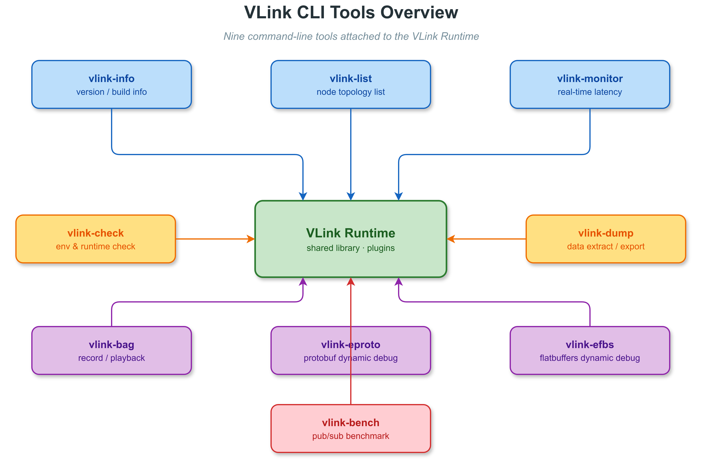

# 13. CLI 工具

## 13.1 概述

VLink 提供了一套完整的命令行工具链，覆盖系统信息查询、环境诊断、节点发现、通信监控、数据录制/回放、消息调试等全场景需求。所有工具统一以 `vlink-` 为前缀命名，风格一致，可组合使用。

> **相关文档**：录制/回放 C++ API 参见 [12-bag-recording.md](12-bag-recording.md)；可视化 GUI 工具参见 [14-viewer.md](14-viewer.md)；环境变量配置参见 [21-environment-vars.md](21-environment-vars.md)；节点发现机制参见 [17-discovery.md](17-discovery.md)。

### 13.1.1 工具生态总览



### 13.1.2 工具列表

| 工具名           | 功能                         | 核心依赖                        | 编译选项                  |
| ---------------- | ---------------------------- | ------------------------------- | ------------------------- |
| `vlink-info`     | 查看版本信息和编译选项       | vlink 基础库                    | `ENABLE_CLI_INFO`         |
| `vlink-check`    | 系统环境诊断、环境变量检查   | vlink 基础库、网络工具          | `ENABLE_CLI_CHECK`        |
| `vlink-list`     | 列出活动节点和话题           | DiscoveryViewer                 | `ENABLE_CLI_LIST`         |
| `vlink-monitor`  | 实时监控通信状态和性能指标   | DiscoveryViewer、Subscriber     | `ENABLE_CLI_MONITOR`      |
| `vlink-bag`      | 录制和回放消息数据包         | BagWriter、BagReader            | `ENABLE_CLI_BAG`          |
| `vlink-dump`     | 从消息或 bag 文件中提取字段  | Protobuf、FlatBuffers、BagReader、DiscoveryViewer | `ENABLE_CLI_DUMP` |
| `vlink-eproto`   | Protobuf 消息的发布与订阅    | Protobuf compiler               | `ENABLE_CLI_EPROTO`       |
| `vlink-efbs`     | FlatBuffers 消息的发布与订阅 | FlatBuffers IDL                 | `ENABLE_CLI_EFBS`         |
| `vlink-bench`    | 发布/订阅性能基准测试与报告  | Bench runtime、Pub/Sub、Serializer | `ENABLE_CLI_BENCH`    |

> 另有 `vlink-proxy`（远程监控守护进程 + 可选内嵌 iox-roudi）由 `ENABLE_PROXY` 控制，源码位于 `proxy/`，不在 `cli/` 子目录下；详见 [16-proxy.md](16-proxy.md)。

---

## 13.2 安装和路径配置

### 13.2.1 编译安装

```bash
cmake -B build
cmake --build build
cmake --install build --prefix /usr/local
```

安装后，所有工具位于 `<install_prefix>/bin/` 目录，例如 `/usr/local/bin/vlink-info`。

### 13.2.2 路径配置

确保安装目录在 `PATH` 中：

```bash
export PATH=/usr/local/bin:$PATH
```

`vlink-info -l` 会查找 `vlink-options.txt` 配置文件，搜索路径依次为：

1. 与可执行文件同级目录（`<app_dir>/vlink-options.txt`）
2. `<app_dir>/../etc/vlink/vlink-options.txt`
3. `<app_dir>/../share/vlink/vlink-options.txt`

### 13.2.3 通用说明

- 所有工具支持 `-h` / `--help` 查看帮助，`-v` / `--version` 查看版本。
- 多数工具需要组播/广播网络支持才能发现远端节点，工具启动时会打印所需的监听地址。
- 建议在使用跨机器发现功能之前执行 `vlink-check diag` 完成环境自检。

---

## 13.3 vlink-info — 版本与选项信息

### 13.3.1 功能说明

`vlink-info` 用于查看当前 VLink 安装的版本号、构建时间戳、Git 标签、Git 提交 ID，以及当前二进制文件编译时启用的所有选项（来自 `vlink-options.txt`）。

### 13.3.2 命令行参数

| 参数               | 说明                                        | 默认值  |
| ------------------ | ------------------------------------------- | ------- |
| `-l` / `--list_options` | 从 `vlink-options.txt` 读取并打印编译选项 | `false` |
| `-h` / `--help`    | 显示帮助                                    | -       |
| `-v` / `--version` | 显示版本                                    | -       |

### 13.3.3 使用示例

```bash
# 查看版本信息
vlink-info

# 查看当前二进制的所有编译选项
vlink-info -l
```

### 13.3.4 输出示例

```
┌──────── VLink Informations ────────────────────────────────────────────────────
│ Version:                     2.0.0
│ Time stamp:                  2026-03-17 10:00:00
│ Git tag:                     v2.0.0
│ Git commit-id:               e78d342
└────────────────────────────────────────────────────────────────────────────────
```

---

## 13.4 vlink-check — 系统配置与环境诊断

### 13.4.1 功能说明

`vlink-check` 是 VLink 的环境自检工具，分为三个子命令：

- `diag`：自动运行一系列诊断项，以彩色状态栏输出 PASSED / WARNING / FAILED。
- `env`：列出 `cli/check/check.cc` 内置清单中的常用 `VLINK_*` 环境变量子集，并按编译进产物的传输模块裁剪显示项。
- `test`：先在 `intra://` 上做 Event / Method / Field 三模型最小自检，再按 `VLINK_SUPPORT_*` 宏遍历已编译传输后端做通信冒烟测试。

### 13.4.2 子命令

#### 13.4.2.1 diag — 自动诊断

```
vlink-check diag [-a] [-s] [-f <substring>]
```

| 参数              | 说明                                               | 默认值  |
| ----------------- | -------------------------------------------------- | ------- |
| `-a` / `--all`    | 附加检查所有编译选项的开关状态                     | `false` |
| `-s` / `--summary`| 执行完毕打印 PASSED / WARNING / FAILED 统计        | `false` |
| `-f` / `--filter` | 仅执行标题包含指定子串的诊断项（调试或脚本化使用） | 空      |

**诊断项目列表（标准模式）：**

> 平台说明：标记 *(Linux)* 的项仅在 Linux / Android 上执行，其余平台会打印 "Not applicable on this platform"。

| 分组             | 诊断项                                          | FAILED 条件                               | WARNING 条件                             |
| ---------------- | ----------------------------------------------- | ----------------------------------------- | ---------------------------------------- |
| 构建 / 主机      | Check vlink version                             | -                                         | -                                        |
| 构建 / 主机      | Check platform info (`uname -sr`)               | -                                         | -                                        |
| 构建 / 主机      | Check hostname                                  | -                                         | hostname 为空                            |
| 构建 / 主机      | Check machine id                                | -                                         | machine id 为空                          |
| 构建 / 主机      | Check cpu cores                                 | -                                         | 无法获取 CPU 核数                        |
| IP / DDS         | Check available IP addresses                    | 无可用 IP 或仅有 lo(127.0.0.1)            | -                                        |
| IP / DDS         | Check VLink DDS IP available                    | `VLINK_DDS_IP` 设置的 IP 不在网卡中       | `VLINK_DDS_IP` 未设置                    |
| IP / DDS         | Check VLink DDS interface                       | `VLINK_DDS_IP` 对应的网卡找不到           | `VLINK_DDS_IP` 未设置                    |
| IP / DDS         | Check VLink DDS interface MTU *(Linux)*         | MTU < 1280                                | MTU < 1500 或无非回环 IP                 |
| IP / DDS         | Check VLink multicast address                   | 路由表中无 `239.255.0.100`                | -                                        |
| IP / DDS         | Check DDS multicast address                     | -                                         | 路由表中无 `239.255.0.1`                 |
| IP / DDS         | Check VLINK_DDS_DOMAIN range                    | 不在 `[0,232]` 范围内                     | -                                        |
| 内核 / 网络调优  | Check net.core.rmem_max *(Linux)*               | -                                         | `< 2MB`（DDS/Zenoh 大流量丢包风险）      |
| 内核 / 网络调优  | Check net.core.wmem_max *(Linux)*               | -                                         | `< 2MB`                                  |
| 内核 / 网络调优  | Check rp_filter *(Linux)*                       | -                                         | `rp_filter=1`（严格模式可能吞掉多播）    |
| 进程 / 调度限额  | Check RLIMIT_NOFILE *(Unix)*                    | -                                         | `< 4096`（DDS 会开大量 socket）          |
| 进程 / 调度限额  | Check RLIMIT_MEMLOCK *(Unix)*                   | -                                         | `< 64MB`（影响 SHM 零拷贝）              |
| 文件系统         | Check available space for log dir               | 可用空间 `< 1MB`                          | -                                        |
| 文件系统         | Check log dir writable                          | 目录不可写                                | -                                        |
| 文件系统         | Check /dev/shm space *(Linux)*                  | `< 64MB`（SHM/shm2 必然失败）             | `< 512MB`                                |
| 文件系统         | Check VLINK_PLUGIN_DIR / PROTO_DIR / FBS_DIR    | 路径存在但不是目录                        | -                                        |
| 文件系统         | Check VLINK_QOS_CONFIG / FASTDDS_QOS_FILE / CYCLONEDDS_URI | 路径存在但不是文件             | -                                        |
| 文件系统         | Check VLINK_LOG_LEVEL value                     | 不在 `[0,6]` 范围（含 `6=kOff`）          | -                                        |
| 运行时健康       | Check cpu usage                                 | CPU 占用 > 90%                            | CPU 占用 > 50%                           |
| 运行时健康       | Check memory usage                              | 内存占用 > 90%                            | 内存占用 > 50%                           |
| 运行时健康       | Check singleton lock                            | -                                         | 锁目录可能存在争用                       |
| 运行时健康       | Check time sync daemon *(Linux)*                | -                                         | 无 chrony/ntpd/systemd-timesyncd 运行    |
| 运行时健康       | Check iox-roudi running                         | -                                         | RouDi 未运行（shm:// 依赖它）            |
| 进程             | Check proxy running                             | vlink-proxy 未运行                        | -                                        |
| 进程             | Check bag / dump / eproto / efbs running        | -                                         | 对应工具正在运行                         |
| 进程             | Check monitor / viewer / player running         | -                                         | 对应工具正在运行                         |
| 进程             | Check analyzer / bench / legacy webviz running  | -                                         | 对应工具正在运行；当前检查项使用历史进程名 `vlink-webviz` |
| 进程             | Check others running                            | vlink-list 执行失败                       | 仍有 vlink 用户进程在运行                |

**附加模式（-a）额外检查的编译选项：**

`VLINK_ENABLE_CXX_STD_20`、`VLINK_ENABLE_C_API`、`VLINK_ENABLE_SECURITY`、`VLINK_ENABLE_SQLITE`、`VLINK_ENABLE_ZSTD`、各 CLI 工具开关（`CLI_INFO` / `CLI_BAG` / `CLI_EPROTO` / `CLI_EFBS` / `CLI_LIST` / `CLI_MONITOR` / `CLI_DUMP` / `CLI_CHECK`）、日志后端（`LOG_QUI` / `LOG_SPD` / `LOG_DLT` / `LOG_NAT`）、`VLINK_ENABLE_PROXY`、`VLINK_ENABLE_VIEWER`、`VLINK_ENABLE_EXAMPLES`、`VLINK_ENABLE_TEST`。

**退出码：** 返回失败项数量，全部通过返回 0。

#### 13.4.2.2 env — 环境变量检查

```
vlink-check env [-b] [-p <prefix>]
```

| 参数                 | 说明                                                       | 默认值  |
| -------------------- | ---------------------------------------------------------- | ------- |
| `-b` / `--available` | 只显示已设置的环境变量                                     | `false` |
| `-p` / `--prefix`    | 只显示名字以指定前缀开头的环境变量（如 `VLINK_ZENOH_`）    | 空      |

**支持检查的环境变量（按子系统分组，节选）：**

> `vlink-check env` 打印的是经过人工挑选的子集，**并非 VLink 全部环境变量**。完整清单以 [`doc/21-environment-vars.md`](21-environment-vars.md) 为准。

| 分组           | 环境变量                                                   | 说明                                           |
| -------------- | ---------------------------------------------------------- | ---------------------------------------------- |
| 路径 / 插件 / 内存 | `VLINK_PROTO_DIR`、`VLINK_FBS_DIR`、`VLINK_SCHEMA_PLUGIN`、`VLINK_TMP_DIR`、`VLINK_LOCK_DIR`、`VLINK_MEMORY_LEVEL`、`VLINK_MEMORY_PREALLOC`、`VLINK_PLUGIN_DIR`、`VLINK_URL_PLUGINS`、`VLINK_URL_REMAP` | 通用运行时路径、插件、URL 重映射和内存池配置 |
| 日志           | `VLINK_LOG_LEVEL`、`VLINK_LOG_CONSOLE_LEVEL`、`VLINK_LOG_FILE_LEVEL`、`VLINK_LOG_CONSOLE_UNORDER`、`VLINK_LOG_CONSOLE_FMT`、`VLINK_LOG_DIR`、`VLINK_LOG_ENABLE_UTC`、`VLINK_LOG_MAX_SIZE`、`VLINK_LOG_MAX_COUNT`、`VLINK_LOG_FLUSH_DELAY`、`VLINK_LOG_PLUGIN`、`VLINK_LOG_STORE_STRATEGY`、`VLINK_LOG_OPEN_APPEND`、`VLINK_LOG_BLOCK_SYNC`、`VLINK_LOG_WRITE_DEPTH` | 日志级别、输出格式、文件滚动和异步后端行为 |
| Bag / 发现 / 分析 | `VLINK_BAG_PATH`、`VLINK_BAG_TAG`、`VLINK_DISCOVER_DISABLE`、`VLINK_DISCOVER_NATIVE`、`VLINK_PROFILER_ENABLE`、`VLINK_QOS_CONFIG` | 录制、发现、性能采样和 QoS 配置 |
| Intra          | `VLINK_INTRA_BIND`                                         | 仅启用 `VLINK_SUPPORT_INTRA` 时显示            |
| DDS (通用)     | `VLINK_DDS_BIND`、`VLINK_DDS_DEBUG`、`VLINK_DDS_EVENT_QOS`、`VLINK_DDS_METHOD_QOS`、`VLINK_DDS_FIELD_QOS`、`VLINK_DDS_DOMAIN`、`VLINK_DDS_IP`、`VLINK_DDS_IP_FILTER`、`VLINK_DDS_MULTICAST_IP`、`VLINK_DDS_PEER`、`VLINK_DDS_BUF`、`VLINK_DDS_MTU`、`VLINK_DDS_UDP`、`VLINK_DDS_TCP`、`VLINK_DDS_SHM`、`VLINK_DDS_LESS_MEMORY` | 任一 DDS 后端编入即显示 |
| DDS (后端)     | `VLINK_FASTDDS_QOS_FILE`（`VLINK_SUPPORT_DDS`）、`VLINK_CYCLONEDDS_URI`（`VLINK_SUPPORT_DDSC`）、`VLINK_TRAVODDS_QOS_FILE`（`VLINK_SUPPORT_DDST`） | 各 DDS 后端专用，按对应宏过滤 |
| SHM            | `VLINK_SHM_DEBUG`、`VLINK_SHM_DEPTH`                       | `VLINK_SUPPORT_SHM`                            |
| SHM2           | `VLINK_SHM2_DEBUG`、`VLINK_SHM2_DEPTH`、`VLINK_SHM2_CONFIG`、`VLINK_SHM2_NOTIFY_EVERY` | `VLINK_SUPPORT_SHM2`             |
| Zenoh          | `VLINK_ZENOH_*`（30 项，含 `_SHM*` 系列，详见 [21-environment-vars.md](21-environment-vars.md#2171-zenoh)） | `VLINK_SUPPORT_ZENOH`                          |
| MQTT           | `VLINK_MQTT_BROKER`、`VLINK_MQTT_CLIENT_ID`、`VLINK_MQTT_DOMAIN`、`VLINK_MQTT_KEEPALIVE`、`VLINK_MQTT_QOS` | `VLINK_SUPPORT_MQTT` |
| SOME/IP        | `VLINK_SOMEIP_CFG`                                         | `VLINK_SUPPORT_SOMEIP`                         |
| TLS / 安全     | `VLINK_SSL_VERIFY`、`VLINK_SSL_CA`、`VLINK_SSL_CERT`、`VLINK_SSL_KEY`、`VLINK_SSL_KEY_PASS`、`VLINK_SSL_CIPHERS`、`VLINK_SSL_SNI` | 通用，无条件显示 |

> `vlink-check env` 的清单按编译时传输模块开关动态裁剪。未启用 `VLINK_SUPPORT_<NAME>` 宏时，对应模块的私有 env 不会展示。`VLINK_BENCH_*` 由 `vlink-bench` 读取，但不在 `vlink-check env` 的内置清单中；源码是否读取以 `Utils::get_env("<NAME>")` 为准。

已设置的变量以绿色显示，未设置的以红色显示（`-b` 模式下只显示已设置项）。命令末尾会输出一行汇总：已设置变量数 / 总数，以及 `-p` 命中的显示项数量。

#### 13.4.2.3 test — 通信最小自检

```
vlink-check test
```

`check test` 分两段跑，退出码 = 第二段里的 **FAILED** 数（WARNING 不计入）：

**Part 1 — Paradigm 三模型 (intra:// 通路始终可用)**

| 子测试    | 使用的节点                                          | 断言                                      |
| --------- | --------------------------------------------------- | ----------------------------------------- |
| EVENT     | `Publisher<std::string>` + `Subscriber<std::string>` | 5 条消息按顺序全部接收                    |
| METHOD    | `Client<std::string,std::string>` + `Server`         | `invoke("ping")` 同步得到 `echo:ping`     |
| FIELD     | `Setter<int>` + `Getter<int>`                         | `Getter::wait_for_value()` 读到 `42`      |

**Part 2 — Per-transport 三模型冒烟（按 `VLINK_SUPPORT_*` 宏门控）**

对每一个**编译进产物**的传输后端，都会跑最小通信往返；多数后端覆盖 Event、Method、Field 三种模型，个别受后端能力或运行时条件限制。未编译进的传输自动隐藏（不出现在输出中）；某些传输还带运行时前置条件，不满足时整项被标为 WARNING 直接跳过，绝不会触发后端的 `std::terminate`：

| 传输       | 编译宏                | 运行时前置条件（跳过原因）                                 | 覆盖模型                                     |
| ---------- | --------------------- | ---------------------------------------------------------- | -------------------------------------------- |
| `intra://` | `VLINK_SUPPORT_INTRA` | 无                                                         | Event / Method / Field                       |
| `shm://`   | `VLINK_SUPPORT_SHM`   | 通过 `ShmConf::auto_init_roudi(true)` 探测或尝试启动 RouDi  | Event / Method / Field                       |
| `shm2://`  | `VLINK_SUPPORT_SHM2`  | `/dev/shm` 可用且剩余 ≥ 64MB                               | Event / Method / Field                       |
| `dds://`   | `VLINK_SUPPORT_DDS`   | 无                                                         | Event / Method / Field                       |
| `ddsc://`  | `VLINK_SUPPORT_DDSC`  | 无                                                         | Event / Method / Field                       |
| `ddsr://`  | `VLINK_SUPPORT_DDSR`  | 无                                                         | Event / Method / Field                       |
| `ddst://`  | `VLINK_SUPPORT_DDST`  | 无                                                         | Event / Method / Field                       |
| `zenoh://` | `VLINK_SUPPORT_ZENOH` | 无                                                         | Event / Method / Field                       |
| `someip://`| `VLINK_SUPPORT_SOMEIP`| 当前不检查 `VLINK_SOMEIP_CFG`                              | Event                                        |
| `mqtt://`  | `VLINK_SUPPORT_MQTT`  | 设置了 `VLINK_MQTT_BROKER`                                 | Event                                        |
| `fdbus://` | `VLINK_SUPPORT_FDBUS` | `FdbusConf::has_name_server()` 返回 true                   | Event / Method / Field                       |
| `qnx://`   | `VLINK_SUPPORT_QNX`   | 无                                                         | Event / Method / Field                       |

**外部依赖型传输的通用规则：** `shm / shm2 / dds / ddsc / ddsr / ddst / zenoh / someip / mqtt / fdbus / qnx` 发现超时被计为 WARNING 而非 FAILED，只有构造抛异常或收到错乱载荷才算 FAILED。`intra://` 是唯一严格评估的 scheme。

**退出码：** 0 表示没有任何 FAILED；非零等于 FAILED 的子测试数。WARNING 仅提示，不影响退出码。

### 13.4.3 使用示例

```bash
# 运行标准自动诊断
vlink-check diag

# 包含编译选项检查的完整诊断 + 汇总
vlink-check diag -a -s

# 只跑包含 "dds" 的诊断项
vlink-check diag -f dds

# 列出所有环境变量及说明
vlink-check env

# 只显示已设置的环境变量
vlink-check env -b

# 只查看 Zenoh 相关环境变量
vlink-check env -p VLINK_ZENOH_

# 执行进程内 pub/sub 冒烟测试
vlink-check test
```

---

## 13.5 vlink-list — 列出活动节点与话题

### 13.5.1 功能说明

`vlink-list` 通过 `DiscoveryViewer` 发现机制，扫描当前网络上所有活跃的 VLink 进程及其注册的话题（Publisher/Subscriber/Server/Client/Setter/Getter），以树状结构输出。

工具在启动后等待约 1 秒（`kCollectInterval = 1000ms`）收集发现信息，然后输出结果并退出。

### 13.5.2 命令行参数

| 参数                    | 说明                                             | 默认值  |
| ----------------------- | ------------------------------------------------ | ------- |
| `-n` / `--native`       | 本地模式，仅发现本机节点                         | `false` |
| `-m` / `--name <name>`  | 按进程名过滤                                     | 空（全部）|
| `-p` / `--pid <pid>`    | 按进程 ID 过滤                                   | 0（全部）|
| `-c` / `--check_process_count` | 仅通过退出码返回进程数量，不输出文本    | `false` |
| `-h` / `--help`         | 显示帮助                                         | -       |

> `-c` 模式下不打印任何终端输出，通过进程退出码返回当前 VLink 用户进程数量，可用于脚本判断（`vlink-check` 内部使用此功能）。由于 shell 退出码本身有范围限制，这种方式更适合做小范围计数或非零判断。

### 13.5.3 输出格式说明

输出按进程分组，每个进程显示：

```
<进程名> (pid: <pid>, host: <主机名>, ip: <IP地址>)
  Publisher:
    <url>    <序列化类型>
  Subscriber:
    <url>    <序列化类型>
  Server:
    <url>    <序列化类型>
  Client:
    <url>    <序列化类型>
  Setter:
    <url>    <序列化类型>
  Getter:
    <url>    <序列化类型>
```

URL 列宽度自动对齐（以最长 URL 为基准）。

### 13.5.4 使用示例

```bash
# 列出所有节点和话题
vlink-list

# 仅列出本机节点
vlink-list -n

# 按进程名过滤
vlink-list -m my_process

# 按 PID 过滤
vlink-list -p 1234

# 获取当前活跃进程数量（通过退出码）
vlink-list -c
echo "Process count: $?"
```

### 13.5.5 输出示例

```
camera_node (pid: 1001, host: myhost, ip: 192.168.1.10)
  Publisher:
    dds://camera/image       CameraFrame
    dds://camera/pointcloud  PointCloud

detection_node (pid: 1002, host: myhost, ip: 192.168.1.10)
  Subscriber:
    dds://camera/image       CameraFrame
  Publisher:
    dds://detection/result   pb.DetectResult
```

---

## 13.6 vlink-monitor — 实时通信状态监控

### 13.6.1 功能说明

`vlink-monitor` 是一个基于终端的交互式实时监控工具，持续显示当前网络中所有话题的通信状态，包括频率、速率、丢包率、时延等指标，支持 Sparkline 图表面板和进程面板。

在交互界面中选中某条话题后按 `Enter`，工具会严格根据服务发现里的 `schema_type` 自动启动 `vlink-eproto sub` 或 `vlink-efbs sub`；如果当前 URL 的 `schema_type` 或 `ser_type` 仍未就绪，则不会再做字符串猜测，而是提示等待服务发现元数据补齐后重试。若服务发现结果表明该 URL 是字段模型读取场景（已发现 `Getter`，或发现 `Setter` 且未发现 `Publisher`），`vlink-monitor` 会自动向子进程追加 `-g/--getter`，否则按普通 `Subscriber` 方式拉起。指定 `-b/--blob` 时，Enter 跳转会强制追加 `-x blob`，用 blob 方式打印消息内容。

每隔 1 秒（`kCollectInterval`）刷新一次统计数据，每隔 50ms（`kTerminalInterval`）重绘终端界面。

### 13.6.2 命令行参数

| 参数                            | 说明                                                          | 默认值  |
| ------------------------------- | ------------------------------------------------------------- | ------- |
| `-u` / `--urls <url...>`        | 只监控指定 URL（可多个）                                      | 空（全部）|
| `-i` / `--filter <str>`        | URL 关键字过滤（空格分隔多个关键字）                          | 空      |
| `-b` / `--blob`                 | Enter 跳转时强制使用 `-x blob` 打印输出                       | `false` |
| `-k` / `--black`                | 启用黑名单模式（过滤掉匹配的 URL）                           | `false` |
| `-n` / `--native`               | 本地模式，仅发现本机节点                                      | `false` |
| `-t` / `--node_count`           | 显示节点数量模式（在类型列显示订阅者/发布者数量）             | `false` |
| `-l` / `--detail`               | 详情模式，显示频率/速率/丢包/时延列（热键 `L`）               | `false` |
| `-o` / `--observe_all`          | 观察所有模式，为所有行订阅数据（配合 `-l` 使用，热键 `O`）   | `false` |
| `-e` / `--profiler`             | 显示 CPU 分析器数据（热键 `E`）                               | `false` |
| `-s` / `--ser`                  | 显示序列化类型列（热键 `S`）                                  | `false` |
| `-a` / `--active`               | 只显示有活跃数据的话题（需配合 `-l` 使用，热键 `A`）          | `false` |
| `-y` / `--pubsub`               | 只显示 Publisher/Subscriber 类型（热键 `Y`）                  | `false` |
| `-p` / `--process`              | 显示进程面板（热键 `P`）                                      | `false` |
| `-c` / `--chart`                | 显示 Sparkline 图表面板（热键 `C`）                           | `false` |
| `-x` / `--preset`               | 预设模式，等价于同时开启 `-l -o -p -c`                       | `false` |
| `-g` / `--proto_args <str>`     | 附加传给 vlink-eproto/vlink-efbs 的参数                       | 空      |
| `-d` / `--proto_dir <dir>`      | Proto 文件目录（默认读取 `VLINK_PROTO_DIR`）                  | 环境变量|
| `-f` / `--fbs_dir <dir>`        | FlatBuffers 文件目录（默认读取 `VLINK_FBS_DIR`）              | 环境变量|
| `--plain`                       | 纯文本输出模式（用于重定向，禁用交互）                        | `false` |
| `--dot`                         | 使用 Braille 点阵字符绘制图表                                 | `false` |
| `--rows <n>`                    | 最大行数（0 表示自动获取终端行数）                            | 0       |
| `--columns <n>`                 | 最大列数（0 表示自动获取终端列数）                            | 0       |
| `--chart_width <n>`             | 图表宽度（范围 10~100）                                       | 30      |
| `--process_width <n>`           | 进程面板宽度（范围 20~100）                                   | 40      |

### 13.6.3 交互热键

| 热键          | 功能                                   |
| ------------- | -------------------------------------- |
| `q` / `Esc`   | 退出                                   |
| `Space`       | 暂停/恢复刷新                          |
| `L`           | 切换详情模式（FREQ/RATE/LOSS/LATENCY） |
| `O`           | 切换"观察所有"模式                    |
| `S`           | 切换序列化类型显示                     |
| `T`           | 切换节点数量模式                       |
| `E`           | 切换 Profiler 模式                     |
| `A`           | 切换只显示活跃话题                     |
| `Y`           | 切换只显示 Pub/Sub                     |
| `P`           | 切换进程面板                           |
| `C`           | 切换图表面板                           |
| `Left/Right`  | 翻页                                   |
| `Up/Down`     | 移动选中行                             |
| `Enter`       | 对选中话题启动 vlink-eproto 或 vlink-efbs，并按服务发现决定是否追加 `--getter` |

### 13.6.4 输出格式说明

**标题栏（蓝色背景）：**

```
[TYPE]   [URL]                     [FREQ]      [RATE]      [LOSS]   [LATENCY]
```

**每行：**

- `[TYPE]`：通信类型（`Pub`、`Sub`、`Srv`、`Cli`、`Set`、`Get`），启用 `-t` 时显示数量。
- `[URL]`：话题 URL，宽度自动对齐。
- `[FREQ]`：消息频率（Hz），仅详情模式显示。
- `[RATE]`：数据速率（B/s ~ GB/s），仅详情模式显示。
- `[LOSS]`：丢包率（%），仅详情模式显示。
- `[LATENCY]`：端到端时延（ms），仅详情模式显示。

**行颜色（详情模式 / 观察所有模式下）：**

- 绿色：当前 URL 最近持续有数据，且统计滑窗已填满，表示状态稳定。
- 黄色：启动初期或过渡状态，表示最近有活动但滑窗尚未稳定。
- 红色：超过约 2 秒没有新数据，表示当前 URL 处于不活跃状态。

**底部状态栏：** 显示当前页码、各模式开关状态，以及总速率汇总。

**进程面板（`-p`）：** 右侧显示当前选中话题关联的进程信息（类型标签、主机、进程名/PID）。

**图表面板（`-c`）：** 右侧显示当前选中话题的历史 Sparkline 图表，包含 4 组图：Freq、Rate、Loss、Latency。支持 `--dot` 模式使用 Braille 点阵提高精度。

### 13.6.5 使用示例

```bash
# 基础监控（所有话题，仅类型和 URL）
vlink-monitor

# 预设全功能模式（等价于 -l -o -p -c）
vlink-monitor -x

# 详情模式 + 观察所有话题
vlink-monitor -lo

# 只监控包含 "camera" 的话题
vlink-monitor -i camera

# 过滤掉包含 "debug" 的话题（黑名单模式）
vlink-monitor -i debug -k

# 只监控指定的两条 URL
vlink-monitor -u dds://camera/image dds://lidar/points

# 纯文本模式重定向到文件
vlink-monitor --plain > monitor_output.txt

# 本地模式 + 图表面板
vlink-monitor -nc
```

---

## 13.7 vlink-bag — 数据录制与回放

### 13.7.1 功能说明

`vlink-bag` 是 VLink 最核心的数据工具，支持对所有话题进行录制、回放、克隆、检查、索引重建和修复。支持的文件格式：

| 扩展名    | 说明                            |
| --------- | ------------------------------- |
| `.vdb`    | VLink 标准数据库格式（SQLite）  |
| `.vdbx`   | VLink 数据库扩展格式            |
| `.vcap`   | VLink 抓包格式                  |
| `.vcapx`  | VLink 抓包扩展格式              |

### 13.7.2 子命令

#### 13.7.2.1 record — 录制

```
vlink-bag record <path> [options]
```

| 参数                      | 说明                                              | 默认值       |
| ------------------------- | ------------------------------------------------- | ------------ |
| `path`                    | 输出文件路径（必填）                              | -            |
| `-u` / `--urls <url...>`  | 只录制指定 URL（空为全部）                        | 空（全部）   |
| `-t` / `--tag <name>`     | 设置录制标签名                                    | 空           |
| `-i` / `--filter <str>`   | URL 关键字过滤（空格分隔）                        | 空           |
| `-k` / `--black`          | 黑名单模式                                        | `false`      |
| `-n` / `--native`         | 本地模式                                          | `false`      |
| `-d` / `--duration <s>`   | 录制持续时间（秒），<=0 表示不限制                | 0（不限制）  |
| `-w` / `--wait <s>`       | 退出时等待写入完成的最大时间（秒）                | 30           |
| `-p` / `--compress`       | 启用压缩                                          | `false`      |
| `-f` / `--force`          | 强制覆盖已有文件                                  | `false`      |
| `-q` / `--quiet`          | 静默模式（不输出进度）                            | `false`      |
| `-l` / `--detail`         | 详情模式（每条消息打印时间戳和 URL）              | `false`      |
| `-o` / `--split_name_by_time` | 按时间分割文件名                              | `false`      |
| `-z` / `--split_by_size <GB>` | 按文件大小分割（GB）                          | 1            |
| `-y` / `--split_by_time <s>`  | 按时间分割（秒）                              | 0（不分割）  |
| `-g` / `--deft`           | 不等待序列化类型信息采集                          | `false`      |
| `-x` / `--max_packet_size <MB>` | 单包最大大小（MB），超过则丢弃               | 4.0          |
| `-j` / `--wal_mode`       | 启用 SQLite WAL 模式                              | `false`      |
| `-c` / `--cache_size <MB>`| 写缓存大小（MB）                                  | 4            |
| `-s` / `--sync_mode`      | 同步写入模式                                      | `false`      |
| `--max_task_depth <n>`    | 写入队列最大待处理任务数                          | 20000        |
| `--max_memory_size <GB>`  | 写入队列最大内存占用（GB）                        | 2            |
| `--max_row_count <n>`     | 最大录制行数                                      | 5000000000   |
| `--max_bytes_size <GB>`   | 最大录制字节数（GB）                              | 512          |
| `--enable_limit`          | 启用行/字节数限制                                 | `false`      |
| `--compress_level <n>`    | 压缩级别（1~5，0 表示默认）                       | 3            |
| `--ignore_compress <url...>` | 对指定 URL 不压缩                              | 空           |

**录制进度显示：** 进度条颜色含义：
- 绿色（`<<`）：正在录制且有数据变化
- 红色（`<<`）：正在录制但无数据变化
- 黄色（`||`）：已暂停

**键盘控制：**
- `Space`：暂停/恢复录制
- `q` / `Esc`：停止录制

#### 13.7.2.2 play — 回放

```
vlink-bag play <path> [options]
```

| 参数                        | 说明                                               | 默认值    |
| --------------------------- | -------------------------------------------------- | --------- |
| `path`                      | bag 文件路径（必填）                               | -         |
| `-u` / `--urls <url...>`    | 只回放指定 URL（空为全部）                         | 空（全部）|
| `-i` / `--filter <str>`     | URL 关键字过滤                                     | 空        |
| `-k` / `--black`            | 黑名单模式                                         | `false`   |
| `-n` / `--native`           | 本地模式（DDS 使用 127.0.0.1）                     | `false`   |
| `-s` / `--actions <n...>`   | 过滤动作类型（1:C/Req 2:C/Resp 3:S/Req 4:S/Resp 5:Pub 6:Sub 7:Set 8:Get）| 6（Sub） |
| `-b` / `--begin_time <s>`   | 从指定相对时间开始（秒）                           | 0         |
| `-e` / `--end_time <s>`     | 到指定相对时间结束（秒，0 表示到结尾）             | 0         |
| `-t` / `--times <n>`        | 回放次数（<=0 表示无限循环）                       | 1         |
| `-r` / `--rate <f>`         | 回放速率（0.01~100）                               | 1.0       |
| `-q` / `--quiet`            | 静默模式                                           | `false`   |
| `-l` / `--detail`           | 详情模式                                           | `false`   |
| `-m` / `--skip_blank`       | 跳过空白段（从第一条消息时间点开始计算）           | `false`   |
| `-j` / `--auto_pause`       | 每条消息回放后自动暂停                             | `false`   |
| `--local_time`              | 使用本地时间显示                                   | `false`   |
| `--utc_time`                | 使用 UTC 时间显示                                  | `false`   |
| `--rel_begin_time <hh:mm:ss[.ms]>` | 相对开始时间（格式：`00:00:00` 或 `00:00:00:000`）| 空 |
| `--rel_end_time <hh:mm:ss[.ms]>`   | 相对结束时间                                | 空        |
| `--local_begin_time <...>`  | 本地时间开始点                                     | 空        |
| `--local_end_time <...>`    | 本地时间结束点                                     | 空        |
| `--utc_begin_time <...>`    | UTC 时间开始点                                     | 空        |
| `--utc_end_time <...>`      | UTC 时间结束点                                     | 空        |
| `--plugin <name>`           | 指定 BagReader 插件名                              | 空        |

**回放进度显示格式：**

```
HH:MM:SS.mmm/HH:MM:SS.mmm | 12.34s | 1.23MB/s [>>  45.6% ]:
```

**键盘控制：**
- `Space`：暂停/恢复
- `q` / `Esc`：停止
- `Left`：后退 1 秒
- `Right`：前进 1 秒
- `Up`：后退 5 秒
- `Down`：前进 5 秒
- `p`：在暂停状态下单步前进一帧

#### 13.7.2.3 info — 查看文件信息

```
vlink-bag info <path> [-l]
```

| 参数           | 说明                                             | 默认值  |
| -------------- | ------------------------------------------------ | ------- |
| `path`         | bag 文件路径（必填）                             | -       |
| `-l` / `--detail` | 详情模式（逐条打印消息时间戳和 URL）          | `false` |

**输出内容：**

```
File Name:     bag.vdb
File Size:     128.50 MB (Raw: 256.00 MB)
Tag Name:      my_recording
Version:       2.0.0
Storage Type:  SQLite3
Compression:   lzav (Ratio: 50%)
Process Name:  my_node
Meta Flags:    completed | idx_elapsed | idx_url | schema
Date Time:     2026-03-17 10:00:00 (Timezone: +08:00:00)
Duration:      00:00:00.500 ~ 00:05:30.123     # 左：累计静默间隔；右：录制总时长
Message Count: 33120
Split Count:   ---

URL TYPE    COUNT    SIZE      FREQ        SER
...
```

> `Compression:` 的值由 writer 写入：`.vdb`/`.vdbx`（SQLite）启用压缩时写 `lzav`，否则 `None`；`.vcap`/`.vcapx`（MCAP）启用压缩时写 `zstd`，否则 `None`。

#### 13.7.2.4 clone — 克隆/转换

```
vlink-bag clone <source_path> <target_path> [options]
```

将 bag 文件克隆到新文件，支持格式转换、话题过滤、时间裁剪、压缩转换。参数与 `play` 子命令类似，另有：

| 参数                       | 说明                      | 默认值  |
| -------------------------- | ------------------------- | ------- |
| `source_path`              | 源文件路径（必填）        | -       |
| `target_path`              | 目标文件路径（必填）      | -       |
| `--import_schema`          | 尝试导入文件内嵌的 schema | `false` |

#### 13.7.2.5 check — 校验文件完整性

```
vlink-bag check <path>
```

校验 bag 文件的完整性，返回 0 表示正常，-1 表示异常。

#### 13.7.2.6 reindex — 重建索引

```
vlink-bag reindex <path>
```

重建 bag 文件的时间索引，用于修复索引损坏导致的回放问题。

#### 13.7.2.7 fix — 修复文件

```
vlink-bag fix <path> [-y]
```

| 参数             | 说明                      | 默认值  |
| ---------------- | ------------------------- | ------- |
| `path`           | bag 文件路径（必填）      | -       |
| `-y` / `--rebuild` | 使用重建模式修复        | `false` |

尝试修复损坏或未完整写入的 bag 文件（例如录制中途断电）。

#### 13.7.2.8 tag — 设置标签

```
vlink-bag tag <path> <tag_name>
```

为已有的 bag 文件设置或修改标签名。

### 13.7.3 使用示例

```bash
# 录制所有话题到文件
vlink-bag record /tmp/test.vdb

# 只录制指定话题，持续 60 秒，启用压缩
vlink-bag record /tmp/test.vdb -u dds://camera/image dds://lidar/points -d 60 -p

# 以 2 倍速回放，循环 3 次
vlink-bag play /tmp/test.vdb -r 2.0 -t 3

# 只回放 10s~60s 的片段
vlink-bag play /tmp/test.vdb -b 10 -e 60

# 查看文件详细信息
vlink-bag info /tmp/test.vdb

# 压缩克隆并裁剪时间段
vlink-bag clone /tmp/test.vdb /tmp/clipped.vdb -b 10 -e 60 -p

# 格式转换：vcap 转 vdb
vlink-bag clone /tmp/capture.vcap /tmp/result.vdb

# 校验文件
vlink-bag check /tmp/test.vdb

# 修复未完整写入的文件
vlink-bag fix /tmp/broken.vdb

# 为文件打标签
vlink-bag tag /tmp/test.vdb "highway_test_20260317"
```

---

## 13.8 vlink-dump — 消息内容提取转储

### 13.8.1 功能说明

`vlink-dump` 用于从实时通信或 bag 文件中提取特定字段的值，输出为 CSV、JSON 或图片/视频等格式。支持 Protobuf 消息的字段路径表达式，以及 VLink 零拷贝类型（CameraFrame、PointCloud、RawData）的内置字段。

**前提条件：** 需要 Protobuf compiler 支持（`VLINK_HAS_PROTOBUF_COMPILER`）。对于 Protobuf 消息须通过 `-d` 参数或 `VLINK_PROTO_DIR` 环境变量指定 `.proto` 文件目录；对于 FlatBuffers 消息须通过 `--fbs_dir` 参数或 `VLINK_FBS_DIR` 环境变量指定 `.fbs` 文件目录。零拷贝类型（CameraFrame、PointCloud、RawData）无需额外配置。数学表达式功能需要 exprtk 库支持。

### 13.8.2 命令行参数

| 参数                           | 说明                                                                       | 默认值     |
| ------------------------------ | -------------------------------------------------------------------------- | ---------- |
| `url`                          | 目标 URL（必填）                                                           | -          |
| `-t` / `--type <type>`         | 输出类型：`console`、`csv`、`json`、`bin`、`jpg`、`h264`、`h265`、`raw`、`pcd` | `csv`  |
| `-c` / `--condition <fields>`  | 提取字段，逗号分隔（如 `header.seq,pose.x,pose.y`）；CSV/JSON 模式必填    | 空         |
| `-o` / `--out_dir <dir>`       | 输出目录                                                                   | `./`       |
| `-m` / `--base_name <name>`    | 输出文件基础名                                                             | `output`   |
| `-f` / `--bag_file <path>`     | 从 bag 文件提取（不指定则从实时通信提取）                                  | 空         |
| `-b` / `--begin_time <s>`      | 开始时间（秒，仅在指定 `-f` 时有效）                                      | 0          |
| `-e` / `--end_time <s>`        | 结束时间（秒，仅在指定 `-f` 时有效）                                      | 0          |
| `-n` / `--count <n>`           | 最大样本数（0 = 不限）                                                     | 0          |
| `--hz <hz>`                    | 最大输出频率（Hz，0 = 不限）                                               | 0          |
| `--native`                     | 本地模式（仅在不指定 `-f` 时有效）                                         | `false`    |
| `-d` / `--proto_dir <dir>`     | Protobuf `.proto` 文件目录（或设置 `VLINK_PROTO_DIR`）                     | 环境变量   |
| `--fbs_dir <dir>`              | FlatBuffers `.fbs` 文件目录（或设置 `VLINK_FBS_DIR`）                      | 环境变量   |
| `-q` / `--quiet`               | 静默模式                                                                   | `false`    |
| `-l` / `--detail`              | 详情模式（打印每条提取记录）                                               | `false`    |
| `-x` / `--expression <expr>`   | 数学表达式，分号分隔（需配合 `-c` 使用，需要 exprtk 库支持）              | 空         |

### 13.8.3 输出格式

**Console 格式（`-t console`）：**

直接在终端打印消息内容。若指定 `-c` 则只打印指定字段及表达式结果，否则打印完整消息（Protobuf TextFormat 或零拷贝结构体摘要）。`text` 为 `console` 的别名。

**CSV 格式（`-t csv`）：**

```csv
timestamp,header.seq,pose.x
0.000100,42,1.5
0.000200,43,2.3
```

**JSON 格式（`-t json`）：**

```json
[
  {"timestamp": 0.0001, "header.seq": 42, "pose.x": 1.5},
  {"timestamp": 0.0002, "header.seq": 43, "pose.x": 2.3}
]
```

**Bin 格式（`-t bin`）：**

将每条消息的完整原始序列化字节保存为独立文件：`output.1.bin`、`output.2.bin` 等。

**图片/视频格式（`-t jpg/h264/h265/raw`）：**

适用于 CameraFrame 或含 bytes 字段的 Protobuf 消息，`-c data`（默认）时将数据帧分别保存为独立文件：`output.1.jpg`、`output.2.jpg` 等。`jpeg` 为 `jpg` 的别名。

**PCD 点云格式（`-t pcd`）：**

适用于零拷贝 PointCloud 类型，将每帧点云保存为 PCD v0.7 二进制格式文件：`output.1.pcd`、`output.2.pcd` 等。

### 13.8.4 条件表达式

**Protobuf 消息字段路径：**

```
header.seq
header.stamp.sec
status.velocity.x
```

**VLink 零拷贝类型内置字段：**

| 类型          | 支持的条件表达式                                                                                                          |
| ------------- | ------------------------------------------------------------------------------------------------------------------------- |
| `CameraFrame` | `header.frame_id`、`header.seq`、`header.time_meas`、`header.time_pub`、`width`、`height`、`channel`、`freq`、`format`、`stream`、`size`、`data` |
| `PointCloud`  | `header.frame_id`、`header.seq`、`header.time_meas`、`header.time_pub`、`size`、`pack_size`、`data[N].field`              |
| `RawData`     | `header.frame_id`、`header.seq`、`header.time_meas`、`header.time_pub`、`size`、`data`                                    |

### 13.8.5 使用示例

```bash
# 从实时 DDS 话题提取 seq 字段为 CSV
vlink-dump dds://sensor/imu -t csv -c "header.seq" -o /tmp/ -d /home/protos/

# 从 bag 文件提取指定时间段内的速度字段
vlink-dump dds://vehicle/state -t csv -c "velocity.x" \
  -f /tmp/test.vdb -b 10 -e 60 -o /tmp/ -d /home/protos/

# 在终端直接查看消息内容（限制 5 条）
vlink-dump dds://test -t console -n 5

# 提取 CameraFrame 图像帧为 JPEG
vlink-dump dds://camera/front -t jpg -c data -o /tmp/frames/ -d /home/protos/

# 提取并输出 JSON 格式
vlink-dump dds://sensor/imu -t json -c "angular_velocity.z" \
  -o /tmp/ -m imu_gyro_z -d /home/protos/

# 导出原始二进制文件
vlink-dump dds://test -t bin -o /tmp/raw_output -d /home/protos/

# 导出点云为 PCD 文件
vlink-dump dds://lidar -t pcd -f /tmp/bag.vdb -d /home/protos/

# 提取字段并计算数学表达式，限制频率为 10Hz
vlink-dump dds://test -c "pose.x,pose.y" \
  -x "sqrt(pose_x*pose_x+pose_y*pose_y);pose_x-pose_y" -t csv --hz 10
```

---

## 13.9 vlink-eproto — Protobuf 消息调试工具

### 13.9.1 功能说明

`vlink-eproto` 用于在终端中实时订阅并以 Protobuf TextFormat 或 JSON（`-j`）格式显示消息内容，或向指定 URL 发布 Protobuf 消息。支持交互式热键控制显示选项，支持内容分页翻阅。

**前提条件：** 需要 Protobuf compiler 支持，须通过 `-d` 参数或 `VLINK_PROTO_DIR` 指定 `.proto` 文件目录。

### 13.9.2 子命令

#### 13.9.2.1 sub — 订阅并显示消息

```
vlink-eproto sub <url> [options]
```

| 参数                          | 说明                                           | 默认值     |
| ----------------------------- | ---------------------------------------------- | ---------- |
| `url`                         | 目标 URL（必填）                               | -          |
| `-d` / `--proto_dir <dir>`    | Proto 文件目录                                 | 环境变量   |
| `--schema_plugin <path>`      | Schema 插件共享库路径                          | 空         |
| `-s` / `--ser_type <type>`    | 序列化类型（消息名）                           | 空（自动）|
| `-x` / `--encoding <type>`    | 编码提示（`protobuf`/`flatbuffers`/`raw`/`blob`/`zerocopy`，`blob` 时按十六进制显示二进制） | 空 |
| `-i` / `--filter <str>`       | 过滤字段名（空格分隔）                         | 空         |
| `-j` / `--json`               | 以 JSON 格式输出 Protobuf 消息                 | `false`    |
| `-g` / `--getter`             | 强制使用 Getter 接收数据（字段模型）           | `false`    |
| `-k` / `--black`              | 黑名单模式（过滤掉匹配字段）                   | `false`    |
| `-n` / `--native`             | 本地模式                                       | `false`    |
| `-m` / `--max_str_count <n>`  | 最大显示字符数                                 | 1亿        |
| `-e` / `--print_enum_string`  | 显示枚举数字（热键 `E`）                       | `false`    |
| `-r` / `--ignore_array`       | 忽略数组字段（热键 `R`）                       | `false`    |
| `-t` / `--ignore_string`      | 忽略字符串字段（热键 `T`）                     | `false`    |
| `-y` / `--print_time_string`  | 时间戳显示为可读字符串（热键 `Y`）             | `false`    |
| `-u` / `--print_hex_string`   | 数值以十六进制显示（热键 `U`）                 | `false`    |
| `-o` / `--ignore_default`     | 忽略默认值字段（热键 `O`）                     | `false`    |
| `-p` / `--use_long_repeated`  | 展开 repeated 字段（热键 `P`）                 | `false`    |
| `--rows <n>`                  | 最大行数                                       | 0（自动）  |
| `--columns <n>`               | 最大列数                                       | 0（自动）  |

**接收模式说明：**

- 指定 `-s/--ser_type` 时，工具不再等待服务发现；若同时指定 `-x/--encoding`，会直接按该编码选择解析路径。
- 指定 `-s/--ser_type` 但不指定 `-x/--encoding` 时，会先按 `ser_type` 做字符串兜底推断；推断不出来时，`vlink-eproto` 默认按 protobuf 家族处理。
- 未指定 `-s/--ser_type` 时，工具会等待一轮服务发现以自动推断序列化类型；若发现该 URL 属于字段模型，也可能自动切换为 `Getter` 接收。

**JSON 模式说明：**

- 指定 `-j/--json` 后，Protobuf 消息会按 JSON 格式输出，字段名保持 proto 中的原始命名。
- `-e/--print_enum_string` 在 JSON 模式下仍然有效：开启时输出枚举字符串，关闭时输出枚举数字。
- `-r/--ignore_array`、`-t/--ignore_string`、`-o/--ignore_default` 和字段过滤在 JSON 模式下仍然生效。
- 零拷贝类型（如 `vlink::zerocopy::*`）不支持 `-j/--json`。
- 如果当前构建缺少 Protobuf `json_util`，`-j/--json` 不能用于 protobuf 或二进制 raw；此时只保留对文本 raw 负载的 JSON 文本处理能力。
- 指定 `-x blob` 时，工具按二进制路径接收，并以十六进制显示 payload；显示顺序为 `per_line`、`per_row`、`data_size`、`data_blob`，其中 `data_blob:` 后换行，单行最多 `50` 字节，并按终端宽度减 `2` 后收敛到 `10` 字节的整数倍。

**交互热键：**

| 热键          | 功能                   |
| ------------- | ---------------------- |
| `q` / `Esc`   | 退出                   |
| `Space`       | 暂停/恢复              |
| `Left/Right`  | 翻页（每页 = 终端高度-3 行）|
| `Up/Down`     | 快速翻页（步进 10 页） |
| `PgUp/PgDn`   | 跳转 100 页            |
| `Home/End`    | 跳到首页/末页          |
| `E`           | 切换枚举显示模式       |
| `R`           | 切换忽略数组           |
| `T`           | 切换忽略字符串         |
| `Y`           | 切换时间字符串显示     |
| `U`           | 切换十六进制显示       |
| `O`           | 切换忽略默认值         |
| `P`           | 切换展开 repeated      |

**界面行为说明：**

- 标题行会显示当前 URL、活动指示点（dot）和实时帧率（`Hz`）。
- 帧率不是单包瞬时值，而是按 1 秒采样周期做滑窗平滑统计，避免数值抖动过大。
- 标题中的帧率颜色策略与 `vlink-monitor` 一致：绿色表示稳定有流量，黄色表示启动/过渡态，红色表示超过约 2 秒无新数据。
- 按 `Space` 进入暂停后，标题会立即重绘为 `0Hz`，同时隐藏活动指示点；恢复后重新按实时数据更新。

#### 13.9.2.2 pub — 发布消息

```
vlink-eproto pub <url> [options]
```

| 参数                            | 说明                                      | 默认值  |
| ------------------------------- | ----------------------------------------- | ------- |
| `url`                           | 目标 URL（必填）                          | -       |
| `-d` / `--proto_dir <dir>`      | Proto 文件目录                            | 环境变量|
| `--schema_plugin <path>`        | Schema 插件共享库路径                     | 空      |
| `-s` / `--ser_type <type>`      | 序列化类型（消息名，必填）                | 空      |
| `-x` / `--encoding <type>`      | 编码提示（`protobuf`/`flatbuffers`/`raw`/`blob`/`zerocopy`，`raw` 发送文本或 JSON 字符串，`blob` 发送二进制） | 空 |
| `-n` / `--native`               | 本地模式                                  | `false` |
| `-j` / `--json`                 | 按 JSON 解析 Protobuf 输入                | `false` |
| `-f` / `--prototxt_file <path>` | 从 .prototxt 文件读取消息内容             | 空      |
| `-c` / `--prototxt_content <str>` | 直接指定消息内容（`field:value;...` 格式）| 空 |
| `-t` / `--times <n>`            | 发布次数（<=0 表示无限）                  | 1       |
| `-l` / `--interval <ms>`        | 发布间隔（毫秒）                          | 100     |

> 指定 `-j/--json` 后，`-f/--prototxt_file` 和 `-c/--prototxt_content` 的内容会按 Protobuf JSON 解析，而不是 TextFormat。
> 指定 `-x raw` 时，`-f/--prototxt_file` 和 `-c/--prototxt_content` 的内容会直接按原始文本发送；如果内容本身是 JSON 字符串，订阅显示时会优先按 JSON 美化。
> 指定 `-x blob` 时，`-c/--prototxt_content` 按十六进制字节串解析，`-f/--prototxt_file` 则直接读取原始二进制文件内容发送。

### 13.9.3 使用示例

```bash
# 订阅 DDS 话题并显示 Protobuf 消息
vlink-eproto sub dds://sensor/imu -d /home/protos/ -s pb.ImuData

# 按字段模型使用 Getter 接收（显式指定 ser_type + encoding，不再等待 discovery）
vlink-eproto sub dds://vehicle/state -d /home/protos/ -s pb.VehicleState -x protobuf -g

# 订阅并过滤只显示 angular_velocity 字段
vlink-eproto sub dds://sensor/imu -d /home/protos/ -s pb.ImuData -i angular_velocity

# 订阅并按 JSON 输出 Protobuf 消息
vlink-eproto sub dds://sensor/imu -d /home/protos/ -s pb.ImuData -j

# 订阅并忽略数组和字符串字段
vlink-eproto sub dds://sensor/imu -d /home/protos/ -rt

# 向话题发布一条消息
vlink-eproto pub shm://control/cmd -d /home/protos/ -s pb.ControlCmd \
  -c "speed:10.0;steering:0.5"

# 按 JSON 内容发布一条消息
vlink-eproto pub shm://control/cmd -d /home/protos/ -s pb.ControlCmd -j \
  -c '{"speed":10.0,"steering":0.5}'

# 从文件发布消息，无限循环，间隔 500ms
vlink-eproto pub dds://test/msg -d /home/protos/ -s pb.TestMsg \
  -f /tmp/test.prototxt -t 0 -l 500
```

---

## 13.10 vlink-efbs — FlatBuffers 消息调试工具

### 13.10.1 功能说明

`vlink-efbs` 功能与 `vlink-eproto` 相同，但针对 FlatBuffers 序列化格式。同样支持 `sub`（订阅显示）和 `pub`（发布消息）两个子命令。FlatBuffers 的 schema 文件（`.fbs`）目录通过 `-d/--fbs_dir` 参数或 `VLINK_FBS_DIR` 环境变量指定。普通 FlatBuffers 消息的输入本身按 JSON 语法解析，显示时也默认输出 JSON 风格文本，因此不再单独提供 `--json` 开关。

### 13.10.2 子命令：sub — 订阅并显示消息

```
vlink-efbs sub <url> [options]
```

| 参数                         | 说明                                      | 默认值   |
| ---------------------------- | ----------------------------------------- | -------- |
| `url`                        | 目标 URL（必填）                          | -        |
| `-d` / `--fbs_dir <dir>`     | FlatBuffers schema 目录                   | 环境变量 |
| `--schema_plugin <path>`     | Schema 插件共享库路径                     | 空       |
| `-s` / `--ser_type <type>`   | 序列化类型（table 名）                    | 空（自动）|
| `-x` / `--encoding <type>`   | 编码提示（`protobuf`/`flatbuffers`/`raw`/`blob`/`zerocopy`，`raw` 显示文本/JSON，`blob` 以十六进制显示） | 空 |
| `-i` / `--filter <str>`      | 过滤字段名                                | 空       |
| `-g` / `--getter`            | 强制使用 Getter 接收数据（字段模型）      | `false`  |
| `-k` / `--black`             | 黑名单模式                                | `false`  |
| `-n` / `--native`            | 本地模式                                  | `false`  |
| `-m` / `--max_str_count <n>` | 最大显示字符数                            | 1亿      |
| `-e` / `--print_enum_string` | 显示枚举数字（热键 `E`）                  | `false`  |
| `-r` / `--ignore_array`      | 忽略数组字段（热键 `R`）                  | `false`  |
| `-t` / `--ignore_string`     | 忽略字符串字段（热键 `T`）                | `false`  |
| `-y` / `--print_time_string` | 时间戳显示为可读字符串（热键 `Y`）        | `false`  |
| `-u` / `--print_hex_string`  | 数值以十六进制显示（热键 `U`）            | `false`  |
| `-o` / `--ignore_default`    | 忽略默认值字段（热键 `O`）                | `false`  |
| `-p` / `--use_long_repeated` | 展开 repeated 字段（热键 `P`）            | `false`  |
| `--rows <n>`                 | 最大行数                                  | 0（自动）|
| `--columns <n>`              | 最大列数                                  | 0（自动）|

**接收模式说明：**

- 指定 `-s/--ser_type` 时，工具不再等待服务发现；若同时指定 `-x/--encoding`，会直接按该编码选择解析路径。
- 指定 `-s/--ser_type` 但不指定 `-x/--encoding` 时，会先按 `ser_type` 做字符串兜底推断；推断不出来时，`vlink-efbs` 默认按 flatbuffers 家族处理。
- 未指定 `-s/--ser_type` 时，工具会等待一轮服务发现以自动推断序列化类型；若发现该 URL 属于字段模型，也可能自动切换为 `Getter` 接收。
- 指定 `-x blob` 时，工具按二进制路径接收，并以十六进制显示 payload；显示顺序为 `per_line`、`per_row`、`data_size`、`data_blob`，其中 `data_blob:` 后换行，单行最多 `50` 字节，并按终端宽度减 `2` 后收敛到 `10` 字节的整数倍。

**界面行为说明：**

- 标题行会显示当前 URL、活动指示点（dot）和实时帧率（`Hz`）。
- 帧率采用与 `vlink-eproto` 相同的滑窗统计方式，显示效果更平滑，便于观察实际流量变化。
- 标题颜色策略同样与 `vlink-monitor` 保持一致：绿色表示稳定有流量，黄色表示启动/过渡态，红色表示超过约 2 秒无新数据。
- 按 `Space` 进入暂停后，标题会立即显示为 `0Hz`，并隐藏活动指示点；恢复后重新按实时数据更新。

### 13.10.3 子命令：pub — 发布消息

```
vlink-efbs pub <url> [options]
```

| 参数                           | 说明                                        | 默认值  |
| ------------------------------ | ------------------------------------------- | ------- |
| `url`                          | 目标 URL（必填）                            | -       |
| `-d` / `--fbs_dir <dir>`       | FlatBuffers schema 目录                     | 环境变量|
| `--schema_plugin <path>`       | Schema 插件共享库路径                       | 空      |
| `-s` / `--ser_type <type>`     | 序列化类型（table 名，必填）                | 空      |
| `-x` / `--encoding <type>`     | 编码提示（`protobuf`/`flatbuffers`/`raw`/`blob`/`zerocopy`，`raw` 发送文本/JSON，`blob` 发送二进制） | 空 |
| `-n` / `--native`              | 本地模式                                    | `false` |
| `-f` / `--fbstxt_file <path>`  | 从 `.fbstxt` / FlatBuffers JSON 文本文件读取消息内容 | 空 |
| `-c` / `--fbstxt_content <str>`| 直接指定 FlatBuffers JSON 文本内容          | 空      |
| `-t` / `--times <n>`           | 发布次数（<=0 表示无限）                    | 1       |
| `-l` / `--interval <ms>`       | 发布间隔（毫秒）                            | 100     |

> `pub` 命令必须且只能指定 `-f` 或 `-c` 之一；普通 FlatBuffers 类型的文本输入实际按 FlatBuffers JSON 语法解析。
> 指定 `-x raw` 时，`-f/--fbstxt_file` 和 `-c/--fbstxt_content` 的内容会直接按原始文本发送；如果内容本身是 JSON 字符串，订阅显示时会优先按 JSON 美化。
> 指定 `-x blob` 时，`-c/--fbstxt_content` 按十六进制字节串解析，`-f/--fbstxt_file` 则直接读取原始二进制文件内容发送。

### 13.10.4 使用示例

```bash
# 订阅 FlatBuffers 话题
vlink-efbs sub dds://sensor/scan -d /home/fbs_schemas/ -s MyScan

# 按字段模型使用 Getter 接收（显式指定 ser_type + encoding，不再等待 discovery）
vlink-efbs sub dds://vehicle/state -d /home/fbs_schemas/ -s MyState -x flatbuffers -g

# 发布 FlatBuffers 消息（从 JSON 文本）
vlink-efbs pub shm://control/cmd --fbs_dir /home/fbs_schemas/ -s CtrlCmd \
  -c '{ speed: 10.0, mode: 1 }'

# 发布 FlatBuffers 消息（从文件）
vlink-efbs pub dds://test/msg --fbs_dir /home/fbs_schemas/ -s TestMsg \
  -f /tmp/test.fbstxt -t 0 -l 200
```

---

## 13.11 vlink-bench — 发布/订阅性能基准测试

### 13.11.1 功能说明

`vlink-bench` 是 VLink 的通信性能测试工具，重点面向发布/订阅链路。它会围绕不同 `url`、执行模式、拓扑、QoS、payload 类型、报文大小、发布速率和序列化路径展开矩阵化测试，并生成：

- 原始样本结果：`json`（含所有 repeat 的明细与 raw latency 样本，支持 `plot` 离线重建）
- 聚合后的对比数据：`csv`
- 带结论、评分、交互式折线图（滚轮缩放 / 拖拽平移 / 悬浮 tooltip / legend 开关）的单文件离线报告：`html`（亮色主题，运行时支持中英文切换）
- 适合终端快速翻页、搜索、导出的交互式表格报告：`terminal`

默认内建 URL 会按当前编译宏已启用的 transport 生成，并在运行前做有限的前置条件过滤。普通默认集合包含 `intra`、`shm`、`shm2`、DDS 系列、`zenoh`、`someip`、`mqtt`、`fdbus`、`qnx` 中当前构建可用的项；`shm` / `shm2` 默认带 `?depth=10`，DDS 系列与 `zenoh` 默认带 `?qos=better`，例如 `shm://bench/perf_shm?depth=10`、`dds://bench/perf_dds?qos=better`、`zenoh://bench/perf_zenoh?qos=better`。除 SOME/IP 使用固定 service/event URL 外，内建 URL 使用 `scheme://bench/perf_<scheme>` 格式，避免不同 transport 复用同一 topic 路径产生干扰。showcase 默认 URL 集合只选跨进程 transport（不含 `intra`），按 `shm`、`shm2`、DDS 系列、`zenoh`、`someip`、`mqtt`、`fdbus`、`qnx` 的顺序加入所有可运行项。
直接执行 `vlink-bench run` 时（无 `--preset`），会走 showcase 默认矩阵，重点覆盖 `throughput` + `latency` 主通信 suite、当前构建可用的跨进程 transport、`bytes` payload，全部在 `process` 模式下测量真实 cross-process IPC 性能。两个 suite 各有自己的 payload 档位（不混用）：**throughput** 用 3 档（16KiB / 256KiB / 1MiB，专挑大消息容易出差异的中大档）；**latency** 用 5 档（128B / 4KiB / 64KiB / 512KiB / 2MiB，覆盖控制消息 → OS 页 → DDS 分片 → 多 MiB 等性能拐点）。

所有报告文件（`json` / `csv` / `html`）都通过 `.tmp` 临时文件 + `rename` 原子落盘，磁盘满或写入中断不会留下半成品。Worker 子进程异常退出会被主进程校验 exit code + exit status 捕获，不再被静默误判成功。

**传输前置条件过滤**：`vlink-bench run` 会在选项解析完成后对最终 URL 列表做一次有限的运行时可达性筛选，任何 `--url` 或内建默认 URL 如果前置条件不满足，会在 `stderr` 打印 `vlink-bench: skipping <url> (<reason>)` 并从计划中剔除，避免底层后端（如 iceoryx）直接 `std::terminate` 把整个 bench 进程带崩。当前 bench 识别的规则：

| scheme | 前置条件 | 不满足时的 reason |
| --- | --- | --- |
| `shm://` | 构建已启用 shm 后端；RouDi / shm 运行时问题在具体 case 中记录 | worker 启动或运行失败 |
| `mqtt://` | 环境变量 `VLINK_MQTT_BROKER` 非空 | `VLINK_MQTT_BROKER not set` |
| `fdbus://` | `FdbusConf::has_name_server()` 为真 | `name_server not running` |

> `shm://` 不在 URL 过滤阶段初始化 RouDi，避免环境权限或库版本问题直接终止整个 bench。RouDi 未就绪时，对应 case 会在报告里记录失败，其他 URL 仍可继续测试。

其它 scheme（`intra` / `shm2` / `dds` / `ddsc` / `ddsr` / `ddst` / `zenoh` / `someip` / `qnx`）目前不做额外前置检查，仍受 `VLINK_SUPPORT_*` 编译宏门控。

### 13.11.2 子命令

#### 13.11.2.1 run — 执行基准测试

```bash
vlink-bench run [options]
```

常用参数：

| 参数 | 说明 |
| --- | --- |
| `-p` / `--preset` | 预设矩阵，支持 `showcase` / `quick` / `full`；省略时走 showcase 默认矩阵（2 分钟内跑完的基础覆盖包） |
| `-u` / `--url` | URL 列表，可重复，也可用逗号分隔；省略时取当前编译启用并通过前置过滤的内建 URL；showcase 默认使用跨进程 URL 集合（`intra` 在 process 模式必跳，需要请显式 `--url intra://...` 并搭配本进程模式） |
| `-s` / `--suite` | 测试套件：`throughput` `latency` `topology` `serialization` `backpressure`（slow consumer 慢消费者背压测试，最大速率 + 4KiB payload + 订阅者每条 sleep `{100, 1000, 10000} us`，观察 lossy / blocked / normal 行为）；showcase 默认覆盖 `throughput` + `latency`，其余留给显式 suite 或 `full` |
| `-m` / `--mode` | 执行模式：`local-direct` `local-loop` `process`；showcase / quick 默认仅 `process`（强调跨进程真实 IPC），`full` 三种全开 |
| `-t` / `--topology` | 拓扑：`1:1` `1:n` `n:1` `n:n`；showcase 默认 `1:1`，`full` 全部覆盖 |
| `--pattern` | 速率模式：`max` `fixed` `burst`；showcase 默认 `max`，latency suite 内部使用固定 rate |
| `-k` / `--payload` | 负载类型：`bytes` `string` `rawdata`；showcase 默认 `bytes`，`string` 主要保留在 serialization |
| `-q` / `--qos` | QoS profile 列表；`full` 默认 sweep `sensor`（Reliable）与 `best`（BestEffort） |
| `--size` | 吞吐测试 payload 大小列表（字节）；showcase 默认 `16384, 262144, 1048576`（3 档，挑大消息差异），`full` 扩展到 `16`–`4 MiB` |
| `--latency-size` | 时延测试 payload 大小列表（字节）；showcase 默认 `128, 4096, 65536, 524288, 2097152`（5 档，覆盖控制消息 → 大消息全谱）|
| `--topology-size` | 拓扑测试 payload 大小列表（字节）；showcase 默认 `4096` |
| `-r` / `--rate` | 固定速率场景的总 cadence 列表（Hz），`burst` 场景也会把它当作 burst 调度频率；showcase latency suite 默认 `1000`（中频典型负载，1000 Hz × 2s = 2000 个延迟样本统计置信度足够），多 publisher 按 worker 分摊 |
| `-f` / `--fanout` | `1:n` 场景 subscriber 数量列表；showcase 默认值为 `4, 16`，但默认矩阵不启用 topology suite；`full` 扩到 `1, 2, 4, 8, 16` |
| `--publishers` | 多 publisher 场景数量列表；showcase 默认值为 `4, 16`，但默认矩阵不启用 multi-publisher topology；`full` 扩到 `1, 2, 4, 8, 16` |
| `--burst` | `burst` 场景每轮总发送条数列表，多 publisher 会按 worker 分摊；showcase 默认值为 `32`，但默认矩阵不启用 burst |
| `--property` / `--pub-property` / `--sub-property` | 节点、发布端、订阅端属性（`key=value` 形式） |
| `--warmup` | 每个 scenario 的 warmup 毫秒数；省略时由 preset 决定（showcase `1000`，`full` `1000`） |
| `--duration` | 每个 scenario 的 measure 毫秒数；省略时由 preset 决定（showcase `2000`，`full` `2500`） |
| `--drain` | 每个 scenario 的 drain 毫秒数；省略时由 preset 决定（showcase / `full` 基线 `300`，并按 payload 大小自动加长：`drain = base + payload_kib / 4`，封顶 1500ms，保证大消息队列能完全排空） |
| `--repeat` | 每个 scenario 的重复次数；showcase 默认 `1`（单次跑，duration 已 2500ms 给足统计置信度），`full` 默认 `3`，需要 worst-of-N 抗噪时显式传 `--repeat 2` 或更多 |
| `--serialization-duration` | serialization suite 的单 case 毫秒数；省略时由 preset 决定（showcase 默认值 `800`，但默认矩阵不启用 serialization；`full` `1200`） |
| `--report` | 输出目标：`html` `json` `csv` `terminal` `both`；可重复，也可用逗号分隔；默认输出 `html` 和 `terminal` |
| `--no-pager` | 关闭终端分页的交互式视图，直接打印表格摘要；可与任意 `--report` 组合使用，不再强制要求 `terminal` |
| `-o` / `--output` | 输出文件前缀，不带扩展名；省略时默认生成 `vlink-bench-YYYYMMDD-HHMMSS`（在当前目录绝对化） |
| `--verbose` | 打印 planned/skipped 与逐 case 进度 |

说明：

- `run` 默认输出 `html` 和 `terminal`；需要原始样本或横向对比时再显式加上 `--report json` / `--report csv`，或用 `--report html,csv,json,terminal` 组合。
- 运行过程中每个 scenario 的 title 行下方会原地刷新一行 live progress bar，阶段按 warmup → measure → drain → wrap-up 切换，bar 宽度会根据终端宽度自适应；非 TTY 环境自动降级为 no-op，不污染日志。
- `process` 模式用 `vlink/base/process` 拉起独立 worker；worker 结束后主进程会校验 exit code + exit status，crash 时会带 stderr tail 记录到 error 字段，不再被静默误判成功。
- 若组合中包含 `intra://` 且 mode 为 `process`，会在运行前直接跳过并在 `--verbose` 下打印跳过原因（`intra` transport 只在本进程内有意义）。
- 所有报告文件（`json` / `csv` / `html`）都通过 `.tmp` 临时文件 + `rename` 原子落盘，磁盘满或写入中断时不会留下半成品。
- bench 入口会主动 `unset VLINK_BAG_PATH`，避免 bag 环境把工具测试路径导走。
- 终端支持交互时直接按 `q` / `Esc` 可中止当前 benchmark 运行；收到 `SIGINT` / `SIGTERM` 时，bench 会在 50ms 内响应并退出（基于内部轮询 tick），终端分页视图也会同步关闭。

#### 13.11.2.2 plot — 从已有结果重建报告

```bash
vlink-bench plot <bench.json> [--report html|json|csv|terminal|both] [--no-pager] [-o prefix]
```

`plot` 不重新执行 benchmark，只读取已有 `json` 结果并重新生成你选中的 `json/csv/html/terminal` 输出。

#### 13.11.2.3 pub / sub — 内部 worker

`pub` 和 `sub` 是 `process` 模式内部使用的 worker 子命令，通常不需要手工调用。
它们由主进程通过 `vlink/base/process` 拉起，并通过标准输入接收对齐起跑信号；正常情况下主进程会统一等待 worker 完成，再汇总生成最终报告。

### 13.11.3 默认测试策略

`vlink-bench` 的默认设计不是把所有维度做笛卡尔积，而是按场景层分组展开。这样默认报告更容易解释；跨 transport 对比时，仍应优先看同一 suite/mode/payload 下的受控切片。默认 preset 只会对内建矩阵做分层抽样；一旦你显式传入 `--size` / `--latency-size` / `--topology-size` / `--rate` / `--burst`，bench 就按给定列表原样展开，不再裁剪成代表性子集。

showcase 默认矩阵（无 `--preset`，目标 2 分钟内跑完）：

- suite：默认覆盖 `throughput` + `latency`；`topology` / `serialization` 留给显式 suite 或 `full` 矩阵
- mode：仅 `process`（强调跨进程真实 IPC 性能，`local-loop` / `local-direct` 留给 `quick` / `full`）
- topology：默认 `1:1`，避免默认矩阵把拓扑扩展性混入主通信性能判断
- rate pattern：默认 `max`，延迟套件单独使用固定 rate
- payload：默认 `bytes`
- URL：`get_showcase_urls()` 按优先级加入所有可运行的跨进程内建 URL；`intra` 在 `process` 模式必跳，因此不进 showcase
- 代表性尺寸与速率：`payload_sizes = [16384, 262144, 1048576]`（throughput 3 档）、`latency_sizes = [128, 4096, 65536, 524288, 2097152]`（latency 5 档）、`latency_rates = [1000]`
- 默认 payload 分两组：throughput 用 16KiB / 256KiB / 1MiB 三档（挑大消息容易拉开差距的尺寸），latency 用 128B / 4KiB / 64KiB / 512KiB / 2MiB 五档（覆盖控制消息 → 多 MiB 全谱）
- 每 scenario 耗时：warmup 1000ms、measure 2000ms、drain 300ms 起（按 payload 自动加长）；case 与 case 之间额外有 200ms cooldown，让 OS pagecache、socket 缓冲、TCP TIME_WAIT 有时间落地，避免相邻 case 互相干扰
- 运行期间终端会在每个 case 完成后打印 ETA 行（`done X/N · elapsed ... · eta ... · ~Xs/case`），ETA 取静态计划估算（剩余 `warmup + duration + drain + 200ms cooldown + 400ms setup/teardown` 之和）与实际耗时滚动均值的折中，方便提前判断完成时间
- showcase 默认 repeat = 1（单次 2s 测量统计置信度足够）；显式传 `--repeat N` (N≥2) 时才启用 worst-of-N 聚合（吞吐取最低、延迟取最高、丢包取最高、CPU/内存取最高），暴露最坏 case 而非平均掩盖问题

`quick` 预设：

- 当前与 showcase 使用同一套保守默认矩阵：`throughput` + `latency`、`process`、`1:1`、`bytes`
- 需要 CI 中进一步收窄时，显式传入 `--url` / `--size` / `--latency-size` / `--duration` / `--report json --no-pager`

`full` 预设（正式报告 / 横向对比）：

- mode：`local-direct` + `local-loop` + `process` 三种全开
- payload：`bytes` + `rawdata`，payload 尺寸阶梯扩到 `16`–`4 MiB`（`16, 64, 256, 1024, 4096, 16384, 65536, 262144, 1048576, 4194304`）
- topology：`1:1` + `1:n` + `n:1` + `n:n`
- rate pattern：`max` + `fixed` + `burst`
- `--qos` 默认 sweep `{sensor, best}`，覆盖 Reliable vs BestEffort
- fanout / publishers 阶梯扩到 `{1, 2, 4, 8, 16}`，burst 扩到 `{8, 32, 64, 128, 512}`
- latency 覆盖 P99.99 tail，并加入更低 floor rate 和更多压力点
- warmup 1000ms / measure 2500ms / serialization 1200ms，更适合正式报告、协议横向对比和回归验证

### 13.11.4 运行时 live progress

`run` 执行期间，每个 scenario 的 title 行下方会原地刷新一行进度条，阶段分为 `warmup` / `measure` / `drain` / `wrap-up`，底层基于 `MessageLoop + Timer` 驱动 100ms tick 重绘：

```
[ 03/78 ] >  throughput  | loop    | 1:1      | bytes    |   1 KB | intra://bench/perf_intra
  > measure  ##########........................  2.1 / 3.1 s
```

- bar 宽度在 `[8, 36]` 间按终端宽度自适应；阶段切换时配色也会切换
- 非 TTY（被重定向到文件 / 管道）时 `ProgressTicker` 退化为 no-op，不写任何 ANSI 控制序列
- scenario 完成时该行会被清空并替换为 `OK` / `FAIL` + 关键指标

### 13.11.5 终端交互视图

当 `--report` 包含 `terminal` 且当前终端支持交互时，`vlink-bench` 会进入分页表格视图。视图里的每一行都是聚合后的 case，不是原始 repeat 样本。交互视图建议终端高度至少 `8` 行；过小的终端会提示先调整窗口大小。默认首屏是 `transport` 视图；如果当前 preset 同时包含 `serialization`，可用 `u` 切换到 serialization 视图。

顶部 header 压缩为 3 行：banner、filter/sort 状态行、列头；底部会在 sort / filter / export 等状态变化时以 footer flash 短暂提示（2–3 帧）结果。

按键说明：

| 按键 | 功能 |
| --- | --- |
| `Up` / `Down` | 选中上一条 / 下一条 |
| `Left` / `PgUp` | 上一页 |
| `Right` / `PgDn` | 下一页 |
| `b` / `Space` | 上一页 / 下一页（单键备选） |
| `Home` / `End` | 跳到第一条 / 最后一条 |
| `[` / `]` | 在选中 case 的 detail 面板内向上 / 向下滚动 |
| `u` | 循环切换 suite 过滤 |
| `m` | 循环切换 mode 过滤 |
| `t` | 循环切换 transport 过滤 |
| `f` | 切换仅显示不稳定 case |
| `s` | 在默认、`RecvMB/s`、`P95`、`Loss` 排序之间循环；视图始终先按稳定性分组，再在组内应用所选排序 |
| `o` | 切换升 / 降序（作用在稳定性分组内） |
| `/` | 进入搜索：对 `url` / `qos` / `properties` / `transport` 做子串匹配，大小写不敏感 |
| `x` | 清除当前搜索 |
| `e` | 把当前视图（应用了 filter / sort / search）导出为 `./vlink-bench-export-<timestamp>.csv` |
| `?` / `h` | 打开 / 关闭帮助浮层 |
| `q` / `Esc` | 退出交互视图（或关闭帮助浮层） |

补充说明：

- 搜索模式下 `Backspace` 受 `Utils::start_detect_keyboard` 的键码过滤限制，删错字时建议直接按 `Esc` 重新输入。
- 列对齐基于 UTF-8 display width（CJK 2 列），非 ASCII URL / QoS / property 不会错行。

### 13.11.6 HTML 报告内容

HTML 报告面向“先看结论、再定位问题、最后看细节”的阅读顺序：

- Recommended Targets / 测试对象推荐：本次测试的主推荐入口。页面顶部用一行 `recommendation-lead` 突出本次首选的 URL / 传输配置；下方每张卡按总分从高到低排列。**每张推荐卡片右上角的 `total /120` 都展示总分上限**（方便对照量纲、跨 URL 直接比较），子项 pill 依次展示 0–100 量纲：**延迟 / 吞吐 / 资源占用 / 覆盖 / 送达 / 发送阻塞**（不带"/100"）。legend 区还折叠展开了"总分公式 + 6 维度逐项详细说明"。卡片可展开看 URL、运行模式、典型 P99 延迟、峰值吞吐、最优发送阻塞 P99 与**完整的丢包率数值**（无论是否触发 5% 警示阈值）。
  - 卡片标题上的丢包标记仅在丢包率 ≥ 5% 时出现（与详细表格、Transport Health 共用同一阈值），≥ 20% 自动变成红色严重态；展开卡片始终显示精确丢包率，便于审阅低丢包但仍想确认的场景。
  - 卡片上的"最好 P95 延迟"故意只统计**丢包率 < 5% 且没有 latency 样本丢弃**的延迟用例：丢包会让百分位统计偏低（被丢掉的恰恰是慢消息），把这类用例算进来会让"P95"看起来比真实链路质量更好。这样用户看到的最好 P95 反映的是真实可达的延迟水平，而不是被丢包美化过的指标。
- Run Overview / 本次测试概览：展示采样数、计划用例、跳过用例、通过 / 警告 / 失败数量，先判断这次报告是否完整。
- Metric Guide / 指标解释：解释 P95/P99、接收吞吐 MB/s、丢包率、置信度、消息大小、连接拓扑、CPU 效率等术语，方便不熟悉 benchmark 内部实现的用户阅读报告。
- Transport Health / 传输健康：判断这份报告是否可信。它汇总失败、警告、URL 覆盖和异常用例；绿色表示没有明显异常，黄色表示需要复查丢包、跳过或不稳定结果，红色表示应先看错误信息。少量丢包仍会记录，报告只突出可能影响结论的问题。
- Latency by Message Size / 按消息大小比较延迟：每格三柱依次为 **P50 / P90 / P99**（左→右：典型 / 偏慢 / 尾部），柱越短越绿越好。
- Throughput by Message Size / 按消息大小比较吞吐：吞吐图展示平均接收 MB/s，横条越长越绿越好。
- Category Results / 分项结果：按吞吐、延迟、拓扑、序列化分开评分。不同类别关注点不同，分数应在同一类别内比较。
- Result Highlights / 结果亮点：列出本报告里最容易关注的亮点，例如最高吞吐、最低延迟、拓扑扩展和最快编解码。
- Transport Summary / 传输汇总：按传输类型、运行模式和测试类别汇总整体趋势。它适合看趋势，精确比较仍建议看延迟/吞吐对比图和折线图。
- Serialization Overview / 序列化概览：按消息大小汇总编码 / 解码速度和 CPU 成本，用于判断序列化开销。
- Trend Charts / 趋势图：保留完整折线图，包括吞吐、时延、丢包、**发送阻塞 P99**（紧跟丢包之后）、发送速率扫描、首条消息、CPU、RSS、拓扑扩展和序列化 encode / decode。
- Detail Tables / 详细表格：完整聚合表格，便于排查单个测试场景。

#### 13.11.6.1 图表交互

- 每张折线图右上角带 `+` / `-` / `Reset` 工具按钮
- 鼠标滚轮缩放，缩放比例被 clamp 在 `1x`–`20x`；双击恢复 base view；拖拽平移；移动端支持双指捏合
- 十字准星会吸附到最近的 X 数据点，悬浮 tooltip 显示 X 值 + 每条 series 的色块 / 短 ID / label / Y 值
- legend 点击可切换对应 series 的显隐；图例直接带出对应 `url` 文本，多 URL 对比时方便识别
- 手机（`max-width: 520px`）自动降级：只保留 pan / pinch，tooltip 改为点击触发
- JSON 数据通过 `<script type="application/json" class="chart-data">` 嵌入，对 `</script>` 等序列严格转义，杜绝注入

#### 13.11.6.2 视觉 / 响应式

- 仅亮色单主题（已移除暗色 / `prefers-color-scheme` 切换）：背景 `#eef1f7`、surface `#ffffff`，品牌渐变 `#4338ca → #0891b2 → #047857` 用于 h-anchor 编号块、推荐徽章、score-sum 标签
- 标题字号 23px、正文 15px / 行高 1.6、表格 13.5px；每个 `<h2>` 左侧带 42×42px 的 `.h-anchor` 编号块（01–N，按实际渲染的章节顺序连号，无空缺）
- 移动端 5 档断点：`980 / 720 / 640 / 520 / 380 px`；≤ 520px 时 scenario 表格自动进入 card mode（tbody 行变卡片）；section nav 在小屏横向滚动成胶囊 pill
- 宽表走 `.table-scroll` 横向滚动，面板本身不再水平滚；page 宽度 `min(1640px, 100%)`
- 无障碍：页首带 skip-to-content 链接（聚焦可见）；导航条用 IntersectionObserver 实现滚动 spy 高亮；所有交互按钮带 `aria-pressed` / `aria-current`
- 折线图 `.chart-line / .chart-point / .chart-crosshair-line` 使用 `vector-effect: non-scaling-stroke`，缩放时线宽恒定，不会变粗模糊
- 热力图吞吐单元格采用深色填充配白字（带 text-shadow），低对比度问题已修复

补充说明：

- `Loss` 显示的是丢包率百分比。低于 5% 的丢包不在 Run Overview、Transport Health、推荐卡片标题上突出显示，避免正常轻微丢包干扰判断；展开测试对象推荐卡片时仍会显示该 URL 的精确丢包率（不论是否触发阈值），便于审计。
- `P95 / P99 / P99.9 / P99.99` 是成功运行的聚合结果。P95 表示大约 95% 的消息不超过这个延迟；P99 可以理解为 100 条消息里接近第 99 条的慢消息；P99.9 / P99.99 更关注极少数慢消息。数值越小越好，它们比平均值更能暴露偶发卡顿。
- 推荐总分上限为 **120 分**，按 **延迟 30% / 吞吐 20% / 资源 10% / 送达（丢包）10% / 发送阻塞 10% / 覆盖度 10% / 拓扑 10%** 七个大类权重合成（实际公式为 `0.36×延迟 + 0.24×吞吐 + 0.12×资源 + 0.12×送达 + 0.12×发送阻塞 + 0.12×覆盖度 + 0.12×拓扑`，比例与 30/20/10/10/10/10/10 一致，乘以 1.20 得到满分 120），最后再乘 confidence 因子（high 1.00 / solo 0.99 / medium 0.99 / unknown 0.95 / noisy 0.95）。**送达分** 直接由该 URL 跨所有 case 的丢包率通过 `compute_delivery_integrity_score(loss_percent)` 线性给出。**发送阻塞分** 由 publisher 调用 `publish()` 的墙上钟阻塞时长（每 case P99）通过 `compute_absolute_send_block_score(send_block_us, payload)` 评分（payload-aware），按 payload 权重做几何平均得到 `avg_send_block`。**覆盖度分** = 该 URL 通过的 case 数 ÷ 该 URL 总 case 数。**拓扑分** 来自 topology suite 各 case 的 sort_score 简单平均；该 URL 没跑 topology suite 时退路到 `clamp(coverage, 60, 95)`。
- **常量集中**：所有维度权重、丢包阈值、gate 参数、confidence 乘数等都集中在 `cli/bench/report_score.h` 的 `detail::ScoreConfig` 结构里，per-case (`report_internal.cc`) 与 per-endpoint (`report_html.cc`) 两条管道都通过 `detail::score_config()` 读取，便于按经验数据统一校准。
- **维度退路（fallback）**：当某 URL 缺少送达数据（`expected_sum == 0`）时，送达分填入 `clamp(avg_coverage, 60, 100)`；缺少拓扑数据时拓扑分填入 `clamp(avg_coverage, 60, 95)`。这是为了在某维度无数据时给出温和占位，而不是 0 分误判。
- 子分数聚合采用**几何平均**（geometric mean）而不是算术平均：每个 case 的分数先取 `log1p()`，对所有 case 求和后除以数量（或 payload 权重和）、再 `expm1()` 还原。这样任何一个灾难性 case（如一个 size 上 P95 暴涨到几百毫秒）会显著拉低整体均值，比算术平均更能反映链路质量的一致性。
- **延迟分按 payload 加权聚合**：latency 套件（含其退路）的几何平均按权重 `clamp(1 + 0.27·log1p(payload_KiB), 1, 3)` 加权 — 128 B → ~1.04，1 KB → ~1.19，16 KB → ~1.77，64 KB → ~2.13，512 KB → ~2.69，2 MB 及以上封顶 3.00。这样大 payload 的影响是小 payload 的 1.5~3 倍，体现"小消息延迟反映 overhead/RTT、大消息延迟反映真实数据传输能力"的差异，但权重区间被夹在 [1, 3] 内，曲线更平缓，不会让某一档 payload 主宰整体延迟分。
- **Suite 隔离**：`avg_speed` 优先只统计 **latency suite** case，**throughput / topology** 套件作为退路（**backpressure / serialization 永不回退到 latency 分**，因为它们故意压满 / 不衡量延迟，混入会污染分数）；`avg_capacity` 同理只统计 throughput suite，topology suite 作为退路。
- **极端 case 非堆叠 gate**：当某 URL 任何一个 latency case 的 speed_score 低于 `score_config().speed_gate_threshold`（25）时，把 `avg_speed` 上限压到 `min_score + headroom·(100 - min_score)`（headroom = 0.75）；throughput 同理（threshold = 18，headroom = 0.80）。**改成 `min(avg, cap)` 而不是再乘一次惩罚**，以避免与 per-case loss 惩罚叠加压分。
- **丢包/掉样惩罚（logistic 平滑）**：丢包率的主账面走独立的 **送达 10%** 维度（线性 `100 - loss%`）。为防"幸存者偏差"伪造好看的 P99，对 per-case `speed_score` 再做一次 **logistic 软曲线** 反作弊：`pen = max·(σ(k·(loss − inflection)) − σ_low)/(1 − σ_low)`，参数 `start_pct=5、inflection_pct=25、max=0.60、k=0.20`，整条曲线在 ≤20% 区段斜率轻、>20% 加速、>50% 接近封顶；`drop_pct` 同形（max=0.50）；两者乘性合成 `speed×=(1−drop_pen)·(1−loss_pen)`。capacity 用更迟的曲线（`start=15、inflection=35、max=0.30`）做小幅保险，因为吞吐分本身就是 recv MB/s，对丢包已自然敏感。曲线在过渡点斜率连续，没有"突跳"。
- **confidence 因子来源**：confidence 在 endpoint 汇总阶段按聚合 loss% 推断（`loss > 15% → noisy`、`loss > 5% → medium`、其余 `high`；全部 case 都没成功 → `unknown`；group 内只有自己 → `solo`）。**不再用 per-case label 取 worst-of 传播**，这样单一异常 case 不会把整个端点的 confidence 拉到 noisy。乘数本身也很温和（worst case noisy = ×0.95，最多吃 5% 总分），主要作用是信息提示而不是分数惩罚。
- **延迟百分位权重**：评分曲线 `score_latency_quality` 内部按 P95×0.50 + P99×0.35 + P99.9×0.12 + P99.99×0.03 加权（典型体验主导，尾部不主宰）；用作排序键的延迟代表值 `score_latency_us` 内部按 P95×0.55 + P99×0.30 + P99.9×0.10 + P99.99×0.02 + max×0.02 + stddev×0.01 加权。
- **两套打分口径并存（设计取舍）**：**推荐卡片**（profile cards）走的是上面描述的"按 URL 聚合 + 七维度加权"流水线（`summarize_by_endpoint`，7 维 = 延迟 / 吞吐 / 资源 / 送达 / 发送阻塞 / 覆盖度 / 拓扑）。**Suite Score Table** 是一个独立诊断视图，每行是 (URL, suite) 二元组，分数由 `primary_score = P95×0.28 + P99×0.44 + P99.9×0.18 + P99.99×0.04 + max×0.01 + jitter×0.01 + recv×0.01` 主导，再乘 `compute_stability_gate(coverage, repeat)` 并加上 `compute_health_score(loss, drop, coverage, repeat) × 0.03` 健康微调。两套口径不会互相干扰（Suite Score Table 不进总分）。
- **发送阻塞测量（send-block）**：在 publisher 调用 `publisher.publish(message)` 的进入/返回处用 `vlink::ElapsedTimer::get_cpu_timestamp(kNano)` 抓两个时间戳，差值即为本次 publish API 调用的墙上钟阻塞时间（单位 µs）。pacing sleep 在循环外、不进入测量窗口。每个 case 输出 `avg / p50 / p95 / p99 / max` 五个统计值以及 `send_block_samples` 计数。**评分**：用 `compute_absolute_send_block_score(p99_us, payload)` 给每 case 出 0~100 分（excellent_us 起点 5 µs + payload 缩放、poor = excellent×30、log-linear 插值），按 payload 权重 `clamp(1 + 0.27·log1p(KiB), 1, 3)` 做几何平均得到 URL 级 `avg_send_block`。**异步 API 注意**：`publish()` 入队即返回的实现自然在 send-block 上拿高分；若想区分"快速回到调用线程"与"对应用施加 backpressure"，请同时看 `loss_pct` 与 `send-block` —— 异步快返但下游接收端 100% loss，会通过送达分（10%）与吞吐分（20%）反映出来。
- 延迟和吞吐是主项；资源效率综合发布端 + 订阅端 CPU 占用与峰值 RSS；其他健康用于在主项接近时区分可信度。延迟越低越好，吞吐以实际接收 MB/s 为准。
- solo（无对照）case 的资源分使用绝对对数尺度而非相对名次。
- 鼠标悬停 score-pill 会显示该子分数的计算口径（"Latency sub-score (0-100). Lower tail latency scores higher." 等）。
- 语言检测优先级：URL 参数 `?lang=` → `localStorage` → `navigator.language`，默认英文（不再硬编码 zh-CN）。
- 延迟对比图只使用 latency 测试。每个单元格内并排三根等宽 meter 柱（左→右：**P50 / P90 / P99**，分别代表典型 / 偏慢 / 尾部），每根柱独立按该百分位的 `compute_absolute_latency_score(value, payload_size)` 算 0~100 分，再 `pow(heat/100, 0.65)` 软曲线扩中段，最后通过 inline `--heat-pct` CSS 变量驱动 **连续 HSL 色相渐变**（heat=0 → 120° 鲜绿，heat=100 → 0° 纯红，中间黄绿/橄榄/橙黄/暖橙连续插值）。柱越短、越绿越好。右侧同顺序堆叠对应数值（μs，小数位自适应）。P99 仍是评分主依据（驱动单元格 score chip 数字）。空白格表示无数据，FAIL 表示该 case 没有产生有效结果。
- 吞吐对比图只使用 throughput 测试，单元格显示平均接收 MB/s。**评分采用按列相对排序**而不是按全局 MB/s 绝对值：每一列（同一 payload 大小）内部 100 分给该列最高 MB/s 的 cell，其余按相对比例（^0.85 contrast）；这样大 payload 不会因绝对数字大就垄断绿色，便于同尺寸下的横向对比。
- Category Results 按测试类别分开解释：latency 主要看 `P95 / P99 / P99.9 / P99.99`，throughput 和 topology 主要看实际接收 MB/s，serialization 主要看编码 / 解码速度。
- 所有列宽 / 对齐基于 UTF-8 display width（CJK 2 列），终端和 HTML 都不会因非 ASCII 错行
- CSV / HTML 数值字段遇到 `NaN` / `Inf` 会渲染为 `-`，保持表格整齐
- 终端交互视图的 `selection` 面板会对长 `url` / `property` / 错误信息自动换行；超出可视高度时可用 `[` / `]` 滚动
- 长时间 benchmark 或终端视图过程中收到 `SIGINT` / `SIGTERM`，bench 会停止当前流程并退出，不会挂在 process worker 等待链或分页界面

### 13.11.7 使用示例

```bash
# 默认直接跑 showcase 矩阵：重点覆盖 throughput + latency、当前可用 process transport；
# throughput payload 为 16KiB/256KiB/1MiB，latency payload 为 128B/4KiB/64KiB/512KiB/2MiB（5 档），输出 html + terminal
vlink-bench run

# 指定 URL、QoS、大小和速率，只在终端查看交互表格
vlink-bench run \
  -u shm://bench/custom \
  -q sensor \
  --size 64,256,1024 \
  --rate 1000,10000 \
  --report terminal

# 执行完整矩阵并同时生成 html + csv + json（正式报告 / 横向对比）
vlink-bench run --preset full --report html,csv,json -o /tmp/vlink-full-bench

# CI 回归：quick 预设 + 仅 json，不进分页，前缀写到固定路径
vlink-bench run --preset quick --report json --no-pager -o /tmp/ci-bench

# 从已有 json 重建 html + terminal 视图
vlink-bench plot /tmp/vlink-full-bench.json --report html,terminal
```

---

## 13.12 工具组合使用场景

### 13.12.1 调试流程：快速定位通信问题

```bash
# 第一步：环境自检
vlink-check diag

# 第二步：查看当前活跃节点
vlink-list

# 第三步：监控实时通信状态（全功能预设）
vlink-monitor -x

# 第四步：深入查看某个话题的消息内容
vlink-eproto sub dds://sensor/imu -d /home/protos/ -s pb.ImuData
```

### 13.12.2 数据采集与分析流程

```bash
# 录制 60 秒，启用压缩
vlink-bag record /tmp/test.vdb -d 60 -p

# 查看文件内容
vlink-bag info /tmp/test.vdb

# 提取特定字段为 CSV 用于后续分析
vlink-dump dds://sensor/imu -t csv -c "linear_acceleration.x" \
  -f /tmp/test.vdb -o /tmp/analysis/ -d /home/protos/

# 裁剪有效片段并转换格式
vlink-bag clone /tmp/test.vdb /tmp/clipped.vcap -b 5 -e 55 -p
```

### 13.12.3 利用管道进行自动化脚本

```bash
# 检查是否有活跃进程（用于脚本判断）
vlink-list -c
if [ $? -eq 0 ]; then
  echo "No active VLink processes"
fi

# 纯文本监控重定向到日志
vlink-monitor --plain -l > /tmp/monitor_$(date +%s).log &

# 同时录制并监控
vlink-bag record /tmp/test.vdb -d 30 &
BAG_PID=$!
vlink-monitor -lo &
MONITOR_PID=$!
wait $BAG_PID
kill $MONITOR_PID
```

### 13.12.4 跨工具消息注入测试

```bash
# 终端 1：启动监控
vlink-monitor -lo

# 终端 2：发布测试消息
vlink-eproto pub dds://test/msg -d /home/protos/ -s pb.TestMsg \
  -c "value:100" -t 0 -l 100

# 终端 3：查看消息内容
vlink-eproto sub dds://test/msg -d /home/protos/ -s pb.TestMsg
```

### 13.12.5 monitor 中直接跳转到 eproto/efbs

在 `vlink-monitor` 的交互界面中，选中某行话题后按 `Enter` 键，工具会根据 discovery 提供的 `schema_type` 选择 `vlink-eproto sub` 或 `vlink-efbs sub`，然后在当前终端清屏后直接执行对应命令，并传入 URL、序列化类型、`-x/--encoding` 以及 schema 目录（`-d proto_dir` 或 `-d fbs_dir`），实现从监控到消息内容查看的一键跳转。若 monitor 启动时指定了 `-b/--blob`，则这里会强制传入 `-x blob`。

若 monitor 的服务发现结果表明该话题属于字段模型读取场景（发现 `Getter`，或发现 `Setter` 且没有 `Publisher`），还会自动追加 `-g/--getter`；否则默认按 `Subscriber` 模式启动。
