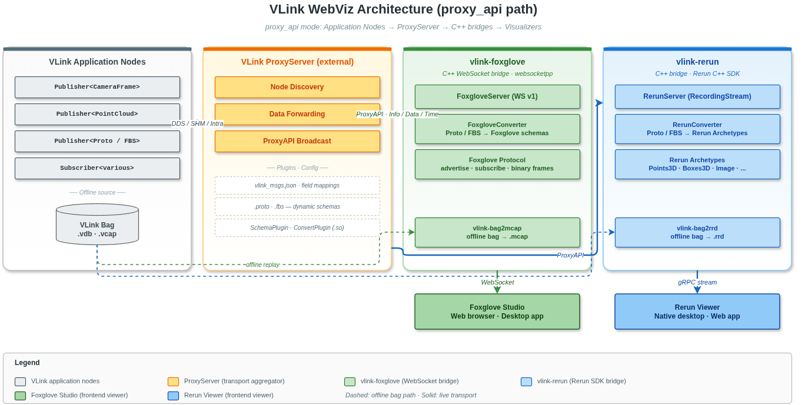
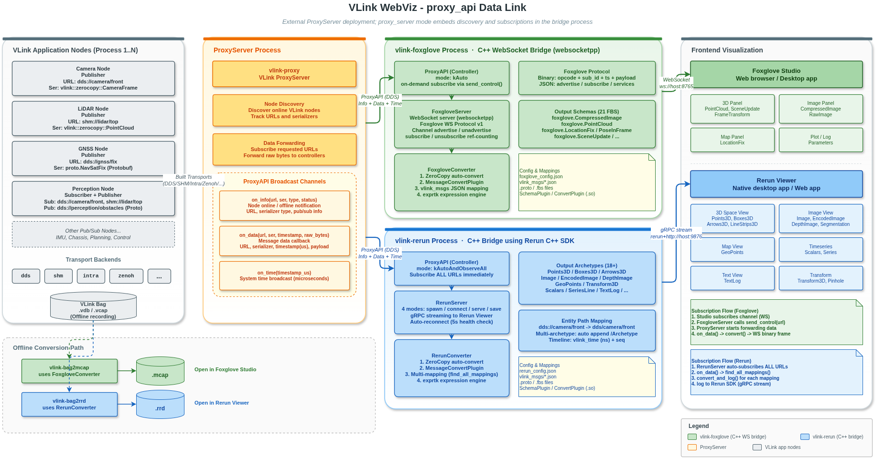
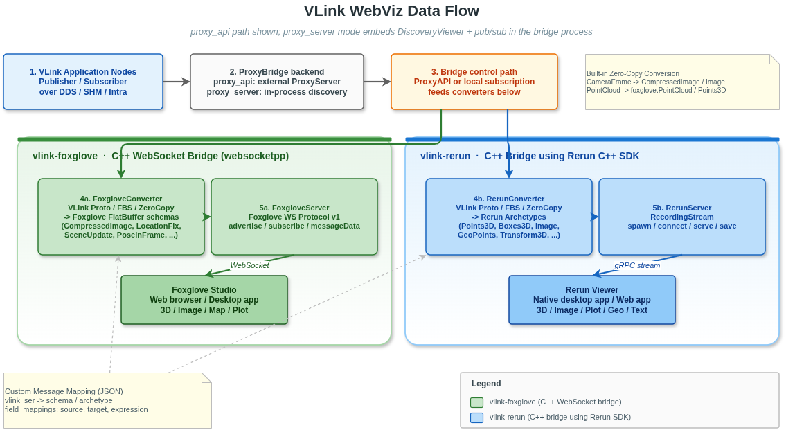
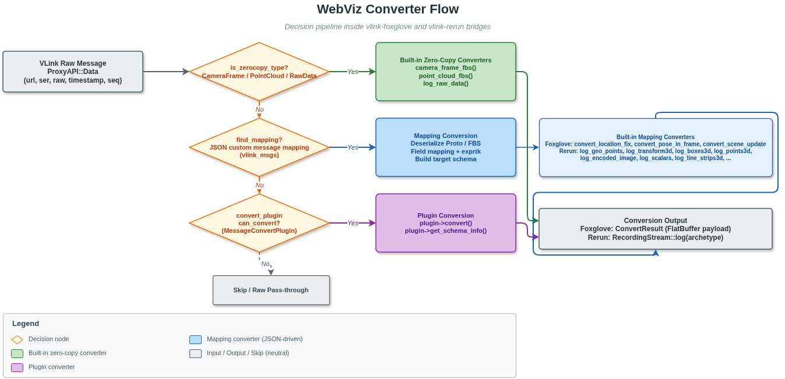

# 15. WebViz Web 可视化

## 15.1 概述

VLink WebViz 是 VLink 生态中的可视化桥接工具集。它把 VLink 中间件中的实时通信数据转换成主流可视化平台可理解的标准格式，使用户可以通过浏览器或桌面可视化器进行数据可视化、调试与分析。

WebViz 目前支持两个可视化后端：

| 后端 | 可执行程序 | 前端可视化平台 | 传输协议 | 离线转换工具 |
| --- | --- | --- | --- | --- |
| **Foxglove** | `vlink-foxglove` | Foxglove Studio | WebSocket | `vlink-bag2mcap` |
| **Rerun** | `vlink-rerun` | Rerun Viewer | gRPC | `vlink-bag2rrd` |

> **相关文档**：桌面 GUI 可视化工具参见 [14-viewer.md](14-viewer.md)；代理通信层参见 [16-proxy.md](16-proxy.md)；录制 / 回放 API 参见 [12-bag-recording.md](12-bag-recording.md)；CLI 工具参见 [13-cli-tools.md](13-cli-tools.md)。

---

## 15.2 整体架构



> 图中展示的是 `proxy_api` 部署路径；在 `proxy_server` 模式下，外部 `ProxyServer + ProxyAPI` 这一跳会折叠为 WebViz 进程内的 `ProxyBridge` 本地直连实现。

WebViz 的核心设计思想是“桥接”而非“重写”：VLink 应用节点通过各种传输后端（DDS、SHM、Intra 等）发布数据，WebViz 后端通过统一的 `ProxyBridge` 抽象接入这些数据流，再将 VLink 原生消息格式（Protobuf、FlatBuffers、零拷贝类型）转换为目标可视化平台的标准 Schema，通过 WebSocket（Foxglove）或 gRPC（Rerun）推送到前端可视化器。

`ProxyBridge` 提供两种运行模式：

- `proxy_api`：WebViz 作为外部客户端，通过 `ProxyAPI` 连接独立运行的 `ProxyServer`
- `proxy_server`：WebViz 在本进程内直接使用 `DiscoveryViewer + Publisher / Subscriber` 接入 VLink 网络，省去一次代理中转 DDS 通信和一个额外进程

## 15.3 完整数据链路



> 图中主链路展示的是 `proxy_api` 形态；若选择 `proxy_server`，则 WebViz 会直接进行节点发现与原始 Topic 订阅 / 发布，不再经过外部代理进程。

完整链路如下：

1. VLink 应用节点通过各种传输后端（DDS / SHM / Intra / Zenoh）发布消息，每个 Publisher 以 `<transport>://<topic>` 的 URL 标识。
2. Proxy 接入层有两种部署方式：
   - `proxy_api`：独立 `ProxyServer` 聚合所有传输后端的数据，WebViz 通过 `ProxyAPI` 接收 `Info / Data / Time`
   - `proxy_server`：WebViz 进程内直接做节点发现与原始 Topic 订阅 / 发布，不再经过外部 `ProxyServer`
3. WebViz 后端（`vlink-foxglove` 或 `vlink-rerun`）按需订阅感兴趣的 URL，并在 `controller` 模式下保留向 VLink 注入消息的能力。
4. Converter 根据消息的序列化类型，通过优先级链（零拷贝 > 插件 > JSON 映射）将 VLink 原生消息转换为目标平台格式。
5. 推送协议层将转换后的数据通过 WebSocket（Foxglove）或 gRPC（Rerun）发送到前端。
6. 前端可视化器（Foxglove Studio / Rerun Viewer）接收并展示这些数据。

## 15.4 数据流



> 数据流图展示的是统一抽象视角：`ProxyBridge` 对外提供同样的 `Info / Data / Time` 回调，而底层可选择 `proxy_api` 或 `proxy_server` 两种接入方式。

完整的数据流路径：

1. VLink 应用节点通过任意传输后端（`dds://`、`shm://`、`intra://` 等）发布消息。
2. Proxy 接入层以 `proxy_api` 或 `proxy_server` 模式向 WebViz 暴露 `Info / Data / Time` 数据流。
3. WebViz 后端根据前端订阅情况或自身策略，按需订阅感兴趣的 URL。
4. Converter 将 VLink 原生消息反序列化并转换为目标平台的可视化 Schema。
5. 推送协议层将转换后的数据通过 WebSocket（Foxglove）或 gRPC（Rerun）推送到前端。
6. 前端可视化用户在 Foxglove Studio 或 Rerun Viewer 中查看实时数据。

## 15.5 Proxy 接入模式与共享参数

两种模式的定位如下：

| 模式 | 连接方式 | 适用场景 | 特点 |
| --- | --- | --- | --- |
| `proxy_api` | WebViz 连接独立 `ProxyServer` | 多机部署、需要复用统一代理控制面 | 兼容现有 Proxy 生态，支持版本匹配、外部代理统一转发 |
| `proxy_server` | WebViz 进程内直接发现 / 订阅 / 发布 VLink Topic | 单机调试、车端本地可视化、对时延和资源更敏感 | 少一次代理中转 DDS 通信，少一个进程开销 |

共享 CLI 参数由 `vlink-foxglove` 和 `vlink-rerun` 同时支持：

| 参数 | 说明 | 默认值 |
| --- | --- | --- |
| `--proxy_interface` | 代理接入模式：`proxy_api` 或 `proxy_server` | `proxy_api` |
| `--proxy_role` | WebViz 角色；`proxy_api` 支持 `controller / listener`，`proxy_server` 仅支持 `controller` | `controller` |
| `--proxy_domain_id` | WebViz 进程使用的 DDS 域 ID | `0` |
| `--proxy_dds_impl` | DDS 实现（`dds` / `ddsc` / `ddsr` / `ddst`，仅 `proxy_api` 使用） | `dds` |
| `--proxy_native` | 仅使用本机回环流量 | `false` |
| `--proxy_tcp` | 为 DDS Topic 启用 TCP 传输 | `false` |
| `--proxy_bind_ip` | DDS 绑定 IP 地址 | 空 |
| `--proxy_peer_ip` | DDS 单播对端 IP | 空 |
| `--proxy_buf_size` | DDS Socket 缓冲区大小（字节） | `0` |
| `--proxy_mtu_size` | DDS MTU 大小（字节） | `0` |
| `--proxy_key` | `proxy_api` 模式的安全密钥 | 空 |
| `--proxy_reliable` | `proxy_api` 模式的可靠转发 | `false` |
| `--proxy_direct` | `proxy_api` 模式的直连 SHM 转发 | `false` |
| `--proxy_no_match_version` | 关闭 `proxy_api` 的版本匹配 | `false` |
| `--proxy_data_callback_mode` | 代理数据回调派发模式：`direct` 或 `queued` | `queued` |
| `--proxy_max_packet_size` | `proxy_server` 模式下允许转发的最大 payload（MiB）。**webviz 的 proxy_bridge 中 `0.0` 表示不限制**（`webviz/proxy_bridge.cc:245-246` 设置阈值，`webviz/proxy_bridge.cc:919` 仅对 `>0` 启用过滤）；**注意与 `vlink-proxy` 同名字段语义相反**（见 [代理 -- 注意 0=丢全部](16-proxy.md#1663-proxyserverconfig-字段说明)），后者 0 会丢弃所有非空消息 | `0.0` |
| `--proxy_use_iox` | `proxy_server` 模式下启动内嵌 Iceoryx RouDi | `false` |
| `--proxy_iox_config` | `proxy_server` 模式下的 Iceoryx TOML 配置路径 | 空 |
| `--proxy_iox_strategy` | `proxy_server` 模式下的 Iceoryx 内存策略 | `1` |
| `--proxy_iox_monitoring` | `proxy_server` 模式下的 Iceoryx 监控开关（`on / off`） | `on` |

共享 JSON 配置结构如下：

```json
{
  "proxy": {
    "interface_mode": "proxy_api",
    "role": "controller",
    "domain_id": 0,
    "dds_impl": "dds",
    "native": false,
    "enable_tcp": false,
    "bind_ip": "",
    "peer_ip": "",
    "buf_size": 0,
    "mtu_size": 0,
    "data_callback_mode": "queued",
    "api": {
      "security_key": "",
      "reliable": false,
      "direct": false,
      "match_version": true
    },
    "server": {
      "max_packet_size": 4.0,
      "use_iox": false,
      "iox_config": "",
      "iox_strategy": 2,
      "iox_monitoring": true
    }
  }
}
```

共享配置项说明：

| 配置项 | 说明 |
| --- | --- |
| `proxy.interface_mode` | 代理接入模式：`proxy_api` 或 `proxy_server` |
| `proxy.role` | WebViz 角色：`controller` 或 `listener` |
| `proxy.domain_id` | DDS 域 ID |
| `proxy.dds_impl` | DDS 实现（`dds` / `ddsc` / `ddsr` / `ddst`；仅 `proxy_api` 使用） |
| `proxy.native` | 是否只使用回环流量 |
| `proxy.enable_tcp` | 是否对 DDS Topic 启用 TCP |
| `proxy.bind_ip` | DDS 绑定 IP 地址 |
| `proxy.peer_ip` | DDS 单播对端 IP |
| `proxy.buf_size` | DDS Socket 缓冲区大小 |
| `proxy.mtu_size` | DDS MTU 大小 |
| `proxy.data_callback_mode` | 代理数据回调模式：`direct` 或 `queued` |
| `proxy.api.security_key` | `proxy_api` 模式的安全密钥 |
| `proxy.api.reliable` | `proxy_api` 模式是否使用可靠转发 |
| `proxy.api.direct` | `proxy_api` 模式是否使用直连 SHM 转发 |
| `proxy.api.match_version` | `proxy_api` 模式是否与外部 `ProxyServer` 做版本匹配 |
| `proxy.server.max_packet_size` | `proxy_server` 模式下允许转发的最大 payload（MiB）。默认 `0.0` 代表不限制（webviz 的桥接实现对 `>0` 才启用阈值判断），示例中写 `4.0` 仅为演示用 |
| `proxy.server.use_iox` | `proxy_server` 模式下是否启动内嵌 Iceoryx RouDi |
| `proxy.server.iox_config` | `proxy_server` 模式的 Iceoryx 配置文件 |
| `proxy.server.iox_strategy` | `proxy_server` 模式的 Iceoryx 内存策略 |
| `proxy.server.iox_monitoring` | `proxy_server` 模式的 Iceoryx 监控开关 |

设计约束：

- `proxy_api` 适合复用独立代理的场景，`--proxy_reliable`、`--proxy_direct`、`--proxy_no_match_version` 只在该模式下生效
- `proxy_data_callback_mode=queued` 会把 DataCallback 串行化到上层 WebViz 服务（`vlink-foxglove` 或 `vlink-rerun`）持有的 `MessageLoop`；`direct` 则直接在桥接回调线程转发
- `proxy_server` 适合低时延本地桥接，`--proxy_max_packet_size`、`--proxy_use_iox` 等仅在该模式下生效
- `proxy_server` 采用进程内本地桥接语义，不支持 `proxy_role=listener`
- `proxy_server` 模式会直接订阅/发布原始 VLink Topic，因此能减少一次代理中转 DDS 通信和一个额外进程

---

## 15.6 编译选项

### 15.6.1 CMake 选项

在根 `CMakeLists.txt` 中：

```cmake
option(ENABLE_WEBVIZ "Enable webviz" OFF)
```

WebViz 子目录中可独立控制两个后端：

```cmake
option(ENABLE_WEBVIZ_FOXGLOVE "Enable Foxglove for webviz" ON)
option(ENABLE_WEBVIZ_RERUN "Enable Rerun for webviz" OFF)
```

WebViz 的单元测试走项目统一的测试开关：

```cmake
option(ENABLE_TEST "Enable test" OFF)
```

说明：

- `ENABLE_WEBVIZ` 默认 `OFF`，且在顶层 `CMakeLists.txt` 中依赖 `ENABLE_PROXY`（`ENABLE_WEBVIZ=ON` 但 `ENABLE_PROXY=OFF` 时会打印 warning 并关闭 WebViz）
- `ENABLE_WEBVIZ=ON` 只会启用 WebViz 总入口；`ENABLE_WEBVIZ_FOXGLOVE` 默认 `ON`，`ENABLE_WEBVIZ_RERUN` 默认 `OFF`，若需要 `vlink-rerun`，还需显式打开 `ENABLE_WEBVIZ_RERUN=ON`
- `vlink-foxglove` 是 C++ WebSocket bridge 可执行文件（基于 `websocketpp`），把 VLink 数据按 Foxglove schema 推给浏览器里的 Foxglove Studio，**不是纯浏览器端程序**
- `vlink-rerun` 是 C++ 可执行文件，使用 Rerun 官方 C++ SDK（`<rerun.hpp>`），支持 `spawn / connect / serve / save` 四种模式，**同样不是纯浏览器端程序**
- 两者都链接 `vlink::proxy_api`（`webviz/CMakeLists.txt`），因此离不开 `ENABLE_PROXY`
- `vlink-rerun` 及 `vlink-bag2rrd` 还要求本机能找到 `rerun_sdk`
- 当前仓库没有额外的 WebViz 专属测试目标；仍沿用项目统一测试框架

### 15.6.2 依赖项

| 依赖库              | 用途                               | 两者共用 | Foxglove 专用 | Rerun 专用 |
| ------------------- | ---------------------------------- | :------: | :-----------: | :--------: |
| vlink::all          | `proxy_server` 本地桥接、公用运行时 |    ✅    |               |            |
| vlink::proxy_api    | `proxy_api` 通信层                 |    ✅    |               |            |
| protobuf            | Protobuf 消息动态解析              |    ✅    |               |            |
| flatbuffers         | FlatBuffers 消息处理               |    ✅    |               |            |
| nlohmann/json       | JSON 配置解析                      |    ✅    |               |            |
| argparse            | 命令行参数解析                     |    ✅    |               |            |
| exprtk              | 数学表达式引擎                     |    ✅    |               |            |
| websocketpp + asio  | WebSocket 服务端                   |          |      ✅       |            |
| rerun_sdk           | Rerun C++ SDK                      |          |               |     ✅     |

### 15.6.3 编译与安装

```bash
#编译（需先确保依赖可用）
cmake -B build -DENABLE_WEBVIZ=ON -DENABLE_WEBVIZ_RERUN=ON
cmake --build build -j8

#安装
cmake --install build
```

安装后，可执行程序位于 `<prefix>/bin/`：
- `vlink-foxglove`（实时 Foxglove 桥接服务）
- `vlink-rerun`（实时 Rerun 桥接服务）
- `vlink-bag2mcap`（Bag 文件离线转换为 MCAP 格式）
- `vlink-bag2rrd`（Bag 文件离线转换为 RRD 格式）

配置文件安装到 `<prefix>/etc/vlink/`（路径由 `INSTALL_CONFIG_DIR` CMake 缓存变量决定，默认 `etc/vlink`）下的工具子目录（子目录名等于可执行文件名）：
- `vlink-foxglove/foxglove_config.json`（以及 `vlink-foxglove/vlink_msgs/`、`vlink-foxglove/foxglove_msgs/`、`vlink-foxglove/rpc_msgs/` 目录）
- `vlink-rerun/rerun_config.json`（以及 `vlink-rerun/vlink_msgs/` 目录）

---

## 15.7 Foxglove 后端（vlink-foxglove）

### 15.7.1 功能概述

`vlink-foxglove` 是一个实时 WebSocket 桥接服务，实现了 [Foxglove WebSocket Protocol v1](https://docs.foxglove.dev/docs/connecting-to-data/frameworks/custom/#websocket)，将 VLink 中间件的实时数据流转换为 Foxglove Studio 可直接消费的标准 FlatBuffer 或 Protobuf 编码消息。

核心能力：

- **实时数据桥接**：通过 WebSocket 将 VLink 实时数据推送到 Foxglove Studio
- **自动通道发现**：通过 ProxyBridge 自动发现系统中所有在线 URL，动态 advertise/unadvertise
- **消息格式转换**：通过 FoxgloveConverter 将 VLink Protobuf/FlatBuffers/零拷贝类型转换为 Foxglove 标准 Schema
- **自定义消息映射**：通过 JSON 配置文件定义任意 VLink 消息类型到 Foxglove Schema 的映射规则
- **数学表达式引擎**：字段映射支持 exprtk 数学表达式，可在转换过程中进行单位换算、坐标变换等计算
- **话题过滤**：支持黑白名单机制，精确控制哪些 URL 对外可见
- **时间同步**：支持从消息中提取消息级时间戳（`timestamp_field`）；若消息未显式提供消息级时间戳，则回退到最近一次 `Time` 回调提供的 proxy-server 系统时间，并结合本地经过时间外推得到传输侧 wall-clock 兜底时间。该时间仅用于传输侧兜底，不代表采集时间或传感器时间
- **连接图**：支持 connectionGraph 能力，在 Foxglove 中查看节点拓扑
- **客户端发布**：支持 clientPublish 能力，Foxglove Studio 前端消息经 `foxglove_msgs` 或 ConvertPlugin 转换后调用桥接层 `send_data()` 发往 VLink
- **服务调用**：支持 Foxglove Service Call，经 `rpc_msgs/*.json` 示例配置将前端 JSON 请求映射到 VLink Client 调用，再把后端响应转换回前端 JSON
- **资源获取**：支持 fetchAsset 能力，从配置的资源目录中提供文件下载
- **插件扩展**：支持 SchemaPlugin（动态 Schema 注册）和 MessageConvertPlugin（自定义转换逻辑）

### 15.7.2 命令行参数

```bash
vlink-foxglove [OPTIONS]
```

| 参数                         | 说明                                              | 默认值           |
| ---------------------------- | ------------------------------------------------- | ---------------- |
| `-p`, `--port`               | WebSocket 服务端口                                | `8765`           |
| `-a`, `--address`            | WebSocket 绑定地址                                | `0.0.0.0`        |
| `-c`, `--config`             | JSON 配置文件路径                                 | 空               |
| `--name`                     | Foxglove 服务名称                                 | `vlink-foxglove` |
| `--proto_dir`                | Proto 文件目录（动态解析）                        | 空               |
| `--fbs_dir`                  | FBS 文件目录（动态 FlatBuffers 解析）             | 空               |
| `--schema_plugin`                   | Schema 插件共享库路径                              | 空               |
| `--convert_plugin`           | 消息转换插件共享库路径                            | 空               |
| `--convert_plugin_config`    | 转换插件配置字符串                                | 空               |
| `--vlink_msgs`               | `vlink_msgs` 映射文件路径（可多个）               | 空               |
| `--foxglove_msgs`            | `foxglove_msgs` 映射文件路径（仅 Foxglove）       | 空               |
| `--rpc_msgs`                 | `rpc_msgs` RPC 映射文件路径（可多个）             | 空               |
| `--send_time`                | 启用向前端推送时间更新                            | `false`          |
| `--parameters_url`           | Foxglove Parameters 下发绑定的 VLink URL；仅用于 `setParameters` 时创建 `Setter<Bytes>` | 空               |
| `--parameters_encoding`      | 参数后端序列化格式：`json/protobuf/flatbuffer`（兼容读取 `flatbuffers`）   | `json`           |
| `-i`, `--filter`             | URL 过滤字符串，空格分隔，大小写不敏感            | 空               |
| `-k`, `--black`              | 将 `-i/--filter` 作为黑名单模式                   | `false`          |
| `--allow_multiple`           | 允许同机同时运行多个 `vlink-foxglove` 实例        | `false`          |

共享代理参数请参考上文“**Proxy 接入模式与共享参数**”章节，`vlink-foxglove` 支持完整的 `--proxy_*` 选项集。

握手要求：

- Foxglove 客户端必须协商 `foxglove.websocket.v1` 子协议；未带该子协议的连接会被直接拒绝。

### 15.7.3 配置文件

`foxglove_config.json` 是 `vlink-foxglove` 的根配置文件。仅当显式传入 `--config` 时才会加载；未传入时不会在当前目录或上级目录自动搜索配置文件。

配置文件结构：

```json
{
  "name": "vlink-foxglove-bridge",
  "port": 8765,
  "address": "0.0.0.0",
  "send_time": false,

  "filter": {
    "whitelist": [],
    "blacklist": []
  },

  "capabilities": {
    "time": false,
    "connection_graph": true,
    "publish": true,
    "rpcs": true,
    "assets": false
  },

  "parameters": {
    "url": "dds://foxglove/parameters",
    "encoding": "json",
    "values": [
      { "name": "vehicle.mode", "value": "AUTO" },
      { "name": "control.max_speed", "value": 12.5, "type": "float64" },
      { "name": "planner.enable_debug", "value": true }
    ]
  },

  "proxy": {
    "interface_mode": "proxy_api",
    "role": "controller",
    "domain_id": 0,
    "dds_impl": "dds",
    "native": false,
    "enable_tcp": false,
    "bind_ip": "",
    "peer_ip": "",
    "buf_size": 0,
    "mtu_size": 0,
    "api": {
      "security_key": "",
      "reliable": false,
      "direct": false,
      "match_version": true
    },
    "server": {
      "max_packet_size": 4.0,
      "use_iox": false,
      "iox_config": "",
      "iox_strategy": 2,
      "iox_monitoring": true
    }
  },

  "proto_dir": "",
  "fbs_dir": "",
  "schema_plugin_path": "",
  "convert_plugin_path": "",
  "convert_plugin_config": "",

  "vlink_msgs": [
    "vlink_msgs/example_gps.json",
    "vlink_msgs/example_imu.json",
    "vlink_msgs/example_obstacle.json",
    "vlink_msgs/example_frame_transform.json",
    "vlink_msgs/example_laserscan.json",
    "vlink_msgs/example_log.json",
    "vlink_msgs/example_raw_image.json",
    "vlink_msgs/example_camera_calibration.json",
    "vlink_msgs/example_joint_states.json"
  ],
  "foxglove_msgs": [
    "foxglove_msgs/example_command.json",
    "foxglove_msgs/example_command_flatbuffers.json",
    "foxglove_msgs/example_command_json_proto_schema.json",
    "foxglove_msgs/example_json_payload.json"
  ],
  "rpc_msgs": [
    "rpc_msgs/example_set_mode_rpc.json",
    "rpc_msgs/example_reset_rpc.json"
  ]
}
```

`webviz` 下的本地配置 / 映射 JSON 统一使用 `snake_case` 键名，例如 `schema_name`、`schema_encoding`、`encoding`、`default_value`。
Foxglove WebSocket 协议自身的在线报文字段仍然保持官方定义，例如 `schemaName`、`channelId`、`serviceId`；这些是协议字段，不是本地配置键。
同一个映射文件若写成 JSON 数组，则要求数组内每一项都合法；任意一项校验失败时，该文件整体不会生效，避免部分加载导致行为不确定。

| 配置项                     | 说明                                                      |
| -------------------------- | --------------------------------------------------------- |
| `name`                     | 服务名称，显示在 Foxglove Studio 中                       |
| `port`                     | WebSocket 端口号                                          |
| `address`                  | 绑定 IP 地址                                              |
| `filter.whitelist`         | URL 白名单；若写成字符串，则按空格切分并做大小写不敏感子串匹配；若写成字符串数组，则通常应填写完整 URL，并按数组元素做严格精确匹配 |
| `filter.blacklist`         | URL 黑名单；若写成字符串，则按空格切分并做大小写不敏感子串匹配；若写成字符串数组，则通常应填写完整 URL，并按数组元素做严格精确匹配 |
| `capabilities.time`        | 是否显式开启 Foxglove `time` capability；若配置了 `send_time` 或存在 `converter: "send_time"` 的内部时间源，服务端仍会自动对外暴露 time capability |
| `capabilities.connection_graph` | 是否支持连接图                                        |
| `capabilities.publish` | 是否允许前端下发消息并回写到 VLink；若配置了 `foxglove_msgs` 且未显式关闭，默认会自动打开 |
| `capabilities.rpcs` | 是否对前端暴露 Service Call；若配置了 `rpc_msgs` 且未显式关闭，默认会自动打开 |
| `capabilities.assets` | 是否开放 `fetchAsset`；需要同时配置 `asset_dirs` |
| `parameters.url`           | Foxglove `setParameters` 下发绑定的后端 VLink URL；配置后会创建 `Setter<Bytes>` 将参数更新写到该 URL；该能力不受 topic URL filter 约束 |
| `parameters.encoding`      | 写往 `parameters.url` 的后端序列化格式，支持 `json` / `protobuf` / `flatbuffer`，并兼容读取 `flatbuffers`；默认 `json` |
| `parameters.values`        | 前端 Parameters panel 初始参数表；Foxglove server 用它回复 `getParameters` / `subscribeParameterUpdates`；未配置时面板初始为空。这里的每个条目都必须显式包含 `value` |
| `send_time`                | 是否推送 Proxy 服务时间到前端（默认 `false`）；这是独立的内部时间流，不依赖前端 channel subscribe |
| `proxy`                    | 共享代理配置对象；字段定义见“Proxy 接入模式与共享参数”    |
| `proto_dir`                | .proto 文件目录（相对路径基于配置文件目录）                |
| `fbs_dir`                  | .fbs 文件目录                                             |
| `schema_plugin_path`              | Schema 插件共享库路径（相对路径基于配置文件目录）           |
| `convert_plugin_path`             | 转换插件共享库路径（相对路径基于配置文件目录）             |
| `convert_plugin_config`    | 转换插件配置字符串；按原样传给插件，不做相对路径解析       |
| `vlink_msgs`               | `vlink_msgs` 映射文件列表（相对路径基于配置文件目录）      |
| `foxglove_msgs`            | `foxglove_msgs` 映射文件列表（相对路径基于配置文件目录）   |
| `rpc_msgs`                 | RPC 映射文件列表；仓库示例位于 `rpc_msgs/`                 |
| `asset_dirs`               | 允许 `fetchAsset` 访问的目录列表；相对路径基于配置文件目录，不存在的目录会被忽略，若最终为空则 `assets` 能力会自动关闭 |

`filter` 必须是对象，`filter.whitelist` / `filter.blacklist` 必须是字符串或字符串数组；`capabilities` 必须是对象；`parameters` 必须是对象；`vlink_msgs` / `foxglove_msgs` / `rpc_msgs` / `asset_dirs` 必须是字符串数组。上述字段类型写错时，当前配置文件会直接判定为无效。

### 15.7.4 `foxglove_msgs` 前端下发映射

`foxglove_msgs` 仅用于 Foxglove 的 `clientPublish` / Publish panel 下发链路。Foxglove 前端下发到后端的 payload 固定按 JSON 处理；`foxglove_msgs` 只负责把这份前端 JSON 编成目标 `ser` 对应的后端 payload，然后调用桥接层 `send_data()` 发回 VLink。

它的职责边界需要明确：

- `foxglove_msgs` 负责“前端按 `url` 发布一条消息”
- `rpc_msgs` 负责“前端按 service name 发起一次请求-响应调用”
- Foxglove 的 `Variables` / `Variable Slider` 是前端布局变量，不是后端 WebSocket 协议能力；后端不会直接收到“变量更新”
- Foxglove 的 `Parameters` 面板显示的数据，由 `parameters.values` 提供；前端修改后的参数更新，再通过 `parameters.url` 下发到后端
- 仅配置 `parameters.url` 而不配置 `parameters.values` 时，`Parameters` 面板初始会是空的；`parameters.url` 只负责把修改后的参数下发到后端，不负责生成前端参数列表
- Foxglove 内置 `Teleop panel` 当前不适用于 custom WebSocket 数据源；它不会向 `webviz/foxglove` 发送 `clientPublish` 消息。若要做遥控，请改用 `Publish panel`、`Service Call panel`，或自定义 Foxglove extension panel

匹配顺序如下：

1. 先按前端 publish 的 `url + schema_name + schema_encoding` 尝试命中 `foxglove_msgs`；若前端没有把这些字段全部带上，后端会用本地映射把缺失的 schema 回填
2. 只有在没有命中静态 `foxglove_msgs` 时，才会退回 ConvertPlugin 的 `can_convert_frontend()` / `get_publish_info()` 做兜底

只要配置了 `foxglove_msgs`，`capabilities.publish` 在未显式配置时会自动打开。仅配置 `convert_plugin_path` 时不会自动开启 `publish`，因为后端无法主动 advertise 出固定的 Publish channels。
当前 `serverInfo.supportedEncodings` 固定只有 `["json"]`，因为 Publish panel 和 Service Call panel 面向前端的输入都被收敛成 JSON。

`convert_plugin_config` 无论来自命令行还是 JSON，都会作为原始配置字符串传给 ConvertPlugin，不会被当作文件路径展开。

```json
{
  "url": "dds://vehicle/control/cmd",
  "encoding": "protobuf",
  "ser": "control.proto.VehicleCmd"
}
```

| 字段              | 必填 | 说明 |
| ----------------- | :--: | ---- |
| `encoding`        | 否   | 目标后端 payload 编码，支持 `json` / `text` / `protobuf` / `flatbuffers`；对 `protobuf` / `flatbuffers` 目标应显式提供；对 `ser: "json"` / `"text"` 可省略并自动推导 |
| `schema_name`     | 否   | 前端 JSON schema 名称；若与 `ser` 相同可省略，后端会自动继承 |
| `schema_encoding` | 否   | 前端 schema 编码；仅支持 `jsonschema` / `json` |
| `schema`          | 否   | 前端 JSON schema 内容；省略时会按目标 `ser` 自动生成默认 JSON schema |
| `url`             | 否   | 目标 URL 选择器。可缺省；可写单个字符串、字符串数组，或 `{ "whitelist": ..., "blacklist": ... }` 对象 |
| `ser`             | 是   | 转换后的目标 VLink 序列化类型 |

补充规则：

- Foxglove 前端下发到后端的输入一律按 JSON 处理，不再配置前端 `encoding`
- `foxglove_msgs` 这类前端下发映射配置不接受单独的 `schema_type` 字段；当前实现会根据 `encoding` 解析出目标 family，并在运行时继续把解析后的 `schema_type` 带入后端路由元数据
- `url` 缺省时，表示这条映射不限制 URL；最终发送到后端的目标 URL 直接取前端 publish 的 topic
- `url` 为字符串时，表示单个精确 URL；为字符串数组时，表示多个精确 URL，并会为这些 URL 提前创建 Publish channels
- `url` 为对象时，复用 `filter.whitelist` / `filter.blacklist` 的语义：字符串按空格切词做大小写不敏感子串匹配，数组按完整 URL 做严格精确匹配
- `url` 对象里的 `whitelist` / `blacklist` 若不是字符串或字符串数组，会直接判定该映射无效
- `foxglove_msgs` 不再单独维护前端别名 `topic`；前端 topic 直接等于运行时 URL
- 前端下发链路不再支持 `field_mappings`
- `foxglove_msgs` 不再支持 `passthrough` / `passthrough_json`
- 对于“前端 JSON，但目标 `ser` 是 Protobuf / FlatBuffers”的场景，后端会直接用官方 JSON 解析能力把 JSON 编成目标二进制
- 若显式写了 `schema` / `schema_path`，则必须能解析成合法 JSON schema；配置错误不会再静默回退成自动生成 schema
- 若只配置了 ConvertPlugin 而没有静态精确 `url` 的 `foxglove_msgs`，插件仍然可以处理前端 publish，但需要显式开启 `capabilities.publish`，并且后端无法主动 advertise 出固定的 Publish panel channels

#### 15.7.4.1 `foxglove_msgs` 示例目录

仓库内置了多种前端下发示例：

- `webviz/foxglove/etc/foxglove_msgs/example_command.json`：JSON -> Protobuf，直接使用目标 Protobuf schema
- `webviz/foxglove/etc/foxglove_msgs/example_command_json_proto_schema.json`：显式 JSON schema + JSON -> Protobuf
- `webviz/foxglove/etc/foxglove_msgs/example_command_flatbuffers.json`：JSON -> FlatBuffer
- `webviz/foxglove/etc/foxglove_msgs/example_nested_expression.json`：嵌套 JSON -> Protobuf 直接路由
- `webviz/foxglove/etc/foxglove_msgs/example_json_payload.json`：转换后输出 JSON payload
- `webviz/foxglove/etc/foxglove_msgs/example_repeated_protobuf.json`：前端数组 JSON -> Protobuf 直接路由
- `webviz/foxglove/etc/foxglove_msgs/example_teleop_cmd_vel.json`：为 custom WebSocket 场景提供的 Teleop 替代写法，配合 `Publish panel` 发送 Twist 风格控制消息

### 15.7.5 `rpc_msgs` RPC 映射

`rpc_msgs` 只用于 Foxglove Service Call panel。Service Call panel 在前端是“输入 service name，然后发起一次请求并等待响应”，因此 `rpc_msgs` 不应该被拿来承载普通遥控 topic、按钮模板或滑块模板。

每条配置包含：

- `request`：前端请求 JSON schema
- 顶层 `url` / `ser` / `encoding`：后端 RPC 请求目标；`url` 不能缺省
- `response`：后端响应如何回到前端；当前实现要求显式提供 `response`，并且至少给出 `response.ser`
- `schema` / `schema_name` / `schema_encoding`：定义前端请求或响应的 schema
- `url` 同样受全局 `filter.whitelist` / `filter.blacklist` 约束；被过滤掉的 RPC 不会对前端 advertise，前端强行调用也会被后端拒绝

补充说明：

- 当前 `webviz/foxglove` 对前端宣告的 `supportedEncodings` 固定只有 `["json"]`
- `rpc_msgs.request` 描述的是前端请求 JSON schema
- `rpc_msgs.response` 描述的是前端响应 JSON schema
- 顶层 `url` / `ser` / `encoding` 描述的是后端请求目标
- `response.ser` 描述的是后端 RPC 响应的实际序列化类型；后端会把它解码后统一回前端 JSON
- `response.encoding` 目前仅支持 `json` / `text` / `protobuf` / `flatbuffers`，不支持 `zerocopy`

```json
{
  "name": "vehicle/set_mode",
  "type": "vehicle.SetMode",
  "timeout_ms": 1500,
  "request": {},
  "url": "dds://vehicle/service/set_mode",
  "encoding": "protobuf",
  "ser": "control.proto.SetModeRequest",
  "response": {
    "encoding": "protobuf",
    "ser": "control.proto.SetModeResponse"
  }
}
```

内置示例：

- `webviz/foxglove/etc/rpc_msgs/example_set_mode_rpc.json`
- `webviz/foxglove/etc/rpc_msgs/example_reset_rpc.json`

### 15.7.6 按前端能力反推后的后端设计

Foxglove 前端常见的几个交互入口，在 `webviz` 里应该对应成下面这三类，而不是混在一起：

| Foxglove 前端功能 | 后端能力 | 当前配置入口 | 说明 |
| ----------------- | -------- | ------------ | ---- |
| Publish panel / 按 `url` 下发控制消息 | `clientPublish` | `foxglove_msgs` | 适合遥控、调试命令、模板化控制消息 |
| Service Call panel | `services` | `rpc_msgs` | 适合请求-响应式调用；前端以 `service name` 选服务 |
| Variables / Variable Slider | 前端布局变量 | 无后端配置 | 变量值留在前端布局内部，可被 Publish panel 模板引用，但不会自动变成后端协议 |
| Parameters panel | `parameters` / `parametersSubscribe` | `parameters.values` + `parameters.url` | `parameters.values` 决定前端面板显示哪些参数；`parameters.url` 负责把前端修改后的参数更新下发到后端；若未配置 `parameters.values`，面板初始为空 |

当前实现里，`Variables / Variable Slider` 仍然只是前端布局变量；如果你需要真正的后端参数同步，请走 `parameters` 能力，不要再把它设计进 `rpc_msgs` 或 `foxglove_msgs`。

参数功能保持收敛，只支持“本地参数表 + 单个下发 URL”这一种模型：

- `parameters.values`：Foxglove server 本地维护的参数表，决定前端 Parameters panel 的显示内容
- `parameters.values` 里的每个条目都必须显式带 `value`；这里只接受“初始值”，不接受“删除项”
- `parameters.url`：创建 `Setter<Bytes>` 的目标 URL；当前端执行 `setParameters` 时，服务端会把更新后的参数表编码后写到这个 URL
- 如果只配置了 `parameters.url` 而没有 `parameters.values`，Foxglove server 仍然会接受 `setParameters`，但 `Parameters` 面板打开时不会自动出现任何参数项
- `parameters.values` 不会在服务启动时自动写到 `parameters.url`；只有前端实际执行 `setParameters` 后，后端 `Setter` 才会发出参数快照
- `getParameters([])` / `subscribeParameterUpdates([])` 的空 `parameterNames` 数组表示“全部参数”
- `subscribeParameterUpdates(names)` 会直接替换该客户端旧的参数订阅集合，不会和旧集合叠加
- `unsubscribeParameterUpdates([])` 会清空该客户端全部参数订阅；`unsubscribeParameterUpdates(names)` 只从当前集合中移除指定参数
  - 若客户端当前订阅的是“全部参数”，则 `unsubscribeParameterUpdates(names)` 会转成“全部参数减去这些显式排除项”，后续新增参数仍会继续收到
- `parameterValues` 不会再把“已删除 / 不存在”的参数作为空壳条目回给前端；删除后这些参数只会从结果中消失
- `json` 模式：写往 `parameters.url` 的 payload 是 `{"parameters":[...]}` 这种 JSON 文本
- `protobuf` 模式：写往 `parameters.url` 的 payload 是 `vlink.webviz.foxglove.pb.ParameterSnapshot`
- `flatbuffer` 模式：写往 `parameters.url` 的 payload 是 `vlink.webviz.foxglove.fbs.ParameterSnapshot`

三种模式对外语义一致，参数条目统一写成：

```json
{
  "name": "vehicle.mode",
  "value": "AUTO"
}
```

可选 `type` 仅支持三类显式提示：

- `byte_array`
- `float64`
- `float64_array`

前端运行时若要删除参数，可在 `setParameters` 里省略 `value` 字段：

```json
{
  "name": "debug.temp_limit"
}
```

### 15.7.7 使用示例

```bash
# 基本启动（不加载配置文件）
vlink-foxglove

# 指定端口
vlink-foxglove -p 9090

# 使用白名单过滤多个 URL 关键字
vlink-foxglove -i "camera lidar"

# 使用黑名单过滤 URL 关键字
vlink-foxglove -i "debug test" -k

# 指定配置文件和 Proto 目录
vlink-foxglove -c /path/to/foxglove_config.json --proto_dir /path/to/protos

# 启用后端参数能力
vlink-foxglove --parameters_url dds://vehicle/parameters --parameters_encoding protobuf

# 叠加服务/前端下发映射
vlink-foxglove \
  --rpc_msgs /path/to/rpc_msgs/set_mode.json \
  --foxglove_msgs /path/to/foxglove_msgs/vehicle_cmd.json

# 使用特定 DDS 域
vlink-foxglove --proxy_domain_id 42

# 使用独立 ProxyServer + 安全密钥
vlink-foxglove --proxy_interface proxy_api --proxy_key "my_secret_key_32bytes_exactly!!"

# 进程内直连模式，减少一次代理中转，并把数据回调入队处理
vlink-foxglove --proxy_interface proxy_server --proxy_data_callback_mode queued

# 在 Foxglove Studio 中连接
# 打开 Foxglove Studio -> Data Source -> Foxglove WebSocket -> ws://localhost:8765
```

---

## 15.8 Rerun 后端（vlink-rerun）

### 15.8.1 功能概述

`vlink-rerun` 是一个实时数据桥接服务，将 VLink 中间件的数据流转换为 [Rerun](https://rerun.io/) 原生 Archetype 格式，通过 gRPC 推送到 Rerun Viewer 进行多模态可视化。

核心能力：

- **四种运行模式**：Spawn（自动启动 Rerun Viewer）、Connect（连接到已运行的 Viewer）、Serve（作为 gRPC 服务端等待连接）、Save（直接保存到 .rrd 文件）
- **丰富的 Archetype 支持**：支持一组常用 Rerun Archetype 直接映射；Protobuf 路径覆盖最完整，FlatBuffers 路径覆盖其中的大多数，少数复杂 Archetype 仍会回退为 TextLog
- **自动重连**：在 Spawn/Connect 模式下，定期检测连接健康状态，断线后自动重连
- **零拷贝类型原生支持**：CameraFrame 直接转换为 Image/EncodedImage，PointCloud 直接转换为 Points3D
- **插件扩展**：与 Foxglove 后端共享相同的 SchemaPlugin 和 MessageConvertPlugin 接口
- **时间轴管理**：默认使用 `timestamp`（消息级时间戳优先、否则桥接层 wall-clock 兜底）和 `seq`（每 URL 的代理转发序列号）两条时间轴，可通过配置改名或关闭；若使用 `converter: "send_time"` 或插件 `SendTime`，还会额外更新 `vlink_time` duration 时间轴
- **静态数据持久化**：Pinhole、ViewCoordinates、AnnotationContext 等配置数据使用 `log_static` 持久化
- **Entity 清理**：代理断开或 Topic 失效时自动清除对应 Entity 数据
- **Viewer 控制**：支持 `recording_id`、spawn/serve 内存上限、playback 行为、可执行文件路径等高级运行配置

### 15.8.2 命令行参数

```bash
vlink-rerun [OPTIONS]
```

| 参数                         | 说明                                              | 默认值                                 |
| ---------------------------- | ------------------------------------------------- | -------------------------------------- |
| `-m`, `--mode`               | 运行模式（spawn/connect/serve/save）              | `spawn`                                |
| `-a`, `--address`            | gRPC 地址（connect 模式）                         | `rerun+http://127.0.0.1:9876/proxy`   |
| `--bind_ip`                  | 绑定 IP（serve 模式）                             | `0.0.0.0`                              |
| `-p`, `--port`               | 端口号（serve 模式）                              | `9876`                                 |
| `--save_path`                | 保存路径（save 模式）                             | 空                                     |
| `-c`, `--config`             | JSON 配置文件路径                                 | 空                                     |
| `--name`                     | Rerun 应用名称                                    | `vlink-rerun`                          |
| `--proto_dir`                | Proto 文件目录                                    | 空                                     |
| `--fbs_dir`                  | FBS 文件目录                                      | 空                                     |
| `--schema_plugin`                   | Schema 插件共享库路径                              | 空                                     |
| `--convert_plugin`           | 消息转换插件共享库路径                            | 空                                     |
| `--convert_plugin_config`    | 转换插件配置字符串                                | 空                                     |
| `--vlink_msgs`               | `vlink_msgs` 映射文件路径（可多个）               | 空                                     |
| `--recording_id`             | 指定 Rerun recording ID                           | 空                                     |
| `--spawn_memory_limit`       | spawn 模式下 Viewer 的内存上限                    | `75%`                                  |
| `--spawn_server_memory_limit`| spawn 模式下内置 gRPC server 的内存上限           | `1GiB`                                 |
| `--spawn_hide_welcome_screen`| spawn 模式下隐藏欢迎页                            | `false`                                |
| `--spawn_no_detach`          | spawn 模式下不要 detach 子进程                    | `false`                                |
| `--spawn_executable_name`    | spawn 模式下使用的可执行文件名                    | `rerun`                                |
| `--spawn_executable_path`    | spawn 模式下使用的可执行文件绝对路径              | 空                                     |
| `--serve_memory_limit`       | serve 模式下 gRPC server 的内存上限               | `1GiB`                                 |
| `--playback_behavior`        | serve 模式播放策略（`oldest_first/newest_first`） | `oldest_first`                         |
| `--sequence_timeline`        | 序列时间轴名称                                    | `seq`                                  |
| `--timestamp_timeline`       | 时间戳时间轴名称                                  | `timestamp`                            |
| `--disable_sequence_timeline`| 关闭序列时间轴                                    | `false`                                |
| `--disable_timestamp_timeline`| 关闭时间戳时间轴                                 | `false`                                |
| `-i`, `--filter`             | URL 过滤字符串，空格分隔，大小写不敏感            | 空                                     |
| `-k`, `--black`              | 将 `-i/--filter` 作为黑名单模式                   | `false`                                |
| `--allow_multiple`          | 允许同机同时运行多个 `vlink-rerun` 实例           | `false`                                |
共享代理参数请参考上文“**Proxy 接入模式与共享参数**”章节，`vlink-rerun` 同样支持完整的 `--proxy_*` 选项集。

### 15.8.3 运行模式

| 模式       | 说明                                             | 适用场景                         |
| ---------- | ------------------------------------------------ | -------------------------------- |
| `spawn`    | 自动启动本地 Rerun Viewer 进程并连接             | 本机开发调试（默认模式）         |
| `connect`  | 连接到已运行的 Rerun Viewer 的 gRPC 地址         | Viewer 已在远程机器运行          |
| `serve`    | 作为 gRPC 服务端，等待 Rerun Viewer 主动连接     | 车端部署，远程查看               |
| `save`     | 直接将数据保存为 .rrd 文件，不启动 Viewer        | 离线数据采集与后处理             |

### 15.8.4 配置文件

`rerun_config.json` 是 `vlink-rerun` 的根配置文件。仅当显式传入 `--config` 时才会加载；未传入时不会在当前目录或上级目录自动搜索配置文件。

配置文件结构：

```json
{
  "name": "vlink-rerun",
  "mode": "spawn",
  "address": "rerun+http://127.0.0.1:9876/proxy",
  "bind_ip": "0.0.0.0",
  "port": 9876,
  "save_path": "",
  "recording_id": "",

  "filter": {
    "whitelist": [],
    "blacklist": []
  },

  "proxy": {
    "interface_mode": "proxy_api",
    "role": "controller",
    "domain_id": 0,
    "dds_impl": "dds",
    "native": false,
    "enable_tcp": false,
    "bind_ip": "",
    "peer_ip": "",
    "buf_size": 0,
    "mtu_size": 0,
    "api": {
      "security_key": "",
      "reliable": false,
      "direct": false,
      "match_version": true
    },
    "server": {
      "max_packet_size": 4.0,
      "use_iox": false,
      "iox_config": "",
      "iox_strategy": 2,
      "iox_monitoring": true
    }
  },

  "proto_dir": "",
  "fbs_dir": "",
  "schema_plugin_path": "",
  "convert_plugin_path": "",
  "convert_plugin_config": "",
  "spawn_memory_limit": "75%",
  "spawn_server_memory_limit": "1GiB",
  "spawn_hide_welcome_screen": false,
  "spawn_detach_process": true,
  "spawn_executable_name": "rerun",
  "spawn_executable_path": "",
  "serve_memory_limit": "1GiB",
  "playback_behavior": "oldest_first",
  "sequence_timeline": "seq",
  "timestamp_timeline": "timestamp",
  "use_sequence_timeline": true,
  "use_timestamp_timeline": true,

  "vlink_msgs": [
    "vlink_msgs/example_gps.json",
    "vlink_msgs/example_imu.json",
    "vlink_msgs/example_obstacle.json",
    "vlink_msgs/example_scalars.json",
    "vlink_msgs/example_text_log.json",
    "vlink_msgs/example_line_strips3d.json",
    "vlink_msgs/example_points2d.json",
    "vlink_msgs/example_pinhole.json",
    "vlink_msgs/example_view_coordinates.json",
    "vlink_msgs/example_asset3d.json",
    "vlink_msgs/example_tensor.json",
    "vlink_msgs/example_bar_chart.json"
  ]
}
```

`filter.whitelist` / `filter.blacklist` 支持两种写法，而且两者语义不同：

- JSON 字符串数组，例如 `["dds://camera/front", "shm://lidar/top"]`
- 单个空格分隔字符串，例如 `"camera lidar"`

- 若写成字符串，会先按空格切分，再按 URL 做大小写不敏感子串匹配，例如 `"camera lidar"` 会匹配相机和激光相关 URL
- 若写成字符串数组，则数组项必须填写完整 URL，并按完整字符串做严格精确匹配，不做拆词，也不做大小写归一化

### 15.8.5 URL 到实体路径转换

Rerun 使用树状的实体路径（Entity Path）来组织数据。`vlink-rerun` 通过 `url_to_entity_path()` 将 VLink URL 自动转换为 Rerun 实体路径：

```
dds://camera/front    ->  dds/camera/front
shm://sensor/lidar    ->  shm/sensor/lidar
intra://control/cmd   ->  intra/control/cmd
```

转换规则：将 `://` 替换为 `/`，使传输协议成为 Rerun 实体树的顶级命名空间。

### 15.8.6 Rerun 健康探测与重连

在 `spawn` 和 `connect` 模式下，`RerunServer` 会在自身 `MessageLoop` 上启动一个 5 秒周期的探测定时器：

- 定时调用 `flush_blocking()` 探测当前 Viewer / gRPC 连接是否仍可用
- 若探测失败，则记录告警并立即按当前模式重建 `RecordingStream`
- 若启动时 Viewer 尚未可用（例如 `spawn` 还找不到可执行文件，或 `connect` 目标尚未启动），进程不会直接退出，而是进入重连等待模式，后续由这个 5 秒探测定时器持续重试
- `serve` 和 `save` 模式不启用该探测，也不会做自动重连

这里的 `flush_blocking()` 只用于 Viewer 连通性探测，不参与消息时间戳推断，也不改变 `timestamp_field` / Proxy `Time` 的语义。

### 15.8.7 使用示例

```bash
# 自动启动 Rerun Viewer（默认模式）
vlink-rerun

# 连接到远程 Rerun Viewer
vlink-rerun -m connect -a "rerun+http://192.168.1.100:9876/proxy"

# 作为 gRPC 服务端
vlink-rerun -m serve -p 9876

# 保存为 RRD 文件
vlink-rerun -m save --save_path /tmp/vlink_recording.rrd

# 使用白名单过滤多个 URL 关键字
vlink-rerun -i "camera lidar"

# 使用黑名单过滤 URL 关键字
vlink-rerun -i "debug test" -k

# 指定 DDS 域和 Proto 目录
vlink-rerun --proxy_domain_id 42 --proto_dir /path/to/protos

# 指定 recording_id、时间轴和内存上限
vlink-rerun \
  --recording_id vehicle-dev \
  --sequence_timeline seq \
  --timestamp_timeline sensor_time \
  --spawn_memory_limit 16GB \
  --serve_memory_limit 2GiB

# 进程内直连模式，减少一次代理中转
vlink-rerun --proxy_interface proxy_server --mode spawn
```

---

## 15.9 自定义消息映射

### 15.9.1 映射机制

WebViz 的核心扩展能力在于自定义消息映射（Custom Message Mapping）。通过 JSON 配置文件，用户可以定义任意 VLink 消息类型（Protobuf 或 FlatBuffers）到目标可视化 Schema 的转换规则，无需修改任何 C++ 代码。

两个后端共用相同的映射文件格式，但目标字段名有所不同：
- Foxglove 后端使用 `schema` 指定目标 Foxglove Schema
- Rerun 后端使用 `archetype` 指定目标 Rerun Archetype

### 15.9.2 JSON 映射文件格式

```json
{
  "ser": "proto.NavSatFix",
  "schema": "foxglove.LocationFix",
  "encoding": "protobuf",
  "schema_encoding": "flatbuffers",
  "converter": "",
  "timestamp_field": "header.timestamp_us",
  "timestamp_unit": "us",
  "field_mappings": [
    {
      "source": "latitude",
      "target": "latitude",
      "expression": "",
      "default_value": ""
    }
  ]
}
```

| 字段                | 必填 | 说明                                                         |
| ------------------- | :--: | ------------------------------------------------------------ |
| `ser`         | 是   | VLink 序列化类型名（Protobuf 全限定名或 FlatBuffers 类型名） |
| `schema`   | 是*  | 目标 Foxglove Schema 名称（Foxglove 后端使用）               |
| `archetype`   | 是*  | 目标 Rerun Archetype 名称（Rerun 后端使用）                  |
| `encoding`          | 否   | 源消息序列化格式，决定反序列化路径：`protobuf` 走 Proto 反射，`flatbuffers` 走 FBS 反射。Foxglove 默认 `flatbuffers`，Rerun 默认 `protobuf` |
| `schema_encoding`   | 否   | Schema 编码格式（默认 `flatbuffers`，仅 Foxglove 后端使用）   |
| `converter`         | 否   | 内置转换器名；Foxglove 常见值包括 `camera_frame` / `point_cloud` / `passthrough` / `send_time`，Rerun 常见值包括 `camera_frame` / `point_cloud` / `raw_data` / `send_time` |
| `timestamp_field`   | 否   | 源消息中的时间戳字段路径（如 `header.timestamp_us`），用于提取消息级时间戳并覆盖 Proxy 传输侧兜底时间 |
| `timestamp_unit`    | 否   | 时间戳字段单位：`s`、`ms`、`us`、`ns`（默认 `us`）          |
| `field_mappings`    | 否   | 字段映射数组；内置 `converter`、透传类映射或纯时间源映射可为空 |

> \* Foxglove 后端读取 `schema`，Rerun 后端读取 `archetype`，同一个 JSON 文件可以同时包含两个字段以兼容两个后端；若使用内置 `converter`，则可以不写 `schema` / `archetype`。
>
> **`converter: "send_time"` 约束**：当前静态映射必须显式提供 `timestamp_field`；未提供时配置文件会直接判定为无效，避免运行期静默不生效。
>
> **`encoding` 字段非常重要**：它决定了 Converter 使用哪条反序列化路径。若源消息是 Protobuf 编码，必须设为 `protobuf`；若是 FlatBuffers 编码，必须设为 `flatbuffers`。错误的 `encoding` 会导致反序列化失败。
>
> **`timestamp_field` 的作用**：默认情况下，WebViz 只能使用 Proxy `Time` 回调提供的系统时间作为传输侧 wall-clock 兜底，并在两次心跳之间按本地经过时间做外推。它不是采集时间，也不是传感器时间。若配置了 `timestamp_field`，Converter 会直接从消息内容中提取消息级时间戳，这对于需要精确传感器时间的场景（如相机同步、回放对齐）至关重要。当前实现也不会把 `ProxyBridge::Data.timestamp` 直接当作采集时间使用。

**字段映射（FieldMapping）：**

| 字段            | 必填 | 说明                                                         |
| --------------- | :--: | ------------------------------------------------------------ |
| `source`        | 是   | 源字段路径，支持点分嵌套和数组下标（如 `header.frame_id`、`pose.position.x`、`waypoints[0].x`） |
| `target`        | 是   | 目标字段名（各 Schema/Archetype 有特定的 target 名称，详见下文） |
| `expression`    | 否   | exprtk 数学表达式，可引用源消息中的任意字段                  |
| `default_value` | 否   | 源字段不存在时使用的默认值；支持字符串、数字、布尔和 `null`，数值目标会按字面量解析，字符串目标保持原值 |

映射文件也支持**数组格式**，在一个 JSON 文件中定义多条映射：

```json
[
  { "ser": "type.A", "schema": "foxglove.LocationFix", ... },
  { "ser": "type.B", "schema": "foxglove.PoseInFrame", ... }
]
```

### 15.9.3 如何编写 `vlink_msgs`

建议按以下顺序写 `vlink_msgs`，这样最不容易踩坑：

1. 先确认源消息真实序列化格式，再写 `encoding`
2. 再确认目标可视化类型是 `schema`（Foxglove）还是 `archetype`（Rerun）
3. 优先先做最小映射，只映射 2-3 个核心字段，确认能显示
4. 再补 `timestamp_field`、默认值、表达式和重复字段映射
5. 若出现“字段很多、层级很深、需要条件分支或复杂组装”，直接改用 ConvertPlugin

`vlink_msgs` 不支持 `topic` 字段。
Foxglove 中展示的 channel topic 固定等于运行时的 VLink URL，Rerun 中的 entity path 也固定由运行时 VLink URL 推导，所以 `vlink_msgs` 只需要描述“怎么把这个 `ser` 转成目标可视化消息”，不需要再额外写一层 topic。

`vlink_msgs` 的 `url` 是可选的 URL 选择器：

- 缺省：这条映射只按 `ser` 命中
- 字符串：单个精确 URL
- 字符串数组：多个精确 URL
- 对象：复用 `filter.whitelist` / `filter.blacklist` 语义；字符串按空格切词做大小写不敏感子串匹配，数组按完整 URL 做严格精确匹配

只要配置了 `url`，这条 `vlink_msgs` 就只会对命中的运行时 URL 生效；未命中的 URL 不会走这条 mapping / converter。

同样地，`vlink_msgs` / `foxglove_msgs` / `rpc_msgs` 这三类本地映射 JSON 都统一使用 `snake_case` 键名；不要写成 `schemaName`、`payloadEncoding`、`defaultValue` 这类驼峰形式。
只有 Foxglove WebSocket 在线协议报文字段仍保持官方驼峰命名，例如 `schemaName`、`channelId`、`serviceId`、`supportedEncodings`、`services`。

对于 `Foxglove` 上行链路，`vlink_msgs` 现在也支持显式透传：当原始 VLink payload 本身就已经是目标 Foxglove Protobuf 或 FlatBuffers payload 时，可以写 `converter: "passthrough"`。这时不会做字段映射或重编码，而是直接把原始 bytes 发给前端。

```json
{
  "ser": "vehicle.proto.Status",
  "schema": "vehicle.proto.Status",
  "encoding": "protobuf",
  "schema_encoding": "protobuf",
  "converter": "passthrough"
}
```

这个模式下有两个约束：

- `encoding` 目前只能是 `protobuf` 或 `flatbuffers`
- `schema_encoding` 必须与 `encoding` 一致

还需要注意：

- Foxglove 会先按 `url + ser` 选择最具体的 `vlink_msgs` 映射；精确 URL 优先级高于模式匹配，高于不带 `url` 的默认映射
- Rerun 允许同一个 `ser` 注册多条 `vlink_msgs`；运行时会按每个 `Archetype / converter` 选择最具体的一条命中映射，因此可以把同一条源消息同时输出到多个不同 Archetype
- 在 Rerun 中，`converter: "send_time"` 或插件 `SendTime` 不会生成普通 Archetype，而是把消息里的时间戳写到 `vlink_time` duration 时间轴

实战上最常见的 6 类写法如下：

- **直拷贝字段**：`{ "source": "latitude", "target": "latitude" }`
- **嵌套字段**：`{ "source": "pose.position.x", "target": "position_x" }`
- **数组元素**：`{ "source": "waypoints[0].x", "target": "waypoints[0].x" }`
- **重复数组入口**：`{ "source": "obstacles", "target": "entities" }`
- **默认值**：`{ "source": "header.frame_id", "target": "frame_id", "default_value": "base_link" }`
- **表达式**：`{ "source": "speed_mps", "target": "value", "expression": "speed_mps * 3.6" }`
- **消息时间戳**：`"timestamp_field": "header.timestamp_ns", "timestamp_unit": "ns"`

仓库已经补了一批覆盖面更广的示例，适合直接照着改：

- Foxglove `vlink_msgs/`
  - `example_gps.json`
  - `example_imu.json`
  - `example_obstacle.json`
  - `example_frame_transform.json`
  - `example_laserscan.json`
  - `example_log.json`
  - `example_raw_image.json`
  - `example_camera_calibration.json`
  - `example_joint_states.json`
- `example_expression.json`
- `example_passthrough_protobuf.json`
- `example_timestamp.json`
- `example_send_time.json`
- Rerun `vlink_msgs/`
  - `example_gps.json`
  - `example_imu.json`
  - `example_obstacle.json`
  - `example_scalars.json`
  - `example_text_log.json`
  - `example_line_strips3d.json`
  - `example_points2d.json`
  - `example_pinhole.json`
  - `example_view_coordinates.json`
  - `example_asset3d.json`
  - `example_tensor.json`
  - `example_bar_chart.json`
  - `example_expression.json`
  - `example_timestamp.json`
  - `example_send_time.json`

### 15.9.4 如何编写 `foxglove_msgs`

`foxglove_msgs` 解决的是“Foxglove 前端发什么，VLink 后端真正收到什么”：

1. 先确定目标 `ser`
2. 再确定目标后端 `encoding`
3. 只在需要限制或预创建 URL 时写 `url`
4. 若前端需要显式表单 / 校验，再补 `schema_name` / `schema_encoding` / `schema`
5. 若仍然需要非同型转换，直接交给 ConvertPlugin，不要再往 `foxglove_msgs` 里塞字段映射逻辑

补充约束：

- 前端下发到后端的请求始终是 JSON
- `encoding` 描述的是后端目标 payload 编码，不再描述前端输入编码
- 若 `ser` 不是 `json`，不要写 `encoding: "json"`；这会在装载阶段被直接拒绝
- 若 `encoding: "protobuf"` 或 `encoding: "flatbuffers"`，后端会把前端 JSON 直接用官方 JSON 解析器编成目标二进制
- 若目标 `ser` 是 `"json"` / `"text"`，且没有显式指定 `encoding`，后端会自动补成对应编码
- `url` 缺省时，这条映射不限制 URL；最终发送到后端的目标 URL 直接取前端 publish 的 topic
- `url` 为字符串 / 字符串数组时，会按精确 URL 命中；精确 URL 还能提前创建 Publish channels
- `url` 为对象时，复用 `filter.whitelist` / `filter.blacklist` 语义
- 前端下发链路不再支持 `field_mappings`
- `foxglove_msgs` 不再支持 `passthrough`
- 若某条 `vlink_msgs` 使用 `converter: "send_time"`，服务端会把它当成内部时间源常驻订阅，并直接发送 Foxglove time update，即使前端没有 subscribe 任何 topic
- 若这条 `send_time` 映射还能解析出真实消息 schema（例如 `example_send_time.json` 里的 `gpal.proto.ChassisInfo`），它仍会作为普通可见 channel 对外 advertise；只有纯内部 `send_time` 通道才会隐藏

四个最典型的内置示例是：

- `example_command.json`：JSON -> Protobuf
- `example_command_flatbuffers.json`：JSON -> FlatBuffer
- `example_command_json_proto_schema.json`：显式 JSON schema + JSON -> Protobuf
- `example_nested_expression.json`：嵌套 JSON -> Protobuf 直接路由
- `example_json_payload.json`：JSON -> JSON payload
- `example_repeated_protobuf.json`：前端数组/重复字段组装成目标 Protobuf

---

### 15.9.5 Foxglove Schema 字段映射参考

Foxglove 后端内嵌了一组 Foxglove 标准 FlatBuffers Schema。其中大多数 Schema 提供了基于 `field_mappings` 的结构化转换，`CompressedImage`、`PointCloud` 等则主要通过零拷贝内置转换器使用。

这些带 `field_mappings` 的 Schema 主要同时支持 **Protobuf 路径**（反序列化后字段提取）和 **FlatBuffers 路径**（通过反射 API 字段提取）。

Converter 根据 `schema` 的值自动选择对应的转换方法。以下是每个 Schema 期望的 `target` 字段名：

#### 15.9.5.1 foxglove.LocationFix -- GPS/GNSS 定位

| target 名        | 类型   | 说明                                        |
| ----------------- | ------ | ------------------------------------------- |
| `timestamp`       | uint64 | 时间戳（微秒），自动转换为 `Time{sec,nsec}` |
| `timestamp_ns`    | uint64 | 时间戳（纳秒），与 `timestamp` 二选一       |
| `frame_id`        | string | 坐标系 ID                                   |
| `latitude`        | double | 纬度（度）                                  |
| `longitude`       | double | 经度（度）                                  |
| `altitude`        | double | 海拔（米）                                  |

**示例 -- GNSS 消息映射：**
```json
{
  "ser": "proto.NavSatFix",
  "schema": "foxglove.LocationFix",
  "encoding": "protobuf",
  "schema_encoding": "flatbuffers",
  "timestamp_field": "time_gnss",
  "timestamp_unit": "ns",
  "field_mappings": [
    { "source": "time_gnss",          "target": "timestamp_ns" },
    { "source": "header.frame_id",    "target": "frame_id", "default_value": "gnss" },
    { "source": "latitude",           "target": "latitude" },
    { "source": "longitude",          "target": "longitude" },
    { "source": "altitude",           "target": "altitude" }
  ]
}
```

> **`encoding` 与 `schema_encoding` 的区别**：`encoding` 指定源 VLink 消息的序列化格式（这里是 `protobuf`），`schema_encoding` 指定输出到 Foxglove 的 Schema 编码格式（通常是 `flatbuffers`，因为 Foxglove 内嵌了 FlatBuffer Schema）。

#### 15.9.5.2 foxglove.PoseInFrame -- 位姿（位置 + 姿态）

| target 名        | 类型   | 说明                                                         |
| ----------------- | ------ | ------------------------------------------------------------ |
| `timestamp`       | uint64 | 时间戳（微秒）                                               |
| `timestamp_ns`    | uint64 | 时间戳（纳秒）                                               |
| `frame_id`        | string | 坐标系 ID                                                    |
| `position_x`      | double | 位置 X                                                       |
| `position_y`      | double | 位置 Y                                                       |
| `position_z`      | double | 位置 Z                                                       |
| `pose`            | msg    | 源字段为含 `x,y,z,w` 的四元数消息，直接提取姿态              |
| `pose_euler`      | msg    | 源字段为含 `x,y,z` 的欧拉角消息（roll,pitch,yaw），自动转四元数 |

#### 15.9.5.3 foxglove.SceneUpdate -- 3D 场景（障碍物、检测框等）

| target 名          | 类型     | 说明                                                         |
| -------------------- | -------- | ------------------------------------------------------------ |
| `timestamp`          | uint64   | 时间戳（微秒）                                               |
| `timestamp_ns`       | uint64   | 时间戳（纳秒）                                               |
| `frame_id`           | string   | 坐标系 ID（默认 `base_link`）                                |
| `entities`           | repeated | 源字段指向重复消息数组（如 `obstacles`），每个元素生成一个 CubePrimitive |
| `entity_sub_items`   | string   | 可选，实体内的嵌套重复子字段名                               |
| `entity_x`           | double   | 实体中心 X（源字段路径）                                     |
| `entity_y`           | double   | 实体中心 Y                                                   |
| `entity_z`           | double   | 实体中心 Z                                                   |
| `entity_width`       | double   | 实体宽度                                                     |
| `entity_length`      | double   | 实体长度                                                     |
| `entity_height`      | double   | 实体高度                                                     |
| `entity_heading`     | double   | 实体航向角（弧度），自动转为四元数                           |

#### 15.9.5.4 foxglove.FrameTransform -- 坐标变换（单帧）

| target 名            | 类型   | 说明                                               |
| ---------------------- | ------ | -------------------------------------------------- |
| `timestamp`            | uint64 | 时间戳（微秒）                                     |
| `timestamp_ns`         | uint64 | 时间戳（纳秒）                                     |
| `parent_frame_id`      | string | 父坐标系 ID                                        |
| `child_frame_id`       | string | 子坐标系 ID                                        |
| `translation_x`        | double | 平移 X                                             |
| `translation_y`        | double | 平移 Y                                             |
| `translation_z`        | double | 平移 Z                                             |
| `rotation_x`           | double | 四元数 X                                           |
| `rotation_y`           | double | 四元数 Y                                           |
| `rotation_z`           | double | 四元数 Z                                           |
| `rotation_w`           | double | 四元数 W                                           |
| `euler_roll`           | double | 欧拉角 Roll（与四元数二选一，自动转换）            |
| `euler_pitch`          | double | 欧拉角 Pitch                                       |
| `euler_yaw`            | double | 欧拉角 Yaw                                         |

#### 15.9.5.5 foxglove.FrameTransforms -- 坐标变换（批量）

| target 名                       | 类型     | 说明                         |
| --------------------------------- | -------- | ---------------------------- |
| `transforms`                      | repeated | 变换数组源字段               |
| `transform_timestamp`             | uint64   | 子项时间戳（微秒）           |
| `transform_timestamp_ns`          | uint64   | 子项时间戳（纳秒）           |
| `transform_parent_frame_id`       | string   | 子项父坐标系 ID              |
| `transform_child_frame_id`        | string   | 子项子坐标系 ID              |
| `transform_translation_x`         | double   | 子项平移 X                   |
| `transform_translation_y`         | double   | 子项平移 Y                   |
| `transform_translation_z`         | double   | 子项平移 Z                   |
| `transform_rotation_x`            | double   | 子项四元数 X                 |
| `transform_rotation_y`            | double   | 子项四元数 Y                 |
| `transform_rotation_z`            | double   | 子项四元数 Z                 |
| `transform_rotation_w`            | double   | 子项四元数 W                 |

#### 15.9.5.6 foxglove.Log -- 文本日志

| target 名    | 类型   | 说明                   |
| -------------- | ------ | ---------------------- |
| `timestamp`    | uint64 | 时间戳（微秒）         |
| `timestamp_ns` | uint64 | 时间戳（纳秒）         |
| `level`        | string | 日志级别               |
| `message`      | string | 日志消息内容           |
| `name`         | string | Logger 名称            |
| `file`         | string | 源文件名               |
| `line`         | uint32 | 源文件行号             |

#### 15.9.5.7 foxglove.LaserScan -- 激光扫描线

| target 名      | 类型     | 说明                   |
| ---------------- | -------- | ---------------------- |
| `timestamp`      | uint64   | 时间戳（微秒）         |
| `timestamp_ns`   | uint64   | 时间戳（纳秒）         |
| `frame_id`       | string   | 坐标系 ID              |
| `start_angle`    | double   | 起始角度（弧度）       |
| `end_angle`      | double   | 终止角度（弧度）       |
| `ranges`         | repeated | 距离数组               |
| `intensities`    | repeated | 强度数组               |

#### 15.9.5.8 foxglove.RawImage -- 原始图像

| target 名    | 类型   | 说明                         |
| -------------- | ------ | ---------------------------- |
| `timestamp`    | uint64 | 时间戳（微秒）               |
| `timestamp_ns` | uint64 | 时间戳（纳秒）               |
| `frame_id`     | string | 坐标系 ID                    |
| `width`        | uint32 | 图像宽度                     |
| `height`       | uint32 | 图像高度                     |
| `encoding`     | string | 像素编码（如 `rgb8`）        |
| `step`         | uint32 | 行步长（字节）               |
| `data`         | bytes  | 像素数据                     |

#### 15.9.5.9 foxglove.GeoJSON -- 地理 JSON

| target 名    | 类型   | 说明                |
| -------------- | ------ | ------------------- |
| `geojson`      | string | GeoJSON 字符串内容  |

#### 15.9.5.10 foxglove.PosesInFrame -- 位姿（批量）

| target 名              | 类型     | 说明                  |
| ------------------------ | -------- | --------------------- |
| `timestamp`              | uint64   | 时间戳（微秒）        |
| `timestamp_ns`           | uint64   | 时间戳（纳秒）        |
| `frame_id`               | string   | 坐标系 ID             |
| `poses`                  | repeated | 位姿数组源字段        |
| `pose_position_x`        | double   | 子项位置 X            |
| `pose_position_y`        | double   | 子项位置 Y            |
| `pose_position_z`        | double   | 子项位置 Z            |
| `pose_orientation_x`     | double   | 子项四元数 X          |
| `pose_orientation_y`     | double   | 子项四元数 Y          |
| `pose_orientation_z`     | double   | 子项四元数 Z          |
| `pose_orientation_w`     | double   | 子项四元数 W          |

#### 15.9.5.11 foxglove.LocationFixes -- GPS 定位点（批量）

| target 名            | 类型     | 说明                  |
| ---------------------- | -------- | --------------------- |
| `fixes`                | repeated | 定位点数组源字段      |
| `fix_timestamp`        | uint64   | 子项时间戳（微秒）    |
| `fix_timestamp_ns`     | uint64   | 子项时间戳（纳秒）    |
| `fix_frame_id`         | string   | 子项坐标系 ID         |
| `fix_latitude`         | double   | 子项纬度              |
| `fix_longitude`        | double   | 子项经度              |
| `fix_altitude`         | double   | 子项海拔              |

#### 15.9.5.12 foxglove.CameraCalibration -- 相机标定

| target 名           | 类型     | 说明                          |
| --------------------- | -------- | ----------------------------- |
| `timestamp`           | uint64   | 时间戳（微秒）                |
| `timestamp_ns`        | uint64   | 时间戳（纳秒）                |
| `frame_id`            | string   | 坐标系 ID                     |
| `width`               | uint32   | 图像宽度                      |
| `height`              | uint32   | 图像高度                      |
| `distortion_model`    | string   | 畸变模型                      |
| `d`                   | repeated | 畸变系数数组                  |
| `k`                   | repeated | 内参矩阵（3x3，行优先）      |
| `r`                   | repeated | 矫正矩阵（3x3）              |
| `p`                   | repeated | 投影矩阵（3x4）              |

#### 15.9.5.13 foxglove.CompressedVideo -- 压缩视频流

| target 名    | 类型   | 说明                          |
| -------------- | ------ | ----------------------------- |
| `timestamp`    | uint64 | 时间戳（微秒）                |
| `timestamp_ns` | uint64 | 时间戳（纳秒）                |
| `frame_id`     | string | 坐标系 ID                     |
| `format`       | string | 视频编码格式（如 `h264`）     |
| `data`         | bytes  | 视频帧数据                    |

#### 15.9.5.14 foxglove.Grid -- 2D 栅格

| target 名      | 类型     | 说明                  |
| ---------------- | -------- | --------------------- |
| `timestamp`      | uint64   | 时间戳（微秒）        |
| `timestamp_ns`   | uint64   | 时间戳（纳秒）        |
| `frame_id`       | string   | 坐标系 ID             |
| `column_count`   | uint32   | 列数                  |
| `cell_size_x`    | double   | 单元格宽度            |
| `cell_size_y`    | double   | 单元格高度            |
| `row_stride`     | uint32   | 行步长（字节）        |
| `cell_stride`    | uint32   | 单元格步长（字节）    |
| `fields`         | repeated | 字段描述数组          |
| `data`           | bytes    | 栅格数据              |

#### 15.9.5.15 foxglove.ImageAnnotations -- 图像标注

| target 名    | 类型     | 说明                    |
| -------------- | -------- | ----------------------- |
| `timestamp`    | uint64   | 时间戳（微秒）          |
| `timestamp_ns` | uint64   | 时间戳（纳秒）          |
| `circles`      | repeated | 圆形标注数组            |
| `points`       | repeated | 点标注数组              |
| `texts`        | repeated | 文字标注数组            |

#### 15.9.5.16 foxglove.JointStates -- 关节状态

| target 名          | 类型     | 说明                  |
| -------------------- | -------- | --------------------- |
| `timestamp`          | uint64   | 时间戳（微秒）        |
| `timestamp_ns`       | uint64   | 时间戳（纳秒）        |
| `joints`             | repeated | 关节数组源字段        |
| `joint_name`         | string   | 子项关节名称          |
| `joint_position`     | double   | 子项关节位置          |
| `joint_velocity`     | double   | 子项关节速度          |
| `joint_effort`       | double   | 子项关节力矩          |

#### 15.9.5.17 foxglove.Point3InFrame -- 3D 坐标点

| target 名    | 类型   | 说明                 |
| -------------- | ------ | -------------------- |
| `timestamp`    | uint64 | 时间戳（微秒）       |
| `timestamp_ns` | uint64 | 时间戳（纳秒）       |
| `frame_id`     | string | 坐标系 ID            |
| `position_x`   | double | X 坐标               |
| `position_y`   | double | Y 坐标               |
| `position_z`   | double | Z 坐标               |

#### 15.9.5.18 foxglove.RawAudio -- 原始音频

| target 名            | 类型   | 说明                         |
| ---------------------- | ------ | ---------------------------- |
| `timestamp`            | uint64 | 时间戳（微秒）               |
| `timestamp_ns`         | uint64 | 时间戳（纳秒）               |
| `sample_rate`          | uint32 | 采样率                       |
| `number_of_channels`   | uint32 | 通道数                       |
| `format`               | string | 采样格式（如 `f32le`）       |
| `data`                 | bytes  | 音频数据                     |

#### 15.9.5.19 foxglove.VoxelGrid -- 体素栅格

| target 名      | 类型     | 说明                  |
| ---------------- | -------- | --------------------- |
| `timestamp`      | uint64   | 时间戳（微秒）        |
| `timestamp_ns`   | uint64   | 时间戳（纳秒）        |
| `frame_id`       | string   | 坐标系 ID             |
| `voxel_size_x`   | double   | 体素宽度              |
| `voxel_size_y`   | double   | 体素高度              |
| `voxel_size_z`   | double   | 体素深度              |
| `row_count`      | uint32   | 行数                  |
| `column_count`   | uint32   | 列数                  |
| `slice_stride`   | uint32   | 层步长                |
| `row_stride`     | uint32   | 行步长                |
| `cell_stride`    | uint32   | 单元格步长            |
| `fields`         | repeated | 字段描述数组          |
| `data`           | bytes    | 体素数据              |

#### 15.9.5.20 零拷贝类型（无需 field_mappings）

以下这些常见 Schema 不通过 `field_mappings` 转换，而是由零拷贝类型内置转换器直接处理：

| Schema 名                        | 对应零拷贝类型                    | 说明               |
| --------------------------------- | --------------------------------- | ------------------ |
| `foxglove.CompressedImage`        | `vlink::zerocopy::CameraFrame`    | 压缩图像           |
| `foxglove.PointCloud`             | `vlink::zerocopy::PointCloud`     | 3D 点云            |
| `foxglove.Log`                    | `vlink::zerocopy::RawData`        | 原始字节的简要日志 |

---

### 15.9.6 Rerun Archetype 字段映射参考

Rerun 后端的 Converter 根据 `archetype` 的值选择对应的 `log_*` 方法。以下是每个 Archetype 期望的 `target` 字段名：

#### 15.9.6.1 GeoPoints -- 地理空间点

| target 名    | 类型   | 说明     |
| ------------ | ------ | -------- |
| `latitude`   | double | 纬度（度）|
| `longitude`  | double | 经度（度）|

#### 15.9.6.2 Transform3D -- 3D 坐标变换

| target 名      | 类型   | 说明                                                  |
| --------------- | ------ | ----------------------------------------------------- |
| `position_x`    | double | 平移 X                                                |
| `position_y`    | double | 平移 Y                                                |
| `position_z`    | double | 平移 Z                                                |
| `pose`          | msg    | 源字段为四元数消息（含 `x,y,z,w`），直接提取旋转      |
| `pose_euler`    | msg    | 源字段为欧拉角消息（含 `x,y,z`），自动转四元数        |

#### 15.9.6.3 Boxes3D -- 3D 包围盒

| target 名          | 类型     | 说明                                         |
| -------------------- | -------- | -------------------------------------------- |
| `entities`           | repeated | 重复消息数组（如 `obstacles`）               |
| `entity_sub_items`   | string   | 嵌套子字段名                                 |
| `entity_x`           | double   | 中心 X（回退查找 `x`/`cx`/`position.x`）    |
| `entity_y`           | double   | 中心 Y                                       |
| `entity_z`           | double   | 中心 Z                                       |
| `entity_width`       | double   | 宽度（回退 `width`）                         |
| `entity_length`      | double   | 长度（回退 `length`）                        |
| `entity_height`      | double   | 高度（回退 `height`）                        |
| `entity_heading`     | double   | 航向角弧度（回退 `heading_angle`/`yaw`）     |

#### 15.9.6.4 Points3D -- 3D 点集

| target 名          | 类型     | 说明                                                 |
| -------------------- | -------- | ---------------------------------------------------- |
| `entities` / `points` | repeated | 重复消息数组                                        |
| `point_x` / `entity_x` | double | X 坐标（回退 `x`）                                 |
| `point_y` / `entity_y` | double | Y 坐标（回退 `y`）                                 |
| `point_z` / `entity_z` | double | Z 坐标（回退 `z`）                                 |
| `ranges`             | repeated | 可选，激光扫描距离数组（极坐标转笛卡尔）            |
| `angle_min`          | double   | 可选，起始角度（配合 `ranges` 使用）                |
| `angle_max`          | double   | 可选，终止角度                                       |
| `angle_increment`    | double   | 可选，角度步长                                       |

#### 15.9.6.5 LineStrips3D -- 3D 折线段

| target 名                         | 类型     | 说明           |
| ----------------------------------- | -------- | -------------- |
| `entities` / `strips` / `points`    | repeated | 重复消息数组   |
| `point_x`                          | double   | X（回退 `x`） |
| `point_y`                          | double   | Y（回退 `y`） |
| `point_z`                          | double   | Z（回退 `z`） |

#### 15.9.6.6 LineStrips2D -- 2D 折线段

| target 名                         | 类型     | 说明           |
| ----------------------------------- | -------- | -------------- |
| `entities` / `strips` / `points`    | repeated | 重复消息数组   |
| `point_x`                          | double   | X（回退 `x`） |
| `point_y`                          | double   | Y（回退 `y`） |

#### 15.9.6.7 Boxes2D -- 2D 包围盒

| target 名                  | 类型     | 说明                              |
| ---------------------------- | -------- | --------------------------------- |
| `entities` / `boxes`         | repeated | 重复消息数组                      |
| `center_x`                  | double   | 中心 X（回退 `center_x`）        |
| `center_y`                  | double   | 中心 Y（回退 `center_y`）        |
| `width` / `size_x`          | double   | 宽度（回退 `width`）             |
| `height` / `size_y`         | double   | 高度（回退 `height`）            |

#### 15.9.6.8 Arrows3D -- 3D 箭头

| target 名    | 类型     | 说明                |
| -------------- | -------- | ------------------- |
| `entities`     | repeated | 重复消息数组        |
| `origin_x`    | double   | 起点 X              |
| `origin_y`    | double   | 起点 Y              |
| `origin_z`    | double   | 起点 Z              |
| `vector_x`    | double   | 方向向量 X          |
| `vector_y`    | double   | 方向向量 Y          |
| `vector_z`    | double   | 方向向量 Z          |

#### 15.9.6.9 Arrows2D -- 2D 箭头

| target 名    | 类型     | 说明                |
| -------------- | -------- | ------------------- |
| `entities`     | repeated | 重复消息数组        |
| `origin_x`    | double   | 起点 X              |
| `origin_y`    | double   | 起点 Y              |
| `vector_x`    | double   | 方向向量 X          |
| `vector_y`    | double   | 方向向量 Y          |

#### 15.9.6.10 Points2D -- 2D 点集

| target 名                 | 类型     | 说明             |
| --------------------------- | -------- | ---------------- |
| `entities` / `points`       | repeated | 重复消息数组     |
| `point_x`                  | double   | X（回退 `x`）   |
| `point_y`                  | double   | Y（回退 `y`）   |

#### 15.9.6.11 EncodedImage -- 编码图像

| target 名    | 类型   | 说明                                  |
| -------------- | ------ | ------------------------------------- |
| `format`       | string | 图像格式（`jpeg`/`png`），可选        |
| `data`         | bytes  | 图像二进制数据（回退 `image_data`）   |

#### 15.9.6.12 Image -- 原始图像

| target 名    | 类型   | 说明                  |
| -------------- | ------ | --------------------- |
| `width`        | uint32 | 图像宽度              |
| `height`       | uint32 | 图像高度              |
| `data`         | bytes  | 原始像素数据          |

> 自动根据数据大小推断通道数：4 通道 = RGBA，3 通道 = RGB，1 通道 = 灰度。

#### 15.9.6.13 DepthImage -- 深度图像

| target 名                  | 类型   | 说明         |
| ---------------------------- | ------ | ------------ |
| `column_count` / `width`     | double | 图像宽度     |
| `row_count` / `height`       | double | 图像高度     |
| `data`                       | bytes  | 深度数据     |

#### 15.9.6.14 EncodedDepthImage -- 编码深度图像

| target 名      | 类型   | 说明                     |
| ---------------- | ------ | ------------------------ |
| `data`           | bytes  | 深度图像编码数据         |
| `media_type`     | string | 媒体类型（可选）         |
| `meter`          | double | 深度值到米的比例（可选） |

#### 15.9.6.15 SegmentationImage -- 语义分割图像

| target 名    | 类型   | 说明           |
| -------------- | ------ | -------------- |
| `width`        | double | 图像宽度       |
| `height`       | double | 图像高度       |
| `data`         | bytes  | 分割掩码数据   |

#### 15.9.6.16 Pinhole -- 相机针孔模型

| target 名                    | 类型   | 说明              |
| ------------------------------ | ------ | ----------------- |
| `fx`                           | double | 焦距 X（必须 >0） |
| `fy`                           | double | 焦距 Y（必须 >0） |
| `cx`                           | double | 主点 X             |
| `cy`                           | double | 主点 Y             |
| `width` / `image_width`        | double | 图像宽度（可选）   |
| `height` / `image_height`      | double | 图像高度（可选）   |

> 使用 `log_static` 持久化，数据不会随时间消失。

#### 15.9.6.17 Scalars -- 标量时序值

| target 名    | 类型   | 说明       |
| -------------- | ------ | ---------- |
| `value`        | double | 标量值     |

#### 15.9.6.18 SeriesLine / SeriesPoint -- 折线图 / 散点图

| target 名    | 类型   | 说明                                       |
| -------------- | ------ | ------------------------------------------ |
| `value`        | double | 数据值（同时记录到 Scalars 和 Series 组件）|

> 也接受别名 `SeriesLines` 和 `SeriesPoints`。

#### 15.9.6.19 TextLog -- 文本日志

| target 名                  | 类型   | 说明                                          |
| ---------------------------- | ------ | --------------------------------------------- |
| `message`                    | string | 日志文本（未映射时使用消息的 DebugString）     |
| `level` / `severity`         | string | 日志级别（可选）                               |

#### 15.9.6.20 Mesh3D -- 3D 网格

| target 名                | 类型     | 说明                           |
| -------------------------- | -------- | ------------------------------ |
| `vertices`                 | repeated | 顶点数组（含 x,y,z 子字段）   |
| `triangle_indices`         | repeated | 三角形索引数组                 |
| `vertex_normals`           | repeated | 法线数组（可选）               |
| `vertex_colors`            | repeated | 颜色数组（可选）               |

#### 15.9.6.21 Cylinders3D -- 3D 圆柱体

| target 名    | 类型   | 说明           |
| -------------- | ------ | -------------- |
| `length`       | float  | 长度           |
| `radius`       | float  | 半径           |
| `center_x`     | float  | 中心 X         |
| `center_y`     | float  | 中心 Y         |
| `center_z`     | float  | 中心 Z         |

#### 15.9.6.22 Ellipsoids3D -- 3D 椭球体

| target 名      | 类型   | 说明           |
| ---------------- | ------ | -------------- |
| `half_size_x`    | float  | 半尺寸 X       |
| `half_size_y`    | float  | 半尺寸 Y       |
| `half_size_z`    | float  | 半尺寸 Z       |
| `center_x`       | float  | 中心 X         |
| `center_y`       | float  | 中心 Y         |
| `center_z`       | float  | 中心 Z         |

#### 15.9.6.23 Capsules3D -- 3D 胶囊体

| target 名    | 类型   | 说明                     |
| -------------- | ------ | ------------------------ |
| `length`       | float  | 长度                     |
| `radius`       | float  | 半径                     |
| `center_x`     | float  | 中心 X                   |
| `center_y`     | float  | 中心 Y                   |
| `center_z`     | float  | 中心 Z                   |
| `qx`           | float  | 旋转四元数 X（可选）     |
| `qy`           | float  | 旋转四元数 Y（可选）     |
| `qz`           | float  | 旋转四元数 Z（可选）     |
| `qw`           | float  | 旋转四元数 W（可选）     |

#### 15.9.6.24 GeoLineStrings -- 地理折线

| target 名                              | 类型     | 说明          |
| -------------------------------------- | -------- | ------------- |
| `entities` / `line_strings` / `points` | repeated | 点数组源字段  |
| `latitude` / `lat`                     | double   | 子项纬度      |
| `longitude` / `lon`                    | double   | 子项经度      |

#### 15.9.6.25 BarChart -- 柱状图

| target 名    | 类型               | 说明           |
| -------------- | ------------------ | -------------- |
| `values`       | repeated (double)  | 数据值数组     |

#### 15.9.6.26 AnnotationContext -- 标注上下文

| target 名                                         | 类型     | 说明           |
| ------------------------------------------------- | -------- | -------------- |
| `entities` / `annotations` / `class_descriptions` | repeated | 标注描述数组   |
| `class_id`                                        | double   | 类别 ID        |
| `label`                                           | string   | 类别标签       |
| `color_r`                                         | double   | 颜色 R         |
| `color_g`                                         | double   | 颜色 G         |
| `color_b`                                         | double   | 颜色 B         |
| `color_a`                                         | double   | 颜色 A（可选） |

> 使用 `log_static` 持久化。

#### 15.9.6.27 Asset3D -- 3D 资源文件

| target 名      | 类型   | 说明                         |
| ---------------- | ------ | ---------------------------- |
| `data`           | bytes  | 3D 模型文件数据              |
| `media_type`     | string | 媒体类型（如 `model/gltf`）  |

#### 15.9.6.28 AssetVideo -- 视频资源

| target 名      | 类型   | 说明                     |
| ---------------- | ------ | ------------------------ |
| `data`           | bytes  | 视频文件数据             |
| `media_type`     | string | 媒体类型（如 `video/mp4`）|

#### 15.9.6.29 VideoFrameReference -- 视频帧引用

| target 名          | 类型   | 说明                     |
| -------------------- | ------ | ------------------------ |
| `timestamp_ns`       | int64  | 帧时间戳（纳秒）        |
| `video_reference`    | string | 视频实体路径（可选）     |

#### 15.9.6.30 GraphNodes -- 图节点

| target 名                | 类型     | 说明               |
| ------------------------ | -------- | ------------------ |
| `entities` / `nodes`     | repeated | 节点数组源字段     |
| `node_id`                | string   | 节点 ID            |
| `position_x`             | double   | 节点位置 X（可选） |
| `position_y`             | double   | 节点位置 Y（可选） |
| `label`                  | string   | 节点标签（可选）   |
| `color_r`                | double   | 节点颜色 R（可选） |
| `color_g`                | double   | 节点颜色 G（可选） |
| `color_b`                | double   | 节点颜色 B（可选） |
| `color_a`                | double   | 节点颜色 A（可选） |

#### 15.9.6.31 GraphEdges -- 图边

| target 名                | 类型     | 说明                    |
| ------------------------ | -------- | ----------------------- |
| `entities` / `edges`     | repeated | 边数组源字段            |
| `source`                 | string   | 源节点 ID               |
| `target`                 | string   | 目标节点 ID             |
| `graph_type`             | string   | 图类型（如 `directed`） |

#### 15.9.6.32 ViewCoordinates -- 视图坐标系

| target 名                  | 类型   | 说明                                           |
| ---------------------------- | ------ | ---------------------------------------------- |
| `system` / `coordinates`     | string | 坐标系名（`RUB`/`RDF`/`FLU`/`FRD` 等）       |

> 使用 `log_static` 持久化。默认为 `RIGHT_HAND_Z_UP`。

#### 15.9.6.33 InstancePoses3D -- 实例位姿

| target 名                | 类型     | 说明             |
| ------------------------ | -------- | ---------------- |
| `entities` / `poses`     | repeated | 位姿数组源字段   |
| `translation_x`          | float    | 平移 X           |
| `translation_y`          | float    | 平移 Y           |
| `translation_z`          | float    | 平移 Z           |
| `qx`                     | float    | 四元数 X（可选） |
| `qy`                     | float    | 四元数 Y（可选） |
| `qz`                     | float    | 四元数 Z（可选） |
| `qw`                     | float    | 四元数 W（可选） |
| `scale_x`                | float    | 缩放 X（可选）   |
| `scale_y`                | float    | 缩放 Y（可选）   |
| `scale_z`                | float    | 缩放 Z（可选）   |

#### 15.9.6.34 Tensor -- 张量

| target 名    | 类型     | 说明                           |
| ------------ | -------- | ------------------------------ |
| `shape`      | repeated | 张量形状                       |
| `data`       | bytes    | 张量原始字节                   |
| `dim_names`  | repeated | 可选，维度名称                 |

> 当前 `Tensor` 的 **Protobuf / FlatBuffers 直接映射路径** 都已实现。若需要从 ConvertPlugin 输出 Tensor，可通过 `data_base64 + shape (+ dim_names)` 的 JSON 形式提供。

#### 15.9.6.35 Rerun 映射 JSON 示例

**GeoPoints -- GNSS 定位到地图点：**
```json
{
  "ser": "proto.NavSatFix",
  "archetype": "GeoPoints",
  "encoding": "protobuf",
  "timestamp_field": "header.timestamp_us",
  "timestamp_unit": "us",
  "field_mappings": [
    { "source": "latitude",  "target": "latitude" },
    { "source": "longitude", "target": "longitude" }
  ]
}
```

**Transform3D -- IMU 姿态到 3D 变换：**
```json
{
  "ser": "proto.Imu",
  "archetype": "Transform3D",
  "encoding": "protobuf",
  "field_mappings": [
    { "source": "orientation", "target": "pose" }
  ]
}
```

**Boxes3D -- 感知障碍物到 3D 包围盒：**
```json
{
  "ser": "proto.PerceptionObstaclesStamped",
  "archetype": "Boxes3D",
  "encoding": "protobuf",
  "timestamp_field": "header.timestamp_us",
  "timestamp_unit": "us",
  "field_mappings": [
    { "source": "obstacles",       "target": "entities" },
    { "source": "position.x",     "target": "entity_x" },
    { "source": "position.y",     "target": "entity_y" },
    { "source": "position.z",     "target": "entity_z" },
    { "source": "width",          "target": "entity_width" },
    { "source": "length",         "target": "entity_length" },
    { "source": "height",         "target": "entity_height" },
    { "source": "heading_angle",  "target": "entity_heading" }
  ]
}
```

**Scalars -- 速度标量时序图（带表达式）：**
```json
{
  "ser": "proto.ChassisInfo",
  "archetype": "Scalars",
  "encoding": "protobuf",
  "field_mappings": [
    { "source": "speed_mps", "target": "value", "expression": "speed_mps * 3.6" }
  ]
}
```

**Points3D -- 激光扫描极坐标转笛卡尔：**
```json
{
  "ser": "proto.LaserScan",
  "archetype": "Points3D",
  "field_mappings": [
    { "source": "ranges",          "target": "ranges" },
    { "source": "angle_min",       "target": "angle_min" },
    { "source": "angle_max",       "target": "angle_max" },
    { "source": "angle_increment", "target": "angle_increment" }
  ]
}
```

**Pinhole -- 相机内参模型：**
```json
{
  "ser": "proto.CameraCalib",
  "archetype": "Pinhole",
  "field_mappings": [
    { "source": "intrinsic.fx", "target": "fx" },
    { "source": "intrinsic.fy", "target": "fy" },
    { "source": "intrinsic.cx", "target": "cx" },
    { "source": "intrinsic.cy", "target": "cy" },
    { "source": "image_width",  "target": "width" },
    { "source": "image_height", "target": "height" }
  ]
}
```

#### 15.9.6.36 Rerun 多映射支持

同一个 `ser` 可以注册多条映射（通过数组格式或多个 JSON 文件），但 Rerun 会按 `url` 选择器对**每个 Archetype / converter 单独选取最具体的一条映射**。因此一条消息可以同时输出到多个 Archetype，例如车辆位姿消息同时映射为 `GeoPoints`（地图显示）和 `Transform3D`（3D 场景显示）；若同一 `Archetype` 存在多条等价优先级映射，则该 Archetype 会被判定为歧义并跳过，避免写到同一路径产生冲突。实体路径会自动追加 `/{ArchetypeName}` 后缀以避免不同 Archetype 冲突：

```json
[
  {
    "ser": "proto.VehiclePose",
    "archetype": "GeoPoints",
    "encoding": "protobuf",
    "timestamp_field": "header.timestamp_us",
    "timestamp_unit": "us",
    "field_mappings": [
      { "source": "latitude",  "target": "latitude" },
      { "source": "longitude", "target": "longitude" }
    ]
  },
  {
    "ser": "proto.VehiclePose",
    "archetype": "Transform3D",
    "encoding": "protobuf",
    "field_mappings": [
      { "source": "pose.position.x", "target": "position_x" },
      { "source": "pose.position.y", "target": "position_y" },
      { "source": "pose.position.z", "target": "position_z" },
      { "source": "pose.orientation", "target": "pose" }
    ]
  }
]
```

Rerun Viewer 中的实体路径将自动变为 `dds/vehicle/pose/GeoPoints` 和 `dds/vehicle/pose/Transform3D`。

---

### 15.9.7 编写 VLink 到 WebViz 映射教程

以下是从零开始编写一个自定义消息映射的完整步骤：

**场景**：假设你有一个自定义 Protobuf 消息 `my.proto.VehicleState`，包含位置、速度和航向角，需要在 Foxglove 中显示为地图上的定位点，同时在 Rerun 中显示为 3D 坐标变换。

**第 1 步 -- 确认消息结构**

```protobuf
// my_vehicle_state.proto
message VehicleState {
  Header header = 1;     // header.time_meas (uint64, ns), header.frame_id (string)
  double lat = 2;        // 纬度
  double lon = 3;        // 经度
  double alt = 4;        // 海拔
  double pos_x = 5;      // 局部坐标 X
  double pos_y = 6;      // 局部坐标 Y
  double pos_z = 7;      // 局部坐标 Z
  double yaw_rad = 8;    // 航向角（弧度）
  double speed_mps = 9;  // 速度（m/s）
}
```

**第 2 步 -- 创建 Foxglove 映射文件 `my_vehicle_foxglove.json`**

> Foxglove 当前按 `ser + url 选择器` 选一条最佳 `vlink_msgs` 映射；若出现同分歧义，后端会直接 fail-close 并拒绝该映射。若同一条源消息需要同时生成多个 Foxglove channel/schema，应优先考虑上游拆成多个 URL，或改用 ConvertPlugin 自定义输出。

```json
{
  "ser": "my.proto.VehicleState",
  "schema": "foxglove.LocationFix",
  "encoding": "protobuf",
  "schema_encoding": "flatbuffers",
  "timestamp_field": "header.time_meas",
  "timestamp_unit": "ns",
  "field_mappings": [
    { "source": "header.time_meas", "target": "timestamp_ns" },
    { "source": "header.frame_id",  "target": "frame_id", "default_value": "vehicle" },
    { "source": "lat",              "target": "latitude" },
    { "source": "lon",              "target": "longitude" },
    { "source": "alt",              "target": "altitude" }
  ]
}
```

> **注意**：`encoding` 设为 `protobuf` 表示源消息是 Protobuf 编码（匹配消息的实际序列化格式）。`timestamp_field` 指向消息中的纳秒级时间戳字段，WebViz 会优先使用它作为消息时间；只有缺失时才会回退到 Proxy 传输侧的 wall-clock 兜底时间。

**第 3 步 -- 创建 Rerun 映射文件 `my_vehicle_rerun.json`**

```json
[
  {
    "ser": "my.proto.VehicleState",
    "archetype": "GeoPoints",
    "encoding": "protobuf",
    "timestamp_field": "header.time_meas",
    "timestamp_unit": "ns",
    "field_mappings": [
      { "source": "lat", "target": "latitude" },
      { "source": "lon", "target": "longitude" }
    ]
  },
  {
    "ser": "my.proto.VehicleState",
    "archetype": "Transform3D",
    "encoding": "protobuf",
    "timestamp_field": "header.time_meas",
    "timestamp_unit": "ns",
    "field_mappings": [
      { "source": "pos_x", "target": "position_x" },
      { "source": "pos_y", "target": "position_y" },
      { "source": "pos_z", "target": "position_z" }
    ]
  },
  {
    "ser": "my.proto.VehicleState",
    "archetype": "Scalars",
    "encoding": "protobuf",
    "timestamp_field": "header.time_meas",
    "timestamp_unit": "ns",
    "field_mappings": [
      { "source": "speed_mps", "target": "value",
        "expression": "speed_mps * 3.6" }
    ]
  }
]
```

> 上例中同一消息注册了三个 Rerun Archetype：`GeoPoints`（地图轨迹）、`Transform3D`（3D 位姿）、`Scalars`（速度时序图，m/s 转 km/h）。`timestamp_field` 配置使 Rerun 的 `timestamp` 时间轴直接使用消息中的消息级时间戳；未配置时，才会回退到 Proxy `Time` 心跳外推得到的 wall-clock 兜底时间。

**第 4 步 -- 注册映射文件**

在 `foxglove_config.json` / `rerun_config.json` 的 `vlink_msgs` 中添加路径：

```json
"vlink_msgs": [
  "vlink_msgs/camera_frame.json",
  "vlink_msgs/my_vehicle_foxglove.json"
]
```

或通过命令行参数：

```bash
vlink-foxglove --vlink_msgs /path/to/my_vehicle_foxglove.json
vlink-rerun --vlink_msgs /path/to/my_vehicle_rerun.json
```

**第 5 步 -- 确保 Proto Schema 可用**

Converter 需要能找到 `my.proto.VehicleState` 的 Protobuf Descriptor 才能反序列化消息。三种方式（任选其一）：

1. `--proto_dir /path/to/protos` -- 指定包含 `.proto` 文件的目录
2. `--schema_plugin /path/to/libmy_schema_plugin.so` -- 加载编译好的 SchemaPlugin 共享库
3. `VLINK_PROTO_DIR` / `VLINK_SCHEMA_PLUGIN` 环境变量

### 15.9.8 数学表达式引擎

字段映射支持通过 `expression` 字段使用 [exprtk](https://github.com/ArashPartow/exprtk) 数学表达式引擎。表达式中可以引用源消息中的**任意数值字段**。普通嵌套成员使用点分路径，例如 `velocity.x`；数组元素统一使用下标语法，例如 `ranges[0]`、`poses[0].position.x`。已编译的表达式会按“表达式 + 可见数值字段集合”缓存，不会为同一类输入重复编译。

**支持的函数和运算符：**

| 类别   | 内容                                                         |
| ------ | ------------------------------------------------------------ |
| 算术   | `+` `-` `*` `/` `%` `^`（幂）                              |
| 比较   | `==` `!=` `<` `<=` `>` `>=`                                |
| 逻辑   | `and` `or` `not`                                            |
| 三角   | `sin` `cos` `tan` `asin` `acos` `atan` `atan2`             |
| 数学   | `sqrt` `abs` `exp` `log` `log10` `ceil` `floor` `round`    |
| 工具   | `min` `max` `clamp` `if(cond, true_val, false_val)`         |
| 常量   | `pi` `e`                                                    |

**典型表达式示例：**

```json
// 度分秒 -> 十进制度数
"expression": "latitude_deg + latitude_min / 60.0 + latitude_sec / 3600.0"

// 弧度 -> 度数（带范围限制）
"expression": "clamp(-45.0, steering_angle_rad * 180.0 / pi, 45.0)"

// 速度分量 -> 合速度
"expression": "sqrt(velocity.x^2 + velocity.y^2 + velocity.z^2)"

// 数组元素访问
"expression": "max(ranges[0], ranges[1])"

// 条件表达式
"expression": "if(speed_mps > 0, 0.5 * 1500.0 * speed_mps^2, 0)"

// 四元数 -> 偏航角
"expression": "atan2(2*(pose.orientation.w*pose.orientation.z + pose.orientation.x*pose.orientation.y), 1 - 2*(pose.orientation.y^2 + pose.orientation.z^2))"
```

### 15.9.9 内置转换器（零拷贝类型）

对于 VLink 的零拷贝类型，WebViz 提供内置转换器，**无需 field_mappings**：

| VLink 类型                        | Foxglove 目标              | Rerun 目标              | 可选 converter |
| --------------------------------- | -------------------------- | ----------------------- | -------------- |
| `vlink::zerocopy::CameraFrame`    | `foxglove.CompressedImage` | `EncodedImage` / `Image`| `camera_frame` |
| `vlink::zerocopy::PointCloud`     | `foxglove.PointCloud`      | `Points3D`              | `point_cloud`  |
| `vlink::zerocopy::RawData`        | `foxglove.Log`             | `Asset3D`               | Rerun 支持 `raw_data` |

若消息的 `ser` 本身就是这些零拷贝类型，Converter 会直接走内置路径，即使不写映射也能工作；若希望显式声明，也可以在映射里写对应 `converter`：

```json
{ "ser": "vlink::zerocopy::CameraFrame", "schema": "foxglove.CompressedImage",
  "encoding": "flatbuffers", "schema_encoding": "flatbuffers", "converter": "camera_frame" }
```

---

## 15.10 离线转换工具

### 15.10.1 vlink-bag2mcap -- Bag 转 MCAP

将 VLink Bag 文件（`.vdb` / `.vdbx` / `.vcap` / `.vcapx`）离线转换为 [MCAP](https://mcap.dev/) 格式，可在 Foxglove Studio 中直接打开进行离线回放与分析。

```bash
vlink-bag2mcap <input.vdb> -o <output.mcap> [OPTIONS]
```

| 参数                      | 说明                                         | 默认值   |
| ------------------------- | -------------------------------------------- | -------- |
| `input`                   | 输入 VLink Bag 文件路径                      | 必填     |
| `-o`, `--output`          | 输出 MCAP 文件路径                           | 必填     |
| `--proto_dir`             | Proto 文件目录                               | 空       |
| `--fbs_dir`               | FBS 文件目录                                 | 空       |
| `--schema_plugin`                | Schema 插件共享库路径                         | 空       |
| `--convert_plugin`        | 转换插件共享库路径                           | 空       |
| `--convert_plugin_config` | 转换插件配置字符串                           | 空       |
| `--vlink_msgs`             | `vlink_msgs` 映射文件（可多次指定）                | 空       |
| `--compression`           | 压缩算法（none / lz4 / zstd）               | `zstd`   |

`vlink-bag2mcap` 会自动创建输出文件所在目录；`--compression` 只接受 `none` / `lz4` / `zstd`，传入其他值会直接报错退出。

时间戳语义：

- 导出的 MCAP `logTime/publishTime` 使用“录制起点绝对时间 + Bag 内消息相对偏移”写入
- MCAP channel 按实际输出的 `topic + encoding + schema` 组合注册；若同一 URL 在转换过程中出现 schema/encoding 演进或晚到 schema，工具会自动切换到新的 channel，避免错误复用旧 schema
- 因此导出的时间轴与原始录制时间保持一致，不会从 `0` 或接近 `0` 的相对时间重新开始

**使用示例：**

```bash
# 基本转换
vlink-bag2mcap recording.vdb -o recording.mcap

# 使用自定义 Proto 和消息映射
vlink-bag2mcap recording.vdb -o recording.mcap \
  --proto_dir /path/to/protos \
  --vlink_msgs /path/to/obstacle.json \
  --vlink_msgs /path/to/camera.json

# 使用 LZ4 压缩
vlink-bag2mcap recording.vdb -o recording.mcap --compression lz4
```

### 15.10.2 vlink-bag2rrd -- Bag 转 RRD

将 VLink Bag 文件（`.vdb` / `.vdbx` / `.vcap` / `.vcapx`）离线转换为 Rerun 的 `.rrd` 格式，可在 Rerun Viewer 中打开进行离线分析。

```bash
vlink-bag2rrd <input.vdb> -o <output.rrd> [OPTIONS]
```

| 参数                      | 说明                                         | 默认值          |
| ------------------------- | -------------------------------------------- | --------------- |
| `input`                   | 输入 VLink Bag 文件路径                      | 必填            |
| `-o`, `--output`          | 输出 RRD 文件路径                            | 必填            |
| `--proto_dir`             | Proto 文件目录                               | 空              |
| `--fbs_dir`               | FBS 文件目录                                 | 空              |
| `--schema_plugin`                | Schema 插件共享库路径                         | 空              |
| `--convert_plugin`        | 转换插件共享库路径                           | 空              |
| `--convert_plugin_config` | 转换插件配置字符串                           | 空              |
| `--vlink_msgs`            | `vlink_msgs` 映射文件（可多次指定）          | 空              |
| `--name`                  | Rerun 应用 ID                                | `vlink-bag2rrd` |
| `--sequence_timeline`     | 序列时间轴名称                               | `seq`           |
| `--time_timeline`         | Bag 相对时间时间轴名称                       | `vlink_time`    |
| `--timestamp_timeline`    | 消息时间戳时间轴名称                         | `timestamp`     |
| `--disable_time_timeline` | 关闭 Bag 相对时间时间轴                      | `false`         |
| `--disable_sequence_timeline` | 关闭序列时间轴                          | `false`         |
| `--disable_timestamp_timeline` | 关闭消息时间戳时间轴                    | `false`         |

`vlink-bag2rrd` 也会自动创建输出文件所在目录。

时间轴语义：

- `vlink_time` 时间轴使用 Bag 内消息相对录制起点的偏移量，写入为 Rerun duration timeline
- `seq` 时间轴按每个 URL 的离线回放顺序单调递增，与实时代理链路中的每 URL 转发序号保持一致
- 若映射或 ConvertPlugin 显式提供 `timestamp_field` / `extract_timestamp()`，Converter 还会额外写入消息级 `timestamp` 时间轴
- 因此 `vlink-bag2rrd` 的默认兜底时间轴是录制相对时间，不会把 Proxy `Time` 回调语义照搬到离线导出

**使用示例：**

```bash
# 基本转换
vlink-bag2rrd recording.vdb -o recording.rrd

# 使用自定义消息映射
vlink-bag2rrd recording.vdb -o recording.rrd \
  --proto_dir /path/to/protos \
  --vlink_msgs /path/to/obstacle.json

# 转换完成后用 Rerun Viewer 打开
rerun recording.rrd
```

---

## 15.11 环境变量

WebViz 工具支持以下环境变量（命令行参数优先级更高）：

| 环境变量               | 说明                                                   | 关联参数                 |
| ---------------------- | ------------------------------------------------------ | ------------------------ |
| `VLINK_PROTO_DIR`      | Proto 文件搜索目录                                     | `--proto_dir`            |
| `VLINK_FBS_DIR`        | FBS 文件搜索目录                                       | `--fbs_dir`              |
| `VLINK_SCHEMA_PLUGIN`   | Schema 插件共享库路径                                   | `--schema_plugin`               |
| `VLINK_CONVERT_PLUGIN` | 转换插件共享库路径                                     | `--convert_plugin`       |
| `VLINK_BAG_PATH`       | WebViz 进程和离线转换工具启动时会主动清除，避免误写 bag | 无                       |
| `RUST_LOG`             | `vlink-rerun` 和 `vlink-bag2rrd` 启动时会设为 `off` 以抑制 Rerun SDK 日志 | 无 |

说明：

- `VLINK_DDS_DOMAIN`、`VLINK_DISCOVER_NATIVE` 不是当前 WebViz 入口直接读写的环境变量；DDS 域、native 发现和相关行为请通过 `--proxy_*` 参数或 JSON `proxy` 配置控制

---

## 15.12 消息转换引擎

### 15.12.1 转换流程



当 WebViz 收到桥接层的 `Data` 回调时，Converter 按以下优先级尝试转换：

1. **零拷贝类型判断**：若 `ser` 为 `vlink::zerocopy::CameraFrame`、`vlink::zerocopy::PointCloud` 或 `vlink::zerocopy::RawData`，直接调用对应的内置转换函数（如 `camera_frame_fbs()`），绕过所有其他路径
2. **自定义映射匹配**：在已加载的 JSON 映射文件中查找匹配 `ser` 的 `MessageMapping`，根据 `encoding` 字段选择反序列化路径：
   - `encoding = "protobuf"`：通过 Schema 插件或 DiskSourceTree 查找 Descriptor，使用 Protobuf 反射 API 反序列化并提取字段
   - `encoding = "flatbuffers"`：通过 FBS 目录加载 Schema，使用 FlatBuffers 反射 API 解析并提取字段
   - 若映射配置了 `timestamp_field`，从消息中提取消息级时间戳并覆盖传输侧 wall-clock 兜底时间
   - 若为 `converter: "send_time"`（或插件 `SendTime`），则按后端语义更新时间流：Foxglove 发送 time update，Rerun 更新 `vlink_time` duration 时间轴
3. **转换插件兜底**：只有在没有命中静态 `vlink_msgs` 映射时，才会尝试 `MessageConvertPlugin::can_convert()` / `convert()`；插件可同时通过 `extract_timestamp()` 提取消息级时间戳
4. **裸消息透传**：若无映射但能找到 Proto/FBS Descriptor，直接以原始编码透传给前端
5. **无匹配**：跳过该消息（Foxglove 后端返回 `success=false`，Rerun 后端输出 TextLog 警告）

### 15.12.2 内置 Foxglove Schema

FoxgloveConverter 内嵌了一组 Foxglove 标准 FlatBuffers Schema（通过 `--bfbs-gen-embed` 编译时嵌入 BFBS 二进制）：

| Schema 名称                     | 用途                               |
| ------------------------------- | ---------------------------------- |
| `foxglove.CameraCalibration`    | 相机标定参数                       |
| `foxglove.CompressedImage`      | 压缩图像（JPEG/PNG/H264/H265）    |
| `foxglove.CompressedVideo`      | 压缩视频流                         |
| `foxglove.FrameTransform`       | 坐标变换（单帧）                   |
| `foxglove.FrameTransforms`      | 坐标变换（批量）                   |
| `foxglove.GeoJSON`              | GeoJSON 地理数据                   |
| `foxglove.Grid`                 | 2D 栅格数据                        |
| `foxglove.ImageAnnotations`     | 图像标注叠加                       |
| `foxglove.JointStates`          | 关节状态                           |
| `foxglove.LaserScan`            | 激光雷达扫描线                     |
| `foxglove.LocationFix`          | GPS 定位点                         |
| `foxglove.LocationFixes`        | GPS 定位点（批量）                 |
| `foxglove.Log`                  | 文本日志                           |
| `foxglove.Point3InFrame`        | 3D 坐标点                          |
| `foxglove.PointCloud`           | 3D 点云                            |
| `foxglove.PoseInFrame`          | 位姿（位置 + 姿态）               |
| `foxglove.PosesInFrame`         | 位姿（批量）                       |
| `foxglove.RawAudio`             | 原始音频                           |
| `foxglove.RawImage`             | 原始图像（未压缩）                 |
| `foxglove.SceneUpdate`          | 3D 场景更新（障碍物框、线段等）    |
| `foxglove.VoxelGrid`            | 体素栅格                           |

其中大多数 Schema 提供了基于 `field_mappings` 的结构化转换；`CompressedImage`、`PointCloud` 等零拷贝类型则主要走专门的内置转换路径。

### 15.12.3 内置 Rerun Archetype

RerunConverter 支持一组常用 Rerun Archetype 的直接映射。Protobuf 输入路径覆盖最完整；FlatBuffers 输入路径已覆盖其中的大多数，但 `AnnotationContext`、`GeoLineStrings`、`Mesh3D`、`GraphNodes`、`GraphEdges` 目前仍回退为 TextLog：

| Archetype 名称          | 用途                               | 对应的内部方法                    |
| ----------------------- | ---------------------------------- | --------------------------------- |
| `GeoPoints`             | 地理空间点（经纬度）               | `log_geo_points()`                |
| `Transform3D`           | 3D 坐标变换                        | `log_transform3d()`               |
| `Boxes3D`               | 3D 包围盒                          | `log_boxes3d()`                   |
| `Points3D`              | 3D 点集                            | `log_points3d()`                  |
| `EncodedImage`          | 编码图像（JPEG/PNG 等）            | `log_encoded_image()`             |
| `Image`                 | 原始图像                           | `log_image()`                     |
| `TextLog`               | 文本日志                           | `log_text_log()`                  |
| `Pinhole`               | 相机针孔模型（log_static）         | `log_pinhole()`                   |
| `DepthImage`            | 深度图像                           | `log_depth_image()`               |
| `Scalars`               | 标量时序值                         | `log_scalars()`                   |
| `LineStrips3D`          | 3D 折线段                          | `log_line_strips3d()`             |
| `LineStrips2D`          | 2D 折线段                          | `log_line_strips2d()`             |
| `Boxes2D`               | 2D 包围盒                          | `log_boxes2d()`                   |
| `Arrows3D`              | 3D 箭头                            | `log_arrows3d()`                  |
| `Points2D`              | 2D 点集                            | `log_points2d()`                  |
| `SegmentationImage`     | 语义分割图像                       | `log_segmentation_image()`        |
| `SeriesLine`            | 折线图系列                         | `log_series_line()`               |
| `SeriesPoint`           | 散点图系列                         | `log_series_point()`              |
| `Arrows2D`              | 2D 箭头                            | `log_arrows2d()`                  |
| `Mesh3D`                | 3D 网格                            | `log_mesh3d()`                    |
| `Cylinders3D`           | 3D 圆柱体                          | `log_cylinders3d()`               |
| `Ellipsoids3D`          | 3D 椭球体                          | `log_ellipsoids3d()`              |
| `GeoLineStrings`        | 地理折线                           | `log_geo_line_strings()`          |
| `BarChart`              | 柱状图                             | `log_bar_chart()`                 |
| `AnnotationContext`      | 标注上下文（log_static）           | `log_annotation_context()`        |
| `Capsules3D`            | 3D 胶囊体                          | `log_capsules3d()`                |
| `EncodedDepthImage`     | 编码深度图像                       | `log_encoded_depth_image()`       |
| `Asset3D`               | 3D 资源文件                        | `log_asset3d()`                   |
| `GraphNodes`            | 图节点                             | `log_graph_nodes()`               |
| `GraphEdges`            | 图边                               | `log_graph_edges()`               |
| `ViewCoordinates`       | 视图坐标系（log_static）           | `log_view_coordinates()`          |
| `InstancePoses3D`       | 实例位姿                           | `log_instance_poses3d()`          |
| `AssetVideo`            | 视频资源                           | `log_asset_video()`               |
| `VideoFrameReference`   | 视频帧引用                         | `log_video_frame_reference()`     |
| `Tensor`                | 张量                               | `log_tensor()`                    |

Rerun 后端还支持通过 `find_all_mappings()` 为同一个 `ser` 注册多个映射；运行时会按 `url` 选择器对每个 `Archetype / converter` 单独选取最具体的一条，因此一条消息仍可同时输出到多个不同 Archetype（如同时生成 `Transform3D` 和 `GeoPoints`）；Foxglove 则不会这样做。

需要注意：上表描述的是 `vlink_msgs` 直接映射能力。ConvertPlugin 的 JSON 输出路径复用了其中的大部分 Archetype，但不是全量等价实现；插件 JSON 路径的实际支持范围以上面的 MessageConvertPlugin 章节为准。

### 15.12.4 零拷贝类型转换

对于 VLink 的零拷贝类型，WebViz 提供内置转换器，无需 JSON 映射：

| VLink 类型                        | Foxglove 目标                | Rerun 目标                | 说明                                       |
| --------------------------------- | ---------------------------- | ------------------------- | ------------------------------------------ |
| `vlink::zerocopy::CameraFrame`    | `foxglove.CompressedImage`   | `EncodedImage` / `Image`  | 根据像素格式自动选择压缩/原始图像          |
| `vlink::zerocopy::PointCloud`     | `foxglove.PointCloud`        | `Points3D`                | 自动提取 XYZ 坐标和可选强度/颜色字段       |
| `vlink::zerocopy::RawData`        | `foxglove.Log`               | `Asset3D`                 | Foxglove 记录为简要日志，Rerun 记录为 Blob |

**CameraFrame 像素格式支持：**

| 格式类别   | 格式名称                                                                 |
| ---------- | ------------------------------------------------------------------------ |
| 未压缩格式 | YUV420, YUV422, YUV444, NV12, NV21, YUYV, YVYU, UYVY, VYUY, BGR888, RGB888 Packed/Planar |
| 压缩格式   | JPEG, H264, H265                                                        |

压缩格式（JPEG/H264/H265）在 Foxglove 中映射为 `CompressedImage`，在 Rerun 中映射为 `EncodedImage`；未压缩格式映射为 `RawImage` / `Image`。

### 15.12.5 ProxyBridge 订阅行为差异

两个后端通过统一的 `ProxyBridge` 工作，但订阅策略仍然不同：

- **Foxglove 后端**：使用 `kAuto` 策略，整体上按需订阅。普通 channel 只有在前端 subscribe 后才会更新桥接层控制面；但 `send_time` 内部时间源会常驻订阅。
- **Rerun 后端**：使用 `kAutoAndObserveAll` 策略，连接后立即订阅系统中所有 URL 的数据。这是因为 Rerun 的 entity 模型不需要预先 advertise channel。
- **`proxy_api` 模式**：控制面最终会通过 `send_control()` 发给外部 `ProxyServer`。
- **`proxy_server` 模式**：控制面在 WebViz 进程内直接转成本地发现、订阅和发布动作，不再经过外部代理。

---

## 15.13 插件系统

### 15.13.1 SchemaPlugin

SchemaPlugin 用于向 WebViz 动态注册 schema，使 Converter 能够解析未在 `--proto_dir` 中提供的 protobuf 描述或由插件提供的 flatbuffers BFBS。插件以共享库形式加载，通过 `SchemaPluginManager` 单例管理，实现 `SchemaPluginInterface` 接口：

```cpp
class SchemaPluginInterface {
 public:
  // 获取插件版本信息
  virtual VersionInfo get_version_info() const = 0;

  // 按全限定名查找 Protobuf Descriptor
  virtual ProtobufDescriptorPtr search_protobuf_descriptor(const std::string& name) = 0;

  // 按名称获取 protobuf FileDescriptorSet 或 flatbuffers BFBS
  virtual SchemaData search_schema(const std::string& name) = 0;

  // 创建 protobuf 动态消息实例（用于反序列化）
  virtual ProtobufMessagePtr create_protobuf_message(const std::string& name) = 0;

  // 获取 flatbuffers 反射 schema / 创建独立 parser
  virtual FlatbuffersSchemaPtr search_flatbuffers_schema(const std::string& name) = 0;
  virtual FlatbuffersParserPtr create_flatbuffers_parser(const std::string& name) = 0;
};
```

插件路径解析顺序：`--schema_plugin` 命令行参数 > `VLINK_SCHEMA_PLUGIN` 环境变量。

### 15.13.2 MessageConvertPlugin

MessageConvertPlugin 用于实现完全自定义的消息转换逻辑，适用于 JSON 映射文件无法表达的复杂场景。插件以共享库形式加载，实现 `MessageConvertPlugin` 接口：

```cpp
class MessageConvertPlugin {
 public:
  enum ConvertTarget { kFoxglove = 0, kRerun = 1 };

  // 初始化插件（config 由 --convert_plugin_config 传入）
  virtual bool init(const std::string& config) = 0;

  // 判断该插件是否能处理指定的 ser 类型
  virtual bool can_convert(const std::string& ser, ConvertTarget target) = 0;

  // 获取 Schema 信息（用于通道注册）
  virtual bool get_schema_info(const std::string& ser, ConvertTarget target,
                               std::string& type_name, std::string& encoding,
                               std::string& schema_encoding, std::string& schema_data) = 0;

  // 执行消息转换
  virtual bool convert(const std::string& ser, const Bytes& raw,
                       ConvertTarget target, Bytes& payload) = 0;

  // 从原始消息中提取时间戳（纳秒），返回 -1 表示不可用（回退到 Proxy 时间戳）
  // 默认实现返回 -1，插件可覆盖此方法以提供消息级精确时间戳
  virtual int64_t extract_timestamp(const std::string& ser, const Bytes& raw,
                                    ConvertTarget target) { return -1; }

  // Foxglove 前端下发链路：判断是否接管某个前端发布通道
  virtual bool can_convert_frontend(const WebChannel& web_channel, ConvertTarget target) { return false; }

  // Foxglove 前端下发链路：给出目标 VLink 发布信息
  virtual bool get_publish_info(const WebChannel& web_channel, ConvertTarget target,
                                VlinkPublish& publish) { return false; }

  // Foxglove 前端下发链路：把前端 payload 转成 VLink payload
  virtual bool convert_frontend(const WebChannel& web_channel, const Bytes& raw,
                           ConvertTarget target, Bytes& payload) { return false; }
};
```

对于 Rerun 后端（`kRerun`），插件的 `convert()` 输出 JSON 格式的 payload，框架内部调用 `log_plugin_json()` 解析 JSON 并映射到对应 Archetype。

注意：
- Rerun 的插件 JSON 路径不是 `vlink_msgs` 直接映射能力的完全等价实现，两者支持范围不同。
- 插件 JSON 路径已支持多数几何/标量 archetype，以及 `EncodedImage`、`Image`、`DepthImage`、`SegmentationImage`、`EncodedDepthImage`、`Asset3D`、`AssetVideo`、`Tensor` 的二进制输入。
- 上述二进制 archetype 约定通过 `data_base64` 传输原始字节；`Image` / `DepthImage` / `SegmentationImage` 还需要提供 `width` / `height`（或 `resolution`）；`Tensor` 还需要提供 `shape`，可选 `dim_names`。

### 15.13.3 ConvertPlugin 编写教程

什么时候应该写 ConvertPlugin，而不是继续堆 JSON：

- 需要根据多个字段动态选择输出 schema / archetype
- 需要复杂循环、条件分支、查表、状态机或外部依赖
- 需要前端下发消息回写 VLink，但 `foxglove_msgs` 难以表达
- 需要把一个源消息拆成多段 payload，或做自定义压缩/封装

推荐的实现结构：

1. `init()` 里解析配置、加载 schema、准备查表数据
2. `can_convert()` 只做快速类型判断，不做重活
3. `get_schema_info()` 返回“这个类型最终对外长什么样”
4. `convert()` 做后端上行转换
5. `can_convert_frontend()` / `get_publish_info()` / `convert_frontend()` 做 Foxglove 前端下发链路

下面是一个最小可工作的骨架：

```cpp
#include <vlink/base/plugin.h>
#include <vlink/extension/message_convert_plugin.h>

class VehicleConvertPlugin final : public vlink::MessageConvertPlugin {
  VLINK_PLUGIN_REGISTER(MessageConvertPlugin)

 public:
  bool init(const std::string& config) override {
    config_ = config;
    return true;
  }

  bool can_convert(const std::string& ser, ConvertTarget target) override {
    if (target == ConvertTarget::kFoxglove) {
      return ser == "vehicle.proto.VehicleState";
    }
    if (target == ConvertTarget::kRerun) {
      return ser == "vehicle.proto.VehicleState";
    }
    return false;
  }

  bool get_schema_info(const std::string& ser, ConvertTarget target,
                       std::string& type_name, std::string& encoding,
                       std::string& schema_encoding, std::string& schema_data) override {
    if (ser != "vehicle.proto.VehicleState") {
      return false;
    }

    if (target == ConvertTarget::kFoxglove) {
      type_name = "foxglove.LocationFix";
      encoding = "flatbuffers";
      schema_encoding = "flatbuffers";
      schema_data = load_embedded_or_file_schema("foxglove.LocationFix");
      return !schema_data.empty();
    }

    if (target == ConvertTarget::kRerun) {
      type_name = "GeoPoints";
      encoding = "json";
      schema_encoding.clear();
      schema_data.clear();
      return true;
    }

    return false;
  }

  bool convert(const std::string& ser, const vlink::Bytes& raw,
               ConvertTarget target, vlink::Bytes& payload) override {
    if (ser != "vehicle.proto.VehicleState") {
      return false;
    }

    auto state = decode_vehicle_state(raw);
    if (!state.valid) {
      return false;
    }

    if (target == ConvertTarget::kFoxglove) {
      payload = build_foxglove_location_fix(state);
      return !payload.empty();
    }

    if (target == ConvertTarget::kRerun) {
      std::string json = R"json({
        "latitude": )json" + std::to_string(state.latitude) + R"json(,
        "longitude": )json" + std::to_string(state.longitude) + "}";
      payload = vlink::Bytes::deep_copy(reinterpret_cast<const uint8_t*>(json.data()), json.size());
      return true;
    }

    return false;
  }

  int64_t extract_timestamp(const std::string& ser, const vlink::Bytes& raw,
                            ConvertTarget target) override {
    (void)target;
    if (ser != "vehicle.proto.VehicleState") {
      return -1;
    }
    auto state = decode_vehicle_state(raw);
    return state.valid ? state.timestamp_ns : -1;
  }

  bool can_convert_frontend(const vlink::WebChannel& channel, ConvertTarget target) override {
    return target == ConvertTarget::kFoxglove && channel.topic == "foxglove://cmd/vehicle";
  }

  bool get_publish_info(const vlink::WebChannel& channel, ConvertTarget target,
                        vlink::VlinkPublish& publish) override {
    if (!can_convert_frontend(channel, target)) {
      return false;
    }
    publish.url = "dds://vehicle/control/cmd";
    publish.serialization = "control.proto.VehicleCmd";
    return true;
  }

  bool convert_frontend(const vlink::WebChannel& channel, const vlink::Bytes& raw,
                        ConvertTarget target, vlink::Bytes& payload) override {
    if (!can_convert_frontend(channel, target)) {
      return false;
    }

    auto command = decode_frontend_command(channel, raw);
    if (!command.valid) {
      return false;
    }

    payload = build_vehicle_cmd(command);
    return !payload.empty();
  }

 private:
  std::string config_;
};

VLINK_PLUGIN_DECLARE(VehicleConvertPlugin, 4, 0)
```

上面的 `load_embedded_or_file_schema()`、`decode_vehicle_state()`、`build_foxglove_location_fix()`、
`decode_frontend_command()`、`build_vehicle_cmd()` 都是示意性辅助函数，实际项目里通常分别对应：

- 读取 BFBS / Protobuf schema
- 反序列化原始 VLink 消息
- 构造 Foxglove 输出 payload
- 解析 Foxglove 前端输入 payload
- 构造要发往 VLink 的 payload

实现时有几个硬约束：

- 插件接口 major 当前是 `4`；`VLINK_PLUGIN_DECLARE(..., 4, minor)` 的 major 必须一致，minor 需大于等于加载方要求的 minor
- `convert()` 和 `convert_frontend()` 可能并发调用，插件必须线程安全
- Foxglove 目标需要返回最终 payload 编码对应的真实二进制
- Rerun 目标需要返回 UTF-8 JSON 字符串，而不是 protobuf/flatbuffers 二进制
- 如果你的插件接管前端下发，但又没有配置 `foxglove_msgs`，需要显式开启 `capabilities.publish`

建议的调试方法：

1. 先只实现 `can_convert()` + `get_schema_info()`，确认前端能看到通道
2. 再实现 `convert()`，先生成最小 payload
3. 最后再补 `extract_timestamp()` 和前端下发链路
4. 如果 Rerun 插件 JSON 不生效，先把 payload 打印出来，再对照 `log_plugin_json()` 支持字段排查

---

## 15.14 Foxglove WebSocket 协议细节

`vlink-foxglove` 实现了 Foxglove WebSocket Protocol v1（子协议标识：`foxglove.websocket.v1`）。

协议字段里的 FlatBuffers 编码名必须使用官方单数形式 `flatbuffer`。`webviz` 本地 JSON 配置仍兼容 `flatbuffers` / `flatbuffer` 两种写法，但对外 advertise 给 Foxglove 前端时会统一收敛为 `flatbuffer`，避免前端报 `Unsupported message encoding flatbuffers`。

### 15.14.1 服务端发送的二进制帧

| Opcode | 名称                   | 载荷格式                                                     |
| ------ | ---------------------- | ------------------------------------------------------------ |
| `0x01` | MessageData            | `subscription_id(4B)` + `timestamp_ns(8B)` + `payload`      |
| `0x02` | Time                   | `timestamp_ns(8B)`                                           |
| `0x03` | ServiceCallResponse    | `service_id(4B)` + `call_id(4B)` + `enc_len(4B)` + `encoding` + `payload` |
| `0x04` | FetchAssetResponse     | `request_id(4B)` + `status(1B)` + `err_len(4B)` + `error_msg` + `data` |

### 15.14.2 支持的 JSON 操作

| 操作                            | 方向           | 说明                                   |
| ------------------------------- | -------------- | -------------------------------------- |
| `serverInfo`                    | Server -> Client | 连接后发送服务端信息                   |
| `advertise`                     | Server -> Client | 通告可用通道列表                       |
| `advertiseServices`             | Server -> Client | 通告可用服务列表                       |
| `status`                        | Server -> Client | 发送全局或会话级状态消息               |
| `removeStatus`                  | Server -> Client | 移除全局状态消息；用于清除已恢复的桥接错误或断连提示 |
| `unadvertise`                   | Server -> Client | 移除通道                               |
| `connectionGraphUpdate`         | Server -> Client | 连接图更新；按 topic/service 聚合 `publisherIds` / `subscriberIds` / `providerIds` |
| `serviceCallFailure`            | Server -> Client | 服务调用失败原因                       |
| `parameterValues`               | Server -> Client | 返回参数值或推送参数更新；内容来自本地 `parameters.values` 状态；已删除/不存在的参数不会作为空条目返回 |
| `subscribe`                     | Client -> Server | 订阅通道                               |
| `unsubscribe`                   | Client -> Server | 取消订阅                               |
| `advertise` (client)            | Client -> Server | 客户端发布通道声明                     |
| `unadvertise` (client)          | Client -> Server | 客户端取消发布                         |
| `callService`                   | Client -> Server | 发起服务调用                           |
| `getParameters`                 | Client -> Server | 获取指定参数当前值                     |
| `setParameters`                 | Client -> Server | 设置参数并回写到后端参数 URL           |
| `subscribeParameterUpdates`     | Client -> Server | 订阅参数更新                           |
| `unsubscribeParameterUpdates`   | Client -> Server | 取消参数更新订阅                       |
| `subscribeConnectionGraph`      | Client -> Server | 订阅连接图                             |
| `unsubscribeConnectionGraph`    | Client -> Server | 取消连接图订阅                         |
| `fetchAsset`                    | Client -> Server | 请求资源文件                           |

### 15.14.3 Capabilities 能力声明

服务端在 `serverInfo` 中声明支持的能力，均可通过配置文件开关控制：

| 能力                    | 说明                                                           |
| ----------------------- | -------------------------------------------------------------- |
| `time`                  | 推送时间更新；时间值可来自 `send_time` 内部时间源，或退化为 proxy 侧 wall-clock 兜底 |
| `services`              | 支持 Service Call；能力开关为 `capabilities.rpcs`，RPC 映射文件列表为 `rpc_msgs` |
| `parameters`            | 支持参数读写；由 `parameters.values` 或 `parameters.url` 启用，当前端修改参数时可选通过 `parameters.url` 下发到后端；若仅配置 `parameters.url`，面板初始为空 |
| `parametersSubscribe`   | 支持参数增量订阅；空 `parameterNames` 表示全部参数；后续订阅请求会替换该客户端之前的参数订阅集合；若在“全部参数”状态下执行 `unsubscribeParameterUpdates(names)`，则表示排除这些参数而不是冻结当前参数全集 |
| `connectionGraph`       | 支持节点连接图拓扑                                             |
| `clientPublish`         | 允许客户端向 VLink 系统发布数据（需 Controller 角色）          |
| `assets`                | 支持从配置目录获取资源文件（需配置 `asset_dirs`）              |

当前 `webviz/foxglove` 已实现 `parameters` / `parametersSubscribe`；`playbackControl` 等更高层能力仍未实现，因此 Foxglove 前端里依赖这些未实现能力的面板不应强行映射到 `rpc_msgs` / `foxglove_msgs`。

---

## 15.15 Foxglove 与 Rerun 的选择

| 维度                | Foxglove Studio                        | Rerun Viewer                           |
| ------------------- | -------------------------------------- | -------------------------------------- |
| **平台**            | Foxglove Studio（浏览器或桌面）        | Rerun Viewer                           |
| **协议**            | WebSocket                              | gRPC                                   |
| **Schema 格式**     | Foxglove FlatBuffer Schema             | Rerun Archetype                        |
| **3D 渲染**         | 3D 场景面板（SceneUpdate）             | 原生 3D 空间视图                       |
| **图像**            | 图像面板 + 标注叠加                    | 图像 + 分割 + 深度                     |
| **地理空间**        | 地图面板（LocationFix）                | GeoPoints + 地图                       |
| **时序图表**        | Plot 面板                              | Scalars / SeriesLine                   |
| **离线文件**        | MCAP                                   | RRD                                    |
| **部署便利性**      | 连接现有 WebSocket 前端即可            | 通常需配合 Rerun Viewer，或直接导出 RRD |
| **适用场景**        | 远程调试、团队协作、CI 集成            | 本机开发、高性能 3D、多模态融合        |

两个后端可以同时运行，用户可根据场景选择最适合的前端。
