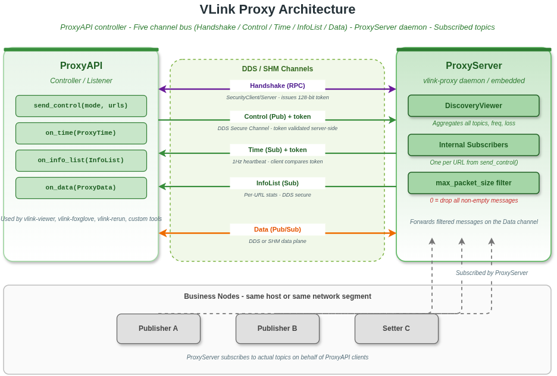
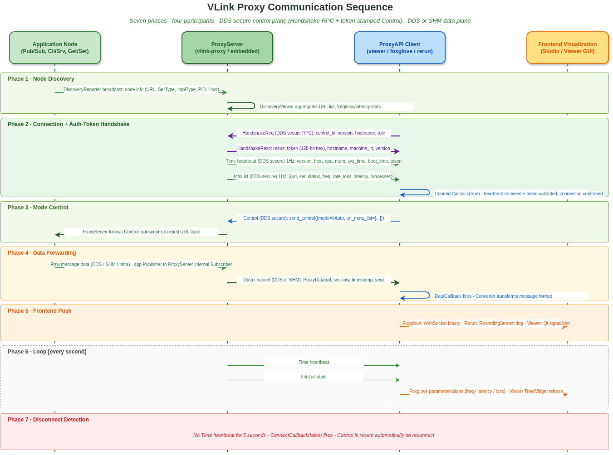

# 16. 代理监控

## 16.1 概述

VLink Proxy 是一个基于 DDS 传输的中间层代理系统，专为跨网段通信监控、数据录制与回放、远程注入等场景设计。它由三个核心组件构成。

> **相关文档**：可视化工具 vlink-viewer 使用 ProxyAPI 连接参见 [14-viewer.md](14-viewer.md)；CLI 监控工具参见 [13-cli-tools.md](13-cli-tools.md#136-vlink-monitor--实时通信状态监控)；服务发现机制参见 [17-discovery.md](17-discovery.md)。

核心组件：

- **`vlink-proxy`**：独立运行的代理守护进程（可执行文件）
- **`ProxyServer`**：代理服务端库，可嵌入到应用进程中
- **`ProxyAPI`**：代理客户端库，供监控工具、CLI 工具、上位机连接使用

---

## 16.2 为什么需要代理层

VLink 的原生传输（shm、dds 等）要求通信双方在同一网段或 DDS 域内可直接发现彼此。在以下场景中需要引入代理层：

| 场景                     | 说明                                                         |
| ------------------------ | ------------------------------------------------------------ |
| 跨网段/跨 VLAN 通信      | 测试台架与开发机、调试机与目标机之间存在路由/防火墙隔离（单播 DDS 发现，非 NAT 穿透）|
| 远程监控与可视化         | 上位机工具（如 vlink-monitor）需要实时查看话题数据和统计信息 |
| 数据录制与回放           | 代理服务器代为订阅所有话题并将数据转发给录制客户端           |
| 数据注入与仿真           | 回放或仿真工具通过代理向车端节点注入消息                     |
| 跨进程自动路由（Auto 模式）| 在无需手动配置路由的情况下自动订阅并转发指定话题             |

---

## 16.3 架构概览



### 16.3.1 通信信道说明

| 信道        | 方向              | 传输方式           | 安全加密 | 说明                         |
| ----------- | ----------------- | ------------------ | -------- | ---------------------------- |
| Handshake   | Client -> Server (RPC) | DDS（安全） | 是       | 客户端用 SecurityClient 请求服务器签发 token,握手成功后才允许发 Control |
| Control     | Client -> Server  | DDS（安全）        | 是       | 客户端发送模式控制指令,每条 Control 携带握手得到的 token |
| Time        | Server -> Client  | DDS（安全）        | 是       | 心跳,每秒一次,携带版本/时间/CPU,以及服务器签发的 token(客户端比对) |
| InfoList    | Server -> Client  | DDS（安全）        | 是       | 每秒一次的话题统计列表       |
| Data        | 双向              | DDS 或 SHM（直连） | 否       | 原始消息载荷转发             |

> Handshake / Time / Control / InfoList 四个控制面通道由 `SecurityClient/Server` / `SecurityPublisher/Subscriber` 包装，共用同一对称密钥 `security_key`。Handshake + token 校验由 `VLINK_PROXY_ENABLE_HANDSHAKE` 编译宏控制（默认开启，详见 §16.8.6）。

---

## 16.4 通信流程与时序



Proxy 系统的通信分为六个阶段：

### 16.4.1 Phase 1: 节点发现

VLink 业务节点在启动时通过 `DiscoveryReporter` 以 UDP 组播方式广播自身的元信息（URL、序列化类型、节点类型、PID、主机名）。ProxyServer 内部运行 `DiscoveryViewer`，持续监听组播地址 `239.255.0.100`，聚合所有在线节点的 URL 列表，并计算每个话题的频率、吞吐量、丢包率和延迟统计。

### 16.4.2 Phase 2: 客户端连接与 Token 握手

`ProxyAPI::reset_handle()` 阶段依序完成：

1. 构造 / 初始化所有 `Security*` 句柄（`HandshakeCli`、`ControlPub`、`TimeSub`、`InfoSub` 等）。
2. **启用 `VLINK_PROXY_ENABLE_HANDSHAKE`（默认）时**：调用 `HandshakeCli::invoke(HandshakeReq, HandshakeResp)`：
   - 客户端提交 `HandshakeReq`（`control_id`、`VLINK_VERSION`、`hostname`、`role`="controller"/"listener"）。
   - 服务器在构造阶段（`init_server()` 之前）已用 `vlink::Uuid::random_hex()` 签发 128-bit 进程级 token；验证版本一致后回 `HandshakeResp { result=HANDSHAKE_OK, token, version, hostname, machine_id }`。
   - 客户端在 `token_mtx` 保护下把 `resp.token()` 写入 `impl_->token`。
3. ProxyServer 每秒通过 DDS 安全信道广播：
   - **Time 心跳**：携带 `VLINK_VERSION`、主机名、CPU/内存占用、系统时间（Unix epoch 微秒）、启动时长、以及**服务器签发的 token**。
   - **InfoList**：所有已发现话题的统计数组（url、ser、status、freq、rate、loss、latency、process_list）。
4. ProxyAPI 收到第一条 Time 心跳后，若 `time.token() == impl_->token` 则触发 `ConnectCallback(true)`，确认连接已通过握手验证。

握手未成功之前 `send_control_sync` 直接拒发（`token` 为空），Time 监听器对 token 失配会清空本地 token 并上报 `kTokenError`，由 1 秒心跳路径自动重握手 —— 服务器重启、版本不一致都会走这条自愈路径。版本不符走 `HANDSHAKE_VERSION_MISMATCH` → `kVersionCompError`，与 token 失配区分上报。

关闭握手时（`VLINK_PROXY_ENABLE_HANDSHAKE = 0`）跳过步骤 2，token 字段保持空串，与早期版本 wire 兼容。

### 16.4.3 Phase 3: 模式控制

`kController` 角色的客户端通过 `send_control()` 向 ProxyServer 发送 Control 指令，指定工作模式和关注的 URL 列表。**启用握手时每条 Control 都会带上握手得到的 token**，服务器校验 `control.token() == impl_->token` 后才接收，失配直接打 `Reject control with mismatched token` 日志并丢弃。ProxyServer 接收 Control 后按指令订阅 / 取消订阅实际话题。

### 16.4.4 Phase 4: 数据转发

ProxyServer 订阅的实际话题收到消息后，将原始数据封装为 `ProxyData`（url + ser + schema + raw + timestamp + seq），通过 Data 信道（DDS 或 SHM 直连）转发给所有已连接的 ProxyAPI 客户端。客户端的 `DataCallback` 被触发。

### 16.4.5 Phase 5: 前端推送

ProxyAPI 客户端收到数据后，根据自身类型执行不同的后续处理：
- **vlink-viewer**（桌面 GUI）：通过 Qt Signal/Slot 将数据投递到 GUI 线程，渲染图像/点云/数据表
- **vlink-foxglove**（Web 可视化）：通过 `FoxgloveConverter` 将数据转换为 Foxglove FlatBuffer Schema，再通过 WebSocket 推送到 Foxglove Studio 浏览器
- **vlink-rerun**（Web 可视化）：通过 `RerunConverter` 将数据转换为 Rerun Archetype，再通过 `RecordingStream::log()` 推送到 Rerun Viewer
- **自定义工具**：在 DataCallback 中执行用户自定义逻辑

### 16.4.6 Phase 6: 1 Hz 稳态循环

连接建立之后，ProxyServer 持续以 1 Hz 频率：
- 重新广播 `Time` 心跳（始终带最新 CPU/内存/系统时间 + 不变的 token）。
- 重新广播 `InfoList`（基于 `DiscoveryViewer` 的最新统计）。
- 当 `mode ∈ {kPlay, kEdit, kAuto, kAutoAndObserveAll}` 时持续转发数据。

ProxyAPI 的 1 Hz 心跳回调同时承担：刷新 `connect_elapsed_timer`、token 空仓时静默重握手（见 §16.8.6.4）。

### 16.4.7 Phase 7: 断线检测与握手自愈

ProxyAPI 客户端通过心跳检测连接状态。若连续 **5 秒** 未收到 Time 心跳，判定连接断开，触发 `ConnectCallback(false)`。

启用握手时，以下三类事件都会触发自动恢复（无需用户干预）：

- **服务器重启**：新服务器进程会签发**新的** token，客户端旧 token 与心跳里的新 token 不一致 → `impl_->token.clear()` + `kTokenError` → 心跳路径每秒重试 `do_handshake()`，取到新 token 后清错并补发上一次 Control。
- **网络抖动（>5 秒）**：`main_elapsed_timer` 抖动检测触发，`reset_handle()` 重建所有 Security 句柄并重做握手。
- **`process_connected(false)` 路径**：当 `impl_->error ∈ { kNoError, kTokenError, kVersionCompError }` 且没有正在 `resetting` 时，`post_task(reset_handle)` 自动重连。

`kController` 角色在握手 / 重连成功后会自动重新发送最后一次 `Control` 指令。

---

## 16.5 各工具在 Proxy 体系中的角色

| 工具/组件             | Proxy 角色                  | 说明                                                         |
| --------------------- | --------------------------- | ------------------------------------------------------------ |
| `vlink-proxy`         | **ProxyServer 守护进程**    | 独立运行，聚合所有传输后端数据，转发给客户端                 |
| `ProxyServer`（库）   | **嵌入式服务端**            | 可嵌入业务进程，无需独立守护进程                             |
| `vlink-viewer`        | ProxyAPI **kController**    | 桌面 GUI，按需订阅话题，实时渲染图像/点云/数据               |
| `vlink-player`        | 回放 GUI / 进程编排器       | Bag 回放界面；通过拉起 `vlink-proxy` 等子进程完成数据注入与联动 |
| `vlink-analyzer`      | ProxyAPI **kListener**      | 数据分析，只读监听统计信息                                   |
| `vlink-foxglove`      | ProxyAPI **kController**    | Foxglove 桥接，按需订阅（kAuto 模式），通过 WebSocket 推送   |
| `vlink-rerun`         | ProxyAPI **kController**    | Rerun 桥接，全量订阅（kAutoAndObserveAll），通过 gRPC 推送   |
| `vlink-monitor`       | 不使用 Proxy（DiscoveryViewer）| CLI 工具，直接通过组播发现节点，不经过 Proxy                |
| `vlink-bag`           | BagReader / BagWriter       | CLI 录制、回放、检查与转换工具，不通过 ProxyAPI 控制面工作   |
| 自定义监控工具        | ProxyAPI **kController/kListener** | 用户自行开发的监控、录制、注入工具                    |

> `vlink-foxglove` 和 `vlink-rerun` 在 Proxy 体系中都是 **ProxyAPI 客户端**，它们的角色等同于 `vlink-viewer`——通过 ProxyAPI 连接到 ProxyServer 获取数据。区别在于输出端：Viewer 输出到 Qt GUI，Foxglove 输出到 WebSocket，Rerun 输出到 gRPC。

---

## 16.6 ProxyServer 说明

`ProxyServer` 是代理系统的服务端，继承自 `MessageLoop`，以事件循环方式运行。

### 16.6.1 主要职责

1. 运行 `DiscoveryViewer`，枚举 DDS 域内所有活跃的 Publisher/Subscriber/Server/Client/Setter/Getter
2. 启用握手时(默认),构造阶段经 `vlink::Uuid::random_hex()` **签发 128-bit 进程级 auth-token**,通过 `get_token()` 提供给运维 / 嵌入式宿主（源码中预留了 `ProxyServer: Auth token issued (prefix=...)` 的诊断日志，默认注释保留，需要时取消注释即可输出 prefix 掩码）
3. 接收来自 `ProxyAPI` 客户端的握手请求(`HandshakeSrv`)并下发 token；同时校验所有 `Control` 入站的 token,失配丢弃
4. 接收来自 `ProxyAPI` 客户端的 `Control` 指令，切换工作模式
5. 每秒广播一次 `Time` 心跳（携带版本、主机名、CPU 占用、内存占用、时间戳、token）
6. 每秒广播一次 `InfoList`（各话题的频率、吞吐量、丢包率、延迟统计）
7. 在 Observe/Record/Auto 模式下，订阅实际话题并将数据转发给客户端
8. 在 Play/Edit/Auto 模式下，接收客户端注入的数据并发布到实际话题

### 16.6.2 单例约束

每个操作系统进程中只能存在一个 `ProxyServer` 实例。重复构造将打印 Fatal 日志并直接返回，不会初始化任何通道。

### 16.6.3 Token 签发与查询

启用 `VLINK_PROXY_ENABLE_HANDSHAKE`（默认）时：

```cpp
vlink::ProxyServer server(cfg);

// 进程生命周期内不变,32 字符小写 hex,128-bit 熵
std::string token = server.get_token();
```

- 构造阶段调用 `vlink::Uuid::random_hex()` 一次性签发,后续每个 `Time` 心跳和每条 `HandshakeResp` 都包含该 token。
- 源码中预留了启动日志 `ProxyServer: Auth token issued (prefix=a1b2c3d4..., length=32).`（只输出 prefix 掩码，完整 token 不输出）。当前默认构建注释保留，需要分发观察时取消 `proxy/proxy_server/proxy_server.cc` 中相应 `CLOG_I` 注释即可启用。运维方应优先通过 `get_token()`（嵌入式）或安全管道（CLI 进程）取出 token 后下发给客户端。
- `VLINK_PROXY_ENABLE_HANDSHAKE = 0` 时 `impl_->token` 为空字符串,Time 不带 token,Control 不校验 token；`get_token()` 返回 `""`。
- 不存在持久化：服务器重启 -> 新 token -> 客户端走自愈路径(见 §16.4.7) 重新握手。

### 16.6.4 ProxyServer::Config 字段说明

| 字段                   | 类型                    | 默认值   | 说明                                                         |
| ---------------------- | ----------------------- | -------- | ------------------------------------------------------------ |
| `async`                | `bool`                  | `false`  | 异步转发：在 MessageLoop 线程上发布数据，false 则在订阅回调中内联发布 |
| `reliable`             | `bool`                  | `false`  | 数据通道使用 DDS 可靠 QoS；必须与所有客户端一致              |
| `enable_tcp`           | `bool`                  | `false`  | 数据通道使用 TCP 传输；必须与所有客户端一致                  |
| `direct`               | `bool`                  | `false`  | 使用 SHM（Iceoryx）作为数据通道，替代 DDS；必须与所有客户端一致 |
| `native_mode`          | `bool`                  | `false`  | 将所有 DDS 流量限制到 127.0.0.1（仅本机，用于本机测试）      |
| `domain_id`            | `int`                   | `0`      | DDS 域 ID，范围 0~255，所有客户端必须使用相同的域 ID         |
| `buf_size`             | `uint32_t`              | `0`      | DDS socket 收发缓冲区大小（字节），0 使用内置默认值（8MB）   |
| `mtu_size`             | `uint32_t`              | `0`      | DDS 分片 MTU 大小（字节），0 使用内置默认值（65500 字节）    |
| `max_packet_size`      | `double`                | `0`      | 单条消息最大转发大小（MiB），超出则丢弃。**注意**：当前实现不存在"0 表示不限制"的特判，字段为 `0` 时实际会把所有非空消息都丢弃；要放行大包必须显式设置一个足够大的 MiB 值（CLI 默认 4.0，头文件注释与实现不符，以此处描述为准） |
| `security_key`         | `std::string`           | `""`     | Time/InfoList/Control 通道的对称密钥。空字符串使用内置默认安全槽位，不会导致控制面节点初始化 fatal；显式设置时客户端与服务端的 `security_key` 必须一致。 |
| `bind_ip`              | `std::string`           | `""`     | DDS socket 绑定的本地 IP，空字符串表示绑定所有接口           |
| `peer_ip`              | `std::string`           | `""`     | DDS 单播对端 IP，空字符串使用多播发现                        |
| `dds_impl`             | `std::string`           | `"dds"`  | DDS 实现选择：如 `"dds"`（FastDDS）、`"ddsc"`（CycloneDDS）、`"ddsr"`、`"ddst"` |
| `use_iox`              | `bool`                  | `false`  | 是否在启动时内嵌启动 Iceoryx RouDi 守护进程                  |
| `iox_monitoring`       | `bool`                  | `true`   | 是否启用 Iceoryx 监控/自省功能                               |
| `iox_strategy`         | `int`                   | `1`      | Iceoryx 内存分配策略（1=低内存，2=中等，3=高内存），默认低内存 |
| `iox_config`           | `std::string`           | `""`     | Iceoryx TOML 配置文件路径，空字符串使用默认配置              |
| `runnable_version_major` | `uint16_t`            | `1`      | 加载的 runnable 插件（API 名为 `RunablePluginInterface`）所需的最低主版本号 |
| `runnable_version_minor` | `uint16_t`            | `0`      | 加载的 runnable 插件（API 名为 `RunablePluginInterface`）所需的最低次版本号 |
| `runnable_prefix`      | `std::string`           | `""`     | 插件共享库文件名前缀                                         |
| `runnable_list`        | `std::vector<std::string>` | `{}` | 启动时加载的 runnable 插件名称列表（实际 API 类型名为 `RunablePluginInterface`） |

### 16.6.5 嵌入式使用示例

```cpp
#include <vlink/external/proxy_server.h>
#include <vlink/base/utils.h>
#include <vlink/base/logger.h>

int main() {
    vlink::Logger::init("my-proxy");

    vlink::ProxyServer::Config cfg;
    cfg.dds_impl       = "dds";
    cfg.domain_id      = 0;
    cfg.reliable       = false;
    cfg.enable_tcp     = false;
    cfg.direct         = false;
    cfg.native_mode    = false;
    cfg.max_packet_size = 4.0;  // 4 MiB
    cfg.security_key   = "my_secret_key";

    vlink::ProxyServer server(cfg);

    // 启用握手时,签发的 token 可通过 get_token() 取出,转发给客户端
    VLOG_I("Server token = ", server.get_token());

    // 注册终止信号处理，Ctrl+C 时优雅退出
    vlink::Utils::register_terminate_signal([&server](int) {
        server.quit(true);
    });

    server.run();  // 阻塞直到 quit() 被调用
    return 0;
}
```

---

## 16.7 vlink-proxy 命令行工具

`vlink-proxy` 是 ProxyServer 的独立可执行文件，直接在终端启动即可。

### 16.7.1 命令行参数

```
vlink-proxy [选项]

选项：
  -a, --async             启用异步转发模式
  -r, --reliable          启用可靠 QoS 模式
  -t, --tcp               启用 TCP 传输
  -g, --direct            启用 SHM 直连模式（需要 Iceoryx）
  -d, --domain_id INT     DDS 域 ID（0~255，默认 0）
  -k, --key STRING        安全密钥
  -b, --bind_ip STRING    绑定本地 IP 地址
  -p, --peer_ip STRING    单播对端 IP 地址
  -s, --buf_size UINT     DDS 收发缓冲区大小（字节）
  -e, --mtu_size UINT     DDS MTU 大小（字节）
  -n, --native            限制 DDS 流量到 127.0.0.1
  -x, --max_packet_size FLOAT  单条消息最大大小（MiB，默认 4.0）
  -c, --iox_config PATH   Iceoryx TOML 配置路径（**给 -c 即隐式 use_iox=true**，无独立 use_iox 开关）
  -l, --iox_strategy INT  Iceoryx 内存策略（1/2/3，CLI 默认 2；注意 ProxyServer::Config 结构体默认是 1，此处为 vlink-proxy CLI 覆盖）
  -m, --iox_monitoring STR  Iceoryx 监控（on/off，默认 on）
  --dds_impl STRING       DDS 实现（CLI 仅接受 dds/ddsc，依赖编译期 ENABLE_DDS/ENABLE_DDSC，默认 dds；ddsr/ddst 仅可在程序里通过 ProxyServer::Config.dds_impl 设置）
  --runnable NAME...      加载 runnable 插件名称列表（API 名为 RunablePluginInterface）
```

### 16.7.2 典型启动示例

```bash
# 最简启动（默认配置）
vlink-proxy

# 指定域 ID 和安全密钥
vlink-proxy -d 1 -k "secure_key_2026"

# 启用 TCP + 可靠模式，绑定指定 IP，限制最大包大小为 8 MiB
vlink-proxy -r -t -b 192.168.1.100 -x 8.0

# 启用 SHM 直连模式（内嵌 RouDi，使用高内存策略）
vlink-proxy -g -c /etc/iceoryx/config.toml -l 3

# 仅本机通信（native 模式）
vlink-proxy -n

# 单播 DDS 发现（指定对端 IP 跳过多播）
vlink-proxy -b 10.0.0.1 -p 10.0.0.2

# 加载 runnable 插件（API 名为 RunablePluginInterface）
vlink-proxy --runnable my_plugin_a my_plugin_b
```

### 16.7.3 注意事项

- `vlink-proxy` 内置了单例检测，同一机器上不允许同时运行两个实例
- 如果需要 DDS 多播发现，可能需要为网络接口添加多播/广播路由规则（启动时会打印提示地址）
- 启动时环境变量 `VLINK_INTRA_BIND`（参见 [21-environment-vars.md](21-environment-vars.md#211-核心运行时环境变量)）若被设置，服务器将同时订阅 `intra://` 话题

---

## 16.8 ProxyAPI 说明

`ProxyAPI` 是代理系统的客户端，继承自 `MessageLoop`，通过 DDS 连接到运行中的 `ProxyServer`。

### 16.8.1 角色

| 角色           | 枚举值        | 权限                                        |
| -------------- | ------------- | ------------------------------------------- |
| `kController`  | 0             | 可调用 `send_control()` 和 `send_data()`    |
| `kListener`    | 1             | 只读，`send_control()` 和 `send_data()` 返回 false |

### 16.8.2 工作模式

| 模式               | 枚举值 | 说明                                               |
| ------------------ | ------ | -------------------------------------------------- |
| `kOffline`         | 0      | 离线，服务器释放所有订阅                           |
| `kObserveOne`      | 1      | 只观察 `url_meta_list` 中指定的单个话题            |
| `kObserveAll`      | 2      | 观察 DDS 域内发现的全部话题                        |
| `kRecord`          | 3      | 录制 `url_meta_list` 中指定话题的数据              |
| `kPlay`            | 4      | 回放：客户端通过 `send_data()` 注入，服务器转发    |
| `kEdit`            | 5      | 编辑模式：服务器转发客户端注入的数据               |
| `kAuto`            | 6      | 自动模式：观察指定话题并自动转发给订阅方           |
| `kAutoAndObserveAll` | 7   | Auto 模式 + 同时观察所有话题                       |

### 16.8.3 错误码

| 错误码               | 枚举值 | 触发条件                                         | 自动恢复 |
| -------------------- | ------ | ------------------------------------------------ | -------- |
| `kNoError`           | 0      | 无错误，连接正常                                 | —        |
| `kModeError`         | 1      | 请求了不支持的工作模式                           | —        |
| `kControlError`      | 2      | 服务器返回的 control_id 与客户端不匹配           | —        |
| `kReliableCompError` | 3      | 客户端与服务器的 reliable 设置不一致             | 否(需配置一致后重启) |
| `kTcpCompError`      | 4      | 客户端与服务器的 enable_tcp 设置不一致           | 否(同上) |
| `kDirectCompError`   | 5      | 客户端与服务器的 direct 设置不一致               | 否(同上) |
| `kMultiProxyError`   | 7      | 同一 DDS 域内检测到多个 ProxyServer              | 否       |
| `kVersionCompError`  | 8      | 握手 / 心跳显示客户端与服务器的 VLINK_VERSION 不一致 | **是**(心跳自动重握手,版本恢复后即清错) |
| `kUnknownError`      | 9      | 未分类错误                                       | —        |
| `kTokenError`        | 10     | 握手失败(超时/拒签)、或 Time 心跳里的 token 与本地缓存不一致 | **是**(本地 token 自动清空,心跳每秒重试握手直至成功) |

### 16.8.4 ProxyAPI::Config 字段说明

| 字段            | 类型           | 默认值        | 说明                                                          |
| --------------- | -------------- | ------------- | ------------------------------------------------------------- |
| `role`          | `Role`         | `kController` | 客户端角色                                                    |
| `domain_id`     | `int`          | `0`           | DDS 域 ID，必须与服务器一致                                   |
| `dds_impl`      | `std::string`  | `"dds"`       | DDS 实现选择                                                  |
| `security_key`  | `std::string`  | `""`          | 安全密钥；空字符串使用内置默认安全槽位，显式设置时必须与服务器一致 |
| `native`        | `bool`         | `false`       | 是否限制 DDS 流量到 127.0.0.1                                 |
| `reliable`      | `bool`         | `false`       | 数据通道 QoS，必须与服务器一致                                |
| `direct`        | `bool`         | `false`       | 是否使用 SHM 直连，必须与服务器一致                           |
| `enable_tcp`    | `bool`         | `false`       | 是否使用 TCP，必须与服务器一致                                |
| `match_version` | `bool`         | `true`        | 是否校验 VLINK_VERSION 版本字符串                             |
| `allow_ip`      | `std::string`  | `""`          | 绑定本地 DDS socket IP                                        |
| `peer_ip`       | `std::string`  | `""`          | 单播对端 IP                                                   |
| `buf_size`      | `int`          | `0`           | Socket 缓冲区大小（字节），0 使用默认值                       |
| `mtu_size`      | `int`          | `0`           | DDS MTU 大小（字节），0 使用默认值                            |

### 16.8.5 心跳、握手与断线重连机制

- `ProxyAPI` 内部通过 `TimeSub` 订阅服务器每秒广播的心跳。
- 若连续 5 秒未收到心跳，判定连接断开，触发 `ConnectCallback(false)`。
- **握手层** (`VLINK_PROXY_ENABLE_HANDSHAKE` 默认开启)：
  - `reset_handle()` 阶段经 `SecurityClient<HandshakeReq, HandshakeResp>::invoke()` 拉取 token，默认超时 `VLINK_PROXY_HANDSHAKE_WAIT_MS = 800 ms` + `VLINK_PROXY_HANDSHAKE_INVOKE_MS = 800 ms`。
  - 握手失败 → `do_handshake(Error& out_err)` 出参语义（与 `proxy_api.cc do_handshake()` 实现一致）：
    - `out_err = kVersionCompError` —— 服务器回复 `HANDSHAKE_VERSION_MISMATCH`。
    - `out_err = kTokenError` —— 服务器回复非 `HANDSHAKE_OK` 或返回空 token（如 `HANDSHAKE_INTERNAL_ERROR`）。
    - `out_err = kNoError`（**静默重试**） —— `handshake_cli` 尚未 init 完毕、`wait_for_connected` 超时、`invoke()` 超时；这三种情况都视为 RPC 通道未就绪，由心跳路径下个 tick 重试。
  - 心跳路径每秒检查 `impl_->token.empty()`，若为空则再调一次 `do_handshake()`，成功后 `process_error(kNoError)` 并补发上一次 `Control`。
  - Time 监听器收到 token 失配会清空本地缓存的 token，从而**自动触发**心跳层的重握手 —— 完整自愈，不需要用户回调。
- `kController` 角色会在握手 / 重连成功后自动重新发送最后一次 `Control` 指令。
- 关闭握手时(`VLINK_PROXY_ENABLE_HANDSHAKE = 0`),`do_handshake()` 直接返回成功且本地 token 始终为空,Time 不带 token,Control 入站不校验 token -- 行为与早期版本一致。

### 16.8.6 Auth-Token 握手机制详解

#### 16.8.6.1 编译开关与默认值

| 宏 | 默认 | 说明 |
|----|------|------|
| `VLINK_PROXY_ENABLE_HANDSHAKE` | `1` | 编译期总开关。设为 0 → 不创建 `HandshakeSrv` / `HandshakeCli`,不打包 token 字段,不进行 token 校验 |
| `VLINK_PROXY_HANDSHAKE_WAIT_MS` | `800` | `SecurityClient::wait_for_connected` 阶段超时(毫秒) |
| `VLINK_PROXY_HANDSHAKE_INVOKE_MS` | `800` | `SecurityClient::invoke` 阶段超时(毫秒) |

定义于 `proxy/proxy_macros.h`,集成方可在 `target_compile_definitions` 中显式覆盖。

#### 16.8.6.2 数据结构

```proto
// proxy/proxy.proto
enum HandshakeResult {
  HANDSHAKE_OK = 0;
  HANDSHAKE_VERSION_MISMATCH = 1;
  HANDSHAKE_INTERNAL_ERROR = 2;
}

message HandshakeReq {
  uint32 control_id = 1;
  string version = 2;       // VLINK_VERSION
  string hostname = 3;
  string role = 4;          // "controller" / "listener"
}

message HandshakeResp {
  HandshakeResult result = 1;
  string token = 2;         // 32-char lowercase hex, 128-bit
  string version = 3;
  string hostname = 4;
  string machine_id = 5;
}
```

`Control` 与 `Time` 也各扩了一个 `string token = 41;` 字段,关掉宏时此字段保持空串,不影响 wire 兼容。

#### 16.8.6.3 完整时序


#### 16.8.6.4 自愈状态机

```
┌────────────────────────────────────────────────────────────────┐
│ heartbeat tick (1Hz, MessageLoop thread)                       │
└────────────────────────────────────────────────────────────────┘
   │
   ├─[main_elapsed_timer.restart() > 5000ms]──> Wakeup
   │     reset_handle()  (rebuild all security handles + handshake)
   │     send_control_sync(last_control)
   │
   ├─[impl_->token.empty()]─────────────────────> Silent handshake retry
   │     do_handshake(out_err)
   │       success → process_error(kNoError) + 补发 last_control
   │       err != kNoError → process_error(err)  (kTokenError / kVersionCompError)
   │       err == kNoError → 静默重试(下个 tick 再试)
   │
   └─[connect_elapsed_timer.get() > 5000]──────> process_connected(false)
         if error ∈ {kNoError, kTokenError, kVersionCompError}
            && !resetting:
            post_task(reset_handle)
```

每秒一次的 1.6s 最大握手开销发生在 loop 线程上,在 do_handshake 期间其它 posted task 暂时挂起,但不会卡住 DDS 接收线程。

#### 16.8.6.5 威胁模型与限制

- **Token 本身的强度**：128-bit 由 `vlink::Uuid::random_hex()` 经 `std::mt19937` 生成,**不是 CSPRNG**。它的作用是会话标识 + 服务端重启检测,**不能**对抗能解开 `security_key` 加密层的攻击者。
- **Channel 加密**：Handshake / Control / Time / InfoList 四个控制面通道由 `SecurityClient/Server` / `SecurityPublisher/Subscriber` 用对称 `security_key` 加密；缺失 security_key 的进程无法解密 Handshake 响应,也无法看到 Time 心跳里的 token。
- **重放保护**：服务器每次重启都会换 token,旧 token 立刻失效。同一 server 进程内 token 不变(进程粒度的会话密钥)。
- **不适用的场景**：跨网段长期密钥分发、零信任环境的客户端身份认证 —— 应在握手 RPC 外加自定义 mTLS / OAuth 层。

#### 16.8.6.6 与早期版本的兼容性

| 客户端 ENABLE_HANDSHAKE | 服务端 ENABLE_HANDSHAKE | 行为 |
|------------------------|-------------------------|------|
| 1 (默认) | 1 (默认) | 完整握手,Control / Time 带 token,失配自愈 |
| 0 | 0 | 跳过握手,Time/Control 不写 token；服务端不校验 token；行为同早期版本 |
| 1 | 0 | 客户端反复重试握手 → 超时报 `kTokenError` 但服务端不校验,Control 实际能通过；不推荐(行为不直观) |
| 0 | 1 | 客户端 Control 不带 token → 服务端**丢弃**,看不到日志的运维容易误以为 Control 静默丢失；不推荐 |

→ **强烈建议保持默认**,客户端与服务端宏值一致。

#### 16.8.6.7 嵌入式示例

```cpp
vlink::ProxyServer server(cfg);
const std::string token = server.get_token();   // 32-char hex,可分发给可信客户端
// ... 业务代码 ...
```

客户端无需配置 token —— 通过握手自动协商,业务代码完全无感。

---

## 16.9 连接配置详解

### 16.9.1 普通 DDS 模式（默认）

客户端与服务器均使用 DDS 传输数据，适合跨机器、跨网段场景。

```cpp
vlink::ProxyAPI::Config cfg;
cfg.role         = vlink::ProxyAPI::kController;
cfg.dds_impl     = "dds";          // 使用 FastDDS
cfg.domain_id    = 0;
cfg.reliable     = false;           // 与服务器一致
cfg.enable_tcp   = false;           // 与服务器一致
cfg.direct       = false;           // 与服务器一致
cfg.security_key = "my_secret_key"; // 与服务器 security_key 一致
cfg.match_version = true;
```

### 16.9.2 SHM 直连模式（direct）

数据通道改走 Iceoryx 共享内存，零拷贝，延迟极低，适合同机监控。

```cpp
cfg.direct = true;  // 服务器也必须设置 direct=true
// direct 模式下 get_latency() 始终返回 0
```

### 16.9.3 单播 DDS 模式（跨子网）

```cpp
cfg.allow_ip = "192.168.10.5";   // 本机出口 IP
cfg.peer_ip  = "192.168.20.100"; // 对端 ProxyServer 所在 IP
```

> 此模式是 DDS 层的单播发现（显式 peer IP），不做 NAT 穿透；双方仍需 IP 可达。真正需要 NAT 穿透请考虑 `zenoh://`。

### 16.9.4 本机测试模式（native）

```cpp
cfg.native = true;
// 所有 DDS 流量绑定到 127.0.0.1
```

---

## 16.10 监控活跃节点、话题与消息统计

### 16.10.1 注册 InfoCallback

```cpp
vlink::ProxyAPI::Config cfg;
cfg.role = vlink::ProxyAPI::kListener;  // 只读监控
// ... 其他配置

vlink::ProxyAPI api(cfg);

api.register_connect_callback([](bool connected) {
    if (connected) {
        // ProxyServer 上线
    } else {
        // ProxyServer 断线
    }
});

api.register_info_callback([](const std::vector<vlink::ProxyAPI::Info>& list) {
    for (const auto& info : list) {
        // info.url      — 话题 URL，如 "dds://sensor/lidar"
        // info.ser      — 具体序列化类型名，如 "demo.proto.PointCloud"
        // info.schema   — 粗粒度 schema 家族，如 kProtobuf / kFlatbuffers / kUnknown
        // info.status   — kActive / kInActive / kPending / kInvalid
        // info.freq     — 消息频率（条/秒，加权移动平均）
        // info.rate     — 吞吐量（字节/秒，加权移动平均）
        // info.loss     — 丢包率 [0, 1]
        // info.latency  — 端到端延迟（毫秒）
        // info.process_list — 发布/订阅该话题的进程列表

        for (const auto& proc : info.process_list) {
            // proc.host — 主机名
            // proc.pid  — 进程 ID
            // proc.name — 进程名
            // proc.ip   — IP 地址
            // proc.type — ImplType 位掩码
        }
    }
});

api.async_run();  // 启动内部事件循环（后台线程）
```

### 16.10.2 话题状态说明

| 状态        | 含义                                             |
| ----------- | ------------------------------------------------ |
| `kActive`   | 话题正在活跃接收数据                             |
| `kInActive` | 话题存在但最近 2 秒内未收到数据                  |
| `kPending`  | 话题刚被发现，统计数据尚在累积中（前 10 秒）    |
| `kInvalid`  | 话题类型不支持观察（例如纯订阅端）               |

### 16.10.3 获取服务器时间和系统信息

```cpp
api.register_time_callback([](uint64_t sys_time, uint64_t boot_time) {
    // sys_time  — 服务器系统时间（微秒，Unix epoch）
    // boot_time — 服务器自启动以来的时长（微秒）

    auto formatted = vlink::ProxyAPI::get_format_sys_time(sys_time);
    // -> "2026/03/18 10:30:00:123"

    auto elapsed = vlink::ProxyAPI::get_format_boot_time(boot_time);
    // -> "0d 01:23:45.678"
});

// 获取当前 CPU/内存占用（来自最近一次心跳）
double cpu = api.get_current_cpu_usage();    // 0~100
double mem = api.get_current_memory_usage(); // 0~100
```

---

## 16.11 通过 Proxy 进行跨网段通信

典型场景：车载计算单元（EdgePC）运行实际业务节点，开发机（DevPC）通过代理进行监控和数据注入。

```
[EdgePC 192.168.1.100]                    [DevPC 192.168.2.50]
  Publisher<LidarData>                       vlink-monitor / 自定义工具
  Subscriber<ControlCmd>                            |
        |                                           |
  vlink-proxy -b 192.168.1.100 \           ProxyAPI::Config::
              -p 192.168.2.50  \              allow_ip = "192.168.2.50"
              -d 1 -k "key"               peer_ip  = "192.168.1.100"
                                           domain_id = 1
                                           security_key = "key"
```

启动步骤：

1. 在 EdgePC 上启动代理服务器：
   ```bash
   vlink-proxy -b 192.168.1.100 -p 192.168.2.50 -d 1 -k "key"
   ```

2. 在 DevPC 上连接并开始观察所有话题：
   ```cpp
   vlink::ProxyAPI::Config cfg;
   cfg.allow_ip     = "192.168.2.50";
   cfg.peer_ip      = "192.168.1.100";
   cfg.domain_id    = 1;
   cfg.security_key = "key";

   vlink::ProxyAPI api(cfg);

   vlink::ProxyAPI::Control ctrl;
   ctrl.mode = vlink::ProxyAPI::kObserveAll;
   api.send_control(ctrl);

   api.register_data_callback([](const vlink::ProxyAPI::Data& data) {
       // data.url       — 话题 URL
       // data.ser       — 序列化类型
       // data.schema   — 粗粒度 schema 家族
       // data.raw       — 原始字节（浅拷贝，仅在回调内有效）
       // data.timestamp — 自代理会话起的相对时间（微秒，int64_t）；-1 表示未设置
       // data.seq       — 发布序号
   });

   api.async_run();
   ```

---

## 16.12 数据录制与回放

### 16.12.1 录制模式

```cpp
vlink::ProxyAPI::Control ctrl;
ctrl.mode = vlink::ProxyAPI::kRecord;
ctrl.url_meta_list = {
    {"dds://sensor/lidar",  "demo.proto.PointCloud", vlink::SchemaType::kProtobuf, vlink::kSubscriber},
    {"dds://sensor/camera", "demo.proto.CameraFrame", vlink::SchemaType::kProtobuf, vlink::kSubscriber},
};
api.send_control(ctrl);  // 每个 UrlMeta 都必须显式带上 ser + schema

// 在 DataCallback 中将数据写入文件
api.register_data_callback([&bag](const vlink::ProxyAPI::Data& data) {
    // data.raw 仅在回调内有效；异步写 bag 前需要先深拷贝
    // bag.push(data.url, data.ser, data.schema, vlink::ActionType::kSubscribe,
    //          vlink::Bytes::deep_copy(data.raw.data(), data.raw.size()), &data.timestamp);
});
```

### 16.12.2 回放模式

```cpp
vlink::ProxyAPI::Control ctrl;
ctrl.mode = vlink::ProxyAPI::kPlay;
ctrl.url_meta_list = {
    {"dds://sensor/lidar",  "demo.proto.PointCloud", vlink::SchemaType::kProtobuf, vlink::kPublisher},  // 服务器将作为 Publisher
};
api.send_control(ctrl);

// 从文件读取数据并注入
vlink::ProxyAPI::Data data;
data.url       = "dds://sensor/lidar";
data.ser       = "demo.proto.PointCloud";
data.schema    = vlink::SchemaType::kProtobuf;
data.raw       = vlink::Bytes::deep_copy(buf, size);
data.timestamp = elapsed_us;
data.seq       = seq_num;
api.send_data(data);  // send_data() 同样要求显式传入 ser + schema
```

---

## 16.13 ProxyData 零拷贝传输

当编译时启用 `VLINK_PROXY_ENABLE_ZEROCOPY_DATA`（默认开启），数据通道使用 `zerocopy::ProxyData` 结构体代替 Protobuf 序列化。

`ProxyData` 是一个 **80 字节固定头部 + 变长尾部** 的平坦内存结构：

```
[ magic_begin (4B) | ProxyData struct (80B) | raw + url + ser + hostname | magic_end (4B) ]
```

优点：
- 零额外分配：整个 payload 在一次 `create()` 调用中完成内存布局
- 零拷贝读取：`url()`、`ser()`、`hostname()` 返回 `string_view`，直接引用尾部内存
- 反序列化时（`operator<<`）不需要拷贝，直接借用 wire buffer

注意事项：
- `ProxyData` 的 `string_view` 字段的生命周期与持有它的 `Bytes` 对象绑定，不可在 `Bytes` 销毁后继续访问
- 32 位架构不支持（编译时会发出警告）

---

## 16.14 安全配置

代理系统的 Time、InfoList、Control 三个信道使用 DDS 安全扩展进行加密和认证。
如果 `security_key` 保持空字符串，服务端和客户端都会使用同一个内置默认安全槽位；生产环境建议显式设置自定义密钥。

### 16.14.1 配置安全密钥

服务器端：
```cpp
cfg.security_key = "my_32_byte_secret_key_for_aes_auth";
```

客户端：
```cpp
api_cfg.security_key = "my_32_byte_secret_key_for_aes_auth";
```

### 16.14.2 版本兼容校验

默认情况下（`match_version = true`），客户端会在第一次心跳时检查服务器的 `VLINK_VERSION` 字符串是否与自身一致。版本不匹配将触发 `kVersionCompError` 并拒绝建立连接。

如需跨版本连接（不推荐），可禁用：
```cpp
cfg.match_version = false;
```

---

## 16.15 话题过滤

`ProxyAPI::Control` 支持在服务器端进行话题过滤，减少不必要的订阅和数据转发。

```cpp
vlink::ProxyAPI::Control ctrl;
ctrl.mode = vlink::ProxyAPI::kObserveAll;

// 按 URL 关键词过滤（空格分隔，不区分大小写，满足其一即通过）
ctrl.filter_by_process = false;
ctrl.filter_str = "lidar camera";

// 或按进程名过滤
ctrl.filter_by_process = true;
ctrl.filter_str = "sensor_node";

// 按节点类型过滤
// filter_type = 0: 全部
// filter_type = 1: 仅显示同时有 Publisher 和 Subscriber 的话题
// filter_type = 2: 仅显示同时有 Server 和 Client 的话题
// filter_type = 3: 仅显示同时有 Setter 和 Getter 的话题
// filter_type = 4: 显示所有 Event 类话题（有 Publisher 或 Subscriber）
// filter_type = 5: 显示所有 Method 类话题（有 Server 或 Client）
// filter_type = 6: 显示所有 Field 类话题（有 Setter 或 Getter）
// filter_type = 7..12: 分别仅显示 Publisher / Subscriber / Server / Client / Setter / Getter
ctrl.filter_type = 1;

api.send_control(ctrl);
```

注意：过滤功能由编译宏 `VLINK_PROXY_ENABLE_FILTER`（默认为 1）控制，可通过 `ProxyAPI::is_enable_filter()` 检查运行时是否启用。

---

## 16.16 与 CLI 工具的配合

`vlink-monitor`（参见 [13-cli-tools.md](13-cli-tools.md#136-vlink-monitor--实时通信状态监控)）是 VLink 提供的命令行监控工具，内部使用 `DiscoveryViewer` 发现节点和话题。`vlink-viewer`（参见 [14-viewer.md](14-viewer.md)）则通过 `ProxyAPI` 连接到 `vlink-proxy` 获取详细数据。

典型工作流程：

```
1. 在目标设备上启动代理服务
   $ vlink-proxy -d 0 -k "key"

2. 在开发机上启动 vlink-monitor（基于 DiscoveryViewer 发现）
   $ vlink-monitor

3. 或使用 vlink-viewer 通过 ProxyAPI 以更丰富的功能连接
   - 接收 Time 心跳（实时展示 CPU/内存/时间）
   - 接收 InfoList（实时展示所有话题的频率/吞吐量/延迟/丢包）
   - 按需发送 Control 指令观察特定话题的原始数据
```

---

## 16.17 完整使用示例：部署 + 连接 + 监控

### 16.17.1 部署端（EdgePC，运行业务节点 + 代理服务器）

```cpp
// edge_main.cpp
#include <vlink/external/proxy_server.h>
#include <vlink/base/utils.h>
#include <vlink/base/logger.h>
#include <vlink/vlink.h>

int main() {
    vlink::Logger::init("edge-app");

    // 启动业务节点
    vlink::Publisher<MyMsg> pub("dds://sensor/data");
    // ... pub.publish(...) 在业务线程中持续发布 ...

    // 启动代理服务器
    vlink::ProxyServer::Config proxy_cfg;
    proxy_cfg.domain_id = 0;
    proxy_cfg.security_key = "secret";
    proxy_cfg.bind_ip   = "192.168.1.100";
    proxy_cfg.peer_ip   = "192.168.2.50";

    vlink::ProxyServer proxy(proxy_cfg);

    vlink::Utils::register_terminate_signal([&proxy](int) {
        proxy.quit(true);
    });

    proxy.run();
    return 0;
}
```

### 16.17.2 监控端（DevPC）

```cpp
// monitor_main.cpp
#include <vlink/external/proxy_api.h>
#include <iostream>

int main() {
    vlink::ProxyAPI::Config cfg;
    cfg.role         = vlink::ProxyAPI::kController;
    cfg.domain_id    = 0;
    cfg.security_key = "secret";
    cfg.allow_ip     = "192.168.2.50";
    cfg.peer_ip      = "192.168.1.100";

    vlink::ProxyAPI api(cfg);

    api.register_connect_callback([&api](bool connected) {
        std::cout << (connected ? "[+] 代理服务器已连接" : "[-] 代理服务器断开") << std::endl;

        if (connected) {
            // 连接后立即切换到观察所有话题模式
            vlink::ProxyAPI::Control ctrl;
            ctrl.mode = vlink::ProxyAPI::kObserveAll;
            api.send_control(ctrl);
        }
    });

    api.register_error_callback([](vlink::ProxyAPI::Error err) {
        if (err != vlink::ProxyAPI::kNoError) {
            std::cerr << "代理错误码: " << static_cast<int>(err) << std::endl;
        }
    });

    api.register_time_callback([](uint64_t sys_time, uint64_t boot_time) {
        std::cout << "服务器时间: "
                  << vlink::ProxyAPI::get_format_sys_time(sys_time)
                  << " | 运行时长: "
                  << vlink::ProxyAPI::get_format_boot_time(boot_time)
                  << std::endl;
    });

    api.register_info_callback([](const std::vector<vlink::ProxyAPI::Info>& list) {
        std::cout << "=== 话题列表 ===" << std::endl;
        for (const auto& info : list) {
            std::cout << "  " << info.url
                      << "  schema=" << static_cast<int>(info.schema)
                      << "  freq=" << info.freq << " Hz"
                      << "  rate=" << info.rate / 1024 << " KB/s"
                      << "  loss=" << info.loss * 100 << "%"
                      << "  lat=" << info.latency << " ms"
                      << std::endl;
        }
    });

    api.register_data_callback([](const vlink::ProxyAPI::Data& data) {
        std::cout << "收到数据: " << data.url
                  << " schema=" << static_cast<int>(data.schema)
                  << " [" << data.raw.size() << " bytes]"
                  << " seq=" << data.seq
                  << std::endl;
    });

    // 启动事件循环（阻塞）
    api.async_run();
    api.wait_for_quit();

    return 0;
}
```

---

## 16.18 CMake 集成

```cmake
# CMakeLists.txt

# 仅需要客户端（ProxyAPI）
find_package(vlink REQUIRED)
target_link_libraries(my_monitor PRIVATE vlink::proxy_api)

# 需要服务端（ProxyServer）
target_link_libraries(my_server PRIVATE vlink::proxy_server)

# 通常不需要手动链接 vlink-proxy 可执行文件，直接使用系统安装的版本即可
```

编译宏说明：

| 宏                          | 含义                                                        |
| --------------------------- | ----------------------------------------------------------- |
| `VLINK_ENABLE_PROXY`        | 由 proxy_api/proxy_server 库自动添加，标识代理功能已启用    |
| `VLINK_PROXY_API_LIBRARY`   | 动态库构建时由 proxy_api 添加                               |
| `VLINK_PROXY_SERVER_LIBRARY`| 动态库构建时由 proxy_server 添加                            |

---

## 16.19 常见问题与注意事项

1. **`reliable`/`enable_tcp`/`direct` 三个配置必须客户端与服务器完全一致**，任何一个不匹配都会在心跳校验时触发对应的错误码（`kReliableCompError` 等），客户端将拒绝连接。

2. **同一 DDS 域内只能运行一个 ProxyServer**，否则 ProxyAPI 会检测到 `kMultiProxyError`。每个域需要独立使用不同的 `domain_id`。

3. **`DataCallback` 中的 `Data::raw` 是浅拷贝**，仅在回调执行期间有效。若需在回调外使用数据，必须进行深拷贝（`vlink::Bytes::deep_copy(data.raw.data(), data.raw.size())`、`data.raw.deep_copy_self()` 或使用 `std::vector<uint8_t>`）。

4. **`send_data()` 返回 `false` 不一定是链路故障**，也可能是对端暂时没有订阅者，或者调用方没有显式传入完整的 `ser + schema` 路由元数据。

5. **`ProxyServer` 的析构是同步阻塞的**，会等待所有 DDS 句柄和 DiscoveryViewer 完成清理后才返回，应确保在进程退出前调用。

6. **SHM 直连模式（direct）需要 Iceoryx RouDi 守护进程已运行**，可以通过 `-c` 参数让 `vlink-proxy` 自动内嵌启动，也可以外部单独启动 `iox-roudi`。

7. **`max_packet_size=0` 不是"不限制"**。过滤逻辑是 `if (bytes.size() > real_max_packet_size) return;`（`real_max_packet_size = max_packet_size * 1024 * 1024`），没有 `0 = unlimited` 的特判；字段为 `0` 时所有非空消息都会被丢弃。若要放行大包请显式设置足够大的 MiB 值（CLI 默认 `4.0`）。
