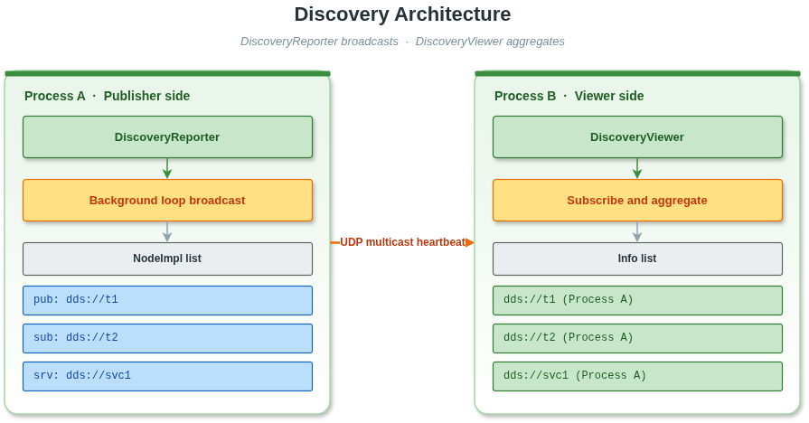
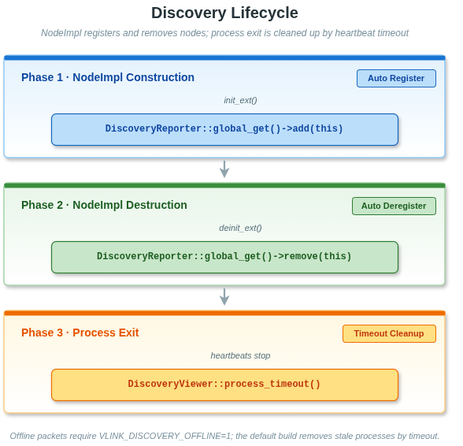
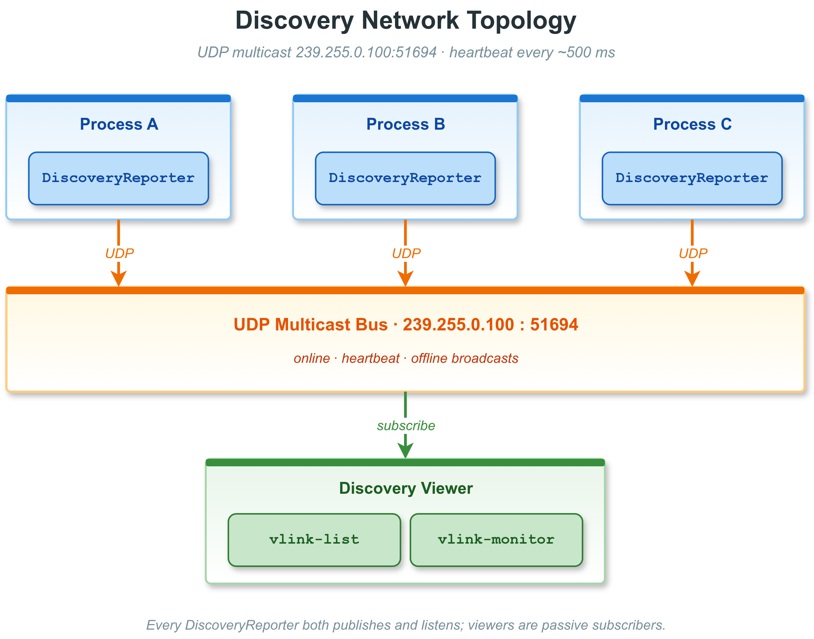
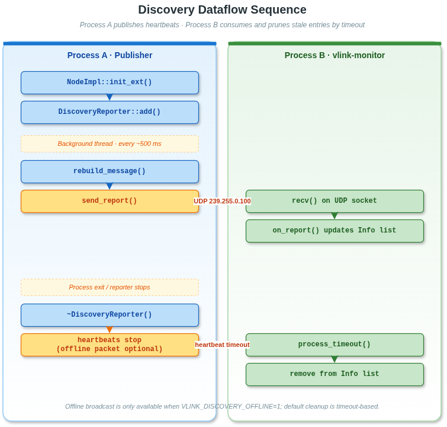

# 17. 服务发现

本文档介绍 VLink 的节点发现机制，包括 `DiscoveryReporter`、`DiscoveryViewer` 的使用方法、`Status`/`StatusDetail` 状态事件体系、实现原理，以及与 CLI 工具的关系。

> **相关文档**：基于发现机制的 CLI 工具参见 [13-cli-tools.md](13-cli-tools.md)（`vlink-list` 和 `vlink-monitor`）；代理层使用发现机制参见 [16-proxy.md](16-proxy.md)；发现相关环境变量参见 [21-environment-vars.md](21-environment-vars.md#213-发现与诊断环境变量)。

---

## 17.1 节点发现概念

VLink 的节点发现（Discovery）是一种**自动、实时的拓扑感知机制**，让应用程序和运维工具可以：

- 查看当前系统中所有活跃的 VLink 节点（Publisher、Subscriber、Client、Server、Setter、Getter）
- 知道每个节点绑定的 URL（话题地址）和传输类型
- 监控各节点所在的进程（主机名、PID、进程名、IP 地址）
- 实时感知节点上下线变化



### 17.1.1 发现机制的核心设计原则

- **透明自动**：`NodeImpl` 构造/析构时自动注册/注销，无需用户干预。
- **零依赖传输**：当前默认走 UDP 组播，地址固定为 `239.255.0.100`、端口 `51694`（见 `src/extension/discovery_reporter.cc:67,71`）；如关闭 `VLINK_DISCOVERY_MULTICAST` 编译路径则退化为广播 `255.255.255.255`。
- **Reporter 进程级单例**：每个进程只有一个 `DiscoveryReporter`；`DiscoveryViewer` 可独立构造，也可通过 `global_get()` 共享。
- **心跳周期**：首次 100ms，之后每 500ms 广播一次（`kReportFirstInterval=100`、`kReportInterval=500`）。
- **心跳超时剔除**：Viewer 内部 `process_timeout()` 对超时进程从视图中移除。

---

## 17.2 DiscoveryReporter

`DiscoveryReporter` 是**发现上报器**，运行在每个有 VLink 节点的进程中，负责将本进程的节点信息广播给所有 `DiscoveryViewer`。

### 17.2.1 自动生命周期管理

用户通常**不需要**直接操作 `DiscoveryReporter`。它的生命周期完全由 VLink 运行时管理：

- 第一个 `NodeImpl` 构造时触发 `GlobalDiscoveryReporter` 的惰性构造（见 `discovery_reporter.cc`）。
- `NodeImpl::init_ext()` 调用 `DiscoveryReporter::global_get()->add(this)`。
- `NodeImpl::deinit_ext()` 调用 `DiscoveryReporter::global_get()->remove(this)`。
- 进程退出或节点销毁后，依赖 `remove()` 和 Viewer 端超时剔除；`send_offline()` 由编译宏 `VLINK_DISCOVERY_OFFLINE` 控制，**默认是 `0`（关闭）**，因此默认构建不会额外发送独立 offline 包。
- 环境变量 `VLINK_DISCOVER_DISABLE=1` 可完全禁用 Reporter；`VLINK_DISCOVER_NATIVE=1` 将组播接口绑定到 loopback (`127.0.0.1`)，仅本机可收到。



### 17.2.2 Discovery 网络拓扑



### 17.2.3 reporter 工作原理

`DiscoveryReporter` 继承自 `MessageLoop`，在独立的后台线程中运行：

1. 构造阶段创建 `AF_INET`/`SOCK_DGRAM` socket、设置 `IP_TTL=3`、`inet_addr("239.255.0.100")`、端口 `51694`。
2. Timer 首次 `100ms`、之后 `500ms` 间隔循环触发 `send_report()`。
3. `rebuild_message()`：收集所有已注册 `NodeImpl`（URL、impl_type、ser_type、schema_type、CpuProfiler 值），打包成不超过 1450 字节 MTU 的文本段，每段一条 UDP 报文。
4. `send_report()` 对每段 `sendto()`。
5. 析构时 `send_offline()`（仅当 `VLINK_DISCOVERY_OFFLINE=1` 编译时启用，默认不启用）。

文本报文内部使用空格和冒号分隔字段。Reporter 写入 URL、`ser_type`、主机名和进程名之前会调用 `Helpers::escape_field()`，将 `%`、空格、冒号、换行和回车编码为 `%XX`；Viewer 侧用 `Helpers::unescape_field()` 解码。这样 URL scheme 中的 `:`、进程名里的空格等字符不会破坏 discovery 文本协议。

### 17.2.4 控制发现报告的开关

通过 `NodeImpl::set_discovery_enabled(false)` 可以在 `init()` 之前关闭单个节点的发现上报。通常由 `NodeImpl` 子类或代理框架内部调用，用户代码不用关心。

### 17.2.5 获取全局 Reporter 实例

```cpp
#include <vlink/extension/discovery_reporter.h>

// 获取（或创建）全局单例
vlink::DiscoveryReporter* reporter = vlink::DiscoveryReporter::global_get();
```

---

## 17.3 DiscoveryViewer

`DiscoveryViewer` 是**发现订阅器**，订阅 `DiscoveryReporter` 广播的消息，聚合并维护一个实时的全局节点拓扑视图。它是 `vlink-list`、`vlink-monitor` 等 CLI 工具的核心数据来源。

### 17.3.1 FilterType 过滤模式

| FilterType       | 含义                                      |
| ---------------- | ----------------------------------------- |
| `kFilterNone`    | 显示所有当前已发现的节点                   |
| `kFilterAvailable` | 只显示当前有存活进程的节点              |
| `kFilterNative`  | 只显示本机（同一主机名）的节点           |

### 17.3.2 基本用法

```cpp
#include <vlink/extension/discovery_viewer.h>

// 创建 Viewer，过滤模式为只显示存活节点
vlink::DiscoveryViewer viewer(vlink::DiscoveryViewer::kFilterAvailable);

// 注册回调，每当拓扑变化时触发
viewer.register_callback([](const std::vector<vlink::DiscoveryViewer::Info>& list) {
    for (const auto& info : list) {
        // info.url          — 节点 URL，如 "dds://my_topic"
        // info.type         — ImplType 位掩码（Publisher/Subscriber 等）
        // info.ser_type     — 具体序列化类型名，如 "demo.proto.PointCloud"、"standard"
        // info.schema_type  — 粗粒度 schema 家族，如 kProtobuf / kFlatbuffers / kRaw / kZeroCopy / kUnknown
        // info.process_list — 托管此 URL 的进程列表
        for (const auto& proc : info.process_list) {
            // proc.host    — 主机名
            // proc.pid     — 进程 ID
            // proc.name    — 进程名
            // proc.ip      — IP 地址
            // proc.profiler — CPU 使用率（-1 表示不可用）
        }
    }
});

// 启动后台循环（异步）
viewer.async_run();

// 等待一段时间后主动获取快照
std::this_thread::sleep_for(std::chrono::seconds(1));
auto snapshot = viewer.get_info_list();
```

### 17.3.3 全局单例用法

```cpp
// 获取（或创建）全局 DiscoveryViewer，首次创建时使用 kFilterNone
vlink::DiscoveryViewer* viewer = vlink::DiscoveryViewer::global_get();
viewer->register_callback([](const std::vector<vlink::DiscoveryViewer::Info>& list) {
    // 处理更新...
});
```

需要 `kFilterAvailable` / `kFilterNative` 时请自行 `new DiscoveryViewer(filter)`，`global_get()` 一经创建过滤模式无法再切换。

### 17.3.4 Info 结构体详解

`DiscoveryViewer::Info` 描述一个 URL 下的聚合信息：

```
Info {
    sort_index   — 稳定排序键（由 Viewer 内部分配）
    type         — ImplType 位掩码（所有进程类型的并集）
    url          — 完整的 VLink URL 字符串，如 "dds://my_topic"
    ser_type     — 具体序列化类型名，如 "demo.proto.PointCloud"
    schema_type  — 粗粒度 schema 家族（kProtobuf / kFlatbuffers / kRaw / kZeroCopy / kUnknown）
    process_list — 托管此 URL 的进程列表
}
```

`DiscoveryViewer::Process` 描述一个进程的信息：

```
Process {
    type     — 该进程中此 URL 的 ImplType（Publisher=发布者 / Subscriber=订阅者等）
    host     — 主机名（hostname）
    pid      — 进程 ID（uint32_t）
    name     — 进程可执行文件名
    ip       — 进程所在主机的 IP 地址
    profiler — CPU 利用率（double，-1 表示未启用 CpuProfiler）
}
```

### 17.3.5 DiscoveryReporter vs DiscoveryViewer

| 特性               | DiscoveryReporter                      | DiscoveryViewer                                   |
| ------------------ | -------------------------------------- | ------------------------------------------------- |
| 职责               | 发送本进程节点信息                     | 接收并聚合跨进程/跨机节点信息                     |
| UDP 方向           | `sendto()`                             | `bind()` + `recvfrom()`                           |
| 触发方式           | 定时器（100ms/500ms）                  | Socket 可读 + `process_timeout()`                 |
| 用户可见 API       | 几乎无（由 NodeImpl 内部调用）         | `register_callback()`、`get_info_list()`、`get_ser_type()`、`get_schema_type()`、`convert_type*()`、`get_listen_address()` |
| 过滤               | 由 `NodeImpl::set_discovery_enabled()` 控制 | `FilterType` 枚举（None / Available / Native） |
| 全局单例           | 进程内自动创建；`VLINK_DISCOVER_DISABLE=1` 可禁用 | `global_get()`，默认 `kFilterNone`             |
| 下线事件           | `send_offline()` 仅在 `VLINK_DISCOVERY_OFFLINE=1` 编译时发送 | 依赖超时剔除              |

### 17.3.6 类型转换工具方法

```cpp
// 将传输方案字符串转换为 ImplType
vlink::ImplType type = vlink::DiscoveryViewer::convert_type("dds");

// 将 ImplType 位掩码转换为可读字符串
std::string view = vlink::DiscoveryViewer::convert_type_to_view(type);

// 将类型和进程列表转换为综合显示字符串
std::string full_view = vlink::DiscoveryViewer::convert_type_to_view(type, process_list);

// 获取 Discovery 使用的监听组播地址
std::string addr = vlink::DiscoveryViewer::get_listen_address();

// 查询某 URL 的序列化类型
std::string ser = viewer.get_ser_type("dds://my_topic");

// 查询某 URL 的 schema 家族
vlink::SchemaType schema_type = viewer.get_schema_type("dds://my_topic");
```

---

## 17.4 Status 与 StatusDetail

### 17.4.1 Status 体系概述

`Status` 是 VLink 向 DDS 传输层对齐的**状态事件系统**，当传输层发生特定事件（如新订阅者匹配、截止时间错过）时，通过回调通知应用层。

状态事件分为写方（Writer-side）和读方（Reader-side）两组：

**写方状态**（Publisher / Server / Setter）：

| 状态类型                  | 触发条件                                 |
| ------------------------- | ---------------------------------------- |
| `kPublicationMatched`     | 匹配的订阅者出现或消失                   |
| `kOfferedDeadlineMissed`  | 发布者未在声明的截止时间内发布数据       |
| `kOfferedIncompatibleQos` | 发现了 QoS 不兼容的订阅者               |
| `kLivelinessLost`         | 发布者未能在 liveliness 时限内主动声明   |

**读方状态**（Subscriber / Client / Getter）：

| 状态类型                     | 触发条件                                  |
| ---------------------------- | ----------------------------------------- |
| `kSubscriptionMatched`       | 匹配的发布者出现或消失                    |
| `kRequestedDeadlineMissed`   | 订阅者未在声明的截止时间内收到数据        |
| `kLivelinessChanged`         | 匹配发布者的 liveliness 状态发生变化      |
| `kSampleRejected`            | 由于资源限制，传入的样本被拒绝            |
| `kRequestedIncompatibleQos`  | 发现了 QoS 不兼容的发布者                |
| `kSampleLost`                | 样本在送达前丢失                          |

> **注意**：Status 回调目前仅支持 DDS 系列传输后端（`dds://`、`ddsc://`、`ddsr://`、`ddst://`）。在其他传输后端调用 `register_status_handler()` 会打印 warning 并忽略。

### 17.4.2 注册状态回调

```cpp
#include <vlink/extension/status.h>
#include <vlink/extension/status_detail.h>

auto sub = vlink::Subscriber<std::string>::create_shared("dds://my_topic");

sub->register_status_handler([](vlink::Status::BasePtr status) {
    switch (status->get_type()) {

    case vlink::Status::kSubscriptionMatched: {
        auto matched = status->as<vlink::Status::SubscriptionMatched>();
        VLOG_I("Matched publishers: current=", matched->current_count,
               " total=", matched->total_count);
        break;
    }

    case vlink::Status::kRequestedDeadlineMissed: {
        auto missed = status->as<vlink::Status::RequestedDeadlineMissed>();
        VLOG_W("Deadline missed: count=", missed->total_count);
        break;
    }

    case vlink::Status::kSampleRejected: {
        auto rejected = status->as<vlink::Status::SampleRejected>();
        if (rejected->last_reason ==
            vlink::Status::SampleRejected::kRejectedBySamplesLimit) {
            VLOG_W("Sample rejected: samples limit exceeded");
        }
        break;
    }

    default:
        VLOG_I("Status: ", *status);
        break;
    }
});
```

### 17.4.3 Status::Base 基类接口

```cpp
// 获取状态类型（用于 switch 判断）
Status::Type type = status->get_type();

// 获取人类可读的描述字符串
std::string desc = status->get_string();

// 类型安全的向下转型
auto matched = status->as<Status::PublicationMatched>();

// 判断是否为写方事件
bool is_writer = Status::is_for_writer(type);

// 判断是否为读方事件
bool is_reader = Status::is_for_reader(type);

// 流式输出
std::cout << *status << std::endl;
```

### 17.4.4 各具体状态类型字段

**PublicationMatched**（发布者端）：

```cpp
auto m = status->as<Status::PublicationMatched>();
m->total_count;              // 历史累计匹配的读方总数
m->total_count_change;       // 自上次回调以来的变化量
m->current_count;            // 当前活跃匹配的读方数
m->current_count_change;     // 当前计数的变化量
m->last_subscription_handle; // 最近匹配读方的句柄（传输层不透明指针）
```

**SubscriptionMatched**（订阅者端）：

```cpp
auto m = status->as<Status::SubscriptionMatched>();
m->total_count;
m->total_count_change;
m->current_count;
m->current_count_change;
m->last_publication_handle;  // 最近匹配写方的句柄
```

**OfferedDeadlineMissed / RequestedDeadlineMissed**：

```cpp
auto m = status->as<Status::OfferedDeadlineMissed>();
m->total_count;              // 总错过次数（跨所有实例）
m->total_count_change;
m->last_instance_handle;     // 最近错过截止的实例句柄
```

**SampleRejected**（拒绝原因）：

```cpp
auto r = status->as<Status::SampleRejected>();
r->total_count;
r->total_count_change;
r->last_reason;              // SampleRejected::Kind 枚举
r->last_instance_handle;

// Kind 枚举值：
// kNotRejected                     — 未拒绝
// kRejectedByInstancesLimit        — 超出最大实例数限制
// kRejectedBySamplesLimit          — 超出最大总样本数限制
// kRejectedBySamplesPerInstanceLimit — 超出单实例最大样本数限制
```

**LivelinessChanged**（订阅者端）：

```cpp
auto l = status->as<Status::LivelinessChanged>();
l->alive_count;              // 当前存活的匹配写方数
l->not_alive_count;          // 当前不存活的匹配写方数
l->alive_count_change;
l->not_alive_count_change;
l->last_publication_handle;
```

**OfferedIncompatibleQos / RequestedIncompatibleQos**：

```cpp
auto q = status->as<Status::OfferedIncompatibleQos>();
q->total_count;
q->total_count_change;
q->last_policy_id;           // 导致不兼容的 QoS 策略 ID

// 亦可直接使用流输出查看详情
VLOG_I("QoS incompatible: ", *status);
```

---

## 17.5 发现机制实现原理

### 17.5.1 传输层选择

发现系统基于 **UDP 组播/广播**，不依赖任何外部 DDS 中间件：

- `DiscoveryReporter` 当前默认使用 UDP 组播地址 `239.255.0.100` 发送心跳；广播模式仅在关闭组播编译路径时作为备选实现
- `DiscoveryViewer` 内部使用 UDP socket 接收心跳并聚合节点信息
- 支持同机跨进程的节点发现

### 17.5.2 消息格式

发现消息为序列化的进程快照，包含：

```
DiscoveryMessage {
    host_name    — 主机名
    app_name     — 应用程序名
    pid          — 进程 ID
    ip           — 主机 IP
    profiler     — CPU 使用率（来自 CpuProfiler）
    is_offline   — 是否为下线通知
    nodes[] {
        url          — 节点的完整 URL
        impl_type    — ImplType（Publisher/Subscriber/Client/Server/Setter/Getter）
        ser_type     — 序列化类型字符串
        schema_type  — 粗粒度 schema 家族
    }
}
```

### 17.5.3 心跳与超时剔除

- `DiscoveryReporter` 首次 100ms、之后每 500ms 广播一次节点列表。
- 每段 UDP 报文不超过 1450 字节 MTU，节点多时会拆成多段报文。
- `DiscoveryViewer::process_timeout()` 负责检测超时进程：若某进程的最后一次心跳超过阈值仍无更新，则从视图中移除。
- `send_offline()` 仍保留在 `DiscoveryReporter` 的代码中，由编译宏 `VLINK_DISCOVERY_OFFLINE` 控制；**默认 0 表示不发送 offline 通知**，Viewer 完全依赖超时剔除。

### 17.5.4 排序与稳定显示

`DiscoveryViewer` 在每次更新后调用 `sort_url()` 对 `Info` 列表排序：

- `Info::operator<`：按 `sort_index`（首次出现顺序），再按 `url`
- `Process::operator<`：按 `host`，再按 `pid`

这保证了 CLI 工具显示时的稳定顺序，不会因为心跳更新而跳动。

### 17.5.5 完整的发现数据流



---

## 17.6 实时拓扑监控示例

### 17.6.1 打印当前所有存活节点

```cpp
#include <vlink/extension/discovery_viewer.h>
#include <chrono>
#include <iostream>
#include <thread>

int main() {
    vlink::DiscoveryViewer viewer(vlink::DiscoveryViewer::kFilterAvailable);

    viewer.register_callback([](const std::vector<vlink::DiscoveryViewer::Info>& list) {
        std::cout << "=== Topology Update ===" << std::endl;
        for (const auto& info : list) {
            std::cout << "[" << info.url << "] "
                      << "type=" << vlink::DiscoveryViewer::convert_type_to_view(info.type)
                      << " ser=" << info.ser_type << std::endl;
            for (const auto& proc : info.process_list) {
                std::cout << "  Process: " << proc.name
                          << " PID=" << proc.pid
                          << " host=" << proc.host
                          << " ip=" << proc.ip;
                if (proc.profiler >= 0) {
                    std::cout << " cpu=" << proc.profiler << "%";
                }
                std::cout << std::endl;
            }
        }
        std::cout << std::endl;
    });

    viewer.async_run();

    // 持续监控
    while (true) {
        std::this_thread::sleep_for(std::chrono::seconds(5));
    }
    return 0;
}
```

### 17.6.2 一次性获取拓扑快照

```cpp
#include <vlink/extension/discovery_viewer.h>
#include <chrono>
#include <thread>

// 创建 viewer 并等待第一个心跳周期
vlink::DiscoveryViewer viewer(vlink::DiscoveryViewer::kFilterAvailable);
viewer.async_run();

// 等待 2s 让节点信息汇聚
std::this_thread::sleep_for(std::chrono::seconds(2));

// 获取快照
auto list = viewer.get_info_list();
for (const auto& info : list) {
    // 处理...
}
```

### 17.6.3 监控特定 URL 的进程

```cpp
viewer.register_callback([](const std::vector<vlink::DiscoveryViewer::Info>& list) {
    for (const auto& info : list) {
        if (info.url == "dds://camera_image") {
            // 检查是否有发布者和订阅者同时存在
            bool has_pub = false;
            bool has_sub = false;
            for (const auto& proc : info.process_list) {
                // ImplType 位掩码：kPublisher=1, kSubscriber=2
                if (proc.type & 1) { has_pub = true; }
                if (proc.type & 2) { has_sub = true; }
            }
            if (!has_pub) {
                VLOG_W("No publisher for camera_image!");
            }
            if (!has_sub) {
                VLOG_W("No subscriber for camera_image!");
            }
        }
    }
});
```

---

## 17.7 与 CLI 工具的关系

VLink 提供了两个基于 `DiscoveryViewer` 的 CLI 工具：

### 17.7.1 vlink-list

`vlink-list`（`cli/list/`）是一个**一次性查询**工具：

- 创建 `DiscoveryViewer`（`kFilterNone`）
- 等待若干心跳周期（约 1s）
- 打印当前拓扑表格后退出

```bash
# 列出所有存活节点
vlink-list

# 输出示例（每个进程一段、内嵌列表 Publisher/Subscriber/Server/Client/Setter/Getter；详见
# [CLI 工具 -- vlink-list](13-cli-tools.md#135-vlink-list--列出活动节点与话题)）：
# sensor_node (pid: 1234, host: hostA, ip: 192.168.1.10)
#   Publisher:
#     dds://camera_image  protobuf  CameraImage
#   Subscriber:
#     shm://control_cmd   standard  ControlCmd
# lidar_node (pid: 4321, host: hostA, ip: 192.168.1.10)
#   Publisher:
#     shm://lidar_points  standard  LidarPoints
```

### 17.7.2 vlink-monitor

`vlink-monitor`（`cli/monitor/`）是一个**持续监控**工具（类似 `top`）：

- 默认创建 `DiscoveryViewer`（`kFilterAvailable`）；`-n/--native` 会切换到 `kFilterNative`。
- 注册回调，每次拓扑变化时刷新终端界面。
- 显示节点 URL、类型、进程、CPU 利用率等实时数据。
- 支持按 URL 子串过滤。

```bash
# 持续监控
vlink-monitor

# 按 URL 子串过滤（空格分隔多个子串）
vlink-monitor -i dds
vlink-monitor -i "dds shm"
```

`-i/--filter` 是 URL 子串匹配（空格分隔多个 pattern），不是传输类型枚举匹配，也不是正则。

### 17.7.3 在应用程序中嵌入监控

通过 `DiscoveryViewer::global_get()` 在应用程序内部访问拓扑信息，无需单独进程：

```cpp
// 在应用启动时注册监控
vlink::DiscoveryViewer* viewer = vlink::DiscoveryViewer::global_get();
viewer->register_callback([](const auto& list) {
    // 集成到应用的监控/告警系统
    my_monitor_system.update_topology(list);
});
```

---

## 17.8 跨网络发现配置

### 17.8.1 当前限制

VLink 发现系统基于 UDP 组播/广播，**支持同一局域网内跨进程、跨机器的节点发现**。

- 设置 `VLINK_DISCOVER_NATIVE=1` 可限制仅发现本机节点（参见 [21-environment-vars.md](21-environment-vars.md#213-发现与诊断环境变量)）
- 设置 `VLINK_DISCOVER_DISABLE=1` 可完全禁用发现功能（参见 [21-environment-vars.md](21-environment-vars.md#213-发现与诊断环境变量)）

### 17.8.2 同机多进程发现

在同一台机器上的多个进程中，各进程的 `DiscoveryReporter` 会通过 UDP 组播心跳，`DiscoveryViewer` 可自动发现所有进程中的节点。

如需跨进程汇聚发现信息，可以：

1. 使用 `vlink-list` / `vlink-monitor` CLI 工具（它们直接基于 `DiscoveryViewer` 做 UDP 发现聚合）
2. 通过代理层（`proxy/`）统一汇聚来自不同进程的拓扑信息

### 17.8.3 FilterType 在跨网络场景的应用

```cpp
// kFilterNative：只显示本机节点（过滤掉来自其他主机的节点）
vlink::DiscoveryViewer viewer(vlink::DiscoveryViewer::kFilterNative);

// 主机名比较基于 DiscoveryReporter::get_host_name()，等同于 hostname 命令输出
```

---

## 17.9 自定义发现报告内容

### 17.9.1 控制 CPU Profiler 数据上报

`DiscoveryReporter` 在构建发现消息时，会读取每个 `NodeImpl` 的 `profiler` 字段（`CpuProfiler` 实例）。

若要在发现数据中包含 CPU 使用率，需要在全局启用 CPU Profiler（VLink 内部自动处理，无需用户配置）。`DiscoveryViewer::Process::profiler` 字段的值：

- `>= 0.0`：当前节点的 CPU 使用率百分比
- `< 0`（即 `-1`）：CpuProfiler 未启用或数据不可用

### 17.9.2 控制节点是否出现在发现视图

```cpp
// 创建节点前可以通过 NodeImpl 接口控制（通常由 Conf 层透传）
// 例如：代理内部通信节点，不希望显示在用户视图中
publisher->get_impl()->set_discovery_enabled(false);

// 默认值为 true（出现在发现视图中）
bool enabled = publisher->get_impl()->get_discovery_enabled();
```

### 17.9.3 查询序列化类型

通过 `DiscoveryViewer::get_ser_type()` 和 `DiscoveryViewer::get_schema_type()` 可以查询任意 URL 当前使用的序列化类型与 schema 家族：

```cpp
vlink::DiscoveryViewer* viewer = vlink::DiscoveryViewer::global_get();
viewer->async_run();

std::this_thread::sleep_for(std::chrono::seconds(2));

std::string ser = viewer->get_ser_type("dds://camera_image");
vlink::SchemaType schema_type = viewer->get_schema_type("dds://camera_image");
// 返回值示例："demo.proto.PointCloud"、"demo.fbs.CameraFrame"、"standard"、"bytes"
// 若该 URL 未被发现，返回空字符串
if (!ser.empty()) {
    VLOG_I("camera_image uses serialization: ", ser);
}
VLOG_I("camera_image schema_type: ", static_cast<int>(schema_type));
```

---

## 17.10 完整监控示例程序

以下是一个功能完整的节点监控程序示例，展示如何将 `DiscoveryViewer` 与状态回调结合使用：

```cpp
#include <vlink/vlink.h>
#include <vlink/extension/discovery_viewer.h>
#include <vlink/extension/status.h>
#include <vlink/extension/status_detail.h>
#include <chrono>
#include <csignal>
#include <iostream>
#include <thread>

using namespace vlink;

static volatile bool g_running = true;

void print_topology(const std::vector<DiscoveryViewer::Info>& list) {
    std::cout << "\033[2J\033[H";  // 清屏
    std::cout << "=== VLink Topology Monitor ===" << std::endl;
    std::cout << "Nodes: " << list.size() << std::endl;
    std::cout << std::endl;

    for (const auto& info : list) {
        std::cout << "  " << info.url << std::endl;
        std::cout << "    Type:   "
                  << DiscoveryViewer::convert_type_to_view(info.type)
                  << std::endl;
        std::cout << "    SerType: " << info.ser_type << std::endl;
        std::cout << "    SchemaType: " << static_cast<int>(info.schema_type) << std::endl;
        std::cout << "    Processes:" << std::endl;

        for (const auto& proc : info.process_list) {
            std::cout << "      - " << proc.name
                      << " [" << proc.host << ":" << proc.pid << "]"
                      << " ip=" << proc.ip;
            if (proc.profiler >= 0) {
                std::cout << " cpu=" << proc.profiler << "%";
            }
            std::cout << std::endl;
        }
        std::cout << std::endl;
    }
}

int main() {
    // 1. 创建订阅者，监控 DDS 状态事件
    auto sub = Subscriber<std::string>::create_shared("dds://monitored_topic");
    sub->register_status_handler([](Status::BasePtr status) {
        if (status->get_type() == Status::kSubscriptionMatched) {
            auto m = status->as<Status::SubscriptionMatched>();
            std::cout << "[Status] Matched publishers: "
                      << m->current_count << std::endl;
        }
    });

    // 2. 创建拓扑视图
    DiscoveryViewer viewer(DiscoveryViewer::kFilterAvailable);
    viewer.register_callback(print_topology);
    viewer.async_run();

    // 3. 等待 Ctrl+C
    signal(SIGINT, [](int) { g_running = false; });
    while (g_running) {
        std::this_thread::sleep_for(std::chrono::milliseconds(100));
    }

    return 0;
}
```
