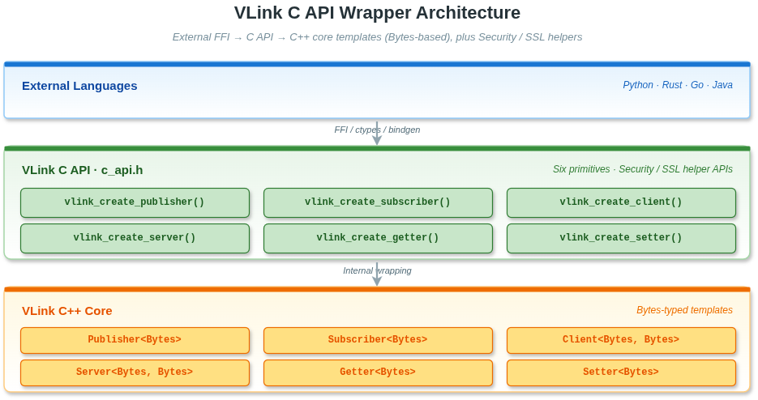

# 18. C API

## 18.1 概述

VLink C API 提供了一套稳定的、语言无关的纯 C 绑定，封装了 VLink C++ 核心库的三种通信模型。通过 C API，可以在 C 语言、Python、Go、Rust 等不支持直接调用 C++ 模板的语言中使用 VLink 的六个通信原语（Publisher/Subscriber、Client/Server、Setter/Getter）的**数据面**能力。

> **覆盖范围**：C API 暴露六个原语的数据面接口（创建/销毁、发布/订阅、请求/响应、读写字段），以及消息级 Security（AES-128-GCM / RSA-OAEP / 自定义回调）和 SSL 选项；**不覆盖** QoS、Bag 录制、Discovery 等高级功能，这些仍须通过 C++ API 使用。数据载荷类型统一为 `Bytes`，序列化类型通过 `vlink_schema_info_t` 的 `ser` + `schema` 传入。
>
> 启用加密的节点必须通过 `vlink_create_secure_publisher()` / `vlink_create_secure_subscriber()` / `vlink_create_secure_server()` / `vlink_create_secure_client()` / `vlink_create_secure_setter()` / `vlink_create_secure_getter()` 创建——`Security` 在 `init()` 之前装配完成。C API 不再暴露 `vlink_*_enable_security()` 系列函数。

> **相关文档**：C++ 通信模型参见 [03-event-model.md](03-event-model.md)、[04-method-model.md](04-method-model.md)、[05-field-model.md](05-field-model.md)；传输 URL 格式参见 [07-transport.md](07-transport.md)；C API 示例参见 [22-examples.md](22-examples.md#c_api)。

---

## 18.2 设计思路

### 18.2.1 为什么提供 C API

| 需求                       | 说明                                                               |
| -------------------------- | ------------------------------------------------------------------ |
| 语言互操作（FFI）          | Python ctypes / Go cgo / Rust bindgen 均通过 C ABI 调用动态库     |
| ABI 稳定性                 | C++ 模板实例化依赖编译器细节，C 函数符号稳定且跨编译器兼容         |
| 嵌入式/实时系统集成        | 部分 RTOS 环境只支持 C 链接，无 C++ 运行时                         |
| 遗留代码集成               | 现有 C 项目可直接链接 VLink，无需改写为 C++                        |
| 动态加载                   | `dlopen` / `LoadLibrary` 加载 VLink 共享库并按名称查找函数        |

### 18.2.2 设计原则

- **句柄（Handle）模式**：每种节点类型对应一个不透明的 C 结构体，内含 `native_handle` 指向堆分配的 C++ 对象
- **统一返回值**：所有函数返回 `vlink_ret_t` 整数，`0` 为成功，非 `0` 为错误或条件码
- **回调驱动**：订阅/服务器请求/连接状态变化均通过函数指针回调通知
- **内存所有权明确**：`create` 与 `destroy` 成对调用，`destroy` 负责释放所有内部资源

---

## 18.3 编译选项

C API 以独立库 `vlink-c_api` 的形式提供，需单独链接。

### 18.3.1 CMake 集成

```cmake
# 查找并链接 C API 库
find_package(vlink REQUIRED)
target_link_libraries(my_c_app PRIVATE vlink::c_api)
```

### 18.3.2 编译宏说明

| 宏                          | 作用                                               |
| --------------------------- | -------------------------------------------------- |
| `VLINK_C_API_LIBRARY`       | 构建动态库时由库自动定义（启用 `dllexport`）       |
| `VLINK_C_API_LIBRARY_STATIC`| 构建静态库时由库自动定义，使用方也需定义           |
| `VLINK_C_API_EXPORT`        | 函数可见性修饰符，自动根据平台和构建类型展开       |
| `VLINK_ENABLE_C_INTERFACE`  | 库内部编译标志，表明正在构建 C API 模块            |

### 18.3.3 头文件包含

```c
#include <vlink/external/c_api.h>
```

该头文件是纯 C 头文件，使用 `#ifdef __cplusplus extern "C"` 保护，可在 C 和 C++ 代码中同时使用。

---

## 18.4 数据类型说明

### 18.4.1 返回值类型 `vlink_ret_t`

```c
typedef enum {
    VLINK_RET_UNKNOWN_ERROR   = -1,  // 未分类内部错误
    VLINK_RET_NO_ERROR        =  0,  // 操作成功
    VLINK_RET_UNEXPECTED_ERROR=  1,  // 条件未满足（如无订阅者）
    VLINK_RET_INVALID_ERROR   =  2,  // 空指针或无效句柄
    VLINK_RET_MEMORY_ERROR    =  3,  // 调用方缓冲区太小
    VLINK_RET_RUNTIME_ERROR   =  4,  // C++ 构造或初始化过程中抛出异常
    VLINK_RET_TRANSFER_ERROR  =  5,  // 发布/监听/调用操作失败
} vlink_ret_t;
```

| 返回值                      | 含义                                               | 典型场景                              |
| --------------------------- | -------------------------------------------------- | ------------------------------------- |
| `VLINK_RET_NO_ERROR (0)`    | 操作成功                                           | 所有正常操作                          |
| `VLINK_RET_UNEXPECTED_ERROR (1)` | 条件尚未满足，可重试                          | `vlink_has_subscribers` 无订阅者时    |
| `VLINK_RET_INVALID_ERROR (2)` | 传入了空指针或未初始化的句柄                    | `url == NULL` 或句柄未创建            |
| `VLINK_RET_MEMORY_ERROR (3)` | 调用方提供的缓冲区容量不足                       | `vlink_get` 时 `*size` 太小           |
| `VLINK_RET_RUNTIME_ERROR (4)` | 运行时调用上下文不合法，或底层构造 / 初始化过程中抛出异常 | URL 格式错误、DDS 域不可用、回调外调用 `vlink_reply()` |
| `VLINK_RET_TRANSFER_ERROR (5)` | 发送/接收操作失败                              | 无订阅者时调用 `vlink_publish`        |
| `VLINK_RET_UNKNOWN_ERROR (-1)` | 未分类错误                                     | 极少出现                              |

### 18.4.2 句柄类型

所有句柄类型均为 C 结构体，包含一个 `void* native_handle` 和一个 `void* reserved[8]` 数组：

```c
typedef struct {
    void* native_handle;  // 内部 C++ 对象指针，勿直接操作
    void* reserved[8];    // 内部保留字段，勿直接操作
} vlink_publisher_handle_t;
```

`reserved[0..4]` 用于内部状态（server callback 协调、Security 实例指针等）；`reserved[5..7]` 用于 Security 替换链表与未来扩展。用户代码不得直接读写。

| 句柄类型                     | 对应 C++ 类型                                   | 用途         |
| ---------------------------- | ----------------------------------------------- | ------------ |
| `vlink_publisher_handle_t`   | `vlink::Publisher<vlink::Bytes>`                | Event 发布   |
| `vlink_subscriber_handle_t`  | `vlink::Subscriber<vlink::Bytes>`               | Event 订阅   |
| `vlink_server_handle_t`      | `vlink::Server<vlink::Bytes, vlink::Bytes>`     | Method 服务端 |
| `vlink_client_handle_t`      | `vlink::Client<vlink::Bytes, vlink::Bytes>`     | Method 客户端 |
| `vlink_setter_handle_t`      | `vlink::Setter<vlink::Bytes>`                   | Field 写入   |
| `vlink_getter_handle_t`      | `vlink::Getter<vlink::Bytes>`                   | Field 读取   |

`vlink_server_handle_t` 的 `reserved` 数组有特殊用途：

| 字段          | 用途                                               |
| ------------- | -------------------------------------------------- |
| `reserved[0]` | 指向 `std::mutex`，在请求回调期间持有锁            |
| `reserved[1]` | 指向响应字节缓冲区（由 `vlink_reply` 分配）        |
| `reserved[2]` | 响应字节数（存储为指针大小的整数）                 |
| `reserved[3]` | 非空表示请求处理进行中（由 `vlink_reply` 清零）    |

### 18.4.3 回调类型

```c
// 连接状态变化回调（Publisher 有订阅者时 / Client 连接到 Server 时）
typedef void (*vlink_connect_callback_t)(const bool is_connected, void* user_data);

// 收到消息回调（Subscriber、Getter 推送模式）
typedef void (*vlink_msg_callback_t)(const uint8_t* data, const size_t size, void* user_data);

// Server 收到 RPC 请求回调（必须在此回调内调用 vlink_reply）
typedef void (*vlink_req_callback_t)(const uint8_t* data, const size_t size, void* user_data);

// Client 收到 RPC 响应回调
typedef void (*vlink_resp_callback_t)(const uint8_t* data, const size_t size, void* user_data);
```

### 18.4.4 `schema + ser` 元数据封装

从这一版开始，C API 的创建接口统一通过 `vlink_schema_info_t` 输入 `ser + schema`，在节点初始化前一次性写入底层节点：

```c
typedef enum {
    VLINK_SCHEMA_UNKNOWN = 0,
    VLINK_SCHEMA_RAW = 1,
    VLINK_SCHEMA_ZEROCOPY = 2,
    VLINK_SCHEMA_PROTOBUF = 3,
    VLINK_SCHEMA_FLATBUFFERS = 4,
} vlink_schema_t;

typedef struct {
    const char* ser;
    vlink_schema_t schema;
} vlink_schema_info_t;
```

- `vlink_schema_t` 的整数值**故意与 C++ `enum class SchemaType` 保持一致**（见 `include/vlink/impl/types.h`），这样底层 `apply_schema_info` 能安全走一次 `static_cast`；C 客户端应始终使用枚举名，而不是裸整数常量

- `ser` 表示具体类型名或序列化标识，例如 `"demo.proto.PointCloud"`、`"json"`、`"vlink::zerocopy::CameraFrame"`
- `schema` 表示粗粒度 schema 家族，用于 discovery、proxy、bag、viewer 等模块做显式路由
- 当前实现依赖 `vlink_schema_t` 与底层 `SchemaType` 的整数值保持一致，并通过 `static_cast` 转换到底层枚举；调用方应始终使用枚举名，而不是自造裸整数
- `schema_info == NULL` 时表示不显式设置 `ser/schema`
- `schema_info->ser == NULL` 或空字符串，且 `schema == VLINK_SCHEMA_UNKNOWN` 时，等价于不显式设置 `ser/schema`
- `ser` 与 `schema` 必须同时提供或同时省略；只填其中一侧会返回 `VLINK_RET_INVALID_ERROR`
- `schema_info->schema` 必须是合法枚举值，否则创建函数返回 `VLINK_RET_INVALID_ERROR`

---

## 18.5 全部 C API 函数列表

### 18.5.1 Publisher 相关

| 函数名                      | 参数                                                                      | 返回值           | 功能说明                             |
| --------------------------- | ------------------------------------------------------------------------- | ---------------- | ------------------------------------ |
| `vlink_create_publisher`    | `url`, `*schema_info`, `*handle`                                          | `vlink_ret_t`    | 创建 Publisher，并显式设置 `ser/schema` |
| `vlink_destroy_publisher`   | `*handle`                                                                 | `vlink_ret_t`    | 销毁 Publisher 节点，释放资源        |
| `vlink_has_subscribers`     | `handle`                                                                  | `vlink_ret_t`    | 检查是否有匹配的 Subscriber          |
| `vlink_wait_for_subscribers`| `handle`, `timeout_ms`                                                    | `vlink_ret_t`    | 阻塞等待至少一个 Subscriber 匹配     |
| `vlink_detect_subscribers`  | `handle`, `connect_callback`, `user_data`                                 | `vlink_ret_t`    | 注册连接状态变化回调                 |
| `vlink_publish`             | `handle`, `data`, `size`                                                  | `vlink_ret_t`    | 发布消息（需有订阅者）               |
| `vlink_publish_by_force`    | `handle`, `data`, `size`                                                  | `vlink_ret_t`    | 强制发布消息（无订阅者也发送）       |

### 18.5.2 Subscriber 相关

| 函数名                       | 参数                                                                      | 返回值           | 功能说明                             |
| ---------------------------- | ------------------------------------------------------------------------- | ---------------- | ------------------------------------ |
| `vlink_create_subscriber`    | `url`, `*schema_info`, `*handle`, `msg_callback`, `user_data`             | `vlink_ret_t`    | 创建 Subscriber，并显式设置 `ser/schema` |
| `vlink_destroy_subscriber`   | `*handle`                                                                 | `vlink_ret_t`    | 销毁 Subscriber，释放资源            |

### 18.5.3 Server 相关

| 函数名                  | 参数                                                                          | 返回值           | 功能说明                                    |
| ----------------------- | ----------------------------------------------------------------------------- | ---------------- | ------------------------------------------- |
| `vlink_create_server`   | `url`, `*schema_info`, `*handle`, `req_callback`, `user_data`                 | `vlink_ret_t`    | 创建 Server，并显式设置 `ser/schema`        |
| `vlink_destroy_server`  | `*handle`                                                                     | `vlink_ret_t`    | 销毁 Server，释放资源（包括内部 mutex）     |
| `vlink_reply`           | `*handle`, `data`, `size`                                                     | `vlink_ret_t`    | 在请求回调内提供响应数据                    |

### 18.5.4 Client 相关

| 函数名                  | 参数                                                                          | 返回值           | 功能说明                             |
| ----------------------- | ----------------------------------------------------------------------------- | ---------------- | ------------------------------------ |
| `vlink_create_client`   | `url`, `*schema_info`, `*handle`                                              | `vlink_ret_t`    | 创建 Client，并显式设置 `ser/schema` |
| `vlink_destroy_client`  | `*handle`                                                                     | `vlink_ret_t`    | 销毁 Client，释放资源                |
| `vlink_has_server`      | `handle`                                                                      | `vlink_ret_t`    | 检查是否已连接到 Server              |
| `vlink_wait_for_server` | `handle`, `timeout_ms`                                                        | `vlink_ret_t`    | 阻塞等待 Server 可用                 |
| `vlink_detect_server`   | `handle`, `connect_callback`, `user_data`                                     | `vlink_ret_t`    | 注册连接状态变化回调                 |
| `vlink_invoke`          | `handle`, `data`, `size`, `resp_callback`, `user_data`                        | `vlink_ret_t`    | 发送 RPC 请求并注册响应回调          |

### 18.5.5 Setter 相关

| 函数名                  | 参数                                                  | 返回值           | 功能说明                             |
| ----------------------- | ----------------------------------------------------- | ---------------- | ------------------------------------ |
| `vlink_create_setter`   | `url`, `*schema_info`, `*handle`                      | `vlink_ret_t`    | 创建 Setter，并显式设置 `ser/schema` |
| `vlink_destroy_setter`  | `*handle`                                             | `vlink_ret_t`    | 销毁 Setter，释放资源                |
| `vlink_set`             | `handle`, `data`, `size`                              | `vlink_ret_t`    | 发布最新字段值                       |

### 18.5.6 Getter 相关

| 函数名                  | 参数                                                                          | 返回值           | 功能说明                                    |
| ----------------------- | ----------------------------------------------------------------------------- | ---------------- | ------------------------------------------- |
| `vlink_create_getter`   | `url`, `*schema_info`, `*handle`, `msg_callback`, `user_data`                 | `vlink_ret_t`    | 创建 Getter；msg_callback 为 NULL 则轮询模式 |
| `vlink_destroy_getter`  | `*handle`                                                                     | `vlink_ret_t`    | 销毁 Getter，释放资源                       |
| `vlink_get`             | `handle`, `data`, `*size`                                                     | `vlink_ret_t`    | 轮询获取最新字段值到调用方缓冲区            |

---

## 18.6 API 详细说明

### 18.6.1 Publisher 相关函数

#### 18.6.1.1 `vlink_create_publisher`

```c
int vlink_create_publisher(
    const char* url,
    const vlink_schema_info_t* schema_info,
    vlink_publisher_handle_t* handle);
```

- 在堆上分配一个 `Publisher<Bytes>` 对象，将指针存入 `handle->native_handle`
- `url`：VLink 话题 URL，如 `"dds://my/topic"`，不可为 NULL
- `schema_info->ser` 与 `schema_info->schema` 会在底层节点 `init()` 之前一次性写入
- 若 `schema_info == NULL`，等价于未设置 `ser/schema`
- 若 `schema_info->schema` 不是合法枚举值，返回 `VLINK_RET_INVALID_ERROR`
- 返回 `VLINK_RET_RUNTIME_ERROR` 表示底层节点在构造或 `init()` 过程中抛出异常（例如 URL 非法或对应传输不可用）

#### 18.6.1.2 `vlink_publish`

```c
int vlink_publish(const vlink_publisher_handle_t handle, const uint8_t* data, const size_t size);
```

- 内部以浅拷贝方式将 `data` 封装为 `Bytes`，在函数返回前数据有效即可
- 若无匹配的 Subscriber，返回 `VLINK_RET_TRANSFER_ERROR`
- 使用 `vlink_publish_by_force` 可绕过订阅者检查（适合 late-joining 场景）

#### 18.6.1.3 `vlink_wait_for_subscribers`

```c
int vlink_wait_for_subscribers(const vlink_publisher_handle_t handle, const int timeout_ms);
```

- 阻塞当前线程，直到至少一个 Subscriber 匹配或超时
- `timeout_ms < 0` 表示无限等待

### 18.6.2 Subscriber 相关函数

#### 18.6.2.1 `vlink_create_subscriber`

```c
int vlink_create_subscriber(
    const char* url, const vlink_schema_info_t* schema_info,
    vlink_subscriber_handle_t* handle,
    const vlink_msg_callback_t msg_callback, void* user_data);
```

- 创建 Subscriber 并立即调用 `listen()` 注册回调
- 若 `schema_info != NULL`，会在 `init()` 前同步设置 `ser/schema`
- `msg_callback` 不可为 NULL（C API 不支持无回调的 Subscriber）
- 回调在 Subscriber 内部接收线程中被调用，注意线程安全
- 回调内的 `data` 指针在回调返回后可能失效，需要在回调内完成数据消费或深拷贝

### 18.6.3 Server 相关函数

#### 18.6.3.1 `vlink_create_server`

```c
int vlink_create_server(
    const char* url, const vlink_schema_info_t* schema_info,
    vlink_server_handle_t* handle,
    const vlink_req_callback_t req_callback, void* user_data);
```

- 内部在 `reserved[0]` 中分配一个 `std::mutex`
- 若 `schema_info != NULL`，会在 `init()` 前同步设置 `ser/schema`
- 每次请求到来时，持有该 mutex 后调用 `req_callback`
- **`vlink_reply` 必须在 `req_callback` 内部调用**，不可在回调返回后再调用

#### 18.6.3.2 `vlink_reply`

```c
int vlink_reply(vlink_server_handle_t* handle, const uint8_t* data, const size_t size);
```

- 将 `data[0..size-1]` 深拷贝到 `reserved[1]` 指向的堆缓冲区
- 将 `reserved[2]` 设置为 `size`，将 `reserved[3]` 清零（标志响应就绪）
- 内部 Server listen 回调在 `vlink_reply` 返回后，从 `reserved[1]` 中读取响应并发送
- 若 `reserved[3]` 为 NULL（即回调外调用），返回 `VLINK_RET_RUNTIME_ERROR`

#### 18.6.3.3 `vlink_destroy_server`

- 除释放 `native_handle` 外，还会释放 `reserved[0]`（mutex）和 `reserved[1]`（响应缓冲区）
- 析构是同步阻塞的，会等待进行中的请求完成

### 18.6.4 Client 相关函数

#### 18.6.4.1 `vlink_invoke`

```c
int vlink_invoke(
    const vlink_client_handle_t handle,
    const uint8_t* data, const size_t size,
    const vlink_resp_callback_t resp_callback, void* user_data);
```

- 发送 RPC 请求，`data` 以浅拷贝方式传递，函数调用期间需保持有效
- `resp_callback` 可为 NULL（不关心响应结果）
- 响应回调在 Client 内部事件线程中异步调用
- 返回 `VLINK_RET_TRANSFER_ERROR` 表示未连接到 Server 或发送失败

### 18.6.5 Getter 相关函数

#### 18.6.5.1 `vlink_create_getter`（轮询模式）

```c
int vlink_create_getter(
    const char* url, const vlink_schema_info_t* schema_info,
    vlink_getter_handle_t* handle,
    const vlink_msg_callback_t msg_callback, void* user_data);
```

- 若 `schema_info != NULL`，会在 `init()` 前同步设置 `ser/schema`
- `msg_callback` 为 NULL 时，Getter 工作在轮询模式，使用 `vlink_get` 读取最新值
- `msg_callback` 非 NULL 时，工作在推送模式，每次字段更新时回调被触发

#### 18.6.5.2 `vlink_get`（轮询读取）

```c
int vlink_get(const vlink_getter_handle_t handle, uint8_t* data, size_t* size);
```

- `*size` 入参为缓冲区容量，出参为实际数据大小
- 若 `*size` 不足，返回 `VLINK_RET_MEMORY_ERROR`，并把所需大小写回 `*size`，`data` 缓冲区不被修改，调用方可据此扩容后重试
- 若尚无值可用，返回 `VLINK_RET_TRANSFER_ERROR`

---

## 18.7 错误处理机制

### 18.7.1 推荐模式

```c
vlink_schema_info_t schema = {
    .ser = "demo.proto.PointCloud",
    .schema = VLINK_SCHEMA_PROTOBUF,
};

int ret = vlink_create_publisher("dds://my/topic", &schema, &pub);
if (ret != VLINK_RET_NO_ERROR) {
    fprintf(stderr, "创建 Publisher 失败，错误码: %d\n", ret);
    return -1;
}
```

### 18.7.2 错误码处理策略

| 错误码                      | 推荐处理策略                                                    |
| --------------------------- | --------------------------------------------------------------- |
| `VLINK_RET_NO_ERROR`        | 继续正常逻辑                                                    |
| `VLINK_RET_UNEXPECTED_ERROR`| 稍后重试（如等待订阅者、等待服务器）                            |
| `VLINK_RET_INVALID_ERROR`   | 检查输入参数，属于调用方编程错误                                |
| `VLINK_RET_MEMORY_ERROR`    | 增大缓冲区后重试                                                |
| `VLINK_RET_RUNTIME_ERROR`   | 检查 URL 合法性、传输层是否已启动、日志中是否有更多信息         |
| `VLINK_RET_TRANSFER_ERROR`  | 检查对端是否在线，可等待后重试                                  |
| `VLINK_RET_UNKNOWN_ERROR`   | 记录日志，上报异常                                              |

---

## 18.8 完整 C 语言使用示例

### 18.8.1 示例一：Publisher + Subscriber（Event 模型）

```c
#include <vlink/external/c_api.h>
#include <stdio.h>
#include <string.h>
#include <unistd.h>

// 消息回调
static void on_message(const uint8_t* data, const size_t size, void* user_data) {
    (void)user_data;
    printf("收到消息: %.*s\n", (int)size, (const char*)data);
}

// 连接状态回调
static void on_connect(const bool connected, void* user_data) {
    (void)user_data;
    printf("订阅者连接状态: %s\n", connected ? "已连接" : "已断开");
}

int main(void) {
    int ret;
    vlink_schema_info_t schema = {
        .ser = "bytes",
        .schema = VLINK_SCHEMA_RAW,
    };

    /* ---- 创建 Subscriber ---- */
    vlink_subscriber_handle_t sub;
    ret = vlink_create_subscriber(
        "dds://example/hello",  // URL
        &schema,                // ser + schema
        &sub,                   // 输出句柄
        on_message,             // 消息回调
        NULL                    // user_data
    );
    if (ret != VLINK_RET_NO_ERROR) {
        fprintf(stderr, "创建 Subscriber 失败: %d\n", ret);
        return 1;
    }

    /* ---- 创建 Publisher ---- */
    vlink_publisher_handle_t pub;
    ret = vlink_create_publisher(
        "dds://example/hello",
        &schema,
        &pub
    );
    if (ret != VLINK_RET_NO_ERROR) {
        fprintf(stderr, "创建 Publisher 失败: %d\n", ret);
        vlink_destroy_subscriber(&sub);
        return 1;
    }

    /* 注册连接状态回调 */
    vlink_detect_subscribers(pub, on_connect, NULL);

    /* 等待订阅者匹配（最多 5000ms）*/
    ret = vlink_wait_for_subscribers(pub, 5000);
    if (ret != VLINK_RET_NO_ERROR) {
        fprintf(stderr, "等待订阅者超时\n");
    }

    /* 发布 10 条消息 */
    for (int i = 0; i < 10; i++) {
        char msg[64];
        int len = snprintf(msg, sizeof(msg), "Hello VLink #%d", i);

        ret = vlink_publish(pub, (const uint8_t*)msg, (size_t)len);
        if (ret != VLINK_RET_NO_ERROR) {
            fprintf(stderr, "发布消息失败: %d\n", ret);
        }

        usleep(100000);  // 100ms
    }

    /* 清理 */
    vlink_destroy_publisher(&pub);
    vlink_destroy_subscriber(&sub);

    return 0;
}
```

### 18.8.2 示例二：Server + Client（Method 模型）

```c
#include <vlink/external/c_api.h>
#include <stdio.h>
#include <string.h>
#include <unistd.h>

/* Server 请求处理回调
 * 注意：vlink_reply 必须在此函数内调用！ */
static void on_request(const uint8_t* data, const size_t size, void* user_data) {
    vlink_server_handle_t* handle = (vlink_server_handle_t*)user_data;

    printf("收到请求: %.*s\n", (int)size, (const char*)data);

    /* 构造响应 */
    const char* resp = "OK from C server";
    int ret = vlink_reply(handle, (const uint8_t*)resp, strlen(resp));
    if (ret != VLINK_RET_NO_ERROR) {
        fprintf(stderr, "vlink_reply 失败: %d\n", ret);
    }
}

/* Client 响应回调 */
static void on_response(const uint8_t* data, const size_t size, void* user_data) {
    (void)user_data;
    printf("收到响应: %.*s\n", (int)size, (const char*)data);
}

int main(void) {
    int ret;
    vlink_schema_info_t schema = {
        .ser = "bytes",
        .schema = VLINK_SCHEMA_RAW,
    };

    /* ---- 创建 Server ---- */
    vlink_server_handle_t srv;
    ret = vlink_create_server(
        "dds://example/echo",
        &schema,
        &srv,
        on_request,
        &srv          /* 将句柄自身作为 user_data 传给回调 */
    );
    if (ret != VLINK_RET_NO_ERROR) {
        fprintf(stderr, "创建 Server 失败: %d\n", ret);
        return 1;
    }

    /* ---- 创建 Client ---- */
    vlink_client_handle_t cli;
    ret = vlink_create_client(
        "dds://example/echo",
        &schema,
        &cli
    );
    if (ret != VLINK_RET_NO_ERROR) {
        fprintf(stderr, "创建 Client 失败: %d\n", ret);
        vlink_destroy_server(&srv);
        return 1;
    }

    /* 等待 Server 可用 */
    ret = vlink_wait_for_server(cli, 5000);
    if (ret != VLINK_RET_NO_ERROR) {
        fprintf(stderr, "等待 Server 超时\n");
    }

    /* 发送 3 次 RPC 调用 */
    for (int i = 0; i < 3; i++) {
        char req[64];
        int len = snprintf(req, sizeof(req), "Request #%d", i);

        ret = vlink_invoke(cli,
            (const uint8_t*)req, (size_t)len,
            on_response, NULL);
        if (ret != VLINK_RET_NO_ERROR) {
            fprintf(stderr, "invoke 失败: %d\n", ret);
        }

        usleep(200000);  // 200ms
    }

    usleep(500000);  // 等待最后一个响应

    /* 清理 */
    vlink_destroy_client(&cli);
    vlink_destroy_server(&srv);

    return 0;
}
```

### 18.8.3 示例三：Setter + Getter（Field 模型，轮询模式）

```c
#include <vlink/external/c_api.h>
#include <stdio.h>
#include <stdint.h>
#include <string.h>
#include <unistd.h>

int main(void) {
    int ret;
    vlink_schema_info_t schema = {
        .ser = "bytes",
        .schema = VLINK_SCHEMA_RAW,
    };

    /* ---- 创建 Setter ---- */
    vlink_setter_handle_t setter;
    ret = vlink_create_setter("dds://example/state", &schema, &setter);
    if (ret != VLINK_RET_NO_ERROR) {
        fprintf(stderr, "创建 Setter 失败: %d\n", ret);
        return 1;
    }

    /* ---- 创建 Getter（轮询模式，msg_callback=NULL）---- */
    vlink_getter_handle_t getter;
    ret = vlink_create_getter("dds://example/state", &schema, &getter, NULL, NULL);
    if (ret != VLINK_RET_NO_ERROR) {
        fprintf(stderr, "创建 Getter 失败: %d\n", ret);
        vlink_destroy_setter(&setter);
        return 1;
    }

    /* 写入一个值 */
    uint32_t value = 42;
    ret = vlink_set(setter, (const uint8_t*)&value, sizeof(value));
    if (ret != VLINK_RET_NO_ERROR) {
        fprintf(stderr, "vlink_set 失败: %d\n", ret);
    }

    usleep(100000);  // 等待传播

    /* 轮询读取 */
    uint8_t buf[256];
    size_t buf_size = sizeof(buf);

    ret = vlink_get(getter, buf, &buf_size);
    if (ret == VLINK_RET_NO_ERROR) {
        uint32_t read_val;
        memcpy(&read_val, buf, sizeof(read_val));
        printf("读取到字段值: %u\n", read_val);
    } else if (ret == VLINK_RET_MEMORY_ERROR) {
        fprintf(stderr, "缓冲区不足，需要更大的缓冲区\n");
    } else if (ret == VLINK_RET_TRANSFER_ERROR) {
        fprintf(stderr, "尚无可用值\n");
    }

    /* 清理 */
    vlink_destroy_getter(&getter);
    vlink_destroy_setter(&setter);

    return 0;
}
```

### 18.8.4 示例四：Getter 推送模式（回调）

```c
#include <vlink/external/c_api.h>
#include <stdio.h>
#include <unistd.h>

static void on_value_changed(const uint8_t* data, const size_t size, void* user_data) {
    (void)user_data;
    printf("字段值更新: %zu 字节\n", size);
}

int main(void) {
    vlink_schema_info_t schema = {
        .ser = "bytes",
        .schema = VLINK_SCHEMA_RAW,
    };
    vlink_getter_handle_t getter;
    int ret = vlink_create_getter(
        "dds://example/state",
        &schema,
        &getter,
        on_value_changed,  // 非 NULL，推送模式
        NULL
    );
    if (ret != VLINK_RET_NO_ERROR) {
        return 1;
    }

    // 阻塞等待回调触发
    sleep(10);

    vlink_destroy_getter(&getter);
    return 0;
}
```

---

## 18.9 C++ Wrapper 与纯 C 的互操作

C API 内部通过以下方式封装 C++ 对象：

```
vlink_schema_info_t schema = {"demo.proto.PointCloud", VLINK_SCHEMA_PROTOBUF};
vlink_create_publisher("dds://my/topic", &schema, &handle)
    -> new vlink::Publisher<vlink::Bytes>(url, kWithoutInit)
    -> ptr->set_ser_type(schema.ser, schema.schema)
    -> ptr->init()
    -> handle.native_handle = ptr
```

如果你在 C++ 项目中混合使用 C API 和 C++ API，需注意：

- C API 使用 `vlink::Bytes` 作为统一类型，C++ API 支持任意模板参数类型
- C API 的 `schema_info` 参数等价于 C++ API 的 `node.set_ser_type(ser, schema)`
- C API 不暴露 QoS 配置、安全配置等高级功能，如需这些功能请直接使用 C++ API

---

## 18.10 Python 通过 C API 使用 VLink（ctypes）

```python
import ctypes
import ctypes.util

# 加载 VLink C API 共享库
lib = ctypes.CDLL("/usr/local/lib/libvlink-c_api.so")

# 定义 handle 结构体
class VlinkPublisherHandle(ctypes.Structure):
    _fields_ = [
        ("native_handle", ctypes.c_void_p),
        ("reserved", ctypes.c_void_p * 8),
    ]

class VlinkSubscriberHandle(ctypes.Structure):
    _fields_ = [
        ("native_handle", ctypes.c_void_p),
        ("reserved", ctypes.c_void_p * 8),
    ]

class VlinkSchemaInfo(ctypes.Structure):
    _fields_ = [
        ("ser", ctypes.c_char_p),
        ("schema", ctypes.c_int),
    ]

# 定义回调类型
MsgCallback = ctypes.CFUNCTYPE(None, ctypes.POINTER(ctypes.c_uint8),
                               ctypes.c_size_t, ctypes.c_void_p)

# 定义函数签名
lib.vlink_create_publisher.restype = ctypes.c_int
lib.vlink_create_publisher.argtypes = [
    ctypes.c_char_p,
    ctypes.POINTER(VlinkSchemaInfo),
    ctypes.POINTER(VlinkPublisherHandle),
]
lib.vlink_publish.restype = ctypes.c_int
lib.vlink_publish.argtypes = [
    VlinkPublisherHandle,
    ctypes.POINTER(ctypes.c_uint8),
    ctypes.c_size_t,
]
lib.vlink_destroy_publisher.restype = ctypes.c_int
lib.vlink_destroy_publisher.argtypes = [ctypes.POINTER(VlinkPublisherHandle)]
VLINK_SCHEMA_RAW = 1

# 创建 Publisher
pub = VlinkPublisherHandle()
schema = VlinkSchemaInfo(b"bytes", VLINK_SCHEMA_RAW)
ret = lib.vlink_create_publisher(b"dds://python/topic", ctypes.byref(schema), ctypes.byref(pub))
assert ret == 0, f"创建失败: {ret}"

# 发布消息
msg = b"Hello from Python"
buf = (ctypes.c_uint8 * len(msg)).from_buffer_copy(msg)
ret = lib.vlink_publish(pub, buf, len(msg))
print("发布结果:", ret)

# 销毁
lib.vlink_destroy_publisher(ctypes.byref(pub))
```

---

## 18.11 Go 通过 C API 使用 VLink（cgo）

```go
package main

/*
#cgo CFLAGS: -I/usr/local/include
#cgo LDFLAGS: -L/usr/local/lib -lvlink-c_api
#include <vlink/external/c_api.h>
#include <stdlib.h>

// 导出给 Go 使用的 C 回调包装
extern void goMsgCallback(const uint8_t* data, size_t size, void* user_data);
*/
import "C"
import (
    "fmt"
    "unsafe"
)

//export goMsgCallback
func goMsgCallback(data *C.uint8_t, size C.size_t, userData unsafe.Pointer) {
    slice := C.GoBytes(unsafe.Pointer(data), C.int(size))
    fmt.Printf("Go 收到消息: %s\n", slice)
}

func main() {
    // 创建 Publisher
    var pub C.vlink_publisher_handle_t
    url := C.CString("dds://go/topic")
    ser := C.CString("bytes")
    schema := C.vlink_schema_info_t{ser: ser, schema: C.VLINK_SCHEMA_RAW}
    defer C.free(unsafe.Pointer(url))
    defer C.free(unsafe.Pointer(ser))

    ret := C.vlink_create_publisher(url, &schema, &pub)
    if ret != C.VLINK_RET_NO_ERROR {
        fmt.Printf("创建 Publisher 失败: %d\n", ret)
        return
    }
    defer C.vlink_destroy_publisher(&pub)

    // 创建 Subscriber
    var sub C.vlink_subscriber_handle_t
    subUrl := C.CString("dds://go/topic")
    defer C.free(unsafe.Pointer(subUrl))

    ret = C.vlink_create_subscriber(subUrl, &schema, &sub,
        C.vlink_msg_callback_t(C.goMsgCallback), nil)
    if ret != C.VLINK_RET_NO_ERROR {
        fmt.Printf("创建 Subscriber 失败: %d\n", ret)
        return
    }
    defer C.vlink_destroy_subscriber(&sub)

    // 发布消息
    msg := []byte("Hello from Go")
    ret = C.vlink_publish(pub,
        (*C.uint8_t)(unsafe.Pointer(&msg[0])),
        C.size_t(len(msg)))
    fmt.Printf("发布结果: %d\n", ret)
}
```

---

## 18.12 Rust 通过 C API 使用 VLink（bindgen + FFI）

首先用 bindgen 或手动定义绑定：

```rust
// bindings.rs（由 bindgen 生成或手写）
use std::os::raw::{c_char, c_int, c_void};

#[repr(C)]
pub struct VlinkPublisherHandle {
    pub native_handle: *mut c_void,
    pub reserved: [*mut c_void; 8],
}

pub type VlinkMsgCallback = extern "C" fn(*const u8, usize, *mut c_void);

#[repr(C)]
pub struct VlinkSchemaInfo {
    pub ser: *const c_char,
    pub schema: c_int,
}

extern "C" {
    pub fn vlink_create_publisher(
        url: *const c_char,
        schema_info: *const VlinkSchemaInfo,
        handle: *mut VlinkPublisherHandle,
    ) -> c_int;

    pub fn vlink_publish(
        handle: VlinkPublisherHandle,
        data: *const u8,
        size: usize,
    ) -> c_int;

    pub fn vlink_destroy_publisher(handle: *mut VlinkPublisherHandle) -> c_int;
}
```

```rust
// main.rs
use std::ffi::CString;

mod bindings;
use bindings::*;

fn main() {
    let url = CString::new("dds://rust/topic").unwrap();
    let ser = CString::new("bytes").unwrap();
    let schema = VlinkSchemaInfo {
        ser: ser.as_ptr(),
        schema: VLINK_SCHEMA_RAW,
    };

    let mut pub_handle = VlinkPublisherHandle {
        native_handle: std::ptr::null_mut(),
        reserved: [std::ptr::null_mut(); 8],
    };

    let ret = unsafe {
        vlink_create_publisher(url.as_ptr(), &schema, &mut pub_handle)
    };
    assert_eq!(ret, 0, "创建 Publisher 失败");

    let msg = b"Hello from Rust";
    let ret = unsafe {
        vlink_publish(pub_handle, msg.as_ptr(), msg.len())
    };
    println!("发布结果: {}", ret);

    unsafe { vlink_destroy_publisher(&mut pub_handle) };
}
```

---

## 18.13 注意事项

### 18.13.1 线程安全

| 操作                                       | 线程安全性                                                  |
| ------------------------------------------ | ----------------------------------------------------------- |
| 同一句柄的 `create` / `destroy`            | **不安全**，不可并发调用                                    |
| 同一 Publisher 并发 `vlink_publish`        | **安全**，底层使用内部锁                                    |
| 同一 Server 的 `vlink_reply` 在回调外调用  | **返回 `VLINK_RET_RUNTIME_ERROR`**，严禁在回调返回后调用   |
| 不同句柄之间的并发操作                     | **安全**，各句柄独立                                        |
| 回调内调用其他 VLink API                   | 视传输层而定，通常**不安全**（可能死锁），建议通过队列转发  |

### 18.13.2 内存管理

1. **create/destroy 必须成对调用**，忘记 destroy 会导致内存和 DDS 资源泄漏
2. **`vlink_publish` / `vlink_invoke` / `vlink_set` 的 `data` 指针**：函数调用期间需有效，返回后可以安全释放
3. **`vlink_get` 的 `data` 缓冲区**：由调用方分配和管理，`*size` 入参必须是缓冲区容量
4. **消息回调中的 `data` 指针**：仅在回调执行期间有效，需要在回调内完成拷贝
5. **`vlink_server_handle_t::reserved[1]`**：由 `vlink_reply` 在堆上 `new[]` 分配，由 `vlink_destroy_server` 负责 `delete[]` 释放，用户代码不应直接操作

### 18.13.3 常见错误

```c
// 错误：在 create 前使用句柄
vlink_publisher_handle_t pub;  // 未初始化
vlink_publish(pub, data, size);  // 行为未定义！

// 正确：先 create
vlink_publisher_handle_t pub;
vlink_create_publisher("dds://topic", NULL, &pub);
vlink_publish(pub, data, size);
vlink_destroy_publisher(&pub);
```

```c
// 错误：在请求回调外调用 vlink_reply
vlink_server_handle_t* g_server = NULL;

void on_req(const uint8_t* data, size_t size, void* ud) {
    // 不回复，保存 ud 指针后续再用 -> 错误！
    g_server = (vlink_server_handle_t*)ud;
}

// 某个其他线程中：
vlink_reply(g_server, resp, resp_size);  // 返回 VLINK_RET_RUNTIME_ERROR
```

```c
// 错误：回调内保存 data 指针但不拷贝
static const uint8_t* saved_ptr = NULL;
void on_msg(const uint8_t* data, size_t size, void* ud) {
    saved_ptr = data;  // 错误！回调返回后 data 可能失效
}

// 正确：深拷贝
static uint8_t saved_buf[4096];
static size_t  saved_size = 0;
void on_msg(const uint8_t* data, size_t size, void* ud) {
    if (size <= sizeof(saved_buf)) {
        memcpy(saved_buf, data, size);
        saved_size = size;
    }
}
```

### 18.13.4 传输 URL 格式

C API 的 `url` 参数与 C++ API 完全一致，格式为 `<transport>://<topic_name>`（完整的传输后端列表参见 [07-transport.md](07-transport.md)）：



**稳定后端：**

| transport       | 底层传输           | 示例                          | 状态     |
| ------------ | ------------------ | ----------------------------- | -------- |
| `intra://`   | 进程内队列         | `"intra://my/topic"`          | **稳定** |
| `shm://`     | Iceoryx 共享内存   | `"shm://my/topic"`            | **稳定** |
| `dds://`     | Fast-DDS           | `"dds://sensor/lidar"`        | **稳定** |
| `ddsc://`    | CycloneDDS         | `"ddsc://sensor/lidar"`       | **稳定** |

**Beta 后端：**

| transport       | 底层传输           | 示例                          | 状态     |
| ------------ | ------------------ | ----------------------------- | -------- |
| `shm2://`    | Iceoryx2           | `"shm2://sensor/lidar"`       | Beta     |
| `ddsr://`    | RTI DDS            | `"ddsr://sensor/lidar"`       | Beta     |
| `ddst://`    | TravoDDS（国产 DDS） | `"ddst://sensor/lidar"`     | Beta     |
| `zenoh://`   | Zenoh              | `"zenoh://sensor/lidar"`      | Beta     |
| `someip://`  | SOME/IP            | `"someip://my/service"`       | Beta     |
| `mqtt://`    | MQTT               | `"mqtt://sensor/data"`        | Beta     |
| `fdbus://`   | FDBus IPC          | `"fdbus://my/service"`        | Beta     |
| `qnx://`     | QNX IPC            | `"qnx://my/topic"`            | Beta     |

切换传输后端只需修改 URL 前缀，其余代码无需改动——这是 VLink C API 与 C++ API 共享的核心设计优势。
