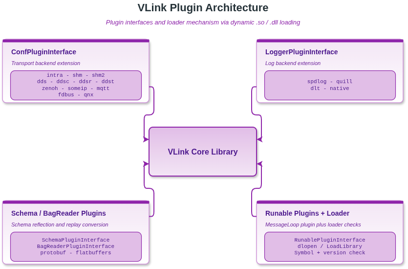

# 19. 扩展开发

本章介绍 VLink 的扩展系统：动态插件接口、schema 反射注册、其他常用扩展组件。

> **相关文档**：代理层插件加载参见 [16-proxy.md](16-proxy.md)；录制时的 Schema 插件集成参见 [12-bag-recording.md](12-bag-recording.md)。

---

## 19.1 扩展与插件一览

`include/vlink/extension/` 目录下的 header，按用途分组：

**录制 / 回放**：`bag_writer.h`、`bag_reader.h`、`bag_reader_processor.h`、
`bag_reader_plugin_interface.h`、`vdb_writer.h`、`vdb_reader.h`、
`vcap_writer.h`、`vcap_reader.h`（录制细节见 [12-bag-recording.md](12-bag-recording.md)）

**QoS 与安全**：`qos.h`、`qos_profile.h`、`security.h`
（细节见 [08-qos.md](08-qos.md)、[09-security.md](09-security.md)）

**状态 / 发现**：`status.h`、`status_detail.h`、`discovery_reporter.h`、`discovery_viewer.h`

**插件接口**：`schema_plugin_interface.h`、`schema_plugin_base.h`、`schema_plugin_manager.h`、
`runnable_plugin_interface.h`、`message_convert_plugin.h`、`bag_reader_plugin_interface.h`

**schema 注册辅助**：`flatbuffers_registry.h`、`protobuf_registry.h`

**其他工具**：`dynamic_data.h`、`terminal_stream.h`、`url_remap.h`

> 说明：`ConfPluginInterface`（传输 Conf 插件）位于 `include/vlink/impl/conf_plugin_interface.h`，
> `LoggerPluginInterface` 位于 `include/vlink/base/logger_plugin_interface.h`，
> `Plugin` 加载器位于 `include/vlink/base/plugin.h`。



### 19.1.1 插件接口全景

| 接口                       | 头文件                                       | 用途                                            |
| -------------------------- | -------------------------------------------- | ----------------------------------------------- |
| `ConfPluginInterface`      | `impl/conf_plugin_interface.h`               | 为自定义 URL scheme 注册 `Conf` 工厂            |
| `LoggerPluginInterface`    | `base/logger_plugin_interface.h`             | 自定义日志后端                                  |
| `SchemaPluginInterface`    | `extension/schema_plugin_interface.h`        | Protobuf/FlatBuffers schema 反射                |
| `RunablePluginInterface`   | `extension/runnable_plugin_interface.h`      | 携带 `MessageLoop` 的可运行组件（注意 `Runable` 只有一个 n） |
| `BagReaderPluginInterface` | `extension/bag_reader_plugin_interface.h`    | 回放时的 URL/类型转换钩子                       |
| `MessageConvertPlugin`     | `extension/message_convert_plugin.h`         | Foxglove / Rerun 消息转换                       |

### 19.1.2 核心宏

| 宏                                         | 用途                                          |
| ------------------------------------------ | --------------------------------------------- |
| `VLINK_PLUGIN_REGISTER(T)`                 | 在接口/实现类内注入插件 ID（自动从类型名派生） |
| `VLINK_PLUGIN_REGISTER_BY_ID(T, ID)`       | 同上，但使用指定字符串字面量作为 ID            |
| `VLINK_PLUGIN_DECLARE(Impl, Major, Minor)` | 在 .cpp 中导出 C 风格的 create/destroy 入口    |
| `VLINK_PLUGIN_EXPORT`                      | 共享库符号可见性修饰符                        |
| `VLINK_REGISTER_FLATBUFFERS(name, BS)`     | 静态注册 BFBS 到全局 `FlatbuffersRegistry`     |
| `VLINK_REGISTER_FLATBUFFERS_NOW(name, BS)` | 立即调用的手动注册版                          |

---

## 19.2 Plugin — 动态插件加载器

头文件：`<vlink/base/plugin.h>`

`Plugin` 是 VLink 插件系统的核心，封装了 `dlopen` / `LoadLibrary`，提供类型安全的动态库加载、版本校验和生命周期管理。

### 19.2.1 主要接口

```cpp
class Plugin final {
public:
    // 加载插件，返回接口的 shared_ptr；失败返回 nullptr
    template <class T>
    std::shared_ptr<T> load(
        const std::string& lib_name,
        uint16_t version_major,
        uint16_t version_minor,
        const std::string& dir_name = "",
        const std::deque<std::string>& search_paths = default_search_path(),
        const std::string& function_name = "vlink_plugin_create"
    );

    // 卸载指定插件
    template <class T>
    bool unload(const std::string& lib_name);

    // 查询是否已加载
    template <class T>
    bool has_loaded(const std::string& lib_name);

    // 卸载所有插件
    void clear();

    // 默认搜索路径：可执行文件目录、系统库目录、当前目录
    static std::deque<std::string> default_search_path();
};
```

### 19.2.2 工作原理

1. `load<T>()` 按 `search_paths` 依次搜索 `lib_name`（自动添加平台前缀/后缀，如 `lib` 前缀和 `.so` 后缀）。
2. 打开共享库后调用 `vlink_plugin_create` 入口点，传入 **插件 ID**（由 `T::get_plugin_id()` 获取）和版本号。
3. 入口点内部调用 `Plugin::process_plugin_internal()` 进行 ID 和版本校验，失败返回 `nullptr`。
4. 返回的指针被包装为 `shared_ptr<T>`，其自定义删除器在引用计数归零时调用 `vlink_plugin_destroy` 并关闭共享库。

### 19.2.3 使用示例

```cpp
vlink::Plugin plugin;
plugin.set_log_level(vlink::Logger::kDebug);

// 加载自定义日志插件
auto logger = plugin.load<vlink::LoggerPluginInterface>("my_logger", 1, 0);
if (logger) {
    logger->init("my_app");
}

// 卸载
plugin.unload<vlink::LoggerPluginInterface>("my_logger");
```

---

## 19.3 RunablePluginInterface — 可运行插件

头文件：`<vlink/extension/runnable_plugin_interface.h>`

`RunablePluginInterface`（注意：类名中 `Runable` 为源码中的实际拼写）继承自 `MessageLoop`，允许插件携带自己的事件循环线程，实现完全自包含的功能组件。

### 19.3.1 接口定义

```cpp
class RunablePluginInterface : public MessageLoop {
public:
    // 由宿主在线程外调用，在此创建订阅者、定时器等资源
    virtual void on_init() = 0;

    // 插件卸载前由宿主调用，在此释放所有资源
    virtual void on_deinit() = 0;
};
```

### 19.3.2 生命周期

`RunablePluginInterface` 的公开契约是：宿主先由宿主线程显式调用 `on_init()`，再启动插件自己的
`MessageLoop`；`on_deinit()` 同样由宿主在线程外显式触发。它们都不是插件 loop 线程里的隐式回调。
`ProxyServer::on_begin()` / `on_end()` 即按此顺序调用每个 runnable 插件。

```
dlopen
  -> create (VLINK_PLUGIN_DECLARE)
    -> on_init()           // 宿主线程调用，初始化订阅/定时器等资源
    -> async_run()         // 启动插件自己的 MessageLoop 线程
      ... 运行中 ...
    -> on_deinit()         // 宿主线程调用，释放资源
    -> quit()              // 通知循环线程退出
    -> wait_for_quit()     // 阻塞等待循环线程结束
  -> destroy
dlclose
```

### 19.3.3 实现示例

```cpp
// my_sensor_plugin.h
#pragma once
#include <vlink/extension/runnable_plugin_interface.h>
#include <vlink/vlink.h>

class MySensorPlugin : public vlink::RunablePluginInterface {
    VLINK_PLUGIN_REGISTER(vlink::RunablePluginInterface)
public:
    void on_init() override {
        sub_ = std::make_unique<vlink::Subscriber<vlink::Bytes>>("dds://sensor/lidar");
        sub_->listen([](const vlink::Bytes& data) {
            VLOG_I("Received lidar data, size=", data.size());
        });
    }

    void on_deinit() override {
        sub_.reset();
    }

private:
    std::unique_ptr<vlink::Subscriber<vlink::Bytes>> sub_;
};

// my_sensor_plugin.cpp
#include "my_sensor_plugin.h"
VLINK_PLUGIN_DECLARE(MySensorPlugin, 1, 0)
```

```cpp
// 宿主加载代码（与 ProxyServer::on_begin() / on_end() 中的调用顺序一致）
vlink::Plugin plugin;
auto instance = plugin.load<vlink::RunablePluginInterface>("my_sensor_plugin", 1, 0);
if (instance) {
    instance->on_init();      // 先在宿主线程初始化订阅等资源
    instance->async_run();    // 再启动插件自己的 MessageLoop 线程

    // ... 应用运行 ...

    instance->on_deinit();    // 先释放资源
    instance->quit();         // 再停止事件循环
    instance->wait_for_quit();
}
```

> 注：`runnable_plugin_interface.h` 顶部的示例先 `async_run()` 再 `on_init()`，仅展示
> "loop 已起来再做依赖回调的初始化"这一可选路径。VLink 自带的 `ProxyServer`、`vlink-proxy`
> 等宿主都采用 `on_init() -> async_run()` 这条主线顺序，建议第三方宿主与之保持一致，避免
> 在 `on_init()` 内调用任何依赖 loop 已 quit 的资源时陷入竞态。

---

## 19.4 SchemaPluginInterface / SchemaPluginBase — Schema 插件

头文件：`<vlink/extension/schema_plugin_interface.h>`，`<vlink/extension/schema_plugin_base.h>`

`SchemaPluginInterface` 为 VLink 的 bag、MCAP、WebViz 和命令行动态解析流水线提供统一 schema 注册能力。接口同时覆盖：

- protobuf 的 `FileDescriptorSet` / `Descriptor` / 动态消息原型
- flatbuffers 的 BFBS / `reflection::Schema` / 运行时 `Parser`

### 19.4.1 接口方法

| 方法                              | 说明                                                   |
| --------------------------------- | ------------------------------------------------------ |
| `get_version_info()`              | 返回插件版本和构建元数据                               |
| `search_protobuf_descriptor(name)` | 按类型名查找 `google::protobuf::Descriptor`            |
| `search_schema(name, schema_type)` | 按 schema family hint 返回 protobuf `FileDescriptorSet` 或 flatbuffers BFBS |
| `get_all_schemas(schema_type)`     | 返回当前缓存/导入的全部 schema，可按 family 过滤       |
| `create_protobuf_message(name)`    | 用 `DynamicMessageFactory` 创建指定类型的消息原型        |
| `search_flatbuffers_schema(name)`   | 返回 BFBS 对应的 `reflection::Schema` 句柄             |
| `create_flatbuffers_parser(name)`   | 创建一个已装载 root type 的 FlatBuffers `Parser`       |

所有方法均通过内部 `mutex` 保证线程安全，查询结果在内部缓存以避免重复查找；
`create_flatbuffers_parser()` 每次成功调用返回独立 parser，生命周期由插件持有。

### 19.4.2 SchemaPluginBase — 内置实现

`SchemaPluginBase` 是 `SchemaPluginInterface` 的标准实现：

- protobuf 侧使用 `google::protobuf::DescriptorPool::generated_pool()` 和 `DynamicMessageFactory`
- flatbuffers 侧通过 `FlatbuffersRegistry` 显式导入已编译进当前库的 BFBS，并缓存 `reflection::Schema` / `Parser` 运行时句柄

`SchemaPluginBase` 的设计边界是：

1. protobuf 行为保持与之前 protobuf-only 运行时实现一致，默认直接查当前插件/库里已经链接好的 generated descriptors
2. flatbuffers 需要你在构建期生成 BFBS 嵌入代码，例如使用 `flatc --bfbs-gen-embed`
3. 如果使用 `vlink_generate_cpp(FBS ...)`，当前会同时生成常规头 `xxx.fbs.hpp` 和 BFBS 嵌入头 `xxx_bfbs.fbs.hpp`
4. `SchemaPluginBase` 本身不读取 `VLINK_PROTO_DIR`、`VLINK_FBS_DIR`，也不负责从 `.proto/.fbs` 路径导入 schema

**启用条件**：protobuf 相关代码由 `__has_include(<google/protobuf/dynamic_message.h>)` 决定
（宏 `VLINK_HAS_SCHEMA_PLUGIN_PROTOBUF`）；flatbuffers 相关代码由 `VLINK_HAS_SCHEMA_PLUGIN_FLATBUFFERS` 控制。
头文件本身无需额外的 `#define` 才能包含。

```cpp
#include <vlink/base/plugin.h>
#include <vlink/extension/schema_plugin_base.h>

// 继承 SchemaPluginBase，覆盖版本信息
class MySchemaPlugin : public vlink::SchemaPluginBase {
public:
    vlink::SchemaPluginInterface::VersionInfo get_version_info() const override {
        return {
            "MySchemaPlugin",       // name
            "1.0.0",                // version
            __DATE__ " " __TIME__,  // timestamp
            "",                     // tag
            ""                      // commit_id
        };
    }
};

VLINK_PLUGIN_DECLARE(MySchemaPlugin, 1, 0)
```

### 19.4.3 注册已编译 schema

典型做法是：protobuf 直接从当前库里已链接的 generated descriptors 查询；flatbuffers 则在类外静态注册已编译进当前库的 BFBS：

```cpp
class MySchemaPlugin : public vlink::SchemaPluginBase {
public:
    vlink::SchemaPluginInterface::VersionInfo get_version_info() const override {
        return {"MySchemaPlugin", "1.0.0", __DATE__ " " __TIME__, "", ""};
    }
};

VLINK_REGISTER_FLATBUFFERS("my.pkg.MyMessage", MyMessageBinarySchema);
```

其中：

- protobuf 不需要额外注册，`search_protobuf_descriptor()` / `search_schema()` 会直接按之前 protobuf-only 运行时逻辑从 `generated_pool()` 按需查找
- `FlatbuffersRegistry::register_schema()` 是静态注册函数，用于把 BFBS 二进制 schema 注册到当前库内的全局静态表
- `VLINK_REGISTER_FLATBUFFERS(...)` 适合在类外直接调用，支持在同一个 `.cc` 里调用多次，供 schema plugin 所在库在加载时完成 BFBS 注册
- `VLINK_REGISTER_FLATBUFFERS_NOW(...)` 会立即返回注册结果，适合你在函数体、初始化代码或自定义注册流程里手动调用
- 如果只需要 BFBS 注册能力，也可以单独包含 `<vlink/extension/flatbuffers_registry.h>`

### 19.4.4 search_schema 的 SchemaData 结构

```cpp
struct SchemaData {
    std::string name;         // 类型完全限定名，如 "my_pkg.MyMessage"
    std::string encoding;     // 具体编码名，如 "protobuf" / "flatbuffers" / "vlink_msg"
    SchemaType schema_type;   // 粗粒度 schema 家族：kProtobuf / kFlatbuffers / kRaw / kZeroCopy / kUnknown
    Bytes data;               // protobuf 为 FileDescriptorSet，flatbuffers 为 BFBS
};
```

---

## 19.5 SchemaPluginManager — 插件管理器

头文件：`<vlink/extension/schema_plugin_manager.h>`

`SchemaPluginManager` 是进程级单例，负责加载和持有唯一的 `SchemaPluginInterface` 实例。

### 19.5.1 插件路径解析顺序

`schema_plugin_path` 可以是插件基础名，也可以是共享库路径。`Plugin::load()` 会在需要时自动补平台前缀/后缀并搜索默认目录。

1. `SchemaPluginManager::get(schema_plugin_path)` 的参数（非空时优先）
2. 环境变量 `VLINK_SCHEMA_PLUGIN`
3. 以上均未设置时，`is_valid()` 返回 `false`，不加载任何插件

### 19.5.2 接口

```cpp
class SchemaPluginManager final {
public:
    // 获取进程级单例，首次调用决定加载路径
    static SchemaPluginManager& get(const std::string& schema_plugin_path = "");

    // 是否成功加载了插件
    bool is_valid() const;

    // 获取接口指针
    std::shared_ptr<SchemaPluginInterface> get_interface() const;
};
```

### 19.5.3 使用示例

```cpp
// 方式 1：通过环境变量 VLINK_SCHEMA_PLUGIN 加载
auto& mgr = vlink::SchemaPluginManager::get();

// 方式 2：显式指定插件名或共享库路径（第一次调用生效，后续调用忽略参数）
auto& mgr = vlink::SchemaPluginManager::get("my_schema_plugin");

if (mgr.is_valid()) {
    auto iface = mgr.get_interface();

    // 获取 Schema（用于 bag 文件嵌入）
    auto schema = iface->search_schema("my_package.MyMessage", SchemaType::kProtobuf);
    if (schema.schema_type == SchemaType::kProtobuf) {
        // schema.data 包含 FileDescriptorSet 二进制数据
    }

    // 动态创建 protobuf 消息实例
    auto* msg_ptr = static_cast<google::protobuf::Message*>(
        iface->create_protobuf_message("my_package.MyMessage")
    );

    // 动态获取 flatbuffers parser
    auto* parser = static_cast<flatbuffers::Parser*>(
        iface->create_flatbuffers_parser("my_package.MyFlatbuffer")
    );
}
```

---

## 19.6 ConfPluginInterface — 传输配置插件

头文件：`<vlink/impl/conf_plugin_interface.h>`

`ConfPluginInterface` 是所有外部传输插件必须实现的接口。每个传输插件导出一个实现该接口的具体类，VLink URL 系统会按已识别的 `TransportType` 动态加载匹配插件。

### 19.6.1 插件发现机制

- 环境变量 `VLINK_URL_PLUGINS` 设置插件基础名列表（分号分隔，不含路径、`lib` 前缀和 `.so` 后缀；`vlink-` 前缀可省略）
- 或调用 `Url::init_plugins()` 显式注册

当 `Url` 构造得到一个已识别的 `TransportType` 时，`Url::load_for_plugin()` 会遍历已加载插件，调用 `get_transport_type()` 进行匹配，匹配成功后再调用 `create()` 获取 `Conf` 实例。若 URL 前缀无法映射到任何内置枚举值，transport 会是 `kUnknown`，当前 `load_for_plugin(kUnknown)` 直接返回 `nullptr`，不会为任意未知字符串动态匹配插件。

### 19.6.2 接口定义

```cpp
struct ConfPluginInterface {
    VLINK_PLUGIN_REGISTER(ConfPluginInterface)

    // 返回本插件支持的 transport 类型
    virtual TransportType get_transport_type() const = 0;

    // 创建并返回新的 Conf 实例（每次 Url 构造时调用一次）
    virtual std::unique_ptr<Conf> create() const = 0;
};
```

### 19.6.3 实现自定义传输插件

```cpp
// my_transport_conf.h
#pragma once
#include <vlink/impl/conf.h>
#include <vlink/impl/conf_plugin_interface.h>

// 1. 定义 Conf 子类
struct MyTransportConf final : public vlink::Conf {
    std::string address;
    int port{8080};

    VLINK_ALLOW_IMPL_TYPE(kPublisher | kSubscriber)
    VLINK_CONF_IMPL(MyTransportConf)

    bool is_valid() const override {
        return !address.empty() && port > 0;
    }
    vlink::TransportType get_transport_type() const override {
        return vlink::TransportType::kMyCustom; // 需在 TransportType 枚举中注册
    }
};

// 2. 定义插件工厂
struct MyTransportPlugin final : public vlink::ConfPluginInterface {
    VLINK_PLUGIN_REGISTER(vlink::ConfPluginInterface)

    vlink::TransportType get_transport_type() const override {
        return vlink::TransportType::kMyCustom;
    }
    std::unique_ptr<vlink::Conf> create() const override {
        return std::make_unique<MyTransportConf>();
    }
};

// 3. 导出入口函数（在 .cpp 中）
VLINK_PLUGIN_DECLARE(MyTransportPlugin, 1, 0)
```

---

## 19.7 LoggerPluginInterface — 日志后端插件

头文件：`<vlink/base/logger_plugin_interface.h>`

通过 `LoggerPluginInterface` 可以将 VLink 日志系统对接到任意第三方日志框架（spdlog、log4cxx、自定义文件滚动日志等）。

### 19.7.1 接口定义

```cpp
class LoggerPluginInterface {
    VLINK_PLUGIN_REGISTER(LoggerPluginInterface)
public:
    // 初始化后端，app_name 可用于标记日志来源
    virtual bool init(std::string_view app_name) = 0;

    // 写入一条日志，level 对应 vlink::Logger::Level 枚举值
    virtual bool log(int level, std::string_view str) = 0;
};
```

### 19.7.2 `level` 对应关系

| 值  | Logger::Level    | 含义     |
| --- | ---------------- | -------- |
| 0   | kTrace           | 追踪     |
| 1   | kDebug           | 调试     |
| 2   | kInfo            | 信息     |
| 3   | kWarn            | 警告     |
| 4   | kError           | 错误     |
| 5   | kFatal           | 致命错误 |

### 19.7.3 对接 spdlog 示例

```cpp
// spdlog_plugin.cpp
#include <vlink/base/logger_plugin_interface.h>
#include <spdlog/spdlog.h>
#include <spdlog/sinks/rotating_file_sink.h>

class SpdlogPlugin : public vlink::LoggerPluginInterface {
    VLINK_PLUGIN_REGISTER(vlink::LoggerPluginInterface)
public:
    bool init(std::string_view app_name) override {
        logger_ = spdlog::rotating_logger_mt(
            std::string(app_name),
            "/var/log/" + std::string(app_name) + ".log",
            1024 * 1024 * 10, 3
        );
        return true;
    }

    bool log(int level, std::string_view str) override {
        if (!logger_) {
            return false;
        }
        switch (level) {
        case 1: logger_->debug(str); break;
        case 2: logger_->info(str); break;
        case 3: logger_->warn(str); break;
        case 4: logger_->error(str); break;
        default: logger_->trace(str); break;
        }
        return true;
    }

private:
    std::shared_ptr<spdlog::logger> logger_;
};

VLINK_PLUGIN_DECLARE(SpdlogPlugin, 1, 0)
```

```cpp
// 宿主加载
vlink::Plugin plugin;
auto backend = plugin.load<vlink::LoggerPluginInterface>("spdlog_plugin", 1, 0);
if (backend) {
    backend->init("my_app");
    // 将 backend 注册到 Logger（具体 API 参见 logger.h）
}
```

---

## 19.8 MessageConvertPlugin — Foxglove / Rerun 消息转换

头文件：`<vlink/extension/message_convert_plugin.h>`

`MessageConvertPlugin` 供 `vlink-foxglove` 与 `vlink-rerun` 桥接器使用，把 VLink 的序列化
字节流转换为目标可视化后端能理解的格式。接口不依赖任何第三方库（protobuf、flatbuffers、Rerun SDK、
JSON 库都不需要），便于外部工程独立实现。

### 19.8.1 目标后端

```cpp
enum class ConvertTarget : uint8_t {
    kFoxglove = 0,  // Foxglove Studio：FlatBuffers/Protobuf 二进制
    kRerun    = 1,  // Rerun Viewer：UTF-8 JSON 字符串
};
```

| 目标       | payload 格式                          | `type_name` 含义       |
| ---------- | ------------------------------------- | ---------------------- |
| `kFoxglove` | FlatBuffer / Protobuf 二进制          | Foxglove schema 名     |
| `kRerun`    | UTF-8 JSON（描述 Rerun archetype 组件）| Rerun archetype 名     |

### 19.8.2 核心虚函数

| 方法                                                                 | 用途                                           |
| -------------------------------------------------------------------- | ---------------------------------------------- |
| `init(config)`                                                       | 插件加载后调用，返回 `false` 则卸载插件        |
| `can_convert(vlink_ser, target)`                                     | 告知是否处理某 VLink 序列化类型 + 目标         |
| `get_schema_info(vlink_ser, target, type_name, encoding, schema_encoding, schema_data)` | 注册通道时返回 schema 元数据    |
| `convert(vlink_ser, raw, target, payload)`                           | 每条消息调用一次，把 `raw` 转换为目标格式      |
| `extract_timestamp(vlink_ser, raw, target)`（默认实现返回 -1，表示不可用） | 可选：从消息提取时间戳（纳秒）            |
| `can_convert_frontend` / `get_publish_info` / `convert_frontend`      | 可选：支持从浏览器 publish 到 VLink 反向通道    |

### 19.8.3 Rerun JSON payload 约定示例

```json
// Points3D
{ "positions": [[1.0,2.0,3.0]], "colors": [[255,0,0,255]], "radii": [0.1] }

// EncodedImage（二进制数据需 base64 编码）
{ "media_type": "image/jpeg", "data_base64": "<base64>" }

// TextLog
{ "text": "hello", "level": "INFO" }
```

### 19.8.4 与 JSON 映射文件的关系

当同时存在 JSON 映射配置与此插件时，先尝试插件；若 `can_convert` 返回 `false`，则回退到
JSON 映射管道。因此插件只需覆盖需要自定义逻辑的类型。

### 19.8.5 线程安全

`convert()` 可能被 ProxyAPI 的多个数据回调线程并发调用，实现必须自行保证线程安全。

---

## 19.9 BagReaderPluginInterface — 回放转换插件

头文件：`<vlink/extension/bag_reader_plugin_interface.h>`

通过 `BagReader::bind_plugin_interface(plugin)` 注入，用于在回放时做 URL/ser_type 转换
或消息过滤。

### 19.9.1 核心方法

```cpp
class BagReaderPluginInterface {
public:
    // 插件版本/构建元数据（与 SchemaPluginInterface 一致）
    virtual VersionInfo get_version_info() const = 0;

    // URL 级钩子：可修改 url/ser_type/schema_type；返回 false 表示排除该 URL
    virtual bool convert_url_meta(std::string& url,
                                  std::string& ser_type,
                                  SchemaType& schema_type) = 0;

    // 消息级钩子：处理完后需调用 output_callback_() 继续转发；可丢弃或延迟
    virtual void push(int64_t timestamp, const std::string& url,
                      ActionType action_type, const Bytes& data) = 0;

    // BagReader 注入的输出回调（protected 成员 output_callback_）
    void register_output_callback(OutputCallback&& output_callback);
};
```

`BagReader` 在 `bind_plugin_interface()` 中自动 `register_output_callback()` 注入
其内部 pipeline；插件的 `push()` 必须显式调用 `output_callback_()` 才会把消息发到
最终 `OutputCallback`。

---

## 19.10 FlatbuffersRegistry / ProtobufRegistry — schema 注册

### 19.10.1 `protobuf_registry.h`

纯包装头，只做两件事：

- `#if __has_include(<google/protobuf/dynamic_message.h>)` 条件 include protobuf 运行时头
- 条件定义宏 `VLINK_HAS_SCHEMA_PLUGIN_PROTOBUF`

Protobuf 不需要独立的运行时注册 API：generated messages 通过
`google::protobuf::DescriptorPool::generated_pool()` 已经可查；`SchemaPluginBase` 直接从
该 pool 按类型名查找。

### 19.10.2 `flatbuffers_registry.h`

FlatBuffers 没有等价的全局 pool，需要显式注册 BFBS 到进程级单例 `FlatbuffersRegistry`：

```cpp
class FlatbuffersRegistry final {
public:
    // 模板版：从 flatc 生成的 *BinarySchema 辅助类型读取
    template <typename BinarySchema>
    static bool register_schema(const std::string& name);

    // 裸字节版
    static bool register_schema(const std::string& name,
                                const uint8_t* bfbs_data, size_t bfbs_size);

    SchemaData search_schema(const std::string& name);
    std::vector<SchemaData> get_all_schemas();
};
```

两个宏简化静态注册：

| 宏                                          | 语义                                                     |
| ------------------------------------------- | -------------------------------------------------------- |
| `VLINK_REGISTER_FLATBUFFERS(name, BS)`      | 展开为翻译单元内的静态对象，加载期调用 `register_schema()` |
| `VLINK_REGISTER_FLATBUFFERS_NOW(name, BS)`  | 立即求值版，返回 `bool`，适合手动调用                     |

> `VLINK_REGISTER_FLATBUFFERS_NOW` 需要 BFBS 二进制 schema 头已经 include；若只想使用
> 注册能力，可单独 `#include <vlink/extension/flatbuffers_registry.h>`。

---

## 19.11 DiscoveryReporter — 节点发现上报

头文件：`<vlink/extension/discovery_reporter.h>`

`DiscoveryReporter` 继承自 `MessageLoop`，由 `NodeImpl` 的构造/析构自动调用，维护当前
进程中活跃节点列表并广播上线/下线通知。应用代码一般**不需要**直接使用它；
`vlink-list` 和 `DiscoveryViewer` 接收其广播。

主要 API：

```cpp
class DiscoveryReporter : public MessageLoop {
public:
    void add(NodeImpl* node_impl);     // NodeImpl 构造时自动调用
    void remove(NodeImpl* node_impl);  // NodeImpl 析构时自动调用
};
```

相关环境变量：
- `VLINK_DISCOVER_DISABLE`：`=1` 完全禁用 Reporter（不再上报）
- `VLINK_DISCOVER_NATIVE`：`=1` 将 Reporter 组播接口绑定到 `127.0.0.1`，仅本机可收到

---

## 19.12 DynamicData — 动态类型数据

头文件：`<vlink/extension/dynamic_data.h>`

`DynamicData` 是类型擦除的数据容器，将任意 VLink 兼容消息类型连同类型名标签一起序列化到内部 `Bytes` 缓冲区，从而可以在不知道编译时类型的通道中传输，之后再反序列化回具体类型。

### 19.12.1 内部布局

```
[ 类型名字段 (20 字节固定) | 序列化载荷 ]
  ^-- kOffset = 20         ^-- 实际消息数据
```

类型名字段最大 19 个字符（含 NUL 终止符）。

### 19.12.2 限制

- 不能序列化/反序列化另一个 `DynamicData` 对象（编译期 `static_assert`）
- 不能序列化 CDR 类型（编译期 `static_assert`）
- 类型名字符串长度必须小于 20 个字符（含 NUL）

### 19.12.3 主要接口

```cpp
class DynamicData final {
public:
    // 序列化：存入类型名和消息
    template <uint8_t SizeT, typename T>
    DynamicData& load(const char (&type)[SizeT], const T& t);

    // 反序列化：填充 t，返回 bool
    template <typename T>
    bool convert(T& t) const;

    // 反序列化：按值返回 T
    template <typename T>
    T as() const;

    // 获取类型名（string_view，指向内部缓冲区）
    const std::string_view& get_type() const;

    // 获取原始字节
    const Bytes& get_data() const;

    bool is_empty() const;

    // 二进制传输（wire 格式序列化/反序列化）
    bool operator<<(const Bytes& bytes) noexcept;
    bool operator>>(Bytes& bytes) const noexcept;
};
```

### 19.12.4 使用示例

```cpp
#include <vlink/extension/dynamic_data.h>
#include <vlink/vlink.h>

// 发布端：将不同类型的消息包装为 DynamicData 统一发布
vlink::Publisher<vlink::DynamicData> pub("dds://dynamic/event");

MyProtoMsg msg;
msg.set_value(42);

pub.publish(vlink::DynamicData().load("MyProtoMsg", msg));

// 订阅端：根据类型名分发
vlink::Subscriber<vlink::DynamicData> sub("dds://dynamic/event");
sub.listen([](const vlink::DynamicData& dd) {
    if (dd.get_type() == "MyProtoMsg") {
        auto msg = dd.as<MyProtoMsg>();
        // 处理消息
    }
});

// 二进制传输（例如写入文件）
vlink::Bytes wire;
vlink::DynamicData dd;
dd.load("SomeType", some_msg);
dd >> wire;   // 序列化为 wire 格式

vlink::DynamicData dd2;
dd2 << wire;  // 从 wire 格式恢复
```

---

## 19.13 TerminalStream — 终端流输出

头文件：`<vlink/extension/terminal_stream.h>`

`TerminalStream` 是进程级单例的带缓冲 stdout 输出流，专为 CLI 工具设计，绕过 `std::cout` 和标准 stdio 的开销。

### 19.13.1 特性

- **缓冲输出**：默认 1 MiB 内部缓冲区，批量 `write()` 减少系统调用
- **线程安全**：所有操作受 `std::mutex` 保护
- **几乎无异常**：除 `flush()` 外所有 public 方法标记为 `noexcept`（`flush()` 直接调用 OS 写入，错误以返回路径处理而非 `noexcept`）
- **TTY 检测**：`is_tty()` 判断 stdout 是否连接到终端，可按需启用 ANSI 颜色
- **跨平台**：Windows 10+ 上启用虚拟终端处理（ANSI 转义码支持）

### 19.13.2 便捷宏

```cpp
#define VLINK_TERM_OUT vlink::TerminalStream::get()
```

### 19.13.3 使用示例

```cpp
#include <vlink/extension/terminal_stream.h>

// 初始化（检测 TTY，启用 ANSI）
vlink::TerminalStream::get().init();

// 基本输出
VLINK_TERM_OUT << "count=" << 42 << vlink::TerminalStream::endl;
VLINK_TERM_OUT << "pi=" << 3.14159 << "\n";
VLINK_TERM_OUT << "flag=" << true << vlink::TerminalStream::endl;

// 手动刷新
VLINK_TERM_OUT << vlink::TerminalStream::flush_manip;

// ANSI 颜色（仅 TTY 模式下使用，避免日志文件含转义码）
if (vlink::TerminalStream::get().is_tty()) {
    VLINK_TERM_OUT << "\033[32m" << "OK" << "\033[0m" << vlink::TerminalStream::endl;
}

// 兼容 std::endl
VLINK_TERM_OUT << "hello" << std::endl;
```

---

## 19.14 UrlRemap — URL 重映射

头文件：`<vlink/extension/url_remap.h>`

`UrlRemap` 从 JSON 配置文件加载 URL 重映射规则，在运行时将 VLink topic 地址动态替换，无需重新编译即可切换传输后端或修改 topic 名称。

### 19.14.1 JSON 配置格式

```json
{
    "intra://sensor/lidar":  "dds://vehicle/lidar",
    "shm://camera/front":    "dds://camera/front",
    "dds://old/topic":       "ddsc://new/topic"
}
```

规则为平坦 JSON 对象，key 是原 URL（或其子串），value 是目标 URL。

### 19.14.2 匹配算法

`convert()` 依次检查 remap 列表中每条规则，选取第一条**key 是输入 URL 子串**的规则，返回对应 value。查询结果缓存在内部 `unordered_map` 中，重复查询为 O(1)。

### 19.14.3 主要接口

```cpp
class UrlRemap {
public:
    // 加载 JSON 文件，已加载时返回 false（需先 unload）
    bool load(const std::string& file_path) noexcept;

    // 卸载并清空规则表和缓存
    bool unload() noexcept;

    // 等价于 unload() + load()
    bool reload(const std::string& file_path) noexcept;

    // 转换 URL，无匹配规则时返回原 URL
    const std::string& convert(const std::string& url) noexcept;

    // 是否已成功加载
    bool is_valid() const noexcept;

    // 开启/关闭每次转换的 INFO 日志
    void set_enable_log(bool enable_log) noexcept;

    // 获取加载失败的错误描述
    const std::string& get_error_string() const noexcept;
};
```

### 19.14.4 使用示例

```cpp
#include <vlink/extension/url_remap.h>

vlink::UrlRemap remap;
remap.set_enable_log(true);   // 开启转换日志

if (!remap.load("/etc/vlink/remap.json")) {
    VLOG_E("Failed to load remap: ", remap.get_error_string());
    return;
}

// 使用时
std::string url = remap.convert("intra://sensor/lidar");
// url == "dds://vehicle/lidar"（若规则匹配）

// 热更新配置
remap.reload("/etc/vlink/remap_v2.json");
```

### 19.14.5 注意事项

- `UrlRemap` **不是线程安全的**，`load/unload/reload/convert` 应在同一线程调用，或由调用方加锁。
- `convert()` 在 `is_valid()` 为 `false` 时直接返回原 URL，不会崩溃。
- 匹配为**子串匹配**，规则顺序影响结果，JSON 对象顺序由解析器保证（建议使用有序容器）。

---

## 19.15 自定义插件实现指南

### 19.15.1 步骤总览

```
1. 定义接口类（使用 VLINK_PLUGIN_REGISTER）
2. 实现具体类（继承接口，实现所有纯虚函数）
3. 导出入口函数（VLINK_PLUGIN_DECLARE）
4. 编译为共享库（CMake ADD_LIBRARY(... SHARED ...)）
5. 宿主加载（Plugin::load<接口>）
```

### 19.15.2 完整示例：自定义监控插件

**接口头文件** `monitor_plugin.h`：

```cpp
#pragma once
#include <vlink/base/plugin.h>
#include <string>

// 1. 定义插件接口
class MonitorPluginInterface {
    VLINK_PLUGIN_REGISTER(MonitorPluginInterface)
public:
    virtual ~MonitorPluginInterface() = default;

    virtual bool init(const std::string& config_path) = 0;
    virtual void report(const std::string& metric, double value) = 0;
    virtual void shutdown() = 0;
};
```

**实现文件** `prometheus_monitor.cpp`：

```cpp
#include "monitor_plugin.h"
// 假设链接了 prometheus-cpp 库
#include <prometheus/counter.h>

class PrometheusMonitor : public MonitorPluginInterface {
    VLINK_PLUGIN_REGISTER(MonitorPluginInterface)
public:
    bool init(const std::string& config_path) override {
        // 初始化 Prometheus 导出器
        return true;
    }

    void report(const std::string& metric, double value) override {
        // 上报指标
    }

    void shutdown() override {
        // 清理资源
    }
};

// 2. 导出 C 入口函数（版本 1.0）
VLINK_PLUGIN_DECLARE(PrometheusMonitor, 1, 0)
```

**CMakeLists.txt**：

```cmake
add_library(prometheus_monitor SHARED prometheus_monitor.cpp)
target_link_libraries(prometheus_monitor
    vlink::vlink
    prometheus-cpp::core
)
```

**宿主加载代码**：

```cpp
vlink::Plugin plugin;
auto monitor = plugin.load<MonitorPluginInterface>("prometheus_monitor", 1, 0);
if (!monitor) {
    VLOG_E("Failed to load monitor plugin.");
    return;
}

monitor->init("/etc/monitor.json");
monitor->report("cpu_usage", 0.35);
monitor->shutdown();
// shared_ptr 析构时自动调用 vlink_plugin_destroy 并卸载库
```

---

## 19.16 插件加载机制详解

### 19.16.1 共享库搜索路径（`default_search_path()`）

`Plugin::default_search_path()` 按以下顺序返回搜索路径队列（源码
`src/base/plugin.cc` 中 `Plugin::default_search_path()` 实现）：

1. `VLINK_PLUGIN_DIR` 环境变量指定的目录（若非空，插入队首）
2. 当前工作目录
3. 可执行文件所在目录（`Utils::get_app_dir()`）
4. 可执行文件所在目录的 `../lib64`、`../lib`、`./lib64`、`./lib`
5. 系统目录 `/lib64`、`/lib`

可通过 `Plugin::load()` 的 `dir_name` 参数或 `search_paths` 参数覆盖默认值。

### 19.16.2 平台文件名规则

| 平台    | 前缀  | 后缀    | 示例                       |
| ------- | ----- | ------- | -------------------------- |
| Linux   | `lib` | `.so`   | `libmy_plugin.so`          |
| macOS   | `lib` | `.dylib`| `libmy_plugin.dylib`       |
| Windows | 无    | `.dll`  | `my_plugin.dll`            |

### 19.16.3 插件 ID 验证

每个接口类型通过 `VLINK_PLUGIN_REGISTER(InterfaceType)` 注入 `get_plugin_id()` 静态方法，该方法使用 `NameDetector::get<T>()` 从编译器的 `__PRETTY_FUNCTION__` 提取去修饰的类型名。

加载时，`Plugin::process_plugin_internal()` 将加载方期望的 ID 与共享库内导出的 ID 进行字符串比对，ID 不匹配或版本不兼容时返回 `nullptr`，防止 ABI 错配导致的崩溃。

### 19.16.4 版本兼容性规则

`VLINK_PLUGIN_DECLARE(ImplType, Major, Minor)` 中的版本号需要满足兼容性规则：`Major` 必须与 `Plugin::load<T>(lib_name, major, minor)` 调用方指定的 major 一致，插件声明的 `Minor` 必须大于等于调用方要求的 minor；否则加载失败并记录错误日志。版本检验在 `process_plugin_internal()` 内完成，此函数在共享库内部执行，不跨越库边界传递异常。
