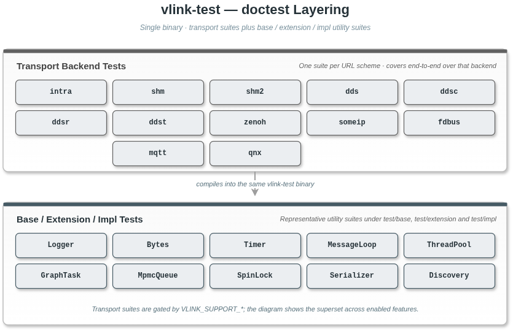

# 20. 测试与覆盖率

本文档介绍 VLink 的单元测试体系与代码覆盖率实践。

> **相关文档**：构建系统 [01-build.md](01-build.md)；基础库 [11-base-library.md](11-base-library.md)；传输后端 [07-transport.md](07-transport.md)。

---

## 20.1 测试框架：doctest

VLink 单元测试采用 [doctest](https://github.com/doctest/doctest)——头文件形式的 C++ 测试框架，与 Catch2 语法接近。

- 头文件形式（`thirdparty::doctest`），无需额外链接动态库
- 支持 `TEST_CASE`、`SUBCASE`、`CHECK`、`REQUIRE`、`CHECK_THROWS_AS` 等断言宏
- 支持按用例名过滤（`--test-case=`、`-tce=`）

### 20.1.1 基本用法

```cpp
#include <doctest/doctest.h>

TEST_CASE("module-feature") {
    int x = 1 + 1;
    CHECK(x == 2);
    REQUIRE(x > 0);  // REQUIRE 失败会中止当前 TEST_CASE
}

TEST_CASE("module-subcase") {
    int value = 0;

    SUBCASE("increment") {
        value += 1;
        CHECK(value == 1);
    }

    SUBCASE("decrement") {
        value -= 1;
        CHECK(value == -1);
    }
}
```

### 20.1.2 常用断言宏

本项目实际使用的 doctest 断言宏如下：

| 宏                        | 含义                                |
| ------------------------- | ----------------------------------- |
| `CHECK(expr)`             | 检查表达式为真，失败继续执行        |
| `REQUIRE(expr)`           | 检查表达式为真，失败中止当前用例    |
| `CHECK_FALSE(expr)`       | 检查表达式为假                      |
| `CHECK_THROWS_AS(e, T)`   | 检查表达式抛出类型 T 的异常         |
| `CHECK_NOTHROW(expr)`     | 检查表达式不抛出异常                |
| `SUBCASE("name")`         | 在同一 TEST_CASE 中定义独立子场景   |

> doctest 还提供 `CHECK_EQ` / `CHECK_NE` / `CHECK_LT` / `CHECK_GE` 等等价/比较形式的断言宏，当前本项目测试代码中并未直接使用，统一以 `CHECK(a == b)` 等形式书写；如有需要可参见 doctest 官方文档。

### 20.1.3 测试入口

`test/main.cc` 当前使用自定义 `main()` 包装 `doctest::Context`：

```cpp
#define DOCTEST_CONFIG_IMPLEMENT
#include <doctest/doctest.h>

int main(int argc, char** argv) {
    doctest::Context ctx;
    ctx.setOption("no-introductory-string", true);
    ctx.setOption("exit", true);
    ctx.applyCommandLine(argc, argv);
    return ctx.run();
}
```

这样可以在保留 doctest 入口的同时统一设置默认运行选项。其余测试文件只需包含 `<doctest/doctest.h>`，无需再定义 `main()`。

---

## 20.2 测试目录结构

```
test/
├── main.cc                  # 自定义 doctest 入口
├── CMakeLists.txt           # 测试构建配置
├── common_test.h            # 公共头文件（vlink 全量 include + 常用类型）
├── idl/                     # IDL 定义文件（.proto / .fbs / .idl）
├── base/                    # base 库测试（logger/bytes/timer/message_loop/thread_pool/spin_lock/mpmc_queue/graph_task/memory_pool/memory_resource/functional/coroutine/cancellation/task_handle/condition_variable/format/object_pool/uuid/... ）
├── extension/               # bag / discovery / qos / schema / security / dynamic_data / status / terminal_stream / url_remap 等扩展测试
├── impl/                    # NodeImpl / Url / Ssl / AckManager / *Impl 等实现层测试
├── modules/                 # 各 transport Conf 解析测试（dds/ddsc/ddsr/ddst/intra/shm/shm2/zenoh/someip/mqtt/fdbus/qnx）
├── zerocopy/                # CameraFrame / PointCloud / ProxyData / Header / RawData 等测试
├── serializer_test.cc       # Serializer 单元测试
├── intra_test.cc            # intra:// 传输后端
├── shm_test.cc              # shm:// 传输后端（iceoryx）
├── shm2_test.cc             # shm2:// 传输后端（iceoryx2）
├── dds_test.cc              # dds:// 传输后端（FastDDS）
├── ddsc_test.cc             # ddsc:// 传输后端（CycloneDDS）
├── ddsr_test.cc             # ddsr:// 传输后端
├── ddst_test.cc             # ddst:// 传输后端
├── zenoh_test.cc            # zenoh:// 传输后端
├── someip_test.cc           # someip:// 传输后端
├── mqtt_test.cc             # mqtt:// 传输后端
├── fdbus_test.cc            # fdbus:// 传输后端
└── qnx_test.cc              # qnx:// 传输后端（QNX 平台）
```

### 20.2.1 测试分层



---

## 20.3 编译与运行测试

CMake 构建详情见 [01-build.md](01-build.md)。本节仅覆盖与测试相关的部分。

### 20.3.1 `test/CMakeLists.txt` 事实

- 目标：`vlink-test`（doctest 可执行文件）
- 链接：`vlink::vlink` + `vlink::all`（所有已启用的传输模块）+ `thirdparty::doctest`
- CTest 只注册一个测试：`add_test(NAME vlink-test COMMAND vlink-test)`
- 条件宏：
  - `VLINK_TEST_SUPPORT_SECURITY`——顶层 `ENABLE_SECURITY` 开启
  - `VLINK_TEST_SUPPORT_PROTOBUF`——`find_package(Protobuf)` 成功
  - `VLINK_TEST_SUPPORT_FLATBUFFERS`——`find_package(Flatbuffers)` 成功
  - `VLINK_TEST_SUPPORT_FASTDDS_GEN`——`test/CMakeLists.txt` 内置开关 `ENABLE_FASTDDS_GEN_TEST` 启用且找到 `fastddsgen`；当前硬编码 `OFF`（不通过顶层 `option()` 暴露），如需启用请就地编辑 `test/CMakeLists.txt`
- 运行时 `LD_LIBRARY_PATH`（Linux）/ `DYLD_LIBRARY_PATH`（macOS）指向 `CMAKE_LIBRARY_OUTPUT_DIRECTORY`

### 20.3.2 编译选项与开关

控制 `vlink-test` 行为的主要顶层选项：

| CMake 选项                | 默认 | 对测试的影响                             |
| ------------------------- | ---- | ---------------------------------------- |
| `ENABLE_TEST`             | `OFF` | 控制是否添加 `test/` 子目录             |
| `ENABLE_SECURITY`         | `ON` | 激活 Security 相关断言和 `SecurityPublisher/Subscriber` 用例 |
| `ENABLE_C_API`            | `ON` | 不影响 `vlink-test`；C API 用例在独立可执行 `vlink-c-test` |
| `ENABLE_PROXY`            | `ON` | 不影响 `vlink-test`；proxy 相关测试在 `vlink-test` 内的 extension 目录下由运行时条件控制 |
| `ENABLE_SQLITE`           | `ON` | 决定 bag 测试中 `.vdb` 路径可用性        |
| `ENABLE_ZSTD`             | `ON` | 决定 bag 测试中 Zstd 分支                |
| `ENABLE_TEST_WARN`        | `OFF`| 开启后对核心库目标追加严格警告标志（GCC/Clang：`-Wall -Wpedantic -Wextra -Werror`；MSVC：`/W4 /WX`） |
| `ENABLE_TEST_SANITIZE`    | `OFF`| 对核心库目标追加 `-fsanitize=address`；MSVC/QNX 不支持 |
| `ENABLE_TEST_COVERAGE`    | `OFF`| 通过 `gcovr` 或 `lcov` 采集覆盖率（见 20.12） |

> `ENABLE_TEST_WARN/SANITIZE/COVERAGE` 实际作用的函数是 `cmake/functions/common.cmake` 中的 `vlink_test_warn / vlink_test_sanitize / vlink_test_coverage`，它们作用在核心库 `vlink` 目标上。

### 20.3.3 编译并运行

```bash
# 配置（启用所有常用功能）
cmake -B build -DCMAKE_BUILD_TYPE=Release \
      -DENABLE_SECURITY=ON \
      -DENABLE_C_API=ON \
      -DENABLE_TEST=ON

# 编译测试目标
cmake --build build --target vlink-test -j$(nproc)

# 运行全部测试
ctest --test-dir build --output-on-failure
```

> **注意**：`test/CMakeLists.txt` 中只通过 `add_test(NAME vlink-test ...)` 注册了
> 一个 CTest 用例，即主 doctest 可执行文件 `vlink-test`。`c_api/test/` 下的
> `vlink-c-test` 和 `python_api/test_vlink.py` / `test_vlink_full.py` 均为独立
> 测试，不会被 `ctest` 自动调度；它们需要单独编译和运行。

#### 20.3.3.1 使用 AddressSanitizer 运行

```bash
# 配置 ASAN 构建
cmake -B build -DCMAKE_BUILD_TYPE=Debug \
      -DENABLE_TEST_SANITIZE=ON

cmake --build build --target vlink-test -j$(nproc)

# 运行时需设置 LD_LIBRARY_PATH 指向构建输出的 lib 目录
LD_LIBRARY_PATH=build/output/lib ./build/output/bin/vlink-test

# SOMEIP 测试在无 vsomeip daemon 时会挂起，需排除整个 suite
LD_LIBRARY_PATH=build/output/lib ./build/output/bin/vlink-test -tse="someip-*"

# 如有 ASAN 抑制文件，可通过以下方式指定
# export ASAN_OPTIONS=suppressions=path/to/asan_suppressions.txt
```

> **注意**：`-tse` 是 doctest 的 test suite exclude 标志，`-tce` 是 test case exclude 标志（都不是 `-e`，后者为 exit 标志）。

### 20.3.4 doctest 命令行参数

VLink 测试同时使用 `TEST_SUITE` 与 `TEST_CASE` 两层标签：传输后端相关测试以 `TEST_SUITE("<transport>-<aspect>")` 分组，base 目录下的测试也按 suite 包裹。
按模块/后端筛选时优先使用 `--test-suite=` / `-ts=`，按具体用例名筛选用 `--test-case=` / `-tc=`。

```bash
# 只运行 dds 后端的全部 suite
./build/output/bin/vlink-test --test-suite="dds-*"

# 只运行 dds-event suite 内的所有 case
./build/output/bin/vlink-test --test-suite="dds-event"

# 按 case 名筛选（base 目录下的 case 是英文短句）
./build/output/bin/vlink-test --test-case="*SpinLock*"

# 排除指定 suite（-tse = test suite exclude）
./build/output/bin/vlink-test -tse="someip-*"

# 排除指定 case（-tce = test case exclude）
./build/output/bin/vlink-test -tce="*Logger*"

# 同时排除多个 suite
./build/output/bin/vlink-test -tse="someip-*" -tse="shm-*"

# 列出所有测试用例 / suite（不运行）
./build/output/bin/vlink-test --list-test-cases
./build/output/bin/vlink-test --list-test-suites

# 输出更详细的信息
./build/output/bin/vlink-test --success

# 静默模式（仅打印失败）
./build/output/bin/vlink-test --minimal
```

> **注意**：`-tce` 排除 test case，`-tse` 排除 test suite。两者都不要与 `-e` 标志混淆——`-e` 是 exit 标志，不是排除。

### 20.3.5 通过 ctest 运行

```bash
cd build

# 运行所有测试
ctest

# 并行运行（4 个进程）
ctest -j4

# 显示详细输出
ctest --verbose

# 只运行名称匹配的测试
ctest -R "vlink-test"

# 失败时打印输出
ctest --output-on-failure
```

---

## 20.4 各测试文件/模块说明

### 20.4.1 Base 库测试

> 实际测试在源文件里以 `TEST_SUITE("xxx") { TEST_CASE("descriptive name") { ... } }` 双层结构组织：
> 顶层 suite 名形如 `dds-init` / `intra-event`（kebab-case 模块标签），
> 内部 case 名是英文短句（如 `"conf-defaults"`、`"url-parse-success"`、`"concurrent increments with SpinLock produce correct total"`）。
> 下表的 “Suite 标签” 列对应可被 `--test-suite=` 过滤匹配的字符串；
> base 目录下的多数测试文件未使用 `TEST_SUITE` 包裹，只能按文件名 / case 名定位。

| 测试文件                          | Suite / Case 标签风格                     | 测试内容                                        |
| --------------------------------- | ----------------------------------------- | ----------------------------------------------- |
| `base/logger_test.cc`             | 多个 case 名（句子风格）                   | 日志级别、格式化输出、handler 回调、backtrace    |
| `base/logger_plugin_interface_test.cc` | 多个 case 名                          | 日志后端插件接口（SPI）契约与桩验证               |
| `base/bytes_test.cc`              | 多个 case 名                               | 空 Bytes、浅拷贝/深拷贝、移动语义、用户输入解析  |
| `base/timer_test.cc`              | 多个 case 名                               | 定时触发、循环次数、restart、call_once            |
| `base/wheel_timer_test.cc`        | 多个 case 名                               | 定时触发、重复定时、暂停/恢复、删除定时器         |
| `base/elapsed_timer_test.cc`      | 多个 case 名                               | 计时启动、restart、get 精度                       |
| `base/deadline_timer_test.cc`     | 多个 case 名                               | 截止时间检测                                     |
| `base/message_loop_test.cc`       | 多个 case 名                               | 优先级任务队列、async_run、wait_for_quit          |
| `base/thread_pool_test.cc`        | 多个 case 名                               | 任务提交、shutdown、任务计数                      |
| `base/multi_loop_test.cc`         | 多个 case 名                               | 多事件循环并发调度                                |
| `base/graph_task_test.cc`         | 多个 case 名                               | DAG 任务图构建、条件节点、执行顺序                |
| `base/mpmc_queue_test.cc`         | 多个 case 名                               | 空队列、push/pop、满队列、多线程生产消费           |
| `base/spin_lock_test.cc`          | 多个 case 名                               | 单线程加锁/解锁、多线程互斥、压力测试             |
| `base/semaphore_test.cc`          | 多个 case 名                               | 信号量 wait/post、超时                           |
| `base/sys_semaphore_test.cc`      | 多个 case 名                               | 系统级信号量操作                                 |
| `base/sys_sharemem_test.cc`       | 多个 case 名                               | 共享内存创建/读写/释放                           |
| `base/process_test.cc`            | 多个 case 名                               | 进程信息查询                                     |
| `base/utils_test.cc`              | 多个 case 名                               | 工具函数（路径、字符串等）                       |
| `base/cached_timestamp_test.cc`   | 多个 case 名                               | 缓存时间戳性能优化                               |
| `base/condition_variable_test.cc` | 多个 case 名                               | 条件变量封装                                     |
| `base/cpu_profiler_test.cc`       | 多个 case 名                               | CPU 性能分析器                                   |
| `base/cpu_profiler_guard_test.cc` | 多个 case 名                               | CPU Profiler RAII 守卫                          |
| `base/exception_test.cc`          | 多个 case 名                               | 异常处理工具                                     |
| `base/fast_stream_test.cc`        | 多个 case 名                               | 高性能流式输出                                   |
| `base/format_test.cc`             | 多个 case 名                               | 字符串格式化工具                                 |
| `base/functional_test.cc`         | 多个 case 名                               | `vlink::Function` / `MoveFunction` 行为         |
| `base/helpers_test.cc`            | 多个 case 名                               | 辅助工具函数（类型转换等）                       |
| `base/macros_test.cc`             | 多个 case 名                               | 宏定义测试                                       |
| `base/memory_pool_test.cc`        | 多个 case 名                               | 内存池行为                                       |
| `base/memory_resource_test.cc`    | 多个 case 名                               | `pmr::memory_resource` 适配                      |
| `base/cancellation_test.cc`       | 多个 case 名                               | `CancellationSource` / `Token` / `Registration` 协作取消语义 |
| `base/task_handle_test.cc`        | 多个 case 名                               | `post_task_handle` / `TaskExecutionState` 状态机 |
| `base/coroutine_test.cc`          | 多个 case 名                               | `Task<T>` / `co_spawn` / `schedule` / `yield` / `delay_ms` / `await_future` / `await_graph` / `when_all`/`when_any`/`sequence`（需 `ENABLE_CXX_STD_20=ON`） |
| `base/name_detector_test.cc`      | 多个 case 名                               | 编译期类型名提取                                 |
| `base/object_pool_test.cc`        | 多个 case 名                               | 对象池（预分配复用）                             |
| `base/plugin_test.cc`             | 多个 case 名                               | 动态插件加载器                                   |
| `base/schedule_test.cc`           | 多个 case 名                               | 调度器                                           |
| `base/traits_test.cc`             | 多个 case 名                               | 类型特征检测工具                                 |
| `base/uint128_test.cc`            | 多个 case 名                               | 128 位无符号整数                                 |
| `base/uuid_test.cc`               | 多个 case 名                               | `Uuid` 生成、比较、字符串互转                    |

### 20.4.2 传输后端测试

每个 transport test 文件用顶层 `TEST_SUITE("<transport>-<aspect>")` 组织子测试，
常见 aspect：`init`、`method`、`event`、`field`、`dynamic`、`identity`、`latency`。
具体哪些 aspect 存在因后端而异，序列化相关测试已统一移到独立的 `serializer_test.cc`。

| 测试文件          | 前置宏                  | 实际包含的 TEST_SUITE                                                                                  |
| ----------------- | ----------------------- | ------------------------------------------------------------------------------------------------------ |
| `intra_test.cc`   | `VLINK_SUPPORT_INTRA`   | intra-init, intra-method, intra-event, intra-dynamic, intra-identity, intra-latency                    |
| `shm_test.cc`     | `VLINK_SUPPORT_SHM`     | shm-init, shm-method, shm-event, shm-field, shm-dynamic, shm-identity, shm-latency                     |
| `shm2_test.cc`    | `VLINK_SUPPORT_SHM2`    | shm2-init, shm2-method, shm2-event, shm2-field, shm2-identity, shm2-latency                            |
| `dds_test.cc`     | `VLINK_SUPPORT_DDS`     | dds-init, dds-method, dds-event, dds-field, dds-dynamic, dds-identity, dds-latency                     |
| `ddsc_test.cc`    | `VLINK_SUPPORT_DDSC`    | ddsc-init, ddsc-method, ddsc-event, ddsc-field, ddsc-dynamic, ddsc-identity, ddsc-latency              |
| `ddsr_test.cc`    | `VLINK_SUPPORT_DDSR`    | ddsr-init, ddsr-method, ddsr-event, ddsr-field, ddsr-identity, ddsr-latency                            |
| `ddst_test.cc`    | `VLINK_SUPPORT_DDST`    | ddst-init, ddst-method, ddst-event, ddst-field, ddst-identity, ddst-latency                            |
| `zenoh_test.cc`   | `VLINK_SUPPORT_ZENOH`   | zenoh-init, zenoh-method, zenoh-event, zenoh-field, zenoh-dynamic, zenoh-identity, zenoh-latency, zenoh-audit-fixes |
| `someip_test.cc`  | `VLINK_SUPPORT_SOMEIP`  | someip-init, someip-method, someip-event, someip-field, someip-identity                                |
| `mqtt_test.cc`    | `VLINK_SUPPORT_MQTT`    | mqtt-init, mqtt-method, mqtt-event, mqtt-field, mqtt-dynamic, mqtt-identity, mqtt-latency              |
| `fdbus_test.cc`   | `VLINK_SUPPORT_FDBUS`   | fdbus-init, fdbus-method, fdbus-event, fdbus-field, fdbus-identity                                     |
| `qnx_test.cc`     | `VLINK_SUPPORT_QNX`     | qnx-init, qnx-method, qnx-event, qnx-field, qnx-identity, qnx-latency（仅 QNX 平台）                  |

### 20.4.3 Extension 测试

`test/extension/` 收录 `include/vlink/extension/` 下各扩展组件的独立单元测试。
这些测试不依赖任何传输后端，可在所有平台无条件构建。

| 测试文件                                       | 测试内容                                                                |
| ---------------------------------------------- | ----------------------------------------------------------------------- |
| `bag_config_test.cc`                           | Bag 文件后缀识别（.vdb / .vdbx / .vcap / .vcapx）与配置解析              |
| `bag_writer_test.cc`                           | `BagWriter` 录制路径、压缩、分段、回调                                    |
| `bag_reader_test.cc`                           | `BagReader` 顺序回放、跳转、过滤                                          |
| `bag_reader_processor_test.cc`                 | `BagReaderProcessor` 时间轴对齐与节流                                     |
| `bag_reader_plugin_interface_test.cc`          | Bag 后端插件 SPI 契约（自定义存储格式扩展点）                              |
| `discovery_test.cc`                            | `DiscoveryReporter` / `DiscoveryViewer` 注册、上报、订阅、UDP 组播路径    |
| `dynamic_data_test.cc`                         | DynamicData 动态类型构造与序列化                                          |
| `flatbuffers_registry_test.cc`                 | FlatBuffers schema 注册与查询                                            |
| `protobuf_registry_test.cc`                    | Protobuf schema 注册与查询                                               |
| `message_convert_plugin_test.cc`               | 消息转换插件 SPI                                                         |
| `qos_test.cc`                                  | `Qos` 结构体字段语义                                                      |
| `qos_profile_test.cc`                          | 内置 QoS profile（`sensor` / `event` / `command` / `state` 等）映射      |
| `runnable_plugin_interface_test.cc`            | Runnable 插件 SPI（`vlink-proxy --runnable` 等加载入口）                 |
| `schema_plugin_test.cc`                        | Schema 插件 SPI（自定义序列化格式扩展点）                                 |
| `security_test.cc`                             | Security 配置、AES-128-GCM AEAD、RSA 混合握手与自定义回调                |
| `status_test.cc`                               | `Status` / `BasePtr` 状态对象与回调                                       |
| `terminal_stream_test.cc`                      | TerminalStream 颜色与宽度处理                                            |
| `url_remap_test.cc`                            | URL 重映射（`VLINK_URL_REMAP` JSON 文件）解析与子串匹配                   |

---

## 20.5 Base 库测试详细说明

### 20.5.1 Logger 测试

`logger_test.cc` 验证以下行为：

- 设置控制台/文件日志级别（`Logger::set_console_level`、`Logger::set_file_level`）
- 格式化日志输出（`MLOG_I`、带占位符）
- 注册自定义 handler（`register_console_handler`、`register_file_handler`）
- 各级别日志回调（Trace/Debug/Info/Warn/Error）：验证回调触发次数为 10（5 个级别 x 2 个 handler）
- `VLOG_F` 抛出 `vlink::RuntimeError`（Fatal 级别）
- backtrace 功能：`enable_backtrace`、循环记录、`dump_backtrace`、`disable_backtrace`
- C 风格格式化日志宏（`CLOG_*`）和流式日志（`SLOG_W`）

```cpp
// 验证 Fatal 级别抛异常（实际代码使用 CHECK_THROWS，不绑定具体异常类型）
CHECK_THROWS(VLOG_F("fatal test message"));
```

### 20.5.2 Bytes 测试

`bytes_test.cc` 验证：

- 空 Bytes 的 `empty()` 和 `size()` 为 0
- `Bytes::shallow_copy` 浅拷贝与数据比较
- `deep_copy_self` 深拷贝后数据仍相等
- 从 `std::vector<uint8_t>` 赋值
- 移动语义（`std::move`）
- `Bytes::from_user_input` 解析十六进制字符串（含空格、前导零）

### 20.5.3 Timer 测试

`timer_test.cc` 验证：

- 定时器在指定间隔（50ms）触发，误差 < 30ms
- 循环次数控制（3 次后停止）
- `restart()` 重新计时
- `Timer::call_once` 一次性定时器
- 多个 call_once 按时序触发（先 10ms 后 20ms）
- 需要绑定 `MessageLoop` 运行事件循环

### 20.5.4 WheelTimer 测试

`wheel_timer_test.cc` 验证：

- `WheelTimer(resolution_ms, wheel_size)` 构造
- `is_running()`、`start()`、`stop()`
- `add(delay_ms, callback)` 单次触发，回调 key 一致
- `add(delay_ms, callback, repeat_ms)` 重复触发
- `pause()` / `resume()` 暂停期间 `get_remaining_time` 不变
- `remove(key)` 移除后不再触发
- 移除不存在 key 返回 `false`

### 20.5.5 MessageLoop 测试

`message_loop_test.cc` 验证优先级队列：

- `kPriorityType` 模式按优先级（数值越大越先执行）调度
- `async_run()` 异步启动后台线程
- `invoke_task_with_priority` 阻塞等待结果
- `post_task_with_priority` 投递任务，优先级 50 > 30 > 20
- `wait_for_quit()` 等待 `quit()` 被调用

### 20.5.6 ThreadPool 测试

`thread_pool_test.cc` 验证：

- 4 线程池提交 10 个累加任务
- `shutdown()` 等待所有任务完成
- 任务总和为 55（1+2+...+10）
- `get_task_count() == 0` 表示空队列
- `is_in_work_thread() == false` 在主线程中检查

### 20.5.7 GraphTask 测试

`graph_task_test.cc` 验证 DAG 调度：

- 创建 7 个任务节点（a/b/c/d/e/f/g），使用 `-->` 运算符连接依赖
- `d` 是条件节点（返回 3），分支到 e(1)、f(2)、g(3)
- 按条件结果选择分支（返回 3 时执行 g）
- 执行顺序验证：`test_str == "abcdg"`
- `export_to_dot()` 导出 Graphviz 格式

### 20.5.8 MpmcQueue 测试

`mpmc_queue_test.cc` 验证：

- 空队列初始状态
- 单元素 push/pop
- 满队列 `try_push` 返回 false
- 空队列 `try_pop` 返回 false
- `emplace` / `try_emplace` 就地构造
- 多线程（4 生产者 + 4 消费者）：100 元素/线程，共 400 项，无丢失无重复

### 20.5.9 SpinLock 测试

`spin_lock_test.cc` 验证：

- 单线程 lock/unlock 不抛异常
- 持锁期间 `try_lock` 返回 false，解锁后恢复 true
- 8 线程 x 100 次累加：无竞态，结果精确
- `try_lock` 多线程：成功次数在 [1, 8x100] 范围内
- 16 线程 x 1000 次压力测试：结果精确

---

## 20.6 传输后端测试详细说明

传输后端测试文件整体采用相近的测试结构，但不同后端会按能力裁剪子用例；下列小节是常见测试项，不表示每个 `*_test.cc` 都完整包含。

### 20.6.1 init 测试

每个传输后端的 `*-init` suite 内部拆分为多个 case，分别验证 URL 解析、Conf 解析、错误 transport 抛异常等：

```cpp
TEST_SUITE("dds-init") {
    TEST_CASE("conf-defaults") {
        DdsConf conf("hello_topic", 0);
        CHECK(conf.parse(kPublisher));
        // ...
    }

    TEST_CASE("url-parse-all-impl-types") {
        Url url("dds://hello_topic");
        CHECK(url.parse(kPublisher));
        // Url 解析出的 Conf 与手动构造的 Conf 相等
        // CHECK(*static_cast<DdsConf*>(...) == conf);
    }

    TEST_CASE("unknown-impl-type-throws") {
        Url url("dds://hello_topic");
        CHECK_THROWS_AS(url.parse(kUnknownImplType), std::runtime_error&);
    }

    TEST_CASE("invalid-transport-throws") {
        CHECK_THROWS(Publisher<int>("dds1://bad/url"));
    }
}
```

### 20.6.2 method 测试（Client/Server）

验证 RPC 模型：

- `Server<Req>` + `Client<Req>`：fire-and-forget（send）
- `Server<Req, Resp>` + `Client<Req, Resp>`：invoke（带返回值）
- `wait_for_connected()` 等待连接建立
- `async_invoke` 返回 `std::future`，验证 `wait_for` 超时机制
- `get_abstract_node()->get_native_handle().has_value()` 验证原生句柄有效

### 20.6.3 event 测试（Publisher/Subscriber）

验证 Pub-Sub 模型：

- `Publisher<std::string>` + `Subscriber<std::string>`
- `wait_for_subscribers()` 等待订阅者就绪
- `publish(msg)` 返回成功发布数量
- 多订阅者场景（1 发 2 收）
- `std::atomic<int> count` 验证收到消息数

### 20.6.4 field 测试（Setter/Getter）

验证状态同步模型：

- `Setter<T>` 设置最新值
- 等待一段时间后，`Getter<T>` 可以读取到最新值
- `get().value()` 验证值正确性

### 20.6.5 dynamic 测试

验证 `DynamicData` 动态类型传输：

```cpp
DynamicData data;
pub1.publish(data.load("type1", std::string("hello")));
pub1.publish(data.load("type2", 2));
pub1.publish(data.load("type3", Bytes{1, 2, 3, 4, 5, 6, 7, 8, 9}));

sub1.listen([&count](const DynamicData& msg) {
    if (msg.get_type() == "type1") {
        if (msg.as<std::string>() == "hello") { ++count; }
    }
    // ...
});
```

### 20.6.6 serialize 测试

条件编译，验证与 Protobuf 或 FlatBuffers 序列化的集成：

- `VLINK_TEST_SUPPORT_PROTOBUF`：使用 `pb::Request`/`pb::Response`/`pb::Message`
- `VLINK_TEST_SUPPORT_FLATBUFFERS`：使用 `fbs::RequestT`/`fbs::ResponseT`/`fbs::MessageT`
- `VLINK_TEST_SUPPORT_SECURITY`：使用 `SecurityPublisher`/`SecuritySubscriber`/`SecurityClient`/`SecurityServer`

---

## 20.7 编写新测试的规范与示例

### 20.7.1 命名规范

| 元素         | 规范                                                          | 示例                                                         |
| ------------ | ------------------------------------------------------------- | ------------------------------------------------------------ |
| TEST_SUITE   | `"模块-aspect"`，全小写、连字符分隔，按后端/特性分组          | `"dds-event"`、`"intra-init"`                                 |
| TEST_CASE    | 英文短句描述行为，可使用空格、连字符；可选模块前缀            | `"conf-defaults"`、`"concurrent increments produce correct total"` |
| SUBCASE      | 描述具体场景的简短短语                                        | `"queue full"`                                               |
| 测试文件     | `模块名_test.cc`，下划线命名                                  | `wheel_timer_test.cc`                                         |
| 原子计数器   | 使用 `std::atomic<int>` 而非普通 int                          | `std::atomic<int> count{0}`                                  |

### 20.7.2 新测试文件模板

```cpp
#include "./base/my_module.h"  // 被测模块头文件

#include <doctest/doctest.h>

#include <chrono>
#include <thread>

#include "./base/logger.h"

using namespace std::chrono_literals;
using namespace vlink;

TEST_CASE("MyModule basic operations") {
    // 1. 构造被测对象
    MyModule obj;

    // 2. happy path
    SUBCASE("normal operation") {
        auto result = obj.do_something(42);
        CHECK(result == 42);
    }

    // 3. edge case
    SUBCASE("empty input") {
        auto result = obj.do_something(0);
        CHECK(result == 0);
    }

    // 4. error case
    SUBCASE("invalid input throws") {
        CHECK_THROWS_AS(obj.do_something(-1), std::invalid_argument&);
    }
}
```

### 20.7.3 传输后端新测试模板

```cpp
#include "./common_test.h"

#if defined(VLINK_SUPPORT_MYBACKEND)

TEST_SUITE("mybackend-init") {
    TEST_CASE("url-parse-success") {
        Url url("mybackend://test_topic");
        // 验证 URL 解析...
    }
}

TEST_SUITE("mybackend-event") {
    TEST_CASE("pub-sub-basic") {
        std::atomic<int> count{0};

        Publisher<std::string> pub("mybackend://test_topic");
        Subscriber<std::string> sub("mybackend://test_topic");

        sub.listen([&count](const std::string& msg) {
            if (msg == "hello") {
                ++count;
            }
        });

        CHECK(pub.wait_for_subscribers());
        pub.publish("hello");

        std::this_thread::sleep_for(100ms);
        CHECK(count.load() == 1);
    }
}

#endif
```

---

## 20.8 打桩（Mock/Stub）技巧

doctest 本身不提供 mock 框架，VLink 测试中采用以下打桩方式：

### 20.8.1 回调 Lambda 捕获计数

最常用的手段，通过 `std::atomic<int>` 验证回调触发次数和条件：

```cpp
std::atomic<int> count{0};
std::atomic<bool> got_expected{false};

sub.listen([&count, &got_expected](const std::string& msg) {
    ++count;
    if (msg == "expected") {
        got_expected.store(true);
    }
});

// 发布消息后等待处理
std::this_thread::sleep_for(50ms);
CHECK(count.load() == 1);
CHECK(got_expected.load());
```

### 20.8.2 自定义 Handler 打桩

Logger 测试中将回调替换为捕获 lambda，验证参数：

```cpp
Logger::register_console_handler([&count](Logger::Level level, std::string_view log) {
    ++count;
    if (level == Logger::kInfo) {
        CHECK(log == "expected message");
    }
});
// 测试完成后清除 handler
Logger::register_console_handler(nullptr);
```

### 20.8.3 条件编译隔离外部依赖

依赖外部库（Protobuf/FlatBuffers）的测试使用条件编译，确保在未安装依赖时仍能编译：

```cpp
TEST_CASE("transport-serialize") {
#if defined(VLINK_TEST_SUPPORT_PROTOBUF)
    // Protobuf 相关测试
#endif
#if defined(VLINK_TEST_SUPPORT_FLATBUFFERS)
    // FlatBuffers 相关测试
#endif
}
```

### 20.8.4 利用 `std::future` 超时

避免测试无限阻塞，使用 `async_invoke` + `wait_for` 设置超时：

```cpp
auto ret = client.async_invoke("request");
REQUIRE(ret.wait_for(5s) == std::future_status::ready);
CHECK(ret.get() == "response");
```

---

## 20.9 测试用例模式

### 20.9.1 Happy Path（正常路径）

验证在正常输入下功能按预期工作：

```cpp
SUBCASE("normal push and pop") {
    MpmcQueue<int> q(4);
    q.push(42);
    int v = 0;
    q.pop(v);
    CHECK(v == 42);
}
```

### 20.9.2 Edge Cases（边界用例）

验证边界条件：

```cpp
SUBCASE("queue full") {
    MpmcQueue<int> q(2);
    CHECK(q.try_push(1) == true);
    CHECK(q.try_push(2) == true);
    CHECK(q.try_push(3) == false);  // 满队列返回 false
}

SUBCASE("queue empty") {
    MpmcQueue<int> q(4);
    int v = 0;
    CHECK(q.try_pop(v) == false);   // 空队列返回 false
}
```

### 20.9.3 Error Cases（错误用例）

验证错误处理路径，使用 `CHECK_THROWS_AS`：

```cpp
SUBCASE("invalid transport throws") {
    auto error = [] { Publisher<int> pub("invalid_transport://topic"); };
    CHECK_THROWS_AS(error(), std::runtime_error&);
}
```

### 20.9.4 Concurrency Cases（并发用例）

对共享资源和并发操作的测试：

```cpp
TEST_CASE("concurrent increments with SpinLock produce correct total") {
    SpinLock spinlock;
    std::atomic<int> shared = 0;
    constexpr int kThreads = 16;
    constexpr int kIters = 1000;

    std::vector<std::thread> threads;
    for (int i = 0; i < kThreads; ++i) {
        threads.emplace_back([&spinlock, &shared]() {
            for (int j = 0; j < kIters; ++j) {
                spinlock.lock();
                shared++;
                spinlock.unlock();
            }
        });
    }
    for (auto& t : threads) { t.join(); }
    CHECK(shared == kThreads * kIters);
}
```

---

## 20.10 并发测试注意事项

1. **使用 `std::atomic` 而非普通变量**：多线程读写计数器必须用 `std::atomic<int>`，避免数据竞争。

2. **等待时间要有余量**：发布消息后的 `sleep_for` 至少留 50ms 余量，避免偶发性失败（flaky test）。传输后端（如 shm）初始化较慢，可能需要 500ms 甚至 2000ms。

3. **使用 `wait_for_subscribers` / `wait_for_connected`**：不要假设订阅者/连接立刻就绪，务必等待就绪后再发送。

4. **`std::future::wait_for` 设合理超时**：RPC 测试中超时设为 5s，保证在慢机器上不误判超时。

5. **SUBCASE 内变量状态独立**：doctest 的 SUBCASE 会重新执行 TEST_CASE 体，父级代码每个 SUBCASE 都执行一次。避免在 SUBCASE 之间共享副作用。

6. **压力测试线程数量**：生产/消费线程建议不超过 CPU 核心数的 2 倍，避免调度延迟引起误判。

7. **避免测试之间的状态污染**：使用局部变量而非全局变量，每个 TEST_CASE 应独立，不依赖其他测试用例的执行顺序。

---

## 20.11 测试数据准备

### 20.11.1 IDL 文件

测试依赖的 IDL 文件位于 `test/idl/`：

- `*.proto`：Protobuf 消息定义（`pb::Request`、`pb::Response`、`pb::Message`）
- `*.fbs`：FlatBuffers 消息定义（`fbs::RequestT`、`fbs::ResponseT`、`fbs::MessageT`）
- `*.idl`：DDS IDL 定义（用于 FastDDS-gen 代码生成，默认关闭）

CMake 配置会自动生成对应的 C++ 代码：

```cmake
vlink_generate_cpp(TARGET sample_gen_protobuf PROTO ${IDL_SRCS})
vlink_generate_cpp(TARGET sample_gen_flatbuffers FBS ${IDL_SRCS})
```

---

## 20.12 代码覆盖率

### 20.12.1 覆盖率类型

| 类型       | 说明                                           | 工具支持         |
| ---------- | ---------------------------------------------- | ---------------- |
| 行覆盖率   | 被执行的代码行数 / 总代码行数                  | gcov, lcov       |
| 分支覆盖率 | 被执行的分支（if/else/switch）数 / 总分支数    | gcov -b, lcov -b |
| 函数覆盖率 | 被调用的函数数 / 总函数数                      | gcov, lcov       |
| 语句覆盖率 | 被执行的语句数 / 总语句数                      | gcov             |

### 20.12.2 默认排除路径

顶层 `CMakeLists.txt` 在 `ENABLE_TEST_COVERAGE=ON` 时传入以下排除：

```
*/thirdparty/*  */test/*  */private/*  */extension/*  */examples/*  */cli/*  */builtin/*
```

---

## 20.13 覆盖率编译配置

### 20.13.1 GCC/Clang 覆盖率编译选项

覆盖率插桩需要在编译和链接时同时加入覆盖率标志：

```bash
# GCC 方式（--coverage 等价于 -fprofile-arcs -ftest-coverage）
--coverage

# 完整等价写法
-fprofile-arcs -ftest-coverage
```

编译后，编译器会为每个 `.cc` 文件生成：

- `*.gcno`：记录代码分支结构（编译时生成）
- `*.gcda`：记录实际执行路径和次数（运行测试后生成）

### 20.13.2 优化级别注意事项

覆盖率编译必须关闭内联优化，否则结果不准确：

```bash
# 覆盖率专用构建类型（推荐）
-O0 -g --coverage

# 不要使用 -O2/-O3，否则内联函数无法被正确统计
```

### 20.13.3 项目内置的覆盖率集成

本仓库的覆盖率由 `cmake/functions/common.cmake` 里的 `vlink_test_coverage(target ...)` 辅助函数提供；顶层 `CMakeLists.txt` 在 `ENABLE_TEST_COVERAGE=ON` 时调用它，并排除 `thirdparty/ test/ private/ extension/ examples/ cli/ builtin/` 路径。

- 优先使用 `gcovr`（若已安装）；否则回退到 `lcov` + `genhtml`
- 生成一个 CMake 自定义目标：`coverage`。该目标生成并打开 HTML 报告；运行测试需在生成报告前单独执行 `ctest` 或直接运行测试二进制以产生覆盖率数据。

因此一般**不需要**自己再定义 `CMAKE_CXX_FLAGS_COVERAGE` 或新增 `add_custom_target`，直接：

```bash
cmake -B build-coverage -DCMAKE_BUILD_TYPE=Debug -DENABLE_TEST=ON -DENABLE_TEST_COVERAGE=ON
ctest --test-dir build-coverage --output-on-failure
cmake --build build-coverage --target coverage -j
```

---

## 20.14 手动 lcov 流水线（不依赖 `vlink_test_coverage`）

如果需要直接用 lcov，而非项目内置的 `coverage` 目标：

**步骤一：编译含覆盖率插桩的测试**

```bash
mkdir -p build-coverage && cd build-coverage

cmake .. \
    -DCMAKE_BUILD_TYPE=Coverage \
    -DCMAKE_CXX_FLAGS="--coverage -O0 -g" \
    -DCMAKE_EXE_LINKER_FLAGS="--coverage" \
    -DENABLE_SECURITY=ON \
    -DENABLE_TEST=ON

cmake --build . --target vlink-test -j$(nproc)
```

**步骤二：清零旧的计数数据**

```bash
lcov --directory . --zerocounters
```

**步骤三：运行测试**

```bash
ctest --output-on-failure
```

**步骤四：收集覆盖率数据**

```bash
lcov \
    --directory . \
    --capture \
    --output-file coverage.info \
    --ignore-errors mismatch
```

`--ignore-errors mismatch` 用于处理头文件多次包含时的轻微不匹配问题。

**步骤五：过滤不需要统计的文件**

```bash
lcov \
    --remove coverage.info \
    '*/thirdparty/*' \
    '*/internal/*' \
    '*/test/*' \
    '/usr/*' \
    '/opt/*' \
    '*/doctest/*' \
    --output-file coverage_filtered.info \
    --ignore-errors unused
```

过滤规则说明：

| 过滤路径               | 原因                                  |
| ---------------------- | ------------------------------------- |
| `*/thirdparty/*`       | 第三方库，不属于 VLink 代码           |
| `*/internal/*`         | 内部实现细节，不要求覆盖              |
| `*/test/*`             | 测试代码本身不需要统计                |
| `/usr/*`               | 系统头文件                            |
| `/opt/*`               | 外部安装库（如 FastDDS）              |
| `*/doctest/*`          | 测试框架头文件                        |

**步骤六：生成 HTML 报告**

```bash
genhtml \
    coverage_filtered.info \
    --output-directory coverage_html \
    --title "VLink Code Coverage" \
    --legend \
    --show-details \
    --num-spaces 4
```

| 参数              | 作用                                |
| ----------------- | ----------------------------------- |
| `--output-directory` | HTML 报告输出目录               |
| `--title`         | 报告页面标题                        |
| `--legend`        | 显示颜色图例                        |
| `--show-details`  | 展示每个文件的详细覆盖数据          |
| `--num-spaces`    | tab 展开空格数                      |

**步骤七：查看报告**

```bash
xdg-open coverage_html/index.html

# 或查看文本摘要
lcov --summary coverage_filtered.info
```

输出示例：

```
Reading tracefile coverage_filtered.info
Summary coverage rate:
  lines......: 91.3% (4521 of 4952 lines)
  functions..: 88.7% (312 of 352 functions)
  branches...: 74.2% (1823 of 2456 branches)
```

---

## 20.15 使用 gcov 查看单文件覆盖率

`gcov` 可以为单个文件生成逐行覆盖率注解：

```bash
cd build-coverage

# 为特定文件生成覆盖率
gcov -r src/CMakeFiles/vlink.dir/base/bytes.cc.gcno

# 查看每行执行次数
cat bytes.cc.gcov
```

gcov 输出格式：

```
        -:    0:Source:src/base/bytes.cc
        1:   42:void Bytes::deep_copy_self() {
        1:   43:    if (data_ == nullptr) { return; }
    #####:   44:    // 未执行行（0 次）
        1:   45:    ...
```

- `数字` = 执行次数
- `#####` = 未覆盖行
- `-` = 非代码行（注释/空行）

---

## 20.16 排除不需要覆盖的代码

### 20.16.1 使用 lcov 排除注解

在源码中可以用特殊注解通知 lcov 跳过特定代码块：

```cpp
// 排除整个函数
// LCOV_EXCL_START
void debug_only_function() {
    // 这段代码不统计覆盖率
}
// LCOV_EXCL_STOP

// 排除单行
int x = unreachable_code();  // LCOV_EXCL_LINE

// 排除分支
if (unlikely_condition) {  // LCOV_EXCL_BR_LINE
    handle_rare_case();
}
```

### 20.16.2 典型排除场景

```cpp
// 1. 断言/panic 路径
VLINK_ASSERT(ptr != nullptr);  // LCOV_EXCL_LINE

// 2. 平台相关代码（非目标平台不执行）
#if defined(__QNX__)
// QNX 特定代码
#endif

// 3. 无法通过正常测试触发的错误处理
} catch (const std::bad_alloc& e) {  // LCOV_EXCL_LINE
    VLOG_F("Out of memory");          // LCOV_EXCL_LINE
}                                     // LCOV_EXCL_LINE
```

---

## 20.17 提高覆盖率的建议

查看 HTML 报告中红色（未覆盖）行时，通常的补测方向：

- 错误处理分支：`catch`、错误返回路径
- 边界条件：空指针检查、空容器
- 条件编译块：需要特定选项才能激活的代码
- 虚函数基类默认实现：如 `NodeImpl::suspend()` / `NodeImpl::resume()` 的默认返回 `false` 分支
- 模板实例化：对常用 `MsgT`（`int` / `std::string` / `Bytes`）都跑一轮

常用命令：

```bash
lcov --list coverage_filtered.info                           # 每文件覆盖率
lcov --diff base.info new.info --output-file diff.info       # diff 覆盖率
```

---

## 20.18 Clang 覆盖率工具链（llvm-cov 替代方案）

如使用 Clang 编译器，应改用 `llvm-cov` 和 `llvm-profdata`：

```bash
# 编译（Clang 方式）
-fprofile-instr-generate -fcoverage-mapping

# 合并数据
llvm-profdata merge -sparse default.profraw -o default.profdata

# 生成报告
llvm-cov show ./vlink-test -instr-profile=default.profdata \
         --format=html --output-dir=coverage_html

# 导出为 lcov 格式（供 genhtml 使用）
llvm-cov export ./vlink-test -instr-profile=default.profdata \
         --format=lcov > coverage.info
```

---

## 20.19 CI/CD 集成参考

当前仓库**未附带** CI 配置文件（既无 `.github/workflows/`，也无 `.gitlab-ci.yml`）。下述最小流水线仅作模板，采用时需按实际需求调整。

### 20.19.1 GitHub Actions 最小模板

```yaml
name: Test

on:
  push: { branches: [master] }
  pull_request: { branches: [master] }

jobs:
  test:
    runs-on: ubuntu-22.04
    steps:
      - uses: actions/checkout@v4
      - run: sudo apt-get update && sudo apt-get install -y cmake ninja-build
      - run: cmake -B build -G Ninja -DCMAKE_BUILD_TYPE=Release -DENABLE_TEST=ON
      - run: cmake --build build --target vlink-test -j
      - run: ctest --test-dir build --output-on-failure
```

覆盖率采集可在上面基础上追加 `-DENABLE_TEST_COVERAGE=ON`，先运行测试生成覆盖率数据，再执行 `cmake --build build --target coverage`（由 `vlink_test_coverage` 辅助函数定义）。

---

## 20.20 常见问题排查

### 20.20.1 Q1: genhtml 报告中有大量系统头文件

原因：lcov 收集时包含了系统头文件。

解决：在 `--remove` 步骤中添加 `/usr/*`、`/opt/*` 过滤。

### 20.20.2 Q2: 覆盖率数据为空（0%）

可能原因：

1. 忘记在链接阶段加 `--coverage`（`CMAKE_EXE_LINKER_FLAGS`）
2. 测试二进制未运行，.gcda 文件未生成
3. `lcov --directory` 指向了错误的构建目录

排查命令：

```bash
# 检查 .gcda 文件是否生成
find build-coverage -name "*.gcda" | head -20

# 检查编译标志
cmake -B build-coverage --log-level=VERBOSE 2>&1 | grep "coverage"
```

### 20.20.3 Q3: lcov 报 "mismatch" 错误

原因：源文件修改后未重新编译，.gcno 与 .gcda 版本不一致。

解决：

```bash
# 清除构建目录重新编译
rm -rf build-coverage && cmake -B build-coverage ...
# 或使用 --ignore-errors mismatch 忽略
lcov ... --ignore-errors mismatch
```

### 20.20.4 Q4: 模板函数覆盖率显示异常

原因：模板在头文件中实例化，gcov 可能将同一行计数多次或显示在不同文件。

解决：将 `include/vlink/internal/` 也加入排除列表。
