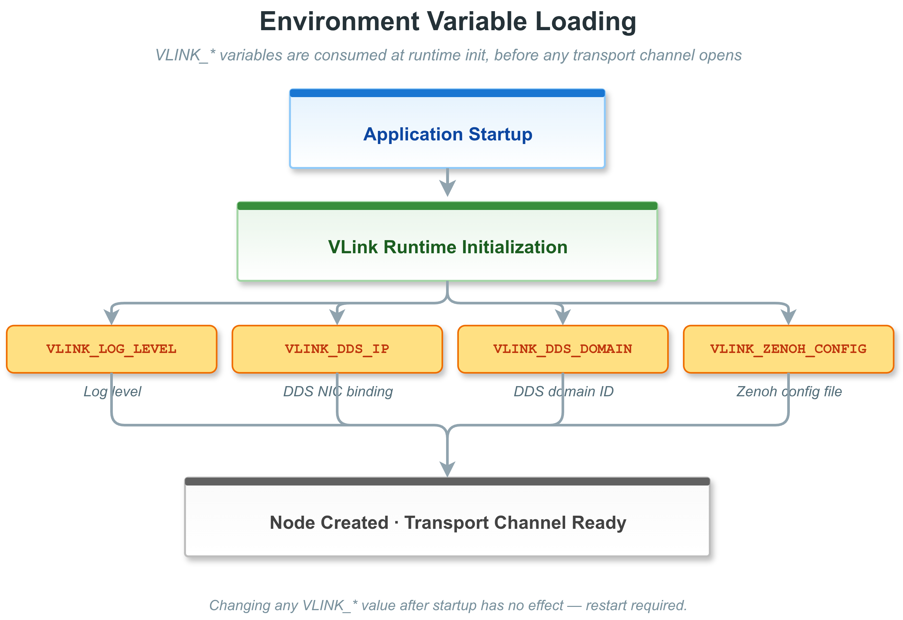

# 21. 环境变量参考

本章列出 VLink 运行时、工具入口和交叉编译辅助路径读取的环境变量。数据来源：对源码中 `VLINK_*` 环境变量读取点的完整扫描（截至当前提交）。

所有 VLink 专有环境变量以 `VLINK_` 前缀开头。`vlink-check env` 会按编译时启用的传输模块（`VLINK_SUPPORT_*` 宏）裁剪 `cli/check/check.cc` 内置清单：模块未编译则对应私有 env 不会展示（例如未启用 Zenoh 时不列 `VLINK_ZENOH_*`、未启用 SHM2 时不列 `VLINK_SHM2_*`）。它不是完整运行时变量枚举，例如 `VLINK_BENCH_*` 由 `vlink-bench` 读取但不在 `vlink-check env` 输出中。若要确认某变量是否被使用，最权威的方法是搜索源码 `Utils::get_env("<NAME>")`。参见 [13-cli-tools.md](13-cli-tools.md#134-vlink-check--系统配置与环境诊断)。

---

## 目录

1. [21.1 核心运行时环境变量](#211-核心运行时环境变量)
2. [21.2 日志控制环境变量](#212-日志控制环境变量)
3. [21.3 发现与诊断环境变量](#213-发现与诊断环境变量)
4. [21.4 DDS 传输环境变量](#214-dds-传输环境变量)
5. [21.5 SHM 传输环境变量](#215-shm-传输环境变量)
6. [21.6 外部依赖环境变量](#216-外部依赖环境变量)
7. [21.7 其他传输后端环境变量](#217-其他传输后端环境变量)
8. [21.8 Bag 录制环境变量](#218-bag-录制环境变量)
9. [21.9 Bench 工具环境变量](#219-bench-工具环境变量)
10. [21.10 交叉编译专用环境变量](#2110-交叉编译专用环境变量)
11. [21.11 示例应用中的自定义环境变量](#2111-示例应用中的自定义环境变量)
12. [21.12 设置方式](#2112-设置方式)

---

## 21.1 核心运行时环境变量

| 变量名                  | 类型     | 说明                                                              |
| ----------------------- | -------- | ----------------------------------------------------------------- |
| `VLINK_URL_PLUGINS`     | 插件名列表 | 传输后端插件基础名（不含路径、`lib` 前缀和 `.so` 后缀），**分号分隔**。`vlink-` 前缀可省略。 |
| `VLINK_SCHEMA_PLUGIN`   | 路径/插件名 | SchemaPluginInterface 插件共享库路径或插件基础名                |
| `VLINK_CONVERT_PLUGIN`  | 路径/插件名 | MessageConvertPlugin 插件共享库路径或插件基础名；WebViz 实时桥接和 `vlink-bag2mcap` / `vlink-bag2rrd` 离线转换工具在未显式传 `--convert_plugin` 时读取 |
| `VLINK_PROTO_DIR`       | 目录路径 | `.proto` 搜索目录（由 SchemaPluginBase 实现主动读取时生效）       |
| `VLINK_FBS_DIR`         | 目录路径 | `.fbs` 搜索目录（同上）                                           |
| `VLINK_PLUGIN_DIR`      | 目录路径 | 插件共享库搜索目录                                                |
| `VLINK_TMP_DIR`         | 目录路径 | 临时文件目录                                                      |
| `VLINK_LOCK_DIR`        | 目录路径 | 锁文件目录                                                        |
| `VLINK_URL_REMAP`       | 文件路径 | URL 重映射 JSON 文件路径（子串匹配，详见 [传输后端 7.7](07-transport.md#77-url-重映射)） |
| `VLINK_INTRA_BIND`      | 字符串   | 把所有 `intra://` URL 重定向到其他 scheme（值为 `shm`、`dds` 等；源码 `src/impl/url.cc:405`）；不同于 `VLINK_DDS_BIND` 的"仅 DDS 家族互转"语义 |
| `VLINK_QOS_CONFIG`      | 文件路径 | QoS 配置文件路径                                                  |
| `VLINK_MEMORY_LEVEL`    | 数字     | `vlink::MemoryPool` 默认 19 阶金字塔的分级（`0`..`9`，默认 `3` Balanced）。tier 跨度 `32B..16MB`。`0` = bypass 模式：跳过所有 tier，每次 `allocate` 直接 `::operator new`、每次 `deallocate` 直接 `::operator delete`。`1..9` 选择内置金字塔，等级越高每档预留 block 越多；`9` 满载占用 ≈ 656 MiB。L3 默认不激活 `4MB` tier，4K 帧走 oversized 直通；如需常驻请提升到 `4` 及以上。非数字或越界值钳到 `[0, 9]` 并打 warning。仅在首次构造全局池时读取，由 `Bytes::init_memory_pool()` / `MemoryPool::global_instance(true)` 触发。 |
| `VLINK_MEMORY_PREALLOC` | `1`      | 设为 `1` 时，全局 `MemoryPool` 在构造时为每个 tier 一次性预分配满额 `blocks_per_chunk` 的 chunk（best-effort），消除热路径上的所有上游分配延迟。其它值或未设置保持懒加载（按几何增长）。仅 `MemoryPool::global_instance(true)` 首次构造时读取。 |

```bash
# 设置多个传输后端插件（分号分隔，只写基础名，不含 lib 前缀和 .so 后缀）
# Plugin::load() 会自动添加平台前缀/后缀（如 lib*.so），并在 search_paths 中查找
export VLINK_URL_PLUGINS="custom-transport;my_plugin"

# 指定 proto 文件目录
export VLINK_PROTO_DIR=/opt/vlink/proto

# 指定 fbs 文件目录
export VLINK_FBS_DIR=/opt/vlink/fbs

# 指定 schema 插件（可写基础名或共享库路径）
export VLINK_SCHEMA_PLUGIN=my_schema_plugin

# 指定 WebViz/离线转换插件（可写基础名或共享库路径）
export VLINK_CONVERT_PLUGIN=my_convert_plugin
```

---

## 21.2 日志控制环境变量

VLink 内置日志系统（`vlink::Logger`）支持通过环境变量控制日志行为，无需修改代码。

| 变量名                      | 类型   | 说明                                                              |
| --------------------------- | ------ | ----------------------------------------------------------------- |
| `VLINK_LOG_LEVEL`           | 数字   | 全局日志级别（0=TRACE, 1=DEBUG, 2=INFO, 3=WARN, 4=ERROR, 5=FATAL, 6=OFF）|
| `VLINK_LOG_CONSOLE_LEVEL`   | 数字   | 控制台日志级别，覆盖全局级别                                      |
| `VLINK_LOG_FILE_LEVEL`      | 数字   | 文件日志级别，覆盖全局级别                                        |
| `VLINK_LOG_DIR`             | 目录路径 | 日志文件存储目录                                                |
| `VLINK_LOG_CONSOLE_UNORDER` | `1`/`0` | 启用非同步控制台输出（性能更好）                                |
| `VLINK_LOG_CONSOLE_FMT`     | `1`/`0` | 是否启用扩展控制台格式输出                                       |
| `VLINK_LOG_ENABLE_UTC`      | `1`/`0` | 使用 UTC 时间戳                                                 |
| `VLINK_LOG_MAX_SIZE`        | 数字   | 单个日志文件最大大小（**字节**，超过后轮转；默认 `10 * 1024 * 1024` = 10 MiB） |
| `VLINK_LOG_MAX_COUNT`       | 数字   | 日志文件最大保留数量                                              |
| `VLINK_LOG_FLUSH_DELAY`     | 数字   | 日志刷新延迟（毫秒，默认 500）                                    |
| `VLINK_LOG_PLUGIN`          | 插件名   | 自定义日志插件基础名（不含路径、`lib` 前缀和 `.so` 后缀）      |
| `VLINK_LOG_STORE_STRATEGY`  | `1`/`0` | 是否启用备用文件存储策略（主要影响 spdlog 文件 sink）           |
| `VLINK_LOG_OPEN_APPEND`     | `1`/`0` | 程序启动时追加之前的日志                                        |
| `VLINK_LOG_BLOCK_SYNC`      | `1`/`0` | 队列满时阻塞用户线程直到消费完成                                |
| `VLINK_LOG_WRITE_DEPTH`     | 数字   | 日志后端写入队列深度                                              |

### 21.2.1 日志级别数值对应

| 数值 | 级别     | 说明               |
| ---- | -------- | ------------------ |
| `0`  | TRACE    | 最细粒度跟踪日志   |
| `1`  | DEBUG    | 调试信息           |
| `2`  | INFO     | 一般信息（默认）   |
| `3`  | WARN     | 警告               |
| `4`  | ERROR    | 错误               |
| `5`  | FATAL    | 致命错误           |
| `6`  | OFF      | 完全关闭日志输出   |

```bash
# 只输出 warn 及以上级别日志
export VLINK_LOG_LEVEL=3

# 控制台仅显示 error，文件记录全部
export VLINK_LOG_CONSOLE_LEVEL=4
export VLINK_LOG_FILE_LEVEL=0

# 设置日志输出目录
export VLINK_LOG_DIR=/var/log/vlink
```

---

## 21.3 发现与诊断环境变量

| 变量名                    | 类型    | 默认 | 说明                                              |
| ------------------------- | ------- | ---- | ------------------------------------------------- |
| `VLINK_DISCOVER_DISABLE`  | `1`/`0` | `0`  | `=1` 时禁用全局 `DiscoveryReporter` 单例          |
| `VLINK_DISCOVER_NATIVE`   | `1`/`0` | `0`  | `=1` 时把组播接口绑定到 `127.0.0.1`，仅本机可收到 |
| `VLINK_PROFILER_ENABLE`   | `1`/`0` | `0`  | 启用 `CpuProfiler`（编译宏 `VLINK_PROFILER_DEFAULT_STATE` 控制默认值） |

```bash
# 禁用发现（减少 UDP 广播开销）
export VLINK_DISCOVER_DISABLE=1

# 仅发现本机节点
export VLINK_DISCOVER_NATIVE=1

# 启用 CPU 性能分析
export VLINK_PROFILER_ENABLE=1
```

---

## 21.4 DDS 传输环境变量

以下变量影响 `dds://`、`ddsc://`、`ddsr://`、`ddst://` 传输后端（传输后端详细说明参见 [07-transport.md](07-transport.md)）。

> **说明**：这些变量由各 DDS backend 工厂和 URL 解析路径分别读取，是否生效取决于当前实际启用的 DDS 实现（`dds` / `ddsc` / `ddsr` / `ddst`）。其中 `VLINK_DDS_DOMAIN` 会作为默认 domain 入口，`VLINK_DDS_BIND` 用于 URL 绑定/重写；若需要最直接、最可见的行为控制，仍建议优先使用 URL 查询参数或显式 `Conf` 字段。

| 变量名                    | 类型     | 说明                                                        |
| ------------------------- | -------- | ----------------------------------------------------------- |
| `VLINK_DDS_DOMAIN`        | 数字     | DDS Domain ID                                               |
| `VLINK_DDS_IP`            | IP 地址  | DDS 单播 IP 地址（多网卡时必设）                            |
| `VLINK_DDS_IP_FILTER`     | `1`/`0`  | 启用 IP 过滤，仅使用当前可用地址                            |
| `VLINK_DDS_MULTICAST_IP`  | IP 地址  | DDS 组播 IP 地址                                            |
| `VLINK_DDS_PEER`          | 字符串   | DDS 对等端配置                                              |
| `VLINK_DDS_BUF`           | 数字     | DDS 缓冲区大小                                              |
| `VLINK_DDS_MTU`           | 数字     | DDS 传输层最大消息大小（MTU）                               |
| `VLINK_DDS_UDP`           | 字符串   | DDS UDP 传输配置                                            |
| `VLINK_DDS_TCP`           | 字符串   | DDS TCP 传输配置                                            |
| `VLINK_DDS_SHM`           | 字符串   | DDS 共享内存传输配置                                        |
| `VLINK_DDS_LESS_MEMORY`   | `1`/`0`  | DDS 低内存使用模式                                          |
| `VLINK_DDS_DEBUG`         | `1`/`0`  | 启用 DDS 调试日志                                           |
| `VLINK_DDS_BIND`          | 字符串   | 把所有 `dds://` / `ddsf://` URL 重定向到指定 DDS 变体。可选值：`dds` 或 `ddsf`（均指 Fast-DDS；`ddsf` 是 URL 前缀层面对 `dds` 的别名）、`ddsc`（CycloneDDS）、`ddsr`（RTI Connext）、`ddst`（TravoDDS） |
| `VLINK_DDS_EVENT_QOS`     | 字符串   | DDS Event 模型 QoS 配置                                     |
| `VLINK_DDS_METHOD_QOS`    | 字符串   | DDS Method 模型 QoS 配置                                    |
| `VLINK_DDS_FIELD_QOS`     | 字符串   | DDS Field 模型 QoS 配置                                     |
| `VLINK_FASTDDS_QOS_FILE`  | 文件路径 | FastDDS QoS XML 配置文件路径                                |
| `VLINK_CYCLONEDDS_URI`    | URI      | CycloneDDS 配置 URI                                         |
| `VLINK_TRAVODDS_QOS_FILE` | 文件路径 | TravoDDS（`ddst://`）QoS XML 配置文件路径                   |

```bash
# 将所有 dds:// 节点切换到 CycloneDDS 实现
export VLINK_DDS_BIND=ddsc

# 启用 DDS 调试日志
export VLINK_DDS_DEBUG=1

# 指定 FastDDS QoS 文件
export VLINK_FASTDDS_QOS_FILE=/etc/vlink/fastdds_qos.xml
```

---

## 21.5 SHM 传输环境变量

| 变量名              | 类型     | 说明                                                          |
| ------------------- | -------- | ------------------------------------------------------------- |
| `VLINK_SHM_DEBUG`   | `1`/`0`  | 启用 `shm://`（Iceoryx）调试日志                              |
| `VLINK_SHM_DEPTH`   | 数字     | `shm://` 传输缓冲深度                                         |
| `VLINK_SHM2_DEBUG`  | `1`/`0`  | 启用 `shm2://`（Iceoryx2）调试日志                            |
| `VLINK_SHM2_DEPTH`  | 数字     | `shm2://` 缓冲深度                                            |
| `VLINK_SHM2_CONFIG` | 文件路径 | Iceoryx2 配置文件路径                                         |
| `VLINK_SHM2_NOTIFY_EVERY` | 数字 | `shm2://` 发布端每隔 N 条消息触发一次 notify（默认 `1`，即每条都通知；调大可批量唤醒消费者，降低 syscall 频率） |

## 21.6 外部依赖环境变量

### 21.6.1 Iceoryx 外部环境变量

Iceoryx 传输依赖 SHM 守护进程（**推荐 `vlink-proxy -c` 内嵌启动**，它默认 `-l 2`（Middle，等价 `proxy/etc/proxy_roudi.toml`，7 档分级 chunk）；若需要重载/点云载荷谱可 `-l 3`（High，8 档，等价 `proxy_roudi_large.toml`），轻量端侧 `-l 1`（Low，6 档），并自带远程监控能力——详见 [16-proxy.md](16-proxy.md)）。如果你单独跑 `iox-roudi`，其配置通过以下变量：

| 变量名                     | 默认值           | 说明                                               |
| -------------------------- | ---------------- | -------------------------------------------------- |
| `IOX_ROUDI_CONFIG`         | 空（内置默认值） | Iceoryx RouDi 配置 TOML 文件路径                   |
| `IOX_RUNTIME_PATH`         | `/tmp`           | Iceoryx 运行时 Unix domain socket 路径             |
| `IOX_LOG_LEVEL`            | `Error`          | Iceoryx 内部日志级别                               |

---

## 21.7 其他传输后端环境变量

### 21.7.1 zenoh://

| 变量名                       | 类型     | 说明                                    |
| ---------------------------- | -------- | --------------------------------------- |
| `VLINK_ZENOH_CONFIG`         | 文件路径 | Zenoh JSON5 配置文件路径                |
| `VLINK_ZENOH_DOMAIN`         | 数字     | Zenoh Domain ID                         |
| `VLINK_ZENOH_MODE`           | 字符串   | 运行模式（默认 `peer`）                 |
| `VLINK_ZENOH_IP`             | IP 地址  | 绑定 IP 地址                            |
| `VLINK_ZENOH_PEER`           | 字符串   | 对等端配置                              |
| `VLINK_ZENOH_LISTEN`         | 字符串   | 监听配置                                |
| `VLINK_ZENOH_MULTICAST`      | IP 地址  | 组播地址（默认 `239.255.0.100`）        |
| `VLINK_ZENOH_MULTICAST_IF`   | 字符串   | 组播网卡                                |
| `VLINK_ZENOH_MULTICAST_TTL`  | 数字     | 组播 TTL                                |
| `VLINK_ZENOH_GOSSIP`         | `1`/`0`  | 启用 Gossip 发现（默认 1）              |
| `VLINK_ZENOH_RX_BUF`         | 数字     | 接收缓冲区大小                          |
| `VLINK_ZENOH_MAX_MSG`        | 数字     | 最大消息大小                            |
| `VLINK_ZENOH_TX_QUEUE_DATA`  | 数字     | 数据发送队列深度                        |
| `VLINK_ZENOH_TX_QUEUE_RT`    | 数字     | 实时发送队列深度                        |
| `VLINK_ZENOH_LOWLATENCY`     | `1`/`0`  | 低延迟模式（默认 0）                    |
| `VLINK_ZENOH_QOS`            | `1`/`0`  | QoS 启用（默认 1）                      |
| `VLINK_ZENOH_COMPRESSION`    | `1`/`0`  | 压缩启用（默认 0）                      |
| `VLINK_ZENOH_TIMESTAMPS`     | `1`/`0`  | 时间戳启用（默认 0）                    |
| `VLINK_ZENOH_EVENT_QOS`      | 字符串   | Event 模型 QoS 配置                     |
| `VLINK_ZENOH_METHOD_QOS`     | 字符串   | Method 模型 QoS 配置                    |
| `VLINK_ZENOH_FIELD_QOS`      | 字符串   | Field 模型 QoS 配置                     |
| `VLINK_ZENOH_BATCH_ENABLED`  | `true`/`false` | 是否启用批量发送（默认 `true`）   |
| `VLINK_ZENOH_BATCH_TIME_LIMIT_MS` | 数字 | 批量聚合时间窗（毫秒，默认 `1`）     |
| `VLINK_ZENOH_ALLOWED_LOCALITY` | 字符串 | 允许的 locality（`local`=仅本会话 / `remote`=仅远端 / 其他=任意；默认 `any`，需 Zenoh `Z_FEATURE_UNSTABLE_API`） |
| `VLINK_ZENOH_SHM`                       | `1`/`0` | 启用 Zenoh 共享内存（默认 `0`，仅 zenoh-c 且编译期带 `Z_FEATURE_SHARED_MEMORY` + `Z_FEATURE_UNSTABLE_API` 时生效） |
| `VLINK_ZENOH_SHM_MODE`                  | 字符串  | SHM 初始化模式：`init`（默认，立即建池）/ `lazy`（首次使用时建池）                                |
| `VLINK_ZENOH_SHM_SIZE`                  | 字节数  | SHM 传输池大小，支持 `B`/`K`/`M`/`G` 后缀（写入 `transport/shared_memory/transport_optimization/pool_size`） |
| `VLINK_ZENOH_SHM_THRESHOLD`             | 字节数  | Zenoh 自动 SHM 提升阈值（写入 `transport/shared_memory/transport_optimization/message_size_threshold`） |
| `VLINK_ZENOH_SHM_LOAN_THRESHOLD`        | 字节数  | VLink `loan(size)` 走 Zenoh SHM 的最小尺寸（默认 `8192`，低于此值回退到堆 `Bytes::create`），支持 `B`/`K`/`M`/`G` 后缀 |
| `VLINK_ZENOH_SHM_BLOCKING`              | `1`/`0` | `1`/`true` 时 SHM 池满时阻塞等待 GC + defrag，否则非阻塞失败（默认 `0`）                          |

```bash
export VLINK_ZENOH_CONFIG=/etc/vlink/zenoh.json5
export VLINK_ZENOH_MODE=client
export VLINK_ZENOH_PEER=tcp/192.168.1.100:7447
export VLINK_ZENOH_SHM=1
export VLINK_ZENOH_SHM_SIZE=64M
```

### 21.7.2 mqtt://

| 变量名                    | 类型     | 默认值                     | 说明                             |
| ------------------------- | -------- | -------------------------- | -------------------------------- |
| `VLINK_MQTT_BROKER`       | URI      | `tcp://localhost:1883`     | MQTT Broker 连接 URI             |
| `VLINK_MQTT_CLIENT_ID`    | 字符串   | `vlink_mqtt`               | MQTT 客户端 ID 前缀             |
| `VLINK_MQTT_DOMAIN`       | 数字     | `0`                        | MQTT Domain ID                   |
| `VLINK_MQTT_QOS`          | 数字     | `1`                        | MQTT QoS 级别                    |
| `VLINK_MQTT_KEEPALIVE`    | 数字     | `60`                       | MQTT 心跳保活间隔（秒）         |

```bash
export VLINK_MQTT_BROKER=tcp://192.168.1.100:1883
export VLINK_MQTT_CLIENT_ID=my_app
export VLINK_MQTT_KEEPALIVE=30
```

### 21.7.3 someip://

| 变量名              | 类型     | 说明                           |
| ------------------- | -------- | ------------------------------ |
| `VLINK_SOMEIP_CFG`  | 文件路径 | SOME/IP (vsomeip) 配置文件路径 |

```bash
export VLINK_SOMEIP_CFG=/etc/vlink/vsomeip.json
```

### 21.7.4 SSL/TLS 环境变量

以下变量用于配置传输层 SSL/TLS 加密（如 `mqtt://` 后端的 TLS 连接）。

| 变量名                | 类型     | 说明                                   |
| --------------------- | -------- | -------------------------------------- |
| `VLINK_SSL_VERIFY`    | `1`/`0`  | 是否验证服务器证书                     |
| `VLINK_SSL_CA`        | 文件路径 | CA 证书文件路径                        |
| `VLINK_SSL_CERT`      | 文件路径 | 客户端证书文件路径                     |
| `VLINK_SSL_KEY`       | 文件路径 | 客户端私钥文件路径                     |
| `VLINK_SSL_KEY_PASS`  | 字符串   | 私钥密码                               |
| `VLINK_SSL_SNI`       | 字符串   | TLS SNI（Server Name Indication）主机名 |
| `VLINK_SSL_CIPHERS`   | 字符串   | 允许的 TLS 密码套件列表                |

```bash
export VLINK_SSL_CA=/etc/certs/ca.pem
export VLINK_SSL_CERT=/etc/certs/client.pem
export VLINK_SSL_KEY=/etc/certs/client-key.pem
export VLINK_SSL_VERIFY=1
```

### 21.7.5 外部 DDS 环境变量

| 变量名                         | 说明                                                        |
| ------------------------------ | ----------------------------------------------------------- |
| `FASTDDS_DEFAULT_PROFILES_FILE`| FastDDS XML Profile 文件路径                                |
| `FASTDDS_BUILTIN_TRANSPORTS`   | 覆盖内置传输层（`LARGE_DATA`、`SHM`、`UDPv4` 等）          |
| `FASTDDS_STATISTICS`           | 启用 FastDDS 统计模块                                       |
| `CYCLONEDDS_URI`               | CycloneDDS XML 配置文件 URI                                 |
| `VSOMEIP_CONFIGURATION`        | vsomeip JSON 配置文件路径                                   |
| `VSOMEIP_APPLICATION_NAME`     | vsomeip 应用名称                                            |

---

## 21.8 Bag 录制环境变量

录制/回放 API 详细说明参见 [12-bag-recording.md](12-bag-recording.md)；CLI 工具参见 [13-cli-tools.md](13-cli-tools.md#137-vlink-bag--数据录制与回放)。

| 变量名            | 类型     | 说明                                                      |
| ----------------- | -------- | --------------------------------------------------------- |
| `VLINK_BAG_PATH`  | 文件路径 | Bag 录制文件路径，设置后启用全局 BagWriter（参见 `BagWriter::global_get()`）|
| `VLINK_BAG_TAG`   | 字符串   | 录制会话标签名                                            |

```bash
# 启用全局录制
export VLINK_BAG_PATH=/tmp/recording.vdb
export VLINK_BAG_TAG=test_session_01
```

---

## 21.9 Bench 工具环境变量

仅 `vlink-bench` 在 `process` 模式下生效（由 `cli/bench/bench.cc:78-111` 读取），用于覆盖子进程协调超时。

| 变量名                            | 类型 | 默认值（毫秒） | 说明                                                  |
| --------------------------------- | ---- | -------------- | ----------------------------------------------------- |
| `VLINK_BENCH_READY_TIMEOUT_MS`    | 数字 | `30000`        | 子进程进入 ready 状态的最大等待时间                   |
| `VLINK_BENCH_START_TIMEOUT_MS`    | 数字 | `15000`        | 同步启动信号下发后子进程开始测量的最大等待时间        |
| `VLINK_BENCH_MEASURE_BUFFER_MS`   | 数字 | `10000`        | 测量窗口结束后留给样本回收的额外缓冲                  |
| `VLINK_BENCH_CLEANUP_TIMEOUT_MS`  | 数字 | `3000`         | 给子进程优雅退出的时间，超时后强杀                    |

---

## 21.10 交叉编译专用环境变量

以下变量仅在 CMake 配置阶段读取，对运行时无影响。

| 变量名                   | 适用工具链         | 说明                                                                |
| ------------------------ | ------------------ | ------------------------------------------------------------------- |
| `CROSS_COMPILE_PREFIX`   | Linux aarch64      | 交叉编译工具链前缀（如 `aarch64-linux-gnu-`）                      |
| `CC` / `CXX`             | Linux              | 显式指定 C/C++ 编译器路径                                           |
| `LINUX_INSTALL_PREFIX`   | Linux              | 目标 sysroot 安装前缀                                              |
| `SYSROOT`                | Linux (Yocto)      | Yocto sysroot 路径                                                  |
| `ANDROID_NDK`            | Android            | Android NDK 根目录（**必须设置**）                                   |
| `ANDROID_INSTALL_PREFIX` | Android            | Android 目标平台的依赖库安装前缀                                     |
| `QNX_HOST`               | QNX                | QNX SDP host 工具目录（**必须设置**）                                |
| `QNX_TARGET`             | QNX                | QNX SDP target 库目录（**必须设置**）                                |
| `QNX_INSTALL_PREFIX`     | QNX                | 自定义安装前缀                                                      |
| `OE_CMAKE_TOOLCHAIN_FILE`| Yocto              | Yocto SDK 生成的 CMake 工具链文件                                    |
| `VLINK_DDSGEN_PROGRAM`   | DDS IDL 代码生成   | 显式指定 `fastddsgen`/DDS 代码生成器路径                             |
| `VLINK_PROTOC_PROGRAM`   | Protobuf 代码生成  | 显式指定 `protoc` 路径                                               |
| `VLINK_FLATC_PROGRAM`    | FlatBuffers 代码生成 | 显式指定 `flatc` 路径                                              |

---

## 21.11 示例应用中的自定义环境变量

VLink 官方示例通过 `vlink::Utils::get_env()` 读取以下常见自定义环境变量；示例目录仍可能包含更多演示用变量，完整情况以源码为准。

### 21.11.1 环境变量加载流程



### 21.11.2 helloworld 示例

| 变量名          | 默认值 | 说明                                                          |
| --------------- | ------ | ------------------------------------------------------------- |
| `METHOD_URL`    | 空     | 直接指定 Method URL，覆盖 `METHOD_TRANSPORT` 逻辑               |
| `EVENT_URL`     | 空     | 直接指定 Event URL，覆盖 `EVENT_TRANSPORT` 逻辑                 |
| `METHOD_TRANSPORT` | `dds`  | 选择 Method 传输后端（稳定：`dds`/`ddsc`/`shm`；Beta：`someip`/`fdbus`/`qnx`）|
| `EVENT_TRANSPORT`  | `dds`  | 选择 Event 传输后端（同上）                                   |

```bash
# 使用 shm:// 传输运行 helloworld
export METHOD_TRANSPORT=shm
export EVENT_TRANSPORT=shm

./sample_helloworld_server &
./sample_helloworld_client sub
```

### 21.11.3 ping_pong 示例

| 变量名       | 默认值 | 说明                                                    |
| ------------ | ------ | ------------------------------------------------------- |
| `PING_URL`   | 空     | 直接指定 Ping 发布 URL                                  |
| `PONG_URL`   | 空     | 直接指定 Pong 发布 URL                                  |
| `PING_TRANSPORT` | `dds`  | Ping 传输后端                                          |
| `PONG_TRANSPORT` | `dds`  | Pong 传输后端                                          |

### 21.11.4 quickstart 示例

| 变量名                  | 默认值 | 说明                                  |
| ----------------------- | ------ | ------------------------------------- |
| `VLINK_CONFIG_URL`      | `intra://sensor/config` | 覆盖 `hello_field` 配置 Field URL |
| `VLINK_CALCULATOR_URL`  | `intra://hello/calculator` | 覆盖 `hello_rpc` 计算服务 Method URL |
| `VLINK_NOTIFY_URL`      | `intra://hello/notify` | 覆盖 `hello_rpc` 通知 Event URL |

---

## 21.12 设置方式

### 21.12.1 临时设置（当前 Shell 会话）

```bash
export VLINK_LOG_LEVEL=1
./my_vlink_app
```

### 21.12.2 单次命令前缀

```bash
VLINK_LOG_LEVEL=3 VLINK_DDS_BIND=ddsc ./my_vlink_app
```

### 21.12.3 持久设置（Shell 配置文件）

```bash
echo 'export VLINK_LOG_LEVEL=2' >> ~/.bashrc
source ~/.bashrc
```

### 21.12.4 systemd Service 文件

```ini
[Unit]
Description=My VLink Application
After=network.target

[Service]
Type=simple
ExecStart=/usr/bin/my_vlink_app
Environment="VLINK_LOG_LEVEL=3"
Environment="VLINK_LOG_DIR=/var/log/vlink"
Environment="VLINK_DDS_IP=192.168.1.100"
Restart=on-failure

[Install]
WantedBy=multi-user.target
```

### 21.12.5 Docker / 容器环境

```dockerfile
ENV VLINK_LOG_LEVEL=2
ENV VLINK_DDS_BIND=ddsc
ENV VLINK_LOG_DIR=/var/log/vlink
```

```bash
docker run \
  -e VLINK_LOG_LEVEL=1 \
  -e VLINK_DDS_IP=192.168.1.100 \
  my_vlink_image
```

### 21.12.6 环境变量快速查看

使用 `vlink-check env` 可查看 VLink 内置清单中环境变量的当前状态。清单项按编译时启用的模块/子工具裁剪（例如未启用 ZENOH 模块时不会列出 `VLINK_ZENOH_*`），未列出不代表 source 不读它——以源码 `Utils::get_env("<NAME>")` 为准：

```bash
# 查看内置清单中的变量状态
vlink-check env

# 仅查看已设置的环境变量
vlink-check env -b
```

如需最权威的答案，请以源码 `Utils::get_env("VLINK_*")` 调用处为准。
