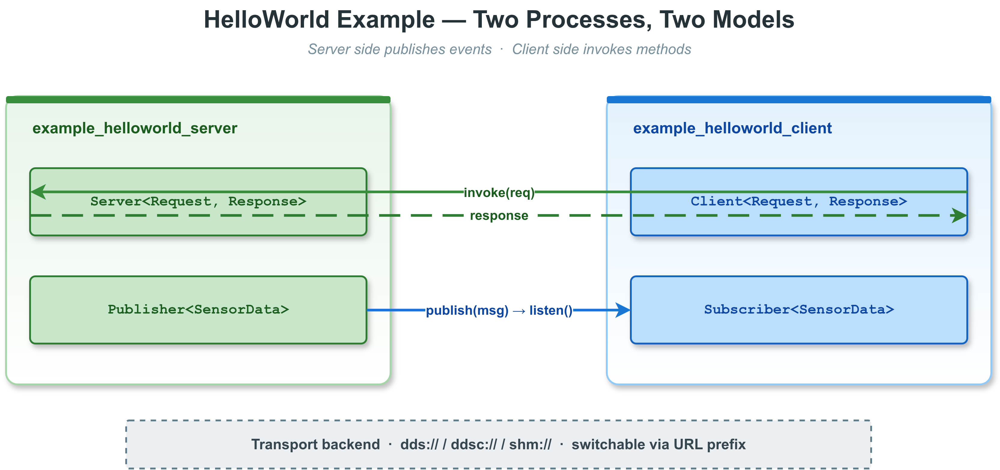

# 22. 示例

本章提供所有官方示例的总览、分类结构说明和运行方法，帮助开发者快速上手 VLink 的各种使用场景。

> **相关文档**：三种通信模型详解参见 [03-event-model.md](03-event-model.md)、[04-method-model.md](04-method-model.md)、[05-field-model.md](05-field-model.md)；序列化类型参见 [06-serialization.md](06-serialization.md)；传输后端参见 [07-transport.md](07-transport.md)；C API 详解参见 [18-c-api.md](18-c-api.md)；插件系统参见 [19-extensions.md](19-extensions.md)。

---

## 目录

1. [22.1 示例总览](#221-示例总览)
2. [22.2 目录结构与分类](#222-目录结构与分类)
3. [22.3 运行示例的前提条件](#223-运行示例的前提条件)
4. [22.4 quickstart -- 快速入门](#224-quickstart----快速入门)
5. [22.5 base -- 基础库示例](#225-base----基础库示例)
6. [22.6 communication -- 通信模型示例](#226-communication----通信模型示例)
7. [22.7 serialization -- 序列化类型示例](#227-serialization----序列化类型示例)
8. [22.8 url_guide -- URL 与传输后端示例](#228-url_guide----url-与传输后端示例)
9. [22.9 qos -- QoS 配置示例](#229-qos----qos-配置示例)
10. [22.10 security -- 安全加密示例](#2210-security----安全加密示例)
11. [22.11 zerocopy -- 零拷贝示例](#2211-zerocopy----零拷贝示例)
12. [22.12 recording -- 数据录制示例](#2212-recording----数据录制示例)
13. [22.13 plugin -- 插件系统示例](#2213-plugin----插件系统示例)
14. [22.14 proxy -- 代理层示例](#2214-proxy----代理层示例)
15. [22.15 c_api -- C API 示例](#2215-c_api----c-api-示例)
16. [22.16 node_features -- 节点高级特性示例](#2216-node_features----节点高级特性示例)
17. [22.17 samples -- 经典综合示例](#2217-samples----经典综合示例)
18. [22.18 常见编程模式](#2218-常见编程模式)

---

## 22.1 示例总览

VLink 示例目录已重新组织为 **14 个分类**，覆盖从基础库到高级功能的所有使用场景。

| 分类              | 目录                         | 示例数量 | 说明                                        |
| ----------------- | ---------------------------- | -------- | ------------------------------------------- |
| quickstart        | `examples/quickstart/`       | 3        | 最小化入门示例（PubSub、RPC、Field）        |
| base              | `examples/base/`             | 23       | 基础库（Logger、Timer、Bytes、内存池、线程池、协程、Cancellation、TaskHandle 等）|
| communication     | `examples/communication/`    | 7        | 三种通信模型的基础和进阶用法                |
| serialization     | `examples/serialization/`    | 7        | 各序列化类型的独立演示                      |
| url_guide         | `examples/url_guide/`        | 9        | URL 格式与各传输后端配置指南                |
| qos               | `examples/qos/`              | 3        | QoS 策略配置和预置 Profile                  |
| security          | `examples/security/`         | 4        | AES-128-GCM、自定义加密、RSA hybrid、SSL/TLS |
| zerocopy          | `examples/zerocopy/`         | 4        | 零拷贝传输（SHM loan）                     |
| recording         | `examples/recording/`        | 5        | Bag 录制、回放、压缩、MCAP 格式            |
| plugin            | `examples/plugin/`           | 4        | 动态插件加载、runnable 插件（API 名为 `RunablePluginInterface`）、Proto 插件 |
| proxy             | `examples/proxy/`            | 3        | 代理层 API 和服务器基础用法                 |
| c_api             | `examples/c_api/`            | 4        | 纯 C 语言绑定（PubSub、RPC、Field、Security） |
| node_features     | `examples/node_features/`    | 4        | 节点生命周期、MessageLoop 绑定、属性、状态  |
| samples           | `examples/samples/`          | 9（默认构建 8）| 经典综合示例；`dds_idl/` 当前 CMake 未启用，`images/` 为资源目录 |

### 22.1.1 编译控制

顶层 `ENABLE_EXAMPLES` **默认关闭**（仅当 `CMAKE_EXPORT_COMPILE_COMMANDS` 或
`CMAKE_CXX_CLANG_TIDY` 开启时会自动置为 `ON`）。要构建示例，需要显式
`-DENABLE_EXAMPLES=ON`。在此基础上，`examples/CMakeLists.txt` 再通过
`ENABLE_WHOLE_EXAMPLES` 控制是否编译全部分类：

- **默认**（`ENABLE_WHOLE_EXAMPLES=OFF`）：仅编译 `samples/` 目录下当前启用的示例目标
- **完整模式**（`ENABLE_WHOLE_EXAMPLES=ON`）：编译全部 14 个分类

```bash
# 只编译 samples（默认）
cmake -B build -S . -DENABLE_EXAMPLES=ON

# 编译全部示例
cmake -B build -S . -DENABLE_EXAMPLES=ON -DENABLE_WHOLE_EXAMPLES=ON
```

---

## 22.2 目录结构与分类

```
examples/
├── CMakeLists.txt              # 示例根构建文件
├── README.md                   # 示例说明文档
├── quickstart/                 # 快速入门（3 个项目）
│   ├── hello_pubsub/
│   ├── hello_rpc/
│   └── hello_field/
├── base/                       # 基础库示例（23 个项目）
│   ├── logger_basic/
│   ├── logger_advanced/
│   ├── timer_basic/
│   ├── timer_advanced/
│   ├── bytes_basic/
│   ├── bytes_advanced/
│   ├── bytes_zerocopy/
│   ├── elapsed_timer/
│   ├── deadline_timer/
│   ├── message_loop_basic/
│   ├── message_loop_advanced/
│   ├── message_loop_coroutine/
│   ├── multi_loop/
│   ├── thread_pool/
│   ├── spin_lock/
│   ├── graph_task/
│   ├── object_pool/
│   ├── memory_pool/
│   ├── cancellation/
│   ├── task_handle/
│   ├── process/
│   ├── schedule/
│   └── utils/
├── communication/              # 通信模型（7 个项目）
│   ├── event_basic/
│   ├── event_advanced/
│   ├── field_basic/
│   ├── field_advanced/
│   ├── method_sync/
│   ├── method_async/
│   └── method_fire_forget/
├── serialization/              # 序列化类型（7 个项目）
│   ├── bytes_type/
│   ├── string_type/
│   ├── pod_type/
│   ├── stream_type/
│   ├── custom_type/
│   ├── dynamic_data/
│   └── intra_data/
├── url_guide/                  # URL 与传输后端（9 个项目）
│   ├── url_basics/
│   ├── url_environment/
│   ├── url_remap/
│   ├── url_intra/
│   ├── url_shm/
│   ├── url_dds/
│   ├── url_zenoh/
│   ├── url_someip/
│   └── url_mqtt/
├── qos/                        # QoS 配置（3 个项目）
│   ├── qos_basics/
│   ├── qos_profiles/
│   └── qos_history_depth/
├── security/                   # 安全加密（4 个项目）
│   ├── security_basic/
│   ├── security_custom/
│   ├── security_rsa/
│   └── security_ssl/
├── zerocopy/                   # 零拷贝（4 个项目）
│   ├── zerocopy_loan/
│   ├── zerocopy_raw_data/
│   ├── zerocopy_camera_frame/
│   └── zerocopy_point_cloud/
├── recording/                  # 数据录制（5 个项目）
│   ├── record_basic/
│   ├── record_bag_writer/
│   ├── record_bag_reader/
│   ├── record_compression/
│   └── record_mcap/
├── plugin/                     # 插件系统（4 个项目）
│   ├── plugin_basic/
│   ├── plugin_create/
│   ├── plugin_runnable/
│   └── plugin_schema/
├── proxy/                      # 代理层（3 个项目）
│   ├── proxy_api_basic/
│   ├── proxy_server_basic/
│   └── proxy_runnable_plugin/
├── c_api/                      # C API（4 个项目）
│   ├── c_pubsub/
│   ├── c_rpc/
│   ├── c_field/
│   └── c_security/
├── node_features/              # 节点高级特性（4 个项目）
│   ├── lifecycle/
│   ├── message_loop_binding/
│   ├── properties/
│   └── status_monitoring/
└── samples/                    # 经典综合示例（当前启用 8 个目标）
    ├── helloworld/
    ├── ping_pong/
    ├── shm_raw/
    ├── ddsc_proto/
    ├── dds_dynamic/
    ├── pub_sub_fbs/
    ├── someip_flat/
    ├── fdbus_proto/
    ├── dds_idl/                # 目录存在，但当前 CMake 中未启用
    └── images/                 # 示例资源文件，不是独立示例工程
```

---

## 22.3 运行示例的前提条件

### 22.3.1 编译示例

```bash
cd /work/vlink

# 配置（以 Release 为例）
cmake -B build -DCMAKE_BUILD_TYPE=Release \
      -DENABLE_EXAMPLES=ON \
      -DENABLE_WHOLE_EXAMPLES=ON

# 编译所有示例
cmake --build build -j$(nproc)

# 编译产物位于
ls build/output/bin/
```

### 22.3.2 各传输后端的依赖

| 传输后端     | 额外依赖                        | 运行前置条件                             |
| ------------ | ------------------------------- | ---------------------------------------- |
| `intra://`   | 无                              | 无                                       |
| `dds://`     | FastDDS                         | 无守护进程需求                           |
| `ddsc://`    | CycloneDDS                      | 无守护进程需求                           |
| `shm://`     | Iceoryx                         | 先起 SHM 守护进程（首选 `vlink-proxy -c`；备选 `iox-roudi -c`）|
| `shm2://`    | Iceoryx2                        | 无需守护进程                             |
| `zenoh://`   | Zenoh-C                         | 无需守护进程（peer 模式）                |
| `someip://`  | vsomeip + FlatBuffers（Beta）   | 需启动 vsomeip routing manager           |
| `fdbus://`   | FDBus + Protobuf（Beta）        | 需启动 FDBus name server                 |
| `mqtt://`    | Paho MQTT C（Beta）             | 需 MQTT Broker 运行                      |
| `qnx://`     | QNX SDP（仅 QNX 平台）         | QNX 平台                                |

---

<a id="quickstart"></a>

## 22.4 quickstart -- 快速入门

最小化的入门示例，每个示例只演示一种通信模型的最基本用法。

| 项目              | 说明                                              |
| ----------------- | ------------------------------------------------- |
| `hello_pubsub`    | Publisher + Subscriber 基本发布/订阅              |
| `hello_rpc`       | Server + Client 基本 RPC 调用                     |
| `hello_field`     | Setter + Getter 基本字段读写                      |

---

<a id="base"></a>

## 22.5 base -- 基础库示例

演示 VLink 基础库（`vlink/base/`）中各组件的独立用法。

| 项目                     | 说明                                              |
| ------------------------ | ------------------------------------------------- |
| `logger_basic`           | 日志基本用法（级别、宏、格式化）                  |
| `logger_advanced`        | 日志高级用法（Handler、文件、Backtrace）          |
| `timer_basic`            | 定时器基本用法（周期、一次性）                    |
| `timer_advanced`         | 定时器高级用法（strict 模式、优先级）             |
| `bytes_basic`            | Bytes 基本操作（创建、拷贝、比较）                |
| `bytes_advanced`         | Bytes 高级操作（Base64、CRC、压缩）               |
| `bytes_zerocopy`         | Bytes 零拷贝（shallow_copy、loan）                |
| `elapsed_timer`          | 耗时计时器                                        |
| `deadline_timer`         | 截止时间检测器                                    |
| `message_loop_basic`     | 事件循环基本用法                                  |
| `message_loop_advanced`  | 事件循环高级用法（优先级队列、`exec_task` 链式）   |
| `message_loop_coroutine` | MessageLoop + C++20 协程（`Task<T>` / `co_spawn` / `schedule/yield/delay_ms` / `await_future` / `await_graph` / `when_all/when_any/sequence`，需 `ENABLE_CXX_STD_20=ON`） |
| `multi_loop`             | 多事件循环并发调度                                |
| `thread_pool`            | 线程池任务提交（含 `post_task_handle` 与 shutdown 自分离） |
| `spin_lock`              | 自旋锁使用                                        |
| `graph_task`             | DAG 任务图调度（状态回调 snapshot 语义）           |
| `cancellation`           | 协作取消三件套：`CancellationSource` / `Token` / `Registration` + `OperationCancelled` |
| `task_handle`            | Tracked 任务投递：`post_task_handle` / `PostTaskOptions` / `TaskExecutionState` 全状态机覆盖 |
| `object_pool`            | 对象池                                            |
| `memory_pool`            | 内存池（`MemoryPool` 多档分级、预分配）            |
| `process`                | 进程信息查询                                      |
| `schedule`               | 调度器                                            |
| `utils`                  | 工具函数（路径、线程、信号等）                    |

---

<a id="communication"></a>

## 22.6 communication -- 通信模型示例

三种通信模型（Event、Method、Field）的基础和进阶用法。

| 项目                  | 说明                                              |
| --------------------- | ------------------------------------------------- |
| `event_basic`         | Publisher/Subscriber 基本 Pub-Sub                 |
| `event_advanced`      | 多订阅者、连接检测、强制发布等                    |
| `field_basic`         | Setter/Getter 基本状态同步                        |
| `field_advanced`      | 推送模式、轮询模式、监听回调                      |
| `method_sync`         | Server/Client 同步 RPC 调用（invoke 带返回值）    |
| `method_async`        | Server/Client 异步 RPC 调用（async_invoke + future） |
| `method_fire_forget`  | Server/Client 单向请求（send，无返回值）          |

---

<a id="serialization"></a>

## 22.7 serialization -- 序列化类型示例

每种 VLink 支持的序列化类型的独立演示。

| 项目            | 序列化类型          | 说明                                           |
| --------------- | ------------------- | ---------------------------------------------- |
| `bytes_type`    | `Bytes`             | 原始字节传输，无序列化开销                     |
| `string_type`   | `std::string`       | UTF-8 字符串传输                               |
| `pod_type`      | 标准布局 POD 结构体 | 直接内存拷贝（`kStandardType`）                |
| `stream_type`   | 流式类型            | 通过 `operator<<`/`operator>>` 的 stringstream |
| `custom_type`   | 自定义类型          | 用户实现 `operator>>`/`operator<<` (Bytes)     |
| `dynamic_data`  | `DynamicData`       | 运行时类型擦除容器                             |
| `intra_data`    | `IntraData`         | 进程内零拷贝数据类型                           |

---

<a id="url_guide"></a>

## 22.8 url_guide -- URL 与传输后端示例

URL 格式说明和各传输后端的配置指南。

| 项目              | 说明                                              |
| ----------------- | ------------------------------------------------- |
| `url_basics`      | URL 基本格式和组件解析                            |
| `url_environment` | 通过环境变量动态配置 URL                          |
| `url_remap`       | JSON URL 重映射（`UrlRemap`）                     |
| `url_intra`       | `intra://` 进程内传输                             |
| `url_shm`         | `shm://` Iceoryx 共享内存传输                     |
| `url_dds`         | `dds://` FastDDS 传输                             |
| `url_zenoh`       | `zenoh://` Zenoh 传输                             |
| `url_someip`      | `someip://` SOME/IP 车载以太网传输                |
| `url_mqtt`        | `mqtt://` MQTT 传输                               |

---

<a id="qos"></a>

## 22.9 qos -- QoS 配置示例

| 项目               | 说明                                              |
| ------------------ | ------------------------------------------------- |
| `qos_basics`       | QoS 基本概念和参数设置                            |
| `qos_profiles`     | 预置 QoS Profile 的使用                           |
| `qos_history_depth`| History Depth 对消息缓存的影响                    |

---

<a id="security"></a>

## 22.10 security -- 安全加密示例

详细的安全加密文档参见 [09-security.md](09-security.md)；SSL/TLS 相关环境变量参见 [21-environment-vars.md](21-environment-vars.md)。

| 项目              | 说明                                              |
| ----------------- | ------------------------------------------------- |
| `security_basic`  | 内置 AES-128-GCM 加密（`SecurityPublisher`/`SecuritySubscriber` 构造函数传入 `Security::Config::key`） |
| `security_custom` | 自定义加密回调（`Config::encrypt_callback` / `decrypt_callback`） |
| `security_rsa`    | RSA-OAEP hybrid + 可选 RSA-PSS 签名（`Config::public_key_pem` / `signing_key_pem`） |
| `security_ssl`    | 传输层 SSL/TLS 加密（`set_ssl_options`）          |

---

<a id="zerocopy"></a>

## 22.11 zerocopy -- 零拷贝示例

| 项目                     | 说明                                              |
| ------------------------ | ------------------------------------------------- |
| `zerocopy_loan`          | `loan()` / `return_loan()` 基本 API              |
| `zerocopy_raw_data`      | 零拷贝原始数据传输                                |
| `zerocopy_camera_frame`  | 零拷贝相机帧传输场景                              |
| `zerocopy_point_cloud`   | 零拷贝点云数据传输场景                            |

---

<a id="recording"></a>

## 22.12 recording -- 数据录制示例

详细的录制/回放 API 文档参见 [12-bag-recording.md](12-bag-recording.md)。

| 项目                  | 说明                                              |
| --------------------- | ------------------------------------------------- |
| `record_basic`        | 基本 Bag 录制功能                                 |
| `record_bag_writer`   | BagWriter API 详细用法                            |
| `record_bag_reader`   | BagReader API 详细用法                            |
| `record_compression`  | 压缩录制（zstd / lzav）                          |
| `record_mcap`         | MCAP 格式录制                                     |

---

<a id="plugin"></a>

## 22.13 plugin -- 插件系统示例

详细的插件系统文档参见 [19-extensions.md](19-extensions.md)。

| 项目               | 说明                                              |
| ------------------ | ------------------------------------------------- |
| `plugin_basic`     | `Plugin::load<T>()` 基本加载流程                  |
| `plugin_create`    | 自定义插件的创建和导出                            |
| `plugin_runnable`  | `RunablePluginInterface`（runnable 插件接口）     |
| `plugin_schema`     | `SchemaPluginInterface` 统一 schema 反射插件        |

---

<a id="proxy"></a>

## 22.14 proxy -- 代理层示例

详细的代理层文档参见 [16-proxy.md](16-proxy.md)。

| 项目                    | 说明                                              |
| ----------------------- | ------------------------------------------------- |
| `proxy_api_basic`       | 代理层 API 基本用法                               |
| `proxy_server_basic`    | 代理服务器基本配置和启动                          |
| `proxy_runnable_plugin` | 代理层作为可运行插件部署                          |

---

<a id="c_api"></a>

## 22.15 c_api -- C API 示例

纯 C 语言绑定示例，覆盖三种通信模型与应用层加密。详细的 C API 文档及 Python/Go/Rust 绑定示例参见 [18-c-api.md](18-c-api.md)。

| 项目         | 说明                                              |
| ------------ | ------------------------------------------------- |
| `c_pubsub`   | C API Publisher/Subscriber（Event 模型）          |
| `c_rpc`      | C API Server/Client（Method 模型）                |
| `c_field`    | C API Setter/Getter（Field 模型）                 |
| `c_security` | C API 应用层加密（独立 `vlink_security_handle_t` 加解密 + `vlink_create_secure_*` 节点装入 `vlink_security_config_t`） |

---

<a id="node_features"></a>

## 22.16 node_features -- 节点高级特性示例

节点生命周期详见 [02-node-lifecycle.md](02-node-lifecycle.md)；状态事件详见 [17-discovery.md](17-discovery.md#174-status-与-statusdetail)。

| 项目                    | 说明                                              |
| ----------------------- | ------------------------------------------------- |
| `lifecycle`             | 节点生命周期管理（init/deinit/interrupt）         |
| `message_loop_binding`  | 将节点绑定到 MessageLoop 进行回调调度             |
| `properties`            | 节点属性（set_property/get_property）             |
| `status_monitoring`     | 节点状态监控（register_status_handler）           |

---

<a id="samples"></a>

## 22.17 samples -- 经典综合示例



`samples/` 目录保留了项目早期的综合示例，每个示例演示完整的端到端场景。这些示例在默认配置下即被编译（不需要 `ENABLE_WHOLE_EXAMPLES`）。

| 示例名          | 目录                           | 涉及传输       | 序列化       | 通信模型                   | 说明                              |
| --------------- | ------------------------------ | -------------- | ------------ | -------------------------- | --------------------------------- |
| `helloworld`    | `examples/samples/helloworld/` | 多后端（可切换）| Protobuf     | Method + Event             | 最全面的入门示例，推荐首先阅读    |
| `ping_pong`     | `examples/samples/ping_pong/`  | 多后端（可切换）| Bytes（POD）  | Event（双向）              | 端到端延迟测量                    |
| `shm_raw`       | `examples/samples/shm_raw/`    | `shm://`       | Bytes（原始）| Method + Event + Field     | 零拷贝 + 安全加密全模型演示       |
| `dds_idl`       | `examples/samples/dds_idl/`    | `dds://`       | FastDDS IDL  | Method + Event             | FastDDS 原生 IDL 类型（CDR 序列化）；**当前 CMake 中未启用**，需手动开启 |
| `ddsc_proto`    | `examples/samples/ddsc_proto/` | `ddsc://`      | Protobuf     | Method + Event + Field     | CycloneDDS + Protobuf 全模型演示  |
| `dds_dynamic`   | `examples/samples/dds_dynamic/`| `dds://`       | DynamicData  | Method + Event             | 运行时类型擦除，一个 URL 传多类型 |
| `pub_sub_fbs`   | `examples/samples/pub_sub_fbs/`| `ddsc://`      | FlatBuffers（Pub 用 `UserT`，Sub 用 `User*`） | Event（Pub + Sub） | `pub` 用 MessageLoop + Timer 每 500ms 连续发布；`sub` 用 FlatBuffers 指针类型零拷贝读取 |
| `someip_flat`   | `examples/samples/someip_flat/`| `someip://`    | FlatBuffers  | Method + Event + Field     | SOME/IP 车载以太网场景（Beta）    |
| `fdbus_proto`   | `examples/samples/fdbus_proto/`| `fdbus://`     | Protobuf     | Method + Event + Field     | FDBus IPC（Android/Linux）（Beta）|

`pub_sub_fbs` 当前的运行方式是：

- `sample_pub_sub_fbs sub`：启动订阅进程，持续监听 `ddsc://samples/pub_sub_fbs/user`
- `sample_pub_sub_fbs pub`：启动发布进程，不等待订阅端上线，直接进入 `MessageLoop + Timer`，每 500ms 发送一条 `UserT`
- 每次发送都会基于递增序号重建消息，因此 `user_id`、`name`、`profile`、`order` 等字段会持续变化

---

## 22.18 常见编程模式

### 22.18.1 错误处理

```cpp
// 1. invoke() 返回 optional，通过 has_value() 检查
auto resp = client.invoke(req, 3s);
if (!resp.has_value()) {
    VLOG_E("RPC failed: timeout or server error");
    return;
}

// 2. wait_for_connected() 带超时
using namespace std::chrono_literals;
if (!client.wait_for_connected(5s)) {
    VLOG_W("Server not available after 5 seconds");
    return;
}

// 3. 订阅者回调中的错误处理（捕获异常，避免崩溃）
sub.listen([](const MyMsg& msg) {
    try {
        process(msg);
    } catch (const std::exception& e) {
        VLOG_E("Callback exception: ", e.what());
    }
});
```

### 22.18.2 多传输后端无缝切换

```cpp
// 通过环境变量切换传输后端，代码无需修改
// 环境变量详见 21-environment-vars.md
std::string url = vlink::Utils::get_env("MY_URL", "dds://my_service/topic");
Publisher<MyMsg> pub(url);
Subscriber<MyMsg> sub(url);
// 代码完全相同，后端由 URL 中的 transport 字段决定
```

### 22.18.3 优雅退出

```cpp
// 方式 1：MessageLoop + 信号处理
MessageLoop message_loop;
Utils::register_terminate_signal([&message_loop](int sig) {
    message_loop.quit();
});
message_loop.run();  // 阻塞直到 quit()

// 方式 2：condition_variable（适合无事件循环的简单程序）
std::mutex mtx;
std::unique_lock lock(mtx);
vlink::ConditionVariable cv;
Utils::register_terminate_signal([&cv](int) { cv.notify_one(); });
cv.wait(lock);
```
