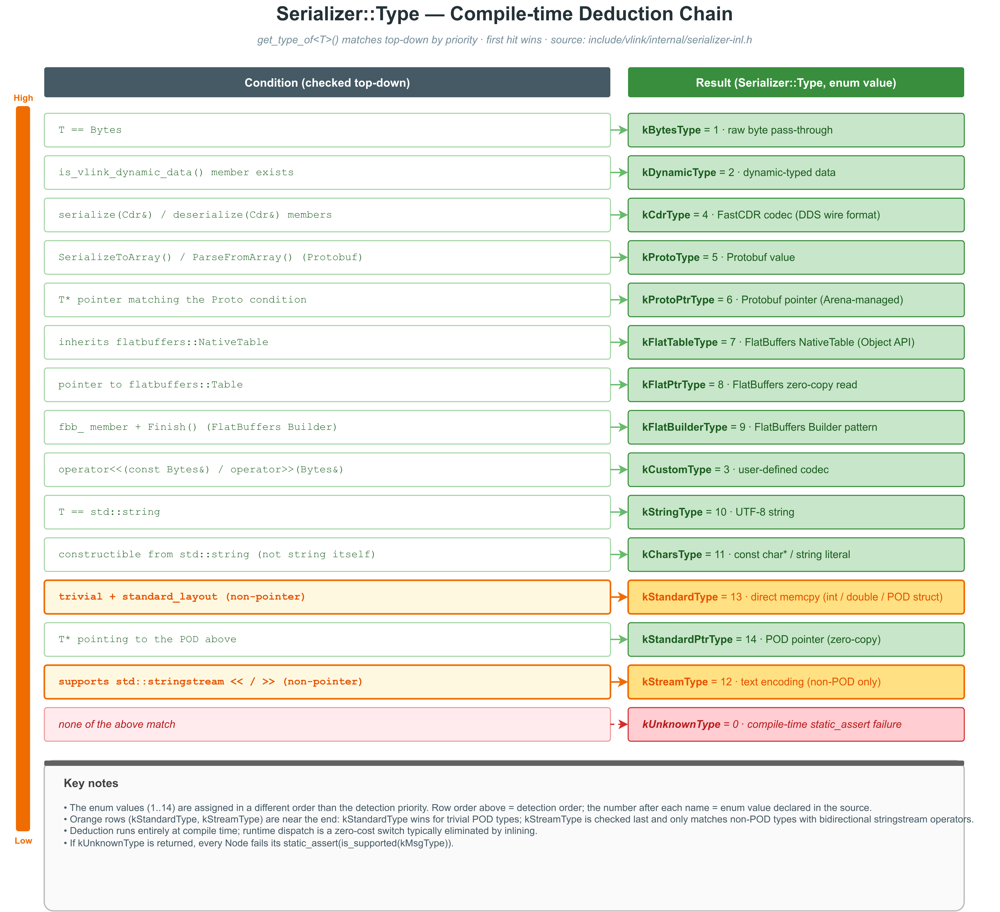
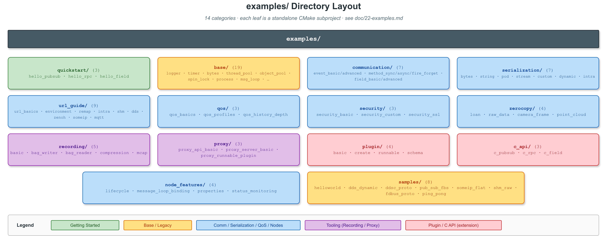

# 90. VLink 速查卡 · Cheatsheet

> 单页索引：**最常用的 API、URL、QoS、CLI、环境变量**。用于"我记得有这个，但叫什么来着"时快速回忆。

> 需要完整解释时回到 [根 README](../README.md) 的「Part II-V」章节。

目录：
1. [90.1 30 秒骨架](#901--30-秒骨架)
2. [90.2 六种原语 API](#902--六种原语-api)
3. [90.3 Node 基类方法](#903--node-基类方法)
4. [90.4 核心枚举值](#904--核心枚举值)
5. [90.5 Transport 与 URL](#905--transport-与-url)
6. [90.6 QoS 完整结构](#906--qos-完整结构)
7. [90.7 QoS 预设](#907--qos-预设qosxxx)
8. [90.8 序列化推导](#908--序列化t-会走哪种-kxtype)
9. [90.9 安全 API](#909--安全-api)
10. [90.10 零拷贝 API](#9010--零拷贝-api)
11. [90.11 日志宏](#9011--日志宏)
12. [90.12 Bag 录制/回放](#9012--bag-录制回放)
13. [90.13 Discovery / Proxy](#9013--discovery--proxy)
14. [90.14 C API](#9014--c-api)
15. [90.15 9 个 CLI 工具](#9015--9-个-cli-工具)
16. [90.16 CMake 选项](#9016--cmake-选项)
17. [90.17 VLINK_* 公共宏](#9017--vlink_-公共宏)
18. [90.18 环境变量全表](#9018--环境变量全表前缀-vlink_)
19. [90.19 常用代码模式](#9019--常用代码模式)
20. [90.20 快速排障](#9020--快速排障)
21. [90.21 examples/ 目录](#9021--examples-目录结构)

---

## 90.1 🎯 30 秒骨架

```cpp
#include <vlink/vlink.h>

// 1) Event：Pub/Sub
vlink::Publisher<Imu> pub("dds://sensor/imu");
pub.publish(msg);
vlink::Subscriber<Imu> sub("dds://sensor/imu");
sub.listen([](const Imu& m){ process(m); });

// 2) Method：Client/Server
vlink::Server<Req, Resp> srv("dds://calc/add");
srv.listen([](const Req& q, Resp& r){ r.set_sum(q.left() + q.right()); });
vlink::Client<Req, Resp> cli("dds://calc/add");
auto resp = cli.invoke(req, 3s);                 // sync, returns optional
cli.invoke(req, [](auto& r){ use(r); });         // async callback
auto fut = cli.async_invoke(req);                // future
vlink::Client<Req> fire("dds://evt/notify");
fire.send(req);                                  // fire-and-forget

// 3) Field：Setter/Getter
vlink::Setter<Status> setter("shm://vehicle/status");
setter.set(status);
vlink::Getter<Status> getter("shm://vehicle/status");
getter.listen([](auto& s){ use(s); });
getter.set_change_reporting(true);               // trigger only on change
```

---

## 90.2 🔁 六种原语 API

**工厂与构造**（所有原语都有四种）：
```cpp
// 直接构造（立即 init）
Publisher<T> pub(url_str);
Publisher<T> pub(url_str, InitType::kWithoutInit);  // 延迟 init
// 智能指针工厂
auto up = Publisher<T>::create_unique(url_str);
auto sp = Publisher<T>::create_shared(url_str);
// 用 ConfT 精细控制（各 transport 的 Conf 类）
```

### 90.2.1 Publisher / Subscriber (Event)

| Publisher | Subscriber |
|---|---|
| `bool publish(const T& msg, bool force=false)` | `bool listen(MsgCallback&&)` |
| `bool publish_fbb(const void* fbb, bool force=false)` | `void set_manual_unloan(bool)` |
| `void detect_subscribers(ConnectCallback&&)` | `void set_latency_and_lost_enabled(bool)` |
| `bool wait_for_subscribers(timeout=5000ms)` | `bool is_latency_and_lost_enabled() const` |
| `bool has_subscribers() const` | `int64_t get_latency() const` |
| `void mark_as_setter()` | `SampleLostInfo get_lost() const` |
|   | `void mark_as_getter()` |

### 90.2.2 Server / Client (Method)

| Server | Client |
|---|---|
| `bool listen(ReqCallback&&)` — fire-and-forget | `bool invoke(req, resp&, timeout)` — sync by out-param |
| `bool listen(ReqRespCallback&&)` — sync reply | `std::optional<Resp> invoke(req, timeout)` — sync optional |
| `bool listen_for_reply(ReqAsyncRespCallback&&)` | `bool invoke(req, RespCallback&&)` — async callback |
| `bool reply(uint64_t req_id, const Resp&)` — async answer | `std::future<Resp> async_invoke(req)` — future |
|   | `bool send(req)` — no response |
|   | `void detect_connected(ConnectCallback&&)` |
|   | `bool wait_for_connected(timeout)` |
|   | `bool is_connected() const` |

### 90.2.3 Setter / Getter (Field)

| Setter | Getter |
|---|---|
| `void set(const V&)` | `std::optional<V> get() const` |
| `void mark_as_publisher()` | `bool wait_for_value(timeout)` |
|   | `bool listen(MsgCallback&&)` |
|   | `void set_change_reporting(bool)` — only on change |
|   | `void set_manual_unloan(bool)` |
|   | `void set_latency_and_lost_enabled(bool)` |
|   | `int64_t get_latency() const` |
|   | `SampleLostInfo get_lost() const` |
|   | `void mark_as_subscriber()` |

**安全别名**：`SecurityPublisher<T>` ≡ `Publisher<T, SecurityType::kWithSecurity>`（其余五个同理）。

---

## 90.3 🧱 Node 基类方法

所有 6 种原语都从 `Node<ImplT, SecT>`（`include/vlink/node.h`）派生，共享这些方法：

| 方法 | 作用 |
|---|---|
| `bool init()` / `bool deinit()` / `void interrupt()` | 显式生命周期 |
| `bool has_inited() const` | init 是否完成 |
| `bool is_support_loan() const` | 该 transport 是否支持零拷贝 |
| `Bytes loan(int64_t size)` | 借一块共享内存 |
| `bool return_loan(const Bytes&)` | 归还 loan |
| `void set_manual_unloan(bool)` / `bool is_manual_unloan() const` | 订阅端手动归还开关 |
| `bool suspend()` / `bool resume()` / `bool is_suspend() const` | 暂停/恢复 |
| `bool attach(MessageLoop*)` / `bool detach()` | 绑定到外部 MessageLoop |
| `MessageLoop* get_message_loop() const` | 获取当前 MessageLoop |
| `TransportType get_transport_type() const` | 返回 `kShm` / `kDds` / … |
| `const std::string& get_url() const` | 构造时传入的完整 URL |
| `void set_property(key, value)` / `std::string get_property(key) const` | 自定义属性（会在 Discovery 广播） |
| `void set_ser_type(ser, schema_type)` / `const std::string& get_ser_type()` / `SchemaType get_schema_type()` | 显式序列化类型名 |
| `void set_discovery_enabled(bool)` / `bool get_discovery_enabled()` | 开关本节点的 Discovery 上报 |
| `SecurityXxx(url, Security::Config{}, type)` | 加密（空配置使用内置默认安全槽位；仅通过 `SecurityPublisher/Subscriber/...` 的构造函数传入） |
| `void set_record_path(path)` | 用 BagWriter 单节点旁路录制 |
| `void set_ssl_options(SslOptions)` | TLS 配置（ddsc/mqtt/zenoh） |
| `void bind_proto_arena(void*)` | 绑定 Google Arena（Protobuf） |
| `double get_cpu_usage() const` | 本节点 CPU 占比（Discovery 会广播） |
| `bool get_safety_quit() / set_safety_quit(bool)` | 退出前安全排空 |
| `Status::BasePtr get_status(Status::Type) const` / `register_status_handler(cb)` | 状态查询与回调 |
| `const AbstractNode* get_abstract_node() const` | 调试用，获取底层抽象 |

---

## 90.4 🔢 核心枚举值

源：`include/vlink/impl/types.h`

**`ImplType`（位掩码 uint8_t）**：`kUnknownImplType=0`，`kPublisher=1`，`kSubscriber=2`，`kSetter=4`，`kGetter=8`，`kServer=16`，`kClient=32`。`mark_as_*` 方法对应位翻转。

**`TransportType`（uint8_t）**：`kUnknown=0`，`kIntra=1`，`kShm=2`，`kShm2=3`，`kZenoh=4`，`kDds=5`，`kDdsc=6`，`kDdsr=7`，`kDdst=8`，`kSomeip=9`，`kMqtt=10`，`kFdbus=11`，`kQnx=12`。

**`InitType`**：`kWithoutInit=0`（延迟 init），`kWithInit=1`（构造时即 init，默认）。

**`SecurityType`**：`kWithoutSecurity=0`，`kWithSecurity=1`。

**`ActionType`**：`kUnknownAction=0`，`kClientRequest=1`，`kClientResponse=2`，`kServerRequest=3`，`kServerResponse=4`，`kPublish=5`，`kSubscribe=6`，`kSet=7`，`kGet=8`。

**`SchemaType`**：`kUnknown=0`，`kRaw=1`，`kZeroCopy=2`，`kProtobuf=3`，`kFlatbuffers=4`。

**`Logger::Level`**（`base/logger.h`）：`kTrace=0`，`kDebug=1`，`kInfo=2`，`kWarn=3`，`kError=4`，`kFatal=5`，`kOff=6`。

**`Timeout`**：`kDefaultInterval = 5000ms`，`kInfinite = -1`。

---

## 90.5 🚌 Transport 与 URL

| URL 前缀 | 底层 | 范围 | 零拷贝 | 典型用途 |
|---|---|:-:|:-:|---|
| `intra://` | 内置 lock-free 队列 | 同进程 | ✅ | 进程内最低延迟 |
| `shm://` | **Iceoryx**（推荐 `vlink-proxy -c` 内嵌起 iox-roudi） | 同机跨进程 | ✅ | 相机/点云 |
| `shm2://` | **Iceoryx2** | 同机跨进程 | ✅ | 下一代 SHM（beta） |
| `dds://` | **Fast-DDS**（eProsima） | 跨机 | ❌ | 多 ECU 协同（稳定） |
| `ddsc://` | **CycloneDDS**（Eclipse） | 跨机 | ❌ | 轻量跨机（稳定） |
| `ddsr://` | **RTI Connext** | 跨机 | ❌ | 工业高可靠（beta） |
| `ddst://` | **TravoDDS**（国产 DDS） | 跨机 | ❌ | 国产 DDS 替代（beta） |
| `zenoh://` | **Zenoh** (zenoh-c / pico) | 跨机/云边 | 条件支持 | IoT 边缘（beta） |
| `someip://` | **vsomeip3** | 车载以太网 | ❌ | ECU 服务化（beta） |
| `mqtt://` | **Paho MQTT** | 跨机/云 | ❌ | IoT 云端（beta） |
| `fdbus://` | **FDBus** | 同机 | ❌ | Android/Linux 混合（beta） |
| `qnx://` | **QNX IPC** | 同机（QNX） | ❌ | QNX 实时（beta） |

**URL 模板**：`<scheme>://[<host>[:<port>]]/<path>[?<query>][#<frag>]`

### 90.5.1 各 transport 支持的 URL query 参数

| Transport | 关键 query | 默认 |
|---|---|---|
| `intra://` | `event=<name>`、`pipeline=<int>`（pipeline depth） | `event=""`、`pipeline=0` |
| `shm://` | `domain=<int>`、`depth=<int>`、`history=<int>`、`wait=0\|1` | `0 / 0 / 0（field 默认 1） / 0` |
| `shm2://` | 与 `shm://` 相同；额外通过 `VLINK_SHM2_CONFIG` 指定 TOML | 同上 |
| `dds://` / `ddsc://` / `ddsr://` / `ddst://` | `domain=<int>`、`depth=<int>`、`qos=<profile>`；保留 `part/topic/pub/sub/writer/reader` 作 QoS 扩展键 | `0 / 0 / ""` |
| `zenoh://` | `domain=<int>`、`event=<name>`、`qos=<profile>`、`depth=<int>`（覆盖 session 级 TX 队列深度）、`shm=<0\|1>`、`shm_mode=init\|lazy`、`shm_size=<bytes>`（支持 `K`/`M`/`G`）、`shm_threshold=<bytes>`、`shm_loan_threshold=<bytes>`（用户 `loan()` 最小尺寸阈值，默认 `8K`）、`shm_blocking=<0\|1>`；`#fragment` = 模式提示（`tcp`/`udp`/`unix`/`shm` 或带地址的 `tcp/host:port`） | `0 / "" / "" / 0` |
| `someip://` | `service=<hex>`、`instance=<hex>`、`method=<hex>` 或 `event=<hex>` | `0 / 0 / 0` |
| `mqtt://` | `domain=<int>`、`qos=<0\|1\|2>`、`event=<name>`；`#fragment` = broker URI 提示 | `0 / 1 / ""` |
| `fdbus://` / `qnx://` | 基本 path + `event=` | — |

**能力速记**：`shm`/`shm2` 默认支持 `loan()`；`zenoh` 在 `?shm=1` 且构建带 `Z_FEATURE_SHARED_MEMORY` + `Z_FEATURE_UNSTABLE_API` 时支持；其余后端 `is_support_loan()` 返回 `false`。`intra` 不走序列化（类型必须"可共享的"）；`dds://` + CDR 不走 VLink 安全管道。

---

## 90.6 🎚️ QoS 完整结构

源：`include/vlink/extension/qos.h`

```cpp
struct Qos {
  char name[20] = {};                // 仅展示用
  bool valid = false;                // 必须置 true 才生效

  Reliability reliability;           // kind=kReliable, block_time=100ms, heartbeat_time=3000ms
  History history;                   // kind=kKeepLast, depth=1
  Durability durability;             // kind=kVolatile（其他：kTransientLocal / kTransient / kPersistent）
  PublishMode publish_mode;          // kind=kSync（或 kASync）
  Liveliness liveliness;             // kind=kAutomatic, duration=-1ms (infinite)
  DestinationOrder destination_order;// kind=kReceptionTimestamp（或 kSourceTimestamp）
  Ownership ownership;               // kind=kShared（或 kExclusive）
  Deadline deadline;                 // period=-1ms (no constraint)
  Lifespan lifespan;                 // duration=-1ms (infinite)
  LatencyBudget latency_budget;      // duration=0ms (best-effort)
  ResourceLimits resource_limits;    // max_samples=6000, max_instances=10, max_samples_per_instance=500
  Additions additions;               // priority=kPriorityNormal, is_express=false
};
```

**优先级枚举**：`kPriorityRealTime=1`、`kPriorityHigh=2`、`kPriorityNormal=4`（默认）、`kPriorityLow=6`、`kPriorityBackground=7`。

## 90.7 🎯 QoS 预设（`?qos=xxx`）

源：`include/vlink/extension/qos_profile.h`（13 个）

| Profile | Reliability | History | Durability | PubMode | 优先级 | 典型场景 |
|---|---|---|---|---|---|---|
| `kEvent` | Reliable | KeepLast(10) | Volatile | Sync | RealTime | 离散控制事件 |
| `kMethod` | Reliable | KeepAll | Volatile | Sync | High | RPC 请求响应 |
| `kField` | Reliable | KeepLast(1) | TransientLocal | Sync | High | 最新值状态同步 |
| `kSensor` | BestEffort | KeepLast(20) | Volatile | ASync | Normal | 高频传感器 |
| `kParameter` | Reliable | KeepLast(1000) | Volatile | Sync | Normal | 配置参数 |
| `kService` | Reliable | KeepLast(10) | TransientLocal | Sync | Normal | 服务发现 |
| `kClock` | BestEffort | KeepLast(1) | Volatile | ASync | Low | 时间同步 |
| `kStatic` | Reliable | KeepAll | TransientLocal | Sync | Normal | 静态/地图数据 |
| `kLight` | Reliable | KeepLast(1) | Volatile | ASync | High | 轻量快速 |
| `kPoor` | BestEffort | KeepLast(5) | Volatile | ASync | Background | 低优先 |
| `kBetter` | BestEffort | KeepLast(50) | Volatile | Sync | RealTime | 高吞吐 best-effort（同步发送）|
| `kBest` | Reliable | KeepLast(200) | Volatile | Sync | RealTime | 高吞吐 reliable（同步发送）|
| `kLarge` | Reliable | KeepLast(500) | Volatile | Sync | Low | 大负载（延长心跳） |

**运行时用法**（QoS 通过 URL `?qos=name` 引用，无 `set_qos()` 方法）：
```cpp
// 1) 直接用 URL 引用预设：?qos=sensor / ?qos=event / ...
vlink::Publisher<Imu> pub("dds://sensor/imu?qos=sensor");

// 2) 用自定义 Qos：先 register_qos，再 URL 引用
vlink::Qos my_qos = vlink::QosProfile::kSensor;
my_qos.history.depth = 50;
// my_qos.valid 由 QosProfile::kXxx 已置 true；自构造时必须显式设
vlink::DdsConf::register_qos("my_sensor", my_qos);  // 各 transport 的 Conf 都有
vlink::Publisher<Imu> pub2("dds://sensor/imu?qos=my_sensor");

// 3) 仅查询所有可用预设
auto& m = vlink::QosProfile::get_available_qos_map();
```

**自定义 Qos**：构造 `vlink::Qos`，逐个设置子策略，**必须把 `valid = true`** 才会应用，然后通过 `XxxConf::register_qos()` 注册再用 `?qos=` 引用。

---

## 90.8 🧪 序列化：`T` 会走哪种 `kXType`

编译期按以下顺序命中第一个（源：`include/vlink/internal/serializer-inl.h:160-192`）：



**Serializer::Type 完整枚举**（`serializer.h:123-139`）：

| 枚举 | 值 | 依赖 | 典型 T |
|---|:-:|---|---|
| `kUnknownType` | 0 | — | 不支持 → `static_assert` |
| `kBytesType` | 1 | — | `vlink::Bytes` |
| `kDynamicType` | 2 | — | 含 `is_vlink_dynamic_data()` |
| `kCustomType` | 3 | — | 实现 `operator>>/<<(Bytes)` |
| `kCdrType` | 4 | FastCDR | 有 `serialize(Cdr&)` |
| `kProtoType` | 5 | protobuf | `MyProto`（派生 `MessageLite`） |
| `kProtoPtrType` | 6 | protobuf | `MyProto*` Arena |
| `kFlatTableType` | 7 | flatbuffers | `MyTableT : flatbuffers::NativeTable` |
| `kFlatPtrType` | 8 | flatbuffers | `MyTable*`（从 GetRoot） |
| `kFlatBuilderType` | 9 | flatbuffers | 自建 Builder |
| `kStringType` | 10 | — | `std::string` |
| `kCharsType` | 11 | — | `const char*` / 字符串字面量 |
| `kStreamType` | 12 | — | 支持 `stringstream<<` 双向流，且**非** POD |
| `kStandardType` | 13 | — | trivial + standard_layout（POD） |
| `kStandardPtrType` | 14 | — | POD 指针 |

**重点**：`int` / `double` / 纯 POD 先命中 **kStandardType**（memcpy 二进制）；要走 `kStreamType` 必须**非 trivial**（加 `std::string` 之类）。

---

## 90.9 🔐 安全 API

```cpp
vlink::Security::Config cfg;
cfg.key = "my-secret";                          // 对称：SHA-256 截断为 AES-128-GCM key
// 或 cfg.passphrase + cfg.pbkdf2_salt          // 对称：PBKDF2-HMAC-SHA256 派生
// 或 cfg.public_key_pem / private_key_pem     // 非对称：RSA-OAEP + AES-128-GCM 会话
// 可选 cfg.advanced.signing_key_pem / verify_key_pem  // RSA-PSS 发送方认证
// AAD/replay：cfg.advanced.aad_context / replay_window
// 或 cfg.encrypt_callback / decrypt_callback  // 自定义算法

vlink::SecurityPublisher<Msg> pub("dds://topic", cfg);   // sec_cfg 作为构造函数第二个参数
```

- 配置一次性：`Security::Config` 是 aggregate；只能在构造时传入（`SecurityXxx` 的第 2 个参数，可缺省；缺省使用内置默认安全槽位）
- 无运行时 setter：要换密钥/回调必须销毁重建节点
- 模式自动选择：自定义回调 > RSA 非对称 > 对称
- 不支持：`intra://`（无序列化流程）、`dds://` + CDR（CDR 直通 DDS，绕过 VLink 管道）
- CMake：`ENABLE_SECURITY=ON`（默认 ON），依赖 OpenSSL；未启用时只有自定义回调路径生效

**Callback 签名**：
```cpp
using Callback = vlink::Function<bool(const Bytes& in, Bytes& out)>;
```

**SSL / TLS**（ddsc / mqtt / zenoh 的 TCP 通道适用）：通过 `SslOptions` 或 env 变量 `VLINK_SSL_VERIFY / _CA / _CERT / _KEY / _KEY_PASS / _SNI / _CIPHERS` 配置。

---

## 90.10 📦 零拷贝 API

```cpp
if (pub.is_support_loan()) {                   // shm/shm2 返回 true；zenoh 在 SHM 条件满足时也可能为 true
  auto buf = pub.loan(sizeof(CameraFrame));    // 零分配拿取缓冲
  std::memcpy(buf.data(), &frame, sizeof(frame));
  pub.publish(buf);                             // 发布后归还由框架管
}

sub.set_manual_unloan(true);                   // 订阅端接管归还时机
sub.listen([&](const Bytes& b){
  /* 用 b.data() ... */
  /* 用完后显式调用： */
  sub.return_loan(b);                          // 由订阅端归还
});
```

**数据容器**（`include/vlink/zerocopy/`）：
- `RawData`（64 B）· `CameraFrame`（80 B）· `PointCloud`（256 B）· `ProxyData`（80 B）
- 都内嵌 40 B `Header`：`frame_id[16] + seq[4] + reserved[4] + time_meas[8] + time_pub[8]`

**Bytes 五种所有权模式**（源：`base/bytes.h:42-48`）：
| 工厂 | 拥有内存 | 典型用途 |
|---|---|---|
| `Bytes::create(n)` | ✅ | 新分配（≤96 B 走 SBO） |
| `Bytes::shallow_copy(ptr, n)` | ❌ | 零拷贝包装外部缓冲 |
| `Bytes::deep_copy(ptr, n)` | ✅ | 外部数据的 owned 副本 |
| `Bytes::loan_internal(...)` | ❌（借用） | Iceoryx 零拷贝 loan |
| `Bytes::shallow_copy_ptr(ptr)` | ❌ | 包装不透明指针（size=0） |

Bytes 对象总是 **128 字节**固定大小（96 B SBO + meta）。

---

## 90.11 📝 日志宏

源：`base/logger.h`。四种风格 × 6 个级别 = 24 条。

| 风格 | 例子 | 什么时候用 |
|---|---|---|
| **流式** `VLOG_X` | `VLOG_I("frame=", id, " lat=", ms, "ms");` | 默认选这个；变量多、零分配 |
| **{} 格式化** `MLOG_X` | `MLOG_W("t={} C", temp);` | 需要 Python/fmt 风格 |
| **printf 风格** `CLOG_X` | `CLOG_E("errno=%d", errno);` | 兼容 C 代码里的老格式 |
| **RAII 流** `SLOG_X` | `SLOG_D << "values: " << a << " " << b;` | 想用 `<<` 运算符链 |

后缀 `_X` ∈ `{_T, _D, _I, _W, _E, _F}` 对应 kTrace/Debug/Info/Warn/Error/Fatal。

**编译期消除**：`VLINK_LOG_LEVEL` 宏设为 `3`（kWarn）后，`VLOG_T`、`VLOG_D` 在 Release 下被编译器整条消除（零指令）。

**运行时配置**：`VLINK_LOG_LEVEL=0..6` 总级别；`VLINK_LOG_CONSOLE_LEVEL` / `VLINK_LOG_FILE_LEVEL` 分别控制 sink。

**Backtrace**：
```cpp
vlink::Logger::enable_backtrace(20);  // 保留最近 20 条
// ... 发生问题时 ...
vlink::Logger::dump_backtrace();
```

---

## 90.12 🧳 Bag 录制/回放

### 90.12.1 BagWriter

```cpp
auto w = vlink::BagWriter::create("/path/to/out.vdb");  // 或 .vcap (MCAP)
vlink::BagWriter::Config cfg;
// .vdb/.vdbx (SQLite) 仅当 compress == kCompressAuto 或 kCompressLzav 时启用压缩，
// 并且只走 LZAV；kCompressZstd/kCompressLz4 在 SQLite 路径被视为不压缩。
// .vcap/.vcapx (MCAP) 仅当 compress == kCompressAuto 或 kCompressZstd 时启用压缩，走 Zstandard。
cfg.compress = vlink::BagWriter::kCompressAuto;
cfg.split_by_size = 1LL * 1024 * 1024 * 1024;           // 1 GiB
cfg.split_by_time = 60'000;                             // 60 s (ms)
w->set_config(cfg);
w->async_run();
w->push(url, ser_type, schema, ActionType::kPublish, bytes);  // 线程安全、非阻塞
```

**Config 关键字段**（`extension/bag_writer.h:122-144`）：
| 字段 | 默认 | 说明 |
|---|---|---|
| `tag_name` | `""` | bag 头标签 |
| `compress` | `kCompressNone` | 枚举 `kCompressNone/Auto/Zstd/Lz4/Lzav`；SQLite 仅识别 `Auto`/`Lzav`（实际走 LZAV），MCAP 仅识别 `Auto`/`Zstd`（实际走 Zstd） |
| `compress_start_size` | 128 | 小于该字节数不压缩 |
| `compress_level` | 3 | 编码器特定 level |
| `split_by_size` | 1 GiB | 按字节数切分 |
| `split_by_time` | 0 ms | 按时间切分（0 = 关） |
| `wal_mode` | false | SQLite WAL |
| `enable_limit` | false | 启用 max_row / max_bytes 上限 |
| `max_row_count` | 5e9 | 启用 limit 时生效 |
| `max_bytes_size` | 512 GiB | 启用 limit 时生效 |
| `max_task_depth` | 20000 | 最大排队写任务 |
| `max_memory_size` | 2 GiB | 内存缓冲上限 |
| `cache_size` | 4 MiB | SQLite page cache |
| `sync_mode` | false | 同步 fsync |
| `optimize_on_exit` | false | 关闭时 VACUUM |
| `ignore_compress_urls` | `{}` | 指定 URL 永不压缩 |

### 90.12.2 BagReader

```cpp
auto r = vlink::BagReader::create("/path/to/in.vdb");
r->register_output_callback([](int64_t ts, auto& url, auto action, auto& data){ ... });
vlink::BagReader::Config cfg;
cfg.rate = 2.0;                 // 2× 倍速
cfg.times = -1;                 // 无限循环
cfg.filter_urls = {"dds://sensor/imu"};
r->play(cfg);
r->jump(ts_ms, /*rate=*/1.0, /*times=*/1);   // 跳转并恢复播放（ms，相对录制起点）
// 后台维护（均返回 std::future<bool>）：
r->check();
r->reindex();
r->fix();                                     // 可选 r->fix(/*rebuild=*/true)
```

**Config 字段**（`extension/bag_reader.h:181-191`）：
`begin_time/end_time`（ms，0 = 从头/到尾）、`times`（-1 = 无限）、`rate`（默认 1.0）、`skip_blank`（跳过静默段）、`force_delay`（-1 = 用原始间隔）、`auto_pause`（每条暂停）、`auto_quit`（结束后退出）、`filter_urls`。

**格式识别**：`.vdb`/`.vdbx` → SQLite（VDBWriter）；`.vcap`/`.vcapx` → MCAP（VCAPWriter）。

---

## 90.13 🛰️ Discovery / Proxy

### 90.13.1 DiscoveryReporter / DiscoveryViewer

```cpp
// Viewer 查询当前节点拓扑
auto viewer = std::make_shared<vlink::DiscoveryViewer>(
    vlink::DiscoveryViewer::kFilterNative);  // 仅本机
viewer->register_callback([](const std::vector<DiscoveryViewer::Info>& infos){
  for (auto& i : infos) { /* i.url, i.type, i.ser_type, i.schema_type, i.process_list */ }
});
```

**FilterType**：`kFilterNone=0` / `kFilterAvailable=1` / `kFilterNative=2`。

**Discovery 组播地址**：`239.255.0.100`（`src/extension/discovery_reporter.cc`）。

**Env 开关**：`VLINK_DISCOVER_DISABLE=1` 关掉；`VLINK_DISCOVER_NATIVE=1` 限本机。

### 90.13.2 ProxyServer / ProxyAPI / vlink-proxy

`vlink-proxy` 是 VLink 的**远程监控守护进程**（`proxy/proxy.cc`）：
- 默认起 DDS proxy 观察全网拓扑
- `-c [config.toml]`：**同时内嵌 iox-roudi**（默认 `-l 2` Middle = 7 档，见 `proxy/etc/proxy_roudi.toml`；`-l 3` High = 8 档，见 `proxy_roudi_large.toml`；`-l 1` Low = 6 档，见 `proxy_roudi_small.toml`）
- `-l {1|2|3}`：内存策略（Low/Middle/High，默认 Middle）
- `-m on|off`：Iceoryx 监控（默认 on）
- `-d <domain>`（0~255）、`-k <key>`、`-b <bind>`、`-p <peer>`、`-s <buf_size>`、`-e <mtu>`、`-n`（native）、`-a`（async）、`-r`（reliable）、`-t`（TCP）、`-g`（SHM 直连）、`-x <max_MB>`（默认 4.0；**注意：`-x 0` 会丢弃所有非空消息**，`proxy_server.cc:1313` 的过滤是 `bytes.size() > real_max_packet_size` 严格判断，没有 "0 = unlimited" 的特判）、`--dds_impl dds|ddsc|ddsr|ddst`、`--runnable <plugins...>`

**ProxyAPI 嵌入式使用**：
```cpp
vlink::ProxyAPI::Config cfg;
cfg.role = vlink::ProxyAPI::kController;     // 或 kListener
cfg.domain_id = 0;
cfg.dds_impl = "dds";
vlink::ProxyAPI api(cfg);
api.register_connect_callback([](bool connected){ ... });
api.register_info_callback([](auto& infos){ ... });
```

**ProxyAPI::Mode**：`kOffline=0`/`kObserveOne=1`/`kObserveAll=2`/`kRecord=3`/`kPlay=4`/`kEdit=5`/`kAuto=6`/`kAutoAndObserveAll=7`。

**Error codes**：`kNoError=0`/`kModeError=1`/`kControlError=2`/`kReliableCompError=3`/`kTcpCompError=4`/`kDirectCompError=5`/`kMultiProxyError=7`/`kVersionCompError=8`/`kUnknownError=9`。

---

## 90.14 🔌 C API

源：`include/vlink/external/c_api.h`。Python / Rust / Go 通过 C ABI 调用。

**返回码 `vlink_ret_t`**：`VLINK_RET_UNKNOWN_ERROR=-1` / `VLINK_RET_NO_ERROR=0` / `VLINK_RET_UNEXPECTED_ERROR=1` / `VLINK_RET_INVALID_ERROR=2` / `VLINK_RET_MEMORY_ERROR=3` / `VLINK_RET_RUNTIME_ERROR=4` / `VLINK_RET_TRANSFER_ERROR=5`。

**Schema 类型 `vlink_schema_t`**：`VLINK_SCHEMA_UNKNOWN=0` / `_RAW=1` / `_ZEROCOPY=2` / `_PROTOBUF=3` / `_FLATBUFFERS=4`。

**Handle 类型**（每种通信原语一个）：`vlink_publisher_handle_t`、`_subscriber_handle_t`、`_server_handle_t`、`_client_handle_t`、`_setter_handle_t`、`_getter_handle_t`。每个都是 `{ void* native_handle; void* reserved[8]; }`。

**核心函数**（签名精简自 `c_api.h`，所有函数返回 `int`，值为 `vlink_ret_t`）：
```c
// 创建/销毁（所有原语都有）
int vlink_create_publisher(const char* url,
                           const vlink_schema_info_t* schema_info,
                           vlink_publisher_handle_t* handle);
int vlink_destroy_publisher(vlink_publisher_handle_t* handle);
// Publisher 数据路径
int vlink_publish(vlink_publisher_handle_t handle, const uint8_t* data, size_t size);
int vlink_publish_by_force(vlink_publisher_handle_t handle, const uint8_t* data, size_t size);
int vlink_has_subscribers(vlink_publisher_handle_t handle);           // 返回码即结果
int vlink_wait_for_subscribers(vlink_publisher_handle_t handle, int timeout_ms);
int vlink_detect_subscribers(vlink_publisher_handle_t handle,
                             vlink_connect_callback_t cb, void* user_data);
// Subscriber（构造时传回调）
int vlink_create_subscriber(const char* url, const vlink_schema_info_t* schema_info,
                            vlink_subscriber_handle_t* handle,
                            vlink_msg_callback_t cb, void* user_data);
int vlink_destroy_subscriber(vlink_subscriber_handle_t* handle);
// Server / Client
int vlink_create_server(const char* url, const vlink_schema_info_t* schema_info,
                        vlink_server_handle_t* handle,
                        vlink_req_callback_t cb, void* user_data);
int vlink_reply(vlink_server_handle_t* handle, const uint8_t* data, size_t size);
int vlink_invoke(vlink_client_handle_t handle, const uint8_t* data, size_t size,
                 vlink_resp_callback_t resp_cb, void* user_data);   // 异步回调，无超时参数
// Setter / Getter
int vlink_set(vlink_setter_handle_t handle, const uint8_t* data, size_t size);
int vlink_get(vlink_getter_handle_t handle, uint8_t* data, size_t* size);
// 完整列表（含 has_server / wait_for_server / detect_server 等）见 include/vlink/external/c_api.h
```

头文件为纯 C，用 `#ifdef __cplusplus extern "C"` 保护；编译宏 `VLINK_C_API_EXPORT` 控制可见性。

---

## 90.15 🧰 9 个 CLI 工具

所有工具都支持 `-h`/`--help` 和 `-v`/`--version`。安装后同时暴露无前缀别名（`bag` / `bench` 等）。

### 90.15.1 工具总览

| 工具 | 一句话 | 顶层子命令 |
|---|---|---|
| `vlink-info` | 版本 / 编译选项 | —（只有 `-l`） |
| `vlink-check` | 系统诊断 | `diag` / `env` / `test` |
| `vlink-list` | 列活动节点 | — |
| `vlink-monitor` | 实时 TUI 监控 | — |
| `vlink-bag` | 录制 / 回放 / bag 管理 | `record` / `play` / `info` / `clone` / `check` / `reindex` / `fix` / `tag` |
| `vlink-dump` | URL / bag 抽数据 | — |
| `vlink-eproto` | Protobuf 动态 pub/sub | `pub` / `sub` |
| `vlink-efbs` | FlatBuffers 动态 pub/sub | `pub` / `sub` |
| `vlink-bench` | 基准测试 + 报告 | `run` / `plot` / `pub` / `sub` |
| (额外) `vlink-proxy` | 远程监控 + 内嵌 iox-roudi | —（见上节） |

### 90.15.2 `vlink-bag record` 关键参数

| 短/长参数 | 类型 | 默认 | 说明 |
|---|---|---|---|
| `path`（位置参数） | string | — | 录制输出文件（`.vdb` / `.vdbx` / `.vcap` / `.vcapx`） |
| `-u, --urls` | string 列表 | `[]` | 录制的 URL 列表（可多个） |
| `-t, --tag` | string | `""` | bag 头标签 |
| `-i, --filter` | string | `""` | URL 关键字过滤 |
| `-k, --black` | bool | false | 黑名单模式（反过滤） |
| `-n, --native` | bool | false | 仅录本机节点 |
| `-d, --duration` | double 秒 | 0 | `<=0` 表示不限 |
| `-w, --wait` | double 秒 | 30 | 退出前最长等待排空时间 |
| `-p, --compress` | bool | false | 启用压缩（SQLite 走 LZAV / MCAP 走 Zstd） |
| `-f, --force` | bool | false | 覆盖已有文件 |
| `-q, --quiet` / `-l, --detail` | bool | false | 输出繁简 |
| `-o, --split_name_by_time` | bool | false | 切分文件名附时间 |
| `-z, --split_by_size` | double GB | 1.0 | 按大小切分（需用 `vdbx`/`vcapx` 后缀） |
| `-y, --split_by_time` | double 秒 | 0 | 按时间切分（`0` 关） |
| `-g, --deft` | bool | false | 跳过序列化信息采集 |
| `-x, --max_packet_size` | double MB | 4.0 | 单消息字节数超过此阈值则丢弃 |
| `-j, --wal_mode` | bool | false | SQLite WAL |
| `-c, --cache_size` | double MB | 4.0 | SQLite page cache |
| `-s, --sync_mode` | bool | false | fsync 同步 |
| `--max_task_depth` | int | 20000 | 排队写任务上限 |
| `--max_memory_size` | double GB | 2.0 | 内存上限 |
| `--enable_limit` / `--max_row_count` / `--max_bytes_size` | — | — | 行数/字节上限（`max_bytes_size` 单位 GB） |
| `--compress_level` | int | 3 | 压缩 level（1~5，0 表示默认） |
| `--ignore_compress` | string 列表 | `[]` | 指定 URL 不压缩 |

### 90.15.3 `vlink-bag play` 关键参数

`-u/--urls`、`-i/--filter`、`-k/--black`、`-n/--native`、`-s/--actions`（默认 `[6]`，即仅 Sub；`5=Pub / 6=Sub`，参考 `ActionType`）、`-b/--begin_time`（秒，0 从头）、`-e/--end_time`（秒，0 到尾）、`-t/--times`（默认 1，`<=0` 表示无限循环）、`-r/--rate`（默认 1.0，范围 0.01~100）、`-q/--quiet`、`-l/--detail`、`-m/--skip_blank`、`-j/--auto_pause`、`--local_time`/`--utc_time`、`--rel_begin_time`/`--rel_end_time`/`--local_begin_time`/`--local_end_time`/`--utc_begin_time`/`--utc_end_time`、`--plugin <name>`。

### 90.15.4 `vlink-bench run` 关键参数

`-p/--preset` = `quick`/`full`；`-u/--url`（可重复）；`-s/--suite` = `throughput`/`latency`/`topology`/`serialization`/`backpressure`（参考 `Bench::Suite`）；`-m/--mode` = `local-direct`/`local-loop`/`process`；`-t/--topology` = `1:1`/`1:n`/`n:1`/`n:n`；`--pattern` = `max`/`fixed`/`burst`；`-k/--payload` = `bytes`/`string`/`rawdata`；`-q/--qos <profile>`；`--size / --latency-size / --topology-size`（列表）；`-r/--rate`（列表 Hz）；`-f/--fanout`（列表）；`--publishers`（列表）；`--burst`（列表）；`--property / --pub-property / --sub-property`；`--report` = `html`/`json`/`csv`/`terminal`/`both`（可重复）；`--no-pager`；`-o prefix`；`--verbose`。

`vlink-bench plot <bench.json> [--report …] [--no-pager] [-o prefix]`：从已有 JSON 重绘报告，不重跑。

`vlink-bench pub / sub`：`process` 模式下由 run 内部 spawn，不手工调用。

### 90.15.5 `vlink-check diag` 自检项（15+ 项）

IP 地址、`VLINK_DDS_IP`、VLink 组播路由（239.255.0.100）、DDS 组播路由（239.255.0.1）、日志盘空间、CPU 使用率、内存使用率、以及各 CLI / viewer 是否在跑（proxy/bag/dump/eproto/monitor/viewer/player/analyzer 等）。

### 90.15.6 `vlink-eproto` / `vlink-efbs` 关键参数

`pub` / `sub` 两个子命令，参数基本一致：`url`（位置）、`-d/--proto_dir` 或 `--fbs_dir`、`-s/--ser_type <full.type.name>`、`-i/--filter <field>`、`-k/--black`、`-n/--native`、`-m/--max_str_count`；`pub` 专属：`-c <content>` 或 `-f <prototxt/fbstxt>`、`-t <times>`、`-l <period_ms>`。

### 90.15.7 `vlink-dump` 关键参数

`url`（位置）、`-t/--type <fmt>`（输出格式：`console`/`text`/`csv`/`json`/`bin`/`jpg`/`h264`/`h265`/`raw`/`pcd`，默认 `csv`）、`-c/--condition <fields>`（逗号分隔的字段，CSV/JSON 必填）、`-o/--out_dir <dir>`（输出目录，默认 `./`）、`-m/--base_name <name>`（输出文件基名，默认 `output`）、`-f/--bag_file <bag>`（离线 bag）、`-b/--begin_time`/`-e/--end_time`（秒，仅在 `-f` 下生效）、`-n/--count <n>`、`--hz <hz>`、`--native`、`-d/--proto_dir`、`--fbs_dir`、`-q/--quiet`、`-l/--detail`、`-x/--expression <expr>`（需 exprtk）。

---

## 90.16 ⚙️ CMake 选项

源：`/work/vlink/CMakeLists.txt` 和各模块 `CMakeLists.txt`

### 90.16.1 主开关

| 选项 | 默认 | 说明 |
|---|:-:|---|
| `BUILD_SHARED_LIBS` | ON | 构建 .so/.dll；OFF → 静态库 |
| `ENABLE_CXX_STD_20` | auto | 启用 C++20 特性 |
| `ENABLE_SECURITY` | ON | OpenSSL AES-128-GCM + RSA-OAEP/PSS |
| `ENABLE_SQLITE` | ON | VDB bag 支持 |
| `ENABLE_ZSTD` | ON | bag zstd 压缩 |
| `ENABLE_C_API` | ON | libvlink-c_api |
| `ENABLE_PYTHON_API` | OFF | nanobind 绑定 |
| `ENABLE_PROXY` | ON | proxy_api / proxy_server / vlink-proxy |
| `ENABLE_VIEWER` | OFF | Qt GUI |
| `ENABLE_VIEWER_FFMPEG` / `_OSG` | OFF / ON | viewer 子开关（摄像头解码 / 3D 点云） |
| `ENABLE_WEBVIZ` | OFF | vlink-foxglove / vlink-rerun |
| `ENABLE_WEBVIZ_FOXGLOVE` | ON | webviz Foxglove 桥接子开关 |
| `ENABLE_WEBVIZ_RERUN` | OFF | webviz Rerun 桥接子开关 |
| `ENABLE_COMPLETIONS` | ON | 安装 bash/zsh 补全 |
| `ENABLE_EXAMPLES` / `_WHOLE_EXAMPLES` | 场景相关 / OFF | 示例构建 |
| `ENABLE_TEST` | OFF | doctest 单元测试 |
| `ENABLE_TEST_SANITIZE` / `_COVERAGE` / `_WARN` | OFF | 测试附加检测 |
| `ENABLE_DOC` | OFF | Doxygen |
| `ENABLE_CCACHE_BUILD` | OFF | 编译缓存 |
| `ENABLE_CPM_BUILD` / `_CPM_WHOLE_BUILD` | OFF | CPM 构建 |
| `SELECT_LOG_BACKEND` | `spdlog` | `spdlog`/`quill`/`dlt`/`native` |

### 90.16.2 CLI 单开关（9 个）

`ENABLE_CLI_INFO` / `_BAG` / `_EPROTO` / `_EFBS` / `_LIST` / `_MONITOR` / `_DUMP` / `_CHECK` / `_BENCH`（均默认 ON）。

### 90.16.3 模块 SKIP_*（缺省 OFF，除非标注）

| 模块 | 选项 | 默认 |
|---|---|:-:|
| intra / shm / shm2 / dds / ddsc / zenoh / mqtt / someip / fdbus | `SKIP_<NAME>` | OFF |
| ddsr / ddst / qnx | `SKIP_<NAME>` | **ON**（需要专有 SDK / 平台） |
| zenoh | `ENABLE_ZENOH_PICO` | OFF（用 zenoh-c，切到 pico 需显式开） |

### 90.16.4 导入 CMake 目标

```cmake
find_package(vlink REQUIRED COMPONENTS shm dds)
target_link_libraries(app PRIVATE vlink::vlink vlink::shm vlink::dds)
# 一次导入已启用的全部
find_package(vlink REQUIRED COMPONENTS all)
target_link_libraries(app PRIVATE vlink::all)
# 代码生成
vlink_generate_cpp(TARGET gen PROTO msg.proto)
target_link_libraries(app PRIVATE gen)
```

可用目标：`vlink::vlink`（核心）、`vlink::all`、`vlink::<module>`（intra/shm/…）、`vlink::c_api`、`vlink::proxy_api`、`vlink::proxy_server`。

---

## 90.17 🏷️ VLINK_* 公共宏

源：`include/vlink/version.h`、`include/vlink/base/macros.h`

**版本**：`VLINK_VERSION_MAJOR`、`_MINOR`、`_PATCH`、`VLINK_VERSION`（字符串）、`VLINK_VERSION_TIMESTAMP`、`VLINK_VERSION_TAG`、`VLINK_VERSION_COMMIT_ID`、`VLINK_VERSION_CHECK(M,m,p)`。

**特性门**：`VLINK_ENABLE_CXX_STD_20` / `_C_API` / `_SECURITY` / `_SQLITE` / `_ZSTD` / `_PROXY` / `_TEST` / `_CLI_INFO/BAG/EPROTO/EFBS/LIST/MONITOR/DUMP/CHECK/BENCH`。

**导出**：`VLINK_EXPORT` / `VLINK_PROXY_SERVER_EXPORT` / `VLINK_PROXY_API_EXPORT` / `VLINK_C_API_EXPORT`。

**Transport 检测**：`VLINK_SUPPORT_INTRA` / `_SHM` / `_SHM2` / `_DDS` / `_DDSC` / `_DDSR` / `_DDST` / `_ZENOH` / `_SOMEIP` / `_MQTT` / `_FDBUS` / `_QNX`。

**Schema 插件**：`VLINK_HAS_SCHEMA_PLUGIN_PROTOBUF` / `_FLATBUFFERS`。

**工具宏**：
- `VLINK_LIKELY(x)` / `VLINK_UNLIKELY(x)` — 分支预测提示
- `VLINK_DISALLOW_COPY_AND_ASSIGN(Cls)` — 禁用拷贝/赋值
- `VLINK_SINGLETON_*` — 单例辅助
- `VLINK_HAS_MEMBER(T, m)` — 编译期成员检测
- `VLINK_REGISTER_FLATBUFFERS` / `_NOW` — FlatBuffers schema 注册
- `VLINK_PLUGIN_REGISTER` / `_REGISTER_BY_ID` / `_DECLARE` / `_EXPORT` — 插件注册
- `VLINK_NO_INSTRUMENT` — 禁用函数级注入

---

## 90.18 🌿 环境变量全表（前缀 `VLINK_`）

**日志**（15 个）：
`VLINK_LOG_LEVEL`（0=Trace..5=Fatal，6=Off） · `_CONSOLE_LEVEL` · `_FILE_LEVEL` · `_DIR` · `_MAX_SIZE`（每个日志文件最大字节数，超过后轮转；默认 `10 * 1024 * 1024`） · `_MAX_COUNT`（默认 10） · `_FLUSH_DELAY`（ms，默认 500，0 = 每条立即刷） · `_ENABLE_UTC` · `_PLUGIN`（自定义 logger 插件名） · `_STORE_STRATEGY`（1 = spdlog 大小轮转，空 = 时间轮转） · `_OPEN_APPEND` · `_BLOCK_SYNC` · `_CONSOLE_UNORDER` · `_CONSOLE_FMT`（1 = 启用扩展格式，布尔，非模板） · `_WRITE_DEPTH`

**发现 / 剖析**：`VLINK_DISCOVER_DISABLE` · `VLINK_DISCOVER_NATIVE` · `VLINK_PROFILER_ENABLE`

**内存池**：`VLINK_MEMORY_LEVEL` · `VLINK_MEMORY_PREALLOC`

**插件 / Schema**：`VLINK_PLUGIN_DIR` · `VLINK_SCHEMA_PLUGIN` · `VLINK_URL_PLUGINS`

**CLI 动态 schema**：`VLINK_PROTO_DIR` · `VLINK_FBS_DIR`

**运行时目录**：`VLINK_TMP_DIR` · `VLINK_LOCK_DIR` · `VLINK_BAG_PATH` · `VLINK_BAG_TAG`

**URL / Intra**：`VLINK_URL_REMAP`（重映射配置文件） · `VLINK_INTRA_BIND`

**QoS**：`VLINK_QOS_CONFIG`（**JSON** 配置文件路径，由 `nlohmann::json` 解析）

**SSL / TLS**（7 个）：`VLINK_SSL_VERIFY` · `_CA` · `_CERT` · `_KEY` · `_KEY_PASS` · `_SNI` · `_CIPHERS`

**DDS 通用**（16 个）：`VLINK_DDS_BIND` · `_DOMAIN` · `_IP` · `_IP_FILTER` · `_PEER` · `_MULTICAST_IP` · `_SHM` · `_UDP` · `_TCP` · `_MTU` · `_BUF` · `_LESS_MEMORY` · `_DEBUG` · `_EVENT_QOS` · `_FIELD_QOS` · `_METHOD_QOS`；另 `VLINK_FASTDDS_QOS_FILE`、`VLINK_TRAVODDS_QOS_FILE`、`VLINK_CYCLONEDDS_URI`

**SHM**（2 个）：`VLINK_SHM_DEBUG` · `VLINK_SHM_DEPTH`

**SHM2**（4 个）：`VLINK_SHM2_DEBUG` · `VLINK_SHM2_DEPTH` · `VLINK_SHM2_CONFIG` · `VLINK_SHM2_NOTIFY_EVERY`（默认 1）

**Zenoh**（30 个）：`VLINK_ZENOH_CONFIG`（**JSON5** 路径） · `_DOMAIN` · `_MODE`（router/peer/client） · `_IP` · `_PEER` · `_LISTEN` · `_MULTICAST`（默认 239.255.0.100） · `_MULTICAST_IF` · `_MULTICAST_TTL` · `_GOSSIP`（默认 1） · `_RX_BUF` · `_MAX_MSG` · `_TX_QUEUE_DATA` · `_TX_QUEUE_RT` · `_LOWLATENCY` · `_QOS`（默认 1） · `_COMPRESSION` · `_TIMESTAMPS` · `_BATCH_ENABLED`（默认 true） · `_BATCH_TIME_LIMIT_MS`（默认 1） · `_ALLOWED_LOCALITY`（local/remote/any，默认 any，需 `Z_FEATURE_UNSTABLE_API`） · `_EVENT_QOS` · `_FIELD_QOS` · `_METHOD_QOS` · `_SHM`（默认 0，需 `Z_FEATURE_SHARED_MEMORY` + `Z_FEATURE_UNSTABLE_API`） · `_SHM_MODE`（init/lazy，默认 init） · `_SHM_SIZE`（支持 `K`/`M`/`G`） · `_SHM_THRESHOLD` · `_SHM_LOAN_THRESHOLD`（默认 8192，低于此值 `loan()` 回退堆分配） · `_SHM_BLOCKING`（默认 0）

**MQTT**（5 个）：`VLINK_MQTT_BROKER`（默认 `tcp://localhost:1883`） · `_CLIENT_ID`（默认 `vlink_mqtt`） · `_DOMAIN` · `_KEEPALIVE`（默认 60s） · `_QOS`

**SOME/IP**：`VLINK_SOMEIP_CFG`（vsomeip JSON 路径）

**Bench**（4 个，仅 `VLINK_ENABLE_CLI_BENCH`）：`VLINK_BENCH_READY_TIMEOUT_MS`（默认 30000） · `_START_TIMEOUT_MS`（默认 15000） · `_MEASURE_BUFFER_MS`（默认 10000） · `_CLEANUP_TIMEOUT_MS`（默认 3000）

> 完整描述与按模块宏裁剪逻辑见 [21-environment-vars.md](21-environment-vars.md)。`vlink-check env` 只输出 `cli/check/check.cc` 内置清单，并按传输模块 `VLINK_SUPPORT_*` 动态裁剪；`VLINK_BENCH_*` 由 `vlink-bench` 读取，不在 `vlink-check env` 中枚举。

---

## 90.19 🧩 常用代码模式

**① Publish 前等订阅者就绪**：
```cpp
pub.wait_for_subscribers(3s);     // 超时返回 false 但不抛
pub.publish(msg);
```

**② 跨线程安全退出**：
```cpp
pub.set_safety_quit(true);        // 析构前排空队列
```

**③ SHM 零拷贝发布（大帧）**：
```cpp
if (pub.is_support_loan()) {
  auto buf = pub.loan(sizeof(Frame));
  new (buf.data()) Frame{...};    // placement-new 直接写
  pub.publish(buf);
}
```

**④ 订阅端手动 loan 归还**：
```cpp
sub.set_manual_unloan(true);
sub.listen([&](const Bytes& b){
  /* ... 使用 b ... */
  sub.return_loan(b);              // 必须显式归还（由订阅端调用）
});
```

**⑤ 预设 QoS + 自定义覆盖**：
```cpp
vlink::Qos qos = vlink::QosProfile::kSensor;   // valid 已为 true
qos.history.depth = 50;
vlink::DdsConf::register_qos("my_sensor", qos);
vlink::Publisher<Imu> pub("dds://sensor/imu?qos=my_sensor");
```

**⑥ 延迟 init + 显式初始化**：
```cpp
vlink::Publisher<T> pub("dds://topic", vlink::InitType::kWithoutInit);
// ... 其他准备 ...
if (!pub.init()) return -1;
```

**⑦ Method 模型的四种调用**：
```cpp
Resp r;
if (cli.invoke(req, r, 1s)) use(r);                 // 1) 同步 + out 参数
if (auto opt = cli.invoke(req, 1s)) use(*opt);      // 2) 同步 + optional
cli.invoke(req, [](const Resp& r){ use(r); });      // 3) 异步回调
auto f = cli.async_invoke(req); use(f.get());       // 4) future
```

**⑧ 日志 backtrace 辅助排错**：
```cpp
vlink::Logger::enable_backtrace(50);     // 常态只记录 warn+
// 某处检测到异常：
vlink::Logger::dump_backtrace();         // 吐出最近 50 条
```

**⑨ 获取节点 CPU 占比**：
```cpp
double usage = pub.get_cpu_usage();      // 同时会通过 Discovery 广播
```

**⑩ Tracked 任务 + 协作取消**：
```cpp
#include <vlink/base/task_handle.h>
#include <vlink/base/cancellation.h>

vlink::CancellationSource src;
vlink::PostTaskOptions opts;
opts.cancellation_token = src.token();
opts.overflow_policy    = vlink::TaskOverflowPolicy::kReject;
opts.drop_policy        = vlink::TaskDropPolicy::kProtected;   // 仅对非 lock-free 队列生效

auto h = loop.post_task_handle([t = opts.cancellation_token] {
    while (!t.is_cancellation_requested()) do_step();
}, opts);

src.request_cancel();           // 翻转父 token，已排队任务被跳过
h.wait();                       // 等终态
// h.state() ∈ {kCompleted, kCancelled, kDropped, kRejected, kFailed}
```

**⑪ C++20 协程串接 Pipeline**：
```cpp
#include <vlink/base/coroutine.h>

vlink::Co::Task<void> pipeline(vlink::MessageLoop& loop) {
    co_await vlink::Co::delay_ms(loop, 50);
    auto data = co_await vlink::Co::await_future(loop, std::move(fut));
    co_await vlink::Co::yield(loop);        // 协作让出
    co_return;
}
vlink::Co::co_spawn(loop, pipeline(loop));
```

**⑫ GraphTask 状态订阅（snapshot 语义）**：
```cpp
uint32_t id = task->register_status_callback(
    [task](const std::string& name, vlink::GraphTask::Status s) {
        // 安全：可在回调内 register / unregister / clear（影响下次触发）
        if (s == vlink::GraphTask::kStatusDone) task->unregister_status_callback(id);
    });
```

**⑬ pmr 池化的 `make_shared` / `make_unique`**：
```cpp
#include <vlink/base/memory_resource.h>

// 热路径上替代 std::make_shared：对象 + 控制块同一次池分配，走全局 MemoryPool。
auto sp = vlink::MemoryResource::make_shared<State>(/*args*/);

// 返回 unique_ptr<T, MemoryResource::Deleter<T>>，不能隐式转为普通 unique_ptr<T>。
auto up = vlink::MemoryResource::make_unique<State>(/*args*/);

// 与 std::pmr::vector 等容器搭配：共享全局池，少一份 fragment。
std::pmr::vector<int> v(&vlink::MemoryResource::global_instance());
```

---

## 90.20 🩺 快速排障

| 症状 | 先试 |
|---|---|
| 编译报错 `is_supported(type)` / `kUnknownType` | 消息类型不被 Serializer 支持；见 [06](06-serialization.md) 的检测链 |
| Pub/Sub 建得起但收不到 | `vlink-check diag`；`vlink-list`；URL/Domain/security 是否完全一致 |
| `shm://` 报错启动不了 | SHM 守护进程没起；**首选** `vlink-proxy -c`（内嵌 iox-roudi + 针对 VLink 载荷分级 chunk 内存池：默认 `-l 2` 7 档，`-l 3` 8 档，`-l 1` 6 档）；备选 `iox-roudi -c /path/to/roudi.toml` |
| `cannot find vlink::xxx` CMake 报错 | `find_package(vlink REQUIRED COMPONENTS xxx)` 少了 component，或该 module 编译时被关了 |
| 大消息延迟飙升 | 检 QoS：History depth 过小丢样本；block_time 过大阻塞 publish |
| Bag 播放跳变 | 时间基准：选"相对"还是"绝对"；见 [12-bag-recording.md](12-bag-recording.md) |
| 跨机器看不到对方 | 多播路由/防火墙/容器网络；`vlink-check diag` 看 239.255.0.100 |
| `VLINK_RET_RUNTIME_ERROR` | 构造时 C++ 异常；开 `VLINK_LOG_LEVEL=0` 看 what() |

更多见 [91-troubleshooting.md](91-troubleshooting.md)。

---

## 90.21 🔙 examples/ 目录结构



---

*速查卡设计原则：只放"查"的内容，不放"讲"的内容。要看完整文档请回 [根 README.md](../README.md)。*
