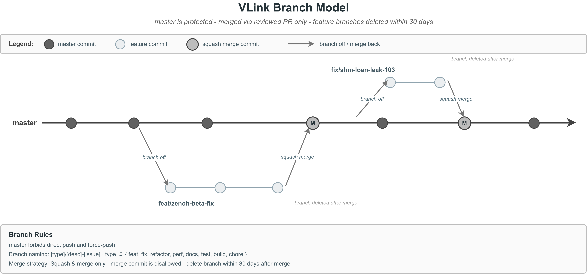

# 92. 项目与 PR 规范

> 本文覆盖 VLink 项目贡献者应遵守的工程规范：分支/提交/PR 流程、代码风格、测试要求、文档同步规则，以及 VLink 专属的 **transport 模块 / CLI 工具 / 示例 / drawio 图** 贡献要点。
>
> **核心原则**：拒绝"看起来像对的代码"，只接收"被验证过的代码"。
>
> **约定状态**：部分配套工具（如统一的 clang-tidy 检查脚本、统一的格式检查脚本、PR 模板、`.clang-tidy` 的 `WarningsAsErrors` 配置、pre-commit hook、CI 流水线）当前仓库内可能尚未落地——本文描述的是**目标规范**，新贡献者在对应工具上线前应以本文描述的精神作为自检标准。

目录：

1. [快速核对清单（Checklist）](#1-快速核对清单checklist)
2. [开发环境准入](#2-开发环境准入)
3. [分支策略](#3-分支策略)
4. [Commit 规范](#4-commit-规范)
5. [PR 规范](#5-pr-规范)
6. [代码风格](#6-代码风格)
7. [测试要求](#7-测试要求)
8. [文档同步规则](#8-文档同步规则)
9. [API / ABI 兼容性](#9-api--abi-兼容性)
10. [跨平台要求](#10-跨平台要求)
11. [性能与回归](#11-性能与回归)
12. [安全规范](#12-安全规范)
13. [示意图（drawio）贡献规则](#13-示意图drawio贡献规则)
14. [VLink 专属：新增 Transport 模块](#14-vlink-专属新增-transport-模块)
15. [VLink 专属：新增 CLI 工具](#15-vlink-专属新增-cli-工具)
16. [VLink 专属：新增 Example](#16-vlink-专属新增-example)
17. [VLink 专属：新增 Plugin 接口](#17-vlink-专属新增-plugin-接口)
18. [Code Review 清单](#18-code-review-清单)
19. [发布流程](#19-发布流程)
20. [禁止事项](#20-禁止事项)
21. [附录](#21-附录)

---

## 1. 快速核对清单（Checklist）

**提交 PR 前必须核对完毕，否则会被关闭并要求整改。**

### 1.1 代码
- [ ] 所有新 C++ 源文件顶部有 Apache 2.0 license header + 文件标注（见 [§6.4](#64-license-header)）
- [ ] **`clang-format` 通过**：`clang-format -i path/to/file.cc`
- [ ] **`clang-tidy` 必须通过 — 零告警、零错误**：若仓库提供统一检查脚本，则该脚本必须返回 0；否则按 [§6.5](#65-代码检查自动化-clang-format--clang-tidy) 的命令手工执行
- [ ] 新增的公共头文件有 Doxygen 注释（至少 `@brief` + `@param` + `@return`）
- [ ] 内部实现里**不残留** `TODO`、`FIXME`、`XXX`、占位文本；如确需标注，格式为 `// TODO(username, YYYY-MM-DD): what specifically`
- [ ] **代码注释一律用英文**（含 `//`、`/* */`、Doxygen 块、提交时自动生成的临时注释）；中文仅允许出现在 `doc/*.md`、`examples/**/README.md`、`CHANGELOG.md`、`README.md` 等文档资产中（英文副本位于 `README.en_us.md`）

### 1.2 构建
- [ ] `cmake -B build -DCMAKE_BUILD_TYPE=Debug` 过 —— 默认应开启 warning-as-error
- [ ] `cmake --build build -j` 全量通过（不是 `-j1` 偶发通过）
- [ ] 如果改了 module/CLI，对应的 `ENABLE_*` 开关两种取值（ON/OFF）都要构建通过
- [ ] **不提交 `build/` 目录**（`.gitignore` 已排除，但不要 `git add -f`）

### 1.3 测试
- [ ] 新功能至少 1 条 doctest case 覆盖正常 + 1 条覆盖边界/异常
- [ ] 修 bug 必须带**能重现该 bug** 的回归测试
- [ ] `ctest --test-dir build --output-on-failure` 全绿
- [ ] 如涉及 SHM/DDS：在本地起 `iox-roudi` 并跑至少一轮端到端联调

### 1.4 文档
- [ ] 改了 **数量类事实**（"N 个 transport"、"N 个 CLI"、"N 种序列化"等）时，以下位置同步：
  - `README.md`（中文，默认）+ `README.en_us.md`（英文副本）
  - `doc/00-whitepaper.md`（白皮书正文中的对应章节）
  - `doc/90-cheatsheet.md`
  - `doc/91-troubleshooting.md`（若影响排障建议）
  - `CHANGELOG.md`（放入当前未发布版本）
  - 相关模块 doc（例如 `doc/07-transport.md`、`doc/13-cli-tools.md` 等）
- [ ] 改了 CLI 子命令/选项 → 同步 `cli/<tool>/etc/completions/vlink-<tool>.{bash,zsh}` 两份补全脚本
- [ ] 改了 env 变量 → 同步 `doc/21-environment-vars.md`
- [ ] 新增/改示例 → 同级 `README.md` 更新；顶层 `doc/22-examples.md` 类别计数更新
- [ ] 涉及的 `doc/images/*.drawio` 若有文字过期 → 同时更新 `.drawio` 源 + 重新导出同名 `.png`

### 1.5 兼容性
- [ ] 公共头文件的任何签名改动 → 在 PR 描述中列出"破坏性变更"清单
- [ ] CMake 导出目标（`vlink::xxx`）若新增 → 同步 `doc/01-build.md` 的 CMake 目标列表，并按需更新 README 的集成示例

### 1.6 提交
- [ ] Commit 消息符合 [§4](#4-commit-规范) 规范
- [ ] PR 标题符合 [§5.1](#51-pr-标题)
- [ ] PR 描述按 [§5.2 模板](#52-pr-描述模板) 填写完整

---

## 2. 开发环境准入

### 2.1 最低版本要求

| 组件 | 最低版本 | 备注 |
|---|---|---|
| CMake | 3.15 | Conan 2 要求 3.15 |
| C++ 编译器 | GCC 9 / Clang 10 / MSVC 2019 / Apple Clang 12 | 必须支持 C++17 |
| Conan | 2.0 | 非强制，但推荐 |
| clang-format | 14 以上 | 更低版本对 `.clang-format` 某些选项兼容性不一致 |
| clang-tidy | 14 以上 | 与 clang-format 对齐 |
| Git | 2.25 | sparse-checkout / worktree 相关功能依赖 |
| drawio (CLI) | 24.x | 用于 headless 导出 PNG（参见 [§13](#13-示意图drawio贡献规则)） |

### 2.2 一次性准备

```bash
# 检查你的 clang-format/clang-tidy 是否安装
which clang-format clang-tidy
clang-format --version  # 必须 >= 14

# 一次性安装 git hooks（可选；仅在仓库提供 hook 模板时执行）
test -f tools/scripts/pre-commit && cp tools/scripts/pre-commit .git/hooks/pre-commit && chmod +x .git/hooks/pre-commit

# 跑一轮完整构建 + 测试，确认本地环境 OK
cmake -B build -DCMAKE_BUILD_TYPE=Debug -DENABLE_TEST=ON
cmake --build build -j
ctest --test-dir build --output-on-failure
```

### 2.3 禁用项

- **不要**用 IDE 格式化工具去"格式化整个文件"然后提交 —— 只允许 `clang-format -i` 格式化"你改动的行以及上下文必要的行"
- **不要**把 `.idea/`、`.vscode/settings.json`、`.qtcreator/` 等 IDE 个人化配置提交（已在 `.gitignore`）
- **不要**在仓库里跑 `pip install`、`npm install` 的全局安装
- **不要**提交任何 `.log`、`.json.bak`、`.so`、`.dll`、`.exe`、`.a`、`.pdb` 类二进制产物（`drawio` 导出的 `.png` 是**唯一例外**，因为它是文档组成部分）

---

## 3. 分支策略

### 3.1 分支模型

VLink 采用 **master + 功能分支（feature branch）** 模型：



- `master`：保护分支；不允许 `git push` 直推；禁止 force-push
- 功能分支：从 `master` 起；合并后 30 天内删除（防止分支爆炸）
- 发布分支（`release/vX.Y.Z`）：在打 tag 前短暂存在；打完 tag 即删

### 3.2 分支命名

格式：`<类型>/<短描述>-<issue 号?>`

| 类型 | 何时用 | 示例 |
|---|---|---|
| `feat/` | 新功能、新 API、新 module | `feat/add-websocket-transport-42` |
| `fix/` | bug 修复 | `fix/shm-loan-leak-103` |
| `refactor/` | 不改功能的代码重构 | `refactor/split-proxy-server` |
| `perf/` | 性能优化 | `perf/intra-queue-lockfree-77` |
| `docs/` | 仅改 doc / README / drawio | `docs/fix-cli-count-88` |
| `test/` | 仅加/改测试 | `test/bag-reader-edge-cases` |
| `build/` | 构建系统、CMake、Conan、CI | `build/add-qnx-toolchain` |
| `chore/` | 杂项（版本号、LICENSE 之类） | `chore/bump-fastcdr-version` |

规则：
- 全小写、以连字符 `-` 分词
- `<短描述>` 不超过 50 字符
- 最好带对应 issue 号
- **禁止** 用 `tmp/`、`test-1/`、`xxx/`、人名前缀等不规范命名

---

## 4. Commit 规范

VLink 采用 **Conventional Commits** 简化版。

### 4.1 格式

```
<type>(<scope>): <subject>

<body, optional>

<footer, optional>
```

### 4.2 type 合法值

| type | 含义 |
|---|---|
| `feat` | 新功能（面向用户可见）|
| `fix` | bug 修复 |
| `refactor` | 不改外部行为的结构调整 |
| `perf` | 性能优化 |
| `docs` | 仅文档 |
| `test` | 仅测试 |
| `build` | 构建系统/依赖升级 |
| `ci` | CI/CD 配置 |
| `chore` | 无归类的杂项（如版本号 bump） |
| `style` | 代码格式变动（极少见，单独成 commit） |
| `revert` | 明确的回滚 commit |

### 4.3 scope 常用值

`core` · `base` · `extension` · `impl` · `c_api` · `python_api` · `proxy` · `viewer` · `webviz` · `cli-<name>` · `module-<name>` · `examples` · `docs` · `cmake`

对跨多 scope 的改动，可省略 scope 或用 `*`。

### 4.4 subject 规则

- 英文祈使句、小写开头、不以句号结尾
- **不超过 72 字符**
- 禁止堆名词（`update code` 不合格，应写 `fix buffer-length check in mqtt publish`）
- 禁止无意义词（`various fixes`, `some improvements`, `misc`, `stuff`）——直接被拒

### 4.5 body 要求

**只有当 subject 已经说清楚时才省略 body**。body 应回答三件事：

1. **为什么** 做这个改动（上下文 / issue / 现象）
2. **怎么** 做的（核心设计，1-3 行，不要复述 diff）
3. **影响面** 是什么（行为变化、性能差异、ABI 影响）

每行 ≤ 72 字符。

### 4.6 footer

对以下场景**必须**带 footer：

```
BREAKING CHANGE: <描述破坏点，迁移提示>
Closes: #123, #124
Refs: #98
Signed-off-by: Your Name <you@example.com>   (如果项目要求 DCO)
```

### 4.7 合法示例

```
feat(module-mqtt): add TLS mutual-auth support via VLINK_SSL_CERT/KEY

Users deploying VLink to public-cloud IoT brokers need mTLS to satisfy
compliance. This wires the existing SslOptions struct through the Paho
MQTT C API.  Only the publish/subscribe paths are changed — the request/
response path still needs follow-up work (tracked in #211).

- SslOptions fields now honored on mqtt:// URLs
- Existing plain-TCP connections are unchanged

Refs: #207
```

```
docs: fix 8→9 CLI count across README and doc/00-overview

vlink-bench was added in v2.0.0 but multiple docs still claimed 8 tools.
Updated: root README (EN + ZH), doc/00-overview (TOC + §12.1 + §14),
doc/90-cheatsheet (tool table), cli-tools-overview.drawio (+ PNG).
```

### 4.8 非法示例

- `wip` —— 不允许
- `update` —— 说得跟没说一样
- `fix bug` —— 哪个 bug？
- `改了下代码` —— 中英混杂且无信息量
- `Merge branch 'master' into feat/...` —— PR 里不应有 merge commit（用 rebase）

---

## 5. PR 规范

### 5.1 PR 标题

PR 标题 = **这次改动最重要的那条 commit 的 subject**。同一规则（小写开头、≤72 字符、祈使句、含 type/scope）。

```
feat(module-zenoh): expose keyexpr cache size via URL query
fix(viewer): resolve Qt6 OpenGLWidgets missing on ARM macOS
docs: align cheatsheet with v2.0.0 API snapshot
```

### 5.2 PR 描述模板

每个 PR 必须按以下模板填写。若仓库尚未提供 `.github/PULL_REQUEST_TEMPLATE.md`，以本节模板为准：

```markdown
## 背景（Why）

简述问题 / 动机 / 上下文。如果有 issue，放链接：`Closes #123`。

## 改动（What）

- 主要改了什么（≤5 条 bullet）
- 设计选择与权衡：为什么不是方案 B
- 哪些是**破坏性变更**？

## 影响面

- [ ] 影响的 CMake 目标 / 模块：
- [ ] 影响的公共头文件 / API：
- [ ] 影响的 env 变量 / URL query 参数：
- [ ] 对已有示例 / 测试 / doc 的连带改动：

## 验证（How)

- 本地构建：`cmake -B build && cmake --build build`  ✅
- 单测：`ctest --test-dir build --output-on-failure`  ✅
- 端到端（列出相关的手工测试步骤）：
  - `iox-roudi &` + `vlink-bag record -u shm://test/topic` + ...

## 截图 / 日志（如有）

<粘贴终端输出或界面截图>

## Checklist

照 [§1 快速核对清单](#1-快速核对清单checklist)。至少列全"完成 / 未完成"。
```

### 5.3 PR 大小

- **理想**：diff 控制在 400 行以内（不含测试与自动生成代码）
- **上限**：超过 1000 行基本会被要求拆分；跨模块大改动应拆成"重构 → 接入 → 清理"多个 PR
- 同一 PR 里**不要** 混合 "新功能" + "不相关的格式化" + "不相关的 rename"

### 5.4 评审响应

- 作者在 PR 创建后 48h 内要回应首轮评审（除非写明"RFC"、"WIP"）
- 评审者评论后 3 个工作日无响应 → PR 可被 `stale` 标签并暂缓合并
- **禁止** force-push 覆盖历史；追加 commit 推进评审，合并时再 squash

### 5.5 合并策略

- **默认**：`Squash and merge`，把 PR 合成 1 条 commit（message 用 PR 标题 + body）
- 例外：多个逻辑独立、每个都已单测覆盖的 commit 可用 `Rebase and merge`（由维护者判断）
- **禁止**：`Create a merge commit`（会污染历史）

---

## 6. 代码风格

### 6.1 C++ 风格

基础：**Google C++ Style Guide**，加上 `.clang-format` 里的项目定制（`ColumnLimit: 120`、`BasedOnStyle: Google`）。

- **缩进**：2 空格，不用 Tab
- **行宽**：120 字符硬上限
- **命名**：
  - 文件名：`snake_case.{h,cc}`
  - 类名：`PascalCase`
  - 函数/方法：`snake_case()`
  - 成员变量：`snake_case_`（尾下划线）
  - 常量：`kPascalCase`（前缀 `k`）
  - 宏：`SCREAMING_SNAKE_CASE`
  - 命名空间：`snake_case`
  - 模板类型形参：`PascalCase` 加 `T` 后缀（`MsgT`, `SecT`）
- **头文件守卫**：全项目统一 `#pragma once`（不用 `#ifndef`/`#define`）
- **include 顺序**：
  ```cpp
  // 1. 本文件对应的头（若是 .cc 文件）
  #include "my_impl.h"
  
  // 2. C 系统头
  #include <sys/socket.h>
  
  // 3. C++ 标准库（按字母序）
  #include <atomic>
  #include <string>
  #include <vector>
  
  // 4. 第三方库
  #include <fastdds/dds/...>
  #include <spdlog/...>
  
  // 5. 项目头（按字母序）
  #include "vlink/base/bytes.h"
  #include "vlink/impl/node.h"
  ```
- **指针 vs 引用**：优先值语义 + 右值引用；接口需要可空用指针，不可空用引用
- **`const` 正确性**：能 const 的成员函数必须 `const`；方法返回对象的 `const T&` 要谨慎（避免悬垂）
- **禁用**：`using namespace std;` 在头文件里；裸 `new`/`delete`（用 RAII / `std::unique_ptr`）；C-style cast；`NULL`（用 `nullptr`）

### 6.2 注释语言

**所有代码注释必须使用英文，不允许出现中文字符。** 此规则覆盖：

| 位置 | 要求 |
|---|---|
| `//` 行注释、`/* ... */` 块注释 | 英文 |
| Doxygen 注释块（`/** ... */` / `///`） | 英文 |
| 宏 / 枚举 / 结构体字段旁的短注释 | 英文 |
| `CMakeLists.txt` 里的 `#` 注释 | 英文 |
| shell / python / batch 脚本里的注释 | 英文 |
| 提交前临时标记（`TODO(user, date): …`） | 英文 |

**允许中文的场景**：
- `doc/**/*.md`（中文教程与参考）
- `README.md`（默认中文主 README，英文副本为 `README.en_us.md`）
- `CHANGELOG.md` 的发布说明段落（如有中文 release notes）
- `examples/**/README.md` 中的说明
- 任何 `.md` / `.txt` 类非源码文档

**违反本规则的代码会被 CI grep 拦截。** 如果某个术语（如"北斗"、"国标"）确实需要中文出现在代码里，请在 PR 描述中说明并附加 `// NOLINT: chinese-ok <reason>` 注释。

**错误示例**：
```cpp
// ❌ 这里尝试获取发布者的配置   (中文，违规)
auto conf = publisher.get_conf();

/** @brief 将消息序列化为字节流     (中文 Doxygen，违规) */
Bytes serialize(const MsgT& msg);

// TODO(张三): 修复内存泄漏          (中文 TODO，违规)
```

**正确示例**：
```cpp
// ✅ Retrieve the publisher's current configuration.
auto conf = publisher.get_conf();

/** @brief Serialise @p msg into a raw byte buffer. */
Bytes serialize(const MsgT& msg);

// TODO(zhangsan, 2026-05-01): fix the shallow-copy leak on loan path.
```

### 6.3 Doxygen 注释

所有**公共头文件**（`include/vlink/**`）的导出类/函数/枚举都要有 Doxygen 注释，推荐格式：

```cpp
/**
 * @brief One-line summary (< 80 chars).
 *
 * @details
 * Longer explanation. Multiple paragraphs allowed.
 *
 * @tparam T  Message type (deduced by Serializer).
 * @param[in]  url  Target URL, e.g. "shm://sensor/imu".
 * @param[out] out  Filled on success.
 * @return  @c true on success; @c false if URL is malformed.
 *
 * @note  Must be called from the node's MessageLoop thread.
 * @warning  Does not take ownership of @p data.
 * @see  Subscriber::listen
 * @since  v2.0.0
 */
```

要点：
- 用 `@c` / `@p` / `@ref` 等 Doxygen 标记（`.clang-tidy` 会检）
- 代码块用 `@code ... @endcode`，语言用 `@code{.cpp}`
- **不要** 写"参数 a: 第一个参数"这类没有信息量的注释

### 6.4 License header

所有新建的 C/C++ 源文件必须以下列 header 开头：

```cpp
/*
 * Copyright (C) <YEAR> by Thun Lu. All rights reserved.
 * Author: <Your Name> <your.email@example.com>
 * Repo:   https://github.com/thun-res/vlink
 *  _    __   __      _           __
 * | |  / /  / /     (_) ____    / /__
 * | | / /  / /     / / / __ \  / //_/
 * | |/ /  / /___  / / / / / / / ,<
 * |___/  /_____/ /_/ /_/ /_/ /_/|_|
 *
 * Licensed under the Apache License, Version 2.0 (the "License");
 * you may not use this file except in compliance with the License.
 * You may obtain a copy of the License at
 *
 *     http://www.apache.org/licenses/LICENSE-2.0
 *
 * Unless required by applicable law or agreed to in writing, software
 * distributed under the License is distributed on an "AS IS" BASIS,
 * WITHOUT WARRANTIES OR CONDITIONS OF ANY KIND, either express or implied.
 * See the License for the specific language governing permissions and
 * limitations under the License.
 */
```

ASCII art logo 块可直接 copy 自任意现有 VLink 源文件。`<YEAR>` 填创建年份，后续修改不用改年份。

对 CMake 文件、shell 脚本、Python 脚本，用相应注释风格转写同一段 license 文本。

### 6.5 代码检查自动化 (clang-format + clang-tidy)

**每一个 PR 都必须通过 `clang-format` 与 `clang-tidy` 两关，无条件。**

项目根目录的 `.clang-tidy` 配置里显式设置了 `WarningsAsErrors: '*'`，意味着 **任何新增 clang-tidy 警告都会直接让 CI 失败**，PR 无法合并。不是"尽量"、不是"有空再改"——是**硬门槛**。

CI（每个 PR / push 触发）依次执行：

```bash
# 1) 格式检查 — 任一行不符合 .clang-format 即失败。
# 若仓库尚未提供统一脚本，用 git diff 限定本次改动文件后执行 clang-format 校验。
git diff --name-only --diff-filter=ACMR origin/master...HEAD \
  | grep -E '\.(cc|cpp|cxx|h|hpp)$' \
  | xargs -r clang-format --dry-run --Werror

# 2) clang-tidy 检查 — 整个改动树的所有 C/C++ 文件都要过。
# 若仓库提供统一检查脚本，以脚本为准；否则使用 compile_commands.json 对改动文件逐个运行。
cmake -B build-tidy -DCMAKE_BUILD_TYPE=Debug -DCMAKE_EXPORT_COMPILE_COMMANDS=ON
git diff --name-only --diff-filter=ACMR origin/master...HEAD \
  | grep -E '\.(cc|cpp|cxx)$' \
  | xargs -r -n1 clang-tidy -p build-tidy

# 3) 完整构建（Debug + Release 两种配置；ENABLE_CLI_* 的开/关都要过）
cmake -B build-debug   -DCMAKE_BUILD_TYPE=Debug -DENABLE_TEST=ON
cmake -B build-release -DCMAKE_BUILD_TYPE=Release -DENABLE_TEST=ON
cmake --build build-debug -j
cmake --build build-release -j

# 4) 单测
ctest --test-dir build-debug --output-on-failure
```

**本地提前跑**（强烈推荐，节省 CI 轮次）：

```bash
# 原地格式化本次改动（没有统一脚本时）
git diff --name-only --diff-filter=ACMR HEAD \
  | grep -E '\.(cc|cpp|cxx|h|hpp)$' \
  | xargs -r clang-format -i

# clang-tidy 扫描本次改动（没有统一脚本时）
cmake -B build-tidy -DCMAKE_BUILD_TYPE=Debug -DCMAKE_EXPORT_COMPILE_COMMANDS=ON
git diff --name-only --diff-filter=ACMR HEAD \
  | grep -E '\.(cc|cpp|cxx)$' \
  | xargs -r -n1 clang-tidy -p build-tidy

# 或只看你改动的文件（更快）
git diff --name-only --diff-filter=ACMR HEAD \
  | grep -E '\.(cc|cpp|cxx)$' \
  | xargs -r -n1 clang-tidy -p build-tidy
```

**常见触发 clang-tidy 失败的写法**（预先自查）：

| 警告 | 触发写法 | 修法 |
|---|---|---|
| `bugprone-unchecked-optional-access` | `*opt` 未先判 `opt.has_value()` | 用 `if (opt) { … *opt … }` |
| `readability-qualified-auto` | `auto p = v.data()` (是指针却省略 `*`) | 写 `auto* p = v.data()` |
| `modernize-use-nullptr` | 用 `NULL` / `0` 代表空指针 | 用 `nullptr` |
| `performance-unnecessary-value-param` | 大对象按值传参且不会修改 | `const T&` |
| `cppcoreguidelines-pro-bounds-pointer-arithmetic` | 直接在指针上 `+offset` | 用 `std::span` / `gsl::span` 或直接换成 `operator[]` |
| `readability-implicit-bool-conversion` | `if (ptr) { … }` 对非指针类型 | 显式写 `if (ptr != nullptr)` 或 `if (val != 0)` |
| `google-readability-todo` | `// TODO:` 没带用户名和日期 | 改 `// TODO(user, 2026-05-01): …` |
| `readability-identifier-naming` | 命名不符合 §6.1 约定 | 按风格改 |

**如何绕开（仅在有明确原因时）**：

```cpp
// NOLINTNEXTLINE(<check-name>): <reason, one line>
auto x = questionable_call();
```

`NOLINT` 行必须同时满足：① 指定具体 check 名，不允许裸 `NOLINT`；② 同行或上一行有 `// reason:` 说明。Review 会严查滥用。

**静态检查必须本地先跑干净再推远程**——在 PR 里让 CI 帮你找 lint 问题会被 reviewer 要求整改再重提。

---

## 7. 测试要求

### 7.1 测试框架

- 单元测试：**doctest**（在 `test/` 目录）
- 集成测试：同样用 doctest，但文件名以 `_integration_test.cc` 结尾
- 基准测试：用 `vlink-bench`（不是 Google benchmark）

### 7.2 新代码覆盖要求

- 新 `.cc` 文件 → 必须有对应的 `test/<same-path>_test.cc`
- 修 bug → 必须先写重现该 bug 的**失败**测试，再让修复让它变绿
- 仅删代码 → 可以只修测试，不必新增
- 所有公共 API（`include/vlink/**` 里的导出类/函数）都要有正向 + 异常路径的测试

### 7.3 测试命名

```cpp
TEST_CASE("Publisher::publish returns false when no subscribers and force=false") {
  SUBCASE("intra:// endpoint") { ... }
  SUBCASE("shm:// endpoint with RouDi down") { ... }
}
```

- `TEST_CASE` 描述：用**完整英文句子**讲清楚"对象 + 行为 + 前置条件"
- `SUBCASE` 描述：用名词短语说清楚场景

### 7.4 禁用的测试风格

- **禁止** 在测试里 `sleep_for(500ms)` —— 用事件同步（`wait_for` / `condition_variable` / `std::future`）
- **禁止** 把测试依赖互联网（下载资源、调远程 API）
- **禁止** 在测试里写入 `/tmp` 之外的磁盘路径，除非用 `doctest::TempPath` 之类
- **禁止** 并发测试彼此污染同一个 DDS domain / SHM 段（用随机化的 domain ID / topic prefix）

### 7.5 doctest 宏使用约定

本项目**统一**使用：

- `CHECK(a == b)` ← **优先**，不用 `CHECK_EQ(a, b)`
- `CHECK(a != b)`，`CHECK(a < b)`，`CHECK(a >= b)`
- `REQUIRE(condition)` —— 只用于"失败后继续跑其他断言已经无意义"的场景
- `CHECK_THROWS_AS(expr, vlink::Exception::RuntimeError)`
- `CHECK_NOTHROW(expr)`

---

## 8. 文档同步规则

### 8.1 数量类事实的传播链

某些"计数型"事实横跨多个文档，修改时必须**一次改全**：

| 事实 | 必须更新的位置 |
|---|---|
| CLI 工具数量 | 根 README ×2（中文 + `README.en_us.md`）/ `doc/00-whitepaper.md` 相关章节 / `doc/13-cli-tools.md` / `doc/90-cheatsheet.md` / `cli-tools-overview.drawio` + PNG / `foreword-cli-tools-table.drawio` + PNG / `CHANGELOG.md` |
| transport 模块数量 | 同上，外加 `doc/07-transport.md` / `doc/00-whitepaper.md` 摘要段落 |
| 序列化类型数量 | `doc/06-serialization.md` / `include/vlink/serializer.h` / 根 README / `doc/90-cheatsheet.md` |
| QoS 预设数量 | `include/vlink/extension/qos_profile.h` 的 docstring 表 / `doc/08-qos.md` / `doc/90-cheatsheet.md` / `CHANGELOG.md` |
| base 库组件数量 | `doc/11-base-library.md` 的表格 + 摘要 |
| 示例数量 / 类别 | `doc/22-examples.md` 类别计数 / 各 `examples/<category>/README.md` |
| 环境变量 | `doc/21-environment-vars.md` / `doc/90-cheatsheet.md` |
| CMake 选项 | 根 README "Available CMake targets" / `doc/01-build.md` / `doc/00-whitepaper.md` "常用构建选项" |

**违反"一次改全"原则的 PR 将被拒绝。**

### 8.2 CLI completion 脚本

改了 CLI 的任何**子命令 / 顶层选项**，必须更新：
- `cli/<tool>/etc/completions/vlink-<tool>.bash`
- `cli/<tool>/etc/completions/vlink-<tool>.zsh`

两份文件必须列举**完全相同**的子命令集合。

### 8.3 Doxygen 注释 vs 教程文档

- 公共 API 的"**如何调用**"写在 Doxygen 注释里（`include/vlink/**`）
- 功能的"**是什么 / 为什么**"和**使用模式**写在 `doc/`
- **禁止** 把 Doxygen 注释里的内容大段复制进教程 doc（过时风险）——应只在教程里引一个例子 + 链接到头文件

### 8.4 内部链接

所有跨 doc 引用都用相对路径 + markdown 锚点：

```markdown
参见 [02-node-lifecycle.md#3-生命周期管理](02-node-lifecycle.md#3-生命周期管理)
```

**禁止**：绝对 URL / github.com 直链 / 形如 `/doc/xxx.md` 的项目根绝对路径（会在 fork 中错）。

---

## 9. API / ABI 兼容性

### 9.1 SemVer 承诺

VLink 遵循 [Semantic Versioning 2.0](https://semver.org)：

- **MAJOR**（`vX.0.0`）：可以有破坏性改动，但必须在 CHANGELOG 明确列出
- **MINOR**（`v2.Y.0`）：只加不改；API 前后兼容
- **PATCH**（`v2.0.Z`）：bug 修复，不能改 API，也不能改 ABI

### 9.2 破坏性变更判定

以下**都** 算破坏性（需走 MAJOR）：

- 删除或 rename 任何 `include/vlink/**` 里的公共符号
- 改变现有公共函数/方法的签名（入参/返回值/默认值）
- 改 enum 值的整数（例如把 `kReliable=1` 改成 `=2`）
- 改结构体字段顺序或类型（影响 ABI）
- 改 URL scheme 或 query 参数名
- 改 CLI 子命令/顶级 flag 名
- 改 CMake 导出目标名
- 改 C API 返回码整数值
- 改 env 变量名

以下**不** 算破坏性（可走 MINOR）：

- 新增 public symbol
- 新增 enum 值（放末尾；不改已有值）
- 新增 struct 字段（放末尾）
- 新增 URL query 参数
- 新增 CLI 子命令
- 新增 CMake 选项（默认值保持"对存量构建无影响"）

### 9.3 Deprecation

弃用但不立即删除的 API：

```cpp
[[deprecated("use new_function() since v2.5.0")]]
void old_function();
```

弃用的 API 至少保留到**下一个 MAJOR 版本**才能删。

---

## 10. 跨平台要求

### 10.1 支持矩阵

见根 [README](../README.md) 的平台支持表。

### 10.2 跨平台开发约定

- 系统头文件用 `<>`，不用 `""`
- 条件编译集中写，别散落在函数体内部。典型模板：
  ```cpp
  #if defined(_WIN32)
    #include <windows.h>
  #elif defined(__linux__) || defined(__ANDROID__)
    #include <sys/socket.h>
  #elif defined(__APPLE__)
    #include <sys/types.h>
  #elif defined(__QNX__)
    #include <sys/netmgr.h>
  #endif
  ```
- 文件路径分隔符：只用 `/`；`\` 只出现在 Windows 路径字面量里
- 线程 API：优先用 `std::thread`、`std::atomic`、`std::mutex`；需要高性能时再用 `base/spin_lock.h` / `base/semaphore.h`
- 时间 API：用 `std::chrono`，禁止混用 `time()` / `gettimeofday()` / `GetSystemTime()`
- 整数类型：用 `<cstdint>` 的定长类型（`int32_t` / `int64_t` / `uint8_t`），不用 `int` / `long`（Windows 和 Linux 对 long 的宽度不一致）

### 10.3 QNX / Android 特别注意

- QNX：不使用 Linux 专有的 `epoll`、`signalfd`、`eventfd`；相关路径用 `poll` + 管道
- Android：不链接 GNU-only 符号（glibc 扩展）；链接 bionic；`pthread_cancel` 不可用
- 两者在 CMakeLists.txt 里通过 `target_compile_definitions` 设置区分

---

## 11. 性能与回归

### 11.1 性能测试

- 所有"快路径"（publish / invoke / listen 回调链路）修改必须跑一轮 `vlink-bench run --preset quick` 并对比 HEAD 基线
- PR 描述里贴截屏或对比表；性能下降 >5% 必须在评审中说明原因或回滚

### 11.2 性能约束

- `publish()` 快路径：不允许堆分配（SBO 里走）；不允许锁竞争（用 `base/mpmc_queue.h` 或 `spin_lock.h`）
- `Subscriber` 回调：不允许在内部线程阻塞超过 1ms；重活交给 `ThreadPool`
- Logger 热路径：用 `VLOG_T` / `VLOG_D`（Release 下被编译器消除），不用 `CLOG_*`（printf 格式化开销）

### 11.3 资源使用

- 不允许任何无上界的容器（`std::vector` 不 `reserve()`、任意深度递归、无 TTL 的 cache）
- 全局状态要么是进程级单例（生命周期与进程同生共死，可选提供 trim 入口，例如 `MemoryPool::global_instance().clear()` 仅释放空闲 chunk），要么提供显式销毁接口；不允许介于两者之间的"半途而废"全局对象

---

## 12. 安全规范

### 12.1 Secret 管理

- **绝对** 不要把密钥、证书、token、passphrase 提交到仓库
- `.gitignore` 已排除 `*.key` / `*.pem` / `*.p12`；新增类型的 secret 要补 `.gitignore`
- 需要测试用密钥时，放 `test/fixtures/` 并用**明显标注"TEST ONLY"的自签证书**

### 12.2 输入校验

- 所有公共 API 必须**在入口**校验输入（不为空、边界范围、类型合法）
- 从外部（URL、env、文件、网络）来的字符串长度要有上限（见 `src/extension/discovery_reporter.cc:301` 的 `trim_url.size() > 300` 检查）
- 反序列化前必须校验 size / CRC / 魔数头

### 12.3 加密

- 只用项目内置的 `vlink::extension::Security`（OpenSSL EVP 接口）或业务回调，**不允许**直接调 OpenSSL 低层 API 散在业务代码里
- 禁止手搓 AES / RSA 实现

### 12.4 安全审查触发点

以下改动**必须**走 security review（PR 里打 `security-review` 标签）：

- 修改 `src/extension/security.cc`
- 修改 `modules/*/` 下任何处理加密 payload 的代码
- 新增密钥管理 / 证书加载 / 签名相关逻辑
- 修改网络/DDS/MQTT 的认证握手流程

---

## 13. 示意图（drawio）贡献规则

### 13.1 文件组织

- 源文件：`doc/images/<topic>.drawio`
- 导出：`doc/images/<topic>.png`
- 两者**必须同名成对提交**；任何只改 `.png` 不改 `.drawio` 的 PR 会被拒

### 13.2 导出命令

```bash
cd doc/images/
drawio --no-sandbox -x -f png -o <topic>.png <topic>.drawio
```

无 GUI 环境（CI / SSH）必须带 `--no-sandbox`。

### 13.3 样式约定

- 画布大小视内容定，但**不要**留大片空白
- 统一配色（对应文档章节 Part）：
  - Part I 入门：浅绿 `#d5e8d4` / `#82b366`
  - Part II 通信模型：浅蓝 `#dae8fc` / `#6c8ebf`
  - Part III 基础库：浅黄 `#fff2cc` / `#d6b656`
  - Part IV 工具链：浅紫 `#e1d5e7` / `#9673a6`
  - Part V 高级/参考：浅红 `#f8cecc` / `#b85450`
  - 辅助 / 速查：浅灰 `#f5f5f5` / `#666666`
- 字号 ≥ 11pt（PNG 在小屏上仍可读）
- 字体：Helvetica / Arial（drawio 默认即可）

### 13.4 图与 doc 的绑定

- 每张图在引用它的 doc 里必须至少**提一个锚点**（标题或 `images/<name>.png` 形式的图片引用）
- 改代码时若影响图面信息（CLI 数量、transport 数量、枚举、流程），**同时** 改 drawio 源 + 重生 PNG
- 没有引用的孤儿 drawio 会被周期性清理

---

## 14. VLink 专属：新增 Transport 模块

新加一个 transport（例如要增加 `ros2://`）的完整 checklist：

### 14.1 代码
- [ ] 在 `include/vlink/impl/types.h` 的 `enum class TransportType` 末尾加新值（**不要** 插在中间，保留整数稳定）
- [ ] 在 `modules/` 下新建 `modules/<name>/` 目录，仿照 `modules/mqtt/` 结构
- [ ] `modules/<name>/CMakeLists.txt`：
  - 定义 `SKIP_<NAME>` 选项（beta 建议默认 ON）
  - 定义 `VLINK_SUPPORT_<NAME>` 编译宏
  - 在缺依赖时 `return()`，不要 `FATAL_ERROR`
- [ ] 实现 6 个原语的工厂类：Publisher / Subscriber / Server / Client / Setter / Getter
- [ ] URL 解析在 `<name>_conf.cc`：非法时抛 `Exception::RuntimeError`（参考 `modules/mqtt/src/mqtt_conf.cc`）

### 14.2 构建集成
- [ ] 在根 `CMakeLists.txt` 的 `modules/` 扫描列表里加入（如适用）
- [ ] 新增 CMake target：`vlink::<name>`
- [ ] 更新根 `README.md`（中文）与 `README.en_us.md`（英文）的 transport 表 + target 列表
- [ ] 更新 `doc/07-transport.md`（加详细行）
- [ ] 更新 `doc/90-cheatsheet.md` 的 Transport 表

### 14.3 测试
- [ ] `test/modules/<name>/` 至少覆盖：Pub/Sub 双向、Server/Client 双向、Setter/Getter 双向
- [ ] 如果依赖外部 broker（如 mqtt），测试要能用 `--docker` 起 broker（参照 `test/modules/mqtt/`）

### 14.4 文档
- [ ] 示例：`examples/url_guide/url_<name>/` 新建一个完整示例 + README
- [ ] 诊断：在 `doc/91-troubleshooting.md` 加一节"§N. <name>:// 专属问题"
- [ ] drawio：`doc/images/transport-decision-tree.drawio` 的决策树里加新分支 + 重生 PNG

### 14.5 CHANGELOG
- [ ] 在 `CHANGELOG.md` 当前未发布版本下加：
  ```
  - New transport: `<name>://` (backed by <dependency>, beta). See doc/07.
  ```

---

## 15. VLink 专属：新增 CLI 工具

完整 checklist：

- [ ] `cli/<toolname>/` 目录，含 `main.cc` / `<tool>.cc` / `<tool>.h` / `CMakeLists.txt`
- [ ] CMake 里 `project(vlink-<toolname> LANGUAGES CXX)` + `add_executable`
- [ ] 根 `CMakeLists.txt` 加 `option(ENABLE_CLI_<TOOLNAME>)` 和 `add_subdirectory`
- [ ] 工具名统一 `vlink-<toolname>`；install 时创建无前缀符号链接
- [ ] `-h / --help` 和 `-v / --version` 支持；argparse 统一用项目内置实现
- [ ] 补全脚本：`cli/<toolname>/etc/completions/vlink-<toolname>.bash` + `.zsh`
- [ ] 更新：根 README ×2 / `doc/00-whitepaper.md` / `doc/13-cli-tools.md` / `doc/90-cheatsheet.md` / CLI 数量计数
- [ ] drawio：`cli-tools-overview.drawio` + `foreword-cli-tools-table.drawio` 加新条目 + 重生 PNG
- [ ] 示例 / 文档里至少有一个 `vlink-<toolname> ...` 的完整调用示例

---

## 16. VLink 专属：新增 Example

在 `examples/<category>/<name>/` 下：

- [ ] `CMakeLists.txt`：`add_executable(<name>_example ...)` + `target_link_libraries(... PRIVATE vlink::...)`
- [ ] `README.md`：必须包含
  - 一句话说明示例目标
  - 使用到的 API 列表
  - 怎么运行（包括需要预先起什么：RouDi / broker / ...）
  - 预期输出（至少贴 2-3 行）
- [ ] 源码：一个文件 ≤ 300 行；凡超过就拆或证明它是整体必要的
- [ ] 更新 `examples/<category>/CMakeLists.txt` 的 `add_subdirectory`
- [ ] 更新 `doc/22-examples.md` 的 `<category>` 计数和描述

---

## 17. VLink 专属：新增 Plugin 接口

新的 plugin 接口（Conf / Logger / Schema / Runnable / UrlRemap 之外）：

- [ ] `include/vlink/extension/<name>_plugin_interface.h` 定义抽象基类
  - 所有虚函数声明为 `= 0`
  - 必须有虚析构函数
  - 必须有 `get_plugin_id()` / `get_version_major()` / `get_version_minor()`
- [ ] 在 `src/base/plugin.cc` 的已知插件表里登记
- [ ] 提供一个参考实现 `examples/plugin/plugin_<name>/`
- [ ] 文档：更新 `doc/19-extensions.md` 的"5 种插件类型"计数与说明

---

## 18. Code Review 清单

**评审者视角**。每个 PR 过 reviewer 时，逐项核对：

### 18.1 是否该做

- [ ] 这个改动解决的是真实问题吗？有 issue / 设计讨论记录吗？
- [ ] 有没有更小的改法？有没有人已经在做类似事？
- [ ] 时机对吗？（feature freeze 期 / release 前禁止大改）

### 18.2 设计

- [ ] 新 API 面是否最小？有没有不必要的公共符号暴露？
- [ ] 命名是否符合项目习惯？（见 [§6.1](#61-c-风格)）
- [ ] 是否避免了不必要的抽象 / 继承层级 / 模板元编程？
- [ ] 异常路径是否被正确处理（不是"catch 了然后 return 吞掉"）？
- [ ] 是否侵入了业务层？（VLink 理念：transport 是底层细节）

### 18.3 正确性

- [ ] 多线程数据竞争？（尤其是涉及 MessageLoop / ThreadPool 的改动）
- [ ] 生命周期管理？（智能指针循环引用、loan 不释放）
- [ ] 整数溢出 / 未处理的失败 IO 调用？
- [ ] 跨平台假设是否成立？（sizeof / alignment / endian / signed-shift）

### 18.4 可读性

- [ ] 命名足够表意（变量名不是 `x`, `tmp`, `data2`）
- [ ] 注释解释"为什么"（不是"是什么"——那已经写在代码里了）
- [ ] 函数长度 ≤ 80 行；深度嵌套 ≤ 4 层

### 18.5 测试

- [ ] 正常路径被测到
- [ ] 边界（空输入、极端尺寸、并发）被测到
- [ ] 异常路径被测到（`CHECK_THROWS_AS`）
- [ ] 测试名称可读、不依赖执行顺序

### 18.6 文档

- [ ] Doxygen 完整（公共 API）
- [ ] 相关 doc 同步（`doc/` 下对应 md、cheatsheet、CHANGELOG）
- [ ] drawio 同步（如涉及）

### 18.7 最后签批

维护者在所有项都通过后，用"Approve"；如有疑虑用"Request changes"并在 PR 里明确列出阻塞项。

---

## 19. 发布流程

仅维护者操作，贡献者了解即可。

### 19.1 版本号

- MAJOR：`v3.0.0` 当有破坏性变更
- MINOR：`v2.1.0` 当有功能新增（且 API 向后兼容）
- PATCH：`v2.0.1` 当只有 bug 修复

### 19.2 步骤

1. 打开 `release/vX.Y.Z` 分支
2. 更新 `version.txt` / `CMakeLists.txt` 的版本号
3. 整理 `CHANGELOG.md` 的 `Unreleased` 段 → 正式版本段
4. 跑完整 CI（所有平台、所有模块）
5. 合并 `release/vX.Y.Z` 到 `master`（带 `Rebase and merge`）
6. 在 master 上打 annotated tag：`git tag -a vX.Y.Z -m "Release vX.Y.Z"`
7. `git push origin vX.Y.Z`
8. 触发 release workflow（构建二进制、发布到 conan）
9. 删 `release/` 分支

### 19.3 紧急 patch（hotfix）

- 从最后一个 tag 起分支 `hotfix/vX.Y.Z+1`
- 只接收 fix 类 commit
- 打 tag 后 cherry-pick 相关 fix 到 `master`（如果 master 已经发散）

---

## 20. 禁止事项

⛔ 以下行为**直接拒绝**，不讨论：

1. **在 `master` 上直接 push**（包括 force-push）
2. **绕过 CI 合并 PR**（即使你是维护者）
3. **在公共 API 里改 enum 整数值**（不经 MAJOR 升级）
4. **在 commit 消息里写"WIP"、"fix"、"update"、"test" 等无信息量内容**
5. **把密钥、token、证书、passphrase 提交到仓库**
6. **删除别人的代码时不在 PR 描述里说明**
7. **在 PR 里夹带不相关的大段格式化 / rename**
8. **用 AI 生成的大段注释 / doc 未经人工校对就提交**
9. **引入新的 third-party 依赖但不更新 `conanfile.py` / `CMakeLists.txt` / 构建文档**
10. **把 doc 里的中文 / 英文版本改得不对称**（本项目要求根 README、`doc/` 主要内容双语对齐）
11. **commit 里包含构建产物**（`build/`、`.so`、`.exe`、`.a`）
12. **把 `VLINK_LOG_LEVEL=0` 之类调试配置写进代码作为默认值**
13. **在 `.h` 里用 `using namespace`**
14. **在头文件里放函数定义（除非是 template / constexpr / inline）**
15. **在热路径用 `std::regex` / `std::stringstream` / `boost::format`**
16. **在 C++ / C / CMake / shell / python 源码里写中文注释**（见 [§6.2](#62-注释语言)；`.md` / `.txt` 文档不受此限）
17. **绕过 clang-tidy 检查合并 PR**（`WarningsAsErrors: '*'` 是硬门槛；见 [§6.5](#65-代码检查自动化-clang-format--clang-tidy)）—— 任何未通过统一检查脚本或等价手工命令的 PR 不允许合并，哪怕只差一条 warning

---

## 21. 附录

### 21.1 工具快捷命令

```bash
# 格式化本地所有改动
git diff --name-only --diff-filter=ACMR HEAD \
  | grep -E '\.(cc|cpp|cxx|h|hpp)$' \
  | xargs -r clang-format -i

# 检查（clang-tidy 等）
cmake -B build-tidy -DCMAKE_BUILD_TYPE=Debug -DCMAKE_EXPORT_COMPILE_COMMANDS=ON
git diff --name-only --diff-filter=ACMR HEAD \
  | grep -E '\.(cc|cpp|cxx)$' \
  | xargs -r -n1 clang-tidy -p build-tidy

# 只格式化当前 diff
git diff --name-only --diff-filter=ACMR HEAD \
  | grep -E '\.(cc|cpp|cxx|h|hpp)$' \
  | xargs -r clang-format -i

# 本地跑全套 CI 类检查
cmake -B build-check -DCMAKE_BUILD_TYPE=Debug -DENABLE_TEST=ON
cmake --build build-check -j
ctest --test-dir build-check --output-on-failure
git diff --name-only --diff-filter=ACMR HEAD \
  | grep -E '\.(cc|cpp|cxx|h|hpp)$' \
  | xargs -r clang-format --dry-run --Werror
```

### 21.2 Git 常用片段

```bash
# 从最新 master 起功能分支
git fetch origin master
git checkout -b feat/my-feature origin/master

# 在 PR 被要求整改后压缩 commit
git rebase -i origin/master   # squash / reword 相关行
git push --force-with-lease

# 回滚某个文件到 master 版本
git checkout origin/master -- path/to/file.cc

# 看某行最近一次修改
git blame path/to/file.cc | grep -n "pattern"
```

### 21.3 经常用错的事实（速查）

- **CLI 工具数量 = 9**（info / check / list / monitor / bag / dump / eproto / efbs / bench）
- **Transport 数量 = 12**（intra / shm / shm2 / dds / ddsc / ddsr / ddst / zenoh / someip / mqtt / fdbus / qnx）
- **序列化类型 = 14**（见 `serializer.h` enum `Type`）
- **QoS 预设 = 13**（见 `qos_profile.h` docstring 表）
- **Bytes 所有权模式 = 5**（create / shallow_copy / deep_copy / loan_internal / shallow_copy_ptr）
- **C API 返回码 = 7**（含 `-1` 的 UNKNOWN_ERROR）
- **Base 库组件 = 见 `doc/11-base-library.md` 表格的当前行数**（不要口头传抄数字，每次直接看表）
- **Discovery 组播地址 = `239.255.0.100`**
- **Logger 级别 = 7**（kTrace/kDebug/kInfo/kWarn/kError/kFatal/kOff）
- **Timeout::kDefaultInterval = 5000 ms**
- **RunablePluginInterface**（注意源码拼"Runable"，不是"Runnable"）

### 21.4 参考

- 项目根：[`README.md`](../README.md)（中文） / [`README.en_us.md`](../README.en_us.md)（英文）
- 速查：[`90-cheatsheet.md`](90-cheatsheet.md)
- 排障：[`91-troubleshooting.md`](91-troubleshooting.md)
- 测试：[`20-testing.md`](20-testing.md)
- 环境变量：[`21-environment-vars.md`](21-environment-vars.md)
- License：[`../LICENSE`](../LICENSE)
- CHANGELOG：[`../CHANGELOG.md`](../CHANGELOG.md)

---

> 有规则歧义或缺失场景？提 issue 标签 `governance`，由维护者更新本文件。**本文件本身也遵循 PR 规范。**
