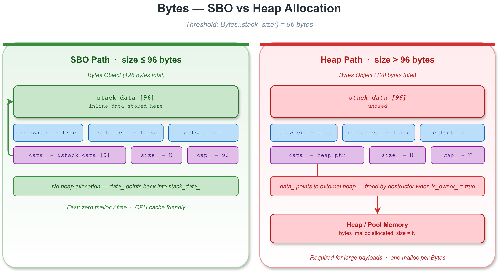

# VLink Bytes 基础操作 -- 深入解析

## 概述

`Bytes` 是 VLink 框架的核心二进制数据载体，所有通过 Publisher/Subscriber、Getter/Setter、Server/Client 等原语传输的消息底层都经过 `Bytes` 封装。本示例深入演示 Bytes 的创建、构造、访问器和基本操作。

## 文件说明

| 文件 | 说明 |
|------|------|
| `bytes_basic.cc` | 主程序入口，调用各 demo 函数 |
| `bytes_examples.h` | 各演示函数的定义，每个函数封装一个独立的 demo 小节 |
| `CMakeLists.txt` | 构建配置，链接 `vlink::all` |

## 构建与运行

```bash
mkdir build && cd build
cmake .. -DCMAKE_PREFIX_PATH=/path/to/vlink/install
make example_bytes_basic
./output/bin/example_bytes_basic
```

## 内存模型深入解析



### Bytes 对象固定 128 字节

`Bytes` 对象在栈上或作为类成员时，始终占用固定的 128 字节空间。这个设计确保了：

- **缓存友好**：固定大小使编译器能高效对齐
- **可预测的内存布局**：适合 zerocopy 传输层直接操作
- **无需间接指针**：小数据直接在对象内部存储

### 内部布局

```
┌─────────────────────────────────────────────────────────────┐
│  stack_data_[96]            (内联栈缓冲区)                    │  96 bytes
├─────────────────────────────────────────────────────────────┤
│  is_owner_    (bool, 1B)   是否拥有底层内存                    │
│  is_loaned_   (bool, 1B)   是否为外部借用内存(iceoryx)          │
│  offset_      (uint8_t, 1B) 前缀保留区大小                    │
│  data_        (uint8_t*, 8B) 有效数据指针                     │
│  size_        (size_t, 8B)  逻辑数据大小                      │
│  capacity_    (size_t, 8B)  缓冲区总容量                      │
├─────────────────────────────────────────────────────────────┤
│  padding to 128 bytes                                       │
└─────────────────────────────────────────────────────────────┘
```

### SBO (Small Buffer Optimization) 详解

SBO 是 Bytes 最关键的性能优化机制。其核心思想是：**小数据不做堆分配，直接利用对象内部的 stack_data_ 数组**。

#### SBO 路径 (size <= 96 字节)

```cpp
auto sbo = Bytes::create(64);
// 实际发生的事情：
// 1. data_ 指向 &stack_data_[0] (自引用)
// 2. size_ = 64
// 3. capacity_ = 96 (stack_data_ 的大小)
// 4. is_owner_ = true
// 5. 没有任何堆分配！
```

优势：
- **零堆分配**：完全避免了 malloc/free 开销
- **数据局部性**：数据与元数据在同一缓存行中
- **拷贝语义清晰**：整个 128 字节一次 memcpy 即可

#### 堆路径 (size > 96 字节)

```cpp
auto heap = Bytes::create(256);
// 实际发生的事情：
// 1. 调用 bytes_malloc(256) 从内存池或系统堆分配
// 2. data_ 指向堆上新分配的内存
// 3. size_ = 256
// 4. capacity_ = 256
// 5. is_owner_ = true
// 6. stack_data_[96] 未使用（浪费了 96 字节）
```

#### 96 字节阈值的选择依据

选择 96 字节作为 SBO 阈值并非随意决定：

- **128 - 32 = 96**：128 字节总大小减去元数据字段（约 32 字节），剩余给 stack_data_
- **覆盖大多数控制消息**：在车载通信中，大部分控制/状态消息小于 96 字节
- **两个缓存行**：128 字节 = 2 个 64 字节缓存行，是常见 CPU 的最小高效操作单位

### offset 机制详解

offset 是为传输层设计的"协议头保留区"：

```cpp
auto buf = Bytes::create(100, /*offset=*/8);
// 物理布局：
// real_data() -> [8 字节保留区][100 字节有效数据]
// data()      -> [100 字节有效数据]  (跳过 offset)
//
// real_size() == 108 (总分配大小)
// size()      == 100 (用户可见大小)
// offset()    == 8
```

这样传输层可以在不重新分配内存的情况下，在数据前方直接写入协议头（如 SOME/IP 头、DDS 头等）。这对零拷贝传输至关重要。

## 关键代码分析

### create() 工厂方法

```cpp
auto sbo = Bytes::create(64);   // SBO 路径
auto heap = Bytes::create(256);  // 堆路径
```

`create()` 是创建 Bytes 的推荐方式。它根据请求的大小自动选择 SBO 或堆路径。内部实现伪代码：

```
if (size <= stack_size()) {
    data_ = &stack_data_[0];
    capacity_ = stack_size();
} else {
    data_ = bytes_malloc(size);
    capacity_ = size;
}
size_ = size;
is_owner_ = true;
```

### from_string() 深拷贝

```cpp
auto bytes = Bytes::from_string("Hello, VLink Bytes!");
```

`from_string()` 将字符串内容**深拷贝**到新的 Bytes 对象中。源字符串可以安全地被销毁。如果字符串长度 <= 96，使用 SBO 路径。

### resize / reserve / shrink_to

```cpp
auto buf = Bytes::create(10);
buf.reserve(200);    // 确保容量 >= 200，size 不变
buf.resize(150);     // 改变逻辑 size 为 150
buf.shrink_to(50);   // 缩小 size 为 50（不重新分配）
```

三者的区别：

| 方法 | 改变 size | 改变 capacity | 可能重新分配 |
|------|-----------|--------------|-------------|
| `reserve(n)` | 否 | 是（如果 n > cap） | 是 |
| `resize(n)` | 是 | 是（如果 n > cap） | 是 |
| `shrink_to(n)` | 是（缩小） | 否 | 否 |

### 创建方式汇总

| 方式 | 说明 | 是否拥有内存 | SBO 适用 |
|------|------|-------------|----------|
| `Bytes::create(size)` | 分配新缓冲区 | 是 | size <= 96 |
| `Bytes::create(size, offset)` | 带 offset 的分配 | 是 | size+offset <= 96 |
| `Bytes::from_string(str)` | 从字符串深拷贝 | 是 | len <= 96 |
| `Bytes(vector)` | 从 vector 深拷贝 | 是 | vec.size() <= 96 |
| `Bytes{0x01, 0x02}` | 初始化列表 | 是 | 列表长度 <= 96 |
| `Bytes()` | 默认构造，空对象 | 否 | N/A |

### 访问器

- `data()` / `real_data()`：有效数据指针 / 底层缓冲区起始指针（含 offset 区域）
- `size()` / `real_size()` / `capacity()`：逻辑大小 / 总分配大小 / 缓冲区容量
- `offset()`：前缀保留区大小，`data() == real_data() + offset()`
- `is_owner()`：是否拥有底层内存（owner 在析构时释放内存）
- `empty()`：`data_ == nullptr && size_ == 0`
- `to_string()` / `to_string_view()`：将内容转为字符串

### 迭代器

`Bytes` 提供标准迭代器接口，支持 range-for：

```cpp
Bytes bytes{10, 20, 30, 40, 50};
for (uint8_t b : bytes) {
    // 遍历有效数据区域 [data(), data() + size())
}
```

`real_begin()` / `real_end()` 遍历整个底层缓冲区（含 offset 区域）。

## 常见错误

### 错误 1：SBO 对象被 move 后仍使用旧指针

```cpp
auto a = Bytes::create(32);
uint8_t* ptr = a.data();     // 指向 a 内部的 stack_data_
auto b = std::move(a);       // move 后 a 为空
// ptr 现在是悬空指针！SBO 数据在 a 的栈内存中，move 后 b 有自己的副本
```

### 错误 2：对非 owner 的 Bytes 调用 resize

```cpp
uint8_t buf[32];
auto alias = Bytes::shallow_copy(buf, 32);
alias.resize(64);  // 错误！非 owner 不能 resize
```

### 错误 3：忽略 reserve 的返回值

```cpp
auto buf = Bytes::create(10);
buf.reserve(1000000000);  // 可能分配失败
// 应该检查返回值：
if (!buf.reserve(1000000000)) {
    VLOG_E("Reserve failed!");
}
```

### 错误 4：混淆 size() 和 real_size()

当使用 offset 时，`size()` 只反映用户数据大小，`real_size()` 包含 offset 区域。传输层应使用 `real_data()` + `real_size()` 发送完整帧。

## 相关示例

- [bytes_advanced](../bytes_advanced/) -- 压缩、Base64、CRC-32、十六进制转换
- [bytes_zerocopy](../bytes_zerocopy/) -- 所有权模型：shallow_copy、deep_copy、loan_internal
- [zerocopy 示例](../../zerocopy/) -- Bytes 在零拷贝传输中的实际应用
