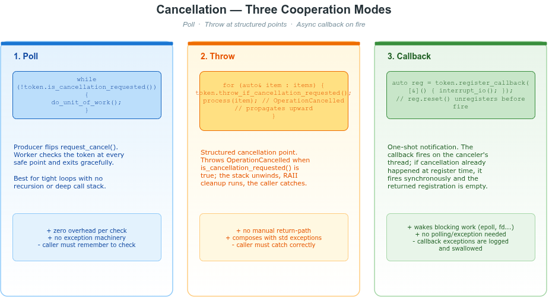

# cancellation -- 协作取消三件套

`vlink::CancellationSource` / `CancellationToken` / `CancellationRegistration` 与
`vlink::OperationCancelled` 异常组成 VLink 的协作取消（cooperative cancellation）
原语。本示例**完整展示** 12 种典型用法、边界场景、并发竞态。

## 头文件

```cpp
#include <vlink/base/cancellation.h>
#include <vlink/base/exception.h>     // OperationCancelled
#include <vlink/base/message_loop.h>  // 集成示例
#include <vlink/base/task_handle.h>   // 集成示例
```

## 三种协作模式速览



| 模式 | 调用形式 | 何时用 |
|------|----------|--------|
| 轮询  | `while (!token.is_cancellation_requested()) { ... }` | 紧密循环、无深调用栈 |
| 抛异常 | `token.throw_if_cancellation_requested();` | 需要 RAII 自动展开、跨多层调用 |
| 回调   | `token.register_callback([]{ wake_io_thread(); });` | 唤醒阻塞 I/O / epoll / 文件操作 |

## 示例覆盖范围（12 段）

| 段落 | 主题 |
|------|------|
| 1  | 轮询式取消：`is_cancellation_requested` |
| 2  | 结构化取消：`throw_if_cancellation_requested` + RAII 析构展开 |
| 3  | 异步触发：`register_callback` 在 producer 线程触发 |
| 4  | 同步触发：注册时已 cancelled → 当前线程同步触发，registration 为空 |
| 5  | `CancellationRegistration::reset()` 在触发前取消订阅 |
| 6  | 多 token 同源 fan-out（6 个并发观察者） |
| 7  | 三级父子级联取消 |
| 8  | 回调内取消兄弟 source 不会自死锁（内部 mtx 已释放） |
| 9  | 回调异常被吞噬，后续回调仍触发 |
| 10 | 默认构造的 token 永远不报取消、注册返回空 |
| 11 | 并发注册 + 并发 cancel 的竞态（同步/异步触发混合） |
| 12 | 与 `TaskHandle` 集成：父级 token 自动透传到队列任务 |

## 构建与运行

```bash
cmake -S . -B build
cmake --build build --target example_cancellation
./build/examples/base/cancellation/example_cancellation
```

## 锁与语义要点

- **一次性触发**：`request_cancel()` 首次返回 `true`，后续返回 `false`。
- **同步 vs 异步**：register 时若已 cancelled，回调在**当前线程同步执行**，返回的 registration 为空；否则回调在 producer 线程上触发。
- **锁不持有触发**：内部 mutex 在触发前已释放，回调可自由 register / unregister / 触发兄弟 source。
- **异常隔离**：回调抛出的异常通过 `CLOG_E` 记录并被吞噬，不传播至 `request_cancel()` 或注册方。
- **生命周期**：所有类型经 `shared_ptr<State>` 共享内部状态；`CancellationRegistration` 析构 / `reset()` 在回调未触发时取消订阅，已触发则为 no-op。
- **`CancellationToken` 默认构造**：`valid()==false`，`is_cancellation_requested()` 永返 `false`，`register_callback()` 返回空。

## 与其他组件的集成

- `vlink::TaskHandle` / `vlink::PostTaskOptions::cancellation_token`：dispatcher 在排队和出队阶段感知取消（示例 §12，详见 `examples/base/task_handle`）。
- `vlink::Co::*` 协程：`await_graph` 等场景在投递失败 / loop 死亡时抛 `OperationCancelled`（参见 `examples/base/message_loop_coroutine`）。

## 相关文档与图

- 章节：[doc/11-base-library.md §11.14 协作取消 Cancellation](../../../doc/11-base-library.md)
- 模型图：[doc/images/cancellation-model.png](../../../doc/images/cancellation-model.png)
- 接口：`include/vlink/base/cancellation.h`、`include/vlink/base/exception.h`
