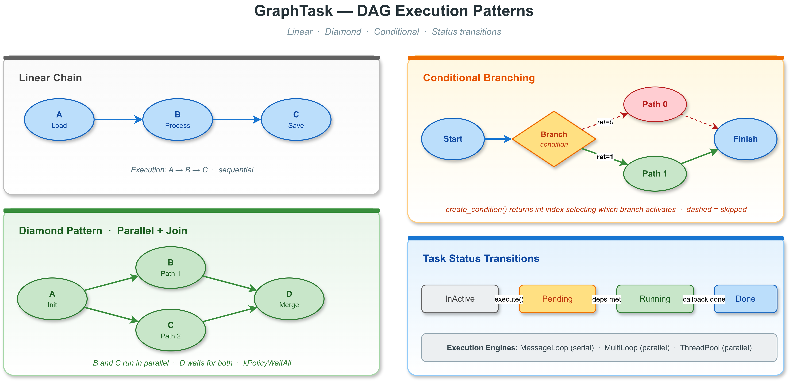

# VLink GraphTask 示例 -- 深入解析

## 概述

`GraphTask` 是 VLink 的有向无环图（DAG）任务调度器。开发者以声明式方式定义任务间的依赖关系，由执行引擎自动调度就绪任务。无依赖的任务可以在 `MultiLoop` 或 `ThreadPool` 上并行执行。

本示例深入演示线性依赖、菱形并行、条件分支、状态监控以及 DOT 图形导出。

## 文件说明

| 文件 | 说明 |
|------|------|
| `graph_task.cc` | 主程序入口，构建各种 DAG 并执行 |
| `task_graph_builder.h` | DAG 构建辅助函数：linear、diamond、conditional、pipeline |
| `CMakeLists.txt` | 构建配置，链接 `vlink::all` |

## 构建与运行

```bash
cmake --build . --target example_graph_task
./examples/base/graph_task/example_graph_task
```

## DAG 概念



### 什么是 DAG

DAG（Directed Acyclic Graph，有向无环图）是一种图结构，其中：
- **有向**：边有方向，表示"必须在...之前完成"
- **无环**：没有循环依赖（A->B->C->A 是非法的）

在任务调度中，DAG 表示任务间的依赖关系：
- **节点**：任务
- **边**：依赖关系（A->B 表示 A 必须在 B 之前完成）
- **入度为 0 的节点**：可以立即执行的任务
- **出度为 0 的节点**：最终输出任务

### 为什么使用 DAG 调度

1. **自动并行化**：无依赖的任务自动并行执行
2. **声明式编程**：只需声明"什么依赖什么"，无需手动管理执行顺序
3. **可视化**：DAG 可以导出为 DOT 格式，用 Graphviz 可视化
4. **环路检测**：构建时检测循环依赖，防止死锁

## 依赖模式

### 模式 1：线性链 (A -> B -> C)

```cpp
auto a = GraphTask::create("A", []() { load_data(); });
auto b = GraphTask::create("B", []() { process_data(); });
auto c = GraphTask::create("C", []() { save_results(); });

// 操作符语法
a-- > b-- > c;

// 等效的 API 调用
a->precede(b);
b->precede(c);
```

执行顺序：A -> B -> C，严格串行。

### 模式 2：菱形 (Diamond)

```cpp
auto a = GraphTask::create("A", init_task);
auto b = GraphTask::create("B", path1_task);
auto c = GraphTask::create("C", path2_task);
auto d = GraphTask::create("D", merge_task);

a->precede(b);  // A -> B
a->precede(c);  // A -> C
b->precede(d);  // B -> D
c->precede(d);  // C -> D
```

执行顺序：A 先执行，然后 B 和 C **并行**执行，最后 D 等待 B 和 C 都完成后执行。

这是最常用的并行模式：**分叉-合并**。

### 模式 3：条件分支

```cpp
auto branch = GraphTask::create_condition("Branch", [&condition]() -> int {
    return condition;  // 返回值选择后继分支
});

branch->precede(path_0);  // 返回 0 时执行
branch->precede(path_1);  // 返回 1 时执行
```

条件任务返回一个整数索引，选择激活哪个后继分支。未被选中的分支被跳过。

### 模式 4：Fan-out

```cpp
auto source = GraphTask::create("Source", generate_data);
for (int i = 0; i < 8; ++i) {
    auto worker = GraphTask::create("Worker" + std::to_string(i), process_chunk);
    source->precede(worker);
}
```

一个源任务后接多个并行工作任务。

## 关键代码分析

### 任务创建

```cpp
// 普通任务（void 回调）
auto task = GraphTask::create("name", []() { work(); });

// 条件任务（int 回调，返回值选择分支）
auto cond = GraphTask::create_condition("name", []() -> int { return 0; });
```

任务通过 `shared_ptr<GraphTask>` 管理。`GraphTaskPtr` 是其类型别名。

### 依赖声明

三种等效的依赖声明方式：

```cpp
// 方式 1：precede（A 在 B 之前完成）
a->precede(b);

// 方式 2：succeed（B 在 A 之后执行）
b->succeed(a);

// 方式 3：运算符语法
a-- > b;  // 等效于 a->precede(b)
```

### 执行策略

| 策略 | 说明 |
|------|------|
| `kPolicyOnce` | 每次 execute() 只运行一次（默认） |
| `kPolicyMultiple` | 允许一次 execute() 中多次运行 |
| `kPolicyWaitAll` | 等待**所有**前驱完成后运行 |

`kPolicyWaitAll` 是菱形模式合并节点的关键：

```cpp
d->set_policy(GraphTask::kPolicyWaitAll);
// D 必须等待 B 和 C 都完成才能执行
```

### 执行引擎

```cpp
task->execute(&engine);
```

`execute()` 接受任何提供 `post_task()` 方法的引擎：

| 引擎 | 行为 |
|------|------|
| `MessageLoop` | 所有任务串行执行（单线程） |
| `MultiLoop` | 无依赖的任务并行执行（多线程） |
| `ThreadPool` | 无依赖的任务并行执行（线程池） |

### 状态回调

```cpp
task->register_status_callback([](const std::string& name, GraphTask::Status status) {
    // status: kStatusInActive -> kStatusPending -> kStatusRunning -> kStatusDone
});
```

任务状态转换：
1. **InActive**：初始状态，未加入执行
2. **Pending**：已加入执行，等待前驱完成
3. **Running**：正在执行回调
4. **Done**：执行完成

### 环路检测

```cpp
bool has_cycle = task->has_cycle();
```

使用深度优先搜索（DFS）配合三色标记法检测环路。存在环路的图在运行时会导致任务永远处于 Pending 状态（死锁）。**应在 execute() 前检查**。

### DOT 导出

```cpp
std::string dot = task->export_to_dot();
```

导出 Graphviz DOT 字符串，用于可视化：

```bash
echo "$DOT_STRING" | dot -Tpng -o graph.png
```

## 车载软件中的典型 DAG

### 感知流水线

```
Camera ──> Detect ──> Track ──> Fusion ──> Publish
Lidar  ──> Detect ──> Track ──┘
Radar  ──> Detect ──────────┘
```

三个传感器的检测可以并行执行，Track 等待各自的 Detect 完成，Fusion 等待所有 Track 完成。

### 系统启动序列

```
LoadConfig ──> InitNetwork ──┐
             InitHardware ──┤──> StartApplication
             InitLogger   ──┘
```

配置加载后，网络、硬件、日志三个初始化可以并行进行。

## 常见错误

### 错误 1：循环依赖

```cpp
a->precede(b);
b->precede(c);
c->precede(a);  // 环路！a->b->c->a

// 必须在 execute 前检查
if (a->has_cycle()) {
    VLOG_E("Cycle detected!");
    return;
}
```

### 错误 2：忘记设置 kPolicyWaitAll

```cpp
a->precede(d);
b->precede(d);
// 默认策略下，d 在 a 或 b 任一完成后就执行
// 如果需要等待所有前驱：
d->set_policy(GraphTask::kPolicyWaitAll);
```

### 错误 3：在并行任务中共享状态

```cpp
int shared = 0;
auto b = GraphTask::create("B", [&shared]() { shared++; });
auto c = GraphTask::create("C", [&shared]() { shared++; });
a->precede(b);
a->precede(c);
// B 和 C 并行执行，shared 有数据竞争！
```

### 错误 4：条件任务返回越界索引

```cpp
auto branch = GraphTask::create_condition("Branch", []() -> int {
    return 5;  // 只有 2 个后继 (0 和 1)
});
branch->precede(path_0);
branch->precede(path_1);
// 返回 5 时，所有后继分支被跳过
```

## 相关示例

- [thread_pool](../thread_pool/) -- GraphTask 的并行执行引擎
- [multi_loop](../multi_loop/) -- GraphTask 的另一种并行引擎
- [message_loop_basic](../message_loop_basic/) -- GraphTask 的串行执行引擎
- [schedule](../schedule/) -- Schedule::Config 高级任务调度
