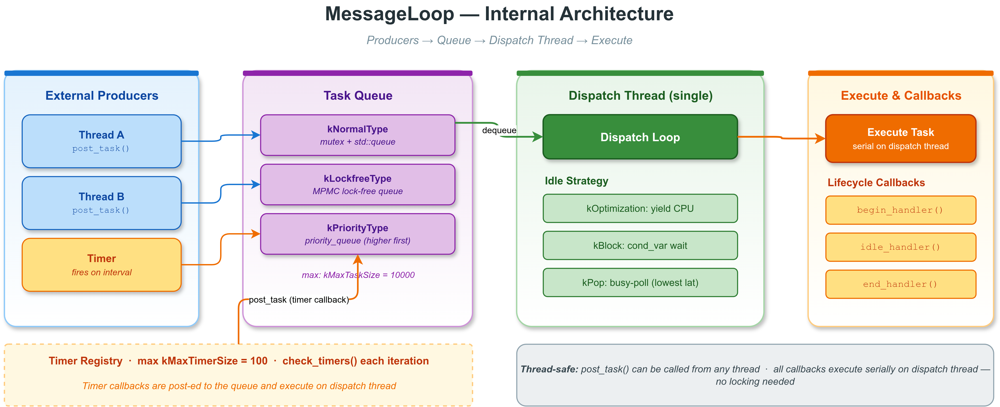

# message_loop_basic — vlink 任务调度核心：`MessageLoop` 入门

`vlink::MessageLoop` 是 vlink 应用层的中央事件循环，**Publisher / Subscriber / Client / Server / Setter / Getter / Timer 的所有回调都跑在某个 MessageLoop 上**。理解 MessageLoop 是理解 vlink 应用层并发模型的前提。

本示例覆盖 MessageLoop 最常用的 5 种用法：

1. `async_run() + post_task()` 后台线程驱动 + 投递任务。
2. 生命周期回调：begin / end / idle handler。
3. 阻塞式 `run()` —— 主线程直接驱动 loop。
4. 手动 `spin_once()` —— 外部 loop 集成（Qt、ROS、自定义事件循环）。
5. 状态查询：`is_running` / `get_task_count` / `get_type`。

读完本示例你能掌握：

- async_run vs run 何时用哪个。
- post_task 的串行语义和它给业务带来的"无锁"优势。
- 生命周期 hook 用来做线程初始化（设亲和性、注册信号、注册 logger 上下文）。
- 何时用 spin_once。

## 背景与适用场景

MessageLoop 是 vlink 实现"任务串行执行"的基础设施。当你把 Subscriber 用 `sub.attach(&loop)` 绑定到一个 MessageLoop 后，所有 listen 回调都跑在 loop 线程上；同一 loop 上挂多个 Subscriber，它们的回调天然串行，不需要业务自己加锁。

适用场景：

- 应用层的事件分发主循环（最常见）。
- 把传输层回调"搬"到固定业务线程，避免多线程数据竞争。
- 跨线程任务投递（任意线程 `post_task` 到 loop 线程执行）。
- 定时任务驱动（Timer 必须挂在 MessageLoop 上）。

不适合：

- CPU 密集型并行计算（用 `ThreadPool` 或 `MultiLoop`）。
- 完全独立的 IO 线程（每个 IO 通道一个 loop 也行，但通常用一个全局 loop 集中处理足够）。
- 极低延迟（< 微秒级）—— MessageLoop 的任务投递走 mutex + cv，有几百纳秒开销。

## 核心 API

| API | 签名 | 说明 |
|-----|------|------|
| `MessageLoop` | 默认构造 | 单独构造一个未启动的 loop |
| `set_name` | `void set_name(const std::string&)` | 线程名，便于 top/htop 识别 |
| `async_run` | `void async_run()` | 在后台线程启动 loop，立即返回 |
| `run` | `void run()` | 当前线程驱动 loop，阻塞到 quit |
| `quit` | `void quit()` | 请求退出 |
| `wait_for_quit` | `bool wait_for_quit(std::chrono::milliseconds timeout)` | 等 loop 真正退出 |
| `post_task` | `bool post_task(Function<void()>&&, const PostTaskOptions& = {})` | 把任务投递到 loop 队列 |
| `wait_for_idle` | `bool wait_for_idle(uint32_t timeout_ms = ...)` | 阻塞等队列清空 |
| `spin_once` | `void spin_once(bool blocking = false)` | 处理一批待执行任务 |
| `register_begin_handler` | `void register_begin_handler(Function<void()>&&)` | loop 线程开始时调一次 |
| `register_end_handler` | `void register_end_handler(Function<void()>&&)` | loop 线程退出前调一次 |
| `register_idle_handler` | `void register_idle_handler(Function<void()>&&)` | 队列每次清空时调 |
| `is_running` | `bool is_running() const` | 当前是否在运行 |
| `get_task_count` | `size_t get_task_count() const` | 队列中待执行任务数 |
| `get_type` | `MessageLoopType get_type() const` | 队列类型（normal、priority、time-ordered 等） |

## 代码导读

### 1. async_run + post_task

```cpp
MessageLoop loop;
loop.set_name("basic_loop");
loop.async_run();

for (int i = 0; i < 5; ++i) {
  loop.post_task([i]() { MLOG_I("  task {} on loop thread", i); });
}

loop.wait_for_idle();
VLOG_I("  all tasks completed");

loop.quit();
loop.wait_for_quit();
```

最常用的形态：主线程构造 loop、`async_run()` 让 loop 在后台线程跑、主线程 `post_task` 投递任务、`wait_for_idle()` 等任务全部跑完、`quit()` + `wait_for_quit()` 干净退出。

任务是按 FIFO 顺序串行执行的；5 个任务一定按 i=0..4 顺序在同一线程跑。

### 2. 生命周期 hook

```cpp
MessageLoop loop;
loop.set_name("handler_loop");
loop.register_begin_handler([]() { VLOG_I("  [begin] thread started"); });
loop.register_end_handler([]() { VLOG_I("  [end] thread exiting"); });
loop.register_idle_handler([]() {
  // fires every time the queue drains; keep it cheap
});

loop.async_run();
loop.post_task([]() { VLOG_I("  task between begin/end handlers"); });
loop.wait_for_idle();
```

`register_begin_handler` 在 loop 线程开始时调一次：典型用途是设线程 CPU 亲和性、注册 SIGPIPE 忽略、绑定 logger context、初始化 thread-local 存储。

`register_idle_handler` 在队列每次清空时调；用于做"空闲清理"（如内存池 trim）。注意频繁触发，回调一定要快。

### 3. 阻塞 run()

```cpp
MessageLoop loop;
loop.set_name("blocking_loop");

std::thread poster([&loop]() {
  std::this_thread::sleep_for(50ms);
  loop.post_task([]() { VLOG_I("  posted from helper #1"); });
  loop.post_task([]() { VLOG_I("  posted from helper #2"); });
  std::this_thread::sleep_for(50ms);
  loop.quit();
});

loop.run();
poster.join();
```

`run()` 在当前线程直接驱动 loop，**阻塞到 quit**。适合"main 函数自己就是 loop 线程"的场景：主线程 init → 注册 publisher/subscriber → 进 loop.run() → 收到 SIGINT 后 quit 退出。

### 4. spin_once 集成外部 loop

```cpp
MessageLoop loop;
loop.set_name("spin_loop");

std::atomic<int> processed{0};
for (int i = 0; i < 3; ++i) {
  loop.post_task([&processed, i]() {
    MLOG_I("  spin_once task {}", i);
    processed.fetch_add(1);
  });
}

while (processed.load() < 3) {
  loop.spin_once(false);
}
```

`spin_once(blocking=false)` 处理一批待执行任务，立即返回。用于把 vlink loop 嵌入外部事件循环（如 Qt 的 QEventLoop、ROS spin、GLFW 主循环）——外部 loop 每帧调一次 `spin_once`，让 vlink 任务有机会跑。

`spin_once(true)` 会阻塞等到至少一个任务到达再返回。

### 5. 状态查询

```cpp
MLOG_I("  before run: is_running={}", loop.is_running());
loop.async_run();
MLOG_I("  after async_run: is_running={} type={} tasks={}", loop.is_running(),
       static_cast<int>(loop.get_type()), loop.get_task_count());

loop.quit();
loop.wait_for_quit();
MLOG_I("  after quit: is_running={}", loop.is_running());
```

`is_running` / `get_task_count` / `get_type` 用于运行时监控；常配合监控 metric 上报。

## 运行

```bash
./build/output/bin/example_message_loop_basic
```

预期输出（节选）：

```
=== async_run + post_task ===
  task 0 on loop thread
  task 1 on loop thread
  ...
  all tasks completed
=== Lifecycle handlers ===
  [begin] thread started
  task between begin/end handlers
  [end] thread exiting
=== Blocking run() ===
  posted from helper #1
  posted from helper #2
  run() returned after quit()
=== spin_once ===
  spin_once task 0
  spin_once task 1
  spin_once task 2
  processed 3 tasks via spin_once
=== State queries ===
  before run: is_running=0
  after async_run: is_running=1 type=0 tasks=...
  after quit: is_running=0
MessageLoop basic example finished.
```

## 常见陷阱

1. **post_task 时 loop 已 quit**：任务被丢弃；不会报错。要在生产代码里检查 `is_running()`。
2. **run() 和 async_run() 重复调用**：同一 loop 只能用一种启动方式。
3. **wait_for_idle() 在 run 线程内调用**：死锁 —— 你在等的就是自己。`wait_for_idle` 只能在 loop 外的线程调。
4. **回调里抛异常**：未捕获异常会让 loop 线程崩溃；vlink 不会自动 catch。生产代码里回调都要 try/catch。
5. **begin/end handler 里 post_task**：begin handler 跑在 loop 线程，post_task 加入队列；安全。但 end handler 时 loop 已经停止处理，新任务会被丢。

## 设计要点

- MessageLoop 用 mutex + cv 实现任务队列；任务投递延迟约 100ns - 1us。
- 任务对象由 `Function<void()>` 包装；大 lambda 捕获 + move-only 类型支持良好。
- 没有 cancel API —— 任务一旦入队就会跑（除非走 `post_task_handle` + cancellation_token）。
- 一个 loop 只对应一个线程；要并行就开多个 loop（见 `multi_loop/`）。

## 配图



图中展示 MessageLoop 内部的"任务队列 + 工作线程 + 三种 hook"结构。

## 参考

- `../message_loop_advanced/` — 队列类型、跨线程分发、`Schedule::Config`
- `../multi_loop/` — N 线程并行 loop
- `../timer/` — Timer 必须挂在 MessageLoop 上
- `../thread_pool/` — 与 ThreadPool 的取舍
- `vlink/include/vlink/base/message_loop.h` — MessageLoop 完整接口
- 顶层 `doc/00-whitepaper.md` — vlink 并发模型
