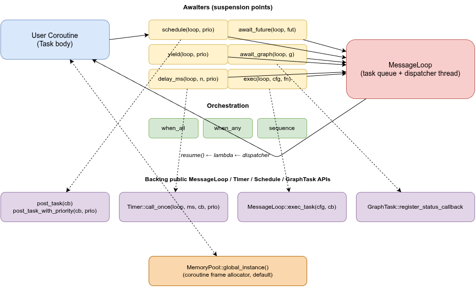
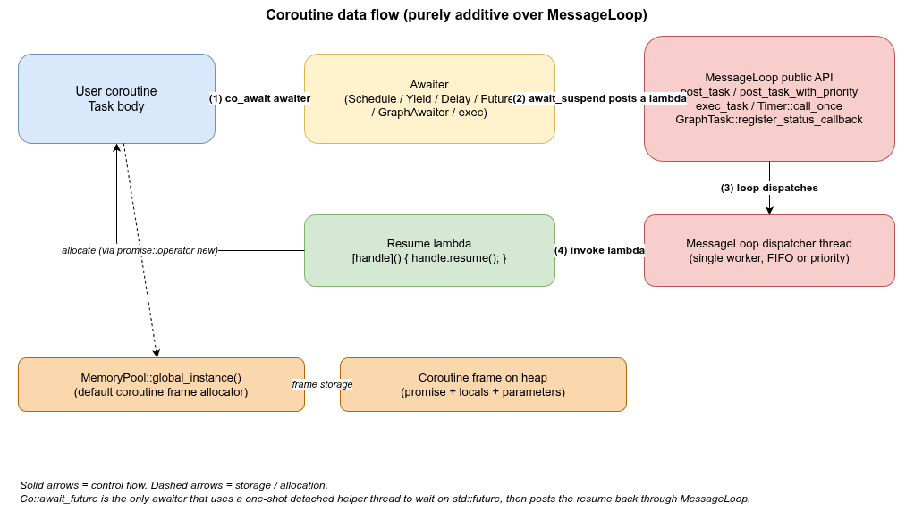

# VLink MessageLoop + Coroutine 示例 -- 深入解析

## 1. 概述

`vlink::Coroutine`（短别名 `vlink::Co`）通过 C++20 **stackless 协程**为 vlink 提供一套现代异步编程接口。所有调度依然走 `MessageLoop` 现有的 `post_task` / `Timer::call_once` / `exec_task` / `GraphTask` 公共 API，因此与现有代码完全兼容。

本示例展示协程如何与 vlink 的多个核心原语（`Timer`、`Schedule`、`GraphTask`）协作，以及如何用 `when_all` / `when_any` / `sequence` 对协程任务进行编排。

> **要求**：CMake 配置时打开 `ENABLE_CXX_STD_20=ON`，编译器需具备 `__cpp_lib_coroutine`（GCC 10+ / Clang 14+ / MSVC 19.x+）。
>
> **内存**：协程帧默认走 `vlink::MemoryPool::global_instance()` 分配，无需任何额外配置。

## 2. 文件说明

| 文件 | 说明 |
|------|------|
| `message_loop_coroutine.cc` | 11 章节综合示例源码 |
| `CMakeLists.txt` | 构建配置（自动给 GCC<11 加 `-fcoroutines`） |
| `images/message-loop-coroutine-architecture.drawio` | 架构图源（draw.io 格式，英文） |
| `images/message-loop-coroutine-architecture.png` | 架构图渲染结果 |

## 3. 构建与运行

```bash
cmake -B build -S . -DCMAKE_PREFIX_PATH=/path/to/vlink/install
cmake --build build --target example_message_loop_coroutine
./build/output/bin/example_message_loop_coroutine
```

## 4. 整体架构



协程层是一层**纯加性**的封装：



**关键点**：协程从挂起到恢复始终绕回 `MessageLoop` 的任务队列，因此协程体的所有语句都运行在 loop 线程上（除 `await_future` 的等待瞬间），共享状态无需加锁。

数据流五步：
1. 用户协程执行 `co_await awaiter`
2. Awaiter 的 `await_suspend` 把 resume lambda 投递到 MessageLoop 队列
3. 调度线程从队列取出 lambda
4. 调用 lambda
5. lambda 调用 `handle.resume()` 让协程从挂起点继续

## 5. C++20 stackless 协程基础

如果你熟悉 boost::fiber、ucontext 或 CyberRT `CRoutine`，需要先理清三个差异：

| 维度 | stackful（fiber/CRoutine） | C++20 stackless（本实现） |
|------|----------------------------|---------------------------|
| 是否有独立栈 | 是，每协程 KB 级 | 否，仅 frame（堆上几十~几百字节） |
| 挂起点位置 | 调用栈任意深度 | 必须显式 `co_await` |
| 内存控制 | 设置栈大小 | 自定义 `operator new`（本库走 MemoryPool） |
| 性能 | 上下文切换 ~微秒 | 简单的函数跳转 + 指针交换 |
| 语法侵入 | 无 | 函数必须含 `co_await/co_return/co_yield` |

**Frame 的本质**：协程函数被编译器改写为一个状态机 + 堆上 frame。frame 中保存：
- 跨挂起点的局部变量
- 当前挂起点的恢复地址
- 协程参数（**编译器自动拷贝/移动到 frame**，无悬空风险）
- promise 对象（状态、返回值、异常）

## 6. 协程函数三件套

```cpp
Co::Task<int> my_routine(MessageLoop& loop, int x) {  // 返回类型 Task<T>
  co_await Co::delay_ms(loop, 100);                   // 挂起点：co_await
  co_return x * x;                                    // 终止 + 返回值：co_return
}
```

- **`Task<T>`**：协程返回类型，lazy（首次 `co_await` 或 `co_spawn` 才启动）；移动只可、不可拷贝
- **`co_await`**：挂起当前协程，把执行权交回 awaiter
- **`co_return`**：协程结束。void 返回省略值即可

## 7. 基础 spawn（fire-and-forget）

```cpp
Co::Task<> body(std::promise<void>* done) {
  do_work();
  done->set_value();
  co_return;
}

MessageLoop loop;
loop.async_run();

std::promise<void> done;
Co::co_spawn(loop, body(&done));   // 在 loop 上启动协程
done.get_future().get();           // 等待协程结束
```

`co_spawn` 把 `Task<void>` 投递到 loop。协程**异步**启动，调用方立即返回。协程体跑完后自动销毁 frame（不需要手动 join/delete）。

## 8. 带完成回调的 spawn

```cpp
Co::co_spawn(loop, compute_answer(), [](int v) { /* 在 loop 线程上 */ });
```

对于 `Task<T>`（非 void），可以传第三个参数 — 完成回调。回调在 loop 线程上被调用，参数是协程的 `co_return` 值。

> ⚠ 如果协程抛异常，回调**不会**被调用（异常被默默吞掉）。如果你需要错误处理，让协程内部 `try/catch` 自己处理。

## 9. 嵌套 co_await

```cpp
Co::Task<int> inner(MessageLoop* loop, int x) {
  co_await Co::delay_ms(*loop, 10);
  co_return x * x;
}

Co::Task<> outer(MessageLoop* loop, std::promise<int>* done) {
  int a = co_await inner(loop, 6);   // 等待子协程
  int b = co_await inner(loop, 7);
  done->set_value(a + b);
  co_return;
}
```

嵌套用 **symmetric transfer** 实现：内层协程完成后通过 `final_suspend` 直接转移控制权回外层，**无栈消耗、无额外调度**。

## 10. delay_ms -- 非阻塞睡眠

```cpp
co_await Co::delay_ms(loop, 100);   // 内部走 Timer::call_once
```

不会阻塞 loop 线程：当前协程挂起，loop 继续处理其他任务；100 ms 后 Timer 触发，把协程的 resume 投递回 loop 队列。

底层等价于：

```cpp
Timer::call_once(&loop, 100, [handle](){ handle.resume(); });
```

## 11. yield -- 协作让出

```cpp
for (int i = 0; i < big_n; ++i) {
  process_one(i);
  if (i % 100 == 0) co_await Co::yield(loop);   // 给别的任务机会
}
```

`yield(loop)` 等价于把当前协程的 resume **再次 post_task** 到 loop 队尾，让队列中的其他任务先跑。常用于：
- 长循环防止 starvation
- 等待 `post_task` 投递的副作用完成

## 12. schedule -- 切换到 loop 线程

```cpp
Co::Task<> body(MessageLoop* loop) {
  co_await Co::schedule(*loop);     // 现在保证在 loop 线程上
  modify_loop_state();
  co_return;
}
```

如果协程的当前执行点不在目标 loop 线程上（比如从 `await_future` 的检测线程刚 resume 回来），`schedule` 强制 hop 回 loop 线程后再继续。

## 13. await_future -- 桥接 std::future

```cpp
std::future<int> fut = some_async_op();
int value = co_await Co::await_future(loop, std::move(fut));
```

实现细节：会启动**一个临时 detached 线程**调用 `fut.wait()`，ready 后把协程的 resume `post_task` 回 loop 线程。

> 性能注意：每次 await 创建一个线程。仅适合粗粒度同步点（等待 `invoke_task` 结果之类），不要在内循环里用。

## 14. exec -- Schedule::Config 调度信封

```cpp
Schedule::Config cfg(/*delay_ms=*/50,
                     MessageLoop::kNormalPriority,
                     /*schedule_timeout_ms=*/1000,
                     /*execution_timeout_ms=*/500);

co_await Co::exec(loop, cfg, []{ critical_work(); });
```

把 `MessageLoop::exec_task` 的所有能力（延迟、优先级、超时）包到协程里。回调抛异常时，异常会**透过 co_await 重新抛出**到协程体，可以 `try/catch`。

## 15. await_graph -- 等待 GraphTask DAG 完成

```cpp
auto a = GraphTask::create("A", []{ step_a(); });
auto b = GraphTask::create("B", []{ step_b(); });
auto c = GraphTask::create("C", []{ step_c(); });

a->precede(b);    // Taskflow 语义：x.precede(y) 让 y 在 x 之后跑（y 是 x 的后继）
b->precede(c);

a->execute(&loop);                 // 启动整个图
co_await Co::await_graph(loop, c); // 等到叶子 c 完成
```

`GraphAwaiter` 在 `GraphTask` 上注册 status callback，目标 task 进入 `kStatusDone` 时 resume 协程。

> ⚠ 注意：`GraphTask` 的初始状态是 `kStatusInActive`（同时也是 cancelled 的状态），所以 `await_graph` **只对 `kStatusDone` 视为完成**。如果你 await 了一个从未执行的 task，协程会永远挂起。

## 16. 任务编排：when_all / when_any / sequence

CyberRT 用 DAG 表达并发；本库针对协程提供更轻量的编排原语。

### 16.1 when_all -- 等所有完成

```cpp
std::vector<Co::Task<int>> tasks;
tasks.emplace_back(io_op_a());
tasks.emplace_back(io_op_b());
tasks.emplace_back(io_op_c());

std::vector<int> results = co_await Co::when_all<int>(loop, std::move(tasks));
```

- 每个 sub-task 通过 `co_spawn` 并行启动
- 全部完成后才 resume
- 结果按输入顺序排列
- 如果某个 sub-task 抛异常 → 该异常被 runner 捕获并记录到共享 state 的 `first_exc` → 其余 sub-task 跑完后从 `co_await` rethrow 第一个观察到的原始异常（保留异常类型，后续 sibling 的异常被丢弃）

### 16.2 when_any -- 记录第一个**成功完成者**，等全部跑完才返回

```cpp
auto [idx, value] = co_await Co::when_any<int>(loop, std::move(tasks));
```

返回值是"winner"——第一个**成功完成**的 task 的索引和结果。语义细节：

- 只有**成功完成**的 sub-task 参与 winner 抢占（用 atomic CAS）；抛异常的 sub-task **不参与**。
- 至少有一个 sub-task 成功 → 返回最先成功那个的 `{idx, value}`，其余成功者的结果被丢弃。
- **全部** sub-task 都抛异常 → 抛出第一个观察到的原始异常（异常类型保留，不是 `std::future_error`）。

`when_any` **必须等所有 sub-task 都跑完才返回**：这是为了让每个 task 的协程帧能正常析构，避免遗留挂起协程造成的内存泄漏（本层没有跨协程取消机制）。其他 task **不会被取消**，结果被丢弃。如需"loser 一旦 winner 出来就退场"的有界延迟语义，请让每个子 task 自己尊重 deadline。

> 注意：本语义是 "first **success**"，**不是** "first completion of any kind"。如果需要"任何完成（含失败）即触发"，目前 vlink 没有对应原语，可以让每个 task 内部把异常转成 sentinel 结果值再用 `when_any`。

### 16.3 sequence -- 串行执行

```cpp
co_await Co::sequence(loop, std::move(void_tasks));
```

按 vector 顺序逐个 `co_await`。等价于手动写串行 `co_await`，但抽象成可复用的编排单元。

## 17. 优先级调度

```cpp
MessageLoop loop(MessageLoop::kPriorityType);  // 必须用 priority 队列
loop.async_run();

Co::co_spawn_with_priority(loop, body_high(), MessageLoop::kHighestPriority);
Co::co_spawn_with_priority(loop, body_low(),  MessageLoop::kLowestPriority);
```

所有 awaiter 也接受可选 priority：

```cpp
co_await Co::schedule(loop, MessageLoop::kHighestPriority);
co_await Co::yield(loop, 200);                    // 自定义数值
co_await Co::delay_ms(loop, 100, MessageLoop::kNormalPriority);
```

priority 数值与 `MessageLoop::Priority` 枚举对齐：
- `kNoPriority = 0`（FIFO，默认）
- `kLowestPriority = 1`
- `kTimerPriority = 50`
- `kNormalPriority = 100`
- `kHighestPriority = 65535`

> 注意：priority 只在 `kPriorityType` 队列上生效。`kNormalType` 和 `kLockfreeType` 都按 FIFO 处理。

## 18. 致命陷阱 ⚠：协程 lambda 临时

**永远不要**写这种代码：

```cpp
// ❌ 未定义行为 — 几乎一定会崩
Co::co_spawn(loop, [&]() -> Co::Task<> {
  co_await Co::delay_ms(loop, 100);
  use_captured(state);              // state 已是悬空引用
  co_return;
}());
```

**原因**：

1. lambda 是个临时对象，生命周期到 `;` 为止
2. lambda 的 `operator()` 是协程函数，被调用后 lazy 挂起 (`initial_suspend = suspend_always`)，`Task<>` 立刻返回给 `co_spawn`
3. 整条 statement 结束 → **lambda 被析构**
4. 协程 frame 被分配，但 lambda 的捕获存活在**已析构的 lambda 内**
5. 后来 loop 上 resume 协程时，访问 `[&]` 或 `[=]` 捕获 = **悬空读取**

**正确写法**：把协程体写成自由函数，参数显式传入（参数会被编译器拷贝/移动到 frame，生命周期与 frame 一致）：

```cpp
// ✅ 正确
Co::Task<> my_routine(MessageLoop& loop, State* state) {
  co_await Co::delay_ms(loop, 100);
  use_captured(*state);
  co_return;
}

State state;
Co::co_spawn(loop, my_routine(loop, &state));
```

本示例所有协程体都采用这种模式。建议项目里也强制此惯例（可以用 clang-tidy 规则或 code review 检查）。

## 19. 异常语义速查

| 场景 | 行为 |
|------|------|
| `Task<T>` body 抛异常 | 存在 promise 中；外层 `co_await` 时重新抛出 |
| `co_spawn(loop, task)` 顶层抛异常 | 被 `DetachedTask::unhandled_exception` 静默吞掉并 `CLOG_E` 记录 |
| `co_spawn(loop, task, on_done)` 抛异常 | 同上吞掉；`on_done` **不会**被调用 |
| `exec(loop, cfg, fn)` 的 fn 抛异常 | 通过 promise 传递；在 `co_await exec(...)` 处重新抛出 |
| `await_future` 的 future 抛异常 | `fut.get()` 时抛出，可在协程内 try/catch |
| `schedule` / `yield` / `delay_ms` 投递重试耗尽（`kMaxResumePostRetry=30000`） | `await_resume` 抛 `std::runtime_error("vlink::Coroutine::xxx: post_task to loop failed")` |
| `await_graph` 投递重试耗尽 / loop 已死 | `await_resume` 抛 `vlink::OperationCancelled` |
| `MessageLoop` 在挂起期间析构 | 借助 `MessageLoopAliveState` 把恢复路径切到 fail 分支（同上） |

> **lock-free `MessageLoop` 的特殊性**：恢复使用 `kProtected` + `kReject` 投递选项。`kProtected`
> 在 lock-free 队列上不生效，但 `kReject` 仍能避免队列满时入队；如果连续 30000 次重试仍失败，
> 才会走到上述异常路径。常规负载下这条路径不会被触发。

## 20. 内存分配

所有协程帧（`Task<T>` 和内部 `DetachedTask`）通过 `TaskPromise::operator new` 走：

```cpp
void* allocate_frame(size_t size) {
  void* ptr = vlink::MemoryPool::global_instance().allocate(size);
  if (!ptr) throw std::bad_alloc{};
  return ptr;
}
```

**为什么不能"设置栈大小"**：C++20 stackless 协程没有栈。frame 大小由编译器根据跨挂起点的局部变量在**编译期**确定，运行时不可变。"控制内存"最接近的能力就是替换分配器，本库默认接到 `MemoryPool`。

## 21. 常见错误

### 21.1 错误 1：协程 lambda 当临时对象用（见上文"致命陷阱"）

### 21.2 错误 2：在 loop 线程上同步 `fut.get()`

```cpp
// ❌ 死锁
Co::Task<> body(MessageLoop* loop) {
  auto fut = loop->invoke_task([]{ return 42; });
  fut.get();  // invoke_task 需要 loop 跑回调，但当前协程正占用 loop 线程
}
```

正确做法用 `await_future`：

```cpp
// ✅
int v = co_await Co::await_future(*loop, std::move(fut));
```

### 21.3 错误 3：await 一个未启动的 GraphTask

```cpp
auto a = GraphTask::create("A", []{ /*...*/ });
co_await Co::await_graph(loop, a);  // 永远不会 resume — a 还没 execute()!
```

要么先 `execute()`，要么把 execute() 也写在协程内。

### 21.4 错误 4：当多个 sub-task 抛异常，只能拿到第一个

```cpp
auto t1 = []() -> Co::Task<int> { throw std::runtime_error("x"); co_return 0; };
auto t2 = []() -> Co::Task<int> { throw std::logic_error("y"); co_return 0; };
auto results = co_await Co::when_all<int>(loop, { t1(), t2() });
// when_all 捕获第一个观察到的异常并 rethrow，第二个异常被丢弃。
```

异常的原始类型会被保留（runner 用 `std::exception_ptr` 透传）。如果需要收集所有 sub-task 的异常，让 sub-task 用 try/catch 在内部把异常转成结果值（如 `std::variant<T, std::exception_ptr>`）。

## 22. 线程模型与同步

- 协程体本身**总是**在某个 loop 线程上跑（除 `await_future` 的 detached wait 期间）
- 同一 loop 上的多个协程**串行**执行（loop 是单线程），共享状态无需加锁
- 跨 loop / 跨线程：用 `await_future` + `std::promise/future` 或 `co_await schedule(otherLoop)`

## 23. 代码执行流程

1. **Section 1**：在 loop 上 spawn 一个 void 协程，等它通过 promise 通知完成
2. **Section 2**：`Task<int>` + 完成回调 — 验证返回值传递
3. **Section 3**：嵌套 — 外层协程两次 `co_await` 内层 `Task<int>`
4. **Section 4**：测量 `delay_ms(100)` 实际耗时
5. **Section 5**：两个协程通过 `yield` 交替执行，观察 ABAB... 交错
6 & 7. **schedule + await_future**：外部线程通过 promise 推送数据，协程 await 接收
8. **Section 8**：`exec` 把 `Schedule::Config(delay=50ms)` 封装进协程
9. **Section 9**：三节点链式 `GraphTask` A→B→C，协程 await 叶子完成
10. **Section 10**：`when_any` 记录最快完成者并等全部跑完后返回；`when_all` 并发执行收集结果
11. **Section 11**：`kPriorityType` 队列上验证 `kHighestPriority` 比 `kLowestPriority` 先跑

## 24. 相关示例

- [message_loop_basic](../message_loop_basic/) -- 入门，理解 MessageLoop 基础
- [message_loop_advanced](../message_loop_advanced/) -- 队列类型、Schedule::Config、invoke_task
- [timer_basic](../timer_basic/) / [timer_advanced](../timer_advanced/) -- Timer 详解
- [schedule](../schedule/) -- Schedule::Config / Status / RetStatus 链式编排
- [graph_task](../graph_task/) -- 任务 DAG 编排
- [multi_loop](../multi_loop/) -- 多 loop 协作场景
