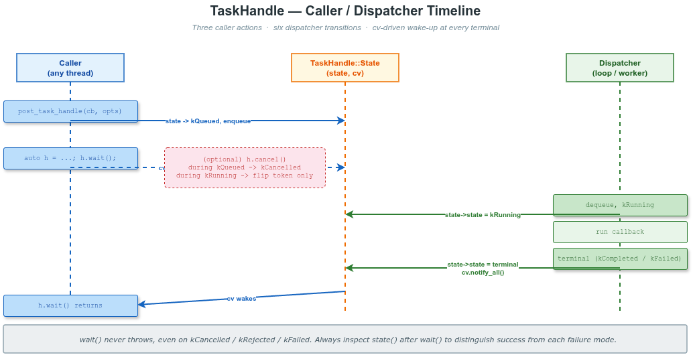

# task_handle -- Tracked 任务投递

`MessageLoop::post_task_handle()` / `ThreadPool::post_task_handle()` /
`MessageLoop::post_task_with_priority_handle()` 是 fire-and-forget 投递的 **tracked**
对应版本，返回 `vlink::TaskHandle` 共享句柄，可：

- `wait(timeout_ms)`：阻塞直至任务进入终态。
- `cancel()`：协作取消（已排队 → kCancelled；运行中 → 触发其 `cancellation_token`）。
- `state()` / `is_done()`：查询当前状态。
- `cancellation_token()`：在回调内部用于轮询取消。

## 1. 头文件

```cpp
#include <vlink/base/task_handle.h>    // TaskHandle / PostTaskOptions / 枚举
#include <vlink/base/cancellation.h>   // 父级 token
```

## 2. 调用方与 dispatcher 时序



## 3. 示例覆盖范围（13 段）

| 段落 | 主题 |
|------|------|
| 1  | `post_task_handle` 最简 + `wait()` |
| 2  | `PostTaskOptions::cancellation_token` 父级 token 触发 |
| 3  | 任务尚未执行时 `cancel()` -> `kCancelled` |
| 4  | 任务**运行中** `cancel()`：状态不变，需任务自行轮询自己的 `cancellation_token()`，最终通常落地为 `kCompleted` |
| 5  | 回调抛出异常 -> `kFailed` |
| 6  | 三个优先级 `post_task_with_priority_handle` |
| 7  | `TaskOverflowPolicy::kReject`：quit 后 post 立即 `kRejected` |
| 8  | `TaskDropPolicy::kProtected` vs `kDroppable`（API 演示） |
| 9  | `ThreadPool::post_task_handle` + 一次 cancel 整批 8 个 worker |
| 10 | `wait(timeout_ms)` 超时 vs 完成 |
| 11 | 句柄析构**不会**取消任务（dispatcher 自有强引用） |
| 12 | 句柄是共享句柄：copy 出来的句柄与原句柄共享同一 state，相互可见 |
| 13 | 默认构造的 `TaskHandle` 各 API 的安全语义（`valid=false`、`state=kInvalid`、`wait`/`cancel`返回 false） |

## 4. 构建与运行

```bash
cmake -S . -B build
cmake --build build --target example_task_handle
./build/examples/base/task_handle/example_task_handle
```

## 5. 关键枚举一览

`vlink::TaskExecutionState`：


| 状态        | 终态？ | 进入条件                                                       |
|-------------|--------|----------------------------------------------------------------|
| `kInvalid`  | 否     | 默认构造或未关联任务                                           |
| `kQueued`   | 否     | dispatcher 已接受                                              |
| `kRunning`  | 否     | 回调正在执行                                                   |
| `kCompleted`| 是     | 回调正常返回                                                   |
| `kCancelled`| 是     | 在 `kQueued` 阶段被 `cancel()` 或 parent token 触发            |
| `kDropped`  | 是     | overflow drop-oldest 选中此任务，在执行前丢弃                   |
| `kRejected` | 是     | dispatcher 拒收（quit / 无可丢任务 / `kReject` 队列满）         |
| `kFailed`   | 是     | 回调抛出异常                                                   |

`vlink::TaskOverflowPolicy`：

| 取值                       | 行为 |
|----------------------------|------|
| `kUseDispatcherStrategy`   | 沿用 dispatcher 的 `Strategy` 配置（默认） |
| `kReject`                  | 队列满立即拒绝，返回 `kRejected` 句柄 |
| `kBlock`                   | 持续 1ms sleep 重试直到入队 |

`vlink::TaskDropPolicy`：

| 取值          | 行为 |
|---------------|------|
| `kDroppable`  | 可被 drop-oldest 选中（默认） |
| `kProtected`  | 永不被 drop-oldest 选中；队列全 protected 时 post 失败 |

> **lock-free 队列**：`kProtected` 仅打印警告日志，**不能**阻止 overflow drop。
> 需要严格保护请用 `kNormalType` / `kPriorityType` 队列。

## 6. 整体管道架构


## 7. 锁顺序

```
MessageLoopAliveState::mtx  ->  MessageLoop::Impl::mtx  ->  TaskHandle::State::mtx
                                                              ↓（释放后再取）
                                                CancellationSource::State::mtx
```

`wait()` / 终态 cv 在 `TaskHandle::State::mtx` 上等待，回调释放该 mtx 后再触发，因此回调内可
再次调用 `cancel()` / `wait()` 而不会死锁。

## 8. 相关文档与图

- 章节：[doc/11-base-library.md §11.5 Tracked 任务投递](../../../doc/11-base-library.md)
- 状态机图：[doc/images/task-handle-state-machine.png](../../../doc/images/task-handle-state-machine.png)
- 管道图：  [doc/images/task-handle-pipeline.png](../../../doc/images/task-handle-pipeline.png)
- 协作取消：[examples/base/cancellation](../cancellation/README.md)
- 协程：    [examples/base/message_loop_coroutine](../message_loop_coroutine/README.md)
