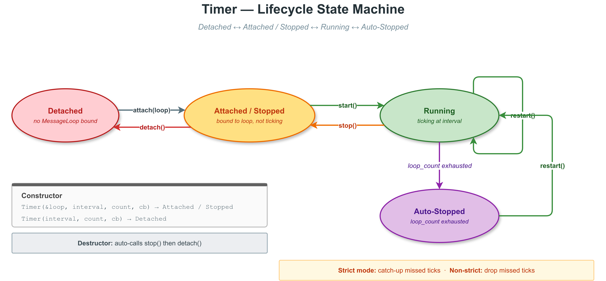

# VLink Timer 基础示例 -- 深入解析

## 1. 概述

`Timer` 是 VLink 的事件驱动定时器，与 `MessageLoop` 紧密集成。定时器到期时，回调作为普通任务投递到关联 MessageLoop 的队列中，与其他 `post_task` 投递的任务串行执行。这意味着回调在循环线程上执行，**无需额外同步**。

本示例深入演示 Timer 的构造、启动/停止/重启、循环次数控制、一次性延时调用以及动态参数修改。

## 2. 文件说明

| 文件 | 说明 |
|------|------|
| `timer_basic.cc` | Timer 基础功能演示源码 |
| `CMakeLists.txt` | 构建配置，链接 `vlink::all` |

## 3. 构建与运行

```bash
cmake -B build -S . -DCMAKE_PREFIX_PATH=/path/to/vlink/install
cmake --build build --target example_timer_basic
./build/output/bin/example_timer_basic
```

## 4. Timer 生命周期



### 4.1 状态机

Timer 有四种状态：

```
┌──────────┐  attach(loop)  ┌──────────────────┐  start()   ┌─────────┐
│ Detached │ ──────────────>│ Attached/Stopped │ ─────────>│ Running │
│          │                │                  │<──────────│         │
└──────────┘ <──────────────│                  │  stop()   │         │
               detach()     └──────────────────┘           └────┬────┘
                                                                │
                                              loop_count        │
                                              exhausted         v
                                                          ┌────────────┐
                                                          │Auto-Stopped│
                                                          └────────────┘
```

- **Detached**：未绑定 MessageLoop，不能启动
- **Attached/Stopped**：已绑定但未启动
- **Running**：正在定期触发回调
- **Auto-Stopped**：`loop_count` 达到上限后自动停止

### 4.2 Timer 与 MessageLoop 的关系

Timer 并非独立运行的系统定时器（如 `timerfd`），而是 MessageLoop 的**附属组件**。每次 MessageLoop 执行循环迭代时，它会检查所有注册的定时器：

```
MessageLoop 循环迭代：
  1. 从队列取出任务并执行
  2. 检查所有定时器是否到期
  3. 对到期的定时器：将回调 post_task 到队列
  4. 如果队列为空，进入 idle 策略
```

这意味着：
- **回调精度取决于循环线程的忙碌程度**：如果循环线程正在执行一个耗时任务，定时器回调会被延迟
- **回调是串行的**：同一循环上的多个定时器回调按序执行
- **每个循环最多 100 个定时器**：`kMaxTimerSize = 100`

### 4.3 Strict 模式 vs Non-Strict 模式

| 特性 | Strict 模式 | Non-Strict 模式（默认） |
|------|------------|----------------------|
| 错过的 tick | 立即补回所有错过的 tick | 直接丢弃 |
| 适用场景 | 需要精确计数的场景 | 周期性刷新的场景 |
| CPU 开销 | 可能在繁忙后突发大量回调 | 稳定 |

```cpp
timer.set_strict(true);   // 开启 strict 模式
timer.set_strict(false);  // non-strict（默认）
```

例如，50ms 定时器在循环线程忙碌 200ms 后：
- Strict 模式：连续触发 4 次补回错过的 tick
- Non-Strict 模式：只触发 1 次，丢弃 3 个错过的 tick

## 5. 关键代码分析

### 5.1 定时器构造

Timer 提供多种构造方式，灵活适配不同场景：

```cpp
// 方式 1：完整构造（附带循环、间隔、次数、回调）
Timer timer(&loop, 100, Timer::kInfinite, callback);

// 方式 2：仅指定循环
Timer timer(&loop);

// 方式 3：不指定循环（稍后通过 attach 绑定）
Timer timer(100, 5, callback);

// 方式 4：默认构造
Timer timer;
```

### 5.2 启动与停止

```cpp
timer.start();     // 启动，第一次触发在一个完整间隔后
timer.stop();      // 停止，不销毁对象
timer.restart();   // 重置计数器并重新启动
```

`start()` 可以接受可选的回调参数替换之前的回调。`restart()` 等效于 `stop()` + 重置 `invoke_count` + `start()`。

### 5.3 循环次数控制

```cpp
// 无限重复
Timer timer(&loop, 100, Timer::kInfinite, callback);

// 精确触发 3 次后自动停止
Timer timer(&loop, 100, 3, callback);
```

`kInfinite`（-1）表示无限重复。正数表示精确的触发次数。

运行时可查询：
```cpp
timer.get_loop_count();         // 总目标次数
timer.get_remain_loop_count();  // 剩余次数
timer.get_invoke_count();       // 已触发次数
timer.is_active();              // 是否仍在运行
```

### 5.4 call_once 一次性延时

```cpp
Timer::call_once(&loop, 200, []() {
    // 200ms 后执行一次，自动清理
});
```

`call_once` 是静态便捷方法，适合不需要管理 Timer 对象生命周期的简单延时任务。内部创建一个 `loop_count=1` 的定时器。

### 5.5 attach / detach

```cpp
Timer timer(100, 5, callback);  // 未绑定循环
timer.attach(&loop);            // 绑定到循环
timer.start();
// ...
timer.detach();                 // 解绑
timer.attach(&another_loop);    // 迁移到其他循环
```

定时器可以在不同的 MessageLoop 之间迁移。`detach()` 后定时器自动停止触发，但对象不被销毁。

### 5.6 动态参数修改

```cpp
timer.set_interval(50);          // 修改间隔
timer.set_loop_count(10);        // 修改总触发次数
timer.set_callback(new_callback); // 替换回调函数
```

参数修改在下次 `start()` 或 `restart()` 时生效。

## 6. 使用场景

### 6.1 场景 1：周期性状态发布

```cpp
Timer heartbeat(&loop, 1000, Timer::kInfinite, [&publisher]() {
    publisher.publish(build_heartbeat());
});
heartbeat.start();
```

### 6.2 场景 2：超时检测

```cpp
Timer timeout(&loop, 5000, 1, [&]() {
    VLOG_W("Operation timed out!");
    cancel_operation();
});
timeout.start();

// 操作完成时取消超时
on_operation_complete = [&timeout]() {
    timeout.stop();
};
```

### 6.3 场景 3：渐进式重试

```cpp
int retry_interval = 100;
Timer retry_timer(&loop, retry_interval, Timer::kInfinite, [&]() {
    if (try_connect()) {
        retry_timer.stop();
    } else {
        retry_interval = std::min(retry_interval * 2, 10000);
        retry_timer.set_interval(retry_interval);
        retry_timer.restart();
    }
});
```

## 7. 代码执行流程

1. **基础重复定时器**：100ms 间隔，无限触发，运行约 550ms 后手动停止
2. **限次定时器**：100ms 间隔，精确触发 3 次后自动停止
3. **启停周期**：演示 start/stop/restart 的使用
4. **call_once**：200ms 后触发一次性回调
5. **分离定时器**：先构造后 attach，演示解耦创建流程
6. **动态参数**：在两个阶段分别使用不同的间隔和次数

## 8. 常见错误

### 8.1 错误 1：Timer 生命周期短于回调使用的资源

```cpp
void setup(MessageLoop& loop) {
    int local_counter = 0;
    Timer timer(&loop, 100, Timer::kInfinite, [&local_counter]() {
        local_counter++;  // 悬空引用！
    });
    timer.start();
}  // timer 和 local_counter 都被销毁
```

Timer 回调捕获了局部变量的引用。函数返回后，局部变量销毁。

### 8.2 错误 2：在回调中做长时间阻塞操作

```cpp
Timer timer(&loop, 100, Timer::kInfinite, []() {
    std::this_thread::sleep_for(std::chrono::seconds(5));  // 阻塞循环线程！
});
```

回调在循环线程上执行，长时间阻塞会导致所有其他任务和定时器延迟。

### 8.3 错误 3：忘记 attach 就 start

```cpp
Timer timer(100, 5, callback);
timer.start();  // 没有绑定循环，start 无效
```

### 8.4 错误 4：interval 设为 0

```cpp
timer.set_interval(0);  // 自动回退到 kMinInterval（10 微秒）
```

## 9. 相关示例

- [timer_advanced](../timer_advanced/) -- strict 模式、优先级、多定时器、attach/detach 迁移
- [message_loop_basic](../message_loop_basic/) -- Timer 依赖的事件循环基础
- [deadline_timer](../deadline_timer/) -- 基于绝对时间点的定时器
- [schedule](../schedule/) -- Schedule::Config 高级任务调度
