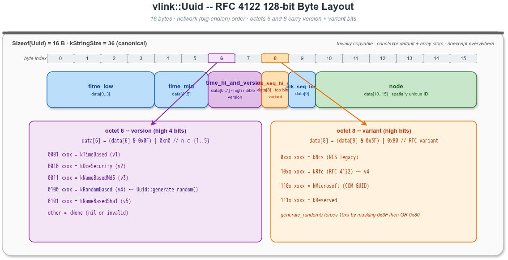
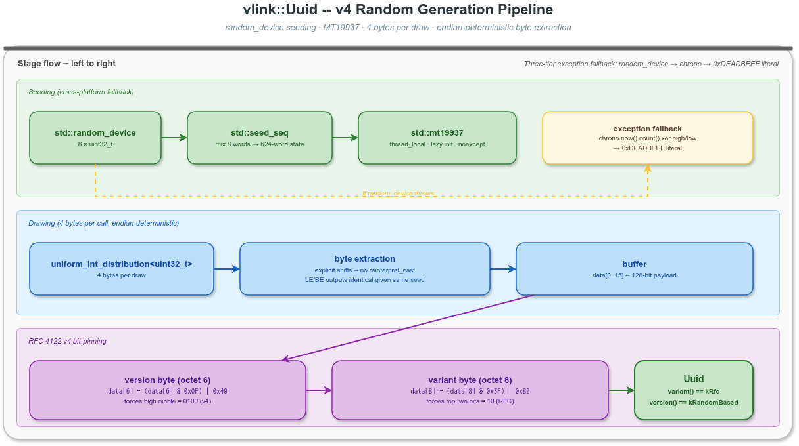

# VLink Uuid 基础操作 -- 深入解析

## 1. 概述

`vlink::Uuid` 是 VLink 框架内基于 RFC 4122 的 128 位通用唯一标识符值类型,并在此基础上提供 `random_bytes` / `random_hex` 两个项目级随机字节工具 -- proxy 握手层的 auth-token (`Uuid::random_hex()`) 即直接调用这两个 API。

本示例覆盖 `Uuid` 的所有公开能力：构造、变体/版本探测、文本序列化与解析、v4 随机生成、字节级访问、比较与哈希、ADL `swap`,以及 `constexpr` 编译期用法。

## 2. 文件说明

| 文件 | 说明 |
|------|------|
| `uuid_basic.cc` | 主程序入口,逐一调用各 demo 函数 |
| `uuid_examples.h` | 各演示函数定义,每个函数封装一个独立 demo 小节 |
| `CMakeLists.txt` | 构建配置,链接 `vlink::all` |

## 3. 构建与运行

```bash
cmake -B build -S . -DCMAKE_PREFIX_PATH=/path/to/vlink/install
cmake --build build --target example_uuid_basic
./build/output/bin/example_uuid_basic
```

## 4. UUID 数据模型

### 4.1 128-bit 字节布局



* `kByteSize = 16`,`kStringSize = 36`(canonical 形式含 4 个连字符)
* 标准 RFC 4122 v4 随机 UUID 满足：
  * 第 8 字节高 2 bit = `10` → `Variant::kRfc`
  * 第 6 字节高 4 bit = `0100` → `Version::kRandomBased`

### 4.2 文本表示

| 形式 | 长度 | 例 |
|------|------|----|
| Canonical | 36 | `47ac10b8-58cc-4a3c-8c5b-0e778899aabb` |
| Compact | 32 | `47ac10b858cc4a3c8c5b0e778899aabb` |
| Braced | 38 / 34 | `{47ac10b8-58cc-4a3c-8c5b-0e778899aabb}` |

`is_valid` / `from_string` 容许 hyphen 出现在任意位置。

## 5. 随机生成管线



三层异常兜底（`random_device` 抛 → `chrono::high_resolution_clock` 异或高低位 → 字面量 `0xDEADBEEF`),全 `noexcept`,Linux / Windows MSVC / MinGW / macOS / QNX / Android NDK 同套源码可编译。

`thread_local` 引擎首次访问时懒加载,后续抽样零分配。

## 6. Demo 列表

| 函数 | 主要 API 覆盖 |
|------|---------------|
| `demo_default_nil` | 默认构造 + `is_nil()` + `to_string()` |
| `demo_construct_from_array` | `Uuid(std::array<uint8_t,16>)` + `to_compact_string()` |
| `demo_construct_from_raw_array` | `Uuid(const uint8_t (&)[16])` |
| `demo_iterator_range` | 模板迭代器构造 + 错误长度退化为 nil |
| `demo_generate_random` | `Uuid::generate_random()` + variant / version 断言 |
| `demo_generate_random_with_engine` | `Uuid::generate_random(std::mt19937&)` 确定性 |
| `demo_from_string_round_trip` | canonical / braced / compact 三种解析 + round-trip |
| `demo_is_valid` | string_view + C-string + nullptr 路径 |
| `demo_variant_version_detect` | 全部 4 种 variant + 5 种 version 检测 |
| `demo_byte_access` | `bytes()` 引用 + `kByteSize` / `kStringSize` 常量 |
| `demo_comparisons_and_hash` | `operator==` / `!=` / `<` + `std::unordered_set` |
| `demo_random_bytes_and_hex` | `random_bytes(N)` / `random_hex(N)` / 零长度返回空 |
| `demo_swap` | 成员 `swap` + 状态交换 |
| `demo_constexpr_use` | `static_assert` 验证 default + array ctor 可在编译期使用 |

## 7. 与其他模块的关系

* **proxy 握手层**: `vlink::ProxyServer` 在构造阶段通过 `Uuid::random_hex()` 生成 128-bit auth token(对应 `proxy_server.cc`),由 `VLINK_PROXY_ENABLE_HANDSHAKE` 宏开关控制。
* **base 库**: `Uuid::random_bytes` / `random_hex` 是项目内规范的随机字节入口,任何需要短期会话标识或 debug 关联 ID 的模块都应通过此 API 获取,避免重复实现 RNG 引导逻辑。
* **CSPRNG 提示**: `std::mt19937` 非密码学安全,仅适用于会话标识;长期密钥请走 OpenSSL `RAND_bytes` 等专用 CSPRNG。

## 8. 进一步阅读

* [doc/11-base-library.md §11.16.3 Uuid](../../../doc/11-base-library.md) -- API 参考与 Doxygen 详解
* [doc/16-proxy.md](../../../doc/16-proxy.md) -- proxy 握手机制与 token 生命周期
* `include/vlink/base/uuid.h` -- 头文件本体（含完整 Doxygen 注释）
