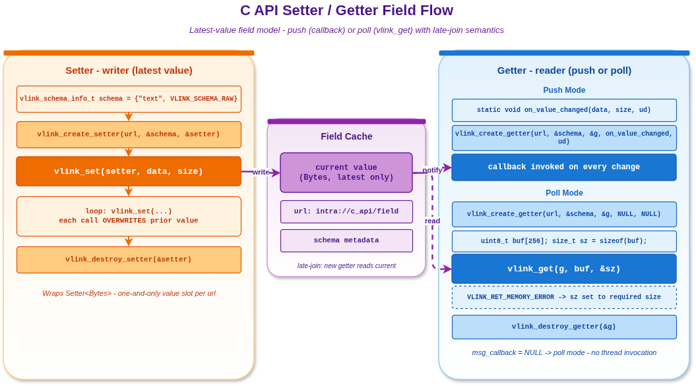

# c_field — 纯 C 实现的字段状态读写

本示例用约 110 行 C 代码演示 VLink 字段模型在纯 C 下的两种使用形态：**Push** —— 通过回调被动收到值变更；**Poll** —— 显式调用 `vlink_get` 把最新值拷贝到调用者缓冲区。两种 Getter 可以与同一个 Setter 共存。

字段模型的关键语义是"最新值缓存"：晚加入的 Getter 仍能立即拿到 Setter 写入过的最新一次值，这与事件模型的"在线广播"完全不同。

## 背景与适用场景

字段模型对应 C++ 模板 `vlink::Setter<T>` / `vlink::Getter<T>`，语义是 latest-value 状态同步：Setter 写入相当于把一个变量赋值，Getter 永远能读到最新一次写入的值。它不像事件模型那样关心历史流水，也不像方法模型那样需要请求-响应往返。

典型应用：

- **状态镜像**：传感器状态（温度、电量、姿态）持续推送到一个字段，多个消费者按需读。
- **配置同步**：上层把参数写到字段；下层驱动启动后立即读到当前值，无需等"下一次配置广播"。
- **晚加入兼容**：UI 进程重启后能立即获得后台进程的当前状态而无需等待下一次状态变化。

Push 与 Poll 的取舍：

- **Push（注册回调）**：低延迟、零轮询开销；适合需要即时响应字段变化的场景，但要求调用方运行内部线程模型。
- **Poll（无回调，主动 `vlink_get`）**：可控时点采样、与现有主循环耦合简单；多用于桌面 UI 刷新、嵌入式定时巡检。

## 核心 API

| API | 签名 | 说明 |
|-----|------|------|
| `vlink_create_setter` | `int (const char* url, const vlink_schema_info_t* schema, vlink_setter_handle_t* handle)` | 创建 Setter |
| `vlink_set` | `int (vlink_setter_handle_t handle, const uint8_t* data, size_t size)` | 覆盖式写入最新值；不区分"未变化"或"变化"，每次调用都视作新值 |
| `vlink_create_getter` | `int (const char* url, const vlink_schema_info_t* schema, vlink_getter_handle_t* handle, vlink_message_callback_t cb_or_null, void* user_data)` | 创建 Getter；回调可传 `NULL` 表示 Poll 模式 |
| `vlink_get` | `int (vlink_getter_handle_t handle, uint8_t* buf, size_t* buf_size)` | 把当前缓存值拷贝到 `buf`；`*buf_size` 入参表示容量，出参表示实际大小或所需容量 |
| `vlink_destroy_setter` / `vlink_destroy_getter` | `int (vlink_*_handle_t* handle)` | 释放原生资源 |

`vlink_get` 的返回码细节：

| 返回码 | 语义 |
|--------|------|
| `VLINK_RET_NO_ERROR` | 成功；`*buf_size` 是实际写入字节数 |
| `VLINK_RET_TRANSFER_ERROR` | 当前字段尚无值（Setter 还没 set 过、或晚 join 还没收到首发） |
| `VLINK_RET_MEMORY_ERROR` | `buf` 容量不足；`*buf_size` 已写为"所需容量"，调用方应据此扩容重试 |
| `VLINK_RET_INVALID_ERROR` | 参数为空 / handle 不合法 |

API 签名核对入口：`/work/vlink/include/vlink/external/c_api.h` 第 600-700 行。

## 代码导读

源码 `c_field.c` 共 111 行；按下面节拍展开。

### 1. Push 模式回调

回调签名与 PubSub 一致。本例仅打印并自增计数器：

```c
static int g_change_count = 0;

static void on_value_changed(const uint8_t* data, const size_t size, void* user_data) {
  (void)user_data;
  printf("[push] Value changed: %.*s\n", (int)size, (const char*)data);
  g_change_count++;
}
```

### 2. 创建 Setter 并写入初值

`vlink_set` 是覆盖式写入。先写入再创建 Getter 也能拿到这个初值——这就是字段模型的晚加入语义：

```c
vlink_setter_handle_t setter;
vlink_create_setter("intra://c_api/field", &schema, &setter);

const char* initial = "temperature=25";
vlink_set(setter, (const uint8_t*)initial, strlen(initial));
```

### 3. 两种 Getter 并存

Push 模式（传回调）+ Poll 模式（回调传 NULL）：

```c
vlink_getter_handle_t getter_push;
vlink_create_getter("intra://c_api/field", &schema, &getter_push,
                    on_value_changed, NULL);

vlink_getter_handle_t getter_poll;
vlink_create_getter("intra://c_api/field", &schema, &getter_poll,
                    NULL, NULL);
```

### 4. 连续覆盖式写入

每次 set 都视作字段变化，会触发 Push Getter 的回调；Poll Getter 内部缓存被刷新但不会自动通知：

```c
const char* values[] = {"temperature=28", "temperature=30",
                        "temperature=27", "temperature=32"};
for (int i = 0; i < 4; ++i) {
  vlink_set(setter, (const uint8_t*)values[i], strlen(values[i]));
  sleep_ms(50);
}
```

### 5. Poll 模式取值

调用方先准备一段够大的缓冲，`buf_size` 入参表示容量。若不够大会返回 `VLINK_RET_MEMORY_ERROR`，`*buf_size` 写为所需容量便于扩容重试：

```c
uint8_t buf[256];
size_t buf_size = sizeof(buf);
ret = vlink_get(getter_poll, buf, &buf_size);

if (ret == VLINK_RET_NO_ERROR) {
  printf("poll: %.*s (%zu bytes)\n", (int)buf_size, (const char*)buf, buf_size);
}
```

### 6. 清理

按相反顺序销毁，但实际顺序并不影响正确性：

```c
vlink_destroy_getter(&getter_poll);
vlink_destroy_getter(&getter_push);
vlink_destroy_setter(&setter);
```

## 运行

```bash
./build/output/bin/example_c_field
```

预期输出：

```
set("temperature=25") ret=0
[push] Value changed: temperature=25
set: "temperature=28" (ret=0)
[push] Value changed: temperature=28
set: "temperature=30" (ret=0)
[push] Value changed: temperature=30
set: "temperature=27" (ret=0)
[push] Value changed: temperature=27
set: "temperature=32" (ret=0)
[push] Value changed: temperature=32
poll: temperature=32 (14 bytes)
push callback invocations: 5
```

`intra://` 无任何前置守护进程，跑完即退。

## 常见陷阱

1. **Poll 缓冲扩容协议**：拿到 `VLINK_RET_MEMORY_ERROR` 时 `*buf_size` 已被写为"所需容量"；按此值重新分配再调用 `vlink_get`。不要忽略这个值或猜测大小。
2. **无值未必是错误**：刚创建 Getter 还没收到首发数据时 `vlink_get` 返回 `VLINK_RET_TRANSFER_ERROR`，这是预期路径而非异常，调用方应自行重试或等待。
3. **Push Getter 的丢失风险**：连续多次 `vlink_set` 时，传输后端可能聚合为单次回调（latest-value 语义），Push Getter 不保证回调次数等于 set 次数。需要严格"每次都收到"请改用事件模型。
4. **同 URL 多次 set 不去重**：`vlink_set` 不会做相等性比较；相同值连续写入仍是两次写入。
5. **跨语言对端**：Setter 与 Getter 在不同语言/进程里使用相同 URL + `ser` + `schema` 即可互通。

## 设计要点

- **覆盖式写入**：`vlink_set` 是最新值覆盖，不维护历史；这一点决定了 Push Getter 的丢失可能性。
- **Push/Poll 同模式**：同一个 URL 可同时存在多个 Push Getter 与 Poll Getter，互不影响。
- **缓冲扩容契约**：`vlink_get` 把容量协商交给调用方，避免内部 malloc/free，符合嵌入式约束。
- **晚加入有效**：Setter 早期 set 的值会被缓存；后到的 Getter 仍能立即读到，这是字段模型与事件模型的最大差别。

## 配图



图示了 Setter 写入、Push Getter 通过回调被动收到、Poll Getter 主动取值的两条路径。

## 参考

- `../c_pubsub/` — Event 模型 C 实现，可与本例对比"在线广播 vs 最新值"差异
- `../c_rpc/` — Method 模型 C 实现
- `../c_security/` — 在字段模型上叠加加密
- `vlink/include/vlink/external/c_api.h` — 唯一头文件
- 顶层 `doc/18-c-api.md` — C API 参考手册
