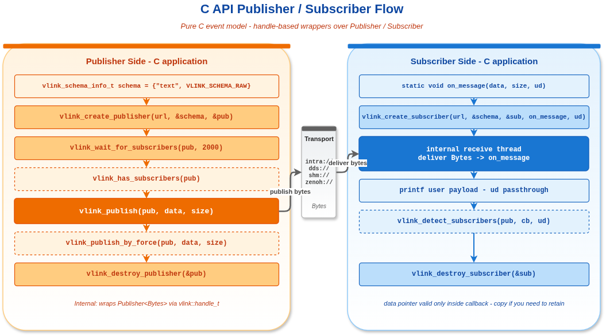

# C API 发布/订阅示例

## 1. 概述

本示例演示使用纯 C 语言的 VLink 发布/订阅（事件模型）API。C API 通过 `vlink_publisher_handle_t` 和 `vlink_subscriber_handle_t` 句柄封装底层 C++ 实现，提供稳定的跨语言接口。示例中的 `vlink_schema_info_t` 不是提示字段，而是创建节点时一次性写入的精确 wire metadata。



## 2. 核心 API

### 2.1 发布者

```c
vlink_publisher_handle_t pub;
vlink_schema_info_t schema = {
    .ser = "text",
    .schema = VLINK_SCHEMA_RAW,
};
vlink_create_publisher("intra://topic", &schema, &pub);
vlink_wait_for_subscribers(pub, 2000);
vlink_publish(pub, data, size);
vlink_destroy_publisher(&pub);
```

### 2.2 订阅者

```c
void on_message(const uint8_t* data, size_t size, void* user_data) {
    printf("Received %zu bytes\n", size);
}

vlink_subscriber_handle_t sub;
vlink_create_subscriber("intra://topic", &schema, &sub, on_message, NULL);
// ... 接收消息 ...
vlink_destroy_subscriber(&sub);
```

### 2.3 额外 API

| 函数 | 描述 |
|------|------|
| `vlink_has_subscribers(pub)` | 检查是否有匹配的订阅者 |
| `vlink_wait_for_subscribers(pub, ms)` | 阻塞等待订阅者 |
| `vlink_detect_subscribers(pub, cb, ud)` | 注册连接变更回调 |
| `vlink_publish_by_force(pub, data, size)` | 无订阅者时强制发布 |

## 3. 返回码

| 代码 | 值 | 含义 |
|------|---|------|
| `VLINK_RET_NO_ERROR` | 0 | 成功 |
| `VLINK_RET_UNEXPECTED_ERROR` | 1 | 条件未满足 |
| `VLINK_RET_INVALID_ERROR` | 2 | 无效句柄或 NULL |
| `VLINK_RET_MEMORY_ERROR` | 3 | 缓冲区太小 |
| `VLINK_RET_RUNTIME_ERROR` | 4 | C++ 异常 |
| `VLINK_RET_TRANSFER_ERROR` | 5 | 操作失败 |

## 4. 编译与运行

```bash
cd build
cmake .. && make example_c_pubsub
./output/bin/example_c_pubsub
```

CMakeLists.txt 使用 `LANGUAGES C` 和 `vlink::c_api` 链接。

## 5. 回调签名

```c
typedef void (*vlink_msg_callback_t)(const uint8_t* data, size_t size, void* user_data);
typedef void (*vlink_connect_callback_t)(bool is_connected, void* user_data);
```

## 6. 注意事项

- C API 内部使用 `Publisher<Bytes>` / `Subscriber<Bytes>`
- 通过 `vlink_schema_info_t` 在创建时同时设置 `ser + schema`
- `schema` 会按 `VLINK_SCHEMA_*` 的语义直接映射到底层 `SchemaType`，后续 discovery / proxy / bag / viewer 都依赖它
- 所有 create/destroy 必须配对调用
- 句柄不是线程安全的（不要在多个线程中同时 create/destroy）
- 回调在订阅者的内部接收线程上执行
- `data` 指针仅在回调执行期间有效

## 7. 相关文档

详细原理参见 [doc/18-c-api.md](../../../doc/18-c-api.md)。
