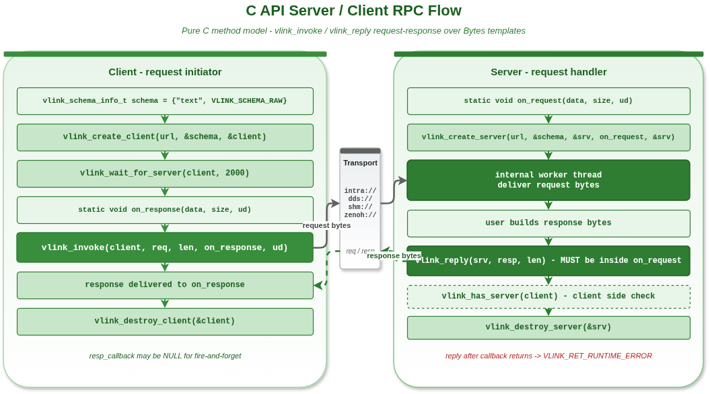

# C API RPC 示例

## 1. 概述

本示例演示使用纯 C 语言的 VLink 服务器/客户端（方法模型）API。创建接口统一通过 `vlink_schema_info_t` 传入 `ser + schema`，其中 `schema` 会精确映射到底层 `SchemaType`，C API 通过 `vlink_server_handle_t` 和 `vlink_client_handle_t` 句柄实现 RPC 通信。



## 2. 核心 API

### 2.1 服务器

```c
vlink_schema_info_t schema = {
    .ser = "text",
    .schema = VLINK_SCHEMA_RAW,
};

void on_request(const uint8_t* data, size_t size, void* user_data) {
    vlink_server_handle_t* server = (vlink_server_handle_t*)user_data;
    // 必须在回调内调用 vlink_reply
    vlink_reply(server, resp_data, resp_size);
}

vlink_server_handle_t server;
vlink_create_server("intra://rpc", &schema, &server, on_request, &server);
```

### 2.2 客户端

```c
void on_response(const uint8_t* data, size_t size, void* user_data) {
    printf("Response: %.*s\n", (int)size, (const char*)data);
}

vlink_client_handle_t client;
vlink_create_client("intra://rpc", &schema, &client);
vlink_invoke(client, req_data, req_size, on_response, NULL);
```

## 3. 重要：vlink_reply 协议

`vlink_reply()` **必须**在 `on_request` 回调内部调用。回调返回后再调用会返回 `VLINK_RET_RUNTIME_ERROR`。

```c
void on_request(const uint8_t* data, size_t size, void* user_data) {
    vlink_server_handle_t* srv = (vlink_server_handle_t*)user_data;

    // 处理请求并构建响应
    char resp[] = "OK";

    // 必须在此调用 vlink_reply
    vlink_reply(srv, (const uint8_t*)resp, strlen(resp));
}
```

## 4. 编译与运行

```bash
cd build
cmake .. && make example_c_rpc
./output/bin/example_c_rpc
```

## 5. 注意事项

- `vlink_reply()` 必须在请求回调内调用，回调外调用会返回 `VLINK_RET_RUNTIME_ERROR`
- 通过 `vlink_schema_info_t` 显式传入 `ser + schema`
- `schema` 会按 `VLINK_SCHEMA_*` 的语义直接映射到底层 `SchemaType`
- `vlink_invoke()` 的 `resp_callback` 可以为 NULL（不需要响应时）
- `vlink_wait_for_server()` 阻塞等待服务器可用
- 服务器句柄的 `reserved` 数组用于内部同步，不要修改

## 6. 相关文档

详细原理参见 [doc/18-c-api.md](../../../doc/18-c-api.md)。
