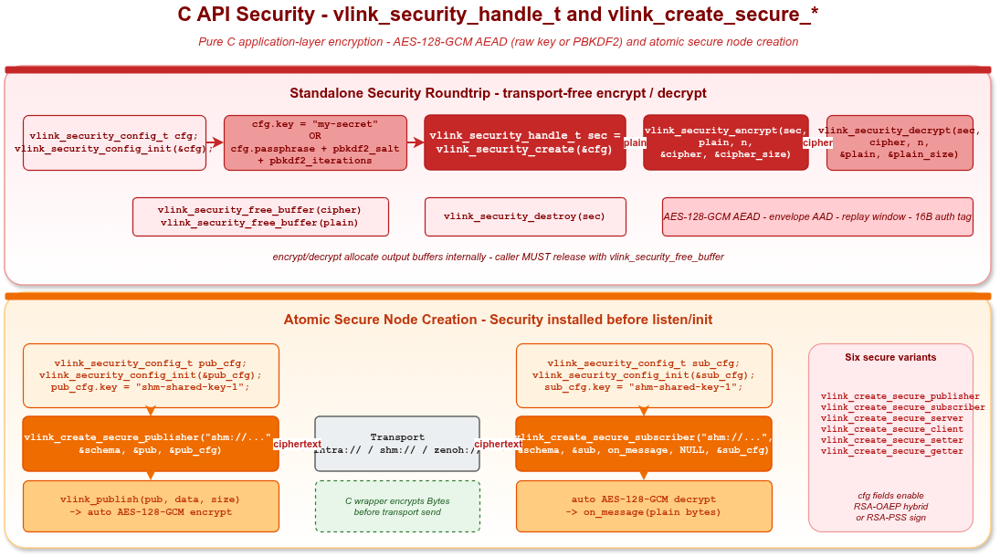

# C API Security 示例

## 1. 概述

本示例演示在纯 C 代码中使用 VLink 的应用层加密 API：

- **独立 `vlink_security_handle_t`**：脱离传输层的 encrypt / decrypt 往返，对 raw symmetric key 与 PBKDF2 passphrase 两种密钥派生方式各做一次。
- **原子 `vlink_create_secure_*`**：使用 `vlink_create_secure_publisher` / `vlink_create_secure_subscriber` 等函数在创建节点时一次性装入 `vlink_security_config_t`，传输层自动加密发送、解密接收。

加密算法：AES-128-GCM（AEAD）+ envelope AAD + sequence nonce + 16B 认证 tag。可通过 `vlink_security_config_t` 切换到 RSA-OAEP hybrid（设置 `public_key_pem` / `private_key_pem`）或 RSA-PSS 签名（设置 `advanced.signing_key_pem` / `advanced.verify_key_pem`）。



## 2. 编译运行

使用已安装且启用 C API / Security 的 VLink：

```bash
cmake -B build -S . -DCMAKE_PREFIX_PATH=/path/to/vlink/install
cmake --build build --target example_c_security
./build/output/bin/example_c_security
```

默认运行只执行 transport-free 的 standalone 加解密段。`shm://` pub/sub 段需要显式 opt-in，
并且要在后台先跑 iceoryx 守护进程：

```bash
iox-roudi &
VLINK_C_SECURITY_RUN_SHM=1 ./build/output/bin/example_c_security
```

未设置 `VLINK_C_SECURITY_RUN_SHM=1` 时 pub/sub 段会跳过，避免未启动 RouDi 的环境触发
Iceoryx fatal abort；独立 standalone 段始终可跑。

## 3. 核心 API

### 3.1 配置结构体

```c
typedef struct {
  const char* aad_context;          // AEAD 绑定上下文（<=65535 字节）
  uint32_t replay_window;           // init 默认 4096；设 0 可关闭 replay 检查
  const char* signing_key_pem;      // 本端签名私钥
  const char* verify_key_pem;       // 对端验签公钥
} vlink_security_advanced_config_t;

typedef struct {
  const char* key;                  // 原始对称种子；SHA-256 截断为 16B AES-128
  const char* passphrase;           // PBKDF2 入参（与 pbkdf2_salt 搭配）
  const uint8_t* pbkdf2_salt;       // ≥ 16 字节
  size_t pbkdf2_salt_size;
  uint32_t pbkdf2_iterations;       // 默认 200000，传 0 也按默认
  const char* public_key_pem;       // 对端 RSA 公钥（PEM）
  const char* private_key_pem;      // 本端 RSA 私钥（PEM）
  vlink_security_callback_t encrypt_callback;
  vlink_security_callback_t decrypt_callback;
  void* callback_user_data;
  vlink_security_advanced_config_t advanced;
} vlink_security_config_t;

void vlink_security_config_init(vlink_security_config_t* cfg);  // 清零 + 默认值；保持零配置会使用内置默认安全槽位
```

### 3.2 独立加解密

```c
vlink_security_config_t cfg;
vlink_security_config_init(&cfg);
cfg.key = "my-shared-secret";

vlink_security_handle_t sec = vlink_security_create(&cfg);

uint8_t* cipher = NULL;
size_t   cipher_size = 0;
vlink_security_encrypt(sec, plain, plain_size, &cipher, &cipher_size);

uint8_t* recovered = NULL;
size_t   recovered_size = 0;
vlink_security_decrypt(sec, cipher, cipher_size, &recovered, &recovered_size);

vlink_security_free_buffer(cipher);
vlink_security_free_buffer(recovered);
vlink_security_destroy(sec);
```

### 3.3 原子 create_secure

```c
vlink_publisher_handle_t pub;
vlink_create_secure_publisher("shm://demo/secure", &schema, &pub, &cfg);
vlink_publish(pub, data, size);    // 自动加密
vlink_destroy_publisher(&pub);
```

六种节点都有对应的原子构造接口：
`vlink_create_secure_publisher` / `_subscriber` / `_server` / `_client` / `_setter` / `_getter`。

`vlink_create_secure_*` 在 `advanced.aad_context` 为空时会自动绑定 `url|ser_type|schema_type`；`schema_info == NULL` 时按 C API 的 `Bytes` 默认值绑定为 `url||VLINK_SCHEMA_RAW`。传入零初始化的 `vlink_security_config_t` 会使用内置默认安全槽位；独立 `vlink_security_create()` 不会自动推导上下文，且 `cfg == NULL` 仍返回空句柄。

### 3.4 返回码

| 代码 | 值 | 含义 |
|---|---|---|
| `VLINK_RET_NO_ERROR` | 0 | 成功 |
| `VLINK_RET_INVALID_ERROR` | 2 | NULL / 无效句柄 / standalone encrypt/decrypt 输入长度为 0 |
| `VLINK_RET_MEMORY_ERROR` | 3 | MemoryPool 分配失败 |
| `VLINK_RET_RUNTIME_ERROR` | 4 | C++ 构造抛异常（极少） |
| `VLINK_RET_TRANSFER_ERROR` | 5 | encrypt/decrypt 失败（错 key / 篡改 / replay 拒绝 / 短输入） |

## 4. 限制

- C API 的 `vlink_create_secure_*` 在 C wrapper 层对 `Bytes` payload 加解密；它不走 C++ `SecurityXxx` 的 `NodeImpl::enable_security()` 传输限制。跨 C API / C++ / Python 互通时，双方必须使用相同 URL、schema metadata 和等价的安全配置（同一显式配置，或双端都使用零初始化/空配置默认安全槽位）。
- 因为 `Security` 在 `vlink_create_secure_*` 内部于 `listen()` / `init()` 之前装配，所以不存在“前几条消息可能走明文”的窗口。
- `vlink_security_config_t.encrypt_callback` 与 `decrypt_callback` 必须**成对**安装，单独一个会被忽略并打 warning。
- 同一 `vlink_security_handle_t` 上的 encrypt/decrypt callback 会串行执行；多个 handle 共享回调状态时仍需业务自行同步。

## 5. 相关

- C++ 同语义示例：`examples/security/security_basic` / `security_custom` / `security_rsa`
- 头文件：`include/vlink/external/c_api.h`（vlink_security_* / vlink_ssl_options_*）
- 文档：`doc/09-security.md`、`doc/18-c-api.md`
