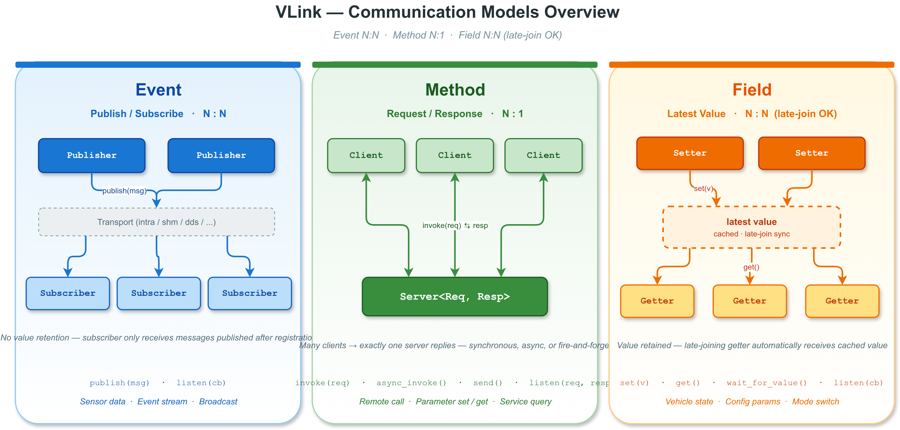

# Event Advanced -- VLink 事件模型进阶示例

## 通信模型概览



## 概述

本示例在基础事件模型之上，演示 Publisher/Subscriber 的高级功能：订阅者检测、延迟跟踪、强制发布和多订阅者扇出。

```
Publisher ──detect_subscribers(cb)──> 异步通知连接状态变化
Publisher ──publish(msg, force=true)──> 即使无订阅者也强制发布
Subscriber ──set_latency_and_lost_enabled(true)──> 启用延迟/丢失跟踪
Multiple Subscribers ──listen()──> 同一 topic 的扇出分发
```

## 功能清单

| 功能 | API | 说明 |
|------|-----|------|
| 订阅者异步检测 | `detect_subscribers(callback)` | 订阅者连接/断开时触发回调 |
| 阻塞等待订阅者 | `wait_for_subscribers(timeout)` | 阻塞直到至少一个订阅者出现 |
| 非阻塞查询 | `has_subscribers()` | 返回当前是否有订阅者 |
| 强制发布 | `publish(msg, true)` | 无订阅者时仍然发送 |
| 延迟跟踪 | `set_latency_and_lost_enabled(true)` | 启用端到端延迟测量 |
| 读取延迟 | `get_latency()` | 返回最近一条消息的延迟（微秒） |
| 丢失统计 | `get_lost()` | 返回累积的消息丢失统计 |

## 关键代码分析

### 1. detect_subscribers -- 异步连接通知

```cpp
pub.detect_subscribers([](bool has_subscribers) {
    VLOG_I("[Publisher] Subscriber presence changed: ", has_subscribers);
});
```

`detect_subscribers` 注册一个回调，在订阅者连接状态发生变化时触发：
- `has_subscribers = true`：至少有一个订阅者连接
- `has_subscribers = false`：最后一个订阅者断开

如果注册时已经有订阅者存在，回调会立即同步触发。该功能在跨进程传输（如 `shm://`、`dds://`）中尤为重要，因为跨进程的订阅者可能随时加入或退出。

### 2. has_subscribers -- 非阻塞查询

```cpp
bool has = pub.has_subscribers();
```

非阻塞查询当前是否有活跃的订阅者。返回传输层最近一次已知的对端状态。对于 `dds://`，状态更新依赖 DDS 发现机制。

### 3. 强制发布

```cpp
bool ok_normal = pub.publish(forced_msg);        // 无订阅者 => 空操作
bool ok_forced = pub.publish(forced_msg, true);  // force=true => 始终发送
```

默认情况下，`publish()` 在没有订阅者时是空操作，返回 `false`。传入 `force=true` 可以强制发送数据，适用于以下场景：
- **数据录制**：即使没有实时订阅者，数据也需要写入 bag 文件
- **日志收集**：确保每条日志都被传输
- **Field 模型内部**：Setter 内部使用 force=true 确保值被缓存

### 4. 多订阅者扇出

```cpp
Subscriber<SensorReading> sub1("dds://advanced/sensor");
Subscriber<SensorReading> sub2("dds://advanced/sensor");
Subscriber<SensorReading> sub3("dds://advanced/sensor");
```

多个 Subscriber 可以监听同一 URL。Publisher 的每条消息会被扇出（fan-out）到所有活跃的 Subscriber。每个 Subscriber 独立接收完整的消息副本，各自的回调互不干扰。

### 5. 延迟跟踪

```cpp
sub3.set_latency_and_lost_enabled(true);
sub3.listen([&sub3](const SensorReading& msg) {
    int64_t latency_us = sub3.get_latency();
    VLOG_I("latency=", latency_us, "us");
});
```

- `set_latency_and_lost_enabled(true)` 必须在 `listen()` 之前调用
- `get_latency()` 返回最近一条消息的端到端延迟，单位为微秒
- 延迟测量基于发布时间戳和接收时间戳之差

### 6. 丢失统计

```cpp
SampleLostInfo lost_info = sub3.get_lost();
VLOG_I("total=", lost_info.total, " lost=", lost_info.lost);
```

`SampleLostInfo` 包含两个字段：
- `total`: 预期收到的消息总数（已送达 + 已丢失）
- `lost`: 丢失或被丢弃的消息数量

对于 `dds://` 传输，在可靠（Reliable）QoS 模式下丢失通常为 0。在 BestEffort 模式或网络拥塞时，缓冲区溢出可能导致消息丢失。

## 消息扇出流程

```
pub.publish(SensorReading{id=1, value=10.1})
   |
   ├──> Sub1: listen callback --> VLOG_I("Sub1 received")
   |
   ├──> Sub2: listen callback --> sub2_count++
   |
   └──> Sub3: listen callback --> 测量 latency, sub3_count++
```

## 编译与运行

```bash
mkdir build && cd build
cmake .. -DCMAKE_PREFIX_PATH=/path/to/vlink/install
make example_event_advanced
./output/bin/example_event_advanced
```

## 预期输出

```
[I] === VLink Event Advanced Example ===
[I] --- Section 1: detect_subscribers ---
[I] [Publisher] has_subscribers (before): 0
[I] --- Section 2: Force publish ---
[I] [Publisher] Normal publish (no subs): 0
[I] [Publisher] Forced publish (no subs): 1
[I] --- Section 3: Multiple subscribers ---
[I] [Publisher] Subscriber presence changed: 1
[I] --- Section 4: Latency and lost tracking ---
[I] --- Section 5: wait_for_subscribers ---
[I] [Publisher] wait_for_subscribers: 1
[I] --- Section 6: Publish and observe ---
[I] [Sub1] sensor_id=1 value=10.1
[I] [Sub3-latency] sensor_id=1 latency=5us
...
[I] --- Section 7: Delivery statistics ---
[I] [Sub3] total=5 lost=0
[I] [Sub1] received: 5
[I] [Sub2] received: 5
[I] [Sub3] received: 5
[I] === Example complete ===
```

## 文件结构

| 文件 | 说明 |
|------|------|
| `sensor_types.h` | POD 消息类型 `SensorReading` 的定义 |
| `event_advanced.cc` | 单进程合并示例（Publisher + 多 Subscriber） |
| `publisher_main.cc` | 多进程拆分：Publisher 端（独立可执行文件） |
| `subscriber_main.cc` | 多进程拆分：Subscriber 端（独立可执行文件） |
| `CMakeLists.txt` | 构建配置（生成 3 个可执行文件） |

### 多进程运行方式

```bash
# 终端 1: 启动 Subscriber
./output/bin/example_event_advanced_subscriber

# 终端 2: 启动 Publisher
./output/bin/example_event_advanced_publisher
```

## 扩展思考

- `detect_subscribers` 可用于实现"按需发布"模式：只有当订阅者存在时才启动数据采集。
- 延迟跟踪可用于 QoS 监控：当延迟超过阈值时触发告警。
- 在生产环境中，应监控 `get_lost()` 的丢失率，超过阈值时考虑增大缓冲区深度或降低发布频率。
- 多订阅者模式可用于实现"旁路监控"：一个 Subscriber 处理业务逻辑，另一个 Subscriber 记录日志或性能指标。

## 相关文档

详细原理参见 [doc/03-event-model.md](../../../doc/03-event-model.md)。
