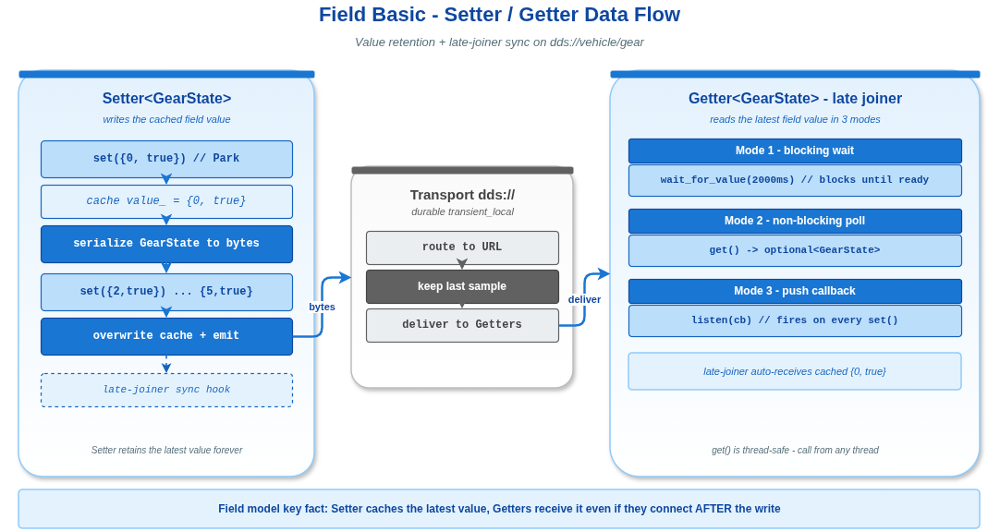

# Field Basic -- VLink 字段模型基础示例

## 1. 通信模型概览


## 2. 概述

本示例演示 VLink **字段模型 (Field Model)** 的基本用法：`Setter` 写入字段值、`Getter` 读取字段值。字段模型的核心特征是**值保留** -- Setter 缓存最新值，后加入的 Getter 可以立即获取当前状态。



```
Setter<GearState> ──set(value)──> [dds:// 缓存] ──> Getter<GearState>
                                                          ├── get() -> optional
                                                          ├── wait_for_value()
                                                          └── listen(callback)
```

## 3. 字段模型 vs 事件模型

| 特性 | 字段模型 (Setter/Getter) | 事件模型 (Publisher/Subscriber) |
|------|--------------------------|-------------------------------|
| 最新值缓存 | Setter 内部缓存最新值 | 不缓存 |
| 迟到加入 | 新 Getter 自动收到当前值 | 新 Subscriber 只收到后续消息 |
| 读取模式 | 支持 get()/wait_for_value()/listen() | 仅 listen() |
| 语义 | "状态字段" -- 关注当前值 | "事件流" -- 关注每条消息 |
| 适用场景 | 配置参数、系统状态、传感器最新读数 | 日志流、命令序列、数据帧 |

## 4. 核心 API

### 4.1 Setter<T>

| 方法 | 说明 |
|------|------|
| `Setter(url)` | 构造并初始化 Setter |
| `set(value)` | 写入新值，通知所有 Getter，缓存以支持迟到加入 |

### 4.2 Getter<T>

| 方法 | 说明 |
|------|------|
| `Getter(url)` | 构造并初始化 Getter |
| `get()` | 非阻塞读取，返回 `std::optional<T>`。无值时返回 `nullopt` |
| `wait_for_value(timeout)` | 阻塞等待直到值可用。默认超时 5000ms |
| `listen(callback)` | 注册值变更回调，每次 Setter 写入新值时触发 |

## 5. 关键代码分析

### 5.1 Setter 创建与初始值设置

```cpp
Setter<GearState> setter("dds://vehicle/gear");
GearState initial_gear{0, true};
setter.set(initial_gear);
```

`set()` 做两件事：
1. 将值序列化后写入传输层
2. 在 Setter 内部缓存该值

当后续有新的 Getter 连接时，传输层自动将缓存值同步给它（late-joiner sync）。这是字段模型与事件模型的根本区别。

### 5.2 Getter 的三种读取模式

**模式 1: wait_for_value -- 阻塞等待**

```cpp
if (getter.wait_for_value(2000ms)) {
    // 值已可用，可以调用 get()
}
```

阻塞当前线程直到 Getter 收到至少一个值。适用于初始化阶段，确保配置已经加载完成。

**模式 2: get() -- 非阻塞轮询**

```cpp
auto current = getter.get();
if (current.has_value()) {
    int gear = current->gear;
}
```

返回 `std::optional<T>`。如果 Setter 从未写入过值（且没有缓存值同步），返回 `nullopt`。线程安全，可以从任意线程调用。

**模式 3: listen(callback) -- 回调通知**

```cpp
getter.listen([](const GearState& gear) {
    // 每次 Setter 调用 set() 时触发
});
```

注册一个回调函数，每次 Setter 写入新值时触发。回调在 `attach()` 指定的 MessageLoop 线程上执行（如果未 attach，则在传输层线程上执行）。

**注意**: `listen()` 只能调用一次。重复调用会触发 Fatal 错误。

### 5.3 迟到加入（Late-Joiner）机制

```cpp
// Step 1: Setter 先写入值
setter.set({0, true});  // Park

// Step 2: 延迟后创建 Getter
Getter<GearState> getter("dds://vehicle/gear");
// Getter 自动收到 Setter 的缓存值 {0, true}
```

这是字段模型的核心价值。在分布式系统中，组件的启动顺序不可预测。字段模型确保无论 Getter 何时加入，都能获取到当前状态。

### 5.4 值更新与回调触发

```cpp
GearState gears[] = {{2, true}, {3, true}, {4, true}};
for (const auto& gear : gears) {
    setter.set(gear);
}
```

每次 `set()` 调用都会：
1. 更新 Setter 内部缓存
2. 序列化并通过传输层发送
3. Getter 收到后更新本地 `value_`，触发 `listen` 回调
4. `get()` 后续调用返回最新值

## 6. 数据流转过程

```
1. setter.set({3, true})
   ├── 缓存 value_ = {3, true}
   ├── 序列化 GearState -> Bytes (memcpy)
   └── 写入 dds:// 传输层

2. dds:// 传输层投递到 Getter
   └── Getter 内部处理:
       ├── 反序列化 Bytes -> GearState
       ├── 更新 value_ = {3, true}
       ├── 通知 wait_for_value() (如果在等待)
       └── 执行 listen 回调 (如果已注册)

3. getter.get()
   └── 返回 optional<GearState>{3, true}
```

## 7. 编译与运行

```bash
cmake -B build -S . -DCMAKE_PREFIX_PATH=/path/to/vlink/install
cmake --build build --target example_field_basic
./build/output/bin/example_field_basic
```

## 8. 预期输出

```
[I] === VLink Field Basic Example ===
[I] [Setter] Created on dds://vehicle/gear
[I] [Setter] Initial gear set to Park (0)
[I] [Getter] Created on dds://vehicle/gear
[I] [Getter] Waiting for initial value...
[I] [Getter] wait_for_value() succeeded
[I] [Getter] Current gear: 0 engaged: 1
[I] [Setter] Shifting gears...
[I] [Getter] Value changed: gear=2 engaged=1
[I] [Setter] Set gear to: 2
[I] [Getter] Value changed: gear=3 engaged=1
...
[I] [Getter] Final gear: 0 engaged: 1
[I] [Getter] Callback invocations: 5
[I] === Example complete ===
```

## 9. 文件结构

| 文件 | 说明 |
|------|------|
| `vehicle_types.h` | POD 消息类型 `GearState` 的定义 |
| `field_basic.cc` | 主程序：Setter + Getter 在同一进程 |
| `CMakeLists.txt` | 构建配置 |

## 10. 扩展思考

- 如果需要过滤重复值（Setter 连续写入相同值），可以使用 `set_change_reporting(true)`，参见 `field_advanced` 示例。
- 将 `dds://` 替换为 `shm://` 或 `zenoh://` 可切换传输协议，API 不变。
- 在车载系统中，字段模型常用于表示车辆状态（挡位、车速、电池电量等），确保任何时刻查询都能得到最新值。
- `get()` 是线程安全的，可以从多个线程并发调用。

## 11. 相关文档

详细原理参见 [doc/05-field-model.md](../../../doc/05-field-model.md)。
