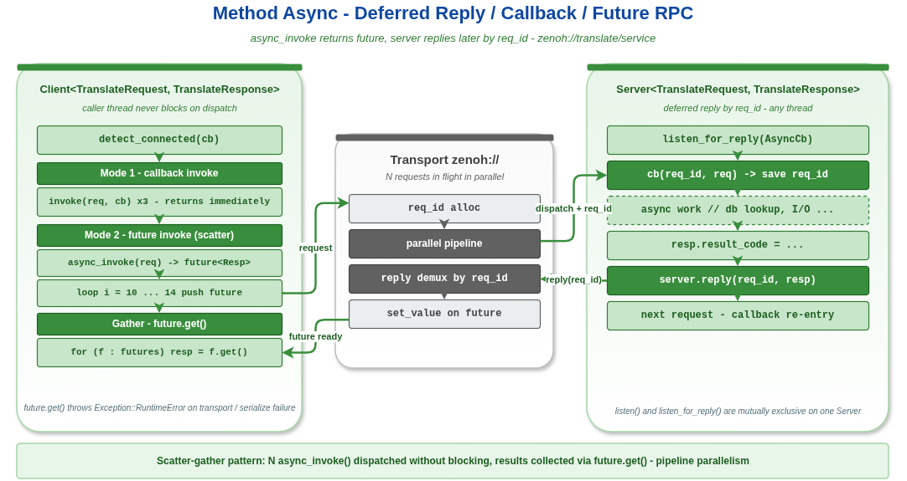

# Method Async -- VLink 方法模型异步调用示例

## 1. 通信模型概览


## 2. 概述

本示例演示 VLink **方法模型 (Method Model)** 的异步调用模式：Server 端使用 `listen_for_reply` 延迟回复，Client 端使用 `invoke(req, callback)` 回调模式和 `async_invoke(req)` Future 模式。



```
Client ──async_invoke(req)──> [zenoh://] ──> Server: callback(req_id, req)
                                                      ... 异步处理 ...
                                              Server: reply(req_id, resp)
                                              [zenoh://] ──> Client: future.get()
```

## 3. 核心 API

### 3.1 Server 端异步处理

| 方法 | 说明 |
|------|------|
| `listen_for_reply(callback)` | 注册异步回调，接收 `(uint64_t req_id, const Req&)` |
| `reply(req_id, resp)` | 发送延迟响应，`req_id` 必须匹配收到的请求 ID |

### 3.2 Client 端异步调用

| 方法 | 说明 |
|------|------|
| `invoke(req, callback)` | 非阻塞，响应到达时触发回调 |
| `async_invoke(req)` | 非阻塞，返回 `std::future<Resp>` |
| `detect_connected(callback)` | 异步通知 Server 连接状态 |

## 4. 关键代码分析

### 4.1 listen_for_reply -- Server 端延迟回复

```cpp
server.listen_for_reply([&server](uint64_t req_id, const TranslateRequest& req) {
    // 保存 req_id，可以在任意时间、任意线程回复
    TranslateResponse resp;
    resp.word_id = req.word_id;
    resp.result_code = 0;
    server.reply(req_id, resp);
});
```

`listen_for_reply` 与同步 `listen` 的核心区别：

| 特性 | `listen(ReqRespCallback)` | `listen_for_reply(AsyncCb)` |
|------|--------------------------|----------------------------|
| 回调签名 | `(const Req&, Resp&)` | `(uint64_t req_id, const Req&)` |
| 响应方式 | 回调返回前填写 `Resp&` | 稍后调用 `reply(req_id, resp)` |
| 响应线程 | 必须在回调线程中完成 | 可以在任意线程中完成 |
| 适用场景 | 计算密集型、即时可得的结果 | I/O 密集型、需要聚合多个数据源 |

**关键约束**:
- `reply()` 只能在 `listen_for_reply` 模式下调用
- `req_id` 必须与回调中收到的 ID 完全匹配
- 每个 `req_id` 只能 `reply` 一次

### 4.2 invoke(req, callback) -- 回调异步

```cpp
client.invoke(req, [](const TranslateResponse& resp) {
    // 响应到达时在传输层/loop 线程上触发
    VLOG_I("Result: ", resp.result_code);
});
// invoke 立即返回，不阻塞
```

回调异步模式的特点：
- `invoke()` 立即返回 `true`/`false`（表示请求是否被传输层接受）
- 回调在传输层线程或 `attach()` 的 MessageLoop 线程上执行
- 适用于事件驱动编程风格

### 4.3 async_invoke(req) -> future -- Future 异步

```cpp
auto future = client.async_invoke(req);
// 非阻塞，可以继续执行其他任务
TranslateResponse resp = future.get();  // 在需要结果时阻塞
```

Future 异步模式的特点：
- `async_invoke()` 返回 `std::future<Resp>`
- 调用 `future.get()` 阻塞直到响应到达
- 如果发生错误（序列化/传输/反序列化），future 会设置异常 `Exception::RuntimeError`
- 适用于需要并行发起多个请求的场景

### 4.4 并行 Future 模式

```cpp
std::vector<std::future<TranslateResponse>> futures;
for (int i = 10; i <= 14; ++i) {
    futures.push_back(client.async_invoke(req));
}
// 所有请求已并行发出
for (auto& f : futures) {
    auto resp = f.get();  // 依次等待结果
}
```

这种模式实现了"scatter-gather"并行调用：
1. 批量发出所有请求（非阻塞）
2. 依次收集结果

比串行 `invoke()` 效率更高，因为多个请求可以在传输层中并行处理。

### 4.5 detect_connected -- 异步连接通知

```cpp
client.detect_connected([&server_ready](bool connected) {
    server_ready = connected;
});
```

与 `wait_for_connected()` 不同，`detect_connected()` 不阻塞：
- 如果 Server 已连接，回调立即同步触发
- 否则在 Server 变为可用时异步触发
- 连接断开时也会触发（`connected = false`）

## 5. 异步处理流程

```
Client                    Transport               Server
  |                         |                        |
  |--async_invoke(req)----->|                        |
  |  (returns future)       |--deliver request------>|
  |                         |                        |--listen_for_reply(req_id, req)
  |  ... 可以做其他事 ...    |                        |  ... 异步处理 ...
  |                         |                        |--reply(req_id, resp)
  |                         |<--deliver response-----|
  |<--future resolved-------|                        |
  |  future.get() = resp    |                        |
```

## 6. 编译与运行

```bash
mkdir build && cd build
cmake .. -DCMAKE_PREFIX_PATH=/path/to/vlink/install
make example_method_async
./output/bin/example_method_async
```

## 7. 预期输出

```
[I] === VLink Method Async Example ===
[I] --- Section 1: listen_for_reply ---
[I] [Server] Listening with deferred reply on zenoh://translate/service
[I] --- Section 2: detect_connected ---
[I] [Client] Server connection: 1
[I] --- Section 3: invoke(req, callback) ---
[I] [Client] invoke #1 dispatched (non-blocking)
[I] [Server] Received request: word_id=1 lang=1 req_id=1
[I] [Server] Replied to req_id=1 ok=1
[I] [Client] Callback #1: word_id=1 lang=1 code=0
...
[I] --- Section 4: async_invoke -> future ---
[I] [Client] async_invoke word_id=10 dispatched
...
[I] [Client] Future #0: word_id=10 lang=1 code=0
...
[I] --- Section 5: Mixed sync + async ---
[I] [Client] Sync result: word_id=50 code=0
[I] [Client] Async result: word_id=51 code=0
[I] === Example complete ===
```

## 8. 文件结构

| 文件 | 说明 |
|------|------|
| `translate_types.h` | POD 消息类型 `TranslateRequest` / `TranslateResponse` 的定义 |
| `method_async.cc` | 单进程合并示例（Server + Client） |
| `server.cc` | 多进程拆分：Server 端（独立可执行文件） |
| `client.cc` | 多进程拆分：Client 端（独立可执行文件） |
| `CMakeLists.txt` | 构建配置（生成 3 个可执行文件） |

### 8.1 多进程运行方式

```bash
# 终端 1: 启动 Server
./output/bin/example_method_async_server

# 终端 2: 启动 Client
./output/bin/example_method_async_client
```

## 9. 扩展思考

- `listen_for_reply` 适用于需要查询数据库、调用外部 API 或等待硬件响应的场景。Server 可以先返回，待结果就绪后再调用 `reply()`。
- `async_invoke` 配合 `std::when_all` 或手动轮询可以实现更复杂的并行调用模式。
- 在跨进程场景中（`dds://`、`someip://`），异步模式尤为重要，因为网络延迟使得同步阻塞代价更高。
- 如果 Server 不需要回复（单向通知），使用 `Server<Req>` 的即发即忘模式，参见 `method_fire_forget` 示例。
- 注意：`listen()` 和 `listen_for_reply()` 是互斥的，同一个 Server 只能调用其中一种。

## 10. 相关文档

详细原理参见 [doc/04-method-model.md](../../../doc/04-method-model.md)。
