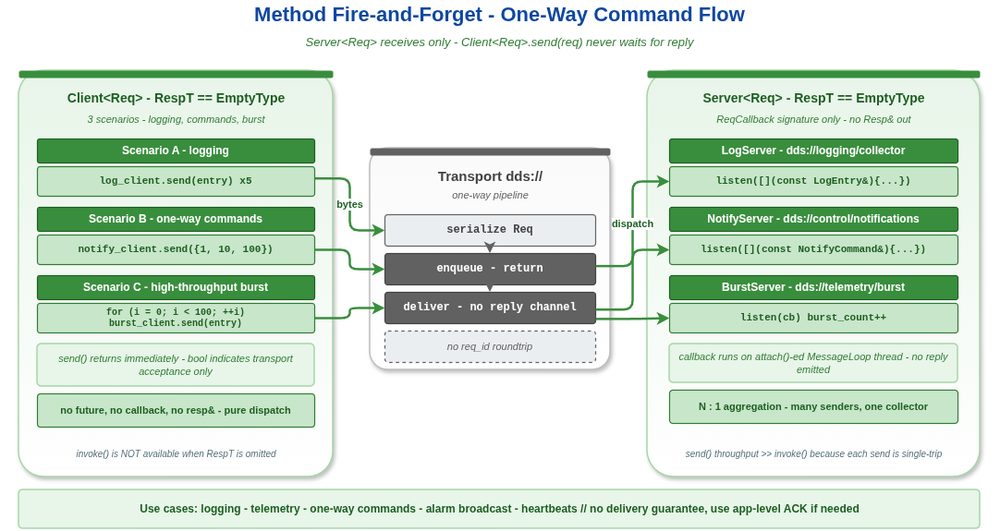

# method_fire_forget — Method 模型单向调用：`send()` 不等响应

本示例演示 Method 模型的第三种形态 —— **fire-and-forget（发后不管）**。客户端通过 `send()` 把请求送出去就立刻返回，不等服务端回 reply；服务端注册的 `listen` 回调只接收请求，不构造也不发送响应。

这是 RPC 的"轻量版"，常用于日志收集、通知下发、指标上报等"不关心结果"的场景。它在 vlink 里用**省略模板参数 `Resp`** 的方式表达 —— `Server<Req>` / `Client<Req>` 比 `Server<Req,Resp>` / `Client<Req,Resp>` 在编译期就少了响应通道。

读完本示例你能掌握：

- 单向 RPC 的模板形态：`Server<Req>` / `Client<Req>` 的声明区别。
- `send(req)` 与 `invoke(req)` 的语义和成本差异。
- 三种典型场景：日志收集、通知命令、高频突发。

## 背景与适用场景

适用场景：

- 应用日志、审计、Trace 上报：丢一两条不致命，关键是上报代价低。
- 通知 / 命令下发：让对方知道发生了某事，是否真的执行有自己的状态机判断。
- 高频遥测：吞吐压倒一切的场景，每次都等 reply 会引入 RTT 时延。

不适合：

- 必须知道是否处理成功（用 `method_sync` 或 `method_async`）。
- 客户端需要服务端回填某些字段（用 `method_sync`）。
- 命令成功率必须 100%（fire-and-forget 不提供失败重传机制；需要应用层补偿）。

底层语义：fire-and-forget 在传输层等价于"单向 Event"。Server 端用 `listen(cb)` 注册回调，Client 端用 `send(req)` 把消息推过去，**没有 request_id 关联响应**。Server 端不能给特定请求回响应，但仍可以反向用 Publisher 主动广播状态。

## 核心 API

| API | 签名 | 说明 |
|-----|------|------|
| `vlink::Server<Req>` | `explicit Server(const std::string& url, InitType type = kWithInit)` | 服务端，省略 RespT，等价于 `Server<Req, Traits::EmptyType>` |
| `Server::listen` | `bool listen(ReqCallback&& cb)` | 回调入参只有 `const Req&`，没有 resp 输出参数 |
| `vlink::Client<Req>` | `explicit Client(const std::string& url, InitType type = kWithInit)` | 客户端，省略 RespT |
| `Client::send` | `bool send(const Req&)` | 非阻塞发送；返回 false 表示传输层拒绝（如 Reliability=Reliable 时队列满） |
| `Client::wait_for_connected` | `bool wait_for_connected(std::chrono::milliseconds timeout)` | 与双向 Client 行为一致 |

## 代码导读

### 1. 日志收集服务

```cpp
Server<LogEntry> log_server("dds://logging/collector");
log_server.attach(&server_loop);

std::atomic<int> log_count{0};
log_server.listen([&log_count](const LogEntry& entry) {
  static constexpr const char* kLevelStr[] = {"DEBUG", "INFO", "WARN", "ERROR"};
  const char* lvl = (entry.level >= 0 && entry.level <= 3) ? kLevelStr[entry.level] : "?";
  VLOG_I("[log-server] [", lvl, "] source=", entry.source_id, " ts=", entry.timestamp);
  log_count.fetch_add(1);
});

Client<LogEntry> log_client("dds://logging/collector");
log_client.wait_for_connected(2000ms);

for (int i = 0; i < 5; ++i) {
  LogEntry entry{};
  entry.level = i % 4;
  entry.source_id = 100 + i;
  entry.timestamp = ...;

  bool ok = log_client.send(entry);
  VLOG_I("[log-client] sent #", i, " ok=", ok);
}
```

`Server<LogEntry>`（注意没有第二个模板参数）的 listen 回调签名是 `void(const Req&)`。`send()` 返回 `bool` 表示是否被传输层接收，**不等于服务端是否真正处理**。

### 2. 通知命令模式

```cpp
Server<NotifyCommand> notify_server("dds://control/notifications");
notify_server.attach(&server_loop);

std::atomic<int> cmd_count{0};
notify_server.listen([&cmd_count](const NotifyCommand& cmd) {
  VLOG_I("[notify-server] cmd=", cmd.command_id, " target=", cmd.target_id, " payload=", cmd.payload);
  cmd_count.fetch_add(1);
});

Client<NotifyCommand> notify_client("dds://control/notifications");
notify_client.wait_for_connected(2000ms);

NotifyCommand commands[] = {{1, 10, 100}, {2, 10, 50}, {3, 20, 0}, {4, 30, 1}, {5, 10, 0}};

for (const auto& cmd : commands) {
  bool ok = notify_client.send(cmd);
  VLOG_I("[notify-client] sent cmd=", cmd.command_id, " ok=", ok);
}
```

同样的模式可以用于"提示对方"、"广播命令"等。`NotifyCommand` 是 POD，序列化走 memcpy。

### 3. 高频突发吞吐

```cpp
static constexpr int kBurstSize = 100;
int send_ok = 0;

for (int i = 0; i < kBurstSize; ++i) {
  LogEntry entry{1, i, static_cast<int64_t>(i)};

  if (burst_client.send(entry)) {
    ++send_ok;
  }
}

std::this_thread::sleep_for(500ms);
VLOG_I("[burst] sent=", send_ok, "/", kBurstSize, " received=", burst_count.load(), "/", kBurstSize);
```

100 次 `send()` 紧凑发出，统计客户端发送成功数和服务端实际接收数。差值反映传输层是否在你的 QoS 下做了丢弃（默认 KeepLast(1)，差值可能很大；用 Reliable + KeepAll 才能精确零丢）。

## 运行

```bash
./build/output/bin/example_method_fire_forget
```

预期输出（节选）：

```
[log-client] sent #0 ok=1
[log-server] [DEBUG] source=100 ts=...
[log-client] sent #1 ok=1
[log-server] [INFO] source=101 ts=...
...
[log-server] received=5
[notify-client] sent cmd=1 ok=1
[notify-server] cmd=1 target=10 payload=100
...
[notify-server] received=5
[burst] sent=100/100 received=100/100   # 取决于 QoS
```

URL 用 `dds://`；切到 `intra://` 也能跑。

## 常见陷阱

1. **`send()` 返回 true 不代表服务端成功处理** —— 只代表传输层接收了消息。Reliable QoS 下 `send` 可能阻塞或返回 false（队列满）。
2. **server 回调里抛异常**：fire-and-forget 没有反馈通道，异常会被吞掉，难以排错。建议回调里 try/catch + 自己上报。
3. **高频突发 + KeepLast(1) QoS**：服务端只能看到最后几条，前面的全被覆盖。需要全收要么改 QoS（KeepAll 或大 depth），要么换 reliable 队列后端（shm + Reliable）。
4. **client.send() 跑在主线程**：本示例 send 在 main 线程跑，安全；如果你想从多个线程并发 send，注意 vlink Client 对并发 send 不要求加锁，但 server 端回调仍是 loop 串行。
5. **混用 send 和 invoke**：`Client<Req>` 没有 `invoke()`，只有 `send()`。要切回有响应的形态必须用 `Client<Req, Resp>`。

## 设计要点

- 模板省略 `RespT` 时 vlink 内部用 `Traits::EmptyType` 替代；编译期分支去掉响应通道。
- fire-and-forget 在传输层等价于 Event：QoS 配置直接影响 send 行为（Reliable 阻塞/丢失语义、KeepLast 深度）。
- 对吞吐敏感的链路：fire-and-forget 比双向 invoke 少一次 reply RTT，但仍然要序列化 Req；要进一步减少开销可以走 `zerocopy/zerocopy_loan` 的 loan API。
- 如果服务端处理失败需要反馈，常见做法是反向用一个 Event 通道把"失败事件"广播出去，而不是改用双向 RPC。

## 配图



图中演示 Client.send() 立即返回、Server 异步处理的非阻塞流程。

## 参考

- `../method_sync/` — 双向同步 RPC
- `../method_async/` — 异步回调 / future 形态
- `../event_basic/` — 与 Event 模型的对比（fire-and-forget 也是单向）
- `vlink/include/vlink/client.h`、`server.h` — Client/Server 完整接口
- 顶层 `doc/04-method-model.md` — Method 模型规范
