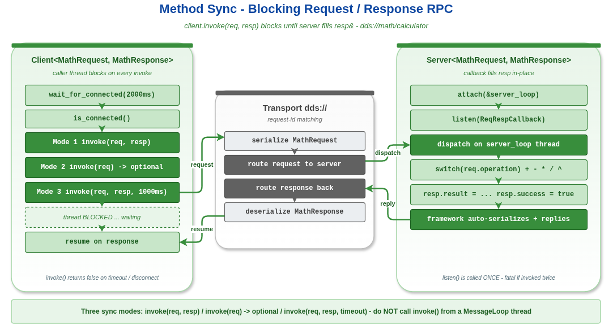

# method_sync — Method 模型同步调用：`invoke()` 的三种返回形态

本示例演示 Method（请求/响应）模型最常用的形态 —— **同步阻塞调用**。客户端通过 `Client::invoke()` 发出请求并阻塞等待响应；服务端通过 `Server::listen(ReqRespCallback)` 注册同步回调，在回调里直接填充响应对象。

读完本示例你能掌握：

- 服务端 `listen(cb)` 的 `(req, resp&)` 双参数回调写法。
- 客户端 `invoke()` 的三种调用方式 —— 输出引用、`std::optional<Resp>` 返回、自定义超时。
- `wait_for_connected()` / `is_connected()` 的连接状态查询接口。

## 背景与适用场景

适用场景：

- 远程计算/查询：客户端拿到结果才能继续工作（典型 RPC）。
- 命令下发并等待执行结果（如调用某个服务做一次校准）。
- 跨进程的"函数调用"风格 API。

不适合：

- 不需要回执的单向通知（用 `method_fire_forget`）。
- 客户端不能阻塞（如 UI 线程 / 事件循环回调里），需要异步回调或 future（用 `method_async`）。
- 客户端需要发起大量并发请求（同步串行会成为瓶颈，仍然用 async）。

VLink Method 模型在传输层是"基于 Event 的双工通信"：客户端把请求发到 `<url>` 上，服务端处理后把响应送回客户端。Server 与 Client 之间通过隐含的 request_id 关联响应，应用层不需要关心序号匹配。

## 核心 API

| API | 签名 | 说明 |
|-----|------|------|
| `vlink::Server<Req, Resp>` | `explicit Server(const std::string& url, InitType type = kWithInit)` | 服务端 |
| `Server::listen` | `bool listen(ReqRespCallback&& cb)` | `cb(const Req&, Resp&)` 原地填充响应；同步返回视为完成一次 RPC |
| `vlink::Client<Req, Resp>` | `explicit Client(const std::string& url, InitType type = kWithInit)` | 客户端 |
| `Client::wait_for_connected` | `bool wait_for_connected(std::chrono::milliseconds timeout)` | 阻塞等待到服务端就绪 |
| `Client::is_connected` | `bool is_connected() const` | 非阻塞查询是否就绪 |
| `Client::invoke` (引用) | `bool invoke(const Req&, Resp&, std::chrono::milliseconds timeout = kDefaultInterval)` | 返回 false 表示超时/失败 |
| `Client::invoke` (optional) | `std::optional<Resp> invoke(const Req&, std::chrono::milliseconds timeout = kDefaultInterval)` | 返回 `nullopt` 表示超时/失败 |

## 代码导读

### 1. 启动 server loop 并注册服务

```cpp
MessageLoop server_loop;
server_loop.set_name("server_loop");
server_loop.async_run();

Server<MathRequest, MathResponse> server(kUrl);
server.attach(&server_loop);
server.listen([](const MathRequest& req, MathResponse& resp) {
  resp.success = true;
  switch (req.operation) {
    case 0: resp.result = req.x + req.y; break;
    case 1: resp.result = req.x - req.y; break;
    case 2: resp.result = req.x * req.y; break;
    case 3:
      if (req.y != 0.0) {
        resp.result = req.x / req.y;
      } else {
        resp.result = 0.0;
        resp.success = false;
      }
      break;
    case 4: resp.result = std::pow(req.x, req.y); break;
    default: resp.result = 0.0; resp.success = false; break;
  }
  VLOG_I("[server] op=", req.operation, " x=", req.x, " y=", req.y, " => ", resp.result);
});
```

`listen(ReqRespCallback)` 是 Method 模型最常见的回调：vlink 框架收到请求后构造一个空的 `Resp`，把 `req`、`resp&` 一起传进回调。回调里**原地修改 `resp`**，回调返回后框架自动把响应送回客户端。

服务端必须先 attach 到 loop，所有请求处理都跑在 loop 线程上。如果业务逻辑慢，可以把 server attach 到 `MultiLoop` 或转发任务到 `ThreadPool`。

### 2. 客户端连接

```cpp
Client<MathRequest, MathResponse> client(kUrl);
VLOG_I("[client] wait_for_connected: ", client.wait_for_connected(2000ms));
VLOG_I("[client] is_connected: ", client.is_connected());
```

`wait_for_connected(timeout)` 阻塞等到服务端 discovery 完成。生产代码通常用 `detect_connected` 异步回调（见 `method_async`）。`is_connected()` 是非阻塞查询。

### 3. 模式 1：`invoke(req, resp)` 输出引用

```cpp
MathRequest req{10.0, 3.0, 0};
MathResponse resp{};
bool ok = client.invoke(req, resp);
VLOG_I("[client] 10 + 3 = ", resp.result, " ok=", ok);
```

经典的"调用前自己 zero-init 输出对象"风格。`invoke()` 返回 `bool`：true 表示成功收到 resp，false 表示超时或失败。

### 4. 模式 2：`invoke(req)` 返回 `std::optional<Resp>`

```cpp
MathRequest req{6.0, 7.0, 2};
auto result = client.invoke(req);

if (result.has_value()) {
  VLOG_I("[client] 6 * 7 = ", result->result);
}
```

更现代的 C++ 风格，避免显式声明 `Resp` 局部变量。`std::nullopt` 表示超时/失败。

### 5. 模式 3：自定义超时

```cpp
MathRequest req{100.0, 0.0, 3};
auto result = client.invoke(req, 1000ms);

if (result.has_value()) {
  VLOG_I("[client] 100 / 0 success=", result->success);
}
```

默认 timeout 是 `Timeout::kDefaultInterval`（通常 500ms）；可以显式传 `std::chrono::milliseconds`。注意"失败的业务结果"（如除零）仍然是一次**成功的 RPC**：`resp.success=false` 但 `invoke()` 返回有值。RPC 层的失败（超时、断连）才返回 `nullopt`。

### 6. 顺序批量调用

```cpp
for (int i = 1; i <= 5; ++i) {
  MathRequest req{static_cast<double>(i), static_cast<double>(i), 2};
  auto result = client.invoke(req);

  if (result.has_value()) {
    VLOG_I("[client] ", i, " * ", i, " = ", result->result);
  }
}
```

每个 invoke 都阻塞等待响应。这种串行调用的吞吐被 round-trip 时延限制；要并发就用 `async_invoke`。

## 运行

```bash
./build/output/bin/example_method_sync
```

预期输出（节选）：

```
[server] op=0 x=10 y=3 => 13
[client] 10 + 3 = 13 ok=1
[server] op=2 x=6 y=7 => 42
[client] 6 * 7 = 42
[server] op=3 x=100 y=0 => 0
[client] 100 / 0 success=0
[server] op=2 x=1 y=1 => 1
[client] 1 * 1 = 1
...
[server] op=2 x=5 y=5 => 25
[client] 5 * 5 = 25
```

URL `dds://math/calculator` 需要启用 FastDDS 组件；改 URL 前缀即可切换其它后端。

## 常见陷阱

1. **回调里阻塞**：`listen` 回调跑在 server_loop 线程，阻塞会让后续请求排队；高耗时逻辑要转发到 `ThreadPool`。
2. **不 `wait_for_connected` 直接 invoke**：discovery 没完成时 invoke 会超时返回 `nullopt`，看起来像 server 不工作。
3. **`invoke()` 不能在 server_loop 线程上调用**：那是 server 的回调线程；client.invoke 阻塞那条线程会死锁。本示例 client 在 main 线程里调用，安全。
4. **业务错误 vs RPC 错误**：业务里"运算失败"应当在 `Resp` 里用字段表达（如 `resp.success`）；不要靠 RPC 失败语义传递业务结果。
5. **超时太短**：默认 500ms 在高负载或慢服务下会假超时；按场景显式传 timeout。

## 设计要点

- Server 的 `listen(ReqRespCallback)` 是同步形态：回调一返回就被视为响应已构造完毕。需要异步处理（如 server 转发到工作线程再回填）就用 `listen_for_reply` + `reply(req_id, resp)`（见 `method_async`）。
- Client 端的 `invoke()` 内部会等待 server 的 reply（基于 request_id 匹配）；timeout 后即便 server 后续 reply 也会被丢弃。
- Method 模型 Server-Client 是一对一关系（DDS / shm 后端语义）；多客户端需要分别开多个 Client 实例。

## 配图



图中演示一次同步 RPC 的完整时序：Client 发请求、阻塞等响应、Server 回调处理并填充响应、响应返回 Client、unblock 继续执行。

## 参考

- `../method_async/` — 异步调用（回调式 + `std::future` 式）
- `../method_fire_forget/` — 单向调用（不等待响应）
- `../../quickstart/hello_rpc/` — 最短的 RPC 示例
- `vlink/include/vlink/client.h`、`server.h` — Client/Server 完整接口
- 顶层 `doc/04-method-model.md` — Method 模型规范
