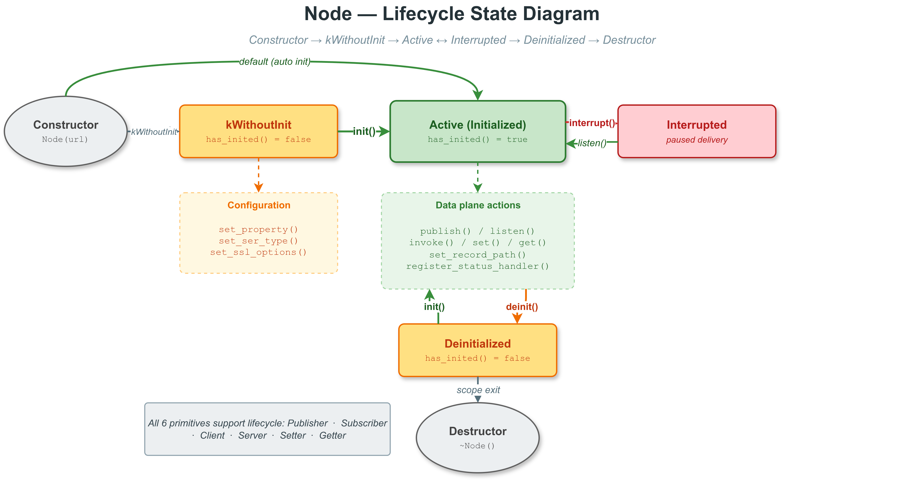

# 节点生命周期管理示例

## 1. 概述

本示例演示 VLink 节点的生命周期管理 API，包括延迟初始化（`kWithoutInit`）、手动 `init()` / `deinit()`、中断（`interrupt()`）和状态查询（`has_inited()`）。



## 2. 核心概念

### 2.1 初始化模式

VLink 节点支持两种初始化模式：

| 模式 | 构造方式 | 行为 |
|------|---------|------|
| 自动初始化 | `Publisher<T>("url")` | 构造函数中立即创建传输后端 |
| 延迟初始化 | `Publisher<T>("url", InitType::kWithoutInit)` | 构造后不创建传输，等待 `init()` |

### 2.2 延迟初始化的意义

延迟初始化允许在传输后端创建之前配置节点属性（QoS、序列化类型等）。这在某些传输协议（如 DDS）中非常重要，因为某些 QoS 参数只能在创建时设置。

## 3. 关键 API 解析

### 3.1 kWithoutInit + init()

```cpp
Publisher<std::string> pub("dds://topic", InitType::kWithoutInit);
pub.set_property("qos.reliability.kind", "1");
pub.set_property("qos.history.depth", "50");
pub.init();  // 此时才创建传输后端
```

### 3.2 has_inited()

```cpp
if (pub.has_inited()) {
  pub.publish(data);  // 安全发布
}
```

### 3.3 deinit()

```cpp
pub.deinit();   // 释放传输资源
// pub.publish() 返回 false
pub.init();     // 可以重新初始化
```

### 3.4 interrupt()

```cpp
pub.interrupt();  // 唤醒挂起的阻塞等待
```

`interrupt()` 仅置位内部 `is_interrupted` 标志并唤醒条件变量，使
`wait_for_subscribers()` / `wait_for_connected()` / `wait_for_value()` 等阻塞调用立即返回 `false`。
它**不会**暂停消息投递、回调触发或释放传输资源——如需停止接收消息请使用 `deinit()`。

## 4. 编译与运行

```bash
cmake -B build -S . -DCMAKE_PREFIX_PATH=/path/to/vlink/install
cmake --build build --target example_lifecycle
./build/output/bin/example_lifecycle
```

## 5. 推荐生命周期模式

```
1. 创建 (kWithoutInit)     -- 分配节点对象
2. 配置 (set_property等)   -- 设置 QoS、序列化类型
3. 初始化 (init)           -- 创建传输后端和发现
4. 注册回调 (listen)       -- 开始接收消息
5. 运行                    -- 发布/接收消息
6. 反初始化 (deinit)       -- 释放传输资源
7. 析构                    -- 释放节点对象
```

## 6. 适用于所有 6 种节点类型

`kWithoutInit` 和 `init()` / `deinit()` 适用于所有 VLink 通信原语：

- `Publisher<T>` / `Subscriber<T>` （事件模型）
- `Setter<T>` / `Getter<T>` （字段模型）
- `Server<Req, Resp>` / `Client<Req, Resp>` （方法模型）

## 7. 注意事项

- `deinit()` 后节点仍然存在，可以再次调用 `init()` 重新初始化
- `interrupt()` 仅唤醒阻塞等待，不暂停回调，也不释放传输资源
- 在未初始化的节点上调用 `publish()` 等操作会返回 `false`
- `kWithoutInit` 适用于需要运行时配置的场景

## 8. 相关文档

详细原理参见 [doc/02-node-lifecycle.md](../../../doc/02-node-lifecycle.md)。
