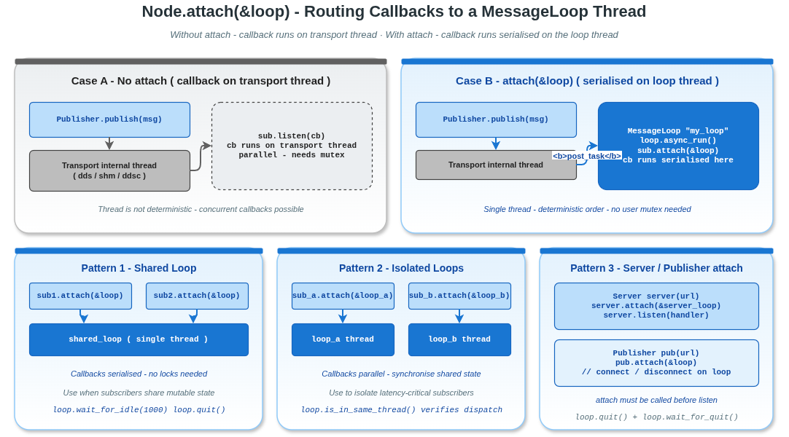

# MessageLoop 绑定示例

## 1. 概述

本示例演示如何使用 `attach()` 将 VLink 节点的回调绑定到特定的 `MessageLoop` 线程，实现回调的线程控制和串行化执行。



## 2. 核心概念

### 2.1 为什么需要 MessageLoop 绑定？

默认情况下，订阅者回调在传输层的内部线程上执行。这意味着：
- 回调线程不可控
- 多个回调可能并发执行
- 需要用户自己加锁保护共享状态

通过 `attach(&loop)` 将回调调度到指定的 `MessageLoop` 线程，可以：
- **确定性**：回调始终在同一线程上执行
- **串行化**：同一 loop 上的所有回调串行执行，无需加锁
- **隔离性**：不同 loop 上的回调并行执行

### 2.2 绑定模式对比

| 模式 | 代码 | 回调线程 | 并发性 |
|------|------|---------|--------|
| 无绑定 | 不调用 `attach` | 传输内部线程 | 不确定 |
| 单 Loop | `sub.attach(&loop)` | loop 线程 | 串行 |
| 多 Loop | 不同节点绑定不同 loop | 各自的 loop 线程 | 并行 |

## 3. 关键 API

```cpp
MessageLoop loop;
loop.set_name("my_loop");
loop.async_run();

Subscriber<T> sub("dds://topic");
sub.attach(&loop);  // 回调在 loop 线程上执行
sub.listen([](const T& msg) { /* 在 loop 线程上运行 */ });
```

## 4. 编译与运行

```bash
cd build
cmake .. && make example_message_loop_binding
./output/bin/example_message_loop_binding
```

## 5. 设计模式

### 5.1 模式 1：多个节点共享一个 Loop（串行）

```cpp
sub1.attach(&loop);
sub2.attach(&loop);
// sub1 和 sub2 的回调串行执行，无需加锁
```

### 5.2 模式 2：每个节点独立 Loop（并行）

```cpp
sub_a.attach(&loop_a);
sub_b.attach(&loop_b);
// sub_a 和 sub_b 的回调并行执行，需要同步共享状态
```

### 5.3 模式 3：Server 绑定 Loop

```cpp
Server<Req, Resp> server("dds://rpc");
server.attach(&server_loop);
// 请求处理函数在 server_loop 线程上执行
```

## 6. 注意事项

- `attach()` 必须在 `listen()` 之前调用
- `Publisher` 也可以 `attach()`，控制连接状态回调的线程
- Loop 的 `async_run()` 在后台线程启动事件循环
- `loop.wait_for_idle()` 等待所有挂起任务完成
- `loop.quit()` + `loop.wait_for_quit()` 停止并等待线程退出
