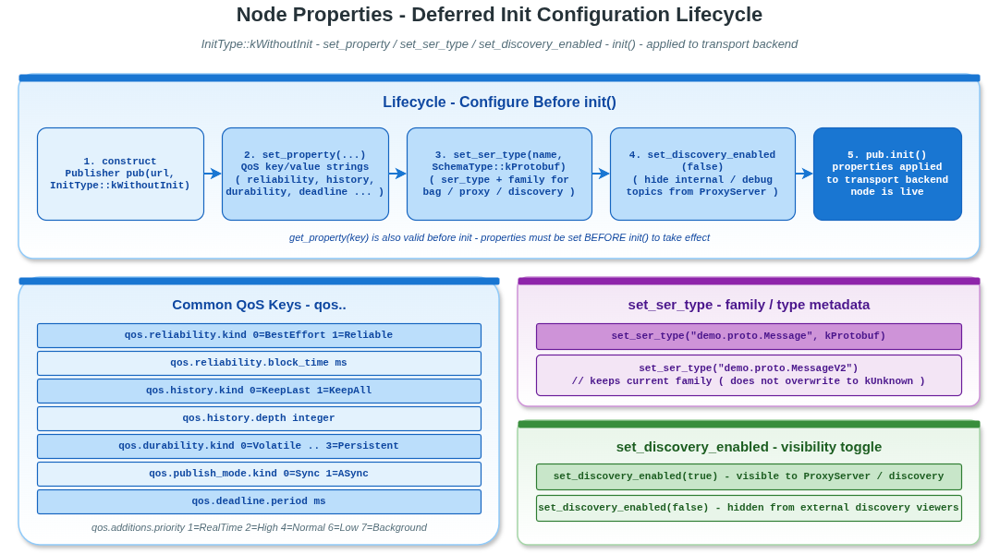

# properties — 用 string property 配置 QoS / Schema / Discovery

vlink 节点提供基于字符串 key/value 的属性系统：`set_property("qos.reliability.kind", "1")`、`get_property("...")` 等。这套机制让 vlink 可以从配置文件（JSON / YAML / GUI 表单）按字段加载，不需要硬编码字段。

读完本示例你能掌握：

- `set_property` / `get_property` 的全部可调 key。
- `set_ser_type` / `set_schema_type` 的配置语义。
- `set_discovery_enabled` 控制节点是否被 ProxyServer / DiscoveryViewer 看到。
- 正确的"构造 → set_property → init"流程。

## 背景与适用场景

适用：

- 从配置文件加载 vlink 节点 QoS。
- 运行时通过 GUI / CLI 修改 QoS 参数后重新 init。
- 业务代码不想写 `qos.history.depth = 50` 这种硬编码，转用 property 字符串。

不适合：

- 已经用 `qos=name` URL 引用 profile 的场景（与 property 二选一）。

## 工作流

```
construct (kWithoutInit) -> set_property() / set_ser_type() / set_discovery_enabled() -> init()
```

property 在 init 时被 transport 读取；init 之后再改大多数 property 不生效。

## 核心 API

| API | 签名 | 说明 |
|-----|------|------|
| `set_property` | `void set_property(const std::string& key, const std::string& value)` | 配置 |
| `get_property` | `std::string get_property(const std::string& key) const` | 查询 |
| `set_ser_type` | `void set_ser_type(const std::string& type_name, SchemaType = kUnknown)` | 设序列化元数据 |
| `get_ser_type` / `get_schema_type` | const | 查询 |
| `set_discovery_enabled` | `void set_discovery_enabled(bool)` | 是否被 discovery 看到 |
| `init` | `bool init()` | 应用配置 + 创建 transport |

## 全部可调 property key

| Key | 取值 |
|-----|------|
| `qos.reliability.kind` | 0=BestEffort, 1=Reliable |
| `qos.reliability.block_time` | ms |
| `qos.reliability.heartbeat_time` | ms |
| `qos.history.kind` | 0=KeepLast, 1=KeepAll |
| `qos.history.depth` | int |
| `qos.durability.kind` | 0=Volatile, 1=TransientLocal, 2=Transient, 3=Persistent |
| `qos.publish_mode.kind` | 0=Sync, 1=ASync |
| `qos.deadline.period` | ms |
| `qos.lifespan.duration` | ms |
| `qos.additions.priority` | 1=RealTime, 2=High, 4=Normal, 6=Low, 7=Background |
| `qos.additions.is_express` | true / false |

## 代码导读

### 1. set_property / get_property

```cpp
vlink::Publisher<std::string> pub("dds://topic", vlink::InitType::kWithoutInit);

pub.set_property("qos.reliability.kind", "1");
pub.set_property("qos.history.kind", "0");
pub.set_property("qos.history.depth", "50");
pub.set_property("qos.durability.kind", "1");
pub.set_property("qos.publish_mode.kind", "0");
pub.set_property("qos.reliability.block_time", "200");

VLOG_I("qos.reliability.kind: ", pub.get_property("qos.reliability.kind"));    // "1"
VLOG_I("qos.history.depth: ", pub.get_property("qos.history.depth"));          // "50"

pub.init();
```

### 2. set_ser_type

```cpp
pub.set_ser_type("demo.proto.Message", vlink::SchemaType::kProtobuf);

// 只设 type_name，schema_type 保持现有族（如 protobuf）
pub.set_ser_type("demo.proto.MessageV2");

// 清空两者
pub.set_ser_type("");
```

`ser_type` + `schema_type` 一起决定 bag / proxy / discovery 元数据。规则：

- `kUnknown` schema 不会覆盖已经设的 protobuf / flatbuffers。
- raw / zerocopy 类型从 ser 字符串自动同步。
- 空字符串清空。

### 3. set_discovery_enabled

```cpp
pub.set_discovery_enabled(false);   // 不出现在 ProxyServer / DiscoveryViewer
pub.init();
```

适合临时调试节点：业务代码用得到，但不要让监控工具看到（避免噪音）。

### 4. 完整流程示例

```cpp
vlink::Publisher<std::string> pub("dds://topic", vlink::InitType::kWithoutInit);
pub.set_property("qos.reliability.kind", "1");
pub.set_property("qos.history.kind", "1");        // KeepAll
pub.set_ser_type("MyType", vlink::SchemaType::kRaw);
pub.set_discovery_enabled(true);
pub.init();

// 之后才能 publish
pub.publish("hello");
```

## 运行

```bash
./build/output/bin/example_properties
```

预期输出（节选）：

```
[1] set_property / get_property
  qos.reliability.kind:       1
  qos.history.depth:          50
  qos.durability.kind:        1
  qos.publish_mode.kind:      0
  qos.reliability.block_time: 200
  Node initialised with custom properties.
[2] set_ser_type
  ser_type: demo.proto.Message schema_type: protobuf
[3] set_discovery_enabled
  Node initialised but hidden from discovery.
```

## 常见陷阱

1. **init 之后再 set_property**：大多数 key 不生效；transport 已经按旧值构造。
2. **拼写错误**：未识别的 key 被静默忽略；用 get_property 验证。
3. **`set_ser_type("")` 把 schema 也清了**：副作用，按需选择。
4. **property 与 `?qos=name` URL 引用同时用**：vlink 行为按实现可能取一个为准；建议二选一。
5. **跨节点共享 property 配置**：必须每个节点各自调 set_property；不会自动传播。

## 设计要点

- property 是 `std::unordered_map<std::string, std::string>` 内部存储。
- vlink 在 init 期把 property map 转译为对应 QoS 结构。
- set_ser_type 的 `kUnknown` 兜底逻辑是为了支持"先设 type_name 后设 schema"两段式调用。

## 配图



图中展示 set_property → init → transport 配置的流向。

## 参考

- `../lifecycle/` — 节点 init / deinit
- `../../qos/` — QoS 字段对照（property key 与 QoS 字段一一映射）
- 顶层 `doc/04-qos.md` — QoS 章节
- `vlink/include/vlink/node.h` — Node::set_property 接口
