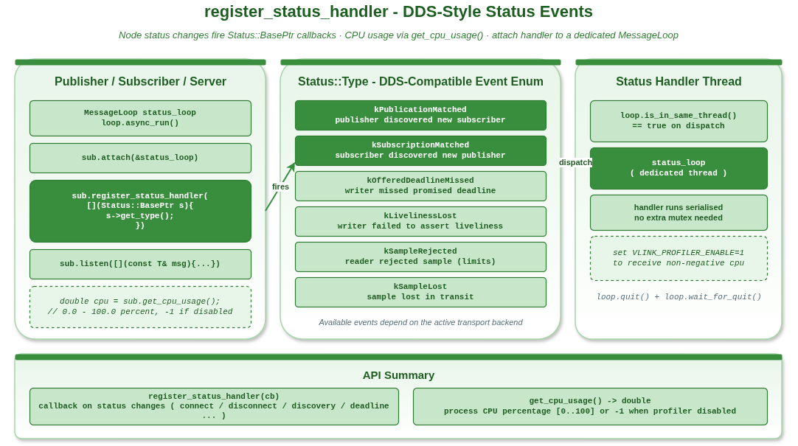

# 状态监控示例

## 1. 概述

本示例演示 VLink 节点的状态监控功能，包括 `register_status_handler()` 注册状态变更回调和 `get_cpu_usage()` 获取进程 CPU 使用率。



## 2. 核心 API

### 2.1 register_status_handler

```cpp
pub.register_status_handler([](Status::BasePtr status) {
  // 当节点状态变化时调用（如订阅者连接/断开）
  VLOG_I("Status type:", static_cast<int>(status->get_type()));
});
```

DDS 兼容的状态枚举（`Status::Type`）包括 `kPublicationMatched`、`kSubscriptionMatched`、
`kOfferedDeadlineMissed`、`kLivelinessLost`、`kSampleRejected`、`kSampleLost` 等。
具体可用的事件类型取决于活动的传输后端。

### 2.2 get_cpu_usage

```cpp
double usage = pub.get_cpu_usage();
// 返回 0.0-100.0 的 CPU 使用百分比
// 如果平台不支持则返回 -1.0
```

## 3. 编译与运行

```bash
cd build
cmake .. && make example_status_monitoring
./output/bin/example_status_monitoring
```

## 4. 适用场景

- 监控节点连接状态变化
- 实时跟踪系统 CPU 负载
- 诊断通信链路问题
- 构建自定义健康监控系统

## 5. 注意事项

- 状态回调在节点的事件线程上触发
- `get_cpu_usage()` 返回进程级别的 CPU 使用率
- 不同传输协议触发的状态事件类型可能不同
- 建议将状态回调附着到专用的 MessageLoop 避免阻塞主线程
