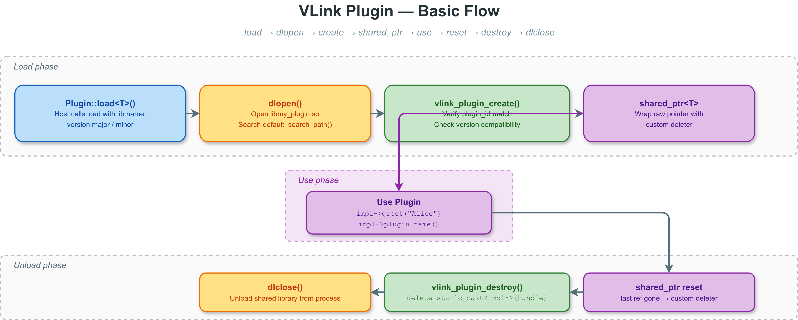

# 插件基础示例 (Plugin Basic)

## 概述

本示例演示 VLink 插件系统的完整工作流：**定义接口 -> 实现插件 -> 编译为 .so -> 运行时加载 -> 调用方法 -> 卸载**。

与其他 plugin 示例不同，本示例实际构建了一个可用的共享库（`libgreeter_plugin.so`），并在主程序中通过 `Plugin::load<GreeterInterface>()` 加载它，在运行时调用虚函数方法。



---

## 目录结构

```
plugin_basic/
├── CMakeLists.txt            # 构建脚本：编译 .so + 主程序
├── greeter_interface.h       # 抽象接口定义（宿主与插件共享）
├── greeter_plugin.cc         # 接口实现（编译为 libgreeter_plugin.so）
├── plugin_basic.cc           # 宿主主程序（加载和使用插件）
├── images/
│   └── plugin-basic-flow.drawio  # 加载流程图
└── README.md                 # 本文件
```

---

## 核心概念

### 1. 接口定义 (greeter_interface.h)

VLink 插件系统的核心是一个**抽象接口类**。接口必须满足三个条件：

1. **至少一个纯虚函数**（使类成为抽象类）
2. **虚析构函数**（确保安全删除）
3. **`VLINK_PLUGIN_REGISTER(InterfaceType)` 宏**（自动推导插件 ID）

```cpp
class GreeterInterface {
  VLINK_PLUGIN_REGISTER(GreeterInterface)

 public:
  virtual ~GreeterInterface() = default;
  virtual std::string greet(const std::string& name) = 0;
  virtual std::string plugin_name() const = 0;
};
```

`VLINK_PLUGIN_REGISTER` 宏展开后生成一个 `static constexpr` 方法 `get_plugin_id()`，它返回接口类型的名称。宿主和插件通过这个 ID 进行身份验证。

### 2. 插件实现 (greeter_plugin.cc)

实现类继承抽象接口，覆盖所有纯虚函数。关键点：

- **`VLINK_PLUGIN_REGISTER` 使用接口类型**，不是实现类型。这保证了宿主与插件的 ID 匹配。
- 实现类必须**可默认构造**（`VLINK_PLUGIN_DECLARE` 内部使用 `new ImplementType` 创建实例）。

```cpp
class GreeterImpl : public GreeterInterface {
  VLINK_PLUGIN_REGISTER(GreeterInterface)  // 注意：接口类型！

 public:
  std::string greet(const std::string& name) override {
    return "Hello, " + name + "!";
  }
  std::string plugin_name() const override { return "GreeterImpl"; }
};

VLINK_PLUGIN_DECLARE(GreeterImpl, 1, 0)
```

`VLINK_PLUGIN_DECLARE(GreeterImpl, 1, 0)` 展开为两个 `extern "C"` 函数：

| 导出函数 | 作用 |
|---------|------|
| `vlink_plugin_create()` | 验证 ID 和版本后，执行 `new GreeterImpl` 并返回 `void*` |
| `vlink_plugin_destroy()` | 执行 `delete static_cast<GreeterImpl*>(handle)` |

### 3. 宿主加载器 (plugin_basic.cc)

宿主通过 `vlink::Plugin` 类加载共享库，获取一个类型安全的 `shared_ptr<GreeterInterface>`：

```cpp
vlink::Plugin plugin;
plugin.set_log_level(vlink::Logger::kInfo);

auto greeter = plugin.load<GreeterInterface>("greeter_plugin", 1, 0);
if (greeter) {
  greeter->greet("VLink");   // 通过虚函数调用插件实现
  greeter->plugin_name();    // 返回 "GreeterImpl"
}
```

`load<T>()` 内部执行以下步骤：

1. 在搜索路径中查找 `libgreeter_plugin.so`
2. 调用 `dlopen()` 打开共享库
3. 通过 `dlsym()` 找到 `vlink_plugin_create` 符号
4. 调用 `vlink_plugin_create()`，传入期望的 plugin_id 和版本号
5. 插件内部验证 ID 匹配和版本兼容
6. 将返回的 `void*` 包装为 `shared_ptr<GreeterInterface>`，附带自定义删除器

---

## 搜索路径

`Plugin::default_search_path()` 返回默认搜索目录列表，依次搜索：

1. 可执行文件所在目录
2. 系统库目录（`/usr/lib`、`/usr/local/lib` 等）
3. 当前工作目录

可以通过以下方式自定义搜索路径：

```cpp
// 方式 1：传入 dir_name 参数
auto impl = plugin.load<GreeterInterface>("greeter_plugin", 1, 0, "/opt/plugins");

// 方式 2：传入自定义搜索路径列表
std::deque<std::string> paths = {"/opt/plugins", "/home/user/libs"};
auto impl = plugin.load<GreeterInterface>("greeter_plugin", 1, 0, "", paths);
```

也可以设置 `VLINK_PLUGIN_DIR` 环境变量来添加搜索目录。

---

## 版本检查

`load<T>()` 的第二、三个参数是期望的主版本号和次版本号。插件导出的版本号通过 `VLINK_PLUGIN_DECLARE(Impl, Major, Minor)` 指定。

版本不匹配时，`process_plugin_internal()` 返回 `false`，`load()` 返回 `nullptr`：

```cpp
// 插件声明的是 1.0
VLINK_PLUGIN_DECLARE(GreeterImpl, 1, 0)

// 宿主请求 2.0 -- 不兼容，返回 nullptr
auto bad = plugin.load<GreeterInterface>("greeter_plugin", 2, 0);
assert(!bad);
```

---

## 插件内省 API

| 方法 | 返回类型 | 说明 |
|------|---------|------|
| `load<T>(lib, major, minor)` | `shared_ptr<T>` | 加载插件，失败返回 nullptr |
| `unload<T>(lib)` | `bool` | 从注册表移除插件 |
| `has_loaded<T>(lib)` | `bool` | 检查插件是否已加载 |
| `get_plugin_complex_id<T>(lib)` | `string` | 返回 `lib@plugin_id` 复合 ID |
| `clear()` | `void` | 卸载所有已加载的插件 |
| `set_log_level(level)` | `void` | 设置诊断日志级别 |
| `get_log_level()` | `Logger::Level` | 获取当前日志级别 |
| `default_search_path()` | `deque<string>` | 获取默认搜索路径 |

复合 ID 的格式为 `lib_name@plugin_id`，例如 `greeter_plugin@GreeterInterface`。它用于在同一个 `Plugin` 实例内唯一标识一个 (库, 接口) 对。

---

## 生命周期管理

插件实例的生命周期由 `shared_ptr` 管理。`load()` 返回的 `shared_ptr` 附带了一个自定义删除器：

```
load() -> dlopen -> vlink_plugin_create -> new Impl
                                         -> wrap in shared_ptr<T>

shared_ptr destructor -> custom deleter
                       -> vlink_plugin_destroy(handle)
                       -> delete Impl
```

`unload<T>()` 只是从内部注册表中移除条目。实际的 `dlclose()` 发生在最后一个 `shared_ptr` 引用销毁时。因此，推荐的卸载顺序是：

```cpp
greeter.reset();                                    // 释放 shared_ptr 引用
plugin.unload<GreeterInterface>("greeter_plugin");  // 从注册表移除
```

或者直接调用 `plugin.clear()` 卸载所有插件。`Plugin` 的析构函数也会自动调用 `clear()`。

---

## CMake 构建模式

本示例的 CMakeLists.txt 同时构建插件和宿主：

```cmake
# 插件共享库
add_library(greeter_plugin SHARED greeter_plugin.cc)
target_link_libraries(greeter_plugin vlink::all)

# 将 .so 放到与可执行文件相同的目录，便于加载
set_target_properties(greeter_plugin PROPERTIES
  LIBRARY_OUTPUT_DIRECTORY ${CMAKE_RUNTIME_OUTPUT_DIRECTORY}
)

# 宿主可执行文件
add_executable(example_plugin_basic plugin_basic.cc)
target_link_libraries(example_plugin_basic vlink::all)
```

关键点：

- 插件编译为 `SHARED` 库（生成 `.so` / `.dll`）
- 插件需要链接 `vlink::all`（因为 `VLINK_PLUGIN_DECLARE` 引用了 `Plugin::process_plugin_internal`）
- 将插件输出目录设置为与主程序相同，这样默认搜索路径就能找到它

---

## 编译与运行

```bash
# 在 VLink 项目根目录的 build 目录中
cd build
cmake .. -DENABLE_WHOLE_EXAMPLES=ON && make example_plugin_basic greeter_plugin

# 运行（确保 .so 在搜索路径中）
./output/bin/example_plugin_basic
```

预期输出（简化）：

```
[I] === [1] Default search paths ===
[I]   search path: /path/to/build/output/bin
[I]   ...
[I] === [2] Loading greeter_plugin (version 1.0) ===
[I] Plugin loaded successfully.
[I] === [3] Calling plugin methods ===
[I]   plugin_name(): GreeterImpl
[I]   greet("VLink"): Hello, VLink!
[I]   greet("World"): Hello, World!
[I]   greet("Alice"): Hello, Alice!
[I] === [4] Plugin introspection ===
[I]   has_loaded: true
[I]   complex_id: greeter_plugin@GreeterInterface
[I] === [5] Unloading plugin ===
[I]   unload result: true
[I] === [6] Attempting load with wrong version (2.0) ===
[I]   Version mismatch -- load returned nullptr (expected).
[I] === [7] Reloading with correct version (1.0) ===
[I]   Reload OK: Hello, Reload!
[I] Plugin basic example complete.
```

---

## 编译时检查

`VLINK_PLUGIN_REGISTER` 和 `VLINK_PLUGIN_DECLARE` 内部包含多个 `static_assert`：

| 检查 | 断言条件 | 触发时机 |
|------|---------|---------|
| 接口必须是抽象类 | `is_abstract_v<InterfaceType>` | 宏展开时 |
| 接口必须有虚析构 | `has_virtual_destructor_v<InterfaceType>` | 宏展开时 |
| 实现类可默认构造 | `is_default_constructible_v<ImplementType>` | DECLARE 宏展开时 |
| 实现类不能是抽象类 | `!is_abstract_v<ImplementType>` | DECLARE 宏展开时 |
| 插件 ID 不为空 | `!get_plugin_id().empty()` | load/unload 时 |

这些检查在编译期执行，确保插件开发者不会遗漏必要的接口实现。

---

## 自定义插件 ID

默认情况下，`VLINK_PLUGIN_REGISTER` 通过 `NameDetector::get<T>()` 从类型名自动推导插件 ID。如果需要一个跨编译器稳定的固定 ID，可以使用 `VLINK_PLUGIN_REGISTER_BY_ID`：

```cpp
class GreeterInterface {
  VLINK_PLUGIN_REGISTER_BY_ID(GreeterInterface, "com.example.greeter.v1")
 public:
  virtual ~GreeterInterface() = default;
  virtual std::string greet(const std::string& name) = 0;
};
```

使用固定 ID 的好处：
- 不受 C++ 名称修饰和编译器实现差异的影响
- 可以在接口重命名后保持向后兼容
- 便于跨项目引用

---

## 常见问题

**Q: 插件加载失败怎么办？**

检查以下几点：
1. `libgreeter_plugin.so` 是否在搜索路径中（与可执行文件同目录最简单）
2. 插件的版本号是否与 `load()` 参数匹配
3. 插件 .so 是否链接了所有依赖（用 `ldd libgreeter_plugin.so` 检查）

**Q: 同一个 Plugin 实例可以加载多种接口的插件吗？**

可以。`Plugin` 内部用 `lib_name@plugin_id` 复合 ID 区分不同的 (库, 接口) 对。

**Q: 多线程环境下安全吗？**

`shared_ptr<T>` 的引用计数是线程安全的。但 `Plugin::load()` / `unload()` 本身不是线程安全的，应在单一线程中管理加载/卸载。

---

## 注意事项

- `VLINK_PLUGIN_DECLARE` 导出的是 C 符号，不能放在同时包含 `main()` 的源文件中
- 接口头文件由宿主和插件共享，修改时需要重新编译双方
- 插件 `shared_ptr` 的自定义删除器会调用 `vlink_plugin_destroy`，因此 `.so` 在所有引用释放前不会被关闭
- 建议在 `unload()` 之前先 `reset()` 所有 `shared_ptr`，避免悬挂引用

## 相关文档

详细原理参见 [doc/19-extensions.md](../../../doc/19-extensions.md)。
