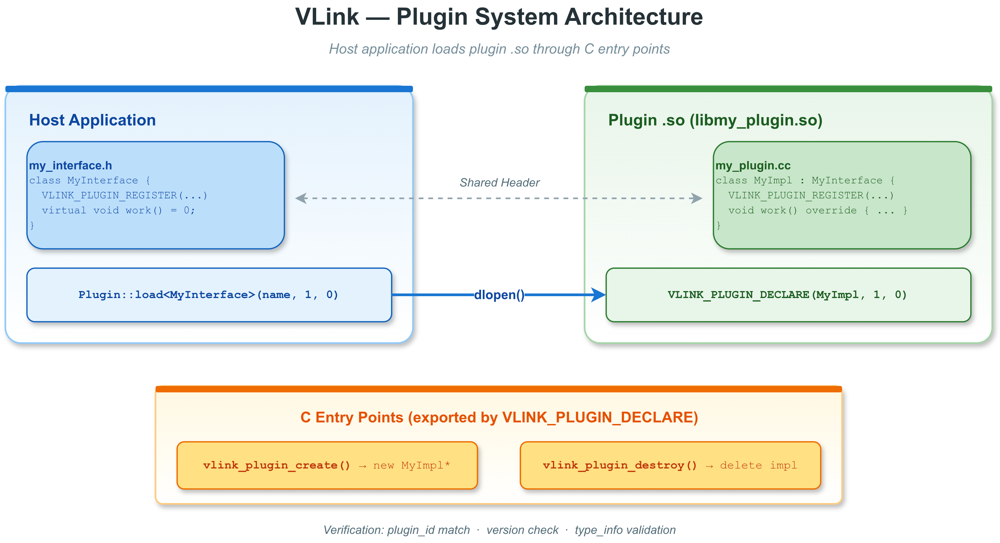

# 插件创建教程 (Plugin Create)

## 概述

本示例是一个循序渐进的插件开发教程，演示如何从零创建一个 VLink 插件。三个文件分别对应插件开发的三个步骤：

1. **`calculator_interface.h`** -- 定义抽象接口
2. **`calculator_plugin.cc`** -- 实现接口，编译为共享库
3. **`loader.cc`** -- 宿主程序，加载并使用插件



---

## 目录结构

```
plugin_create/
├── CMakeLists.txt              # 构建脚本
├── calculator_interface.h      # 步骤 1：抽象接口定义
├── calculator_plugin.cc        # 步骤 2：具体实现（编译为 .so）
├── loader.cc                   # 步骤 3：宿主加载器
├── images/
│   ├── plugin-architecture.drawio  # 架构图源文件
│   └── plugin-architecture.png     # 架构图
└── README.md                   # 本文件
```

---

## 步骤 1：定义抽象接口

文件：`calculator_interface.h`

接口定义是插件系统的基础。它是宿主和插件之间的**契约**——双方都包含这个头文件，通过虚函数表实现运行时多态。

### 接口要求

VLink 插件接口必须满足以下条件：

| 要求 | 原因 |
|------|------|
| 至少一个纯虚函数 | 使类成为抽象类（`is_abstract_v<T> == true`） |
| 虚析构函数 | 通过基类指针安全删除（`has_virtual_destructor_v<T> == true`） |
| `VLINK_PLUGIN_REGISTER(T)` 宏 | 生成 `get_plugin_id()` 用于身份验证 |

### 接口代码分析

```cpp
class CalculatorInterface {
  VLINK_PLUGIN_REGISTER(CalculatorInterface)  // [1]

 public:
  virtual ~CalculatorInterface() = default;   // [2]

  virtual int add(int a, int b) = 0;          // [3]
  virtual int multiply(int a, int b) = 0;     // [3]
  virtual std::string name() const = 0;       // [3]
};
```

代码解析：

- **[1]** `VLINK_PLUGIN_REGISTER(CalculatorInterface)` 展开为：
  ```cpp
  public:
    static constexpr std::string_view get_plugin_id() {
      static_assert(std::is_abstract_v<CalculatorInterface>, "...");
      static_assert(std::has_virtual_destructor_v<CalculatorInterface>, "...");
      return vlink::NameDetector::get<CalculatorInterface>();
    }
  ```
  - `NameDetector::get<T>()` 在编译期返回类型名称的字符串视图
  - `static_assert` 保证接口满足抽象类和虚析构的要求

- **[2]** 虚析构函数确保通过 `CalculatorInterface*` 指针 delete 时正确调用派生类析构

- **[3]** 三个纯虚函数构成接口契约。每个函数都必须在实现类中覆盖

### 使用 include guard

```cpp
#ifndef EXAMPLES_PLUGIN_PLUGIN_CREATE_CALCULATOR_INTERFACE_H_
#define EXAMPLES_PLUGIN_PLUGIN_CREATE_CALCULATOR_INTERFACE_H_
// ...
#endif
```

因为接口头文件被宿主和插件同时包含，所以必须有 include guard（或 `#pragma once`）。

---

## 步骤 2：实现接口

文件：`calculator_plugin.cc`

实现类继承接口并覆盖所有纯虚函数。这个文件编译为共享库（`libcalculator_plugin.so`）。

### 实现代码分析

```cpp
#include "calculator_interface.h"

class CalculatorImpl : public CalculatorInterface {       // [1]
  VLINK_PLUGIN_REGISTER(CalculatorInterface)              // [2]

 public:
  int add(int a, int b) override { return a + b; }       // [3]
  int multiply(int a, int b) override { return a * b; }   // [3]
  std::string name() const override { return "BasicCalculator"; }  // [3]
};

VLINK_PLUGIN_DECLARE(CalculatorImpl, 1, 0)                // [4]
```

代码解析：

- **[1]** `CalculatorImpl` 继承 `CalculatorInterface`

- **[2]** `VLINK_PLUGIN_REGISTER` 使用**接口类型** `CalculatorInterface`，不是实现类型 `CalculatorImpl`。
  这是一个常见的错误源——如果写成 `VLINK_PLUGIN_REGISTER(CalculatorImpl)`，插件 ID 将不匹配，加载时会失败。

- **[3]** 覆盖所有三个纯虚函数。实现可以任意复杂，只要遵守接口签名。

- **[4]** `VLINK_PLUGIN_DECLARE(CalculatorImpl, 1, 0)` 展开为：
  ```cpp
  extern "C" {
    void* vlink_plugin_create(const char* lib_name,
                              const char* plugin_id,
                              uint16_t version_major,
                              uint16_t version_minor,
                              uint8_t log_level) {
      // static_assert 检查...
      if (!Plugin::process_plugin_internal(lib_name,
            CalculatorImpl::get_plugin_id().data(),
            1, 0,           // 本地版本
            plugin_id,      // 宿主期望的 ID
            version_major,  // 宿主期望的版本
            version_minor,
            log_level)) {
        return nullptr;
      }
      return new CalculatorImpl;
    }
  
    bool vlink_plugin_destroy(void* handle) {
      if (!handle) return false;
      delete static_cast<CalculatorImpl*>(handle);
      return true;
    }
  }
  ```

### VLINK_PLUGIN_DECLARE 中的 static_assert

| 断言 | 条件 | 失败含义 |
|------|------|---------|
| 可默认构造 | `is_default_constructible_v<CalculatorImpl>` | 实现类需要无参构造函数 |
| 插件 ID 不为空 | `!CalculatorImpl::get_plugin_id().empty()` | REGISTER 宏缺失 |
| 非抽象类 | `!is_abstract_v<CalculatorImpl>` | 有纯虚函数未覆盖 |

---

## 步骤 3：宿主加载器

文件：`loader.cc`

宿主通过 `vlink::Plugin::load<T>()` 在运行时加载共享库。

### 加载代码分析

```cpp
vlink::Plugin plugin;                                         // [1]
plugin.set_log_level(vlink::Logger::kInfo);                   // [2]

auto calc = plugin.load<CalculatorInterface>(                 // [3]
    "calculator_plugin", 1, 0);

if (!calc) {                                                  // [4]
  VLOG_E("Failed to load calculator_plugin.");
  return 1;
}

int sum = calc->add(17, 25);                                  // [5]
VLOG_I("add(17, 25) = ", sum);

calc.reset();                                                 // [6]
plugin.clear();                                               // [7]
```

代码解析：

- **[1]** 创建 `Plugin` 管理器。一个 `Plugin` 实例可以管理多个不同接口的插件。

- **[2]** 设置日志级别，`Plugin` 会将此级别传递给插件内部的日志系统。

- **[3]** `load<CalculatorInterface>("calculator_plugin", 1, 0)` 的参数含义：
  - 模板参数 `CalculatorInterface` -- 期望的接口类型
  - `"calculator_plugin"` -- 库文件名（不含 `lib` 前缀和 `.so` 后缀）
  - `1, 0` -- 期望的主版本号和次版本号

- **[4]** 加载失败返回 `nullptr`。常见原因：找不到 .so、版本不匹配、ID 不匹配。

- **[5]** 通过 `shared_ptr<CalculatorInterface>` 调用虚函数。这里的调用路径：
  ```
  calc->add(17, 25)
    -> vtable lookup
    -> CalculatorImpl::add(17, 25)
    -> return 42
  ```

- **[6]** 释放 `shared_ptr`。自定义删除器调用 `vlink_plugin_destroy()`。

- **[7]** `clear()` 卸载所有已注册的插件库。

### 编译时验证

`loader.cc` 还演示了编译时类型检查：

```cpp
VLOG_I("is_abstract<CalculatorInterface>: ",
       std::is_abstract_v<CalculatorInterface> ? "true" : "false");
VLOG_I("has_virtual_destructor: ",
       std::has_virtual_destructor_v<CalculatorInterface> ? "true" : "false");
```

这些检查也被 `VLINK_PLUGIN_REGISTER` 在宏展开时自动执行。

---

## load<T>() 内部流程

```
Host                              Plugin .so
 |                                   |
 | 1. load<T>("calculator_plugin",   |
 |            1, 0)                  |
 |                                   |
 | 2. Search paths for               |
 |    libcalculator_plugin.so        |
 |                                   |
 | 3. dlopen("libcalculator_plugin   |
 |    .so")  ----------------------->|
 |                                   |
 | 4. dlsym("vlink_plugin_create")   |
 |    ------------------------------>|
 |                                   |
 | 5. vlink_plugin_create(           |
 |    "calculator_plugin",           |
 |    "CalculatorInterface",         |
 |    1, 0, log_level)              |
 |    ------------------------------>| 6. process_plugin_internal()
 |                                   |    验证 ID 和版本
 |                                   |
 |                                   | 7. new CalculatorImpl
 |                                   |    返回 void*
 |    <------------------------------|
 |                                   |
 | 8. static_cast<T*>(handle)        |
 |    wrap in shared_ptr<T>          |
 |    with custom deleter            |
 |                                   |
 v                                   v
```

---

## CMake 构建模式

```cmake
# 插件共享库
add_library(calculator_plugin SHARED calculator_plugin.cc)
target_link_libraries(calculator_plugin vlink::all)

# 将 .so 输出到与可执行文件相同的目录
set_target_properties(calculator_plugin PROPERTIES
  LIBRARY_OUTPUT_DIRECTORY ${CMAKE_RUNTIME_OUTPUT_DIRECTORY}
)

# 宿主可执行文件
add_executable(example_plugin_create loader.cc)
target_link_libraries(example_plugin_create vlink::all)
```

### 为什么插件需要链接 vlink::all？

`VLINK_PLUGIN_DECLARE` 展开后调用了 `vlink::Plugin::process_plugin_internal()`，这个函数在 VLink 核心库中实现。如果插件不链接 VLink，会在 `dlopen` 时出现未解析符号错误。

### 输出目录对齐

通过 `LIBRARY_OUTPUT_DIRECTORY` 将 `.so` 放到 `CMAKE_RUNTIME_OUTPUT_DIRECTORY`（通常是 `build/output/bin`），这样 `Plugin::default_search_path()` 中的"可执行文件目录"就能找到插件。

---

## 编译与运行

```bash
cd build
cmake .. -DENABLE_WHOLE_EXAMPLES=ON
make example_plugin_create calculator_plugin

./output/bin/example_plugin_create
```

预期输出：

```
[I] === Compile-time checks ===
[I]   is_abstract<CalculatorInterface>:      true
[I]   has_virtual_destructor<CalculatorInterface>: true
[I]   plugin_id: CalculatorInterface
[I] === Loading calculator_plugin (version 1.0) ===
[I] Loaded: BasicCalculator
[I] === Testing all methods ===
[I]   add(17, 25)      = 42
[I]   multiply(6, 7)   = 42
[I]   name()           = BasicCalculator
[I]   add(0, 0)        = 0
[I]   add(-5, 5)       = 0
[I]   multiply(-3, 4)  = -12
[I] === Introspection ===
[I]   has_loaded:  true
[I]   complex_id:  calculator_plugin@CalculatorInterface
[I] Plugin create example complete.
```

---

## VLINK_PLUGIN_REGISTER 与 VLINK_PLUGIN_REGISTER_BY_ID

| 宏 | ID 来源 | 适用场景 |
|----|---------|---------|
| `VLINK_PLUGIN_REGISTER(T)` | `NameDetector::get<T>()` 自动推导 | 常规用法，ID 随类型名变化 |
| `VLINK_PLUGIN_REGISTER_BY_ID(T, "id")` | 固定字符串 | 跨编译器稳定 ABI，或需要固定 ID 的场景 |

使用 `VLINK_PLUGIN_REGISTER_BY_ID` 时，接口和实现两侧都必须使用相同的固定字符串：

```cpp
// 接口端
class MyInterface {
  VLINK_PLUGIN_REGISTER_BY_ID(MyInterface, "com.example.calc.v1")
};

// 实现端
class MyImpl : public MyInterface {
  VLINK_PLUGIN_REGISTER_BY_ID(MyInterface, "com.example.calc.v1")
};
```

---

## 常见错误

### 1. 插件 REGISTER 使用了实现类型

```cpp
// 错误！
class MyImpl : public MyInterface {
  VLINK_PLUGIN_REGISTER(MyImpl)  // 应该是 MyInterface
};
```

这会导致 `get_plugin_id()` 返回 `"MyImpl"` 而不是 `"MyInterface"`，与宿主侧不匹配。

### 2. VLINK_PLUGIN_DECLARE 放在可执行文件中

`VLINK_PLUGIN_DECLARE` 导出的是供 `dlsym` 查找的 C 符号。将它放在 `main()` 所在的源文件中会导致符号冲突或被忽略。

### 3. 实现类有非默认构造函数

```cpp
class MyImpl : public MyInterface {
  MyImpl(int config);  // 错误！DECLARE 需要默认构造
};
```

解决方法：使用默认构造函数，然后通过 `on_init()` 或 setter 方法传递配置。

### 4. 忘记覆盖所有纯虚函数

```cpp
class MyImpl : public MyInterface {
  void work() override { ... }
  // 忘记覆盖 name()
};
```

`VLINK_PLUGIN_DECLARE` 中的 `static_assert(!is_abstract_v<MyImpl>)` 会在编译期报错。

---

## 注意事项

- 接口头文件必须在宿主和插件之间保持完全一致
- 修改接口后必须重新编译宿主和所有插件
- 插件的主版本号变化通常意味着 ABI 不兼容
- 一个 `Plugin` 实例可以加载多种不同接口的插件
- `shared_ptr<T>` 的自定义删除器确保在引用计数归零时自动调用 `vlink_plugin_destroy`
