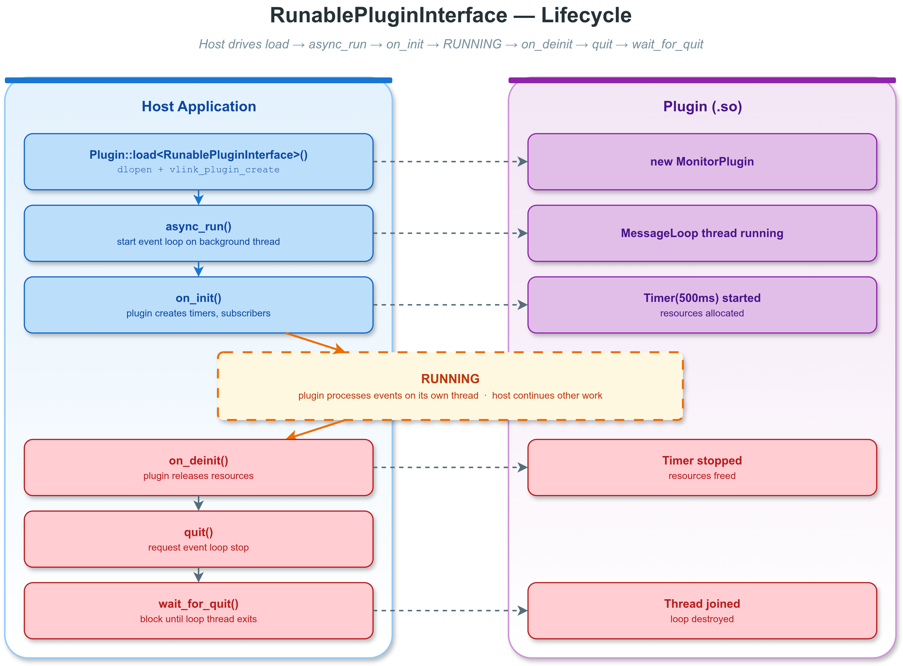

# RunablePluginInterface 示例 (Plugin Runnable)

## 概述

本示例演示 `RunablePluginInterface`——VLink 中将 `MessageLoop` 事件循环与 `Plugin` 动态加载系统结合的高级插件接口。

继承 `RunablePluginInterface` 的插件拥有自己的事件循环线程，可以独立处理定时器回调、异步任务等。宿主通过标准化的生命周期方法（`async_run` / `on_init` / `on_deinit` / `quit` / `wait_for_quit`）管理插件。



---

## 目录结构

```
plugin_runnable/
├── CMakeLists.txt              # 构建脚本：编译 .so + 宿主
├── monitor_plugin.cc           # 插件实现（编译为 libmonitor_plugin.so）
├── plugin_runnable.cc          # 宿主主程序
├── images/
│   ├── runnable-lifecycle.png     # 生命周期流程图
│   └── runnable-lifecycle.drawio  # 流程图源文件
└── README.md                   # 本文件
```

---

## 核心概念

### RunablePluginInterface 继承关系

```
MessageLoop
    └── RunablePluginInterface
            └── MonitorPlugin (用户实现)
```

`RunablePluginInterface` 继承自 `MessageLoop`，因此每个插件实例都是一个完整的事件循环。它添加了两个生命周期方法：

| 方法 | 调用时机 | 作用 |
|------|---------|------|
| `on_init()` | `async_run()` 之后 | 创建定时器、订阅者、初始化资源 |
| `on_deinit()` | `quit()` 之前 | 停止定时器、释放资源、清理状态 |

### 接口定义

`RunablePluginInterface` 定义在 `<vlink/extension/runnable_plugin_interface.h>` 中：

```cpp
class RunablePluginInterface : public MessageLoop {
  VLINK_PLUGIN_REGISTER(RunablePluginInterface)

 protected:
  RunablePluginInterface() = default;
  ~RunablePluginInterface() override = default;

 public:
  virtual void on_init() = 0;
  virtual void on_deinit() = 0;
};
```

关键点：
- 插件 ID 来自 `RunablePluginInterface`（不是用户的实现类）
- 构造函数和析构函数是 `protected` 的，防止直接实例化
- 继承了 `MessageLoop` 的所有方法：`async_run()`、`quit()`、`post_task()`、`wait_for_quit()` 等

---

## 插件实现 (monitor_plugin.cc)

### 代码结构

```cpp
class MonitorPlugin : public vlink::RunablePluginInterface {
  VLINK_PLUGIN_REGISTER(vlink::RunablePluginInterface)  // [1]

 public:
  void on_init() override {                              // [2]
    timer_ = std::make_unique<vlink::Timer>(
        this, 500, vlink::Timer::kInfinite,              // [3]
        [this]() {
          int count = tick_count_.fetch_add(1) + 1;
          int64_t elapsed_us = uptime_.get();
          VLOG_I("[MonitorPlugin] tick #", count,
                 "  uptime=", elapsed_us / 1000, " ms");
        });
    uptime_.start();
    timer_->start();                                     // [4]
  }

  void on_deinit() override {                            // [5]
    if (timer_) {
      timer_->stop();
      timer_.reset();
    }
    uptime_.stop();
  }

 private:
  std::unique_ptr<vlink::Timer> timer_;
  std::atomic<int> tick_count_{0};
  vlink::ElapsedTimer uptime_;
};

VLINK_PLUGIN_DECLARE(MonitorPlugin, 1, 0)                // [6]
```

### 代码逐行分析

**[1] VLINK_PLUGIN_REGISTER(vlink::RunablePluginInterface)**

注意使用完整的命名空间 `vlink::RunablePluginInterface`，而不是 `MonitorPlugin`。这确保插件 ID 与宿主的 `load<vlink::RunablePluginInterface>()` 匹配。

**[2] on_init() -- 初始化**

`on_init()` 在 `async_run()` 之后由宿主调用。此时 MessageLoop 已经在后台线程上运行，可以安全地创建定时器并启动它。

**[3] Timer 构造**

```cpp
vlink::Timer(this, 500, vlink::Timer::kInfinite, callback)
```

- `this` -- 将定时器绑定到插件自身的 MessageLoop
- `500` -- 每 500 毫秒触发一次
- `kInfinite` -- 无限次重复
- `callback` -- 定时器触发时执行的回调

Timer 的回调在 MessageLoop 线程上执行，与 `on_init()` / `on_deinit()` 在同一线程。

**[4] timer_->start()**

启动定时器。从此刻起，每 500ms 回调会在 MessageLoop 线程上触发一次。

**[5] on_deinit() -- 清理**

在宿主调用 `quit()` 之前，先调用 `on_deinit()` 让插件释放所有资源。这里停止并销毁定时器，打印统计信息。

**[6] VLINK_PLUGIN_DECLARE(MonitorPlugin, 1, 0)**

导出 C 入口点，版本 1.0。

---

## 宿主程序 (plugin_runnable.cc)

### 完整生命周期

```cpp
// 1. 加载
vlink::Plugin plugin;
auto monitor = plugin.load<vlink::RunablePluginInterface>(
    "monitor_plugin", 1, 0);

// 2. 启动事件循环
monitor->async_run();

// 3. 初始化插件
monitor->on_init();

// 4. 让插件运行 3 秒
std::this_thread::sleep_for(std::chrono::seconds(3));

// 5. 停止序列
monitor->on_deinit();      // 释放资源
monitor->quit();           // 请求事件循环停止
monitor->wait_for_quit();  // 等待后台线程退出

// 6. 卸载
monitor.reset();
plugin.clear();
```

### 各步骤详解

| 步骤 | 调用 | 线程 | 说明 |
|------|------|------|------|
| 1 | `load<RunablePluginInterface>()` | 主线程 | dlopen + vlink_plugin_create + new MonitorPlugin |
| 2 | `async_run()` | 主线程 | 创建后台线程，开始运行 MessageLoop |
| 3 | `on_init()` | 主线程* | 插件创建定时器和订阅者 |
| 4 | (等待) | 主线程 | 定时器回调在后台 MessageLoop 线程上执行 |
| 5a | `on_deinit()` | 主线程* | 插件停止定时器，释放资源 |
| 5b | `quit()` | 主线程 | 通知 MessageLoop 退出 |
| 5c | `wait_for_quit()` | 主线程 | 阻塞直到后台线程 join 完成 |
| 6 | `reset()` + `clear()` | 主线程 | 销毁实例，dlclose 共享库 |

> *注意：`on_init()` 和 `on_deinit()` 由宿主在主线程上调用，但它们创建的定时器和任务在后台 MessageLoop 线程上执行。如果需要确保 `on_init()` 中的操作在 MessageLoop 线程上执行，可以使用 `post_task()` 包装。

---

## Timer 与 MessageLoop 集成

### Timer 生命周期

```
on_init() 调用
    |
    v
Timer(this, 500, kInfinite, callback)
    |
    v
timer_->start()
    |
    v                     MessageLoop 后台线程
    +-----> [500ms] -----> callback() 执行
    +-----> [500ms] -----> callback() 执行
    +-----> [500ms] -----> callback() 执行
    |       ...
    v
on_deinit() 调用
    |
    v
timer_->stop()  -- 停止调度新回调
timer_.reset()  -- 销毁 Timer 对象
```

### ElapsedTimer 用法

`ElapsedTimer` 是一个高精度计时器，用于测量经过的时间：

```cpp
vlink::ElapsedTimer uptime_(
    vlink::ElapsedTimer::kCpuTimestamp,  // 单调时钟（不受 NTP 影响）
    vlink::ElapsedTimer::kMicro);        // 微秒精度

uptime_.start();
// ... 经过一段时间 ...
int64_t us = uptime_.get();  // 获取已过微秒数
uptime_.stop();
```

---

## CMake 构建

```cmake
# 插件共享库
add_library(monitor_plugin SHARED monitor_plugin.cc)
target_link_libraries(monitor_plugin vlink::all)
set_target_properties(monitor_plugin PROPERTIES
  LIBRARY_OUTPUT_DIRECTORY ${CMAKE_RUNTIME_OUTPUT_DIRECTORY}
)

# 宿主可执行文件
add_executable(example_plugin_runnable plugin_runnable.cc)
target_link_libraries(example_plugin_runnable vlink::all)
```

---

## 编译与运行

```bash
cd build
cmake .. -DENABLE_WHOLE_EXAMPLES=ON
make example_plugin_runnable monitor_plugin

./output/bin/example_plugin_runnable
```

预期输出（简化）：

```
[I] === RunablePluginInterface example ===
[I] RunablePluginInterface plugin_id: RunablePluginInterface
[I] Plugin loaded.
[I] Calling async_run() -- starting plugin event loop thread.
[I] Calling on_init().
[I] [MonitorPlugin] on_init -- creating 500ms timer
[I] Sleeping 3 seconds while plugin runs...
[I] [MonitorPlugin] tick #1  uptime=500 ms
[I] [MonitorPlugin] tick #2  uptime=1001 ms
[I] [MonitorPlugin] tick #3  uptime=1501 ms
[I] [MonitorPlugin] tick #4  uptime=2002 ms
[I] [MonitorPlugin] tick #5  uptime=2502 ms
[I] [MonitorPlugin] tick #6  uptime=3002 ms
[I] Calling on_deinit() -- plugin releases resources.
[I] [MonitorPlugin] on_deinit -- stopping timer
[I] [MonitorPlugin] total ticks=6  total uptime=3005 ms
[I] Calling quit() -- requesting event loop stop.
[I] Calling wait_for_quit() -- waiting for loop thread exit.
[I] Releasing shared_ptr and clearing plugin loader.
[I] Plugin runnable example complete.
```

---

## 与 ProxyServer 集成

VLink 的 `ProxyServer` 可以通过配置文件自动加载 `RunablePluginInterface` 插件，管理其完整生命周期。这意味着插件不需要自己编写宿主程序——ProxyServer 负责加载、启动、停止和卸载。

### 典型集成模式

```
ProxyServer 启动
    |
    v
读取配置文件 -> 发现插件列表
    |
    v
对每个插件:
    Plugin::load<RunablePluginInterface>(name, major, minor)
    runnable->async_run()
    runnable->on_init()
    |
    v
ProxyServer 运行中（插件独立处理事件）
    |
    v
ProxyServer 关闭:
    runnable->on_deinit()
    runnable->quit()
    runnable->wait_for_quit()
    Plugin::clear()
```

---

## 高级用法

### 在 on_init() 中创建订阅者

```cpp
void on_init() override {
  // 创建订阅者，绑定到插件自身的 MessageLoop
  sub_ = std::make_unique<vlink::Subscriber<vlink::Bytes>>("shm://sensor/data");
  sub_->attach(this);  // this = 插件的 MessageLoop
  sub_->listen([](const vlink::Bytes& data) {
    VLOG_I("Received ", data.size(), " bytes");
  });
}
```

### 使用 post_task() 在 MessageLoop 线程上执行

```cpp
void on_init() override {
  // 确保初始化代码在 MessageLoop 线程上执行
  this->post_task([this]() {
    // 这段代码运行在 MessageLoop 线程上
    timer_ = std::make_unique<vlink::Timer>(this, 100, -1, []() {
      VLOG_I("tick");
    });
    timer_->start();
  });
}
```

### wait_for_quit 超时

```cpp
// 最多等 5 秒，超时后强制退出
monitor->quit(true);  // force=true，丢弃队列中的待处理任务
bool exited = monitor->wait_for_quit(5000);  // 5000ms 超时
if (!exited) {
  VLOG_W("Plugin did not exit within 5 seconds.");
}
```

---

## 注意事项

- `on_init()` 必须在 `async_run()` 之后调用，此时事件循环已在运行
- 不要在 `on_init()` / `on_deinit()` 中执行长时间阻塞操作
- 所有 Timer 回调都在插件自身的 MessageLoop 线程上执行
- 调用 `quit()` 后，MessageLoop 不再接受新任务
- `wait_for_quit()` 默认无限等待，生产环境应设置超时
- 插件 .so 在所有 `shared_ptr` 引用释放后才会被 dlclose
- 先 `on_deinit()` 释放资源，再 `quit()` 停止循环，最后 `wait_for_quit()` 等待线程退出

---

## 常见问题

**Q: on_init() 和 on_deinit() 在哪个线程执行？**

它们由宿主调用，运行在宿主调用它们的线程上（通常是主线程）。但它们创建的定时器和订阅者的回调在 MessageLoop 的后台线程上执行。

**Q: 可以在 on_init() 之前调用 async_run() 吗？**

是的，这是正确的顺序。`async_run()` 启动后台线程，`on_init()` 在其上创建资源。

**Q: 如果不调用 on_deinit() 直接 quit() 会怎样？**

插件的资源（定时器、订阅者）会在析构函数中被销毁，但可能不够优雅。建议始终显式调用 `on_deinit()` 进行有序清理。

**Q: 一个进程可以加载多个 RunablePluginInterface 插件吗？**

可以。每个插件拥有独立的 MessageLoop 线程。使用不同的库名即可：

```cpp
auto plugin_a = loader.load<vlink::RunablePluginInterface>("plugin_a", 1, 0);
auto plugin_b = loader.load<vlink::RunablePluginInterface>("plugin_b", 1, 0);
```
