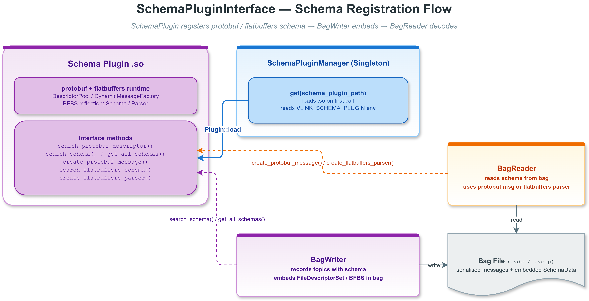

# SchemaPluginInterface 概念示例

## 1. 概述

本示例演示 VLink 的 `SchemaPluginInterface` 和 `SchemaPluginManager` API——一个用于运行时 protobuf/flatbuffers schema 查找、模式序列化和动态解析的插件接口。

`SchemaPluginInterface` 是 VLink 录制/回放系统的关键组件。它使得 BagWriter 能够将 protobuf `FileDescriptorSet` 或 flatbuffers BFBS 嵌入录制文件，并让运行时工具动态恢复对应 schema。

由于实际的 SchemaPlugin .so 需要 protobuf / flatbuffers 运行时依赖，本示例以概念演示的方式展示 API，当 .so 不可用时打印清晰的解释而不是崩溃。



---

## 2. 目录结构

```
plugin_schema/
├── CMakeLists.txt              # 构建脚本
├── plugin_schema.cc             # 概念演示程序
├── images/
│   ├── schema-plugin-flow.png     # 模式注册流程图
│   └── schema-plugin-flow.drawio  # 流程图源文件
└── README.md                   # 本文件
```

---

## 3. SchemaPluginInterface 接口

### 3.1 接口定义

```cpp
class SchemaPluginInterface {
  VLINK_PLUGIN_REGISTER(SchemaPluginInterface)

 public:
  using ProtobufDescriptorPtr = void*;
  using ProtobufMessagePtr = void*;
  using FlatbuffersSchemaPtr = void*;
  using FlatbuffersParserPtr = void*;

  struct VersionInfo final {
    std::string name;
    std::string version;
    std::string timestamp;
    std::string tag;
    std::string commit_id;
  };

  virtual VersionInfo get_version_info() const = 0;
  virtual ProtobufDescriptorPtr search_protobuf_descriptor(const std::string& name) = 0;
  virtual SchemaData search_schema(const std::string& name,
                                   SchemaType schema_type = SchemaType::kUnknown) = 0;
  virtual std::vector<SchemaData> get_all_schemas(SchemaType schema_type = SchemaType::kUnknown) = 0;
  virtual ProtobufMessagePtr create_protobuf_message(const std::string& name) = 0;
  virtual FlatbuffersSchemaPtr search_flatbuffers_schema(const std::string& name) = 0;
  virtual FlatbuffersParserPtr create_flatbuffers_parser(const std::string& name) = 0;
};
```

### 3.2 核心方法

| 方法 | 参数 | 返回值 | 用途 |
|------|------|--------|------|
| `search_protobuf_descriptor(name)` | 完全限定消息类型名 | `Descriptor*`（类型擦除） | 查找 protobuf 描述符 |
| `search_schema(name, schema_type)` | 完全限定消息类型名，外加 schema family hint | `SchemaData` | 返回指定 family 的 protobuf `FileDescriptorSet` 或 flatbuffers BFBS |
| `get_all_schemas(schema_type)` | 可选的 schema family 过滤条件 | `std::vector<SchemaData>` | 返回插件当前缓存/导入的全部 schema |
| `create_protobuf_message(name)` | 完全限定消息类型名 | `Message*`（类型擦除） | 创建动态 protobuf 消息原型 |
| `search_flatbuffers_schema(name)` | 完全限定消息类型名 | `reflection::Schema*`（类型擦除） | 查找 BFBS 反射句柄 |
| `create_flatbuffers_parser(name)` | 完全限定消息类型名 | `flatbuffers::Parser*`（类型擦除） | 创建已设置 root type 的独立运行时 parser |

### 3.3 VersionInfo 结构

`get_version_info()` 返回插件的构建元数据：

| 字段 | 含义 |
|------|------|
| `name` | 插件显示名称 |
| `version` | 语义版本号（如 "1.2.3"） |
| `timestamp` | 构建时间戳 |
| `tag` | 源代码控制标签 |
| `commit_id` | 源代码提交哈希 |

### 3.4 SchemaData 结构

```cpp
struct SchemaData final {
  std::string name;        // 完全限定消息类型名
  std::string encoding;    // "protobuf" / "flatbuffers" / "vlink_msg"
  SchemaType schema_type;  // kProtobuf / kFlatbuffers / kRaw / kZeroCopy / kUnknown
  Bytes data;              // protobuf 为 FileDescriptorSet，flatbuffers 为 BFBS
};
```

`SchemaData` 包含完整的模式信息，可以嵌入到 bag 录制文件（如 `.vdb` / `.vcap`）中。BagReader 在回放时使用这些信息重建描述符池，实现无生成代码的动态反序列化。

---

## 4. SchemaPluginBase 的真实职责

`SchemaPluginBase` 的默认行为分成两部分：

1. protobuf 侧沿用之前 protobuf-only 运行时的行为，直接从 `google::protobuf::DescriptorPool::generated_pool()` 查找已经链接进当前插件/库的消息描述
2. flatbuffers 侧没有类似 protobuf generated pool 的全局注册中心，因此需要插件显式注册已经编译进二进制的 BFBS

这意味着 `SchemaPluginBase` 本身不负责：

- 读取 `VLINK_PROTO_DIR`
- 读取 `VLINK_FBS_DIR`
- 扫描 `.proto` / `.fbs` 文件目录

推荐的 FlatBuffers 方式是构建期生成嵌入式 BFBS 代码，例如使用 `flatc --bfbs-gen-embed`，然后在类外通过静态注册完成 BFBS 导入。

如果使用 `vlink_generate_cpp(FBS ...)`，生成结果会同时包含常规头 `xxx.fbs.hpp` 和 BFBS 嵌入头 `xxx_bfbs.fbs.hpp`；`vlink_generate_flatbuffers_registry_cpp()` 会自动引用后者来生成注册代码。

---

## 5. SchemaPluginManager 单例

### 5.1 接口

```cpp
class SchemaPluginManager final {
 public:
  static SchemaPluginManager& get(const std::string& schema_plugin_path = "");
  bool is_valid() const;
  std::shared_ptr<SchemaPluginInterface> get_interface() const;
};
```

### 5.2 工作流程

```
首次调用 get()
    |
    +--> schema_plugin_path 非空？ ----YES----> 加载指定的 .so
    |                        ----NO-----> 检查 VLINK_SCHEMA_PLUGIN 环境变量
    |                                         |
    |                                    设置了？--YES--> 加载环境变量指定的 .so
    |                                         |--NO---> manager 无效
    |
    v
后续调用 get() --> 直接返回已有的单例（忽略 schema_plugin_path）
```

### 5.3 使用模式

```cpp
// 方式 1：通过环境变量
// export VLINK_SCHEMA_PLUGIN=/path/to/schema_plugin.so
vlink::SchemaPluginManager& mgr = vlink::SchemaPluginManager::get();

// 方式 2：显式指定路径（首次调用有效）
vlink::SchemaPluginManager& mgr = vlink::SchemaPluginManager::get("/path/to/schema_plugin.so");

if (mgr.is_valid()) {
  auto iface = mgr.get_interface();
  vlink::SchemaData schema = iface->search_schema("my.package.MyMessage", vlink::SchemaType::kProtobuf);
}
```

---

## 6. 示例代码分析 (plugin_schema.cc)

### 6.1 直接加载模式

```cpp
static void demo_direct_load() {
  vlink::Plugin plugin;
  plugin.set_log_level(vlink::Logger::kInfo);

  const char* env_name = std::getenv("VLINK_SCHEMA_PLUGIN");
  std::string lib_name = env_name ? env_name : "vlink_schema_plugin";

  auto schema_plugin = plugin.load<vlink::SchemaPluginInterface>(lib_name, 1, 0);
  if (!schema_plugin) {
    VLOG_W("Schema plugin not available.");
    return;
  }

  // 使用接口
  vlink::SchemaPluginInterface::VersionInfo ver = schema_plugin->get_version_info();
  vlink::SchemaData schema = schema_plugin->search_schema("example.SensorData", vlink::SchemaType::kProtobuf);
  auto* msg = schema_plugin->create_protobuf_message("example.SensorData");
  auto* parser = schema_plugin->create_flatbuffers_parser("example.SensorFrame");
}
```

直接加载模式使用 `Plugin::load<SchemaPluginInterface>()` 手动管理插件生命周期。适用于需要精细控制的场景。

### 6.2 单例管理器模式

```cpp
static void demo_manager() {
  vlink::SchemaPluginManager& mgr = vlink::SchemaPluginManager::get();

  if (!mgr.is_valid()) {
    VLOG_W("No schema plugin loaded.");
    return;
  }

  auto iface = mgr.get_interface();
  vlink::SchemaData schema = iface->search_schema("example.SensorData", vlink::SchemaType::kProtobuf);
}
```

单例模式更简洁，适用于全局共享的场景（如 BagWriter/BagReader）。

---

## 7. 与录制/回放系统的集成

### 7.1 BagWriter 录制流程

```
Publisher<T> 发布消息
    |
    v
BagWriter 接收消息
    |
    v
SchemaPluginInterface::search_schema(type_name, schema_type)
    |
    v
将 SchemaData 嵌入 bag 文件头部
    |
    v
将消息数据写入 bag 文件
```

### 7.2 BagReader 回放流程

```
BagReader 打开 bag 文件
    |
    v
从文件头读取 SchemaData
    |
    v
SchemaPluginInterface::create_protobuf_message(type_name)
    |
    v
使用动态 Message 反序列化录制的数据
    |
    v
重建原始消息并回放
```

### 7.3 核心优势

1. **解耦**：主应用不需要链接 Protobuf 库
2. **动态**：运行时加载描述符，不需要预生成代码
3. **可扩展**：更换 .so 即可支持新的消息类型
4. **版本管理**：不同版本的 protobuf / flatbuffers schema 可以使用不同的插件

---

## 8. 编写自定义 SchemaPlugin

### 8.1 实现步骤

1. 继承 `SchemaPluginBase`
2. 让 protobuf 从当前库的 generated descriptors 按需查询，并为 flatbuffers 静态注册 BFBS
3. 实现版本信息接口
4. 使用 `VLINK_PLUGIN_DECLARE` 导出

### 8.2 概念代码

```cpp
#define VLINK_SCHEMA_PLUGIN_IMPL
#include <vlink/extension/schema_plugin_base.h>

class MySchemaPlugin : public vlink::SchemaPluginBase {
 public:
  VersionInfo get_version_info() const override {
    return {"MySchemaPlugin", "1.0.0", __TIMESTAMP__, "v1.0", "abc123"};
  }
};

VLINK_PLUGIN_DECLARE(MySchemaPlugin, 1, 0)

// flatbuffers: 在类外注册编译期嵌入的 BFBS
// 仅注册 BFBS 时也可以单独包含 <vlink/extension/flatbuffers_registry.h>
// VLINK_REGISTER_FLATBUFFERS("my.pkg.MyMessage", MyMessageBinarySchema);
```

---

## 9. 环境变量

| 变量 | 作用 |
|------|------|
| `VLINK_SCHEMA_PLUGIN` | SchemaPluginManager 使用此变量查找 .so 路径 |
| `VLINK_PLUGIN_DIR` | Plugin 搜索路径的额外目录 |

设置示例：

```bash
export VLINK_SCHEMA_PLUGIN=/opt/vlink/lib/libvlink_schema_plugin.so
```

---

## 10. 编译与运行

```bash
cmake -B build -S . -DCMAKE_PREFIX_PATH=/path/to/vlink/install
cmake --build build --target example_plugin_schema

# 不设置环境变量（展示 API 概念）
./build/output/bin/example_plugin_schema

# 设置环境变量（如果有 schema plugin .so）
VLINK_SCHEMA_PLUGIN=/path/to/schema_plugin.so ./build/output/bin/example_plugin_schema
```

预期输出（无 schema plugin .so 时）：

```
[I] === SchemaPluginInterface conceptual demo ===
[I]
[I] SchemaPluginInterface provides six capabilities:
[I]   1. search_protobuf_descriptor(name) -- lookup a Protobuf Descriptor by type name
[I]   2. search_schema(name, schema_type) -- return protobuf/flatbuffers schema payloads
[I]   3. get_all_schemas(schema_type)     -- enumerate cached/imported schema payloads
[I]   4. create_protobuf_message(name)    -- create a dynamic Protobuf Message prototype
[I]   5. search_flatbuffers_schema(name)  -- lookup a BFBS reflection schema
[I]   6. create_flatbuffers_parser(name)  -- create a runtime FlatBuffers parser
[I]
[I] === Direct Plugin::load<SchemaPluginInterface> demo ===
[I] Attempting to load SchemaPluginInterface from: vlink_schema_plugin
[I] SchemaPluginInterface plugin_id: SchemaPluginInterface
[W] Schema plugin not available (protobuf dependency required).
[I] Set VLINK_SCHEMA_PLUGIN=<path_to_so> to enable this demo.
[I] Skipping direct-load demo.
[I]
[I] === SchemaPluginManager singleton demo ===
[W] SchemaPluginManager: no plugin loaded.
[I] Set VLINK_SCHEMA_PLUGIN environment variable to the .so path.
[I] Skipping manager demo.
[I]
[I] Schema plugin example complete.
```

---

## 11. 类型擦除设计

`SchemaPluginInterface` 使用 `void*` 进行类型擦除：

```cpp
using ProtobufDescriptorPtr = void*;
using ProtobufMessagePtr = void*;
using FlatbuffersSchemaPtr = void*;
using FlatbuffersParserPtr = void*;
```

这样做的原因：

1. **依赖解耦**：接口头文件不需要包含 protobuf / flatbuffers 头文件
2. **ABI 稳定**：`void*` 在所有编译器上大小相同
3. **灵活性**：调用者可以根据需要将 `void*` 转换回具体类型

在知道具体类型的调用者中，可以安全地进行类型转换：

```cpp
auto desc_ptr = schema_plugin->search_protobuf_descriptor("my.Message");
auto* desc = static_cast<const google::protobuf::Descriptor*>(desc_ptr);

auto msg_ptr = schema_plugin->create_protobuf_message("my.Message");
auto* msg = static_cast<google::protobuf::Message*>(msg_ptr);
```

---

## 12. 与其他插件类型的对比

| 特性 | 基本插件 | RunablePluginInterface | SchemaPluginInterface |
|------|---------|----------------------|---------------------|
| 事件循环 | 无 | 有（内置 MessageLoop） | 无 |
| 生命周期方法 | 无 | on_init / on_deinit | 无 |
| 主要用途 | 通用扩展 | 自治组件 | 序列化/反序列化 |
| 管理器 | 手动 Plugin | 手动或 ProxyServer | SchemaPluginManager 单例 |
| 依赖 | vlink::all | vlink::all | vlink::all + protobuf（仅插件端） |

---

## 13. 注意事项

- 本示例是概念演示，不构建实际的 schema plugin .so
- 实际的 SchemaPlugin 实现需要链接 Protobuf 库
- `SchemaPluginManager::get()` 是进程级单例，首次调用后插件名参数被忽略
- `search_schema(name, schema_type)` 会按 schema family 分开缓存结果
- `create_protobuf_message()` 和 `create_flatbuffers_parser()` 返回的运行时句柄都由插件拥有，生命周期与插件相同；FlatBuffers parser 每次调用返回独立实例
- `VLINK_SCHEMA_PLUGIN` 环境变量在 `SchemaPluginManager` 首次调用时读取
