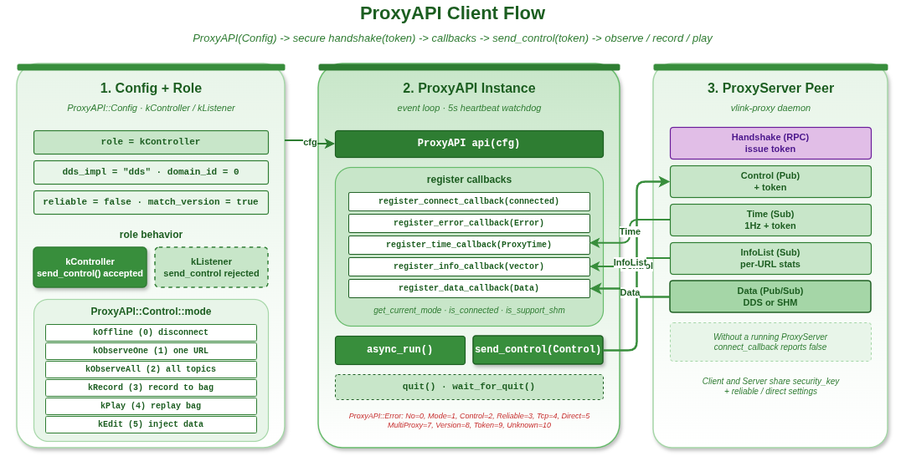

# proxy_api_basic — ProxyAPI 客户端：配置、角色、模式、回调

本示例演示 `vlink::ProxyAPI`（Proxy 客户端）的基础用法：构造 `Config`、注册各类回调（连接 / 错误 / 时钟 / 信息列表 / 数据）、发送 `Control` 命令。前提是另一进程跑着 `ProxyServer`；没有 Server 时握手失败并触发 `ErrorCallback(kTokenError)`。

读完本示例你能掌握：

- ProxyAPI Config 的各个字段语义。
- Controller / Listener 两种 Role 的差异。
- 八种 Mode 的工程含义。
- 完整的错误码体系。

## 背景与适用场景

适用：

- 写远程调试 / 监控工具的客户端侧。
- 跨机器/跨进程"观察 vlink topics"的需求。
- 录制 / 回放控制（remote bag recorder）。
- 测试时往目标进程注入消息。

不适合：

- 同进程内的消息查看（直接订阅就行）。
- 极致吞吐的数据通道（Proxy 走 Handshake / Control / Time / InfoList 四条控制面通道 + Data 一条数据面通道，控制面 1 Hz 节奏；Data 走 `zerocopy::ProxyData` 零拷贝）。

## 角色

| Role | 说明 |
|------|------|
| `kController` | 可发 `send_control()` / `send_data()`；Server 接受其握手得到的 token |
| `kListener` | 被动观察者；`send_control()` / `send_data()` 直接返回 false |

## 模式（`ProxyAPI::Mode`）

| 值 | 模式 | 含义 |
|---|------|------|
| 0 | `kOffline` | 未连接 / 取消所有订阅 |
| 1 | `kObserveOne` | 观察 `url_meta_list` 中的单个 topic |
| 2 | `kObserveAll` | 观察所有已发现的 topic |
| 3 | `kRecord` | 录制 `url_meta_list` 中的 topic |
| 4 | `kPlay` | 回放/注入数据（由 controller 通过 `send_data()` 喂入） |
| 5 | `kEdit` | 转发 controller 注入的数据 |
| 6 | `kAuto` | 观察指定 topic 并接受 controller 注入 |
| 7 | `kAutoAndObserveAll` | `kAuto` + 全量 observe |

## 核心 API

| API | 签名 | 说明 |
|-----|------|------|
| `ProxyAPI(const Config&)` | 构造 | 同时启动握手流程（通过 1 Hz 心跳重试） |
| `async_run()` | `void` | 启动内部事件线程；之后回调随时可能触发 |
| `quit()` / `wait_for_quit()` | `void` | 优雅停机 |
| `send_control` | `bool send_control(const Control&, bool async = true)` | Controller 专用，发 Control 命令；返回 false 表示本地路径已拒绝（Server token 校验另算） |
| `send_data` | `bool send_data(const Data&)` | Controller 专用，注入数据；要求 `data.url / ser / schema` 非空 |
| `register_connect_callback` | `void(MoveFunction<void(bool)>&&)` | 连接态变化（基于 1 Hz 心跳判定） |
| `register_error_callback` | `void(MoveFunction<void(Error)>&&)` | 错误码变化 |
| `register_time_callback` | `void(MoveFunction<void(uint64_t sys, uint64_t boot)>&&)` | Server 心跳里携带的时间戳 |
| `register_info_callback` | `void(MoveFunction<void(const std::vector<Info>&)>&&)` | 每秒一次的话题统计列表 |
| `register_data_callback` | `void(MoveFunction<void(const Data&)>&&)` | 关心模式下转发到的原始数据 |
| `get_current_mode` / `is_connected` | 查询 | 内省 |

## Config 字段

```cpp
vlink::ProxyAPI::Config cfg;
cfg.role          = vlink::ProxyAPI::kController;
cfg.dds_impl      = "dds";    // DDS 实现：dds / ddsc / ddsr / ...
cfg.domain_id     = 0;
cfg.security_key  = "";       // 非空时与 ProxyServer 必须一致
cfg.reliable      = false;    // DDS reliable 模式，必须与 server 一致
cfg.direct        = false;    // 直连 SHM 模式，必须与 server 一致
cfg.enable_tcp    = false;    // TCP 数据传输，必须与 server 一致
cfg.native        = false;    // 仅本地 127.0.0.1 流量
cfg.match_version = true;     // 严格 vlink 版本匹配
```

## 错误码

| Code | 名称 | 原因 |
|---:|------|------|
| 0 | `kNoError` | OK |
| 2 | `kControlError` | Server 上报的 `control_id` 不匹配 |
| 3-5 | `kReliable/Tcp/DirectCompError` | client 与 server 的 reliable/tcp/direct 配置不一致 |
| 7 | `kMultiProxyError` | DDS 域内检测到多个 Server，或心跳身份漂移 |
| 8 | `kVersionCompError` | `VLINK_VERSION` 字符串不匹配 |
| 9 | `kTokenError` | 握手被拒 / token 失配 |

## 代码导读

### 1. 构造 + 注册回调

```cpp
vlink::ProxyAPI::Config cfg;
cfg.role = vlink::ProxyAPI::kController;
cfg.dds_impl = "dds";
cfg.domain_id = 0;

vlink::ProxyAPI api(cfg);  // 构造即启动握手重试

api.register_connect_callback([](bool connected) { /* ... */ });
api.register_error_callback([](vlink::ProxyAPI::Error e) { /* ... */ });
api.register_info_callback([](const std::vector<vlink::ProxyAPI::Info>& list) { /* ... */ });
api.register_data_callback([](const vlink::ProxyAPI::Data& data) { /* ... */ });
```

### 2. 启动事件循环

```cpp
api.async_run();
```

### 3. 切换模式 + 发 Control

```cpp
vlink::ProxyAPI::Control ctrl;
ctrl.mode = vlink::ProxyAPI::kObserveAll;
api.send_control(ctrl);  // 默认 async=true
```

### 4. 注入数据（Edit / Play 模式）

```cpp
vlink::ProxyAPI::Data data;
data.url = "intra://debug/inject";
data.ser = "demo.Proto.Hello";
data.schema = vlink::SchemaType::kProtobuf;
data.raw = vlink::Bytes::from_string("hello");
api.send_data(data);
```

### 5. 停机

```cpp
api.quit();
api.wait_for_quit();
```

## 运行

```bash
# 在另一终端先跑 server
./build/output/bin/example_proxy_server_basic &

# 再跑 api
./build/output/bin/example_proxy_api_basic
```

预期输出（节选）：

```
[ProxyAPI] connection: up
[ProxyAPI] info for N topics
[ProxyAPI] data from: intra://... size=...
```

没有 Server 时：

```
[ProxyAPI] error code: 9    (kTokenError, 等待握手)
[ProxyAPI] connection: down
```

## 常见陷阱

1. **没启 Server**：1 Hz 心跳路径会持续重握手，期间 `is_connected()` 返回 false。
2. **`security_key` 不一致**：握手失败；要么两端都设同样 key、要么都留空。
3. **reliable / tcp / direct 配置不匹配**：心跳上报 3-5 系列错误；client 和 server 必须一致。
4. **Listener 调 `send_control` / `send_data`**：返回 false；权限不足。
5. **回调里阻塞**：ProxyAPI 内部线程阻塞，影响心跳和数据接收，应另起线程处理重活。

## 设计要点

- ProxyAPI ↔ ProxyServer 共五条信道：`Handshake`（DDS 安全 RPC，拉 token）+ `Control` / `Time` / `InfoList`（DDS 安全 pub/sub） + `Data`（DDS / SHM pub/sub，走 `zerocopy::ProxyData`）。
- 握手用 RPC（client 拿到 128-bit token；后续 Control 必须带 token，Time 心跳必须回显 token）。
- 心跳每秒一次，含 server 端 CPU / mem 状态、版本、hostname、token。

## 配图



图中展示 ProxyAPI 从握手 → Control 发送 → InfoList/Data 回流的完整时序。

## 参考

- `../proxy_server_basic/` — Server 端
- `../proxy_runnable_plugin/` — Runnable 插件集成
- `vlink/include/vlink/external/proxy_api.h` — 接口
- 顶层 `doc/16-proxy.md` — Proxy 章节
